```{r setup, include=FALSE}
knitr::opts_chunk$set(message = FALSE, warning = FALSE)
```

```{r}
pacman::p_load(sjPlot, htmltools, sjlabelled,readr, summarytools, haven, dplyr,kableExtra,readxl, ggplot2,ggtext)
```

```{r}
# BBDD
ola1<-read_dta("../input/data/proc/data_01.dta")
ola2<-read_dta("../input/data/proc/data_02.dta")
ola3<-read_dta("../input/data/proc/data_03.dta")

#data_wide <- full_join(x = ola1, #datos ola 1
#y = ola2, #datos ola 2
#by = "folio_encuestado", #identificador
#aplica sufijo a variables que se repiten entre olas
#suffix = c("_w01",
#"_w02")) %>%
#left_join(ola3,
#by = "folio_encuestado")

# n fijado a ola 3
data_wide <- left_join(x = ola3, #datos ola 3
y = ola2, #datos ola 2
by = "folio_encuestado", #identificador
#aplica sufijo a variables que se repiten entre olas
suffix = c("_w03",
"_w02")) %>%
left_join(ola1,
by = "folio_encuestado")
```

En el presente documento se exponen los resultados correspondientes a un análisis descriptivo bivariado entre diferentes variables relativas a la participación política (dos tipos de participación activista y votar en elecciones) y cuatro variables que se espera que se relacionen con estos proxys de participación: la dependencia administrativa del establecimiento donde estudió los últimos dos años de enseñanza media, el máximo nivel educativo de la madre, el máximo nivel educativo del padre y la frecuencia de conversación sobre temas sociales y políticos con los padres.

# Participación activista

La participación activista se midió a través de una serie de indicadores que se presentan bajo la pregunta general "¿con qué frecuencia realizó las siguientes actividades?", teniendo como alternativas de respuesta *1. Nunca, 2. Casi nunca, 3. A veces, y 4. Frecuentemente*. 

Se presentaron los mismos indicadores junto con la misma pregunta y sus alternativas de respuesta para consultar por distintos momentos en el tiempo. Más específicamente, se consultó por la participación activista durante: (1) el periodo en que el encuestado cursaba 3° y 4° Medio, (2) estallido social, (3) el año 2020, (4) el primer semestre de 2021 y (5) el segundo semestre de 2021.

## Activismo disruptivo

Para medir el activismo disruptivo se creo un índice sumativo que incorporó los cuatro indicadores relacionados con este tipo de participación, calculando el promedio de participación activista disruptiva manteniendo la escala original de valores (1 a 4). Se incorporaron los siguientes indicadores:

+ Participar en una marcha o manifestación con disturbios
+ Participar en bloqueo de calles o carreteras
+ Pintar o rayar paredes con demandas o consignas
+ Participar en la toma de un edificio o institución

En el gráfico a continuación se presenta el puntaje promedio de participación activista disruptiva en cada uno de los momentos sobre los que se consultó. Como se puede ver, la participación activista disruptiva en general alcanza niveles bajos (todos los promedios son cercanos a 1, valor que corresponde al más bajo de la escala), no superando los 2 puntos en ninguno de los momentos por los que se consultó. Los niveles más altos de participación disruptiva corresponden al periodo en que el encuestado estudió la enseñanza media y al periodo del estallido social.

```{r}
### Crear variable participación política durante 3ro y 4to medio
data_wide$part_act_dis_3y4 <- as.numeric(data_wide$part_pol_marcha_dis + data_wide$part_pol_bloqueo + data_wide$part_pol_rayar.y + data_wide$part_pol_toma.y)/4

### Crear variable participación política durante estallido social
data_wide$part_act_dis_es <- as.numeric(data_wide$part_pol_marc_dis_21 + data_wide$part_pol_bloq_21 + data_wide$part_pol_rayar_21 + data_wide$part_pol_toma_21)/4

### Crear variable participación política durante el 2020
data_wide$part_act_dis_20 = as.numeric(data_wide$part_pol_marc_dis_20 + data_wide$part_pol_bloq_20 + data_wide$part_pol_rayar_20 + data_wide$part_pol_toma_20)/4

### Crear variable participación política durante el primer semestre de 2021
data_wide$part_act_dis_21_1s = as.numeric(data_wide$part_pol_marcha_dis + data_wide$part_pol_bloq + data_wide$part_pol_rayar.x + data_wide$part_pol_toma.x)/4

### Crear variable participación política durante el segundo semestre de 2021
data_wide$part_act_dis_21_2s = as.numeric(data_wide$part_pol_marc_dis_21b + data_wide$part_pol_bloq_21b + data_wide$part_pol_rayar_21b + data_wide$part_pol_toma_21b)/4
```

```{r}
table_preposh1<- rbind(psych::describe(data_wide$part_act_dis_3y4, na.rm=T),
               psych::describe(data_wide$part_act_dis_es, na.rm=T),
               psych::describe(data_wide$part_act_dis_20, na.rm=T),
               psych::describe(data_wide$part_act_dis_21_1s, na.rm=T),
               psych::describe(data_wide$part_act_dis_21_2s, na.rm=T))

table_preposh1 <- table_preposh1 %>% select(n,mean,sd,median,trimmed,min,max)
pond1 <- stats::weighted.mean(x=data_wide$part_act_dis_3y4,y=data_wide$weight_w01,na.rm=TRUE)
pond2 <- stats::weighted.mean(x=data_wide$part_act_dis_es,y=data_wide$weight_w01,na.rm=TRUE)
pond3 <- stats::weighted.mean(x=data_wide$part_act_dis_20,y=data_wide$weight_w01,na.rm=TRUE)
pond4 <- stats::weighted.mean(x=data_wide$part_act_dis_21_1s,y=data_wide$weight_w02,na.rm=TRUE)
pond5 <- stats::weighted.mean(x=data_wide$part_act_dis_21_2s,y=data_wide$weight_w03,na.rm=TRUE)

table_preposh1[1,2]<-pond1
table_preposh1[2,2]<-pond2
table_preposh1[3,2]<-pond3
table_preposh1[4,2]<-pond4
table_preposh1[5,2]<-pond5

table_preposh1$dep <- c("1. Durante 3ro y 4to medio", "2. Durante el estallido social", "3. Durante el 2020", "4. Durante el 1er sem. de 2021", "5. Durante el 2do sem. de 2021")

part_act_dis <-  ggplot(data=table_preposh1, aes(x=dep, y=mean, fill=dep)) +
     geom_bar(position = 'dodge', stat='identity')+#,width=0.8) 
     scale_fill_brewer(palette="Purples") +
     geom_text(aes(label=format(round(mean,2)), y=0), position=position_dodge(0.9), hjust=-0.25, size=6) +
     theme_bw(base_size = 14) +
     scale_y_continuous(labels = scales::comma) +
     ylab('Puntaje promedio en participación activista 
disruptiva (escala de 1 a 4)') + xlab(' ') + 
     theme(legend.position="top") +
     labs(fill = " ") +
    coord_flip()+
    theme(axis.text.x = element_text(colour = "grey20", size = 14, angle = 360, hjust = 0.5, vjust = 0.5, face = "bold"),
          axis.text.y = element_text(colour = "grey20", size = 14), 
          text = element_text(size = 14, face = "bold"),
          plot.title = element_text(hjust=0.5),
          legend.position = "none") + 
     ggtitle("Participación activista disruptiva") + ylim(0,4)
#part_act_dis
ggsave(part_act_dis, file = "../output/graphs/part_act_dis.png",device = "png",width = 23,height = 13,dpi = "retina",units = "cm")
```


### Dependencia administrativa establecimiento

En esta sección se presentan los resultados descriptivos de la relación entre la dependencia administrativa del establecimiento en que el encuestado estudió sus dos últimos años de enseñanza media y su participación activista disruptiva.

En términos generales, es posible visualizar que no hay un patrón claro de la relación entre ambas variables. En otras palabras, los resultados expuestos en los gráficos no evidencian una relación consistente entre la dependencia administrativa del establecimiento y la participación disruptiva. Sin embargo, se muestra una relación entre haber asistido a un establecimiento municipal y realizar prácticas de activismo disruptivo durante 3ro y 4to medio.

#### **Participación política durante 3ro y 4to medio**
```{r}
### Crear variable participación política durante 3ro y 4to medio
data_wide$part_act_dis_3y4 <- as.numeric(data_wide$part_pol_marcha_dis + data_wide$part_pol_bloqueo + data_wide$part_pol_rayar.y + data_wide$part_pol_toma.y)/4
```

```{r}
# Creación de bbdd
data_mun = data_wide %>%  filter(edm_admi==1) %>% as.data.frame() #Municipal
data_sub = data_wide %>%  filter(edm_admi==2) %>% as.data.frame() #Particular Subvencionado
data_priv = data_wide %>%  filter(edm_admi==3) %>% as.data.frame() #Particular pagado
```

```{r}
table_preposh1<- rbind(psych::describe(data_mun$part_act_dis_3y4, na.rm=T),
               psych::describe(data_sub$part_act_dis_3y4, na.rm=T),psych::describe(data_priv$part_act_dis_3y4, na.rm=T))
table_preposh1 <- table_preposh1 %>% select(n,mean,sd,median,trimmed,min,max)
pond1 <- stats::weighted.mean(x=data_mun$part_act_dis_3y4,y=data_mun$weight_w01,na.rm=TRUE)
pond2 <- stats::weighted.mean(x=data_sub$part_act_dis_3y4,y=data_sub$weight_w01,na.rm=TRUE)
pond3 <- stats::weighted.mean(x=data_priv$part_act_dis_3y4,y=data_priv$weight_w01,na.rm=TRUE)

table_preposh1[1,2]<-pond1
table_preposh1[2,2]<-pond2
table_preposh1[3,2]<-pond3

table_preposh1$dep <- c("Municipal","Particular Subvencionado","Particular Privado")

part_act_dis_3y4_colegio <-  ggplot(data=table_preposh1, aes(x=dep, y=mean, fill=dep)) +
     geom_bar(position = 'dodge', stat='identity')+#,width=0.8) 
     scale_fill_brewer(palette="Purples") +
     geom_text(aes(label=format(round(mean,2)), y=0), position=position_dodge(0.9), hjust=-0.25, size=6) +
     theme_bw(base_size = 14) +
     scale_y_continuous(labels = scales::comma) +
     ylab('Puntaje promedio en participación activista 
disruptiva (escala de 1 a 4)') + xlab(' ') + 
     theme(legend.position="top") +
     labs(fill = " ") +
    coord_flip()+
    theme(axis.text.x = element_text(colour = "grey20", size = 14, angle = 360, hjust = 0.5, vjust = 0.5, face = "bold"),
          axis.text.y = element_text(colour = "grey20", size = 14), 
          text = element_text(size = 14, face = "bold"),
          plot.title = element_text(hjust=0.5),
          legend.position = "none") + 
     ggtitle("Participación activista disruptiva por 
tipo de dependencia administrativa de la escuela") + ylim(0,4)
#part_act_dis_3y4_colegio
ggsave(part_act_dis_3y4_colegio, file = "../output/graphs/part_act_dis_3y4_colegio_dep.png",device = "png",width = 23,height = 13,dpi = "retina",units = "cm")

```


#### **Participación política durante estallido social**

```{r}
### Crear variable
data_wide$part_act_dis_es <- as.numeric(data_wide$part_pol_marc_dis_21 + data_wide$part_pol_bloq_21 + data_wide$part_pol_rayar_21 + data_wide$part_pol_toma_21)/4
```

```{r}
# Creación de bbdd
data_mun = data_wide %>%  filter(edm_admi==1) %>% as.data.frame() #Municipal
data_sub = data_wide %>%  filter(edm_admi==2) %>% as.data.frame() #Particular Subvencionado
data_priv = data_wide %>%  filter(edm_admi==3) %>% as.data.frame() #Particular pagado
```

```{r}
table_preposh1<- rbind(psych::describe(data_mun$part_act_dis_es, na.rm=T),
               psych::describe(data_sub$part_act_dis_es, na.rm=T),psych::describe(data_priv$part_act_dis_es, na.rm=T))
table_preposh1 <- table_preposh1 %>% select(n,mean,sd,median,trimmed,min,max)

pond1 <- stats::weighted.mean(x=data_mun$part_act_dis_es,y=data_mun$weight_w01,na.rm=TRUE)
pond2 <- stats::weighted.mean(x=data_sub$part_act_dis_es,y=data_sub$weight_w01,na.rm=TRUE)
pond3 <- stats::weighted.mean(x=data_priv$part_act_dis_es,y=data_priv$weight_w01,na.rm=TRUE)

table_preposh1[1,2]<-pond1
table_preposh1[2,2]<-pond2
table_preposh1[3,2]<-pond3

table_preposh1$dep <- c("Municipal","Particular Subvencionado","Particular Privado")

part_act_dis_es_colegio <-  ggplot(data=table_preposh1, aes(x=dep, y=mean, fill=dep)) +
     geom_bar(position = 'dodge', stat='identity')+#,width=0.8) 
     scale_fill_brewer(palette="Purples") +
     geom_text(aes(label=format(round(mean,2)), y=0), position=position_dodge(0.9), hjust=-0.25, size=6) +
     theme_bw(base_size = 14) +
     scale_y_continuous(labels = scales::comma) +
     ylab('Puntaje promedio en participación activista 
disruptiva (escala de 1 a 4)') + xlab(' ') + 
     theme(legend.position="top") +
     labs(fill = " ") +
    coord_flip()+
    theme(axis.text.x = element_text(colour = "grey20", size = 14, angle = 360, hjust = 0.5, vjust = 0.5, face = "bold"),
          axis.text.y = element_text(colour = "grey20", size = 14), 
          text = element_text(size = 14, face = "bold"),
          plot.title = element_text(hjust=0.5),
          legend.position = "none") + 
     ggtitle("Participación activista disruptiva por 
tipo de dependencia administrativa de la escuela") + ylim(0,4)
#part_act_dis_es_colegio
ggsave(part_act_dis_es_colegio, file = "../output/graphs/part_act_dis_es_colegio_dep.png",device = "png",width = 23,height = 13,dpi = "retina",units = "cm")

```


#### **Participación política durante el 2020**

```{r}
### Crear variable
data_wide$part_act_dis_20 = as.numeric(data_wide$part_pol_marc_dis_20 + data_wide$part_pol_bloq_20 + data_wide$part_pol_rayar_20 + data_wide$part_pol_toma_20)/4
```

```{r}
# Creación de bbdd
data_mun = data_wide %>%  filter(edm_admi==1) %>% as.data.frame() #Municipal
data_sub = data_wide %>%  filter(edm_admi==2) %>% as.data.frame() #Particular Subvencionado
data_priv = data_wide %>%  filter(edm_admi==3) %>% as.data.frame() #Particular pagado
```

```{r}
table_preposh1<- rbind(psych::describe(data_mun$part_act_dis_20, na.rm=T),
               psych::describe(data_sub$part_act_dis_20, na.rm=T),psych::describe(data_priv$part_act_dis_20, na.rm=T))
table_preposh1 <- table_preposh1 %>% select(n,mean,sd,median,trimmed,min,max)

pond1 <- stats::weighted.mean(x=data_mun$part_act_dis_20,y=data_mun$weight_w01,na.rm=TRUE)
pond2 <- stats::weighted.mean(x=data_sub$part_act_dis_20,y=data_sub$weight_w01,na.rm=TRUE)
pond3 <- stats::weighted.mean(x=data_priv$part_act_dis_20,y=data_priv$weight_w01,na.rm=TRUE)

table_preposh1[1,2]<-pond1
table_preposh1[2,2]<-pond2
table_preposh1[3,2]<-pond3

table_preposh1$dep <- c("Municipal","Particular Subvencionado","Particular Privado")

part_act_dis_20_colegio <-  ggplot(data=table_preposh1, aes(x=dep, y=mean, fill=dep)) +
     geom_bar(position = 'dodge', stat='identity')+#,width=0.8) 
     scale_fill_brewer(palette="Purples") +
     geom_text(aes(label=format(round(mean,2)), y=0), position=position_dodge(0.9), hjust=-0.25, size=6) +
     theme_bw(base_size = 14) +
     scale_y_continuous(labels = scales::comma) +
     ylab('Puntaje promedio en participación activista 
disruptiva (escala de 1 a 4)') + xlab(' ') + 
     theme(legend.position="top") +
     labs(fill = " ") +
    coord_flip()+
    theme(axis.text.x = element_text(colour = "grey20", size = 14, angle = 360, hjust = 0.5, vjust = 0.5, face = "bold"),
          axis.text.y = element_text(colour = "grey20", size = 14), 
          text = element_text(size = 14, face = "bold"),
          plot.title = element_text(hjust=0.5),
          legend.position = "none") + 
     ggtitle("Participación activista disruptiva por 
tipo de dependencia administrativa de la escuela") + ylim(0,4)
#part_act_dis_20_colegio
ggsave(part_act_dis_20_colegio, file = "../output/graphs/part_act_dis_20_colegio_dep.png",device = "png",width = 23,height = 13,dpi = "retina",units = "cm")
```


#### **Participación política durante el primer semestre de 2021**

```{r}
#### Crear variable
data_wide$part_act_dis_21_1s = as.numeric(data_wide$part_pol_marcha_dis + data_wide$part_pol_bloq + data_wide$part_pol_rayar.x + data_wide$part_pol_toma.x)/4
```

```{r}
# Creación de bbdd
data_mun = data_wide %>%  filter(edm_admi==1) %>% as.data.frame() #Municipal
data_sub = data_wide %>%  filter(edm_admi==2) %>% as.data.frame() #Particular Subvencionado
data_priv = data_wide %>%  filter(edm_admi==3) %>% as.data.frame() #Particular pagado
```

```{r}
table_preposh1<- rbind(psych::describe(data_mun$part_act_dis_21_1s, na.rm=T),
               psych::describe(data_sub$part_act_dis_21_1s, na.rm=T),psych::describe(data_priv$part_act_dis_21_1s, na.rm=T))
table_preposh1 <- table_preposh1 %>% select(n,mean,sd,median,trimmed,min,max)

pond1 <- stats::weighted.mean(x=data_mun$part_act_dis_21_1s,y=data_mun$weight_w02,na.rm=TRUE)
pond2 <- stats::weighted.mean(x=data_sub$part_act_dis_21_1s,y=data_sub$weight_w02,na.rm=TRUE)
pond3 <- stats::weighted.mean(x=data_priv$part_act_dis_21_1s,y=data_priv$weight_w02,na.rm=TRUE)

table_preposh1[1,2]<-pond1
table_preposh1[2,2]<-pond2
table_preposh1[3,2]<-pond3

table_preposh1$dep <- c("Municipal","Particular Subvencionado","Particular Privado")

part_act_dis_21_1s_colegio <-  ggplot(data=table_preposh1, aes(x=dep, y=mean, fill=dep)) +
     geom_bar(position = 'dodge', stat='identity')+#,width=0.8) 
     scale_fill_brewer(palette="Purples") +
     geom_text(aes(label=format(round(mean,2)), y=0), position=position_dodge(0.9), hjust=-0.25, size=6) +
     theme_bw(base_size = 14) +
     scale_y_continuous(labels = scales::comma) +
     ylab('Puntaje promedio en participación activista 
disruptiva (escala de 1 a 4)') + xlab(' ') + 
     theme(legend.position="top") +
     labs(fill = " ") +
    coord_flip()+
    theme(axis.text.x = element_text(colour = "grey20", size = 14, angle = 360, hjust = 0.5, vjust = 0.5, face = "bold"),
          axis.text.y = element_text(colour = "grey20", size = 14), 
          text = element_text(size = 14, face = "bold"),
          plot.title = element_text(hjust=0.5),
          legend.position = "none") + 
     ggtitle("Participación activista disruptiva por 
tipo de dependencia administrativa de la escuela") + ylim(0,4)
#part_act_dis_21_1s_colegio
ggsave(part_act_dis_21_1s_colegio, file = "../output/graphs/part_act_dis_21_1s_colegio_dep.png",device = "png",width = 23,height = 13,dpi = "retina",units = "cm")
```


#### **Participación política durante el segundo semestre de 2021**

```{r}
#### Crear variable
data_wide$part_act_dis_21_2s = as.numeric(data_wide$part_pol_marc_dis_21b + data_wide$part_pol_bloq_21b + data_wide$part_pol_rayar_21b + data_wide$part_pol_toma_21b)/4
```

```{r}
# Creación de bbdd
data_mun = data_wide %>%  filter(edm_admi==1) %>% as.data.frame() #Municipal
data_sub = data_wide %>%  filter(edm_admi==2) %>% as.data.frame() #Particular Subvencionado
data_priv = data_wide %>%  filter(edm_admi==3) %>% as.data.frame() #Particular pagado
```

```{r}
table_preposh1<- rbind(psych::describe(data_mun$part_act_dis_21_2s, na.rm=T),
               psych::describe(data_sub$part_act_dis_21_2s, na.rm=T),psych::describe(data_priv$part_act_dis_21_2s, na.rm=T))
table_preposh1 <- table_preposh1 %>% select(n,mean,sd,median,trimmed,min,max)

pond1 <- stats::weighted.mean(x=data_mun$part_act_dis_21_2s,y=data_mun$weight_w03,na.rm=TRUE)
pond2 <- stats::weighted.mean(x=data_sub$part_act_dis_21_2s,y=data_sub$weight_w03,na.rm=TRUE)
pond3 <- stats::weighted.mean(x=data_priv$part_act_dis_21_2s,y=data_priv$weight_w03,na.rm=TRUE)

table_preposh1[1,2]<-pond1
table_preposh1[2,2]<-pond2
table_preposh1[3,2]<-pond3

table_preposh1$dep <- c("Municipal","Particular Subvencionado","Particular Privado")

part_act_dis_21_2s_colegio <-  ggplot(data=table_preposh1, aes(x=dep, y=mean, fill=dep)) +
     geom_bar(position = 'dodge', stat='identity')+#,width=0.8) 
     scale_fill_brewer(palette="Purples") +
     geom_text(aes(label=format(round(mean,2)), y=0), position=position_dodge(0.9), hjust=-0.25, size=6) +
     theme_bw(base_size = 14) +
     scale_y_continuous(labels = scales::comma) +
     ylab('Puntaje promedio en participación activista 
disruptiva (escala de 1 a 4)') + xlab(' ') + 
     theme(legend.position="top") +
     labs(fill = " ") +
    coord_flip()+
    theme(axis.text.x = element_text(colour = "grey20", size = 14, angle = 360, hjust = 0.5, vjust = 0.5, face = "bold"),
          axis.text.y = element_text(colour = "grey20", size = 14), 
          text = element_text(size = 14, face = "bold"),
          plot.title = element_text(hjust=0.5),
          legend.position = "none") + 
     ggtitle("Participación activista disruptiva por 
tipo de dependencia administrativa de la escuela") + ylim(0,4)
#part_act_dis_21_2s_colegio
ggsave(part_act_dis_21_2s_colegio, file = "../output/graphs/part_act_dis_21_2s_colegio_dep.png",device = "png",width = 23,height = 13,dpi = "retina",units = "cm")
```


### Máximo nivel educativo de la madre

En esta sección se presentan los resultados descriptivos de la relación entre el máximo nivel educativo de la madre y la participación activista disruptiva del encuestado.

En términos generales, no es posible visualizar un patrón claro de la relación entre ambas variables. En otras palabras, los resultados expuestos en los gráficos no evidencian una relación consistente entre la dependencia administrativa del establecimiento y la participación disruptiva. Sin embargo, se ve una leve relación entre que la madre tenga sólo educación básica o menos y realizar prácticas de activismo disruptivo en cuatro de los cinco momentos por los que se consultó (solo en el estallido social no se ve este patrón).

#### **Participación política durante 3ro y 4to medio**
```{r}
### Crear variable
data_wide$part_act_dis_3y4 <- as.numeric(data_wide$part_pol_marcha_dis + data_wide$part_pol_bloqueo + data_wide$part_pol_rayar.y + data_wide$part_pol_toma.y)/4
```


```{r}
# Creación de bbdd
data_ed_bas = data_wide %>%  filter(nse_madre==1 | nse_madre==2 | nse_madre==3) %>% as.data.frame() # Sin Ed. (1), Ed. básica incompleta (2) o completa (3)
data_ed_med = data_wide %>%  filter(nse_madre==4 | nse_madre==5) %>% as.data.frame() # Ed. media incompleta (4) o completa (5)
data_ed_ter = data_wide %>%  filter(nse_madre==6 | nse_madre==7 | nse_madre==8 | nse_madre==9 | nse_madre==10) %>% as.data.frame() # técnico superior incompleto (6) o completo (7) Universitaria incompleta (8) o completa (9), Estudios de postgrado (magíster o doctorado) (10)

#data_ed_tec = data_wide %>%  filter(nse_madre==6 | nse_madre==7) %>% as.data.frame() # técnico superior incompleto (6) o completo (7)
#data_ed_uni = data_wide %>%  filter(nse_madre==8 | nse_madre==9 | nse_madre==10) %>% as.data.frame() # Universitaria incompleta (8) o completa (9), Estudios de postgrado (magíster o doctorado) (10)
```

```{r}
table_preposh1<- rbind(psych::describe(data_ed_bas$part_act_dis_3y4, na.rm=T),
               psych::describe(data_ed_med$part_act_dis_3y4, na.rm=T),
               psych::describe(data_ed_ter$part_act_dis_3y4, na.rm=T))#,
#               psych::describe(data_ed_uni$part_act_dis_3y4, na.rm=T))
table_preposh1 <- table_preposh1 %>% select(n,mean,sd,median,trimmed,min,max)

pond1 <- stats::weighted.mean(x=data_ed_bas$part_act_dis_3y4,y=data_ed_bas$weight_w01,na.rm=TRUE)
pond2 <- stats::weighted.mean(x=data_ed_med$part_act_dis_3y4,y=data_ed_med$weight_w01,na.rm=TRUE)
pond3 <- stats::weighted.mean(x=data_ed_ter$part_act_dis_3y4,y=data_ed_ter$weight_w01,na.rm=TRUE)
#pond4 <- stats::weighted.mean(x=data_ed_uni$part_act_dis_3y4,y=data_ed_uni$weight_w01,na.rm=TRUE)

table_preposh1[1,2]<-pond1
table_preposh1[2,2]<-pond2
table_preposh1[3,2]<-pond3
#table_preposh1[4,2]<-pond4

#table_preposh1$dep <- c("Ed. básica o menos","Ed. media","Técnico superior", "Universitaria o más")
table_preposh1$dep <- c("Ed. básica o menos","Ed. media","Ed. terciaria")

part_act_dis_3y4_colegio <-  ggplot(data=table_preposh1, aes(x=dep, y=mean, fill=dep)) +
     geom_bar(position = 'dodge', stat='identity')+#,width=0.8) 
     scale_fill_brewer(palette="Purples") +
     geom_text(aes(label=format(round(mean,2)), y=0), position=position_dodge(0.9), hjust=-0.25, size=6) +
     theme_bw(base_size = 14) +
     scale_y_continuous(labels = scales::comma) +
     ylab('Puntaje promedio en participación activista 
disruptiva (escala de 1 a 4)') + xlab(' ') + 
     theme(legend.position="top") +
     labs(fill = " ") +
    coord_flip()+
    theme(axis.text.x = element_text(colour = "grey20", size = 14, angle = 360, hjust = 0.5, vjust = 0.5, face = "bold"),
          axis.text.y = element_text(colour = "grey20", size = 14), 
          text = element_text(size = 14, face = "bold"),
          plot.title = element_text(hjust=0.5),
          legend.position = "none") + 
     ggtitle("Participación activista disruptiva por 
nivel educativo de la madre") + ylim(0,4)
#part_act_dis_3y4_colegio
ggsave(part_act_dis_3y4_colegio, file = "../output/graphs/part_act_dis_3y4_colegio_ed_madre.png",device = "png",width = 23,height = 13,dpi = "retina",units = "cm")

```


#### **Participación política durante estallido social**

```{r}
### Crear variable
data_wide$part_act_dis_es <- as.numeric(data_wide$part_pol_marc_dis_21 + data_wide$part_pol_bloq_21 + data_wide$part_pol_rayar_21 + data_wide$part_pol_toma_21)/4
```

```{r}
# Creación de bbdd
data_ed_bas = data_wide %>%  filter(nse_madre==1 | nse_madre==2 | nse_madre==3) %>% as.data.frame() # Sin Ed. (1), Ed. básica incompleta (2) o completa (3)
data_ed_med = data_wide %>%  filter(nse_madre==4 | nse_madre==5) %>% as.data.frame() # Ed. media incompleta (4) o completa (5)
data_ed_ter = data_wide %>%  filter(nse_madre==6 | nse_madre==7 | nse_madre==8 | nse_madre==9 | nse_madre==10) %>% as.data.frame() # técnico superior incompleto (6) o completo (7) Universitaria incompleta (8) o completa (9), Estudios de postgrado (magíster o doctorado) (10)

#data_ed_tec = data_wide %>%  filter(nse_madre==6 | nse_madre==7) %>% as.data.frame() # técnico superior incompleto (6) o completo (7)
#data_ed_uni = data_wide %>%  filter(nse_madre==8 | nse_madre==9 | nse_madre==10) %>% as.data.frame() # Universitaria incompleta (8) o completa (9), Estudios de postgrado (magíster o doctorado) (10)
```

```{r}
table_preposh1<- rbind(psych::describe(data_ed_bas$part_act_dis_es, na.rm=T),
               psych::describe(data_ed_med$part_act_dis_es, na.rm=T),
               psych::describe(data_ed_ter$part_act_dis_es, na.rm=T))#,
#               psych::describe(data_ed_uni$part_act_dis_es, na.rm=T))
table_preposh1 <- table_preposh1 %>% select(n,mean,sd,median,trimmed,min,max)

pond1 <- stats::weighted.mean(x=data_ed_bas$part_act_dis_es,y=data_ed_bas$weight_w01,na.rm=TRUE)
pond2 <- stats::weighted.mean(x=data_ed_med$part_act_dis_es,y=data_ed_med$weight_w01,na.rm=TRUE)
pond3 <- stats::weighted.mean(x=data_ed_ter$part_act_dis_es,y=data_ed_ter$weight_w01,na.rm=TRUE)
#pond4 <- stats::weighted.mean(x=data_ed_uni$part_act_dis_es,y=data_ed_uni$weight_w01,na.rm=TRUE)

table_preposh1[1,2]<-pond1
table_preposh1[2,2]<-pond2
table_preposh1[3,2]<-pond3
#table_preposh1[4,2]<-pond4

#table_preposh1$dep <- c("Ed. básica o menos","Ed. media","Técnico superior", "Universitaria o más")
table_preposh1$dep <- c("Ed. básica o menos","Ed. media","Ed. terciaria")

part_act_dis_es_colegio <-  ggplot(data=table_preposh1, aes(x=dep, y=mean, fill=dep)) +
     geom_bar(position = 'dodge', stat='identity')+#,width=0.8) 
     scale_fill_brewer(palette="Purples") +
     geom_text(aes(label=format(round(mean,2)), y=0), position=position_dodge(0.9), hjust=-0.25, size=6) +
     theme_bw(base_size = 14) +
     scale_y_continuous(labels = scales::comma) +
     ylab('Puntaje promedio en participación activista 
disruptiva (escala de 1 a 4)') + xlab(' ') + 
     theme(legend.position="top") +
     labs(fill = " ") +
    coord_flip()+
    theme(axis.text.x = element_text(colour = "grey20", size = 14, angle = 360, hjust = 0.5, vjust = 0.5, face = "bold"),
          axis.text.y = element_text(colour = "grey20", size = 14), 
          text = element_text(size = 14, face = "bold"),
          plot.title = element_text(hjust=0.5),
          legend.position = "none") + 
     ggtitle("Participación activista disruptiva por 
nivel educativo de la madre") + ylim(0,4)
#part_act_dis_es_colegio
ggsave(part_act_dis_es_colegio, file = "../output/graphs/part_act_dis_es_colegio_ed_madre.png",device = "png",width = 23,height = 13,dpi = "retina",units = "cm")

```
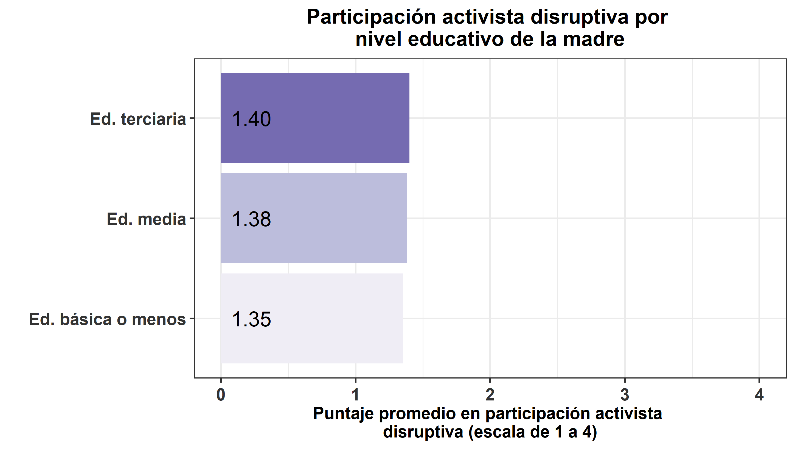

#### **Participación política durante el 2020**

```{r}
### Crear variable
data_wide$part_act_dis_20 = as.numeric(data_wide$part_pol_marc_dis_20 + data_wide$part_pol_bloq_20 + data_wide$part_pol_rayar_20 + data_wide$part_pol_toma_20)/4
```

```{r}
# Creación de bbdd
data_ed_bas = data_wide %>%  filter(nse_madre==1 | nse_madre==2 | nse_madre==3) %>% as.data.frame() # Sin Ed. (1), Ed. básica incompleta (2) o completa (3)
data_ed_med = data_wide %>%  filter(nse_madre==4 | nse_madre==5) %>% as.data.frame() # Ed. media incompleta (4) o completa (5)
data_ed_ter = data_wide %>%  filter(nse_madre==6 | nse_madre==7 | nse_madre==8 | nse_madre==9 | nse_madre==10) %>% as.data.frame() # técnico superior incompleto (6) o completo (7) Universitaria incompleta (8) o completa (9), Estudios de postgrado (magíster o doctorado) (10)

#data_ed_tec = data_wide %>%  filter(nse_madre==6 | nse_madre==7) %>% as.data.frame() # técnico superior incompleto (6) o completo (7)
#data_ed_uni = data_wide %>%  filter(nse_madre==8 | nse_madre==9 | nse_madre==10) %>% as.data.frame() # Universitaria incompleta (8) o completa (9), Estudios de postgrado (magíster o doctorado) (10)
```

```{r}
table_preposh1<- rbind(psych::describe(data_ed_bas$part_act_dis_20, na.rm=T),
               psych::describe(data_ed_med$part_act_dis_20, na.rm=T),
               psych::describe(data_ed_ter$part_act_dis_20, na.rm=T))#,
#               psych::describe(data_ed_uni$part_act_dis_20, na.rm=T))
table_preposh1 <- table_preposh1 %>% select(n,mean,sd,median,trimmed,min,max)

pond1 <- stats::weighted.mean(x=data_ed_bas$part_act_dis_20,y=data_ed_bas$weight_w01,na.rm=TRUE)
pond2 <- stats::weighted.mean(x=data_ed_med$part_act_dis_20,y=data_ed_med$weight_w01,na.rm=TRUE)
pond3 <- stats::weighted.mean(x=data_ed_ter$part_act_dis_20,y=data_ed_ter$weight_w01,na.rm=TRUE)
#pond4 <- stats::weighted.mean(x=data_ed_uni$part_act_dis_20,y=data_ed_uni$weight_w01,na.rm=TRUE)

table_preposh1[1,2]<-pond1
table_preposh1[2,2]<-pond2
table_preposh1[3,2]<-pond3
#table_preposh1[4,2]<-pond4

#table_preposh1$dep <- c("Ed. básica o menos","Ed. media","Técnico superior", "Universitaria o más")
table_preposh1$dep <- c("Ed. básica o menos","Ed. media","Ed. terciaria")

part_act_dis_20_colegio <-  ggplot(data=table_preposh1, aes(x=dep, y=mean, fill=dep)) +
     geom_bar(position = 'dodge', stat='identity')+#,width=0.8) 
     scale_fill_brewer(palette="Purples") +
     geom_text(aes(label=format(round(mean,2)), y=0), position=position_dodge(0.9), hjust=-0.25, size=6) +
     theme_bw(base_size = 14) +
     scale_y_continuous(labels = scales::comma) +
     ylab('Puntaje promedio en participación activista 
disruptiva (escala de 1 a 4)') + xlab(' ') + 
     theme(legend.position="top") +
     labs(fill = " ") +
    coord_flip()+
    theme(axis.text.x = element_text(colour = "grey20", size = 14, angle = 360, hjust = 0.5, vjust = 0.5, face = "bold"),
          axis.text.y = element_text(colour = "grey20", size = 14), 
          text = element_text(size = 14, face = "bold"),
          plot.title = element_text(hjust=0.5),
          legend.position = "none") + 
     ggtitle("Participación activista disruptiva por 
nivel educativo de la madre") + ylim(0,4)
#part_act_dis_20_colegio
ggsave(part_act_dis_20_colegio, file = "../output/graphs/part_act_dis_20_colegio_ed_madre.png",device = "png",width = 23,height = 13,dpi = "retina",units = "cm")
```


#### **Participación política durante el primer semestre de 2021**

```{r}
#### Crear variable
data_wide$part_act_dis_21_1s = as.numeric(data_wide$part_pol_marcha_dis + data_wide$part_pol_bloq + data_wide$part_pol_rayar.x + data_wide$part_pol_toma.x)/4
```

```{r}
# Creación de bbdd
data_ed_bas = data_wide %>%  filter(nse_madre==1 | nse_madre==2 | nse_madre==3) %>% as.data.frame() # Sin Ed. (1), Ed. básica incompleta (2) o completa (3)
data_ed_med = data_wide %>%  filter(nse_madre==4 | nse_madre==5) %>% as.data.frame() # Ed. media incompleta (4) o completa (5)
data_ed_ter = data_wide %>%  filter(nse_madre==6 | nse_madre==7 | nse_madre==8 | nse_madre==9 | nse_madre==10) %>% as.data.frame() # técnico superior incompleto (6) o completo (7) Universitaria incompleta (8) o completa (9), Estudios de postgrado (magíster o doctorado) (10)

#data_ed_tec = data_wide %>%  filter(nse_madre==6 | nse_madre==7) %>% as.data.frame() # técnico superior incompleto (6) o completo (7)
#data_ed_uni = data_wide %>%  filter(nse_madre==8 | nse_madre==9 | nse_madre==10) %>% as.data.frame() # Universitaria incompleta (8) o completa (9), Estudios de postgrado (magíster o doctorado) (10)
```

```{r}
table_preposh1<- rbind(psych::describe(data_ed_bas$part_act_dis_21_1s, na.rm=T),
               psych::describe(data_ed_med$part_act_dis_21_1s, na.rm=T),
               psych::describe(data_ed_ter$part_act_dis_21_1s, na.rm=T))#,
#               psych::describe(data_ed_uni$part_act_dis_21_1s, na.rm=T))
table_preposh1 <- table_preposh1 %>% select(n,mean,sd,median,trimmed,min,max)

pond1 <- stats::weighted.mean(x=data_ed_bas$part_act_dis_21_1s,y=data_ed_bas$weight_w01,na.rm=TRUE)
pond2 <- stats::weighted.mean(x=data_ed_med$part_act_dis_21_1s,y=data_ed_med$weight_w01,na.rm=TRUE)
pond3 <- stats::weighted.mean(x=data_ed_ter$part_act_dis_21_1s,y=data_ed_ter$weight_w01,na.rm=TRUE)
#pond4 <- stats::weighted.mean(x=data_ed_uni$part_act_dis_21_1s,y=data_ed_uni$weight_w01,na.rm=TRUE)

table_preposh1[1,2]<-pond1
table_preposh1[2,2]<-pond2
table_preposh1[3,2]<-pond3
#table_preposh1[4,2]<-pond4

#table_preposh1$dep <- c("Ed. básica o menos","Ed. media","Técnico superior", "Universitaria o más")
table_preposh1$dep <- c("Ed. básica o menos","Ed. media","Ed. terciaria")

part_act_dis_21_1s_colegio <-  ggplot(data=table_preposh1, aes(x=dep, y=mean, fill=dep)) +
     geom_bar(position = 'dodge', stat='identity')+#,width=0.8) 
     scale_fill_brewer(palette="Purples") +
     geom_text(aes(label=format(round(mean,2)), y=0), position=position_dodge(0.9), hjust=-0.25, size=6) +
     theme_bw(base_size = 14) +
     scale_y_continuous(labels = scales::comma) +
     ylab('Puntaje promedio en participación activista 
disruptiva (escala de 1 a 4)') + xlab(' ') + 
     theme(legend.position="top") +
     labs(fill = " ") +
    coord_flip()+
    theme(axis.text.x = element_text(colour = "grey20", size = 14, angle = 360, hjust = 0.5, vjust = 0.5, face = "bold"),
          axis.text.y = element_text(colour = "grey20", size = 14), 
          text = element_text(size = 14, face = "bold"),
          plot.title = element_text(hjust=0.5),
          legend.position = "none") + 
     ggtitle("Participación activista disruptiva por 
nivel educativo de la madre") + ylim(0,4)
#part_act_dis_21_1s_colegio
ggsave(part_act_dis_21_1s_colegio, file = "../output/graphs/part_act_dis_21_1s_colegio_ed_madre.png",device = "png",width = 23,height = 13,dpi = "retina",units = "cm")
```


#### **Participación política durante el segundo semestre de 2021**

```{r}
#### Crear variable
data_wide$part_act_dis_21_2s = as.numeric(data_wide$part_pol_marc_dis_21b + data_wide$part_pol_bloq_21b + data_wide$part_pol_rayar_21b + data_wide$part_pol_toma_21b)/4
```

```{r}
# Creación de bbdd
data_ed_bas = data_wide %>%  filter(nse_madre==1 | nse_madre==2 | nse_madre==3) %>% as.data.frame() # Sin Ed. (1), Ed. básica incompleta (2) o completa (3)
data_ed_med = data_wide %>%  filter(nse_madre==4 | nse_madre==5) %>% as.data.frame() # Ed. media incompleta (4) o completa (5)
data_ed_ter = data_wide %>%  filter(nse_madre==6 | nse_madre==7 | nse_madre==8 | nse_madre==9 | nse_madre==10) %>% as.data.frame() # técnico superior incompleto (6) o completo (7) Universitaria incompleta (8) o completa (9), Estudios de postgrado (magíster o doctorado) (10)

#data_ed_tec = data_wide %>%  filter(nse_madre==6 | nse_madre==7) %>% as.data.frame() # técnico superior incompleto (6) o completo (7)
#data_ed_uni = data_wide %>%  filter(nse_madre==8 | nse_madre==9 | nse_madre==10) %>% as.data.frame() # Universitaria incompleta (8) o completa (9), Estudios de postgrado (magíster o doctorado) (10)
```

```{r}
table_preposh1<- rbind(psych::describe(data_ed_bas$part_act_dis_21_2s, na.rm=T),
               psych::describe(data_ed_med$part_act_dis_21_2s, na.rm=T),
               psych::describe(data_ed_ter$part_act_dis_21_2s, na.rm=T))#,
#               psych::describe(data_ed_uni$part_act_dis_21_2s, na.rm=T))
table_preposh1 <- table_preposh1 %>% select(n,mean,sd,median,trimmed,min,max)

pond1 <- stats::weighted.mean(x=data_ed_bas$part_act_dis_21_2s,y=data_ed_bas$weight_w01,na.rm=TRUE)
pond2 <- stats::weighted.mean(x=data_ed_med$part_act_dis_21_2s,y=data_ed_med$weight_w01,na.rm=TRUE)
pond3 <- stats::weighted.mean(x=data_ed_ter$part_act_dis_21_2s,y=data_ed_ter$weight_w01,na.rm=TRUE)
#pond4 <- stats::weighted.mean(x=data_ed_uni$part_act_dis_21_2s,y=data_ed_uni$weight_w01,na.rm=TRUE)

table_preposh1[1,2]<-pond1
table_preposh1[2,2]<-pond2
table_preposh1[3,2]<-pond3
#table_preposh1[4,2]<-pond4

#table_preposh1$dep <- c("Ed. básica o menos","Ed. media","Técnico superior", "Universitaria o más")
table_preposh1$dep <- c("Ed. básica o menos","Ed. media","Ed. terciaria")

part_act_dis_21_2s_colegio <-  ggplot(data=table_preposh1, aes(x=dep, y=mean, fill=dep)) +
     geom_bar(position = 'dodge', stat='identity')+#,width=0.8) 
     scale_fill_brewer(palette="Purples") +
     geom_text(aes(label=format(round(mean,2)), y=0), position=position_dodge(0.9), hjust=-0.25, size=6) +
     theme_bw(base_size = 14) +
     scale_y_continuous(labels = scales::comma) +
     ylab('Puntaje promedio en participación activista 
disruptiva (escala de 1 a 4)') + xlab(' ') + 
     theme(legend.position="top") +
     labs(fill = " ") +
    coord_flip()+
    theme(axis.text.x = element_text(colour = "grey20", size = 14, angle = 360, hjust = 0.5, vjust = 0.5, face = "bold"),
          axis.text.y = element_text(colour = "grey20", size = 14), 
          text = element_text(size = 14, face = "bold"),
          plot.title = element_text(hjust=0.5),
          legend.position = "none") + 
     ggtitle("Participación activista disruptiva por 
nivel educativo de la madre") + ylim(0,4)
#part_act_dis_21_2s_colegio
ggsave(part_act_dis_21_2s_colegio, file = "../output/graphs/part_act_dis_21_2s_colegio_ed_madre.png",device = "png",width = 23,height = 13,dpi = "retina",units = "cm")
```


### Máximo nivel educativo del padre

En esta sección se presentan los resultados descriptivos de la relación entre el máximo nivel educativo del padre y la participación activista disruptiva del encuestado.

En términos generales, es posible visualizar una leve relación entre que el padre tenga sólo educación básica o menos y realizar prácticas de activismo disruptivo en todos los momentos sobre los que se consultó.

#### **Participación política durante 3ro y 4to medio**

```{r}
### Crear variable
data_wide$part_act_dis_3y4 <- as.numeric(data_wide$part_pol_marcha_dis + data_wide$part_pol_bloqueo + data_wide$part_pol_rayar.y + data_wide$part_pol_toma.y)/4
```

```{r}
# Creación de bbdd
data_ed_bas = data_wide %>%  filter(nse_padre==1 | nse_padre==2 | nse_padre==3) %>% as.data.frame() # Sin Ed. (1), Ed. básica incompleta (2) o completa (3)
data_ed_med = data_wide %>%  filter(nse_padre==4 | nse_padre==5) %>% as.data.frame() # Ed. media incompleta (4) o completa (5)
data_ed_ter = data_wide %>%  filter(nse_padre==6 | nse_padre==7 | nse_padre==8 | nse_padre==9 | nse_padre==10) %>% as.data.frame() # técnico superior incompleto (6) o completo (7) Universitaria incompleta (8) o completa (9), Estudios de postgrado (magíster o doctorado) (10)

#data_ed_tec = data_wide %>%  filter(nse_padre==6 | nse_padre==7) %>% as.data.frame() # técnico superior incompleto (6) o completo (7)
#data_ed_uni = data_wide %>%  filter(nse_padre==8 | nse_padre==9 | nse_padre==10) %>% as.data.frame() # Universitaria incompleta (8) o completa (9), Estudios de postgrado (magíster o doctorado) (10)

```

```{r}
table_preposh1<- rbind(psych::describe(data_ed_bas$part_act_dis_3y4, na.rm=T),
               psych::describe(data_ed_med$part_act_dis_3y4, na.rm=T),
               psych::describe(data_ed_ter$part_act_dis_3y4, na.rm=T))#,
#               psych::describe(data_ed_uni$part_act_dis_3y4, na.rm=T))
table_preposh1 <- table_preposh1 %>% select(n,mean,sd,median,trimmed,min,max)

pond1 <- stats::weighted.mean(x=data_ed_bas$part_act_dis_3y4,y=data_ed_bas$weight_w01,na.rm=TRUE)
pond2 <- stats::weighted.mean(x=data_ed_med$part_act_dis_3y4,y=data_ed_med$weight_w01,na.rm=TRUE)
pond3 <- stats::weighted.mean(x=data_ed_ter$part_act_dis_3y4,y=data_ed_ter$weight_w01,na.rm=TRUE)
#pond4 <- stats::weighted.mean(x=data_ed_uni$part_act_dis_3y4,y=data_ed_uni$weight_w01,na.rm=TRUE)

table_preposh1[1,2]<-pond1
table_preposh1[2,2]<-pond2
table_preposh1[3,2]<-pond3
#table_preposh1[4,2]<-pond4

#table_preposh1$dep <- c("Ed. básica o menos","Ed. media","Técnico superior", "Universitaria o más")
table_preposh1$dep <- c("Ed. básica o menos","Ed. media","Ed. terciaria")

part_act_dis_3y4_colegio <-  ggplot(data=table_preposh1, aes(x=dep, y=mean, fill=dep)) +
     geom_bar(position = 'dodge', stat='identity')+#,width=0.8) 
     scale_fill_brewer(palette="Purples") +
     geom_text(aes(label=format(round(mean,2)), y=0), position=position_dodge(0.9), hjust=-0.25, size=6) +
     theme_bw(base_size = 14) +
     scale_y_continuous(labels = scales::comma) +
     ylab('Puntaje promedio en participación activista 
disruptiva (escala de 1 a 4)') + xlab(' ') + 
     theme(legend.position="top") +
     labs(fill = " ") +
    coord_flip()+
    theme(axis.text.x = element_text(colour = "grey20", size = 14, angle = 360, hjust = 0.5, vjust = 0.5, face = "bold"),
          axis.text.y = element_text(colour = "grey20", size = 14), 
          text = element_text(size = 14, face = "bold"),
          plot.title = element_text(hjust=0.5),
          legend.position = "none") + 
     ggtitle("Participación activista disruptiva por 
nivel educativo del padre") + ylim(0,4)
#part_act_dis_3y4_colegio
ggsave(part_act_dis_3y4_colegio, file = "../output/graphs/part_act_dis_3y4_colegio_ed_padre.png",device = "png",width = 23,height = 13,dpi = "retina",units = "cm")

```

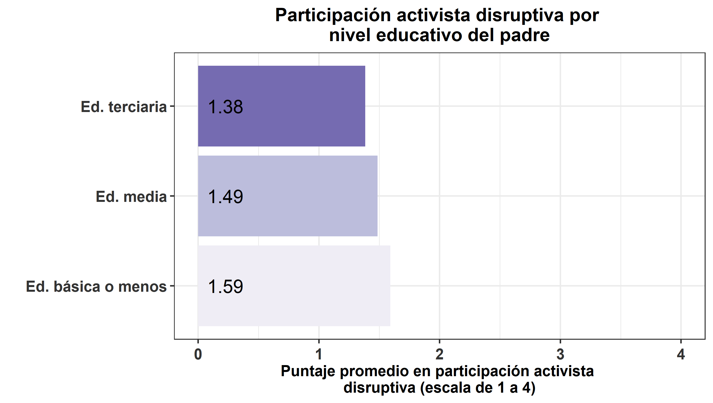

#### **Participación política durante estallido social**

```{r}
### Crear variable
data_wide$part_act_dis_es <- as.numeric(data_wide$part_pol_marc_dis_21 + data_wide$part_pol_bloq_21 + data_wide$part_pol_rayar_21 + data_wide$part_pol_toma_21)/4
```

```{r}
# Creación de bbdd
data_ed_bas = data_wide %>%  filter(nse_padre==1 | nse_padre==2 | nse_padre==3) %>% as.data.frame() # Sin Ed. (1), Ed. básica incompleta (2) o completa (3)
data_ed_med = data_wide %>%  filter(nse_padre==4 | nse_padre==5) %>% as.data.frame() # Ed. media incompleta (4) o completa (5)
data_ed_ter = data_wide %>%  filter(nse_padre==6 | nse_padre==7 | nse_padre==8 | nse_padre==9 | nse_padre==10) %>% as.data.frame() # técnico superior incompleto (6) o completo (7) Universitaria incompleta (8) o completa (9), Estudios de postgrado (magíster o doctorado) (10)

#data_ed_tec = data_wide %>%  filter(nse_padre==6 | nse_padre==7) %>% as.data.frame() # técnico superior incompleto (6) o completo (7)
#data_ed_uni = data_wide %>%  filter(nse_padre==8 | nse_padre==9 | nse_padre==10) %>% as.data.frame() # Universitaria incompleta (8) o completa (9), Estudios de postgrado (magíster o doctorado) (10)

```

```{r}
table_preposh1<- rbind(psych::describe(data_ed_bas$part_act_dis_es, na.rm=T),
               psych::describe(data_ed_med$part_act_dis_es, na.rm=T),
               psych::describe(data_ed_ter$part_act_dis_es, na.rm=T))#,
#               psych::describe(data_ed_uni$part_act_dis_es, na.rm=T))
table_preposh1 <- table_preposh1 %>% select(n,mean,sd,median,trimmed,min,max)

pond1 <- stats::weighted.mean(x=data_ed_bas$part_act_dis_es,y=data_ed_bas$weight_w01,na.rm=TRUE)
pond2 <- stats::weighted.mean(x=data_ed_med$part_act_dis_es,y=data_ed_med$weight_w01,na.rm=TRUE)
pond3 <- stats::weighted.mean(x=data_ed_ter$part_act_dis_es,y=data_ed_ter$weight_w01,na.rm=TRUE)
#pond4 <- stats::weighted.mean(x=data_ed_uni$part_act_dis_es,y=data_ed_uni$weight_w01,na.rm=TRUE)

table_preposh1[1,2]<-pond1
table_preposh1[2,2]<-pond2
table_preposh1[3,2]<-pond3
#table_preposh1[4,2]<-pond4

#table_preposh1$dep <- c("Ed. básica o menos","Ed. media","Técnico superior", "Universitaria o más")
table_preposh1$dep <- c("Ed. básica o menos","Ed. media","Ed. terciaria")

part_act_dis_es_colegio <-  ggplot(data=table_preposh1, aes(x=dep, y=mean, fill=dep)) +
     geom_bar(position = 'dodge', stat='identity')+#,width=0.8) 
     scale_fill_brewer(palette="Purples") +
     geom_text(aes(label=format(round(mean,2)), y=0), position=position_dodge(0.9), hjust=-0.25, size=6) +
     theme_bw(base_size = 14) +
     scale_y_continuous(labels = scales::comma) +
     ylab('Puntaje promedio en participación activista 
disruptiva (escala de 1 a 4)') + xlab(' ') + 
     theme(legend.position="top") +
     labs(fill = " ") +
    coord_flip()+
    theme(axis.text.x = element_text(colour = "grey20", size = 14, angle = 360, hjust = 0.5, vjust = 0.5, face = "bold"),
          axis.text.y = element_text(colour = "grey20", size = 14), 
          text = element_text(size = 14, face = "bold"),
          plot.title = element_text(hjust=0.5),
          legend.position = "none") + 
     ggtitle("Participación activista disruptiva por 
nivel educativo del padre") + ylim(0,4)
#part_act_dis_es_colegio
ggsave(part_act_dis_es_colegio, file = "../output/graphs/part_act_dis_es_colegio_ed_padre.png",device = "png",width = 23,height = 13,dpi = "retina",units = "cm")

```
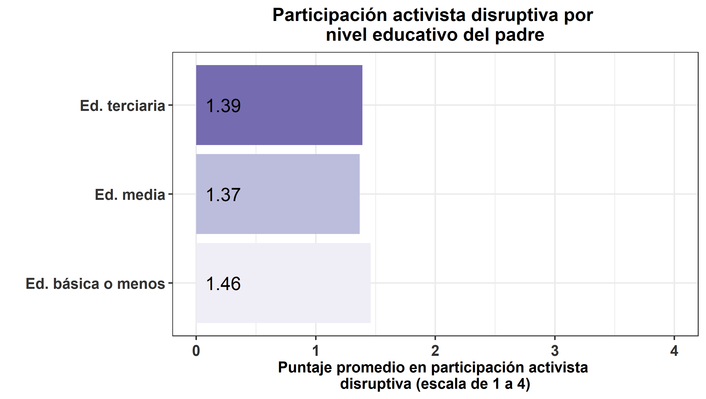

#### **Participación política durante el 2020**

```{r}
### Crear variable
data_wide$part_act_dis_20 = as.numeric(data_wide$part_pol_marc_dis_20 + data_wide$part_pol_bloq_20 + data_wide$part_pol_rayar_20 + data_wide$part_pol_toma_20)/4
```

```{r}
# Creación de bbdd
data_ed_bas = data_wide %>%  filter(nse_padre==1 | nse_padre==2 | nse_padre==3) %>% as.data.frame() # Sin Ed. (1), Ed. básica incompleta (2) o completa (3)
data_ed_med = data_wide %>%  filter(nse_padre==4 | nse_padre==5) %>% as.data.frame() # Ed. media incompleta (4) o completa (5)
data_ed_ter = data_wide %>%  filter(nse_padre==6 | nse_padre==7 | nse_padre==8 | nse_padre==9 | nse_padre==10) %>% as.data.frame() # técnico superior incompleto (6) o completo (7) Universitaria incompleta (8) o completa (9), Estudios de postgrado (magíster o doctorado) (10)

#data_ed_tec = data_wide %>%  filter(nse_padre==6 | nse_padre==7) %>% as.data.frame() # técnico superior incompleto (6) o completo (7)
#data_ed_uni = data_wide %>%  filter(nse_padre==8 | nse_padre==9 | nse_padre==10) %>% as.data.frame() # Universitaria incompleta (8) o completa (9), Estudios de postgrado (magíster o doctorado) (10)

```

```{r}
table_preposh1<- rbind(psych::describe(data_ed_bas$part_act_dis_20, na.rm=T),
               psych::describe(data_ed_med$part_act_dis_20, na.rm=T),
               psych::describe(data_ed_ter$part_act_dis_20, na.rm=T))#,
#               psych::describe(data_ed_uni$part_act_dis_20, na.rm=T))
table_preposh1 <- table_preposh1 %>% select(n,mean,sd,median,trimmed,min,max)

pond1 <- stats::weighted.mean(x=data_ed_bas$part_act_dis_20,y=data_ed_bas$weight_w01,na.rm=TRUE)
pond2 <- stats::weighted.mean(x=data_ed_med$part_act_dis_20,y=data_ed_med$weight_w01,na.rm=TRUE)
pond3 <- stats::weighted.mean(x=data_ed_ter$part_act_dis_20,y=data_ed_ter$weight_w01,na.rm=TRUE)
#pond4 <- stats::weighted.mean(x=data_ed_uni$part_act_dis_20,y=data_ed_uni$weight_w01,na.rm=TRUE)

table_preposh1[1,2]<-pond1
table_preposh1[2,2]<-pond2
table_preposh1[3,2]<-pond3
#table_preposh1[4,2]<-pond4

#table_preposh1$dep <- c("Ed. básica o menos","Ed. media","Técnico superior", "Universitaria o más")
table_preposh1$dep <- c("Ed. básica o menos","Ed. media","Ed. terciaria")

part_act_dis_20_colegio <-  ggplot(data=table_preposh1, aes(x=dep, y=mean, fill=dep)) +
     geom_bar(position = 'dodge', stat='identity')+#,width=0.8) 
     scale_fill_brewer(palette="Purples") +
     geom_text(aes(label=format(round(mean,2)), y=0), position=position_dodge(0.9), hjust=-0.25, size=6) +
     theme_bw(base_size = 14) +
     scale_y_continuous(labels = scales::comma) +
     ylab('Puntaje promedio en participación activista 
disruptiva (escala de 1 a 4)') + xlab(' ') + 
     theme(legend.position="top") +
     labs(fill = " ") +
    coord_flip()+
    theme(axis.text.x = element_text(colour = "grey20", size = 14, angle = 360, hjust = 0.5, vjust = 0.5, face = "bold"),
          axis.text.y = element_text(colour = "grey20", size = 14), 
          text = element_text(size = 14, face = "bold"),
          plot.title = element_text(hjust=0.5),
          legend.position = "none") + 
     ggtitle("Participación activista disruptiva por 
nivel educativo del padre") + ylim(0,4)
#part_act_dis_20_colegio
ggsave(part_act_dis_20_colegio, file = "../output/graphs/part_act_dis_20_colegio_ed_padre.png",device = "png",width = 23,height = 13,dpi = "retina",units = "cm")
```


#### **Participación política durante el primer semestre de 2021**

```{r}
#### Crear variable
data_wide$part_act_dis_21_1s = as.numeric(data_wide$part_pol_marcha_dis + data_wide$part_pol_bloq + data_wide$part_pol_rayar.x + data_wide$part_pol_toma.x)/4
```

```{r}
# Creación de bbdd
data_ed_bas = data_wide %>%  filter(nse_padre==1 | nse_padre==2 | nse_padre==3) %>% as.data.frame() # Sin Ed. (1), Ed. básica incompleta (2) o completa (3)
data_ed_med = data_wide %>%  filter(nse_padre==4 | nse_padre==5) %>% as.data.frame() # Ed. media incompleta (4) o completa (5)
data_ed_ter = data_wide %>%  filter(nse_padre==6 | nse_padre==7 | nse_padre==8 | nse_padre==9 | nse_padre==10) %>% as.data.frame() # técnico superior incompleto (6) o completo (7) Universitaria incompleta (8) o completa (9), Estudios de postgrado (magíster o doctorado) (10)

#data_ed_tec = data_wide %>%  filter(nse_padre==6 | nse_padre==7) %>% as.data.frame() # técnico superior incompleto (6) o completo (7)
#data_ed_uni = data_wide %>%  filter(nse_padre==8 | nse_padre==9 | nse_padre==10) %>% as.data.frame() # Universitaria incompleta (8) o completa (9), Estudios de postgrado (magíster o doctorado) (10)

```

```{r}
table_preposh1<- rbind(psych::describe(data_ed_bas$part_act_dis_21_1s, na.rm=T),
               psych::describe(data_ed_med$part_act_dis_21_1s, na.rm=T),
               psych::describe(data_ed_ter$part_act_dis_21_1s, na.rm=T))#,
#               psych::describe(data_ed_uni$part_act_dis_21_1s, na.rm=T))
table_preposh1 <- table_preposh1 %>% select(n,mean,sd,median,trimmed,min,max)

pond1 <- stats::weighted.mean(x=data_ed_bas$part_act_dis_21_1s,y=data_ed_bas$weight_w01,na.rm=TRUE)
pond2 <- stats::weighted.mean(x=data_ed_med$part_act_dis_21_1s,y=data_ed_med$weight_w01,na.rm=TRUE)
pond3 <- stats::weighted.mean(x=data_ed_ter$part_act_dis_21_1s,y=data_ed_ter$weight_w01,na.rm=TRUE)
#pond4 <- stats::weighted.mean(x=data_ed_uni$part_act_dis_21_1s,y=data_ed_uni$weight_w01,na.rm=TRUE)

table_preposh1[1,2]<-pond1
table_preposh1[2,2]<-pond2
table_preposh1[3,2]<-pond3
#table_preposh1[4,2]<-pond4

#table_preposh1$dep <- c("Ed. básica o menos","Ed. media","Técnico superior", "Universitaria o más")
table_preposh1$dep <- c("Ed. básica o menos","Ed. media","Ed. terciaria")

part_act_dis_21_1s_colegio <-  ggplot(data=table_preposh1, aes(x=dep, y=mean, fill=dep)) +
     geom_bar(position = 'dodge', stat='identity')+#,width=0.8) 
     scale_fill_brewer(palette="Purples") +
     geom_text(aes(label=format(round(mean,2)), y=0), position=position_dodge(0.9), hjust=-0.25, size=6) +
     theme_bw(base_size = 14) +
     scale_y_continuous(labels = scales::comma) +
     ylab('Puntaje promedio en participación activista 
disruptiva (escala de 1 a 4)') + xlab(' ') + 
     theme(legend.position="top") +
     labs(fill = " ") +
    coord_flip()+
    theme(axis.text.x = element_text(colour = "grey20", size = 14, angle = 360, hjust = 0.5, vjust = 0.5, face = "bold"),
          axis.text.y = element_text(colour = "grey20", size = 14), 
          text = element_text(size = 14, face = "bold"),
          plot.title = element_text(hjust=0.5),
          legend.position = "none") + 
     ggtitle("Participación activista disruptiva por 
nivel educativo del padre") + ylim(0,4)
#part_act_dis_21_1s_colegio
ggsave(part_act_dis_21_1s_colegio, file = "../output/graphs/part_act_dis_21_1s_colegio_ed_padre.png",device = "png",width = 23,height = 13,dpi = "retina",units = "cm")
```


#### **Participación política durante el segundo semestre de 2021**

```{r}
#### Crear variable
data_wide$part_act_dis_21_2s = as.numeric(data_wide$part_pol_marc_dis_21b + data_wide$part_pol_bloq_21b + data_wide$part_pol_rayar_21b + data_wide$part_pol_toma_21b)/4
```

```{r}
# Creación de bbdd
data_ed_bas = data_wide %>%  filter(nse_padre==1 | nse_padre==2 | nse_padre==3) %>% as.data.frame() # Sin Ed. (1), Ed. básica incompleta (2) o completa (3)
data_ed_med = data_wide %>%  filter(nse_padre==4 | nse_padre==5) %>% as.data.frame() # Ed. media incompleta (4) o completa (5)
data_ed_ter = data_wide %>%  filter(nse_padre==6 | nse_padre==7 | nse_padre==8 | nse_padre==9 | nse_padre==10) %>% as.data.frame() # técnico superior incompleto (6) o completo (7) Universitaria incompleta (8) o completa (9), Estudios de postgrado (magíster o doctorado) (10)

#data_ed_tec = data_wide %>%  filter(nse_padre==6 | nse_padre==7) %>% as.data.frame() # técnico superior incompleto (6) o completo (7)
#data_ed_uni = data_wide %>%  filter(nse_padre==8 | nse_padre==9 | nse_padre==10) %>% as.data.frame() # Universitaria incompleta (8) o completa (9), Estudios de postgrado (magíster o doctorado) (10)

```

```{r}
table_preposh1<- rbind(psych::describe(data_ed_bas$part_act_dis_21_2s, na.rm=T),
               psych::describe(data_ed_med$part_act_dis_21_2s, na.rm=T),
               psych::describe(data_ed_ter$part_act_dis_21_2s, na.rm=T))#,
#               psych::describe(data_ed_uni$part_act_dis_21_2s, na.rm=T))
table_preposh1 <- table_preposh1 %>% select(n,mean,sd,median,trimmed,min,max)

pond1 <- stats::weighted.mean(x=data_ed_bas$part_act_dis_21_2s,y=data_ed_bas$weight_w01,na.rm=TRUE)
pond2 <- stats::weighted.mean(x=data_ed_med$part_act_dis_21_2s,y=data_ed_med$weight_w01,na.rm=TRUE)
pond3 <- stats::weighted.mean(x=data_ed_ter$part_act_dis_21_2s,y=data_ed_ter$weight_w01,na.rm=TRUE)
#pond4 <- stats::weighted.mean(x=data_ed_uni$part_act_dis_21_2s,y=data_ed_uni$weight_w01,na.rm=TRUE)

table_preposh1[1,2]<-pond1
table_preposh1[2,2]<-pond2
table_preposh1[3,2]<-pond3
#table_preposh1[4,2]<-pond4

#table_preposh1$dep <- c("Ed. básica o menos","Ed. media","Técnico superior", "Universitaria o más")
table_preposh1$dep <- c("Ed. básica o menos","Ed. media","Ed. terciaria")

part_act_dis_21_2s_colegio <-  ggplot(data=table_preposh1, aes(x=dep, y=mean, fill=dep)) +
     geom_bar(position = 'dodge', stat='identity')+#,width=0.8) 
     scale_fill_brewer(palette="Purples") +
     geom_text(aes(label=format(round(mean,2)), y=0), position=position_dodge(0.9), hjust=-0.25, size=6) +
     theme_bw(base_size = 14) +
     scale_y_continuous(labels = scales::comma) +
     ylab('Puntaje promedio en participación activista 
disruptiva (escala de 1 a 4)') + xlab(' ') + 
     theme(legend.position="top") +
     labs(fill = " ") +
    coord_flip()+
    theme(axis.text.x = element_text(colour = "grey20", size = 14, angle = 360, hjust = 0.5, vjust = 0.5, face = "bold"),
          axis.text.y = element_text(colour = "grey20", size = 14), 
          text = element_text(size = 14, face = "bold"),
          plot.title = element_text(hjust=0.5),
          legend.position = "none") + 
     ggtitle("Participación activista disruptiva por 
nivel educativo del padre") + ylim(0,4)
#part_act_dis_21_2s_colegio
ggsave(part_act_dis_21_2s_colegio, file = "../output/graphs/part_act_dis_21_2s_colegio_ed_padre.png",device = "png",width = 23,height = 13,dpi = "retina",units = "cm")
```


### Frecuencia de conversación con los padres sobre temas sociales y/o políticos

En esta sección se presentan los resultados descriptivos de la relación entre la frecuencia de conversación con los padres sobre temas sociales y/o políticos en cada uno de los momentos sobre los que se consultó y la participación activista disruptiva del encuestado.

En términos generales, es posible visualizar una relación entre la frecuencia de conversación con los padres sobre estas temáticas y realizar prácticas de activismo disruptivo en cuatro de los cinco momentos sobre los que se consultó (sólo en la participación durante el 2020 no se ve un patrón claro).

#### **Participación política durante 3ro y 4to medio**

```{r}
### Crear variable
data_wide$part_act_dis_3y4 <- as.numeric(data_wide$part_pol_marcha_dis + data_wide$part_pol_bloqueo + data_wide$part_pol_rayar.y + data_wide$part_pol_toma.y)/4
```

```{r}
# Creación de bbdd
data_nunca = data_wide %>%  filter(conv_padr_poli==1) %>% as.data.frame() # Nunca
data_casi_nunca = data_wide %>%  filter(conv_padr_poli==2) %>% as.data.frame() # Casi nunca
data_a_veces = data_wide %>%  filter(conv_padr_poli==3) %>% as.data.frame() # A veces
data_frecuent = data_wide %>%  filter(conv_padr_poli==4) %>% as.data.frame() # Frecuentemente
```

```{r}
table_preposh1<- rbind(psych::describe(data_nunca$part_act_dis_3y4, na.rm=T),
               psych::describe(data_casi_nunca$part_act_dis_3y4, na.rm=T),
               psych::describe(data_a_veces$part_act_dis_3y4, na.rm=T),
               psych::describe(data_frecuent$part_act_dis_3y4, na.rm=T))
table_preposh1 <- table_preposh1 %>% select(n,mean,sd,median,trimmed,min,max)

pond1 <- stats::weighted.mean(x=data_nunca$part_act_dis_3y4,y=data_nunca$weight_w01,na.rm=TRUE)
pond2 <- stats::weighted.mean(x=data_casi_nunca$part_act_dis_3y4,y=data_casi_nunca$weight_w01,na.rm=TRUE)
pond3 <- stats::weighted.mean(x=data_a_veces$part_act_dis_3y4,y=data_a_veces$weight_w01,na.rm=TRUE)
pond4 <- stats::weighted.mean(x=data_frecuent$part_act_dis_3y4,y=data_frecuent$weight_w01,na.rm=TRUE)

table_preposh1[1,2]<-pond1
table_preposh1[2,2]<-pond2
table_preposh1[3,2]<-pond3
table_preposh1[4,2]<-pond4

table_preposh1$dep <- c("1. Nunca","2. Casi nunca","3. A veces", "4. Frecuentemente")

part_act_dis_3y4_colegio <-  ggplot(data=table_preposh1, aes(x=dep, y=mean, fill=dep)) +
     geom_bar(position = 'dodge', stat='identity')+#,width=0.8) 
     scale_fill_brewer(palette="Purples") +
     geom_text(aes(label=format(round(mean,2)), y=0), position=position_dodge(0.9), hjust=-0.25, size=6) +
     theme_bw(base_size = 14) +
     scale_y_continuous(labels = scales::comma) +
     ylab('Puntaje promedio en participación activista 
disruptiva (escala de 1 a 4)') + xlab(' ') + 
     theme(legend.position="top") +
     labs(fill = " ") +
    coord_flip()+
    theme(axis.text.x = element_text(colour = "grey20", size = 14, angle = 360, hjust = 0.5, vjust = 0.5, face = "bold"),
          axis.text.y = element_text(colour = "grey20", size = 14), 
          text = element_text(size = 14, face = "bold"),
          plot.title = element_text(hjust=0.5),
          legend.position = "none") + 
     ggtitle("Participación activista disruptiva por 
conversación con los padres sobre temas políticos y/o sociales") + ylim(0,4)
#part_act_dis_3y4_colegio
ggsave(part_act_dis_3y4_colegio, file = "../output/graphs/part_act_dis_3y4_colegio_conv_padres.png",device = "png",width = 23,height = 13,dpi = "retina",units = "cm")

```


#### **Participación política durante estallido social**

```{r}
### Crear variable
data_wide$part_act_dis_es <- as.numeric(data_wide$part_pol_marc_dis_21 + data_wide$part_pol_bloq_21 + data_wide$part_pol_rayar_21 + data_wide$part_pol_toma_21)/4
```

```{r}
# Creación de bbdd
data_nunca = data_wide %>%  filter(conv_padres_21==1) %>% as.data.frame() # Nunca
data_casi_nunca = data_wide %>%  filter(conv_padres_21==2) %>% as.data.frame() # Casi nunca
data_a_veces = data_wide %>%  filter(conv_padres_21==3) %>% as.data.frame() # A veces
data_frecuent = data_wide %>%  filter(conv_padres_21==4) %>% as.data.frame() # Frecuentemente
```

```{r}
table_preposh1<- rbind(psych::describe(data_nunca$part_act_dis_es, na.rm=T),
               psych::describe(data_casi_nunca$part_act_dis_es, na.rm=T),
               psych::describe(data_a_veces$part_act_dis_es, na.rm=T),
               psych::describe(data_frecuent$part_act_dis_es, na.rm=T))
table_preposh1 <- table_preposh1 %>% select(n,mean,sd,median,trimmed,min,max)

pond1 <- stats::weighted.mean(x=data_nunca$part_act_dis_es,y=data_nunca$weight_w01,na.rm=TRUE)
pond2 <- stats::weighted.mean(x=data_casi_nunca$part_act_dis_es,y=data_casi_nunca$weight_w01,na.rm=TRUE)
pond3 <- stats::weighted.mean(x=data_a_veces$part_act_dis_es,y=data_a_veces$weight_w01,na.rm=TRUE)
pond4 <- stats::weighted.mean(x=data_frecuent$part_act_dis_es,y=data_frecuent$weight_w01,na.rm=TRUE)

table_preposh1[1,2]<-pond1
table_preposh1[2,2]<-pond2
table_preposh1[3,2]<-pond3
table_preposh1[4,2]<-pond4

table_preposh1$dep <- c("1. Nunca","2. Casi nunca","3. A veces", "4. Frecuentemente")

part_act_dis_es_colegio <-  ggplot(data=table_preposh1, aes(x=dep, y=mean, fill=dep)) +
     geom_bar(position = 'dodge', stat='identity')+#,width=0.8) 
     scale_fill_brewer(palette="Purples") +
     geom_text(aes(label=format(round(mean,2)), y=0), position=position_dodge(0.9), hjust=-0.25, size=6) +
     theme_bw(base_size = 14) +
     scale_y_continuous(labels = scales::comma) +
     ylab('Puntaje promedio en participación activista 
disruptiva (escala de 1 a 4)') + xlab(' ') + 
     theme(legend.position="top") +
     labs(fill = " ") +
    coord_flip()+
    theme(axis.text.x = element_text(colour = "grey20", size = 14, angle = 360, hjust = 0.5, vjust = 0.5, face = "bold"),
          axis.text.y = element_text(colour = "grey20", size = 14), 
          text = element_text(size = 14, face = "bold"),
          plot.title = element_text(hjust=0.5),
          legend.position = "none") + 
     ggtitle("Participación activista disruptiva por 
conversación con los padres sobre temas políticos y/o sociales") + ylim(0,4)
#part_act_dis_es_colegio
ggsave(part_act_dis_es_colegio, file = "../output/graphs/part_act_dis_es_colegio_conv_padres.png",device = "png",width = 23,height = 13,dpi = "retina",units = "cm")

```


#### **Participación política durante el 2020**

```{r}
### Crear variable
data_wide$part_act_dis_20 = as.numeric(data_wide$part_pol_marc_dis_20 + data_wide$part_pol_bloq_20 + data_wide$part_pol_rayar_20 + data_wide$part_pol_toma_20)/4
```

```{r}
# Creación de bbdd
data_nunca = data_wide %>%  filter(conv_padres_20==1) %>% as.data.frame() # Nunca
data_casi_nunca = data_wide %>%  filter(conv_padres_20==2) %>% as.data.frame() # Casi nunca
data_a_veces = data_wide %>%  filter(conv_padres_20==3) %>% as.data.frame() # A veces
data_frecuent = data_wide %>%  filter(conv_padres_20==4) %>% as.data.frame() # Frecuentemente
```

```{r}
table_preposh1<- rbind(psych::describe(data_nunca$part_act_dis_20, na.rm=T),
               psych::describe(data_casi_nunca$part_act_dis_20, na.rm=T),
               psych::describe(data_a_veces$part_act_dis_20, na.rm=T),
               psych::describe(data_frecuent$part_act_dis_20, na.rm=T))
table_preposh1 <- table_preposh1 %>% select(n,mean,sd,median,trimmed,min,max)

pond1 <- stats::weighted.mean(x=data_nunca$part_act_dis_20,y=data_nunca$weight_w01,na.rm=TRUE)
pond2 <- stats::weighted.mean(x=data_casi_nunca$part_act_dis_20,y=data_casi_nunca$weight_w01,na.rm=TRUE)
pond3 <- stats::weighted.mean(x=data_a_veces$part_act_dis_20,y=data_a_veces$weight_w01,na.rm=TRUE)
pond4 <- stats::weighted.mean(x=data_frecuent$part_act_dis_20,y=data_frecuent$weight_w01,na.rm=TRUE)

table_preposh1[1,2]<-pond1
table_preposh1[2,2]<-pond2
table_preposh1[3,2]<-pond3
table_preposh1[4,2]<-pond4

table_preposh1$dep <- c("1. Nunca","2. Casi nunca","3. A veces", "4. Frecuentemente")

part_act_dis_20_colegio <-  ggplot(data=table_preposh1, aes(x=dep, y=mean, fill=dep)) +
     geom_bar(position = 'dodge', stat='identity')+#,width=0.8) 
     scale_fill_brewer(palette="Purples") +
     geom_text(aes(label=format(round(mean,2)), y=0), position=position_dodge(0.9), hjust=-0.25, size=6) +
     theme_bw(base_size = 14) +
     scale_y_continuous(labels = scales::comma) +
     ylab('Puntaje promedio en participación activista 
disruptiva (escala de 1 a 4)') + xlab(' ') + 
     theme(legend.position="top") +
     labs(fill = " ") +
    coord_flip()+
    theme(axis.text.x = element_text(colour = "grey20", size = 14, angle = 360, hjust = 0.5, vjust = 0.5, face = "bold"),
          axis.text.y = element_text(colour = "grey20", size = 14), 
          text = element_text(size = 14, face = "bold"),
          plot.title = element_text(hjust=0.5),
          legend.position = "none") + 
     ggtitle("Participación activista disruptiva por 
conversación con los padres sobre temas políticos y/o sociales") + ylim(0,4)
#part_act_dis_20_colegio
ggsave(part_act_dis_20_colegio, file = "../output/graphs/part_act_dis_20_colegio_conv_padres.png",device = "png",width = 23,height = 13,dpi = "retina",units = "cm")
```


#### **Participación política durante el primer semestre de 2021**

```{r}
#### Crear variable
data_wide$part_act_dis_21_1s = as.numeric(data_wide$part_pol_marcha_dis + data_wide$part_pol_bloq + data_wide$part_pol_rayar.x + data_wide$part_pol_toma.x)/4
```

```{r}
# Creación de bbdd
data_nunca = data_wide %>%  filter(conv_padres==1) %>% as.data.frame() # Nunca
data_casi_nunca = data_wide %>%  filter(conv_padres==2) %>% as.data.frame() # Casi nunca
data_a_veces = data_wide %>%  filter(conv_padres==3) %>% as.data.frame() # A veces
data_frecuent = data_wide %>%  filter(conv_padres==4) %>% as.data.frame() # Frecuentemente
```

```{r}
table_preposh1<- rbind(psych::describe(data_nunca$part_act_dis_21_1s, na.rm=T),
               psych::describe(data_casi_nunca$part_act_dis_21_1s, na.rm=T),
               psych::describe(data_a_veces$part_act_dis_21_1s, na.rm=T),
               psych::describe(data_frecuent$part_act_dis_21_1s, na.rm=T))
table_preposh1 <- table_preposh1 %>% select(n,mean,sd,median,trimmed,min,max)

pond1 <- stats::weighted.mean(x=data_nunca$part_act_dis_21_1s,y=data_nunca$weight_w01,na.rm=TRUE)
pond2 <- stats::weighted.mean(x=data_casi_nunca$part_act_dis_21_1s,y=data_casi_nunca$weight_w01,na.rm=TRUE)
pond3 <- stats::weighted.mean(x=data_a_veces$part_act_dis_21_1s,y=data_a_veces$weight_w01,na.rm=TRUE)
pond4 <- stats::weighted.mean(x=data_frecuent$part_act_dis_21_1s,y=data_frecuent$weight_w01,na.rm=TRUE)

table_preposh1[1,2]<-pond1
table_preposh1[2,2]<-pond2
table_preposh1[3,2]<-pond3
table_preposh1[4,2]<-pond4

table_preposh1$dep <- c("1. Nunca","2. Casi nunca","3. A veces", "4. Frecuentemente")

part_act_dis_21_1s_colegio <-  ggplot(data=table_preposh1, aes(x=dep, y=mean, fill=dep)) +
     geom_bar(position = 'dodge', stat='identity')+#,width=0.8) 
     scale_fill_brewer(palette="Purples") +
     geom_text(aes(label=format(round(mean,2)), y=0), position=position_dodge(0.9), hjust=-0.25, size=6) +
     theme_bw(base_size = 14) +
     scale_y_continuous(labels = scales::comma) +
     ylab('Puntaje promedio en participación activista 
disruptiva (escala de 1 a 4)') + xlab(' ') + 
     theme(legend.position="top") +
     labs(fill = " ") +
    coord_flip()+
    theme(axis.text.x = element_text(colour = "grey20", size = 14, angle = 360, hjust = 0.5, vjust = 0.5, face = "bold"),
          axis.text.y = element_text(colour = "grey20", size = 14), 
          text = element_text(size = 14, face = "bold"),
          plot.title = element_text(hjust=0.5),
          legend.position = "none") + 
     ggtitle("Participación activista disruptiva por 
conversación con los padres sobre temas políticos y/o sociales") + ylim(0,4)
#part_act_dis_21_1s_colegio
ggsave(part_act_dis_21_1s_colegio, file = "../output/graphs/part_act_dis_21_1s_colegio_conv_padres.png",device = "png",width = 23,height = 13,dpi = "retina",units = "cm")
```


#### **Participación política durante el segundo semestre de 2021**

```{r}
#### Crear variable
data_wide$part_act_dis_21_2s = as.numeric(data_wide$part_pol_marc_dis_21b + data_wide$part_pol_bloq_21b + data_wide$part_pol_rayar_21b + data_wide$part_pol_toma_21b)/4
```

```{r}
# Creación de bbdd
data_nunca = data_wide %>%  filter(conv_padres_21b==1) %>% as.data.frame() # Nunca
data_casi_nunca = data_wide %>%  filter(conv_padres_21b==2) %>% as.data.frame() # Casi nunca
data_a_veces = data_wide %>%  filter(conv_padres_21b==3) %>% as.data.frame() # A veces
data_frecuent = data_wide %>%  filter(conv_padres_21b==4) %>% as.data.frame() # Frecuentemente
```

```{r}
table_preposh1<- rbind(psych::describe(data_nunca$part_act_dis_21_2s, na.rm=T),
               psych::describe(data_casi_nunca$part_act_dis_21_2s, na.rm=T),
               psych::describe(data_a_veces$part_act_dis_21_2s, na.rm=T),
               psych::describe(data_frecuent$part_act_dis_21_2s, na.rm=T))
table_preposh1 <- table_preposh1 %>% select(n,mean,sd,median,trimmed,min,max)

pond1 <- stats::weighted.mean(x=data_nunca$part_act_dis_21_2s,y=data_nunca$weight_w01,na.rm=TRUE)
pond2 <- stats::weighted.mean(x=data_casi_nunca$part_act_dis_21_2s,y=data_casi_nunca$weight_w01,na.rm=TRUE)
pond3 <- stats::weighted.mean(x=data_a_veces$part_act_dis_21_2s,y=data_a_veces$weight_w01,na.rm=TRUE)
pond4 <- stats::weighted.mean(x=data_frecuent$part_act_dis_21_2s,y=data_frecuent$weight_w01,na.rm=TRUE)

table_preposh1[1,2]<-pond1
table_preposh1[2,2]<-pond2
table_preposh1[3,2]<-pond3
table_preposh1[4,2]<-pond4

table_preposh1$dep <- c("1. Nunca","2. Casi nunca","3. A veces", "4. Frecuentemente")

part_act_dis_21_2s_colegio <-  ggplot(data=table_preposh1, aes(x=dep, y=mean, fill=dep)) +
     geom_bar(position = 'dodge', stat='identity')+#,width=0.8) 
     scale_fill_brewer(palette="Purples") +
     geom_text(aes(label=format(round(mean,2)), y=0), position=position_dodge(0.9), hjust=-0.25, size=6) +
     theme_bw(base_size = 14) +
     scale_y_continuous(labels = scales::comma) +
     ylab('Puntaje promedio en participación activista 
disruptiva (escala de 1 a 4)') + xlab(' ') + 
     theme(legend.position="top") +
     labs(fill = " ") +
    coord_flip()+
    theme(axis.text.x = element_text(colour = "grey20", size = 14, angle = 360, hjust = 0.5, vjust = 0.5, face = "bold"),
          axis.text.y = element_text(colour = "grey20", size = 14), 
          text = element_text(size = 14, face = "bold"),
          plot.title = element_text(hjust=0.5),
          legend.position = "none") + 
     ggtitle("Participación activista disruptiva por 
conversación con los padres sobre temas políticos y/o sociales") + ylim(0,4)
#part_act_dis_21_2s_colegio
ggsave(part_act_dis_21_2s_colegio, file = "../output/graphs/part_act_dis_21_2s_colegio_conv_padres.png",device = "png",width = 23,height = 13,dpi = "retina",units = "cm")
```


## Activismo online

Para medir el activismo online se creo un índice sumativo que incorporó los cuatro indicadores relacionados con este tipo de participación, calculando el promedio de participación activista online manteniendo la escala original de valores (1 a 4). Se incorporaron los siguientes indicadores:

+ Usar internet para buscar información sobre temas sociales y/o políticos
+ Postear imágenes o mensajes acerca de temas sociales y/o políticos en internet
+ Compartir o comentar en el posteo de otra persona acerca de temas sociales y políticos
+ Seguir a personas en redes sociales por su contenido sobre temas sociales y políticos

En el gráfico a continuación se presenta el puntaje promedio de participación activista online en cada uno de los momentos sobre los que se consultó. Como se muestra en el gráfico, la participación activista online en general alcanza valores más altos que la participación activista disruptiva. El promedio de participación activista online para todos los momentos alcanza valores superiores a 2, de hecho en casi todos los momentos por los que se consultó (4 de 5) el promedio de participación es mayor que 2.5. Los niveles más altos de participación online corresponden al periodo del estallido social y al periodo del año 2020.

```{r}
### Crear variable participación política durante 3ro y 4to medio
data_wide$part_act_online_3y4 <- as.numeric(data_wide$part_pol_online + data_wide$part_online_post + data_wide$part_online_com + data_wide$part_online_seg)/4

### Crear variable participación política durante estallido social
data_wide$part_act_online_es <- as.numeric(data_wide$part_pol_online_info_21 + data_wide$part_pol_online_post_21 + data_wide$part_pol_online_com_21 + data_wide$part_pol_online_seg_21)/4

### Crear variable participación política durante el 2020
data_wide$part_act_online_20 = as.numeric(data_wide$part_pol_online_info_20 + data_wide$part_pol_online_post_20 + data_wide$part_pol_online_com_20 + data_wide$part_pol_online_seg_20	)/4

### Crear variable participación política durante el primer semestre de 2021
data_wide$part_act_online_21_1s = as.numeric(data_wide$part_pol_online_info + data_wide$part_pol_online_post + data_wide$part_pol_online_com + data_wide$part_pol_online_seg)/4

### Crear variable participación política durante el segundo semestre de 2021
data_wide$part_act_online_21_2s = as.numeric(data_wide$part_pol_online_info_21b + data_wide$part_pol_online_post_21b + data_wide$part_pol_online_com_21b + data_wide$part_pol_online_seg_21b)/4
```

```{r}
table_preposh1<- rbind(psych::describe(data_wide$part_act_online_3y4, na.rm=T),
               psych::describe(data_wide$part_act_online_es, na.rm=T),
               psych::describe(data_wide$part_act_online_20, na.rm=T),
               psych::describe(data_wide$part_act_online_21_1s, na.rm=T),
               psych::describe(data_wide$part_act_online_21_2s, na.rm=T))

table_preposh1 <- table_preposh1 %>% select(n,mean,sd,median,trimmed,min,max)
pond1 <- stats::weighted.mean(x=data_wide$part_act_online_3y4,y=data_wide$weight_w01,na.rm=TRUE)
pond2 <- stats::weighted.mean(x=data_wide$part_act_online_es,y=data_wide$weight_w01,na.rm=TRUE)
pond3 <- stats::weighted.mean(x=data_wide$part_act_online_20,y=data_wide$weight_w01,na.rm=TRUE)
pond4 <- stats::weighted.mean(x=data_wide$part_act_online_21_1s,y=data_wide$weight_w02,na.rm=TRUE)
pond5 <- stats::weighted.mean(x=data_wide$part_act_online_21_2s,y=data_wide$weight_w03,na.rm=TRUE)

table_preposh1[1,2]<-pond1
table_preposh1[2,2]<-pond2
table_preposh1[3,2]<-pond3
table_preposh1[4,2]<-pond4
table_preposh1[5,2]<-pond5

table_preposh1$dep <- c("1. Durante 3ro y 4to medio", "2. Durante el estallido social", "3. Durante el 2020", "4. Durante el 1er sem. de 2021", "5. Durante el 2do sem. de 2021")

part_act_online <-  ggplot(data=table_preposh1, aes(x=dep, y=mean, fill=dep)) +
     geom_bar(position = 'dodge', stat='identity')+#,width=0.8) 
     scale_fill_brewer(palette="Purples") +
     geom_text(aes(label=format(round(mean,2)), y=0), position=position_dodge(0.9), hjust=-0.25, size=6) +
     theme_bw(base_size = 14) +
     scale_y_continuous(labels = scales::comma) +
     ylab('Puntaje promedio en participación activista 
online (escala de 1 a 4)') + xlab(' ') + 
     theme(legend.position="top") +
     labs(fill = " ") +
    coord_flip()+
    theme(axis.text.x = element_text(colour = "grey20", size = 14, angle = 360, hjust = 0.5, vjust = 0.5, face = "bold"),
          axis.text.y = element_text(colour = "grey20", size = 14), 
          text = element_text(size = 14, face = "bold"),
          plot.title = element_text(hjust=0.5),
          legend.position = "none") + 
     ggtitle("Participación activista online") + ylim(0,4)
#part_act_online
ggsave(part_act_online, file = "../output/graphs/part_act_online.png",device = "png",width = 23,height = 13,dpi = "retina",units = "cm")

```


### Dependencia administrativa establecimiento

En esta sección se presentan los resultados descriptivos de la relación entre la dependencia administrativa del establecimiento en que el encuestado estudió sus dos últimos años de enseñanza media y su participación activista online.

En términos generales, es posible visualizar que no hay un patrón claro de la relación entre ambas variables. En otras palabras, los resultados expuestos en los gráficos no evidencian una relación consistente entre la dependencia administrativa del establecimiento y la participación online. Sin embargo, se muestra una relación entre haber asistido a un establecimiento particular subvencionado y realizar prácticas de activismo online en dos de los cinco momentos sobre los que se consultó (durante el estallido social y durante el 2020).

#### **Participación política durante 3ro y 4to medio**
```{r}
### Crear variable
data_wide$part_act_online_3y4 <- as.numeric(data_wide$part_pol_online + data_wide$part_online_post + data_wide$part_online_com + data_wide$part_online_seg)/4
```

```{r}
# Creación de bbdd
data_mun = data_wide %>%  filter(edm_admi==1) %>% as.data.frame() #Municipal
data_sub = data_wide %>%  filter(edm_admi==2) %>% as.data.frame() #Particular Subvencionado
data_priv = data_wide %>%  filter(edm_admi==3) %>% as.data.frame() #Particular pagado
```

```{r}
table_preposh1<- rbind(psych::describe(data_mun$part_act_online_3y4, na.rm=T),
               psych::describe(data_sub$part_act_online_3y4, na.rm=T),psych::describe(data_priv$part_act_online_3y4, na.rm=T))
table_preposh1 <- table_preposh1 %>% select(n,mean,sd,median,trimmed,min,max)
pond1 <- stats::weighted.mean(x=data_mun$part_act_online_3y4,y=data_mun$weight_w01,na.rm=TRUE)
pond2 <- stats::weighted.mean(x=data_sub$part_act_online_3y4,y=data_sub$weight_w01,na.rm=TRUE)
pond3 <- stats::weighted.mean(x=data_priv$part_act_online_3y4,y=data_priv$weight_w01,na.rm=TRUE)

table_preposh1[1,2]<-pond1
table_preposh1[2,2]<-pond2
table_preposh1[3,2]<-pond3

table_preposh1$dep <- c("Municipal","Particular Subvencionado","Particular Privado")

part_act_online_3y4_colegio <-  ggplot(data=table_preposh1, aes(x=dep, y=mean, fill=dep)) +
     geom_bar(position = 'dodge', stat='identity')+#,width=0.8) 
     scale_fill_brewer(palette="Purples") +
     geom_text(aes(label=format(round(mean,2)), y=0), position=position_dodge(0.9), hjust=-0.25, size=6) +
     theme_bw(base_size = 14) +
     scale_y_continuous(labels = scales::comma) +
     ylab('Puntaje promedio en participación activista 
online (escala de 1 a 4)') + xlab(' ') + 
     theme(legend.position="top") +
     labs(fill = " ") +
    coord_flip()+
    theme(axis.text.x = element_text(colour = "grey20", size = 14, angle = 360, hjust = 0.5, vjust = 0.5, face = "bold"),
          axis.text.y = element_text(colour = "grey20", size = 14), 
          text = element_text(size = 14, face = "bold"),
          plot.title = element_text(hjust=0.5),
          legend.position = "none") + 
     ggtitle("Participación activista online por 
tipo de dependencia administrativa de la escuela") + ylim(0,4)
#part_act_online_3y4_colegio
ggsave(part_act_online_3y4_colegio, file = "../output/graphs/part_act_online_3y4_colegio_dep.png",device = "png",width = 23,height = 13,dpi = "retina",units = "cm")

```


#### **Participación política durante estallido social**

```{r}
### Crear variable
data_wide$part_act_online_es <- as.numeric(data_wide$part_pol_online_info_21 + data_wide$part_pol_online_post_21 + data_wide$part_pol_online_com_21 + data_wide$part_pol_online_seg_21)/4
```

```{r}
# Creación de bbdd
data_mun = data_wide %>%  filter(edm_admi==1) %>% as.data.frame() #Municipal
data_sub = data_wide %>%  filter(edm_admi==2) %>% as.data.frame() #Particular Subvencionado
data_priv = data_wide %>%  filter(edm_admi==3) %>% as.data.frame() #Particular pagado
```

```{r}
table_preposh1<- rbind(psych::describe(data_mun$part_act_online_es, na.rm=T),
               psych::describe(data_sub$part_act_online_es, na.rm=T),psych::describe(data_priv$part_act_online_es, na.rm=T))
table_preposh1 <- table_preposh1 %>% select(n,mean,sd,median,trimmed,min,max)

pond1 <- stats::weighted.mean(x=data_mun$part_act_online_es,y=data_mun$weight_w01,na.rm=TRUE)
pond2 <- stats::weighted.mean(x=data_sub$part_act_online_es,y=data_sub$weight_w01,na.rm=TRUE)
pond3 <- stats::weighted.mean(x=data_priv$part_act_online_es,y=data_priv$weight_w01,na.rm=TRUE)

table_preposh1[1,2]<-pond1
table_preposh1[2,2]<-pond2
table_preposh1[3,2]<-pond3

table_preposh1$dep <- c("Municipal","Particular Subvencionado","Particular Privado")

part_act_online_es_colegio <-  ggplot(data=table_preposh1, aes(x=dep, y=mean, fill=dep)) +
     geom_bar(position = 'dodge', stat='identity')+#,width=0.8) 
     scale_fill_brewer(palette="Purples") +
     geom_text(aes(label=format(round(mean,2)), y=0), position=position_dodge(0.9), hjust=-0.25, size=6) +
     theme_bw(base_size = 14) +
     scale_y_continuous(labels = scales::comma) +
     ylab('Puntaje promedio en participación activista 
online (escala de 1 a 4)') + xlab(' ') + 
     theme(legend.position="top") +
     labs(fill = " ") +
    coord_flip()+
    theme(axis.text.x = element_text(colour = "grey20", size = 14, angle = 360, hjust = 0.5, vjust = 0.5, face = "bold"),
          axis.text.y = element_text(colour = "grey20", size = 14), 
          text = element_text(size = 14, face = "bold"),
          plot.title = element_text(hjust=0.5),
          legend.position = "none") + 
     ggtitle("Participación activista online por 
tipo de dependencia administrativa de la escuela") + ylim(0,4)
#part_act_online_es_colegio
ggsave(part_act_online_es_colegio, file = "../output/graphs/part_act_online_es_colegio_dep.png",device = "png",width = 23,height = 13,dpi = "retina",units = "cm")

```


#### **Participación política durante el 2020**

```{r}
### Crear variable
data_wide$part_act_online_20 = as.numeric(data_wide$part_pol_online_info_20 + data_wide$part_pol_online_post_20 + data_wide$part_pol_online_com_20 + data_wide$part_pol_online_seg_20	)/4
```

```{r}
# Creación de bbdd
data_mun = data_wide %>%  filter(edm_admi==1) %>% as.data.frame() #Municipal
data_sub = data_wide %>%  filter(edm_admi==2) %>% as.data.frame() #Particular Subvencionado
data_priv = data_wide %>%  filter(edm_admi==3) %>% as.data.frame() #Particular pagado
```

```{r}
table_preposh1<- rbind(psych::describe(data_mun$part_act_online_20, na.rm=T),
               psych::describe(data_sub$part_act_online_20, na.rm=T),psych::describe(data_priv$part_act_online_20, na.rm=T))
table_preposh1 <- table_preposh1 %>% select(n,mean,sd,median,trimmed,min,max)

pond1 <- stats::weighted.mean(x=data_mun$part_act_online_20,y=data_mun$weight_w01,na.rm=TRUE)
pond2 <- stats::weighted.mean(x=data_sub$part_act_online_20,y=data_sub$weight_w01,na.rm=TRUE)
pond3 <- stats::weighted.mean(x=data_priv$part_act_online_20,y=data_priv$weight_w01,na.rm=TRUE)

table_preposh1[1,2]<-pond1
table_preposh1[2,2]<-pond2
table_preposh1[3,2]<-pond3

table_preposh1$dep <- c("Municipal","Particular Subvencionado","Particular Privado")

part_act_online_20_colegio <-  ggplot(data=table_preposh1, aes(x=dep, y=mean, fill=dep)) +
     geom_bar(position = 'dodge', stat='identity')+#,width=0.8) 
     scale_fill_brewer(palette="Purples") +
     geom_text(aes(label=format(round(mean,2)), y=0), position=position_dodge(0.9), hjust=-0.25, size=6) +
     theme_bw(base_size = 14) +
     scale_y_continuous(labels = scales::comma) +
     ylab('Puntaje promedio en participación activista 
online (escala de 1 a 4)') + xlab(' ') + 
     theme(legend.position="top") +
     labs(fill = " ") +
    coord_flip()+
    theme(axis.text.x = element_text(colour = "grey20", size = 14, angle = 360, hjust = 0.5, vjust = 0.5, face = "bold"),
          axis.text.y = element_text(colour = "grey20", size = 14), 
          text = element_text(size = 14, face = "bold"),
          plot.title = element_text(hjust=0.5),
          legend.position = "none") + 
     ggtitle("Participación activista online por 
tipo de dependencia administrativa de la escuela") + ylim(0,4)
#part_act_online_20_colegio
ggsave(part_act_online_20_colegio, file = "../output/graphs/part_act_online_20_colegio_dep.png",device = "png",width = 23,height = 13,dpi = "retina",units = "cm")
```


#### **Participación política durante el primer semestre de 2021**

```{r}
#### Crear variable
data_wide$part_act_online_21_1s = as.numeric(data_wide$part_pol_online_info + data_wide$part_pol_online_post + data_wide$part_pol_online_com + data_wide$part_pol_online_seg)/4
```

```{r}
# Creación de bbdd
data_mun = data_wide %>%  filter(edm_admi==1) %>% as.data.frame() #Municipal
data_sub = data_wide %>%  filter(edm_admi==2) %>% as.data.frame() #Particular Subvencionado
data_priv = data_wide %>%  filter(edm_admi==3) %>% as.data.frame() #Particular pagado
```

```{r}
table_preposh1<- rbind(psych::describe(data_mun$part_act_online_21_1s, na.rm=T),
               psych::describe(data_sub$part_act_online_21_1s, na.rm=T),psych::describe(data_priv$part_act_online_21_1s, na.rm=T))
table_preposh1 <- table_preposh1 %>% select(n,mean,sd,median,trimmed,min,max)

pond1 <- stats::weighted.mean(x=data_mun$part_act_online_21_1s,y=data_mun$weight_w02,na.rm=TRUE)
pond2 <- stats::weighted.mean(x=data_sub$part_act_online_21_1s,y=data_sub$weight_w02,na.rm=TRUE)
pond3 <- stats::weighted.mean(x=data_priv$part_act_online_21_1s,y=data_priv$weight_w02,na.rm=TRUE)

table_preposh1[1,2]<-pond1
table_preposh1[2,2]<-pond2
table_preposh1[3,2]<-pond3

table_preposh1$dep <- c("Municipal","Particular Subvencionado","Particular Privado")

part_act_online_21_1s_colegio <-  ggplot(data=table_preposh1, aes(x=dep, y=mean, fill=dep)) +
     geom_bar(position = 'dodge', stat='identity')+#,width=0.8) 
     scale_fill_brewer(palette="Purples") +
     geom_text(aes(label=format(round(mean,2)), y=0), position=position_dodge(0.9), hjust=-0.25, size=6) +
     theme_bw(base_size = 14) +
     scale_y_continuous(labels = scales::comma) +
     ylab('Puntaje promedio en participación activista 
online (escala de 1 a 4)') + xlab(' ') + 
     theme(legend.position="top") +
     labs(fill = " ") +
    coord_flip()+
    theme(axis.text.x = element_text(colour = "grey20", size = 14, angle = 360, hjust = 0.5, vjust = 0.5, face = "bold"),
          axis.text.y = element_text(colour = "grey20", size = 14), 
          text = element_text(size = 14, face = "bold"),
          plot.title = element_text(hjust=0.5),
          legend.position = "none") + 
     ggtitle("Participación activista online por 
tipo de dependencia administrativa de la escuela") + ylim(0,4)
#part_act_online_21_1s_colegio
ggsave(part_act_online_21_1s_colegio, file = "../output/graphs/part_act_online_21_1s_colegio_dep.png",device = "png",width = 23,height = 13,dpi = "retina",units = "cm")
```


#### **Participación política durante el segundo semestre de 2021**

```{r}
#### Crear variable 
data_wide$part_act_online_21_2s = as.numeric(data_wide$part_pol_online_info_21b + data_wide$part_pol_online_post_21b + data_wide$part_pol_online_com_21b + data_wide$part_pol_online_seg_21b)/4
```

```{r}
# Creación de bbdd
data_mun = data_wide %>%  filter(edm_admi==1) %>% as.data.frame() #Municipal
data_sub = data_wide %>%  filter(edm_admi==2) %>% as.data.frame() #Particular Subvencionado
data_priv = data_wide %>%  filter(edm_admi==3) %>% as.data.frame() #Particular pagado
```

```{r}
table_preposh1<- rbind(psych::describe(data_mun$part_act_online_21_2s, na.rm=T),
               psych::describe(data_sub$part_act_online_21_2s, na.rm=T),psych::describe(data_priv$part_act_online_21_2s, na.rm=T))
table_preposh1 <- table_preposh1 %>% select(n,mean,sd,median,trimmed,min,max)

pond1 <- stats::weighted.mean(x=data_mun$part_act_online_21_2s,y=data_mun$weight_w03,na.rm=TRUE)
pond2 <- stats::weighted.mean(x=data_sub$part_act_online_21_2s,y=data_sub$weight_w03,na.rm=TRUE)
pond3 <- stats::weighted.mean(x=data_priv$part_act_online_21_2s,y=data_priv$weight_w03,na.rm=TRUE)

table_preposh1[1,2]<-pond1
table_preposh1[2,2]<-pond2
table_preposh1[3,2]<-pond3

table_preposh1$dep <- c("Municipal","Particular Subvencionado","Particular Privado")

part_act_online_21_2s_colegio <-  ggplot(data=table_preposh1, aes(x=dep, y=mean, fill=dep)) +
     geom_bar(position = 'dodge', stat='identity')+#,width=0.8) 
     scale_fill_brewer(palette="Purples") +
     geom_text(aes(label=format(round(mean,2)), y=0), position=position_dodge(0.9), hjust=-0.25, size=6) +
     theme_bw(base_size = 14) +
     scale_y_continuous(labels = scales::comma) +
     ylab('Puntaje promedio en participación activista 
online (escala de 1 a 4)') + xlab(' ') + 
     theme(legend.position="top") +
     labs(fill = " ") +
    coord_flip()+
    theme(axis.text.x = element_text(colour = "grey20", size = 14, angle = 360, hjust = 0.5, vjust = 0.5, face = "bold"),
          axis.text.y = element_text(colour = "grey20", size = 14), 
          text = element_text(size = 14, face = "bold"),
          plot.title = element_text(hjust=0.5),
          legend.position = "none") + 
     ggtitle("Participación activista online por 
tipo de dependencia administrativa de la escuela") + ylim(0,4)
#part_act_online_21_2s_colegio
ggsave(part_act_online_21_2s_colegio, file = "../output/graphs/part_act_online_21_2s_colegio_dep.png",device = "png",width = 23,height = 13,dpi = "retina",units = "cm")
```


### Máximo nivel educativo de la madre

En esta sección se presentan los resultados descriptivos de la relación entre el máximo nivel educativo de la madre y la participación activista disruptiva del encuestado.

En términos generales, no es posible visualizar un patrón claro de la relación entre ambas variables. En otras palabras, los resultados expuestos en los gráficos no evidencian una relación consistente entre la dependencia administrativa del establecimiento y la participación disruptiva. Sin embargo, se ve una leve relación entre que la madre tenga educación terciaria y realizar prácticas de activismo online en todos los momentos sobre los que se consultó.

#### **Participación política durante 3ro y 4to medio**
```{r}
### Crear variable
data_wide$part_act_online_3y4 <- as.numeric(data_wide$part_pol_online + data_wide$part_online_post + data_wide$part_online_com + data_wide$part_online_seg)/4
```


```{r}
# Creación de bbdd
data_ed_bas = data_wide %>%  filter(nse_madre==1 | nse_madre==2 | nse_madre==3) %>% as.data.frame() # Sin Ed. (1), Ed. básica incompleta (2) o completa (3)
data_ed_med = data_wide %>%  filter(nse_madre==4 | nse_madre==5) %>% as.data.frame() # Ed. media incompleta (4) o completa (5)
data_ed_ter = data_wide %>%  filter(nse_madre==6 | nse_madre==7 | nse_madre==8 | nse_madre==9 | nse_madre==10) %>% as.data.frame() # técnico superior incompleto (6) o completo (7) Universitaria incompleta (8) o completa (9), Estudios de postgrado (magíster o doctorado) (10)

#data_ed_tec = data_wide %>%  filter(nse_madre==6 | nse_madre==7) %>% as.data.frame() # técnico superior incompleto (6) o completo (7)
#data_ed_uni = data_wide %>%  filter(nse_madre==8 | nse_madre==9 | nse_madre==10) %>% as.data.frame() # Universitaria incompleta (8) o completa (9), Estudios de postgrado (magíster o doctorado) (10)
```

```{r}
table_preposh1<- rbind(psych::describe(data_ed_bas$part_act_online_3y4, na.rm=T),
               psych::describe(data_ed_med$part_act_online_3y4, na.rm=T),
               psych::describe(data_ed_ter$part_act_online_3y4, na.rm=T))#,
#               psych::describe(data_ed_uni$part_act_online_3y4, na.rm=T))
table_preposh1 <- table_preposh1 %>% select(n,mean,sd,median,trimmed,min,max)

pond1 <- stats::weighted.mean(x=data_ed_bas$part_act_online_3y4,y=data_ed_bas$weight_w01,na.rm=TRUE)
pond2 <- stats::weighted.mean(x=data_ed_med$part_act_online_3y4,y=data_ed_med$weight_w01,na.rm=TRUE)
pond3 <- stats::weighted.mean(x=data_ed_ter$part_act_online_3y4,y=data_ed_ter$weight_w01,na.rm=TRUE)
#pond4 <- stats::weighted.mean(x=data_ed_uni$part_act_online_3y4,y=data_ed_uni$weight_w01,na.rm=TRUE)

table_preposh1[1,2]<-pond1
table_preposh1[2,2]<-pond2
table_preposh1[3,2]<-pond3
#table_preposh1[4,2]<-pond4

#table_preposh1$dep <- c("Ed. básica o menos","Ed. media","Técnico superior", "Universitaria o más")
table_preposh1$dep <- c("Ed. básica o menos","Ed. media","Ed. terciaria")

part_act_online_3y4_colegio <-  ggplot(data=table_preposh1, aes(x=dep, y=mean, fill=dep)) +
     geom_bar(position = 'dodge', stat='identity')+#,width=0.8) 
     scale_fill_brewer(palette="Purples") +
     geom_text(aes(label=format(round(mean,2)), y=0), position=position_dodge(0.9), hjust=-0.25, size=6) +
     theme_bw(base_size = 14) +
     scale_y_continuous(labels = scales::comma) +
     ylab('Puntaje promedio en participación activista 
online (escala de 1 a 4)') + xlab(' ') + 
     theme(legend.position="top") +
     labs(fill = " ") +
    coord_flip()+
    theme(axis.text.x = element_text(colour = "grey20", size = 14, angle = 360, hjust = 0.5, vjust = 0.5, face = "bold"),
          axis.text.y = element_text(colour = "grey20", size = 14), 
          text = element_text(size = 14, face = "bold"),
          plot.title = element_text(hjust=0.5),
          legend.position = "none") + 
     ggtitle("Participación activista online por 
nivel educativo de la madre") + ylim(0,4)
#part_act_online_3y4_colegio
ggsave(part_act_online_3y4_colegio, file = "../output/graphs/part_act_online_3y4_colegio_ed_madre.png",device = "png",width = 23,height = 13,dpi = "retina",units = "cm")

```

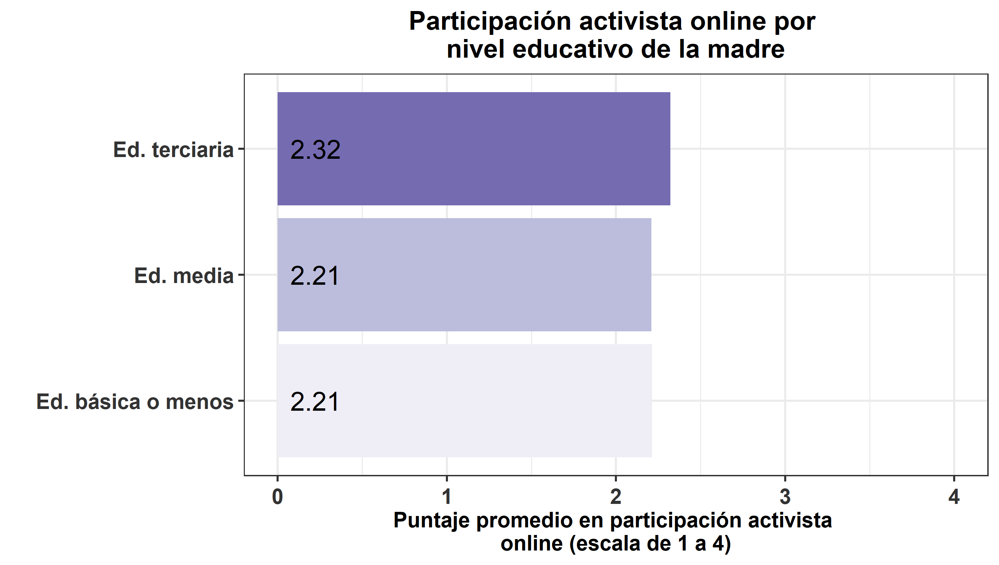

#### **Participación política durante estallido social**

```{r}
### Crear variable
data_wide$part_act_online_es <- as.numeric(data_wide$part_pol_online_info_21 + data_wide$part_pol_online_post_21 + data_wide$part_pol_online_com_21 + data_wide$part_pol_online_seg_21)/4
```

```{r}
# Creación de bbdd
data_ed_bas = data_wide %>%  filter(nse_madre==1 | nse_madre==2 | nse_madre==3) %>% as.data.frame() # Sin Ed. (1), Ed. básica incompleta (2) o completa (3)
data_ed_med = data_wide %>%  filter(nse_madre==4 | nse_madre==5) %>% as.data.frame() # Ed. media incompleta (4) o completa (5)
data_ed_ter = data_wide %>%  filter(nse_madre==6 | nse_madre==7 | nse_madre==8 | nse_madre==9 | nse_madre==10) %>% as.data.frame() # técnico superior incompleto (6) o completo (7) Universitaria incompleta (8) o completa (9), Estudios de postgrado (magíster o doctorado) (10)

#data_ed_tec = data_wide %>%  filter(nse_madre==6 | nse_madre==7) %>% as.data.frame() # técnico superior incompleto (6) o completo (7)
#data_ed_uni = data_wide %>%  filter(nse_madre==8 | nse_madre==9 | nse_madre==10) %>% as.data.frame() # Universitaria incompleta (8) o completa (9), Estudios de postgrado (magíster o doctorado) (10)
```

```{r}
table_preposh1<- rbind(psych::describe(data_ed_bas$part_act_online_es, na.rm=T),
               psych::describe(data_ed_med$part_act_online_es, na.rm=T),
               psych::describe(data_ed_ter$part_act_online_es, na.rm=T))#,
#               psych::describe(data_ed_uni$part_act_online_es, na.rm=T))
table_preposh1 <- table_preposh1 %>% select(n,mean,sd,median,trimmed,min,max)

pond1 <- stats::weighted.mean(x=data_ed_bas$part_act_online_es,y=data_ed_bas$weight_w01,na.rm=TRUE)
pond2 <- stats::weighted.mean(x=data_ed_med$part_act_online_es,y=data_ed_med$weight_w01,na.rm=TRUE)
pond3 <- stats::weighted.mean(x=data_ed_ter$part_act_online_es,y=data_ed_ter$weight_w01,na.rm=TRUE)
#pond4 <- stats::weighted.mean(x=data_ed_uni$part_act_online_es,y=data_ed_uni$weight_w01,na.rm=TRUE)

table_preposh1[1,2]<-pond1
table_preposh1[2,2]<-pond2
table_preposh1[3,2]<-pond3
#table_preposh1[4,2]<-pond4

#table_preposh1$dep <- c("Ed. básica o menos","Ed. media","Técnico superior", "Universitaria o más")
table_preposh1$dep <- c("Ed. básica o menos","Ed. media","Ed. terciaria")

part_act_online_es_colegio <-  ggplot(data=table_preposh1, aes(x=dep, y=mean, fill=dep)) +
     geom_bar(position = 'dodge', stat='identity')+#,width=0.8) 
     scale_fill_brewer(palette="Purples") +
     geom_text(aes(label=format(round(mean,2)), y=0), position=position_dodge(0.9), hjust=-0.25, size=6) +
     theme_bw(base_size = 14) +
     scale_y_continuous(labels = scales::comma) +
     ylab('Puntaje promedio en participación activista 
online (escala de 1 a 4)') + xlab(' ') + 
     theme(legend.position="top") +
     labs(fill = " ") +
    coord_flip()+
    theme(axis.text.x = element_text(colour = "grey20", size = 14, angle = 360, hjust = 0.5, vjust = 0.5, face = "bold"),
          axis.text.y = element_text(colour = "grey20", size = 14), 
          text = element_text(size = 14, face = "bold"),
          plot.title = element_text(hjust=0.5),
          legend.position = "none") + 
     ggtitle("Participación activista online por 
nivel educativo de la madre") + ylim(0,4)
#part_act_online_es_colegio
ggsave(part_act_online_es_colegio, file = "../output/graphs/part_act_online_es_colegio_ed_madre.png",device = "png",width = 23,height = 13,dpi = "retina",units = "cm")

```


#### **Participación política durante el 2020**

```{r}
### Crear variable
data_wide$part_act_online_20 = as.numeric(data_wide$part_pol_online_info_20 + data_wide$part_pol_online_post_20 + data_wide$part_pol_online_com_20 + data_wide$part_pol_online_seg_20	)/4
```

```{r}
# Creación de bbdd
data_ed_bas = data_wide %>%  filter(nse_madre==1 | nse_madre==2 | nse_madre==3) %>% as.data.frame() # Sin Ed. (1), Ed. básica incompleta (2) o completa (3)
data_ed_med = data_wide %>%  filter(nse_madre==4 | nse_madre==5) %>% as.data.frame() # Ed. media incompleta (4) o completa (5)
data_ed_ter = data_wide %>%  filter(nse_madre==6 | nse_madre==7 | nse_madre==8 | nse_madre==9 | nse_madre==10) %>% as.data.frame() # técnico superior incompleto (6) o completo (7) Universitaria incompleta (8) o completa (9), Estudios de postgrado (magíster o doctorado) (10)

#data_ed_tec = data_wide %>%  filter(nse_madre==6 | nse_madre==7) %>% as.data.frame() # técnico superior incompleto (6) o completo (7)
#data_ed_uni = data_wide %>%  filter(nse_madre==8 | nse_madre==9 | nse_madre==10) %>% as.data.frame() # Universitaria incompleta (8) o completa (9), Estudios de postgrado (magíster o doctorado) (10)```

```

```{r}
table_preposh1<- rbind(psych::describe(data_ed_bas$part_act_online_20, na.rm=T),
               psych::describe(data_ed_med$part_act_online_20, na.rm=T),
               psych::describe(data_ed_ter$part_act_online_20, na.rm=T))#,
#               psych::describe(data_ed_uni$part_act_online_20, na.rm=T))
table_preposh1 <- table_preposh1 %>% select(n,mean,sd,median,trimmed,min,max)

pond1 <- stats::weighted.mean(x=data_ed_bas$part_act_online_20,y=data_ed_bas$weight_w01,na.rm=TRUE)
pond2 <- stats::weighted.mean(x=data_ed_med$part_act_online_20,y=data_ed_med$weight_w01,na.rm=TRUE)
pond3 <- stats::weighted.mean(x=data_ed_ter$part_act_online_20,y=data_ed_ter$weight_w01,na.rm=TRUE)
#pond4 <- stats::weighted.mean(x=data_ed_uni$part_act_online_20,y=data_ed_uni$weight_w01,na.rm=TRUE)

table_preposh1[1,2]<-pond1
table_preposh1[2,2]<-pond2
table_preposh1[3,2]<-pond3
#table_preposh1[4,2]<-pond4

#table_preposh1$dep <- c("Ed. básica o menos","Ed. media","Técnico superior", "Universitaria o más")
table_preposh1$dep <- c("Ed. básica o menos","Ed. media","Ed. terciaria")

part_act_online_20_colegio <-  ggplot(data=table_preposh1, aes(x=dep, y=mean, fill=dep)) +
     geom_bar(position = 'dodge', stat='identity')+#,width=0.8) 
     scale_fill_brewer(palette="Purples") +
     geom_text(aes(label=format(round(mean,2)), y=0), position=position_dodge(0.9), hjust=-0.25, size=6) +
     theme_bw(base_size = 14) +
     scale_y_continuous(labels = scales::comma) +
     ylab('Puntaje promedio en participación activista 
online (escala de 1 a 4)') + xlab(' ') + 
     theme(legend.position="top") +
     labs(fill = " ") +
    coord_flip()+
    theme(axis.text.x = element_text(colour = "grey20", size = 14, angle = 360, hjust = 0.5, vjust = 0.5, face = "bold"),
          axis.text.y = element_text(colour = "grey20", size = 14), 
          text = element_text(size = 14, face = "bold"),
          plot.title = element_text(hjust=0.5),
          legend.position = "none") + 
     ggtitle("Participación activista online por 
nivel educativo de la madre") + ylim(0,4)
#part_act_online_20_colegio
ggsave(part_act_online_20_colegio, file = "../output/graphs/part_act_online_20_colegio_ed_madre.png",device = "png",width = 23,height = 13,dpi = "retina",units = "cm")
```


#### **Participación política durante el primer semestre de 2021**

```{r}
#### Crear variable
data_wide$part_act_online_21_1s = as.numeric(data_wide$part_pol_online_info + data_wide$part_pol_online_post + data_wide$part_pol_online_com + data_wide$part_pol_online_seg)/4
```

```{r}
# Creación de bbdd
data_ed_bas = data_wide %>%  filter(nse_madre==1 | nse_madre==2 | nse_madre==3) %>% as.data.frame() # Sin Ed. (1), Ed. básica incompleta (2) o completa (3)
data_ed_med = data_wide %>%  filter(nse_madre==4 | nse_madre==5) %>% as.data.frame() # Ed. media incompleta (4) o completa (5)
data_ed_ter = data_wide %>%  filter(nse_madre==6 | nse_madre==7 | nse_madre==8 | nse_madre==9 | nse_madre==10) %>% as.data.frame() # técnico superior incompleto (6) o completo (7) Universitaria incompleta (8) o completa (9), Estudios de postgrado (magíster o doctorado) (10)

#data_ed_tec = data_wide %>%  filter(nse_madre==6 | nse_madre==7) %>% as.data.frame() # técnico superior incompleto (6) o completo (7)
#data_ed_uni = data_wide %>%  filter(nse_madre==8 | nse_madre==9 | nse_madre==10) %>% as.data.frame() # Universitaria incompleta (8) o completa (9), Estudios de postgrado (magíster o doctorado) (10)
```

```{r}
table_preposh1<- rbind(psych::describe(data_ed_bas$part_act_online_21_1s, na.rm=T),
               psych::describe(data_ed_med$part_act_online_21_1s, na.rm=T),
               psych::describe(data_ed_ter$part_act_online_21_1s, na.rm=T))#,
#               psych::describe(data_ed_uni$part_act_online_21_1s, na.rm=T))
table_preposh1 <- table_preposh1 %>% select(n,mean,sd,median,trimmed,min,max)

pond1 <- stats::weighted.mean(x=data_ed_bas$part_act_online_21_1s,y=data_ed_bas$weight_w01,na.rm=TRUE)
pond2 <- stats::weighted.mean(x=data_ed_med$part_act_online_21_1s,y=data_ed_med$weight_w01,na.rm=TRUE)
pond3 <- stats::weighted.mean(x=data_ed_ter$part_act_online_21_1s,y=data_ed_ter$weight_w01,na.rm=TRUE)
#pond4 <- stats::weighted.mean(x=data_ed_uni$part_act_online_21_1s,y=data_ed_uni$weight_w01,na.rm=TRUE)

table_preposh1[1,2]<-pond1
table_preposh1[2,2]<-pond2
table_preposh1[3,2]<-pond3
#table_preposh1[4,2]<-pond4

#table_preposh1$dep <- c("Ed. básica o menos","Ed. media","Técnico superior", "Universitaria o más")
table_preposh1$dep <- c("Ed. básica o menos","Ed. media","Ed. terciaria")

part_act_online_21_1s_colegio <-  ggplot(data=table_preposh1, aes(x=dep, y=mean, fill=dep)) +
     geom_bar(position = 'dodge', stat='identity')+#,width=0.8) 
     scale_fill_brewer(palette="Purples") +
     geom_text(aes(label=format(round(mean,2)), y=0), position=position_dodge(0.9), hjust=-0.25, size=6) +
     theme_bw(base_size = 14) +
     scale_y_continuous(labels = scales::comma) +
     ylab('Puntaje promedio en participación activista 
online (escala de 1 a 4)') + xlab(' ') + 
     theme(legend.position="top") +
     labs(fill = " ") +
    coord_flip()+
    theme(axis.text.x = element_text(colour = "grey20", size = 14, angle = 360, hjust = 0.5, vjust = 0.5, face = "bold"),
          axis.text.y = element_text(colour = "grey20", size = 14), 
          text = element_text(size = 14, face = "bold"),
          plot.title = element_text(hjust=0.5),
          legend.position = "none") + 
     ggtitle("Participación activista online por 
nivel educativo de la madre") + ylim(0,4)
#part_act_online_21_1s_colegio
ggsave(part_act_online_21_1s_colegio, file = "../output/graphs/part_act_online_21_1s_colegio_ed_madre.png",device = "png",width = 23,height = 13,dpi = "retina",units = "cm")
```


#### **Participación política durante el segundo semestre de 2021**

```{r}
#### Crear variable
data_wide$part_act_online_21_2s = as.numeric(data_wide$part_pol_online_info_21b + data_wide$part_pol_online_post_21b + data_wide$part_pol_online_com_21b + data_wide$part_pol_online_seg_21b)/4
```

```{r}
# Creación de bbdd
data_ed_bas = data_wide %>%  filter(nse_madre==1 | nse_madre==2 | nse_madre==3) %>% as.data.frame() # Sin Ed. (1), Ed. básica incompleta (2) o completa (3)
data_ed_med = data_wide %>%  filter(nse_madre==4 | nse_madre==5) %>% as.data.frame() # Ed. media incompleta (4) o completa (5)
data_ed_ter = data_wide %>%  filter(nse_madre==6 | nse_madre==7 | nse_madre==8 | nse_madre==9 | nse_madre==10) %>% as.data.frame() # técnico superior incompleto (6) o completo (7) Universitaria incompleta (8) o completa (9), Estudios de postgrado (magíster o doctorado) (10)

#data_ed_tec = data_wide %>%  filter(nse_madre==6 | nse_madre==7) %>% as.data.frame() # técnico superior incompleto (6) o completo (7)
#data_ed_uni = data_wide %>%  filter(nse_madre==8 | nse_madre==9 | nse_madre==10) %>% as.data.frame() # Universitaria incompleta (8) o completa (9), Estudios de postgrado (magíster o doctorado) (10)
```

```{r}
table_preposh1<- rbind(psych::describe(data_ed_bas$part_act_online_21_2s, na.rm=T),
               psych::describe(data_ed_med$part_act_online_21_2s, na.rm=T),
               psych::describe(data_ed_ter$part_act_online_21_2s, na.rm=T))#,
#               psych::describe(data_ed_uni$part_act_online_21_2s, na.rm=T))
table_preposh1 <- table_preposh1 %>% select(n,mean,sd,median,trimmed,min,max)

pond1 <- stats::weighted.mean(x=data_ed_bas$part_act_online_21_2s,y=data_ed_bas$weight_w01,na.rm=TRUE)
pond2 <- stats::weighted.mean(x=data_ed_med$part_act_online_21_2s,y=data_ed_med$weight_w01,na.rm=TRUE)
pond3 <- stats::weighted.mean(x=data_ed_ter$part_act_online_21_2s,y=data_ed_ter$weight_w01,na.rm=TRUE)
#pond4 <- stats::weighted.mean(x=data_ed_uni$part_act_online_21_2s,y=data_ed_uni$weight_w01,na.rm=TRUE)

table_preposh1[1,2]<-pond1
table_preposh1[2,2]<-pond2
table_preposh1[3,2]<-pond3
#table_preposh1[4,2]<-pond4

#table_preposh1$dep <- c("Ed. básica o menos","Ed. media","Técnico superior", "Universitaria o más")
table_preposh1$dep <- c("Ed. básica o menos","Ed. media","Ed. terciaria")

part_act_online_21_2s_colegio <-  ggplot(data=table_preposh1, aes(x=dep, y=mean, fill=dep)) +
     geom_bar(position = 'dodge', stat='identity')+#,width=0.8) 
     scale_fill_brewer(palette="Purples") +
     geom_text(aes(label=format(round(mean,2)), y=0), position=position_dodge(0.9), hjust=-0.25, size=6) +
     theme_bw(base_size = 14) +
     scale_y_continuous(labels = scales::comma) +
     ylab('Puntaje promedio en participación activista 
online (escala de 1 a 4)') + xlab(' ') + 
     theme(legend.position="top") +
     labs(fill = " ") +
    coord_flip()+
    theme(axis.text.x = element_text(colour = "grey20", size = 14, angle = 360, hjust = 0.5, vjust = 0.5, face = "bold"),
          axis.text.y = element_text(colour = "grey20", size = 14), 
          text = element_text(size = 14, face = "bold"),
          plot.title = element_text(hjust=0.5),
          legend.position = "none") + 
     ggtitle("Participación activista online por 
nivel educativo de la madre") + ylim(0,4)
#part_act_online_21_2s_colegio
ggsave(part_act_online_21_2s_colegio, file = "../output/graphs/part_act_online_21_2s_colegio_ed_madre.png",device = "png",width = 23,height = 13,dpi = "retina",units = "cm")
```


### Máximo nivel educativo del padre

En esta sección se presentan los resultados descriptivos de la relación entre el máximo nivel educativo del padre y la participación activista disruptiva del encuestado.

En términos generales, no es posible visualizar un patrón claro de la relación entre ambas variables. En otras palabras, los resultados expuestos en los gráficos no evidencian una relación consistente entre la dependencia administrativa del establecimiento y la participación disruptiva. Sin embargo, se ve una leve relación entre que el padre tenga educación terciaria y realizar prácticas de activismo online en cuatro de los cinco momentos por los que se consultó (solo durante la enseñanza media no se ve este patrón).

#### **Participación política durante 3ro y 4to medio**

```{r}
### Crear variable
data_wide$part_act_online_3y4 <- as.numeric(data_wide$part_pol_online + data_wide$part_online_post + data_wide$part_online_com + data_wide$part_online_seg)/4
```

```{r}
# Creación de bbdd
data_ed_bas = data_wide %>%  filter(nse_padre==1 | nse_padre==2 | nse_padre==3) %>% as.data.frame() # Sin Ed. (1), Ed. básica incompleta (2) o completa (3)
data_ed_med = data_wide %>%  filter(nse_padre==4 | nse_padre==5) %>% as.data.frame() # Ed. media incompleta (4) o completa (5)
data_ed_ter = data_wide %>%  filter(nse_padre==6 | nse_padre==7 | nse_padre==8 | nse_padre==9 | nse_padre==10) %>% as.data.frame() # técnico superior incompleto (6) o completo (7) Universitaria incompleta (8) o completa (9), Estudios de postgrado (magíster o doctorado) (10)

#data_ed_tec = data_wide %>%  filter(nse_padre==6 | nse_padre==7) %>% as.data.frame() # técnico superior incompleto (6) o completo (7)
#data_ed_uni = data_wide %>%  filter(nse_padre==8 | nse_padre==9 | nse_padre==10) %>% as.data.frame() # Universitaria incompleta (8) o completa (9), Estudios de postgrado (magíster o doctorado) (10)

```

```{r}
table_preposh1<- rbind(psych::describe(data_ed_bas$part_act_online_3y4, na.rm=T),
               psych::describe(data_ed_med$part_act_online_3y4, na.rm=T),
               psych::describe(data_ed_ter$part_act_online_3y4, na.rm=T))#,
#               psych::describe(data_ed_uni$part_act_online_3y4, na.rm=T))
table_preposh1 <- table_preposh1 %>% select(n,mean,sd,median,trimmed,min,max)

pond1 <- stats::weighted.mean(x=data_ed_bas$part_act_online_3y4,y=data_ed_bas$weight_w01,na.rm=TRUE)
pond2 <- stats::weighted.mean(x=data_ed_med$part_act_online_3y4,y=data_ed_med$weight_w01,na.rm=TRUE)
pond3 <- stats::weighted.mean(x=data_ed_ter$part_act_online_3y4,y=data_ed_ter$weight_w01,na.rm=TRUE)
#pond4 <- stats::weighted.mean(x=data_ed_uni$part_act_online_3y4,y=data_ed_uni$weight_w01,na.rm=TRUE)

table_preposh1[1,2]<-pond1
table_preposh1[2,2]<-pond2
table_preposh1[3,2]<-pond3
#table_preposh1[4,2]<-pond4

#table_preposh1$dep <- c("Ed. básica o menos","Ed. media","Técnico superior", "Universitaria o más")
table_preposh1$dep <- c("Ed. básica o menos","Ed. media","Ed. terciaria")

part_act_online_3y4_colegio <-  ggplot(data=table_preposh1, aes(x=dep, y=mean, fill=dep)) +
     geom_bar(position = 'dodge', stat='identity')+#,width=0.8) 
     scale_fill_brewer(palette="Purples") +
     geom_text(aes(label=format(round(mean,2)), y=0), position=position_dodge(0.9), hjust=-0.25, size=6) +
     theme_bw(base_size = 14) +
     scale_y_continuous(labels = scales::comma) +
     ylab('Puntaje promedio en participación activista 
online (escala de 1 a 4)') + xlab(' ') + 
     theme(legend.position="top") +
     labs(fill = " ") +
    coord_flip()+
    theme(axis.text.x = element_text(colour = "grey20", size = 14, angle = 360, hjust = 0.5, vjust = 0.5, face = "bold"),
          axis.text.y = element_text(colour = "grey20", size = 14), 
          text = element_text(size = 14, face = "bold"),
          plot.title = element_text(hjust=0.5),
          legend.position = "none") + 
     ggtitle("Participación activista online por 
nivel educativo del padre") + ylim(0,4)
#part_act_online_3y4_colegio
ggsave(part_act_online_3y4_colegio, file = "../output/graphs/part_act_online_3y4_colegio_ed_padre.png",device = "png",width = 23,height = 13,dpi = "retina",units = "cm")

```


#### **Participación política durante estallido social**

```{r}
### Crear variable
data_wide$part_act_online_es <- as.numeric(data_wide$part_pol_online_info_21 + data_wide$part_pol_online_post_21 + data_wide$part_pol_online_com_21 + data_wide$part_pol_online_seg_21)/4
```

```{r}
# Creación de bbdd
data_ed_bas = data_wide %>%  filter(nse_padre==1 | nse_padre==2 | nse_padre==3) %>% as.data.frame() # Sin Ed. (1), Ed. básica incompleta (2) o completa (3)
data_ed_med = data_wide %>%  filter(nse_padre==4 | nse_padre==5) %>% as.data.frame() # Ed. media incompleta (4) o completa (5)
data_ed_ter = data_wide %>%  filter(nse_padre==6 | nse_padre==7 | nse_padre==8 | nse_padre==9 | nse_padre==10) %>% as.data.frame() # técnico superior incompleto (6) o completo (7) Universitaria incompleta (8) o completa (9), Estudios de postgrado (magíster o doctorado) (10)

#data_ed_tec = data_wide %>%  filter(nse_padre==6 | nse_padre==7) %>% as.data.frame() # técnico superior incompleto (6) o completo (7)
#data_ed_uni = data_wide %>%  filter(nse_padre==8 | nse_padre==9 | nse_padre==10) %>% as.data.frame() # Universitaria incompleta (8) o completa (9), Estudios de postgrado (magíster o doctorado) (10)

```

```{r}
table_preposh1<- rbind(psych::describe(data_ed_bas$part_act_online_es, na.rm=T),
               psych::describe(data_ed_med$part_act_online_es, na.rm=T),
               psych::describe(data_ed_ter$part_act_online_es, na.rm=T))#,
#               psych::describe(data_ed_uni$part_act_online_es, na.rm=T))
table_preposh1 <- table_preposh1 %>% select(n,mean,sd,median,trimmed,min,max)

pond1 <- stats::weighted.mean(x=data_ed_bas$part_act_online_es,y=data_ed_bas$weight_w01,na.rm=TRUE)
pond2 <- stats::weighted.mean(x=data_ed_med$part_act_online_es,y=data_ed_med$weight_w01,na.rm=TRUE)
pond3 <- stats::weighted.mean(x=data_ed_ter$part_act_online_es,y=data_ed_ter$weight_w01,na.rm=TRUE)
#pond4 <- stats::weighted.mean(x=data_ed_uni$part_act_online_es,y=data_ed_uni$weight_w01,na.rm=TRUE)

table_preposh1[1,2]<-pond1
table_preposh1[2,2]<-pond2
table_preposh1[3,2]<-pond3
#table_preposh1[4,2]<-pond4

#table_preposh1$dep <- c("Ed. básica o menos","Ed. media","Técnico superior", "Universitaria o más")
table_preposh1$dep <- c("Ed. básica o menos","Ed. media","Ed. terciaria")

part_act_online_es_colegio <-  ggplot(data=table_preposh1, aes(x=dep, y=mean, fill=dep)) +
     geom_bar(position = 'dodge', stat='identity')+#,width=0.8) 
     scale_fill_brewer(palette="Purples") +
     geom_text(aes(label=format(round(mean,2)), y=0), position=position_dodge(0.9), hjust=-0.25, size=6) +
     theme_bw(base_size = 14) +
     scale_y_continuous(labels = scales::comma) +
     ylab('Puntaje promedio en participación activista 
online (escala de 1 a 4)') + xlab(' ') + 
     theme(legend.position="top") +
     labs(fill = " ") +
    coord_flip()+
    theme(axis.text.x = element_text(colour = "grey20", size = 14, angle = 360, hjust = 0.5, vjust = 0.5, face = "bold"),
          axis.text.y = element_text(colour = "grey20", size = 14), 
          text = element_text(size = 14, face = "bold"),
          plot.title = element_text(hjust=0.5),
          legend.position = "none") + 
     ggtitle("Participación activista online por 
nivel educativo del padre") + ylim(0,4)
#part_act_online_es_colegio
ggsave(part_act_online_es_colegio, file = "../output/graphs/part_act_online_es_colegio_ed_padre.png",device = "png",width = 23,height = 13,dpi = "retina",units = "cm")

```


#### **Participación política durante el 2020**

```{r}
### Crear variable
data_wide$part_act_online_20 = as.numeric(data_wide$part_pol_online_info_20 + data_wide$part_pol_online_post_20 + data_wide$part_pol_online_com_20 + data_wide$part_pol_online_seg_20	)/4
```

```{r}
# Creación de bbdd
data_ed_bas = data_wide %>%  filter(nse_padre==1 | nse_padre==2 | nse_padre==3) %>% as.data.frame() # Sin Ed. (1), Ed. básica incompleta (2) o completa (3)
data_ed_med = data_wide %>%  filter(nse_padre==4 | nse_padre==5) %>% as.data.frame() # Ed. media incompleta (4) o completa (5)
data_ed_ter = data_wide %>%  filter(nse_padre==6 | nse_padre==7 | nse_padre==8 | nse_padre==9 | nse_padre==10) %>% as.data.frame() # técnico superior incompleto (6) o completo (7) Universitaria incompleta (8) o completa (9), Estudios de postgrado (magíster o doctorado) (10)

#data_ed_tec = data_wide %>%  filter(nse_padre==6 | nse_padre==7) %>% as.data.frame() # técnico superior incompleto (6) o completo (7)
#data_ed_uni = data_wide %>%  filter(nse_padre==8 | nse_padre==9 | nse_padre==10) %>% as.data.frame() # Universitaria incompleta (8) o completa (9), Estudios de postgrado (magíster o doctorado) (10)

```

```{r}
table_preposh1<- rbind(psych::describe(data_ed_bas$part_act_online_20, na.rm=T),
               psych::describe(data_ed_med$part_act_online_20, na.rm=T),
               psych::describe(data_ed_ter$part_act_online_20, na.rm=T))#,
#               psych::describe(data_ed_uni$part_act_online_20, na.rm=T))
table_preposh1 <- table_preposh1 %>% select(n,mean,sd,median,trimmed,min,max)

pond1 <- stats::weighted.mean(x=data_ed_bas$part_act_online_20,y=data_ed_bas$weight_w01,na.rm=TRUE)
pond2 <- stats::weighted.mean(x=data_ed_med$part_act_online_20,y=data_ed_med$weight_w01,na.rm=TRUE)
pond3 <- stats::weighted.mean(x=data_ed_ter$part_act_online_20,y=data_ed_ter$weight_w01,na.rm=TRUE)
#pond4 <- stats::weighted.mean(x=data_ed_uni$part_act_online_20,y=data_ed_uni$weight_w01,na.rm=TRUE)

table_preposh1[1,2]<-pond1
table_preposh1[2,2]<-pond2
table_preposh1[3,2]<-pond3
#table_preposh1[4,2]<-pond4

#table_preposh1$dep <- c("Ed. básica o menos","Ed. media","Técnico superior", "Universitaria o más")
table_preposh1$dep <- c("Ed. básica o menos","Ed. media","Ed. terciaria")

part_act_online_20_colegio <-  ggplot(data=table_preposh1, aes(x=dep, y=mean, fill=dep)) +
     geom_bar(position = 'dodge', stat='identity')+#,width=0.8) 
     scale_fill_brewer(palette="Purples") +
     geom_text(aes(label=format(round(mean,2)), y=0), position=position_dodge(0.9), hjust=-0.25, size=6) +
     theme_bw(base_size = 14) +
     scale_y_continuous(labels = scales::comma) +
     ylab('Puntaje promedio en participación activista 
online (escala de 1 a 4)') + xlab(' ') + 
     theme(legend.position="top") +
     labs(fill = " ") +
    coord_flip()+
    theme(axis.text.x = element_text(colour = "grey20", size = 14, angle = 360, hjust = 0.5, vjust = 0.5, face = "bold"),
          axis.text.y = element_text(colour = "grey20", size = 14), 
          text = element_text(size = 14, face = "bold"),
          plot.title = element_text(hjust=0.5),
          legend.position = "none") + 
     ggtitle("Participación activista online por 
nivel educativo del padre") + ylim(0,4)
#part_act_online_20_colegio
ggsave(part_act_online_20_colegio, file = "../output/graphs/part_act_online_20_colegio_ed_padre.png",device = "png",width = 23,height = 13,dpi = "retina",units = "cm")
```


#### **Participación política durante el primer semestre de 2021**

```{r}
#### Crear variable
data_wide$part_act_online_21_1s = as.numeric(data_wide$part_pol_online_info + data_wide$part_pol_online_post + data_wide$part_pol_online_com + data_wide$part_pol_online_seg)/4
```

```{r}
# Creación de bbdd
data_ed_bas = data_wide %>%  filter(nse_padre==1 | nse_padre==2 | nse_padre==3) %>% as.data.frame() # Sin Ed. (1), Ed. básica incompleta (2) o completa (3)
data_ed_med = data_wide %>%  filter(nse_padre==4 | nse_padre==5) %>% as.data.frame() # Ed. media incompleta (4) o completa (5)
data_ed_ter = data_wide %>%  filter(nse_padre==6 | nse_padre==7 | nse_padre==8 | nse_padre==9 | nse_padre==10) %>% as.data.frame() # técnico superior incompleto (6) o completo (7) Universitaria incompleta (8) o completa (9), Estudios de postgrado (magíster o doctorado) (10)

#data_ed_tec = data_wide %>%  filter(nse_padre==6 | nse_padre==7) %>% as.data.frame() # técnico superior incompleto (6) o completo (7)
#data_ed_uni = data_wide %>%  filter(nse_padre==8 | nse_padre==9 | nse_padre==10) %>% as.data.frame() # Universitaria incompleta (8) o completa (9), Estudios de postgrado (magíster o doctorado) (10)

```

```{r}
table_preposh1<- rbind(psych::describe(data_ed_bas$part_act_online_21_1s, na.rm=T),
               psych::describe(data_ed_med$part_act_online_21_1s, na.rm=T),
               psych::describe(data_ed_ter$part_act_online_21_1s, na.rm=T))#,
#               psych::describe(data_ed_uni$part_act_online_21_1s, na.rm=T))
table_preposh1 <- table_preposh1 %>% select(n,mean,sd,median,trimmed,min,max)

pond1 <- stats::weighted.mean(x=data_ed_bas$part_act_online_21_1s,y=data_ed_bas$weight_w01,na.rm=TRUE)
pond2 <- stats::weighted.mean(x=data_ed_med$part_act_online_21_1s,y=data_ed_med$weight_w01,na.rm=TRUE)
pond3 <- stats::weighted.mean(x=data_ed_ter$part_act_online_21_1s,y=data_ed_ter$weight_w01,na.rm=TRUE)
#pond4 <- stats::weighted.mean(x=data_ed_uni$part_act_online_21_1s,y=data_ed_uni$weight_w01,na.rm=TRUE)

table_preposh1[1,2]<-pond1
table_preposh1[2,2]<-pond2
table_preposh1[3,2]<-pond3
#table_preposh1[4,2]<-pond4

#table_preposh1$dep <- c("Ed. básica o menos","Ed. media","Técnico superior", "Universitaria o más")
table_preposh1$dep <- c("Ed. básica o menos","Ed. media","Ed. terciaria")

part_act_online_21_1s_colegio <-  ggplot(data=table_preposh1, aes(x=dep, y=mean, fill=dep)) +
     geom_bar(position = 'dodge', stat='identity')+#,width=0.8) 
     scale_fill_brewer(palette="Purples") +
     geom_text(aes(label=format(round(mean,2)), y=0), position=position_dodge(0.9), hjust=-0.25, size=6) +
     theme_bw(base_size = 14) +
     scale_y_continuous(labels = scales::comma) +
     ylab('Puntaje promedio en participación activista 
online (escala de 1 a 4)') + xlab(' ') + 
     theme(legend.position="top") +
     labs(fill = " ") +
    coord_flip()+
    theme(axis.text.x = element_text(colour = "grey20", size = 14, angle = 360, hjust = 0.5, vjust = 0.5, face = "bold"),
          axis.text.y = element_text(colour = "grey20", size = 14), 
          text = element_text(size = 14, face = "bold"),
          plot.title = element_text(hjust=0.5),
          legend.position = "none") + 
     ggtitle("Participación activista online por 
nivel educativo del padre") + ylim(0,4)
#part_act_online_21_1s_colegio
ggsave(part_act_online_21_1s_colegio, file = "../output/graphs/part_act_online_21_1s_colegio_ed_padre.png",device = "png",width = 23,height = 13,dpi = "retina",units = "cm")
```


#### **Participación política durante el segundo semestre de 2021**

```{r}
#### Crear variable
data_wide$part_act_online_21_2s = as.numeric(data_wide$part_pol_online_info_21b + data_wide$part_pol_online_post_21b + data_wide$part_pol_online_com_21b + data_wide$part_pol_online_seg_21b)/4
```

```{r}
# Creación de bbdd
data_ed_bas = data_wide %>%  filter(nse_padre==1 | nse_padre==2 | nse_padre==3) %>% as.data.frame() # Sin Ed. (1), Ed. básica incompleta (2) o completa (3)
data_ed_med = data_wide %>%  filter(nse_padre==4 | nse_padre==5) %>% as.data.frame() # Ed. media incompleta (4) o completa (5)
data_ed_ter = data_wide %>%  filter(nse_padre==6 | nse_padre==7 | nse_padre==8 | nse_padre==9 | nse_padre==10) %>% as.data.frame() # técnico superior incompleto (6) o completo (7) Universitaria incompleta (8) o completa (9), Estudios de postgrado (magíster o doctorado) (10)

#data_ed_tec = data_wide %>%  filter(nse_padre==6 | nse_padre==7) %>% as.data.frame() # técnico superior incompleto (6) o completo (7)
#data_ed_uni = data_wide %>%  filter(nse_padre==8 | nse_padre==9 | nse_padre==10) %>% as.data.frame() # Universitaria incompleta (8) o completa (9), Estudios de postgrado (magíster o doctorado) (10)

```

```{r}
table_preposh1<- rbind(psych::describe(data_ed_bas$part_act_online_21_2s, na.rm=T),
               psych::describe(data_ed_med$part_act_online_21_2s, na.rm=T),
               psych::describe(data_ed_ter$part_act_online_21_2s, na.rm=T))#,
#               psych::describe(data_ed_uni$part_act_online_21_2s, na.rm=T))
table_preposh1 <- table_preposh1 %>% select(n,mean,sd,median,trimmed,min,max)

pond1 <- stats::weighted.mean(x=data_ed_bas$part_act_online_21_2s,y=data_ed_bas$weight_w01,na.rm=TRUE)
pond2 <- stats::weighted.mean(x=data_ed_med$part_act_online_21_2s,y=data_ed_med$weight_w01,na.rm=TRUE)
pond3 <- stats::weighted.mean(x=data_ed_ter$part_act_online_21_2s,y=data_ed_ter$weight_w01,na.rm=TRUE)
#pond4 <- stats::weighted.mean(x=data_ed_uni$part_act_online_21_2s,y=data_ed_uni$weight_w01,na.rm=TRUE)

table_preposh1[1,2]<-pond1
table_preposh1[2,2]<-pond2
table_preposh1[3,2]<-pond3
#table_preposh1[4,2]<-pond4

#table_preposh1$dep <- c("Ed. básica o menos","Ed. media","Técnico superior", "Universitaria o más")
table_preposh1$dep <- c("Ed. básica o menos","Ed. media","Ed. terciaria")

part_act_online_21_2s_colegio <-  ggplot(data=table_preposh1, aes(x=dep, y=mean, fill=dep)) +
     geom_bar(position = 'dodge', stat='identity')+#,width=0.8) 
     scale_fill_brewer(palette="Purples") +
     geom_text(aes(label=format(round(mean,2)), y=0), position=position_dodge(0.9), hjust=-0.25, size=6) +
     theme_bw(base_size = 14) +
     scale_y_continuous(labels = scales::comma) +
     ylab('Puntaje promedio en participación activista 
online (escala de 1 a 4)') + xlab(' ') + 
     theme(legend.position="top") +
     labs(fill = " ") +
    coord_flip()+
    theme(axis.text.x = element_text(colour = "grey20", size = 14, angle = 360, hjust = 0.5, vjust = 0.5, face = "bold"),
          axis.text.y = element_text(colour = "grey20", size = 14), 
          text = element_text(size = 14, face = "bold"),
          plot.title = element_text(hjust=0.5),
          legend.position = "none") + 
     ggtitle("Participación activista online por 
nivel educativo del padre") + ylim(0,4)
#part_act_online_21_2s_colegio
ggsave(part_act_online_21_2s_colegio, file = "../output/graphs/part_act_online_21_2s_colegio_ed_padre.png",device = "png",width = 23,height = 13,dpi = "retina",units = "cm")
```


### Frecuencia de conversación con los padres sobre temas sociales y/o políticos

En esta sección se presentan los resultados descriptivos de la relación entre la frecuencia de conversación con los padres sobre temas sociales y/o políticos en cada uno de los momentos sobre los que se consultó y la participación activista online del encuestado.

En términos generales, es posible visualizar una relación entre la frecuencia de conversación con los padres sobre estas temáticas y realizar prácticas de activismo online en todos los momentos sobre los que se consultó.

#### **Participación política durante 3ro y 4to medio**

```{r}
### Crear variable
data_wide$part_act_online_3y4 <- as.numeric(data_wide$part_pol_online + data_wide$part_online_post + data_wide$part_online_com + data_wide$part_online_seg)/4
```

```{r}
# Creación de bbdd
data_nunca = data_wide %>%  filter(conv_padr_poli==1) %>% as.data.frame() # Nunca
data_casi_nunca = data_wide %>%  filter(conv_padr_poli==2) %>% as.data.frame() # Casi nunca
data_a_veces = data_wide %>%  filter(conv_padr_poli==3) %>% as.data.frame() # A veces
data_frecuent = data_wide %>%  filter(conv_padr_poli==4) %>% as.data.frame() # Frecuentemente
```

```{r}
table_preposh1<- rbind(psych::describe(data_nunca$part_act_online_3y4, na.rm=T),
               psych::describe(data_casi_nunca$part_act_online_3y4, na.rm=T),
               psych::describe(data_a_veces$part_act_online_3y4, na.rm=T),
               psych::describe(data_frecuent$part_act_online_3y4, na.rm=T))
table_preposh1 <- table_preposh1 %>% select(n,mean,sd,median,trimmed,min,max)

pond1 <- stats::weighted.mean(x=data_nunca$part_act_online_3y4,y=data_nunca$weight_w01,na.rm=TRUE)
pond2 <- stats::weighted.mean(x=data_casi_nunca$part_act_online_3y4,y=data_casi_nunca$weight_w01,na.rm=TRUE)
pond3 <- stats::weighted.mean(x=data_a_veces$part_act_online_3y4,y=data_a_veces$weight_w01,na.rm=TRUE)
pond4 <- stats::weighted.mean(x=data_frecuent$part_act_online_3y4,y=data_frecuent$weight_w01,na.rm=TRUE)

table_preposh1[1,2]<-pond1
table_preposh1[2,2]<-pond2
table_preposh1[3,2]<-pond3
table_preposh1[4,2]<-pond4

table_preposh1$dep <- c("1. Nunca","2. Casi nunca","3. A veces", "4. Frecuentemente")

part_act_online_3y4_colegio <-  ggplot(data=table_preposh1, aes(x=dep, y=mean, fill=dep)) +
     geom_bar(position = 'dodge', stat='identity')+#,width=0.8) 
     scale_fill_brewer(palette="Purples") +
     geom_text(aes(label=format(round(mean,2)), y=0), position=position_dodge(0.9), hjust=-0.25, size=6) +
     theme_bw(base_size = 14) +
     scale_y_continuous(labels = scales::comma) +
     ylab('Puntaje promedio en participación activista 
online (escala de 1 a 4)') + xlab(' ') + 
     theme(legend.position="top") +
     labs(fill = " ") +
    coord_flip()+
    theme(axis.text.x = element_text(colour = "grey20", size = 14, angle = 360, hjust = 0.5, vjust = 0.5, face = "bold"),
          axis.text.y = element_text(colour = "grey20", size = 14), 
          text = element_text(size = 14, face = "bold"),
          plot.title = element_text(hjust=0.5),
          legend.position = "none") + 
     ggtitle("Participación activista online por 
conversación con los padres sobre temas políticos y/o sociales") + ylim(0,4)
#part_act_online_3y4_colegio
ggsave(part_act_online_3y4_colegio, file = "../output/graphs/part_act_online_3y4_colegio_conv_padres.png",device = "png",width = 23,height = 13,dpi = "retina",units = "cm")

```


#### **Participación política durante estallido social**

```{r}
### Crear variable
data_wide$part_act_online_es <- as.numeric(data_wide$part_pol_online_info_21 + data_wide$part_pol_online_post_21 + data_wide$part_pol_online_com_21 + data_wide$part_pol_online_seg_21)/4
```

```{r}
# Creación de bbdd
data_nunca = data_wide %>%  filter(conv_padres_21==1) %>% as.data.frame() # Nunca
data_casi_nunca = data_wide %>%  filter(conv_padres_21==2) %>% as.data.frame() # Casi nunca
data_a_veces = data_wide %>%  filter(conv_padres_21==3) %>% as.data.frame() # A veces
data_frecuent = data_wide %>%  filter(conv_padres_21==4) %>% as.data.frame() # Frecuentemente
```

```{r}
table_preposh1<- rbind(psych::describe(data_nunca$part_act_online_es, na.rm=T),
               psych::describe(data_casi_nunca$part_act_online_es, na.rm=T),
               psych::describe(data_a_veces$part_act_online_es, na.rm=T),
               psych::describe(data_frecuent$part_act_online_es, na.rm=T))
table_preposh1 <- table_preposh1 %>% select(n,mean,sd,median,trimmed,min,max)

pond1 <- stats::weighted.mean(x=data_nunca$part_act_online_es,y=data_nunca$weight_w01,na.rm=TRUE)
pond2 <- stats::weighted.mean(x=data_casi_nunca$part_act_online_es,y=data_casi_nunca$weight_w01,na.rm=TRUE)
pond3 <- stats::weighted.mean(x=data_a_veces$part_act_online_es,y=data_a_veces$weight_w01,na.rm=TRUE)
pond4 <- stats::weighted.mean(x=data_frecuent$part_act_online_es,y=data_frecuent$weight_w01,na.rm=TRUE)

table_preposh1[1,2]<-pond1
table_preposh1[2,2]<-pond2
table_preposh1[3,2]<-pond3
table_preposh1[4,2]<-pond4

table_preposh1$dep <- c("1. Nunca","2. Casi nunca","3. A veces", "4. Frecuentemente")

part_act_online_es_colegio <-  ggplot(data=table_preposh1, aes(x=dep, y=mean, fill=dep)) +
     geom_bar(position = 'dodge', stat='identity')+#,width=0.8) 
     scale_fill_brewer(palette="Purples") +
     geom_text(aes(label=format(round(mean,2)), y=0), position=position_dodge(0.9), hjust=-0.25, size=6) +
     theme_bw(base_size = 14) +
     scale_y_continuous(labels = scales::comma) +
     ylab('Puntaje promedio en participación activista 
online (escala de 1 a 4)') + xlab(' ') + 
     theme(legend.position="top") +
     labs(fill = " ") +
    coord_flip()+
    theme(axis.text.x = element_text(colour = "grey20", size = 14, angle = 360, hjust = 0.5, vjust = 0.5, face = "bold"),
          axis.text.y = element_text(colour = "grey20", size = 14), 
          text = element_text(size = 14, face = "bold"),
          plot.title = element_text(hjust=0.5),
          legend.position = "none") + 
     ggtitle("Participación activista online por 
conversación con los padres sobre temas políticos y/o sociales") + ylim(0,4)
#part_act_online_es_colegio
ggsave(part_act_online_es_colegio, file = "../output/graphs/part_act_online_es_colegio_conv_padres.png",device = "png",width = 23,height = 13,dpi = "retina",units = "cm")

```
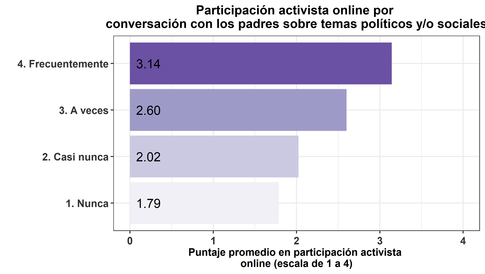

#### **Participación política durante el 2020**

```{r}
### Crear variable
data_wide$part_act_online_20 = as.numeric(data_wide$part_pol_online_info_20 + data_wide$part_pol_online_post_20 + data_wide$part_pol_online_com_20 + data_wide$part_pol_online_seg_20	)/4
```

```{r}
# Creación de bbdd
data_nunca = data_wide %>%  filter(conv_padres_20==1) %>% as.data.frame() # Nunca
data_casi_nunca = data_wide %>%  filter(conv_padres_20==2) %>% as.data.frame() # Casi nunca
data_a_veces = data_wide %>%  filter(conv_padres_20==3) %>% as.data.frame() # A veces
data_frecuent = data_wide %>%  filter(conv_padres_20==4) %>% as.data.frame() # Frecuentemente
```

```{r}
table_preposh1<- rbind(psych::describe(data_nunca$part_act_online_20, na.rm=T),
               psych::describe(data_casi_nunca$part_act_online_20, na.rm=T),
               psych::describe(data_a_veces$part_act_online_20, na.rm=T),
               psych::describe(data_frecuent$part_act_online_20, na.rm=T))
table_preposh1 <- table_preposh1 %>% select(n,mean,sd,median,trimmed,min,max)

pond1 <- stats::weighted.mean(x=data_nunca$part_act_online_20,y=data_nunca$weight_w01,na.rm=TRUE)
pond2 <- stats::weighted.mean(x=data_casi_nunca$part_act_online_20,y=data_casi_nunca$weight_w01,na.rm=TRUE)
pond3 <- stats::weighted.mean(x=data_a_veces$part_act_online_20,y=data_a_veces$weight_w01,na.rm=TRUE)
pond4 <- stats::weighted.mean(x=data_frecuent$part_act_online_20,y=data_frecuent$weight_w01,na.rm=TRUE)

table_preposh1[1,2]<-pond1
table_preposh1[2,2]<-pond2
table_preposh1[3,2]<-pond3
table_preposh1[4,2]<-pond4

table_preposh1$dep <- c("1. Nunca","2. Casi nunca","3. A veces", "4. Frecuentemente")

part_act_online_20_colegio <-  ggplot(data=table_preposh1, aes(x=dep, y=mean, fill=dep)) +
     geom_bar(position = 'dodge', stat='identity')+#,width=0.8) 
     scale_fill_brewer(palette="Purples") +
     geom_text(aes(label=format(round(mean,2)), y=0), position=position_dodge(0.9), hjust=-0.25, size=6) +
     theme_bw(base_size = 14) +
     scale_y_continuous(labels = scales::comma) +
     ylab('Puntaje promedio en participación activista 
online (escala de 1 a 4)') + xlab(' ') + 
     theme(legend.position="top") +
     labs(fill = " ") +
    coord_flip()+
    theme(axis.text.x = element_text(colour = "grey20", size = 14, angle = 360, hjust = 0.5, vjust = 0.5, face = "bold"),
          axis.text.y = element_text(colour = "grey20", size = 14), 
          text = element_text(size = 14, face = "bold"),
          plot.title = element_text(hjust=0.5),
          legend.position = "none") + 
     ggtitle("Participación activista online por 
conversación con los padres sobre temas políticos y/o sociales") + ylim(0,4)
#part_act_online_20_colegio
ggsave(part_act_online_20_colegio, file = "../output/graphs/part_act_online_20_colegio_conv_padres.png",device = "png",width = 23,height = 13,dpi = "retina",units = "cm")
```


#### **Participación política durante el primer semestre de 2021**

```{r}
#### Crear variable
data_wide$part_act_online_21_1s = as.numeric(data_wide$part_pol_online_info + data_wide$part_pol_online_post + data_wide$part_pol_online_com + data_wide$part_pol_online_seg)/4
```

```{r}
# Creación de bbdd
data_nunca = data_wide %>%  filter(conv_padres==1) %>% as.data.frame() # Nunca
data_casi_nunca = data_wide %>%  filter(conv_padres==2) %>% as.data.frame() # Casi nunca
data_a_veces = data_wide %>%  filter(conv_padres==3) %>% as.data.frame() # A veces
data_frecuent = data_wide %>%  filter(conv_padres==4) %>% as.data.frame() # Frecuentemente
```

```{r}
table_preposh1<- rbind(psych::describe(data_nunca$part_act_online_21_1s, na.rm=T),
               psych::describe(data_casi_nunca$part_act_online_21_1s, na.rm=T),
               psych::describe(data_a_veces$part_act_online_21_1s, na.rm=T),
               psych::describe(data_frecuent$part_act_online_21_1s, na.rm=T))
table_preposh1 <- table_preposh1 %>% select(n,mean,sd,median,trimmed,min,max)

pond1 <- stats::weighted.mean(x=data_nunca$part_act_online_21_1s,y=data_nunca$weight_w01,na.rm=TRUE)
pond2 <- stats::weighted.mean(x=data_casi_nunca$part_act_online_21_1s,y=data_casi_nunca$weight_w01,na.rm=TRUE)
pond3 <- stats::weighted.mean(x=data_a_veces$part_act_online_21_1s,y=data_a_veces$weight_w01,na.rm=TRUE)
pond4 <- stats::weighted.mean(x=data_frecuent$part_act_online_21_1s,y=data_frecuent$weight_w01,na.rm=TRUE)

table_preposh1[1,2]<-pond1
table_preposh1[2,2]<-pond2
table_preposh1[3,2]<-pond3
table_preposh1[4,2]<-pond4

table_preposh1$dep <- c("1. Nunca","2. Casi nunca","3. A veces", "4. Frecuentemente")

part_act_online_21_1s_colegio <-  ggplot(data=table_preposh1, aes(x=dep, y=mean, fill=dep)) +
     geom_bar(position = 'dodge', stat='identity')+#,width=0.8) 
     scale_fill_brewer(palette="Purples") +
     geom_text(aes(label=format(round(mean,2)), y=0), position=position_dodge(0.9), hjust=-0.25, size=6) +
     theme_bw(base_size = 14) +
     scale_y_continuous(labels = scales::comma) +
     ylab('Puntaje promedio en participación activista 
online (escala de 1 a 4)') + xlab(' ') + 
     theme(legend.position="top") +
     labs(fill = " ") +
    coord_flip()+
    theme(axis.text.x = element_text(colour = "grey20", size = 14, angle = 360, hjust = 0.5, vjust = 0.5, face = "bold"),
          axis.text.y = element_text(colour = "grey20", size = 14), 
          text = element_text(size = 14, face = "bold"),
          plot.title = element_text(hjust=0.5),
          legend.position = "none") + 
     ggtitle("Participación activista online por 
conversación con los padres sobre temas políticos y/o sociales") + ylim(0,4)
#part_act_online_21_1s_colegio
ggsave(part_act_online_21_1s_colegio, file = "../output/graphs/part_act_online_21_1s_colegio_conv_padres.png",device = "png",width = 23,height = 13,dpi = "retina",units = "cm")
```


#### **Participación política durante el segundo semestre de 2021**

```{r}
#### Crear variable
data_wide$part_act_online_21_2s = as.numeric(data_wide$part_pol_online_info_21b + data_wide$part_pol_online_post_21b + data_wide$part_pol_online_com_21b + data_wide$part_pol_online_seg_21b)/4
```

```{r}
# Creación de bbdd
data_nunca = data_wide %>%  filter(conv_padres_21b==1) %>% as.data.frame() # Nunca
data_casi_nunca = data_wide %>%  filter(conv_padres_21b==2) %>% as.data.frame() # Casi nunca
data_a_veces = data_wide %>%  filter(conv_padres_21b==3) %>% as.data.frame() # A veces
data_frecuent = data_wide %>%  filter(conv_padres_21b==4) %>% as.data.frame() # Frecuentemente
```

```{r}
table_preposh1<- rbind(psych::describe(data_nunca$part_act_online_21_2s, na.rm=T),
               psych::describe(data_casi_nunca$part_act_online_21_2s, na.rm=T),
               psych::describe(data_a_veces$part_act_online_21_2s, na.rm=T),
               psych::describe(data_frecuent$part_act_online_21_2s, na.rm=T))
table_preposh1 <- table_preposh1 %>% select(n,mean,sd,median,trimmed,min,max)

pond1 <- stats::weighted.mean(x=data_nunca$part_act_online_21_2s,y=data_nunca$weight_w01,na.rm=TRUE)
pond2 <- stats::weighted.mean(x=data_casi_nunca$part_act_online_21_2s,y=data_casi_nunca$weight_w01,na.rm=TRUE)
pond3 <- stats::weighted.mean(x=data_a_veces$part_act_online_21_2s,y=data_a_veces$weight_w01,na.rm=TRUE)
pond4 <- stats::weighted.mean(x=data_frecuent$part_act_online_21_2s,y=data_frecuent$weight_w01,na.rm=TRUE)

table_preposh1[1,2]<-pond1
table_preposh1[2,2]<-pond2
table_preposh1[3,2]<-pond3
table_preposh1[4,2]<-pond4

table_preposh1$dep <- c("1. Nunca","2. Casi nunca","3. A veces", "4. Frecuentemente")

part_act_online_21_2s_colegio <-  ggplot(data=table_preposh1, aes(x=dep, y=mean, fill=dep)) +
     geom_bar(position = 'dodge', stat='identity')+#,width=0.8) 
     scale_fill_brewer(palette="Purples") +
     geom_text(aes(label=format(round(mean,2)), y=0), position=position_dodge(0.9), hjust=-0.25, size=6) +
     theme_bw(base_size = 14) +
     scale_y_continuous(labels = scales::comma) +
     ylab('Puntaje promedio en participación activista 
online (escala de 1 a 4)') + xlab(' ') + 
     theme(legend.position="top") +
     labs(fill = " ") +
    coord_flip()+
    theme(axis.text.x = element_text(colour = "grey20", size = 14, angle = 360, hjust = 0.5, vjust = 0.5, face = "bold"),
          axis.text.y = element_text(colour = "grey20", size = 14), 
          text = element_text(size = 14, face = "bold"),
          plot.title = element_text(hjust=0.5),
          legend.position = "none") + 
     ggtitle("Participación activista online por 
conversación con los padres sobre temas políticos y/o sociales") + ylim(0,4)
#part_act_online_21_2s_colegio
ggsave(part_act_online_21_2s_colegio, file = "../output/graphs/part_act_online_21_2s_colegio_conv_padres.png",device = "png",width = 23,height = 13,dpi = "retina",units = "cm")
```


# Votar en elecciones

La participación en elecciones se midió a través de una serie de preguntas relativas a diferentes instancias de votación. Más precisamente, se les preguntó a cada encuestado si votó en las siguientes elecciones: (1) la elección presidencial de 2017, (2) el plebiscito constitucional, (3) las elecciones para el organo constituyente, (4) las elecciones municipales, (5) la primera vuelta de la elección presidencial de 2021 y (6) la segunda vuelta de la elección presidencial de 2021. Ante cada pregunta las alternativas de respuesta fueron *0. No y 1. Sí*. Adicionalmente, las preguntas sobre las elecciones 1, 2 y 3 incorporan también como alternativa de respuesta *2. No tenía edad*.

Se presentaron las preguntas sobre los procesos de votación de este modo:

+ Ahora considerando los procesos de votación de los últimos años, por favor responda las siguientes preguntas 

    - ¿Votó en las últimas elecciones presidenciales de noviembre de 2017? (1)
    - ¿Votó en el plebiscito constitucional de octubre de 2020? (2)
    - ¿Votó en las elecciones de constituyentes y municipales de mayo de 2021? (3)

+ Ahora considerando los procesos de votación recientes de mayo de 2021, por favor responda las siguientes preguntas

    - ¿Votó en las últimas elecciones de Alcaldes y Concejales? (4)

+ Ahora considerando los procesos de votación recientes de noviembre y diciembre de 2021, por favor responda las siguientes preguntas

    - ¿Votó en la primera vuelta de la elección presidencial? (5)
    - ¿Votó en la segunda vuelta de la elección presidencial? (6)

Por último, cabe precisar que en cada gráfico la barra denominada "General" refiere a la distribución de respuestas en la muestra general para cada una de las elecciones.

## Dependencia administrativa establecimiento

En esta sección se presentan los resultados descriptivos de la relación entre la dependencia administrativa del establecimiento en que el encuestado estudió sus dos últimos años de enseñanza media y su participación en distintas votaciones.

En términos generales, es posible visualizar que entre las personas que estudiaron en un establecimiento municipal tiende a haber una mayor proporción de personas que declara no votar en las distintas elecciones sobre las que se consultó (este patrón no se presenta tan claramente en lo que refiere a la primera y segunda vuelta de la elección presidencial). Asimismo, se muestra que quienes asistieron a un establecimiento particular subvencionado tienen una mayor proporción de personas que declara sí haber votado en las diferentes elecciones.

### Elecciones presidenciales 2017
```{r}
### variable voto_pres_17
bbdd_general0 <- data_wide  %>% dplyr::select(voto_pres_17)
bbdd_general0 <- na.omit(bbdd_general0)
bbdd_general =
  bbdd_general0 %>% group_by(voto_pres_17) %>%
             summarise(n=n(), tipe="<span style='color:#FFFFFF'>e</span>General") %>%
             mutate(prop=round(n*100/sum(n),1))

bbdd_mun0 <- data_wide  %>% dplyr::select(voto_pres_17,edm_admi) %>% filter(edm_admi==1)
bbdd_mun0 <- na.omit(bbdd_mun0)
bbdd_mun =
  bbdd_mun0 %>% group_by(voto_pres_17) %>% #pregunta a graficar
             summarise(n=n(), tipe="<span style='color:#FFFFFF'>a</span>Municipal") %>%
             mutate(prop=round(n*100/sum(n),1))

bbdd_sub0 <- data_wide  %>% dplyr::select(voto_pres_17,edm_admi) %>% filter(edm_admi==2)
bbdd_sub0 <- na.omit(bbdd_sub0)
bbdd_sub =
  bbdd_sub0 %>% group_by(voto_pres_17) %>% #pregunta a graficar
             summarise(n=n(), tipe="<span style='color:#FFFFFF'>b</span>Part. Subvencionado") %>%
             mutate(prop=round(n*100/sum(n),1))

bbdd_priv0 <- data_wide  %>% dplyr::select(voto_pres_17,edm_admi) %>% filter(edm_admi==3)
bbdd_priv0 <- na.omit(bbdd_priv0)
bbdd_priv =
  bbdd_priv0 %>% group_by(voto_pres_17) %>% #pregunta a graficar
             summarise(n=n(), tipe="<span style='color:#FFFFFF'>c</span>Part. Pagado") %>%
             mutate(prop=round(n*100/sum(n),1))

bbdd_grafico = rbind(bbdd_general,bbdd_priv,bbdd_sub,bbdd_mun)
bbdd_grafico<-na.omit(bbdd_grafico)

elec_17_dep <- bbdd_grafico %>% ggplot2::ggplot(aes(x=prop,y=tipe,fill=as.character(voto_pres_17))) +  geom_bar(stat="identity",width = 0.5) +
  xlab("Porcentaje de respuestas según alternativa") +
  ylab("") +
  theme_minimal() +  # Fondo blanco con lineas
   geom_text(aes(x = prop, label = paste0(prop,"%")),
                  position = position_stack(vjust = .5),color="black", size=5) +
    theme(axis.text.x = element_markdown(colour = "grey20", size = 12, hjust = 0.7, vjust = 0.5, face = "bold"),
          axis.text.y = element_markdown(colour = "grey20", size = 14, face = "bold"), 
legend.position = "bottom", # legenda abajo
         plot.title = element_markdown(face="bold"), # titulo de grafico negrita
          #legend.text= element_markdown(size = 16), #
         legend.title = element_blank(),
         #text=element_text(size=16),
          legend.text = element_text(size=12, face = "bold")) +
  guides(fill = guide_legend(reverse=TRUE)) +
     scale_fill_brewer(palette="Purples", labels = c("No", "Sí", "No tenía edad"))

ggsave(elec_17_dep, file = "../output/graphs/elec_17_dep.jpg",device = "jpg",width = 23,height = 13,dpi = "retina",units = "cm")
```

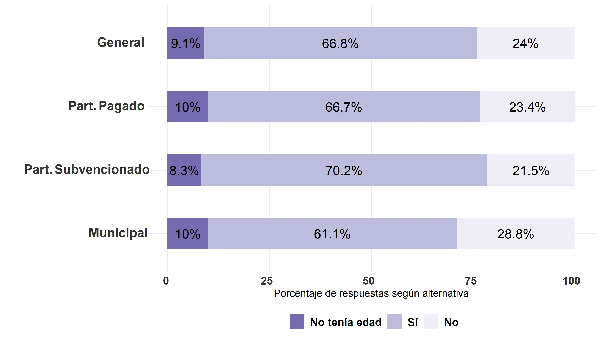

### Elecciones plebiscito constitucional 2020
```{r}
### variable voto_pleb

bbdd_general0 <- data_wide  %>% dplyr::select(voto_pleb)
bbdd_general0 <- na.omit(bbdd_general0)
bbdd_general =
  bbdd_general0 %>% group_by(voto_pleb	) %>%
             summarise(n=n(), tipe="<span style='color:#FFFFFF'>e</span>General") %>%
             mutate(prop=round(n*100/sum(n),1))

bbdd_mun0 <- data_wide  %>% dplyr::select(voto_pleb,edm_admi) %>% filter(edm_admi==1)
bbdd_mun0 <- na.omit(bbdd_mun0)
bbdd_mun =
  bbdd_mun0 %>%
              group_by(voto_pleb	) %>% #pregunta a graficar
             summarise(n=n(), tipe="<span style='color:#FFFFFF'>a</span>Municipal") %>%
             mutate(prop=round(n*100/sum(n),1))

bbdd_sub0 <- data_wide  %>% dplyr::select(voto_pleb,edm_admi) %>% filter(edm_admi==2)
bbdd_sub0 <- na.omit(bbdd_sub0)
bbdd_sub =
  bbdd_sub0 %>% group_by(voto_pleb	) %>% #pregunta a graficar
             summarise(n=n(), tipe="<span style='color:#FFFFFF'>b</span>Part. Subvencionado") %>%
             mutate(prop=round(n*100/sum(n),1))

bbdd_priv0 <- data_wide  %>% dplyr::select(voto_pleb,edm_admi) %>% filter(edm_admi==3)
bbdd_priv0 <- na.omit(bbdd_priv0)
bbdd_priv =
  bbdd_priv0 %>% group_by(voto_pleb	) %>% #pregunta a graficar
             summarise(n=n(), tipe="<span style='color:#FFFFFF'>c</span>Part. Pagado") %>%
             mutate(prop=round(n*100/sum(n),1))

bbdd_grafico = rbind(bbdd_general,bbdd_priv,bbdd_sub,bbdd_mun)
bbdd_grafico<-na.omit(bbdd_grafico)

elec_20_dep <- bbdd_grafico %>% ggplot2::ggplot(aes(x=prop,y=tipe,fill=as.character(voto_pleb	))) +  geom_bar(stat="identity",width = 0.5) +
  xlab("Porcentaje de respuestas según alternativa") +
  ylab("") +
  theme_minimal() +  # Fondo blanco con lineas
   geom_text(aes(x = prop, label = paste0(prop,"%")),
                  position = position_stack(vjust = .5),color="black", size=5) +
    theme(axis.text.x = element_markdown(colour = "grey20", size = 12, hjust = 0.7, vjust = 0.5, face = "bold"),
          axis.text.y = element_markdown(colour = "grey20", size = 14, face = "bold"), 
legend.position = "bottom", # legenda abajo
         plot.title = element_markdown(face="bold"), # titulo de grafico negrita
          #legend.text= element_markdown(size = 16), #
         legend.title = element_blank(),
         #text=element_text(size=16),
          legend.text = element_text(size=12, face = "bold")) +
  guides(fill = guide_legend(reverse=TRUE)) +
     scale_fill_brewer(palette="Purples", labels = c("No", "Sí", "No tenía edad"))

ggsave(elec_20_dep, file = "../output/graphs/elec_pleb_20_dep.jpg",device = "jpg",width = 23,height = 13,dpi = "retina",units = "cm")
```


### Elecciones organo constituyente 2021
```{r}
### variable voto_conv2
bbdd_general0 <- data_wide  %>% dplyr::select(voto_conv2)
bbdd_general0 <- na.omit(bbdd_general0)
bbdd_general =
  bbdd_general0 %>% group_by(voto_conv2) %>%
             summarise(n=n(), tipe="<span style='color:#FFFFFF'>e</span>General") %>%
             mutate(prop=round(n*100/sum(n),1))

bbdd_mun0 <- data_wide  %>% dplyr::select(voto_conv2,edm_admi) %>% filter(edm_admi==1)
bbdd_mun0 <- na.omit(bbdd_mun0)
bbdd_mun =
  bbdd_mun0 %>% 
              group_by(voto_conv2) %>% #pregunta a graficar
             summarise(n=n(), tipe="<span style='color:#FFFFFF'>a</span>Municipal") %>%
             mutate(prop=round(n*100/sum(n),1))

bbdd_sub0 <- data_wide  %>% dplyr::select(voto_conv2,edm_admi) %>% filter(edm_admi==2)
bbdd_sub0 <- na.omit(bbdd_sub0)
bbdd_sub =
  bbdd_sub0 %>% 
              group_by(voto_conv2) %>% #pregunta a graficar
             summarise(n=n(), tipe="<span style='color:#FFFFFF'>b</span>Part. Subvencionado") %>%
             mutate(prop=round(n*100/sum(n),1))

bbdd_priv0 <- data_wide  %>% dplyr::select(voto_conv2,edm_admi) %>% filter(edm_admi==3)
bbdd_priv0 <- na.omit(bbdd_priv0)
bbdd_priv =
  bbdd_priv0 %>% 
              group_by(voto_conv2) %>% #pregunta a graficar
             summarise(n=n(), tipe="<span style='color:#FFFFFF'>c</span>Part. Pagado") %>%
             mutate(prop=round(n*100/sum(n),1))

bbdd_grafico = rbind(bbdd_general,bbdd_priv,bbdd_sub,bbdd_mun)
bbdd_grafico<-na.omit(bbdd_grafico)

elec_org_const_21_dep <- bbdd_grafico %>% ggplot2::ggplot(aes(x=prop,y=tipe,fill=as.character(voto_conv2))) +  geom_bar(stat="identity",width = 0.5) +
  xlab("Porcentaje de respuestas según alternativa") +
  ylab("") +
  theme_minimal() +  # Fondo blanco con lineas
   geom_text(aes(x = prop, label = paste0(prop,"%")),
                  position = position_stack(vjust = .5),color="black", size=5) +
    theme(axis.text.x = element_markdown(colour = "grey20", size = 12, hjust = 0.7, vjust = 0.5, face = "bold"),
          axis.text.y = element_markdown(colour = "grey20", size = 14, face = "bold"), 
legend.position = "bottom", # legenda abajo
         plot.title = element_markdown(face="bold"), # titulo de grafico negrita
          #legend.text= element_markdown(size = 16), #
         legend.title = element_blank(),
         #text=element_text(size=16),
          legend.text = element_text(size=12, face = "bold")) +
  guides(fill = guide_legend(reverse=TRUE)) +
     scale_fill_brewer(palette="Purples", labels = c("No", "Sí", "No tenía edad"))

ggsave(elec_org_const_21_dep, file = "../output/graphs/elec_org_const_21_dep.jpg",device = "jpg",width = 23,height = 13,dpi = "retina",units = "cm")
```

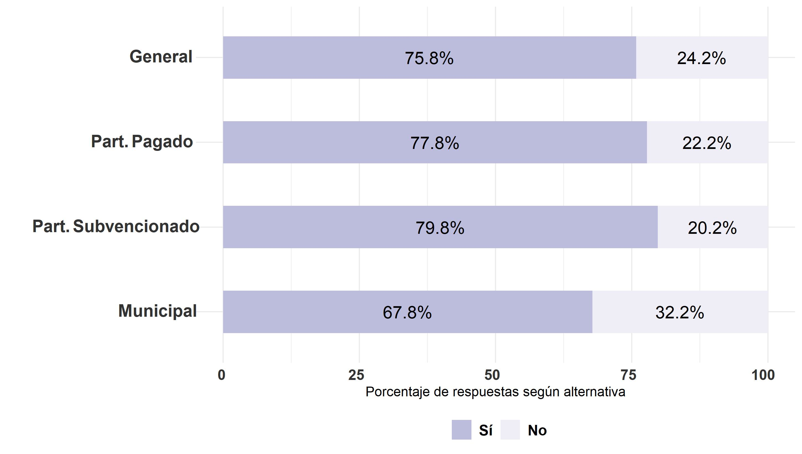

### Elecciones municipales 2021
```{r}
### variable voto_muni

bbdd_general0 <- data_wide  %>% dplyr::select(voto_muni)
bbdd_general0 <- na.omit(bbdd_general0)
bbdd_general =
  bbdd_general0 %>% group_by(voto_muni) %>%
             summarise(n=n(), tipe="<span style='color:#FFFFFF'>e</span>General") %>%
             mutate(prop=round(n*100/sum(n),1))

bbdd_mun0 <- data_wide  %>% dplyr::select(voto_muni,edm_admi) %>% filter(edm_admi==1)
bbdd_mun0 <- na.omit(bbdd_mun0)
bbdd_mun =
  bbdd_mun0 %>% 
              group_by(voto_muni) %>% #pregunta a graficar
             summarise(n=n(), tipe="<span style='color:#FFFFFF'>a</span>Municipal") %>%
             mutate(prop=round(n*100/sum(n),1))

bbdd_sub0 <- data_wide  %>% dplyr::select(voto_muni,edm_admi) %>% filter(edm_admi==2)
bbdd_sub0 <- na.omit(bbdd_sub0)
bbdd_sub =
  bbdd_sub0 %>% 
              group_by(voto_muni) %>% #pregunta a graficar
             summarise(n=n(), tipe="<span style='color:#FFFFFF'>b</span>Part. Subvencionado") %>%
             mutate(prop=round(n*100/sum(n),1))

bbdd_priv0 <- data_wide  %>% dplyr::select(voto_muni,edm_admi) %>% filter(edm_admi==3)
bbdd_priv0 <- na.omit(bbdd_priv0)
bbdd_priv =
  bbdd_priv0 %>% 
              group_by(voto_muni) %>% #pregunta a graficar
             summarise(n=n(), tipe="<span style='color:#FFFFFF'>c</span>Part. Pagado") %>%
             mutate(prop=round(n*100/sum(n),1))

bbdd_grafico = rbind(bbdd_general,bbdd_priv,bbdd_sub,bbdd_mun)
bbdd_grafico<-na.omit(bbdd_grafico)

elec_muni_21_dep <- bbdd_grafico %>% ggplot2::ggplot(aes(x=prop,y=tipe,fill=as.character(voto_muni))) +  geom_bar(stat="identity",width = 0.5) +
  xlab("Porcentaje de respuestas según alternativa") +
  ylab("") +
  theme_minimal() +  # Fondo blanco con lineas
   geom_text(aes(x = prop, label = paste0(prop,"%")),
                  position = position_stack(vjust = .5),color="black", size=5) +
    theme(axis.text.x = element_markdown(colour = "grey20", size = 12, hjust = 0.7, vjust = 0.5, face = "bold"),
          axis.text.y = element_markdown(colour = "grey20", size = 14, face = "bold"), 
legend.position = "bottom", # legenda abajo
         plot.title = element_markdown(face="bold"), # titulo de grafico negrita
          #legend.text= element_markdown(size = 16), #
         legend.title = element_blank(),
         #text=element_text(size=16),
          legend.text = element_text(size=12, face = "bold")) +
  guides(fill = guide_legend(reverse=TRUE)) +
     scale_fill_brewer(palette="Purples", labels = c("No", "Sí"))

ggsave(elec_muni_21_dep, file = "../output/graphs/elec_muni_21_dep.jpg",device = "jpg",width = 23,height = 13,dpi = "retina",units = "cm")
```


### Elecciones primera vuelta 2021
```{r}
### variable voto_privuelta

bbdd_general0 <- data_wide  %>% dplyr::select(voto_privuelta)
bbdd_general0 <- na.omit(bbdd_general0)
bbdd_general =
  bbdd_general0 %>% group_by(voto_privuelta) %>%
             summarise(n=n(), tipe="<span style='color:#FFFFFF'>e</span>General") %>%
             mutate(prop=round(n*100/sum(n),1))

bbdd_mun0 <- data_wide  %>% dplyr::select(voto_privuelta,edm_admi) %>% filter(edm_admi==1)
bbdd_mun0 <- na.omit(bbdd_mun0)
bbdd_mun =
  bbdd_mun0 %>%
              group_by(voto_privuelta) %>% #pregunta a graficar
             summarise(n=n(), tipe="<span style='color:#FFFFFF'>a</span>Municipal") %>%
             mutate(prop=round(n*100/sum(n),1))

bbdd_sub0 <- data_wide  %>% dplyr::select(voto_privuelta,edm_admi) %>% filter(edm_admi==2)
bbdd_sub0 <- na.omit(bbdd_sub0)
bbdd_sub =
  bbdd_sub0 %>%
              group_by(voto_privuelta) %>% #pregunta a graficar
             summarise(n=n(), tipe="<span style='color:#FFFFFF'>b</span>Part. Subvencionado") %>%
             mutate(prop=round(n*100/sum(n),1))

bbdd_priv0 <- data_wide  %>% dplyr::select(voto_privuelta,edm_admi) %>% filter(edm_admi==3)
bbdd_priv0 <- na.omit(bbdd_priv0)
bbdd_priv =
  bbdd_priv0 %>%
              group_by(voto_privuelta) %>% #pregunta a graficar
             summarise(n=n(), tipe="<span style='color:#FFFFFF'>c</span>Part. Pagado") %>%
             mutate(prop=round(n*100/sum(n),1))

bbdd_grafico = rbind(bbdd_general,bbdd_priv,bbdd_sub,bbdd_mun)
bbdd_grafico<-na.omit(bbdd_grafico)

elec_privuelta_21_dep <- bbdd_grafico %>% ggplot2::ggplot(aes(x=prop,y=tipe,fill=as.character(voto_privuelta))) +  geom_bar(stat="identity",width = 0.5) +
  xlab("Porcentaje de respuestas según alternativa") +
  ylab("") +
  theme_minimal() +  # Fondo blanco con lineas
   geom_text(aes(x = prop, label = paste0(prop,"%")),
                  position = position_stack(vjust = .5),color="black", size=5) +
    theme(axis.text.x = element_markdown(colour = "grey20", size = 12, hjust = 0.7, vjust = 0.5, face = "bold"),
          axis.text.y = element_markdown(colour = "grey20", size = 14, face = "bold"), 
legend.position = "bottom", # legenda abajo
         plot.title = element_markdown(face="bold"), # titulo de grafico negrita
          #legend.text= element_markdown(size = 16), #
         legend.title = element_blank(),
         #text=element_text(size=16),
          legend.text = element_text(size=12, face = "bold")) +
  guides(fill = guide_legend(reverse=TRUE)) +
     scale_fill_brewer(palette="Purples", labels = c("No", "Sí"))

ggsave(elec_privuelta_21_dep, file = "../output/graphs/elec_privuelta_21_dep.jpg",device = "jpg",width = 23,height = 13,dpi = "retina",units = "cm")
```

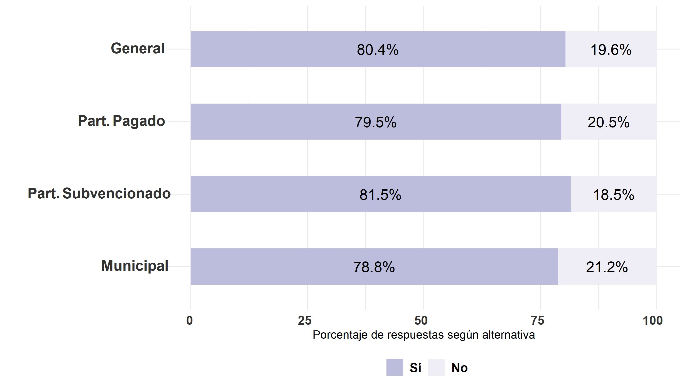

### Elecciones segunda vuelta 2021
```{r}
### variable voto_segvuelta

bbdd_general0 <- data_wide  %>% dplyr::select(voto_segvuelta)
bbdd_general0 <- na.omit(bbdd_general0)
bbdd_general =
  bbdd_general0 %>% group_by(voto_segvuelta) %>%
             summarise(n=n(), tipe="<span style='color:#FFFFFF'>e</span>General") %>%
             mutate(prop=round(n*100/sum(n),1))

bbdd_mun0 <- data_wide  %>% dplyr::select(voto_segvuelta,edm_admi) %>% filter(edm_admi==1)
bbdd_mun0 <- na.omit(bbdd_mun0)
bbdd_mun =
  bbdd_mun0 %>% 
              group_by(voto_segvuelta) %>% #pregunta a graficar
             summarise(n=n(), tipe="<span style='color:#FFFFFF'>a</span>Municipal") %>%
             mutate(prop=round(n*100/sum(n),1))

bbdd_sub0 <- data_wide  %>% dplyr::select(voto_segvuelta,edm_admi) %>% filter(edm_admi==2)
bbdd_sub0 <- na.omit(bbdd_sub0)
bbdd_sub =
  bbdd_sub0 %>% 
              group_by(voto_segvuelta) %>% #pregunta a graficar
             summarise(n=n(), tipe="<span style='color:#FFFFFF'>b</span>Part. Subvencionado") %>%
             mutate(prop=round(n*100/sum(n),1))

bbdd_priv0 <- data_wide  %>% dplyr::select(voto_segvuelta,edm_admi) %>% filter(edm_admi==3)
bbdd_priv0 <- na.omit(bbdd_priv0)
bbdd_priv =
  bbdd_priv0 %>% 
              group_by(voto_segvuelta) %>% #pregunta a graficar
             summarise(n=n(), tipe="<span style='color:#FFFFFF'>c</span>Part. Pagado") %>%
             mutate(prop=round(n*100/sum(n),1))

bbdd_grafico = rbind(bbdd_general,bbdd_priv,bbdd_sub,bbdd_mun)
bbdd_grafico<-na.omit(bbdd_grafico)

elec_segvuelta_21_dep <- bbdd_grafico %>% ggplot2::ggplot(aes(x=prop,y=tipe,fill=as.character(voto_segvuelta))) +  geom_bar(stat="identity",width = 0.5) +
  xlab("Porcentaje de respuestas según alternativa") +
  ylab("") +
  theme_minimal() +  # Fondo blanco con lineas
   geom_text(aes(x = prop, label = paste0(prop,"%")),
                  position = position_stack(vjust = .5),color="black", size=5) +
    theme(axis.text.x = element_markdown(colour = "grey20", size = 12, hjust = 0.7, vjust = 0.5, face = "bold"),
          axis.text.y = element_markdown(colour = "grey20", size = 14, face = "bold"), 
legend.position = "bottom", # legenda abajo
         plot.title = element_markdown(face="bold"), # titulo de grafico negrita
          #legend.text= element_markdown(size = 16), #
         legend.title = element_blank(),
         #text=element_text(size=16),
          legend.text = element_text(size=12, face = "bold")) +
  guides(fill = guide_legend(reverse=TRUE)) +
     scale_fill_brewer(palette="Purples", labels = c("No", "Sí"))

ggsave(elec_segvuelta_21_dep, file = "../output/graphs/elec_segvuelta_21_dep.jpg",device = "jpg",width = 23,height = 13,dpi = "retina",units = "cm")
```

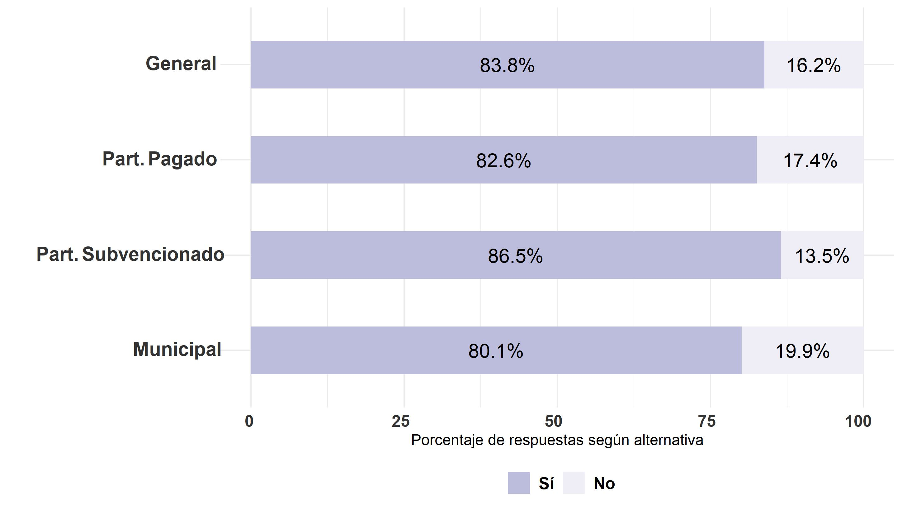

## Máximo nivel educativo de la madre

En esta sección se presentan los resultados descriptivos de la relación entre el máximo nivel educativo de la madre y la participación en distintas votaciones.

En términos generales, es posible visualizar que entre las personas que tienen madres con un nivel educativo de enseñanza básica o menos tiende a haber una mayor proporción de personas que declara no votar en las distintas elecciones sobre las que se consultó (este patrón no se presenta tan claramente en lo que refiere a la segunda vuelta de la elección presidencial). Asimismo, se muestra que quienes son hijos de mujeres con educación terciaria tienen una mayor proporción de personas que declara sí haber votado en las diferentes elecciones (este patrón se presenta en todas las elecciones excepto en la elección del plebiscito constitucional).

### Elecciones presidenciales 2017
```{r}
### variable voto_pres_17
bbdd_general0 <- data_wide  %>% dplyr::select(voto_pres_17)
bbdd_general0 <- na.omit(bbdd_general0)

bbdd_general =
  bbdd_general0 %>% group_by(voto_pres_17) %>%
             summarise(n=n(), tipe="<span style='color:#FFFFFF'>e</span>General") %>%
             mutate(prop=round(n*100/sum(n),1))

bbdd_ed_bas0 <- data_wide  %>% dplyr::select(voto_pres_17,nse_madre) %>% filter(nse_madre==1 | nse_madre==2 | nse_madre==3) 
bbdd_ed_bas0 <- na.omit(bbdd_ed_bas0)
bbdd_ed_bas =
  bbdd_ed_bas0 %>% group_by(voto_pres_17) %>% #pregunta a graficar
             summarise(n=n(), tipe="<span style='color:#FFFFFF'>a</span>Ed. básica <br>o menos") %>%
             mutate(prop=round(n*100/sum(n),1))

bbdd_ed_med0 <- data_wide  %>% dplyr::select(voto_pres_17,nse_madre) %>% filter(nse_madre==4 | nse_madre==5) 
bbdd_ed_med0 <- na.omit(bbdd_ed_med0)
bbdd_ed_med =
  bbdd_ed_med0 %>% group_by(voto_pres_17) %>% #pregunta a graficar
             summarise(n=n(), tipe="<span style='color:#FFFFFF'>b</span>Ed. media") %>%
             mutate(prop=round(n*100/sum(n),1))

bbdd_ed_ter0 <- data_wide  %>% dplyr::select(voto_pres_17,nse_madre) %>% filter(nse_madre==6 | nse_madre==7 | nse_madre==8 | nse_madre==9 | nse_madre==10) 
bbdd_ed_ter0 <- na.omit(bbdd_ed_ter0)
bbdd_ed_ter =
  bbdd_ed_ter0 %>% group_by(voto_pres_17) %>% #pregunta a graficar
             summarise(n=n(), tipe="<span style='color:#FFFFFF'>c</span>Ed. terciaria") %>%
             mutate(prop=round(n*100/sum(n),1))

bbdd_grafico = rbind(bbdd_general,bbdd_ed_ter,bbdd_ed_med,bbdd_ed_bas)
bbdd_grafico<-na.omit(bbdd_grafico)
elec_17_edmad <- bbdd_grafico %>% ggplot2::ggplot(aes(x=prop,y=tipe,fill=as.character(voto_pres_17))) +  geom_bar(stat="identity",width = 0.5) +
  xlab("Porcentaje de respuestas según alternativa") +
  ylab("") +
  theme_minimal() +  # Fondo blanco con lineas
   geom_text(aes(x = prop, label = paste0(prop,"%")),
                  position = position_stack(vjust = .5),color="black", size=5) +
    theme(axis.text.x = element_markdown(colour = "grey20", size = 12, hjust = 0.7, vjust = 0.5, face = "bold"),
          axis.text.y = element_markdown(colour = "grey20", size = 14, face = "bold"), 
legend.position = "bottom", # legenda abajo
         plot.title = element_markdown(face="bold"), # titulo de grafico negrita
          #legend.text= element_markdown(size = 16), #
         legend.title = element_blank(),
         #text=element_text(size=16),
          legend.text = element_text(size=12, face = "bold")) +
  guides(fill = guide_legend(reverse=TRUE)) +
     scale_fill_brewer(palette="Purples", labels = c("No", "Sí", "No tenía edad"))

ggsave(elec_17_edmad, file = "../output/graphs/elec_17_edmad.jpg",device = "jpg",width = 23,height = 13,dpi = "retina",units = "cm")
```


### Elecciones plebiscito constitucional 2020
```{r}
### variable voto_pleb	

bbdd_general0 <- data_wide  %>% dplyr::select(voto_pleb)
bbdd_general0 <- na.omit(bbdd_general0)
bbdd_general =
  bbdd_general0 %>% group_by(voto_pleb	) %>%
             summarise(n=n(), tipe="<span style='color:#FFFFFF'>e</span>General") %>%
             mutate(prop=round(n*100/sum(n),1))

bbdd_ed_bas0 <- data_wide  %>% dplyr::select(voto_pleb,nse_madre) %>% filter(nse_madre==1 | nse_madre==2 | nse_madre==3)
bbdd_ed_bas0 <- na.omit(bbdd_ed_bas0)
bbdd_ed_bas =
  bbdd_ed_bas0 %>%
              group_by(voto_pleb	) %>% #pregunta a graficar
             summarise(n=n(), tipe="<span style='color:#FFFFFF'>a</span>Ed. básica <br>o menos") %>%
             mutate(prop=round(n*100/sum(n),1))

bbdd_ed_med0 <- data_wide  %>% dplyr::select(voto_pleb,nse_madre) %>% filter(nse_madre==4 | nse_madre==5)
bbdd_ed_med0 <- na.omit(bbdd_ed_med0)
bbdd_ed_med =
  bbdd_ed_med0 %>% group_by(voto_pleb	) %>% #pregunta a graficar
             summarise(n=n(), tipe="<span style='color:#FFFFFF'>b</span>Ed. media") %>%
             mutate(prop=round(n*100/sum(n),1))

bbdd_ed_ter0 <- data_wide  %>% dplyr::select(voto_pleb,nse_madre) %>% filter(nse_madre==6 | nse_madre==7 | nse_madre==8 | nse_madre==9 | nse_madre==10)
bbdd_ed_ter0 <- na.omit(bbdd_ed_ter0)
bbdd_ed_ter =
  bbdd_ed_ter0 %>%
              group_by(voto_pleb	) %>% #pregunta a graficar
             summarise(n=n(), tipe="<span style='color:#FFFFFF'>c</span>Ed. terciaria") %>%
             mutate(prop=round(n*100/sum(n),1))

bbdd_grafico = rbind(bbdd_general,bbdd_ed_ter,bbdd_ed_med,bbdd_ed_bas)
bbdd_grafico<-na.omit(bbdd_grafico)
elec_20_edmad <- bbdd_grafico %>% ggplot2::ggplot(aes(x=prop,y=tipe,fill=as.character(voto_pleb	))) +  geom_bar(stat="identity",width = 0.5) +
  xlab("Porcentaje de respuestas según alternativa") +
  ylab("") +
  theme_minimal() +  # Fondo blanco con lineas
   geom_text(aes(x = prop, label = paste0(prop,"%")),
                  position = position_stack(vjust = .5),color="black", size=5) +
    theme(axis.text.x = element_markdown(colour = "grey20", size = 12, hjust = 0.7, vjust = 0.5, face = "bold"),
          axis.text.y = element_markdown(colour = "grey20", size = 14, face = "bold"), 
legend.position = "bottom", # legenda abajo
         plot.title = element_markdown(face="bold"), # titulo de grafico negrita
          #legend.text= element_markdown(size = 16), #
         legend.title = element_blank(),
         #text=element_text(size=16),
          legend.text = element_text(size=12, face = "bold")) +
  guides(fill = guide_legend(reverse=TRUE)) +
     scale_fill_brewer(palette="Purples", labels = c("No", "Sí", "No tenía edad"))

ggsave(elec_20_edmad, file = "../output/graphs/elec_pleb_20_edmad.jpg",device = "jpg",width = 23,height = 13,dpi = "retina",units = "cm")
```


### Elecciones organo constituyente 2021

```{r}
### variable voto_conv2

bbdd_general0 <- data_wide  %>% dplyr::select(voto_conv2)
bbdd_general0 <- na.omit(bbdd_general0)
bbdd_general =
  bbdd_general0 %>% group_by(voto_conv2) %>%
             summarise(n=n(), tipe="<span style='color:#FFFFFF'>e</span>General") %>%
             mutate(prop=round(n*100/sum(n),1))

bbdd_ed_bas0 <- data_wide  %>% dplyr::select(voto_conv2,nse_madre) %>% filter(nse_madre==1 | nse_madre==2 | nse_madre==3)
bbdd_ed_bas0 <- na.omit(bbdd_ed_bas0)
bbdd_ed_bas =
  bbdd_ed_bas0 %>%
              group_by(voto_conv2) %>% #pregunta a graficar
             summarise(n=n(), tipe="<span style='color:#FFFFFF'>a</span>Ed. básica <br>o menos") %>%
             mutate(prop=round(n*100/sum(n),1))

bbdd_ed_med0 <- data_wide  %>% dplyr::select(voto_conv2,nse_madre) %>% filter(nse_madre==4 | nse_madre==5)
bbdd_ed_med0 <- na.omit(bbdd_ed_med0)
bbdd_ed_med =
  bbdd_ed_med0 %>%
              group_by(voto_conv2) %>% #pregunta a graficar
             summarise(n=n(), tipe="<span style='color:#FFFFFF'>b</span>Ed. media") %>%
             mutate(prop=round(n*100/sum(n),1))

bbdd_ed_ter0 <- data_wide  %>% dplyr::select(voto_conv2,nse_madre) %>% filter(nse_madre==6 | nse_madre==7 | nse_madre==8 | nse_madre==9 | nse_madre==10)
bbdd_ed_ter0 <- na.omit(bbdd_ed_ter0)
bbdd_ed_ter =
  bbdd_ed_ter0 %>% 
              group_by(voto_conv2) %>% #pregunta a graficar
             summarise(n=n(), tipe="<span style='color:#FFFFFF'>c</span>Ed. terciaria") %>%
             mutate(prop=round(n*100/sum(n),1))

bbdd_grafico = rbind(bbdd_general,bbdd_ed_ter,bbdd_ed_med,bbdd_ed_bas)
bbdd_grafico<-na.omit(bbdd_grafico)
elec_org_const_21_edmad <- bbdd_grafico %>% ggplot2::ggplot(aes(x=prop,y=tipe,fill=as.character(voto_conv2))) +  geom_bar(stat="identity",width = 0.5) +
  xlab("Porcentaje de respuestas según alternativa") +
  ylab("") +
  theme_minimal() +  # Fondo blanco con lineas
   geom_text(aes(x = prop, label = paste0(prop,"%")),
                  position = position_stack(vjust = .5),color="black", size=5) +
    theme(axis.text.x = element_markdown(colour = "grey20", size = 12, hjust = 0.7, vjust = 0.5, face = "bold"),
          axis.text.y = element_markdown(colour = "grey20", size = 14, face = "bold"), 
legend.position = "bottom", # legenda abajo
         plot.title = element_markdown(face="bold"), # titulo de grafico negrita
          #legend.text= element_markdown(size = 16), #
         legend.title = element_blank(),
         #text=element_text(size=16),
          legend.text = element_text(size=12, face = "bold")) +
  guides(fill = guide_legend(reverse=TRUE)) +
     scale_fill_brewer(palette="Purples", labels = c("No", "Sí"))

ggsave(elec_org_const_21_edmad, file = "../output/graphs/elec_org_const_21_edmad.jpg",device = "jpg",width = 23,height = 13,dpi = "retina",units = "cm")
```


### Elecciones municipales 2021
```{r}
### variable voto_muni

bbdd_general0 <- data_wide  %>% dplyr::select(voto_muni)
bbdd_general0 <- na.omit(bbdd_general0)
bbdd_general =
  bbdd_general0 %>% group_by(voto_muni) %>%
             summarise(n=n(), tipe="<span style='color:#FFFFFF'>e</span>General") %>%
             mutate(prop=round(n*100/sum(n),1))

bbdd_ed_bas0 <- data_wide  %>% dplyr::select(voto_muni,nse_madre) %>% filter(nse_madre==1 | nse_madre==2 | nse_madre==3)
bbdd_ed_bas0 <- na.omit(bbdd_ed_bas0)
bbdd_ed_bas =
  bbdd_ed_bas0 %>%
              group_by(voto_muni) %>% #pregunta a graficar
             summarise(n=n(), tipe="<span style='color:#FFFFFF'>a</span>Ed. básica <br>o menos") %>%
             mutate(prop=round(n*100/sum(n),1))

bbdd_ed_med0 <- data_wide  %>% dplyr::select(voto_muni,nse_madre) %>% filter(nse_madre==4 | nse_madre==5)
bbdd_ed_med0 <- na.omit(bbdd_ed_med0)
bbdd_ed_med =
  bbdd_ed_med0 %>%
              group_by(voto_muni) %>% #pregunta a graficar
             summarise(n=n(), tipe="<span style='color:#FFFFFF'>b</span>Ed. media") %>%
             mutate(prop=round(n*100/sum(n),1))

bbdd_ed_ter0 <- data_wide  %>% dplyr::select(voto_muni,nse_madre) %>% filter(nse_madre==6 | nse_madre==7 | nse_madre==8 | nse_madre==9 | nse_madre==10)
bbdd_ed_ter0 <- na.omit(bbdd_ed_ter0)
bbdd_ed_ter =
  bbdd_ed_ter0 %>% 
              group_by(voto_muni) %>% #pregunta a graficar
             summarise(n=n(), tipe="<span style='color:#FFFFFF'>c</span>Ed. terciaria") %>%
             mutate(prop=round(n*100/sum(n),1))

bbdd_grafico = rbind(bbdd_general,bbdd_ed_ter,bbdd_ed_med,bbdd_ed_bas)
bbdd_grafico<-na.omit(bbdd_grafico)
elec_muni_21_edmad <- bbdd_grafico %>% ggplot2::ggplot(aes(x=prop,y=tipe,fill=as.character(voto_muni))) +  geom_bar(stat="identity",width = 0.5) +
  xlab("Porcentaje de respuestas según alternativa") +
  ylab("") +
  theme_minimal() +  # Fondo blanco con lineas
   geom_text(aes(x = prop, label = paste0(prop,"%")),
                  position = position_stack(vjust = .5),color="black", size=5) +
    theme(axis.text.x = element_markdown(colour = "grey20", size = 12, hjust = 0.7, vjust = 0.5, face = "bold"),
          axis.text.y = element_markdown(colour = "grey20", size = 14, face = "bold"), 
legend.position = "bottom", # legenda abajo
         plot.title = element_markdown(face="bold"), # titulo de grafico negrita
          #legend.text= element_markdown(size = 16), #
         legend.title = element_blank(),
         #text=element_text(size=16),
          legend.text = element_text(size=12, face = "bold")) +
  guides(fill = guide_legend(reverse=TRUE)) +
     scale_fill_brewer(palette="Purples", labels = c("No", "Sí"))

ggsave(elec_muni_21_edmad, file = "../output/graphs/elec_muni_21_edmad.jpg",device = "jpg",width = 23,height = 13,dpi = "retina",units = "cm")
```


### Elecciones primera vuelta 2021
```{r}
### variable voto_privuelta

bbdd_general0 <- data_wide  %>% dplyr::select(voto_privuelta)
bbdd_general0 <- na.omit(bbdd_general0)
bbdd_general =
  bbdd_general0 %>% group_by(voto_privuelta) %>%
             summarise(n=n(), tipe="<span style='color:#FFFFFF'>e</span>General") %>%
             mutate(prop=round(n*100/sum(n),1))

bbdd_ed_bas0 <- data_wide  %>% dplyr::select(voto_privuelta,nse_madre) %>% filter(nse_madre==1 | nse_madre==2 | nse_madre==3)
bbdd_ed_bas0 <- na.omit(bbdd_ed_bas0)
bbdd_ed_bas =
  bbdd_ed_bas0 %>%
              group_by(voto_privuelta) %>% #pregunta a graficar
             summarise(n=n(), tipe="<span style='color:#FFFFFF'>a</span>Ed. básica <br>o menos") %>%
             mutate(prop=round(n*100/sum(n),1))

bbdd_ed_med0 <- data_wide  %>% dplyr::select(voto_privuelta,nse_madre) %>% filter(nse_madre==4 | nse_madre==5)
bbdd_ed_med0 <- na.omit(bbdd_ed_med0)
bbdd_ed_med =
  bbdd_ed_med0 %>%
              group_by(voto_privuelta) %>% #pregunta a graficar
             summarise(n=n(), tipe="<span style='color:#FFFFFF'>b</span>Ed. media") %>%
             mutate(prop=round(n*100/sum(n),1))

bbdd_ed_ter0 <- data_wide  %>% dplyr::select(voto_privuelta,nse_madre) %>% filter(nse_madre==6 | nse_madre==7 | nse_madre==8 | nse_madre==9 | nse_madre==10)
bbdd_ed_ter0 <- na.omit(bbdd_ed_ter0)
bbdd_ed_ter =
  bbdd_ed_ter0 %>% 
              group_by(voto_privuelta) %>% #pregunta a graficar
             summarise(n=n(), tipe="<span style='color:#FFFFFF'>c</span>Ed. terciaria") %>%
             mutate(prop=round(n*100/sum(n),1))

bbdd_grafico = rbind(bbdd_general,bbdd_ed_ter,bbdd_ed_med,bbdd_ed_bas)
bbdd_grafico<-na.omit(bbdd_grafico)
elec_privuelta_21_edmad <- bbdd_grafico %>% ggplot2::ggplot(aes(x=prop,y=tipe,fill=as.character(voto_privuelta))) +  geom_bar(stat="identity",width = 0.5) +
  xlab("Porcentaje de respuestas según alternativa") +
  ylab("") +
  theme_minimal() +  # Fondo blanco con lineas
   geom_text(aes(x = prop, label = paste0(prop,"%")),
                  position = position_stack(vjust = .5),color="black", size=5) +
    theme(axis.text.x = element_markdown(colour = "grey20", size = 12, hjust = 0.7, vjust = 0.5, face = "bold"),
          axis.text.y = element_markdown(colour = "grey20", size = 14, face = "bold"), 
legend.position = "bottom", # legenda abajo
         plot.title = element_markdown(face="bold"), # titulo de grafico negrita
          #legend.text= element_markdown(size = 16), #
         legend.title = element_blank(),
         #text=element_text(size=16),
          legend.text = element_text(size=12, face = "bold")) +
  guides(fill = guide_legend(reverse=TRUE)) +
     scale_fill_brewer(palette="Purples", labels = c("No", "Sí"))

ggsave(elec_privuelta_21_edmad, file = "../output/graphs/elec_privuelta_21_edmad.jpg",device = "jpg",width = 23,height = 13,dpi = "retina",units = "cm")
```


### Elecciones segunda vuelta 2021
```{r}
### variable voto_segvuelta

bbdd_general0 <- data_wide  %>% dplyr::select(voto_segvuelta)
bbdd_general0 <- na.omit(bbdd_general0)
bbdd_general =
  bbdd_general0 %>% group_by(voto_segvuelta) %>%
             summarise(n=n(), tipe="<span style='color:#FFFFFF'>e</span>General") %>%
             mutate(prop=round(n*100/sum(n),1))

bbdd_ed_bas0 <- data_wide  %>% dplyr::select(voto_segvuelta,nse_madre) %>% filter(nse_madre==1 | nse_madre==2 | nse_madre==3)
bbdd_ed_bas0 <- na.omit(bbdd_ed_bas0)
bbdd_ed_bas =
  bbdd_ed_bas0 %>%
              group_by(voto_segvuelta) %>% #pregunta a graficar
             summarise(n=n(), tipe="<span style='color:#FFFFFF'>a</span>Ed. básica <br>o menos") %>%
             mutate(prop=round(n*100/sum(n),1))

bbdd_ed_med0 <- data_wide  %>% dplyr::select(voto_segvuelta,nse_madre) %>% filter(nse_madre==4 | nse_madre==5)
bbdd_ed_med0 <- na.omit(bbdd_ed_med0)
bbdd_ed_med =
  bbdd_ed_med0 %>%
              group_by(voto_segvuelta) %>% #pregunta a graficar
             summarise(n=n(), tipe="<span style='color:#FFFFFF'>b</span>Ed. media") %>%
             mutate(prop=round(n*100/sum(n),1))

bbdd_ed_ter0 <- data_wide  %>% dplyr::select(voto_segvuelta,nse_madre) %>% filter(nse_madre==6 | nse_madre==7 | nse_madre==8 | nse_madre==9 | nse_madre==10)
bbdd_ed_ter0 <- na.omit(bbdd_ed_ter0)
bbdd_ed_ter =
  bbdd_ed_ter0 %>% 
              group_by(voto_segvuelta) %>% #pregunta a graficar
             summarise(n=n(), tipe="<span style='color:#FFFFFF'>c</span>Ed. terciaria") %>%
             mutate(prop=round(n*100/sum(n),1))

bbdd_grafico = rbind(bbdd_general,bbdd_ed_ter,bbdd_ed_med,bbdd_ed_bas)
bbdd_grafico<-na.omit(bbdd_grafico)
elec_segvuelta_21_edmad <- bbdd_grafico %>% ggplot2::ggplot(aes(x=prop,y=tipe,fill=as.character(voto_segvuelta))) +  geom_bar(stat="identity",width = 0.5) +
  xlab("Porcentaje de respuestas según alternativa") +
  ylab("") +
  theme_minimal() +  # Fondo blanco con lineas
   geom_text(aes(x = prop, label = paste0(prop,"%")),
                  position = position_stack(vjust = .5),color="black", size=5) +
    theme(axis.text.x = element_markdown(colour = "grey20", size = 12, hjust = 0.7, vjust = 0.5, face = "bold"),
          axis.text.y = element_markdown(colour = "grey20", size = 14, face = "bold"), 
legend.position = "bottom", # legenda abajo
         plot.title = element_markdown(face="bold"), # titulo de grafico negrita
          #legend.text= element_markdown(size = 16), #
         legend.title = element_blank(),
         #text=element_text(size=16),
          legend.text = element_text(size=12, face = "bold")) +
  guides(fill = guide_legend(reverse=TRUE)) +
     scale_fill_brewer(palette="Purples", labels = c("No", "Sí"))

ggsave(elec_segvuelta_21_edmad, file = "../output/graphs/elec_segvuelta_21_edmad.jpg",device = "jpg",width = 23,height = 13,dpi = "retina",units = "cm")
```

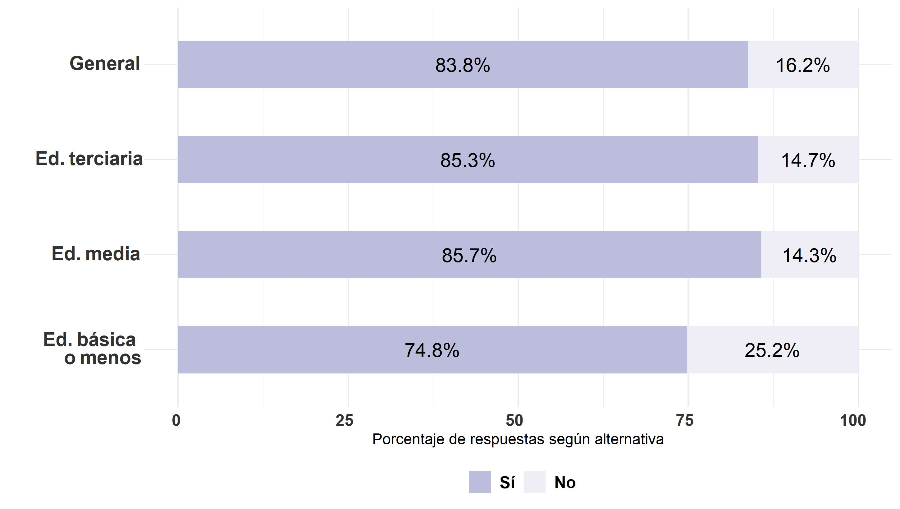

## Máximo nivel educativo del padre

En esta sección se presentan los resultados descriptivos de la relación entre el máximo nivel educativo del padre y la participación en distintas votaciones.

En términos generales, es posible visualizar que no hay un patrón claro de la relación entre ambas variables. En otras palabras, los resultados expuestos en los gráficos no evidencian una relación consistente entre el nivel educativo del padre y la participación en elecciones. Sin embargo, se muestra una relación directa entre el nivel educativo del padre y haber votado en dos de las seis las elecciones sobre las que se consultó (elecciones presidenciales de 2017 y el plebiscito constitucional de 2020).

### Elecciones presidenciales 2017
```{r}
### variable voto_pres_17

bbdd_general0 <- data_wide  %>% dplyr::select(voto_pres_17)
bbdd_general0 <- na.omit(bbdd_general0)

bbdd_general =
  bbdd_general0 %>% group_by(voto_pres_17) %>%
             summarise(n=n(), tipe="<span style='color:#FFFFFF'>e</span>General") %>%
             mutate(prop=round(n*100/sum(n),1))

bbdd_ed_bas0 <- data_wide  %>% dplyr::select(voto_pres_17,nse_padre) %>% filter(nse_padre==1 | nse_padre==2 | nse_padre==3) 
bbdd_ed_bas0 <- na.omit(bbdd_ed_bas0)
bbdd_ed_bas =
  bbdd_ed_bas0 %>% group_by(voto_pres_17) %>% #pregunta a graficar
             summarise(n=n(), tipe="<span style='color:#FFFFFF'>a</span>Ed. básica <br>o menos") %>%
             mutate(prop=round(n*100/sum(n),1))

bbdd_ed_med0 <- data_wide  %>% dplyr::select(voto_pres_17,nse_padre) %>% filter(nse_padre==4 | nse_padre==5) 
bbdd_ed_med0 <- na.omit(bbdd_ed_med0)
bbdd_ed_med =
  bbdd_ed_med0 %>% group_by(voto_pres_17) %>% #pregunta a graficar
             summarise(n=n(), tipe="<span style='color:#FFFFFF'>b</span>Ed. media") %>%
             mutate(prop=round(n*100/sum(n),1))

bbdd_ed_ter0 <- data_wide  %>% dplyr::select(voto_pres_17,nse_padre) %>% filter(nse_padre==6 | nse_padre==7 | nse_padre==8 | nse_padre==9 | nse_padre==10) 
bbdd_ed_ter0 <- na.omit(bbdd_ed_ter0)
bbdd_ed_ter =
  bbdd_ed_ter0 %>% group_by(voto_pres_17) %>% #pregunta a graficar
             summarise(n=n(), tipe="<span style='color:#FFFFFF'>c</span>Ed. terciaria") %>%
             mutate(prop=round(n*100/sum(n),1))

bbdd_grafico = rbind(bbdd_general,bbdd_ed_ter,bbdd_ed_med,bbdd_ed_bas)
bbdd_grafico<-na.omit(bbdd_grafico)
elec_17_edpad <- bbdd_grafico %>% ggplot2::ggplot(aes(x=prop,y=tipe,fill=as.character(voto_pres_17))) +  geom_bar(stat="identity",width = 0.5) +
  xlab("Porcentaje de respuestas según alternativa") +
  ylab("") +
  theme_minimal() +  # Fondo blanco con lineas
   geom_text(aes(x = prop, label = paste0(prop,"%")),
                  position = position_stack(vjust = .5),color="black", size=5) +
    theme(axis.text.x = element_markdown(colour = "grey20", size = 12, hjust = 0.7, vjust = 0.5, face = "bold"),
          axis.text.y = element_markdown(colour = "grey20", size = 14, face = "bold"), 
legend.position = "bottom", # legenda abajo
         plot.title = element_markdown(face="bold"), # titulo de grafico negrita
          #legend.text= element_markdown(size = 16), #
         legend.title = element_blank(),
         #text=element_text(size=16),
          legend.text = element_text(size=12, face = "bold")) +
  guides(fill = guide_legend(reverse=TRUE)) +
     scale_fill_brewer(palette="Purples", labels = c("No", "Sí", "No tenía edad"))

ggsave(elec_17_edpad, file = "../output/graphs/elec_17_edpad.jpg",device = "jpg",width = 23,height = 13,dpi = "retina",units = "cm")
```


### Elecciones plebiscito constitucional 2020

```{r}
### variable voto_pleb	


bbdd_general0 <- data_wide  %>% dplyr::select(voto_pleb)
bbdd_general0 <- na.omit(bbdd_general0)
bbdd_general =
  bbdd_general0 %>% group_by(voto_pleb	) %>%
             summarise(n=n(), tipe="<span style='color:#FFFFFF'>e</span>General") %>%
             mutate(prop=round(n*100/sum(n),1))

bbdd_ed_bas0 <- data_wide  %>% dplyr::select(voto_pleb,nse_padre) %>% filter(nse_padre==1 | nse_padre==2 | nse_padre==3)
bbdd_ed_bas0 <- na.omit(bbdd_ed_bas0)
bbdd_ed_bas =
  bbdd_ed_bas0 %>%
              group_by(voto_pleb	) %>% #pregunta a graficar
             summarise(n=n(), tipe="<span style='color:#FFFFFF'>a</span>Ed. básica <br>o menos") %>%
             mutate(prop=round(n*100/sum(n),1))

bbdd_ed_med0 <- data_wide  %>% dplyr::select(voto_pleb,nse_padre) %>% filter(nse_padre==4 | nse_padre==5)
bbdd_ed_med0 <- na.omit(bbdd_ed_med0)
bbdd_ed_med =
  bbdd_ed_med0 %>% group_by(voto_pleb	) %>% #pregunta a graficar
             summarise(n=n(), tipe="<span style='color:#FFFFFF'>b</span>Ed. media") %>%
             mutate(prop=round(n*100/sum(n),1))

bbdd_ed_ter0 <- data_wide  %>% dplyr::select(voto_pleb,nse_padre) %>% filter(nse_padre==6 | nse_padre==7 | nse_padre==8 | nse_padre==9 | nse_padre==10)
bbdd_ed_ter0 <- na.omit(bbdd_ed_ter0)
bbdd_ed_ter =
  bbdd_ed_ter0 %>%
              group_by(voto_pleb	) %>% #pregunta a graficar
             summarise(n=n(), tipe="<span style='color:#FFFFFF'>c</span>Ed. terciaria") %>%
             mutate(prop=round(n*100/sum(n),1))
bbdd_grafico = rbind(bbdd_general,bbdd_ed_ter,bbdd_ed_med,bbdd_ed_bas)
bbdd_grafico<-na.omit(bbdd_grafico)
elec_20_edpad <- bbdd_grafico %>% ggplot2::ggplot(aes(x=prop,y=tipe,fill=as.character(voto_pleb	))) +  geom_bar(stat="identity",width = 0.5) +
  xlab("Porcentaje de respuestas según alternativa") +
  ylab("") +
  theme_minimal() +  # Fondo blanco con lineas
   geom_text(aes(x = prop, label = paste0(prop,"%")),
                  position = position_stack(vjust = .5),color="black", size=5) +
    theme(axis.text.x = element_markdown(colour = "grey20", size = 12, hjust = 0.7, vjust = 0.5, face = "bold"),
          axis.text.y = element_markdown(colour = "grey20", size = 14, face = "bold"), 
legend.position = "bottom", # legenda abajo
         plot.title = element_markdown(face="bold"), # titulo de grafico negrita
          #legend.text= element_markdown(size = 16), #
         legend.title = element_blank(),
         #text=element_text(size=16),
          legend.text = element_text(size=12, face = "bold")) +
  guides(fill = guide_legend(reverse=TRUE)) +
     scale_fill_brewer(palette="Purples", labels = c("No", "Sí", "No tenía edad"))

ggsave(elec_20_edpad, file = "../output/graphs/elec_pleb_20_edpad.jpg",device = "jpg",width = 23,height = 13,dpi = "retina",units = "cm")
```

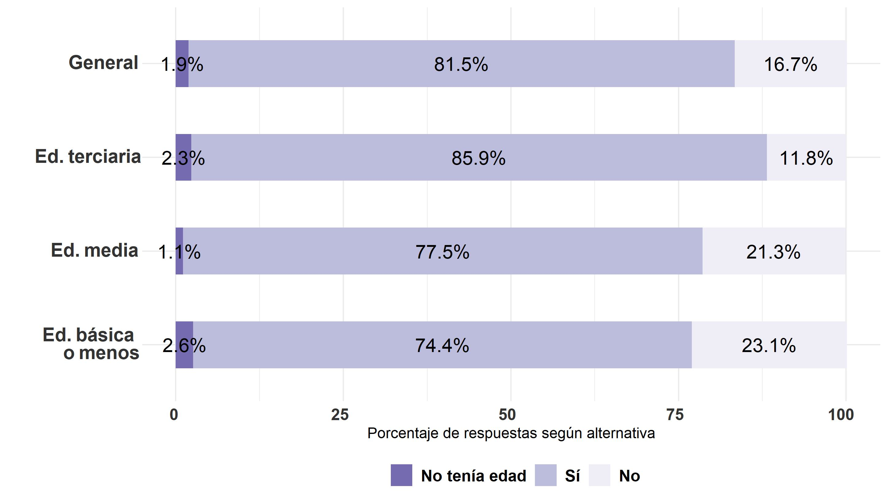

### Elecciones organo constituyente 2021
```{r}
### variable voto_conv2

bbdd_general0 <- data_wide  %>% dplyr::select(voto_conv2)
bbdd_general0 <- na.omit(bbdd_general0)
bbdd_general =
  bbdd_general0 %>% group_by(voto_conv2) %>%
             summarise(n=n(), tipe="<span style='color:#FFFFFF'>e</span>General") %>%
             mutate(prop=round(n*100/sum(n),1))

bbdd_ed_bas0 <- data_wide  %>% dplyr::select(voto_conv2,nse_padre) %>% filter(nse_padre==1 | nse_padre==2 | nse_padre==3)
bbdd_ed_bas0 <- na.omit(bbdd_ed_bas0)
bbdd_ed_bas =
  bbdd_ed_bas0 %>%
              group_by(voto_conv2) %>% #pregunta a graficar
             summarise(n=n(), tipe="<span style='color:#FFFFFF'>a</span>Ed. básica <br>o menos") %>%
             mutate(prop=round(n*100/sum(n),1))

bbdd_ed_med0 <- data_wide  %>% dplyr::select(voto_conv2,nse_padre) %>% filter(nse_padre==4 | nse_padre==5)
bbdd_ed_med0 <- na.omit(bbdd_ed_med0)
bbdd_ed_med =
  bbdd_ed_med0 %>%
              group_by(voto_conv2) %>% #pregunta a graficar
             summarise(n=n(), tipe="<span style='color:#FFFFFF'>b</span>Ed. media") %>%
             mutate(prop=round(n*100/sum(n),1))

bbdd_ed_ter0 <- data_wide  %>% dplyr::select(voto_conv2,nse_padre) %>% filter(nse_padre==6 | nse_padre==7 | nse_padre==8 | nse_padre==9 | nse_padre==10)
bbdd_ed_ter0 <- na.omit(bbdd_ed_ter0)
bbdd_ed_ter =
  bbdd_ed_ter0 %>% 
              group_by(voto_conv2) %>% #pregunta a graficar
             summarise(n=n(), tipe="<span style='color:#FFFFFF'>c</span>Ed. terciaria") %>%
             mutate(prop=round(n*100/sum(n),1))

bbdd_grafico = rbind(bbdd_general,bbdd_ed_ter,bbdd_ed_med,bbdd_ed_bas)
bbdd_grafico<-na.omit(bbdd_grafico)
elec_org_const_21_edpad <- bbdd_grafico %>% ggplot2::ggplot(aes(x=prop,y=tipe,fill=as.character(voto_conv2))) +  geom_bar(stat="identity",width = 0.5) +
  xlab("Porcentaje de respuestas según alternativa") +
  ylab("") +
  theme_minimal() +  # Fondo blanco con lineas
   geom_text(aes(x = prop, label = paste0(prop,"%")),
                  position = position_stack(vjust = .5),color="black", size=5) +
    theme(axis.text.x = element_markdown(colour = "grey20", size = 12, hjust = 0.7, vjust = 0.5, face = "bold"),
          axis.text.y = element_markdown(colour = "grey20", size = 14, face = "bold"), 
legend.position = "bottom", # legenda abajo
         plot.title = element_markdown(face="bold"), # titulo de grafico negrita
          #legend.text= element_markdown(size = 16), #
         legend.title = element_blank(),
         #text=element_text(size=16),
          legend.text = element_text(size=12, face = "bold")) +
  guides(fill = guide_legend(reverse=TRUE)) +
     scale_fill_brewer(palette="Purples", labels = c("No", "Sí"))

ggsave(elec_org_const_21_edpad, file = "../output/graphs/elec_org_const_21_edpad.jpg",device = "jpg",width = 23,height = 13,dpi = "retina",units = "cm")
```


### Elecciones municipales 2021
```{r}
### variable voto_muni

bbdd_general0 <- data_wide  %>% dplyr::select(voto_muni)
bbdd_general0 <- na.omit(bbdd_general0)
bbdd_general =
  bbdd_general0 %>% group_by(voto_muni) %>%
             summarise(n=n(), tipe="<span style='color:#FFFFFF'>e</span>General") %>%
             mutate(prop=round(n*100/sum(n),1))

bbdd_ed_bas0 <- data_wide  %>% dplyr::select(voto_muni,nse_padre) %>% filter(nse_padre==1 | nse_padre==2 | nse_padre==3)
bbdd_ed_bas0 <- na.omit(bbdd_ed_bas0)
bbdd_ed_bas =
  bbdd_ed_bas0 %>%
              group_by(voto_muni) %>% #pregunta a graficar
             summarise(n=n(), tipe="<span style='color:#FFFFFF'>a</span>Ed. básica <br>o menos") %>%
             mutate(prop=round(n*100/sum(n),1))

bbdd_ed_med0 <- data_wide  %>% dplyr::select(voto_muni,nse_padre) %>% filter(nse_padre==4 | nse_padre==5)
bbdd_ed_med0 <- na.omit(bbdd_ed_med0)
bbdd_ed_med =
  bbdd_ed_med0 %>%
              group_by(voto_muni) %>% #pregunta a graficar
             summarise(n=n(), tipe="<span style='color:#FFFFFF'>b</span>Ed. media") %>%
             mutate(prop=round(n*100/sum(n),1))

bbdd_ed_ter0 <- data_wide  %>% dplyr::select(voto_muni,nse_padre) %>% filter(nse_padre==6 | nse_padre==7 | nse_padre==8 | nse_padre==9 | nse_padre==10)
bbdd_ed_ter0 <- na.omit(bbdd_ed_ter0)
bbdd_ed_ter =
  bbdd_ed_ter0 %>% 
              group_by(voto_muni) %>% #pregunta a graficar
             summarise(n=n(), tipe="<span style='color:#FFFFFF'>c</span>Ed. terciaria") %>%
             mutate(prop=round(n*100/sum(n),1))

bbdd_grafico = rbind(bbdd_general,bbdd_ed_ter,bbdd_ed_med,bbdd_ed_bas)
bbdd_grafico<-na.omit(bbdd_grafico)
elec_muni_21_edpad <- bbdd_grafico %>% ggplot2::ggplot(aes(x=prop,y=tipe,fill=as.character(voto_muni))) +  geom_bar(stat="identity",width = 0.5) +
  xlab("Porcentaje de respuestas según alternativa") +
  ylab("") +
  theme_minimal() +  # Fondo blanco con lineas
   geom_text(aes(x = prop, label = paste0(prop,"%")),
                  position = position_stack(vjust = .5),color="black", size=5) +
    theme(axis.text.x = element_markdown(colour = "grey20", size = 12, hjust = 0.7, vjust = 0.5, face = "bold"),
          axis.text.y = element_markdown(colour = "grey20", size = 14, face = "bold"), 
legend.position = "bottom", # legenda abajo
         plot.title = element_markdown(face="bold"), # titulo de grafico negrita
          #legend.text= element_markdown(size = 16), #
         legend.title = element_blank(),
         #text=element_text(size=16),
          legend.text = element_text(size=12, face = "bold")) +
  guides(fill = guide_legend(reverse=TRUE)) +
     scale_fill_brewer(palette="Purples", labels = c("No", "Sí"))

ggsave(elec_muni_21_edpad, file = "../output/graphs/elec_muni_21_edpad.jpg",device = "jpg",width = 23,height = 13,dpi = "retina",units = "cm")
```


### Elecciones primera vuelta 2021
```{r}
### variable voto_privuelta

bbdd_general0 <- data_wide  %>% dplyr::select(voto_privuelta)
bbdd_general0 <- na.omit(bbdd_general0)
bbdd_general =
  bbdd_general0 %>% group_by(voto_privuelta) %>%
             summarise(n=n(), tipe="<span style='color:#FFFFFF'>e</span>General") %>%
             mutate(prop=round(n*100/sum(n),1))

bbdd_ed_bas0 <- data_wide  %>% dplyr::select(voto_privuelta,nse_padre) %>% filter(nse_padre==1 | nse_padre==2 | nse_padre==3)
bbdd_ed_bas0 <- na.omit(bbdd_ed_bas0)
bbdd_ed_bas =
  bbdd_ed_bas0 %>%
              group_by(voto_privuelta) %>% #pregunta a graficar
             summarise(n=n(), tipe="<span style='color:#FFFFFF'>a</span>Ed. básica <br>o menos") %>%
             mutate(prop=round(n*100/sum(n),1))

bbdd_ed_med0 <- data_wide  %>% dplyr::select(voto_privuelta,nse_padre) %>% filter(nse_padre==4 | nse_padre==5)
bbdd_ed_med0 <- na.omit(bbdd_ed_med0)
bbdd_ed_med =
  bbdd_ed_med0 %>%
              group_by(voto_privuelta) %>% #pregunta a graficar
             summarise(n=n(), tipe="<span style='color:#FFFFFF'>b</span>Ed. media") %>%
             mutate(prop=round(n*100/sum(n),1))

bbdd_ed_ter0 <- data_wide  %>% dplyr::select(voto_privuelta,nse_padre) %>% filter(nse_padre==6 | nse_padre==7 | nse_padre==8 | nse_padre==9 | nse_padre==10)
bbdd_ed_ter0 <- na.omit(bbdd_ed_ter0)
bbdd_ed_ter =
  bbdd_ed_ter0 %>% 
              group_by(voto_privuelta) %>% #pregunta a graficar
             summarise(n=n(), tipe="<span style='color:#FFFFFF'>c</span>Ed. terciaria") %>%
             mutate(prop=round(n*100/sum(n),1))

bbdd_grafico = rbind(bbdd_general,bbdd_ed_ter,bbdd_ed_med,bbdd_ed_bas)
bbdd_grafico<-na.omit(bbdd_grafico)
elec_privuelta_21_edpad <- bbdd_grafico %>% ggplot2::ggplot(aes(x=prop,y=tipe,fill=as.character(voto_privuelta))) +  geom_bar(stat="identity",width = 0.5) +
  xlab("Porcentaje de respuestas según alternativa") +
  ylab("") +
  theme_minimal() +  # Fondo blanco con lineas
   geom_text(aes(x = prop, label = paste0(prop,"%")),
                  position = position_stack(vjust = .5),color="black", size=5) +
    theme(axis.text.x = element_markdown(colour = "grey20", size = 12, hjust = 0.7, vjust = 0.5, face = "bold"),
          axis.text.y = element_markdown(colour = "grey20", size = 14, face = "bold"), 
legend.position = "bottom", # legenda abajo
         plot.title = element_markdown(face="bold"), # titulo de grafico negrita
          #legend.text= element_markdown(size = 16), #
         legend.title = element_blank(),
         #text=element_text(size=16),
          legend.text = element_text(size=12, face = "bold")) +
  guides(fill = guide_legend(reverse=TRUE)) +
     scale_fill_brewer(palette="Purples", labels = c("No", "Sí"))

ggsave(elec_privuelta_21_edpad, file = "../output/graphs/elec_privuelta_21_edpad.jpg",device = "jpg",width = 23,height = 13,dpi = "retina",units = "cm")
```


### Elecciones segunda vuelta 2021
```{r}
### variable voto_segvuelta

bbdd_general0 <- data_wide  %>% dplyr::select(voto_segvuelta)
bbdd_general0 <- na.omit(bbdd_general0)
bbdd_general =
  bbdd_general0 %>% group_by(voto_segvuelta) %>%
             summarise(n=n(), tipe="<span style='color:#FFFFFF'>e</span>General") %>%
             mutate(prop=round(n*100/sum(n),1))

bbdd_ed_bas0 <- data_wide  %>% dplyr::select(voto_segvuelta,nse_padre) %>% filter(nse_padre==1 | nse_padre==2 | nse_padre==3)
bbdd_ed_bas0 <- na.omit(bbdd_ed_bas0)
bbdd_ed_bas =
  bbdd_ed_bas0 %>%
              group_by(voto_segvuelta) %>% #pregunta a graficar
             summarise(n=n(), tipe="<span style='color:#FFFFFF'>a</span>Ed. básica <br>o menos") %>%
             mutate(prop=round(n*100/sum(n),1))

bbdd_ed_med0 <- data_wide  %>% dplyr::select(voto_segvuelta,nse_padre) %>% filter(nse_padre==4 | nse_padre==5)
bbdd_ed_med0 <- na.omit(bbdd_ed_med0)
bbdd_ed_med =
  bbdd_ed_med0 %>%
              group_by(voto_segvuelta) %>% #pregunta a graficar
             summarise(n=n(), tipe="<span style='color:#FFFFFF'>b</span>Ed. media") %>%
             mutate(prop=round(n*100/sum(n),1))

bbdd_ed_ter0 <- data_wide  %>% dplyr::select(voto_segvuelta,nse_padre) %>% filter(nse_padre==6 | nse_padre==7 | nse_padre==8 | nse_padre==9 | nse_padre==10)
bbdd_ed_ter0 <- na.omit(bbdd_ed_ter0)
bbdd_ed_ter =
  bbdd_ed_ter0 %>% 
              group_by(voto_segvuelta) %>% #pregunta a graficar
             summarise(n=n(), tipe="<span style='color:#FFFFFF'>c</span>Ed. terciaria") %>%
             mutate(prop=round(n*100/sum(n),1))

bbdd_grafico = rbind(bbdd_general,bbdd_ed_ter,bbdd_ed_med,bbdd_ed_bas)
bbdd_grafico<-na.omit(bbdd_grafico)
elec_segvuelta_21_edpad <- bbdd_grafico %>% ggplot2::ggplot(aes(x=prop,y=tipe,fill=as.character(voto_segvuelta))) +  geom_bar(stat="identity",width = 0.5) +
  xlab("Porcentaje de respuestas según alternativa") +
  ylab("") +
  theme_minimal() +  # Fondo blanco con lineas
   geom_text(aes(x = prop, label = paste0(prop,"%")),
                  position = position_stack(vjust = .5),color="black", size=5) +
    theme(axis.text.x = element_markdown(colour = "grey20", size = 12, hjust = 0.7, vjust = 0.5, face = "bold"),
          axis.text.y = element_markdown(colour = "grey20", size = 14, face = "bold"), 
legend.position = "bottom", # legenda abajo
         plot.title = element_markdown(face="bold"), # titulo de grafico negrita
          #legend.text= element_markdown(size = 16), #
         legend.title = element_blank(),
         #text=element_text(size=16),
          legend.text = element_text(size=12, face = "bold")) +
  guides(fill = guide_legend(reverse=TRUE)) +
     scale_fill_brewer(palette="Purples", labels = c("No", "Sí"))

ggsave(elec_segvuelta_21_edpad, file = "../output/graphs/elec_segvuelta_21_edpad.jpg",device = "jpg",width = 23,height = 13,dpi = "retina",units = "cm")
```

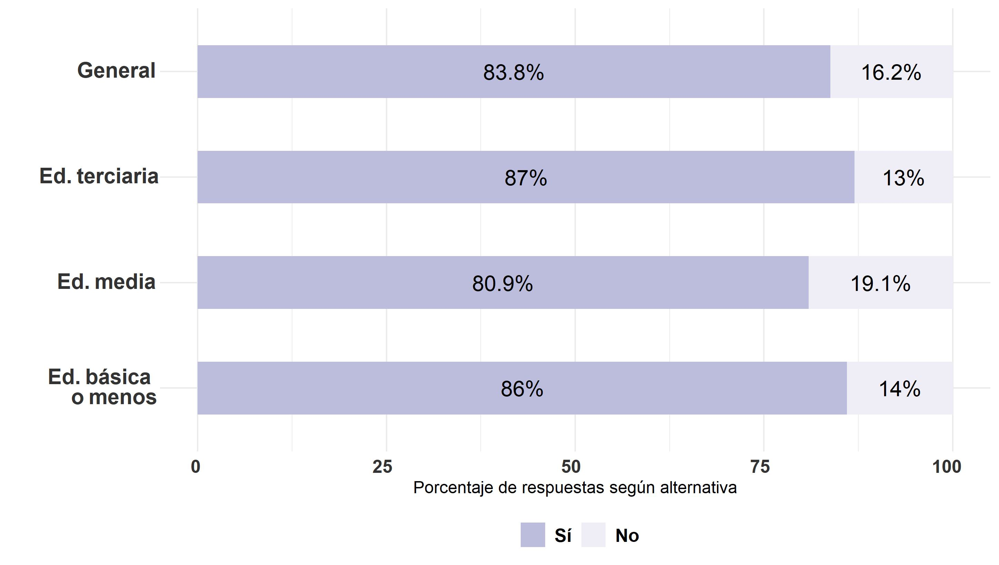

## Frecuencia de conversación con los padres sobre temas sociales y/o políticos en 3ro y 4to medio
### Elecciones presidenciales 2017
```{r}
### variable voto_pres_17

bbdd_general0 <- data_wide  %>% dplyr::select(voto_pres_17)
bbdd_general0 <- na.omit(bbdd_general0)
bbdd_general =
  bbdd_general0 %>% group_by(voto_pres_17) %>%
             summarise(n=n(), tipe="<span style='color:#FFFFFF'>e</span>General") %>%
             mutate(prop=round(n*100/sum(n),1))

bbdd_nunca0 <- data_wide  %>% dplyr::select(voto_pres_17,conv_padr_poli) %>% filter(conv_padr_poli==1)
bbdd_nunca0 <- na.omit(bbdd_nunca0)
bbdd_nunca =
  bbdd_nunca0 %>% group_by(voto_pres_17) %>% #pregunta a graficar
             summarise(n=n(), tipe="<span style='color:#FFFFFF'>d</span>4. Nunca") %>%
             mutate(prop=round(n*100/sum(n),1))

bbdd_casi_nunca0 <- data_wide  %>% dplyr::select(voto_pres_17,conv_padr_poli) %>% filter(conv_padr_poli==2)
bbdd_casi_nunca0 <- na.omit(bbdd_casi_nunca0)
bbdd_casi_nunca =
  bbdd_casi_nunca0 %>% group_by(voto_pres_17) %>% #pregunta a graficar
             summarise(n=n(), tipe="<span style='color:#FFFFFF'>c</span>3. Casi nunca") %>%
             mutate(prop=round(n*100/sum(n),1))

bbdd_a_veces0 <- data_wide  %>% dplyr::select(voto_pres_17,conv_padr_poli) %>% filter(conv_padr_poli==3)
bbdd_a_veces0 <- na.omit(bbdd_a_veces0)
bbdd_a_veces =
  bbdd_a_veces0 %>% group_by(voto_pres_17) %>% #pregunta a graficar
             summarise(n=n(), tipe="<span style='color:#FFFFFF'>b</span>2. A veces") %>%
             mutate(prop=round(n*100/sum(n),1))

bbdd_frecuent0 <- data_wide  %>% dplyr::select(voto_pres_17,conv_padr_poli) %>% filter(conv_padr_poli==4)
bbdd_frecuent0 <- na.omit(bbdd_frecuent0)
bbdd_frecuent =
  data_wide %>% group_by(voto_pres_17) %>% #pregunta a graficar
             summarise(n=n(), tipe="<span style='color:#FFFFFF'>a</span>1. Frecuentemente") %>%
             mutate(prop=round(n*100/sum(n),1))

bbdd_grafico = rbind(bbdd_general,bbdd_nunca,bbdd_casi_nunca,bbdd_a_veces,bbdd_frecuent)
bbdd_grafico<-na.omit(bbdd_grafico)

elec_17_conv_pad_3y4 <- bbdd_grafico %>% ggplot2::ggplot(aes(x=prop,y=tipe,fill=as.character(voto_pres_17))) +  geom_bar(stat="identity",width = 0.5) +
  xlab("Porcentaje de respuestas según alternativa") +
  ylab("") +
  theme_minimal() +  # Fondo blanco con lineas
   geom_text(aes(x = prop, label = paste0(prop,"%")),
                  position = position_stack(vjust = .5),color="black", size=5) +
       theme(axis.text.x = element_markdown(colour = "grey20", size = 12, hjust = 0.7, vjust = 0.5, face = "bold"),
          axis.text.y = element_markdown(colour = "grey20", size = 14, face = "bold"), 
legend.position = "bottom", # legenda abajo
         plot.title = element_markdown(face="bold"), # titulo de grafico negrita
          #legend.text= element_markdown(size = 16), #
         legend.title = element_blank(),
         #text=element_text(size=16),
          legend.text = element_text(size=12, face = "bold")) +
  guides(fill = guide_legend(reverse=TRUE)) +
     scale_fill_brewer(palette="Purples", labels = c("No", "Sí", "No tenía edad"))
  
ggsave(elec_17_conv_pad_3y4, file = "../output/graphs/elec_17_conv_pad_3y4.jpg",device = "jpg",width = 23,height = 13.5,dpi = "retina",units = "cm")
```


### Elecciones plebiscito constitucional 2020
```{r}
### variable voto_pleb

bbdd_general0 <- data_wide  %>% dplyr::select(voto_pleb)
bbdd_general0 <- na.omit(bbdd_general0)
bbdd_general =
  bbdd_general0 %>% group_by(voto_pleb) %>%
             summarise(n=n(), tipe="<span style='color:#FFFFFF'>e</span>General") %>%
             mutate(prop=round(n*100/sum(n),1))

bbdd_nunca0 <- data_wide  %>% dplyr::select(voto_pleb,conv_padr_poli) %>% filter(conv_padr_poli==1)
bbdd_nunca0 <- na.omit(bbdd_nunca0)
bbdd_nunca =
  bbdd_nunca0 %>% group_by(voto_pleb) %>% #pregunta a graficar
             summarise(n=n(), tipe="<span style='color:#FFFFFF'>d</span>4. Nunca") %>%
             mutate(prop=round(n*100/sum(n),1))

bbdd_casi_nunca0 <- data_wide  %>% dplyr::select(voto_pleb,conv_padr_poli) %>% filter(conv_padr_poli==2)
bbdd_casi_nunca0 <- na.omit(bbdd_casi_nunca0)
bbdd_casi_nunca =
  bbdd_casi_nunca0 %>% 
              group_by(voto_pleb) %>% #pregunta a graficar
             summarise(n=n(), tipe="<span style='color:#FFFFFF'>c</span>3. Casi nunca") %>%
             mutate(prop=round(n*100/sum(n),1))

bbdd_a_veces0 <- data_wide  %>% dplyr::select(voto_pleb,conv_padr_poli) %>% filter(conv_padr_poli==3)
bbdd_a_veces0 <- na.omit(bbdd_a_veces0)
bbdd_a_veces =
  bbdd_a_veces0 %>% 
              group_by(voto_pleb) %>% #pregunta a graficar
             summarise(n=n(), tipe="<span style='color:#FFFFFF'>b</span>2. A veces") %>%
             mutate(prop=round(n*100/sum(n),1))

bbdd_frecuent0 <- data_wide  %>% dplyr::select(voto_pleb,conv_padr_poli) %>% filter(conv_padr_poli==4)
bbdd_frecuent0 <- na.omit(bbdd_frecuent0)
bbdd_frecuent =
  bbdd_frecuent0 %>% 
              group_by(voto_pleb) %>% #pregunta a graficar
             summarise(n=n(), tipe="<span style='color:#FFFFFF'>a</span>1. Frecuentemente") %>%
             mutate(prop=round(n*100/sum(n),1))

bbdd_grafico = rbind(bbdd_general,bbdd_nunca,bbdd_casi_nunca,bbdd_a_veces,bbdd_frecuent)
bbdd_grafico<-na.omit(bbdd_grafico)

elec_pleb_conv_pad_3y4 <- bbdd_grafico %>% ggplot2::ggplot(aes(x=prop,y=tipe,fill=as.character(voto_pleb))) +  geom_bar(stat="identity",width = 0.5) +
  xlab("Porcentaje de respuestas según alternativa") +
  ylab("") +
  theme_minimal() +  # Fondo blanco con lineas
   geom_text(aes(x = prop, label = paste0(prop,"%")),
                  position = position_stack(vjust = .5),color="black", size=5) +
       theme(axis.text.x = element_markdown(colour = "grey20", size = 12, hjust = 0.7, vjust = 0.5, face = "bold"),
          axis.text.y = element_markdown(colour = "grey20", size = 14, face = "bold"), 
legend.position = "bottom", # legenda abajo
         plot.title = element_markdown(face="bold"), # titulo de grafico negrita
          #legend.text= element_markdown(size = 16), #
         legend.title = element_blank(),
         #text=element_text(size=16),
          legend.text = element_text(size=12, face = "bold")) +
  guides(fill = guide_legend(reverse=TRUE)) +
     scale_fill_brewer(palette="Purples", labels = c("No", "Sí", "No tenía edad"))
  
ggsave(elec_pleb_conv_pad_3y4, file = "../output/graphs/elec_pleb_conv_pad_3y4.jpg",device = "jpg",width = 23,height = 13.5,dpi = "retina",units = "cm")
```


### Elecciones organo constituyente 2021
```{r}
### variable voto_conv2

bbdd_general0 <- data_wide  %>% dplyr::select(voto_conv2)
bbdd_general0 <- na.omit(bbdd_general0)
bbdd_general =
  bbdd_general0 %>% group_by(voto_conv2) %>%
  summarise(n=n(), tipe="<span style='color:#FFFFFF'>e</span>General") %>%
             mutate(prop=round(n*100/sum(n),1))

bbdd_nunca0 <- data_wide  %>% dplyr::select(voto_conv2,conv_padr_poli) %>% filter(conv_padr_poli==1)
bbdd_nunca0 <- na.omit(bbdd_nunca0)
bbdd_nunca =
  bbdd_nunca0 %>% 
              group_by(voto_conv2) %>% #pregunta a graficar
             summarise(n=n(), tipe="<span style='color:#FFFFFF'>d</span>4. Nunca") %>%
             mutate(prop=round(n*100/sum(n),1))

bbdd_casi_nunca0 <- data_wide  %>% dplyr::select(voto_conv2,conv_padr_poli) %>% filter(conv_padr_poli==2)
bbdd_casi_nunca0 <- na.omit(bbdd_casi_nunca0)
bbdd_casi_nunca =
  bbdd_casi_nunca0 %>%
              group_by(voto_conv2) %>% #pregunta a graficar
             summarise(n=n(), tipe="<span style='color:#FFFFFF'>c</span>3. Casi nunca") %>%
             mutate(prop=round(n*100/sum(n),1))

bbdd_a_veces0 <- data_wide  %>% dplyr::select(voto_conv2,conv_padr_poli) %>% filter(conv_padr_poli==3)
bbdd_a_veces0 <- na.omit(bbdd_a_veces0)
bbdd_a_veces =
  bbdd_a_veces0 %>% 
              group_by(voto_conv2) %>% #pregunta a graficar
             summarise(n=n(), tipe="<span style='color:#FFFFFF'>b</span>2. A veces") %>%
             mutate(prop=round(n*100/sum(n),1))

bbdd_frecuent0 <- data_wide  %>% dplyr::select(voto_conv2,conv_padr_poli) %>% filter(conv_padr_poli==4)
bbdd_frecuent0 <- na.omit(bbdd_frecuent0)
bbdd_frecuent =
  bbdd_frecuent0 %>%
              group_by(voto_conv2) %>% #pregunta a graficar
             summarise(n=n(), tipe="<span style='color:#FFFFFF'>a</span>1. Frecuentemente") %>%
             mutate(prop=round(n*100/sum(n),1))

bbdd_grafico = rbind(bbdd_general,bbdd_nunca,bbdd_casi_nunca,bbdd_a_veces,bbdd_frecuent)
bbdd_grafico<-na.omit(bbdd_grafico)

elec_org_const_21_conv_pad_3y4 <- bbdd_grafico %>% ggplot2::ggplot(aes(x=prop,y=tipe,fill=as.character(voto_conv2))) +  geom_bar(stat="identity",width = 0.5) +
  xlab("Porcentaje de respuestas según alternativa") +
  ylab("") +
  theme_minimal() +  # Fondo blanco con lineas
   geom_text(aes(x = prop, label = paste0(prop,"%")),
                  position = position_stack(vjust = .5),color="black", size=5) +
       theme(axis.text.x = element_markdown(colour = "grey20", size = 12, hjust = 0.7, vjust = 0.5, face = "bold"),
          axis.text.y = element_markdown(colour = "grey20", size = 14, face = "bold"), 
legend.position = "bottom", # legenda abajo
         plot.title = element_markdown(face="bold"), # titulo de grafico negrita
          #legend.text= element_markdown(size = 16), #
         legend.title = element_blank(),
         #text=element_text(size=16),
          legend.text = element_text(size=12, face = "bold")) +
  guides(fill = guide_legend(reverse=TRUE)) +
     scale_fill_brewer(palette="Purples", labels = c("No", "Sí"))
  
ggsave(elec_org_const_21_conv_pad_3y4, file = "../output/graphs/elec_org_const_21_conv_pad_3y4.jpg",device = "jpg",width = 23,height = 13.5,dpi = "retina",units = "cm")
```


### Elecciones municipales 2021
```{r}
### variable voto_muni

bbdd_general0 <- data_wide  %>% dplyr::select(voto_muni)
bbdd_general0 <- na.omit(bbdd_general0)
bbdd_general =
  bbdd_general0 %>% group_by(voto_muni) %>%
  summarise(n=n(), tipe="<span style='color:#FFFFFF'>e</span>General") %>%
             mutate(prop=round(n*100/sum(n),1))

bbdd_nunca0 <- data_wide  %>% dplyr::select(voto_muni,conv_padr_poli) %>% filter(conv_padr_poli==1)
bbdd_nunca0 <- na.omit(bbdd_nunca0)
bbdd_nunca =
  bbdd_nunca0 %>% 
              group_by(voto_muni) %>% #pregunta a graficar
             summarise(n=n(), tipe="<span style='color:#FFFFFF'>d</span>4. Nunca") %>%
             mutate(prop=round(n*100/sum(n),1))

bbdd_casi_nunca0 <- data_wide  %>% dplyr::select(voto_muni,conv_padr_poli) %>% filter(conv_padr_poli==2)
bbdd_casi_nunca0 <- na.omit(bbdd_casi_nunca0)
bbdd_casi_nunca =
  bbdd_casi_nunca0 %>%
              group_by(voto_muni) %>% #pregunta a graficar
             summarise(n=n(), tipe="<span style='color:#FFFFFF'>c</span>3. Casi nunca") %>%
             mutate(prop=round(n*100/sum(n),1))

bbdd_a_veces0 <- data_wide  %>% dplyr::select(voto_muni,conv_padr_poli) %>% filter(conv_padr_poli==3)
bbdd_a_veces0 <- na.omit(bbdd_a_veces0)
bbdd_a_veces =
  bbdd_a_veces0 %>% 
              group_by(voto_muni) %>% #pregunta a graficar
             summarise(n=n(), tipe="<span style='color:#FFFFFF'>b</span>2. A veces") %>%
             mutate(prop=round(n*100/sum(n),1))

bbdd_frecuent0 <- data_wide  %>% dplyr::select(voto_muni,conv_padr_poli) %>% filter(conv_padr_poli==4)
bbdd_frecuent0 <- na.omit(bbdd_frecuent0)
bbdd_frecuent =
  bbdd_frecuent0 %>%
              group_by(voto_muni) %>% #pregunta a graficar
             summarise(n=n(), tipe="<span style='color:#FFFFFF'>a</span>1. Frecuentemente") %>%
             mutate(prop=round(n*100/sum(n),1))

bbdd_grafico = rbind(bbdd_general,bbdd_nunca,bbdd_casi_nunca,bbdd_a_veces,bbdd_frecuent)
bbdd_grafico<-na.omit(bbdd_grafico)

elec_muni_21_conv_pad_3y4 <- bbdd_grafico %>% ggplot2::ggplot(aes(x=prop,y=tipe,fill=as.character(voto_muni))) +  geom_bar(stat="identity",width = 0.5) +
  xlab("Porcentaje de respuestas según alternativa") +
  ylab("") +
  theme_minimal() +  # Fondo blanco con lineas
   geom_text(aes(x = prop, label = paste0(prop,"%")),
                  position = position_stack(vjust = .5),color="black", size=5) +
       theme(axis.text.x = element_markdown(colour = "grey20", size = 12, hjust = 0.7, vjust = 0.5, face = "bold"),
          axis.text.y = element_markdown(colour = "grey20", size = 14, face = "bold"), 
legend.position = "bottom", # legenda abajo
         plot.title = element_markdown(face="bold"), # titulo de grafico negrita
          #legend.text= element_markdown(size = 16), #
         legend.title = element_blank(),
         #text=element_text(size=16),
          legend.text = element_text(size=12, face = "bold")) +
  guides(fill = guide_legend(reverse=TRUE)) +
     scale_fill_brewer(palette="Purples", labels = c("No", "Sí"))
  
ggsave(elec_muni_21_conv_pad_3y4, file = "../output/graphs/elec_muni_21_conv_pad_3y4.jpg",device = "jpg",width = 23,height = 13.5,dpi = "retina",units = "cm")
```


### Elecciones primera vuelta 2021
```{r}
### variable voto_privuelta

bbdd_general0 <- data_wide  %>% dplyr::select(voto_privuelta)
bbdd_general0 <- na.omit(bbdd_general0)
bbdd_general =
  bbdd_general0 %>% group_by(voto_privuelta) %>%
  summarise(n=n(), tipe="<span style='color:#FFFFFF'>e</span>General") %>%
             mutate(prop=round(n*100/sum(n),1))

bbdd_nunca0 <- data_wide  %>% dplyr::select(voto_privuelta,conv_padr_poli) %>% filter(conv_padr_poli==1)
bbdd_nunca0 <- na.omit(bbdd_nunca0)
bbdd_nunca =
  bbdd_nunca0 %>% 
              group_by(voto_privuelta) %>% #pregunta a graficar
             summarise(n=n(), tipe="<span style='color:#FFFFFF'>d</span>4. Nunca") %>%
             mutate(prop=round(n*100/sum(n),1))

bbdd_casi_nunca0 <- data_wide  %>% dplyr::select(voto_privuelta,conv_padr_poli) %>% filter(conv_padr_poli==2)
bbdd_casi_nunca0 <- na.omit(bbdd_casi_nunca0)
bbdd_casi_nunca =
  bbdd_casi_nunca0 %>%
              group_by(voto_privuelta) %>% #pregunta a graficar
             summarise(n=n(), tipe="<span style='color:#FFFFFF'>c</span>3. Casi nunca") %>%
             mutate(prop=round(n*100/sum(n),1))

bbdd_a_veces0 <- data_wide  %>% dplyr::select(voto_privuelta,conv_padr_poli) %>% filter(conv_padr_poli==3)
bbdd_a_veces0 <- na.omit(bbdd_a_veces0)
bbdd_a_veces =
  bbdd_a_veces0 %>% 
              group_by(voto_privuelta) %>% #pregunta a graficar
             summarise(n=n(), tipe="<span style='color:#FFFFFF'>b</span>2. A veces") %>%
             mutate(prop=round(n*100/sum(n),1))

bbdd_frecuent0 <- data_wide  %>% dplyr::select(voto_privuelta,conv_padr_poli) %>% filter(conv_padr_poli==4)
bbdd_frecuent0 <- na.omit(bbdd_frecuent0)
bbdd_frecuent =
  bbdd_frecuent0 %>%
              group_by(voto_privuelta) %>% #pregunta a graficar
             summarise(n=n(), tipe="<span style='color:#FFFFFF'>a</span>1. Frecuentemente") %>%
             mutate(prop=round(n*100/sum(n),1))

bbdd_grafico = rbind(bbdd_general,bbdd_nunca,bbdd_casi_nunca,bbdd_a_veces,bbdd_frecuent)
bbdd_grafico<-na.omit(bbdd_grafico)

elec_privuelta_21_conv_pad_3y4 <- bbdd_grafico %>% ggplot2::ggplot(aes(x=prop,y=tipe,fill=as.character(voto_privuelta))) +  geom_bar(stat="identity",width = 0.5) +
  xlab("Porcentaje de respuestas según alternativa") +
  ylab("") +
  theme_minimal() +  # Fondo blanco con lineas
   geom_text(aes(x = prop, label = paste0(prop,"%")),
                  position = position_stack(vjust = .5),color="black", size=5) +
       theme(axis.text.x = element_markdown(colour = "grey20", size = 12, hjust = 0.7, vjust = 0.5, face = "bold"),
          axis.text.y = element_markdown(colour = "grey20", size = 14, face = "bold"), 
legend.position = "bottom", # legenda abajo
         plot.title = element_markdown(face="bold"), # titulo de grafico negrita
          #legend.text= element_markdown(size = 16), #
         legend.title = element_blank(),
         #text=element_text(size=16),
          legend.text = element_text(size=12, face = "bold")) +
  guides(fill = guide_legend(reverse=TRUE)) +
     scale_fill_brewer(palette="Purples", labels = c("No", "Sí"))
  
ggsave(elec_privuelta_21_conv_pad_3y4, file = "../output/graphs/elec_privuelta_21_conv_pad_3y4.jpg",device = "jpg",width = 23,height = 13.5,dpi = "retina",units = "cm")
```


### Elecciones segunda vuelta 2021
```{r}
### variable voto_segvuelta

bbdd_general0 <- data_wide  %>% dplyr::select(voto_segvuelta)
bbdd_general0 <- na.omit(bbdd_general0)
bbdd_general =
  bbdd_general0 %>% group_by(voto_segvuelta) %>%
  summarise(n=n(), tipe="<span style='color:#FFFFFF'>e</span>General") %>%
             mutate(prop=round(n*100/sum(n),1))

bbdd_nunca0 <- data_wide  %>% dplyr::select(voto_segvuelta,conv_padr_poli) %>% filter(conv_padr_poli==1)
bbdd_nunca0 <- na.omit(bbdd_nunca0)
bbdd_nunca =
  bbdd_nunca0 %>% 
              group_by(voto_segvuelta) %>% #pregunta a graficar
             summarise(n=n(), tipe="<span style='color:#FFFFFF'>d</span>4. Nunca") %>%
             mutate(prop=round(n*100/sum(n),1))

bbdd_casi_nunca0 <- data_wide  %>% dplyr::select(voto_segvuelta,conv_padr_poli) %>% filter(conv_padr_poli==2)
bbdd_casi_nunca0 <- na.omit(bbdd_casi_nunca0)
bbdd_casi_nunca =
  bbdd_casi_nunca0 %>%
              group_by(voto_segvuelta) %>% #pregunta a graficar
             summarise(n=n(), tipe="<span style='color:#FFFFFF'>c</span>3. Casi nunca") %>%
             mutate(prop=round(n*100/sum(n),1))

bbdd_a_veces0 <- data_wide  %>% dplyr::select(voto_segvuelta,conv_padr_poli) %>% filter(conv_padr_poli==3)
bbdd_a_veces0 <- na.omit(bbdd_a_veces0)
bbdd_a_veces =
  bbdd_a_veces0 %>% 
              group_by(voto_segvuelta) %>% #pregunta a graficar
             summarise(n=n(), tipe="<span style='color:#FFFFFF'>b</span>2. A veces") %>%
             mutate(prop=round(n*100/sum(n),1))

bbdd_frecuent0 <- data_wide  %>% dplyr::select(voto_segvuelta,conv_padr_poli) %>% filter(conv_padr_poli==4)
bbdd_frecuent0 <- na.omit(bbdd_frecuent0)
bbdd_frecuent =
  bbdd_frecuent0 %>%
              group_by(voto_segvuelta) %>% #pregunta a graficar
             summarise(n=n(), tipe="<span style='color:#FFFFFF'>a</span>1. Frecuentemente") %>%
             mutate(prop=round(n*100/sum(n),1))

bbdd_grafico = rbind(bbdd_general,bbdd_nunca,bbdd_casi_nunca,bbdd_a_veces,bbdd_frecuent)
bbdd_grafico<-na.omit(bbdd_grafico)

elec_segvuelta_21_conv_pad_3y4 <- bbdd_grafico %>% ggplot2::ggplot(aes(x=prop,y=tipe,fill=as.character(voto_segvuelta))) +  geom_bar(stat="identity",width = 0.5) +
  xlab("Porcentaje de respuestas según alternativa") +
  ylab("") +
  theme_minimal() +  # Fondo blanco con lineas
   geom_text(aes(x = prop, label = paste0(prop,"%")),
                  position = position_stack(vjust = .5),color="black", size=5) +
       theme(axis.text.x = element_markdown(colour = "grey20", size = 12, hjust = 0.7, vjust = 0.5, face = "bold"),
          axis.text.y = element_markdown(colour = "grey20", size = 14, face = "bold"), 
legend.position = "bottom", # legenda abajo
         plot.title = element_markdown(face="bold"), # titulo de grafico negrita
          #legend.text= element_markdown(size = 16), #
         legend.title = element_blank(),
         #text=element_text(size=16),
          legend.text = element_text(size=12, face = "bold")) +
  guides(fill = guide_legend(reverse=TRUE)) +
     scale_fill_brewer(palette="Purples", labels = c("No", "Sí"))
  
ggsave(elec_segvuelta_21_conv_pad_3y4, file = "../output/graphs/elec_segvuelta_21_conv_pad_3y4.jpg",device = "jpg",width = 23,height = 13.5,dpi = "retina",units = "cm")
```


## Frecuencia de conversación con los padres sobre temas sociales y/o políticos en el estallido social
### Elecciones presidenciales 2017
```{r}
### variable voto_pres_17

bbdd_general0 <- data_wide  %>% dplyr::select(voto_pres_17)
bbdd_general0 <- na.omit(bbdd_general0)
bbdd_general =
  bbdd_general0 %>% group_by(voto_pres_17) %>%
             summarise(n=n(), tipe="<span style='color:#FFFFFF'>e</span>General") %>%
             mutate(prop=round(n*100/sum(n),1))

bbdd_nunca0 <- data_wide  %>% dplyr::select(voto_pres_17,conv_padres_21) %>% filter(conv_padres_21==1)
bbdd_nunca0 <- na.omit(bbdd_nunca0)
bbdd_nunca =
  bbdd_nunca0 %>% group_by(voto_pres_17) %>% #pregunta a graficar
             summarise(n=n(), tipe="<span style='color:#FFFFFF'>d</span>4. Nunca") %>%
             mutate(prop=round(n*100/sum(n),1))

bbdd_casi_nunca0 <- data_wide  %>% dplyr::select(voto_pres_17,conv_padres_21) %>% filter(conv_padres_21==2)
bbdd_casi_nunca0 <- na.omit(bbdd_casi_nunca0)
bbdd_casi_nunca =
  bbdd_casi_nunca0 %>% group_by(voto_pres_17) %>% #pregunta a graficar
             summarise(n=n(), tipe="<span style='color:#FFFFFF'>c</span>3. Casi nunca") %>%
             mutate(prop=round(n*100/sum(n),1))

bbdd_a_veces0 <- data_wide  %>% dplyr::select(voto_pres_17,conv_padres_21) %>% filter(conv_padres_21==3)
bbdd_a_veces0 <- na.omit(bbdd_a_veces0)
bbdd_a_veces =
  bbdd_a_veces0 %>% group_by(voto_pres_17) %>% #pregunta a graficar
             summarise(n=n(), tipe="<span style='color:#FFFFFF'>b</span>2. A veces") %>%
             mutate(prop=round(n*100/sum(n),1))

bbdd_frecuent0 <- data_wide  %>% dplyr::select(voto_pres_17,conv_padres_21) %>% filter(conv_padres_21==4)
bbdd_frecuent0 <- na.omit(bbdd_frecuent0)
bbdd_frecuent =
  data_wide %>% group_by(voto_pres_17) %>% #pregunta a graficar
             summarise(n=n(), tipe="<span style='color:#FFFFFF'>a</span>1. Frecuentemente") %>%
             mutate(prop=round(n*100/sum(n),1))

bbdd_grafico = rbind(bbdd_general,bbdd_nunca,bbdd_casi_nunca,bbdd_a_veces,bbdd_frecuent)
bbdd_grafico<-na.omit(bbdd_grafico)

elec_17_conv_pad_3y4 <- bbdd_grafico %>% ggplot2::ggplot(aes(x=prop,y=tipe,fill=as.character(voto_pres_17))) +  geom_bar(stat="identity",width = 0.5) +
  xlab("Porcentaje de respuestas según alternativa") +
  ylab("") +
  theme_minimal() +  # Fondo blanco con lineas
   geom_text(aes(x = prop, label = paste0(prop,"%")),
                  position = position_stack(vjust = .5),color="black", size=5) +
       theme(axis.text.x = element_markdown(colour = "grey20", size = 12, hjust = 0.7, vjust = 0.5, face = "bold"),
          axis.text.y = element_markdown(colour = "grey20", size = 14, face = "bold"), 
legend.position = "bottom", # legenda abajo
         plot.title = element_markdown(face="bold"), # titulo de grafico negrita
          #legend.text= element_markdown(size = 16), #
         legend.title = element_blank(),
         #text=element_text(size=16),
          legend.text = element_text(size=12, face = "bold")) +
  guides(fill = guide_legend(reverse=TRUE)) +
     scale_fill_brewer(palette="Purples", labels = c("No", "Sí", "No tenía edad"))
  
ggsave(elec_17_conv_pad_3y4, file = "../output/graphs/elec_17_conv_pad_est_19.jpg",device = "jpg",width = 23,height = 13.5,dpi = "retina",units = "cm")
```


### Elecciones plebiscito constitucional 2020
```{r}
### variable voto_pleb

bbdd_general0 <- data_wide  %>% dplyr::select(voto_pleb)
bbdd_general0 <- na.omit(bbdd_general0)
bbdd_general =
  bbdd_general0 %>% group_by(voto_pleb) %>%
             summarise(n=n(), tipe="<span style='color:#FFFFFF'>e</span>General") %>%
             mutate(prop=round(n*100/sum(n),1))

bbdd_nunca0 <- data_wide  %>% dplyr::select(voto_pleb,conv_padres_21) %>% filter(conv_padres_21==1) 
bbdd_nunca0 <- na.omit(bbdd_nunca0)
bbdd_nunca =
  bbdd_nunca0 %>%
              group_by(voto_pleb) %>% #pregunta a graficar
             summarise(n=n(), tipe="<span style='color:#FFFFFF'>d</span>4. Nunca") %>%
             mutate(prop=round(n*100/sum(n),1))

bbdd_casi_nunca0 <- data_wide  %>% dplyr::select(voto_pleb,conv_padres_21) %>% filter(conv_padres_21==2) 
bbdd_casi_nunca0 <- na.omit(bbdd_casi_nunca0)
bbdd_casi_nunca =
  bbdd_casi_nunca0 %>% 
              group_by(voto_pleb) %>% #pregunta a graficar
             summarise(n=n(), tipe="<span style='color:#FFFFFF'>c</span>3. Casi nunca") %>%
             mutate(prop=round(n*100/sum(n),1))

bbdd_a_veces0 <- data_wide  %>% dplyr::select(voto_pleb,conv_padres_21) %>% filter(conv_padres_21==3) 
bbdd_a_veces0 <- na.omit(bbdd_a_veces0)
bbdd_a_veces =
  bbdd_a_veces0 %>% 
              group_by(voto_pleb) %>% #pregunta a graficar
             summarise(n=n(), tipe="<span style='color:#FFFFFF'>b</span>2. A veces") %>%
             mutate(prop=round(n*100/sum(n),1))

bbdd_frecuent0 <- data_wide  %>% dplyr::select(voto_pleb,conv_padres_21) %>% filter(conv_padres_21==4) 
bbdd_frecuent0 <- na.omit(bbdd_frecuent0)
bbdd_frecuent =
  bbdd_frecuent0 %>% 
              group_by(voto_pleb) %>% #pregunta a graficar
             summarise(n=n(), tipe="<span style='color:#FFFFFF'>a</span>1. Frecuentemente") %>%
             mutate(prop=round(n*100/sum(n),1))

bbdd_grafico = rbind(bbdd_general,bbdd_nunca,bbdd_casi_nunca,bbdd_a_veces,bbdd_frecuent)
bbdd_grafico<-na.omit(bbdd_grafico)

elec_pleb_conv_pad_3y4 <- bbdd_grafico %>% ggplot2::ggplot(aes(x=prop,y=tipe,fill=as.character(voto_pleb))) +  geom_bar(stat="identity",width = 0.5) +
  xlab("Porcentaje de respuestas según alternativa") +
  ylab("") +
  theme_minimal() +  # Fondo blanco con lineas
   geom_text(aes(x = prop, label = paste0(prop,"%")),
                  position = position_stack(vjust = .5),color="black", size=5) +
       theme(axis.text.x = element_markdown(colour = "grey20", size = 12, hjust = 0.7, vjust = 0.5, face = "bold"),
          axis.text.y = element_markdown(colour = "grey20", size = 14, face = "bold"), 
legend.position = "bottom", # legenda abajo
         plot.title = element_markdown(face="bold"), # titulo de grafico negrita
          #legend.text= element_markdown(size = 16), #
         legend.title = element_blank(),
         #text=element_text(size=16),
          legend.text = element_text(size=12, face = "bold")) +
  guides(fill = guide_legend(reverse=TRUE)) +
     scale_fill_brewer(palette="Purples", labels = c("No", "Sí", "No tenía edad"))
  
ggsave(elec_pleb_conv_pad_3y4, file = "../output/graphs/elec_pleb_conv_pad_est_19.jpg",device = "jpg",width = 23,height = 13.5,dpi = "retina",units = "cm")
```


### Elecciones organo constituyente 2021
```{r}
### variable voto_conv2

bbdd_general0 <- data_wide  %>% dplyr::select(voto_conv2)
bbdd_general0 <- na.omit(bbdd_general0)
bbdd_general =
  bbdd_general0 %>% group_by(voto_conv2) %>%
  summarise(n=n(), tipe="<span style='color:#FFFFFF'>e</span>General") %>%
             mutate(prop=round(n*100/sum(n),1))

bbdd_nunca0 <- data_wide  %>% dplyr::select(voto_conv2,conv_padres_21) %>% filter(conv_padres_21==1)
bbdd_nunca0 <- na.omit(bbdd_nunca0)
bbdd_nunca =
  bbdd_nunca0 %>% 
              group_by(voto_conv2) %>% #pregunta a graficar
             summarise(n=n(), tipe="<span style='color:#FFFFFF'>d</span>4. Nunca") %>%
             mutate(prop=round(n*100/sum(n),1))

bbdd_casi_nunca0 <- data_wide  %>% dplyr::select(voto_conv2,conv_padres_21) %>% filter(conv_padres_21==2)
bbdd_casi_nunca0 <- na.omit(bbdd_casi_nunca0)
bbdd_casi_nunca =
  bbdd_casi_nunca0 %>%
              group_by(voto_conv2) %>% #pregunta a graficar
             summarise(n=n(), tipe="<span style='color:#FFFFFF'>c</span>3. Casi nunca") %>%
             mutate(prop=round(n*100/sum(n),1))

bbdd_a_veces0 <- data_wide  %>% dplyr::select(voto_conv2,conv_padres_21) %>% filter(conv_padres_21==3)
bbdd_a_veces0 <- na.omit(bbdd_a_veces0)
bbdd_a_veces =
  bbdd_a_veces0 %>% 
              group_by(voto_conv2) %>% #pregunta a graficar
             summarise(n=n(), tipe="<span style='color:#FFFFFF'>b</span>2. A veces") %>%
             mutate(prop=round(n*100/sum(n),1))

bbdd_frecuent0 <- data_wide  %>% dplyr::select(voto_conv2,conv_padres_21) %>% filter(conv_padres_21==4)
bbdd_frecuent0 <- na.omit(bbdd_frecuent0)
bbdd_frecuent =
  bbdd_frecuent0 %>%
              group_by(voto_conv2) %>% #pregunta a graficar
             summarise(n=n(), tipe="<span style='color:#FFFFFF'>a</span>1. Frecuentemente") %>%
             mutate(prop=round(n*100/sum(n),1))

bbdd_grafico = rbind(bbdd_general,bbdd_nunca,bbdd_casi_nunca,bbdd_a_veces,bbdd_frecuent)
bbdd_grafico<-na.omit(bbdd_grafico)

elec_org_const_21_conv_pad_3y4 <- bbdd_grafico %>% ggplot2::ggplot(aes(x=prop,y=tipe,fill=as.character(voto_conv2))) +  geom_bar(stat="identity",width = 0.5) +
  xlab("Porcentaje de respuestas según alternativa") +
  ylab("") +
  theme_minimal() +  # Fondo blanco con lineas
   geom_text(aes(x = prop, label = paste0(prop,"%")),
                  position = position_stack(vjust = .5),color="black", size=5) +
       theme(axis.text.x = element_markdown(colour = "grey20", size = 12, hjust = 0.7, vjust = 0.5, face = "bold"),
          axis.text.y = element_markdown(colour = "grey20", size = 14, face = "bold"), 
legend.position = "bottom", # legenda abajo
         plot.title = element_markdown(face="bold"), # titulo de grafico negrita
          #legend.text= element_markdown(size = 16), #
         legend.title = element_blank(),
         #text=element_text(size=16),
          legend.text = element_text(size=12, face = "bold")) +
  guides(fill = guide_legend(reverse=TRUE)) +
     scale_fill_brewer(palette="Purples", labels = c("No", "Sí"))
  
ggsave(elec_org_const_21_conv_pad_3y4, file = "../output/graphs/elec_org_const_21_conv_pad_est_19.jpg",device = "jpg",width = 23,height = 13.5,dpi = "retina",units = "cm")
```


### Elecciones municipales 2021
```{r}
### variable voto_muni

bbdd_general0 <- data_wide  %>% dplyr::select(voto_muni)
bbdd_general0 <- na.omit(bbdd_general0)
bbdd_general =
  bbdd_general0 %>% group_by(voto_muni) %>%
  summarise(n=n(), tipe="<span style='color:#FFFFFF'>e</span>General") %>%
             mutate(prop=round(n*100/sum(n),1))

bbdd_nunca0 <- data_wide  %>% dplyr::select(voto_muni,conv_padres_21) %>% filter(conv_padres_21==1)
bbdd_nunca0 <- na.omit(bbdd_nunca0)
bbdd_nunca =
  bbdd_nunca0 %>% 
              group_by(voto_muni) %>% #pregunta a graficar
             summarise(n=n(), tipe="<span style='color:#FFFFFF'>d</span>4. Nunca") %>%
             mutate(prop=round(n*100/sum(n),1))

bbdd_casi_nunca0 <- data_wide  %>% dplyr::select(voto_muni,conv_padres_21) %>% filter(conv_padres_21==2)
bbdd_casi_nunca0 <- na.omit(bbdd_casi_nunca0)
bbdd_casi_nunca =
  bbdd_casi_nunca0 %>%
              group_by(voto_muni) %>% #pregunta a graficar
             summarise(n=n(), tipe="<span style='color:#FFFFFF'>c</span>3. Casi nunca") %>%
             mutate(prop=round(n*100/sum(n),1))

bbdd_a_veces0 <- data_wide  %>% dplyr::select(voto_muni,conv_padres_21) %>% filter(conv_padres_21==3)
bbdd_a_veces0 <- na.omit(bbdd_a_veces0)
bbdd_a_veces =
  bbdd_a_veces0 %>% 
              group_by(voto_muni) %>% #pregunta a graficar
             summarise(n=n(), tipe="<span style='color:#FFFFFF'>b</span>2. A veces") %>%
             mutate(prop=round(n*100/sum(n),1))

bbdd_frecuent0 <- data_wide  %>% dplyr::select(voto_muni,conv_padres_21) %>% filter(conv_padres_21==4)
bbdd_frecuent0 <- na.omit(bbdd_frecuent0)
bbdd_frecuent =
  bbdd_frecuent0 %>%
              group_by(voto_muni) %>% #pregunta a graficar
             summarise(n=n(), tipe="<span style='color:#FFFFFF'>a</span>1. Frecuentemente") %>%
             mutate(prop=round(n*100/sum(n),1))

bbdd_grafico = rbind(bbdd_general,bbdd_nunca,bbdd_casi_nunca,bbdd_a_veces,bbdd_frecuent)
bbdd_grafico<-na.omit(bbdd_grafico)

elec_muni_21_conv_pad_3y4 <- bbdd_grafico %>% ggplot2::ggplot(aes(x=prop,y=tipe,fill=as.character(voto_muni))) +  geom_bar(stat="identity",width = 0.5) +
  xlab("Porcentaje de respuestas según alternativa") +
  ylab("") +
  theme_minimal() +  # Fondo blanco con lineas
   geom_text(aes(x = prop, label = paste0(prop,"%")),
                  position = position_stack(vjust = .5),color="black", size=5) +
       theme(axis.text.x = element_markdown(colour = "grey20", size = 12, hjust = 0.7, vjust = 0.5, face = "bold"),
          axis.text.y = element_markdown(colour = "grey20", size = 14, face = "bold"), 
legend.position = "bottom", # legenda abajo
         plot.title = element_markdown(face="bold"), # titulo de grafico negrita
          #legend.text= element_markdown(size = 16), #
         legend.title = element_blank(),
         #text=element_text(size=16),
          legend.text = element_text(size=12, face = "bold")) +
  guides(fill = guide_legend(reverse=TRUE)) +
     scale_fill_brewer(palette="Purples", labels = c("No", "Sí"))
  
ggsave(elec_muni_21_conv_pad_3y4, file = "../output/graphs/elec_muni_21_conv_pad_est_19.jpg",device = "jpg",width = 23,height = 13.5,dpi = "retina",units = "cm")
```


### Elecciones primera vuelta 2021
```{r}
### variable voto_privuelta

bbdd_general0 <- data_wide  %>% dplyr::select(voto_privuelta)
bbdd_general0 <- na.omit(bbdd_general0)
bbdd_general =
  bbdd_general0 %>% group_by(voto_privuelta) %>%
  summarise(n=n(), tipe="<span style='color:#FFFFFF'>e</span>General") %>%
             mutate(prop=round(n*100/sum(n),1))

bbdd_nunca0 <- data_wide  %>% dplyr::select(voto_privuelta,conv_padres_21) %>% filter(conv_padres_21==1)
bbdd_nunca0 <- na.omit(bbdd_nunca0)
bbdd_nunca =
  bbdd_nunca0 %>% 
              group_by(voto_privuelta) %>% #pregunta a graficar
             summarise(n=n(), tipe="<span style='color:#FFFFFF'>d</span>4. Nunca") %>%
             mutate(prop=round(n*100/sum(n),1))

bbdd_casi_nunca0 <- data_wide  %>% dplyr::select(voto_privuelta,conv_padres_21) %>% filter(conv_padres_21==2)
bbdd_casi_nunca0 <- na.omit(bbdd_casi_nunca0)
bbdd_casi_nunca =
  bbdd_casi_nunca0 %>%
              group_by(voto_privuelta) %>% #pregunta a graficar
             summarise(n=n(), tipe="<span style='color:#FFFFFF'>c</span>3. Casi nunca") %>%
             mutate(prop=round(n*100/sum(n),1))

bbdd_a_veces0 <- data_wide  %>% dplyr::select(voto_privuelta,conv_padres_21) %>% filter(conv_padres_21==3)
bbdd_a_veces0 <- na.omit(bbdd_a_veces0)
bbdd_a_veces =
  bbdd_a_veces0 %>% 
              group_by(voto_privuelta) %>% #pregunta a graficar
             summarise(n=n(), tipe="<span style='color:#FFFFFF'>b</span>2. A veces") %>%
             mutate(prop=round(n*100/sum(n),1))

bbdd_frecuent0 <- data_wide  %>% dplyr::select(voto_privuelta,conv_padres_21) %>% filter(conv_padres_21==4)
bbdd_frecuent0 <- na.omit(bbdd_frecuent0)
bbdd_frecuent =
  bbdd_frecuent0 %>%
              group_by(voto_privuelta) %>% #pregunta a graficar
             summarise(n=n(), tipe="<span style='color:#FFFFFF'>a</span>1. Frecuentemente") %>%
             mutate(prop=round(n*100/sum(n),1))

bbdd_grafico = rbind(bbdd_general,bbdd_nunca,bbdd_casi_nunca,bbdd_a_veces,bbdd_frecuent)
bbdd_grafico<-na.omit(bbdd_grafico)

elec_privuelta_21_conv_pad_3y4 <- bbdd_grafico %>% ggplot2::ggplot(aes(x=prop,y=tipe,fill=as.character(voto_privuelta))) +  geom_bar(stat="identity",width = 0.5) +
  xlab("Porcentaje de respuestas según alternativa") +
  ylab("") +
  theme_minimal() +  # Fondo blanco con lineas
   geom_text(aes(x = prop, label = paste0(prop,"%")),
                  position = position_stack(vjust = .5),color="black", size=5) +
       theme(axis.text.x = element_markdown(colour = "grey20", size = 12, hjust = 0.7, vjust = 0.5, face = "bold"),
          axis.text.y = element_markdown(colour = "grey20", size = 14, face = "bold"), 
legend.position = "bottom", # legenda abajo
         plot.title = element_markdown(face="bold"), # titulo de grafico negrita
          #legend.text= element_markdown(size = 16), #
         legend.title = element_blank(),
         #text=element_text(size=16),
          legend.text = element_text(size=12, face = "bold")) +
  guides(fill = guide_legend(reverse=TRUE)) +
     scale_fill_brewer(palette="Purples", labels = c("No", "Sí"))
  
ggsave(elec_privuelta_21_conv_pad_3y4, file = "../output/graphs/elec_privuelta_21_conv_pad_est_19.jpg",device = "jpg",width = 23,height = 13.5,dpi = "retina",units = "cm")
```


### Elecciones segunda vuelta 2021
```{r}
### variable voto_segvuelta

bbdd_general0 <- data_wide  %>% dplyr::select(voto_segvuelta)
bbdd_general0 <- na.omit(bbdd_general0)
bbdd_general =
  bbdd_general0 %>% group_by(voto_segvuelta) %>%
  summarise(n=n(), tipe="<span style='color:#FFFFFF'>e</span>General") %>%
             mutate(prop=round(n*100/sum(n),1))

bbdd_nunca0 <- data_wide  %>% dplyr::select(voto_segvuelta,conv_padres_21) %>% filter(conv_padres_21==1)
bbdd_nunca0 <- na.omit(bbdd_nunca0)
bbdd_nunca =
  bbdd_nunca0 %>% 
              group_by(voto_segvuelta) %>% #pregunta a graficar
             summarise(n=n(), tipe="<span style='color:#FFFFFF'>d</span>4. Nunca") %>%
             mutate(prop=round(n*100/sum(n),1))

bbdd_casi_nunca0 <- data_wide  %>% dplyr::select(voto_segvuelta,conv_padres_21) %>% filter(conv_padres_21==2)
bbdd_casi_nunca0 <- na.omit(bbdd_casi_nunca0)
bbdd_casi_nunca =
  bbdd_casi_nunca0 %>%
              group_by(voto_segvuelta) %>% #pregunta a graficar
             summarise(n=n(), tipe="<span style='color:#FFFFFF'>c</span>3. Casi nunca") %>%
             mutate(prop=round(n*100/sum(n),1))

bbdd_a_veces0 <- data_wide  %>% dplyr::select(voto_segvuelta,conv_padres_21) %>% filter(conv_padres_21==3)
bbdd_a_veces0 <- na.omit(bbdd_a_veces0)
bbdd_a_veces =
  bbdd_a_veces0 %>% 
              group_by(voto_segvuelta) %>% #pregunta a graficar
             summarise(n=n(), tipe="<span style='color:#FFFFFF'>b</span>2. A veces") %>%
             mutate(prop=round(n*100/sum(n),1))

bbdd_frecuent0 <- data_wide  %>% dplyr::select(voto_segvuelta,conv_padres_21) %>% filter(conv_padres_21==4)
bbdd_frecuent0 <- na.omit(bbdd_frecuent0)
bbdd_frecuent =
  bbdd_frecuent0 %>%
              group_by(voto_segvuelta) %>% #pregunta a graficar
             summarise(n=n(), tipe="<span style='color:#FFFFFF'>a</span>1. Frecuentemente") %>%
             mutate(prop=round(n*100/sum(n),1))

bbdd_grafico = rbind(bbdd_general,bbdd_nunca,bbdd_casi_nunca,bbdd_a_veces,bbdd_frecuent)
bbdd_grafico<-na.omit(bbdd_grafico)

elec_segvuelta_21_conv_pad_3y4 <- bbdd_grafico %>% ggplot2::ggplot(aes(x=prop,y=tipe,fill=as.character(voto_segvuelta))) +  geom_bar(stat="identity",width = 0.5) +
  xlab("Porcentaje de respuestas según alternativa") +
  ylab("") +
  theme_minimal() +  # Fondo blanco con lineas
   geom_text(aes(x = prop, label = paste0(prop,"%")),
                  position = position_stack(vjust = .5),color="black", size=5) +
       theme(axis.text.x = element_markdown(colour = "grey20", size = 12, hjust = 0.7, vjust = 0.5, face = "bold"),
          axis.text.y = element_markdown(colour = "grey20", size = 14, face = "bold"), 
legend.position = "bottom", # legenda abajo
         plot.title = element_markdown(face="bold"), # titulo de grafico negrita
          #legend.text= element_markdown(size = 16), #
         legend.title = element_blank(),
         #text=element_text(size=16),
          legend.text = element_text(size=12, face = "bold")) +
  guides(fill = guide_legend(reverse=TRUE)) +
     scale_fill_brewer(palette="Purples", labels = c("No", "Sí"))
  
ggsave(elec_segvuelta_21_conv_pad_3y4, file = "../output/graphs/elec_segvuelta_21_conv_pad_est_19.jpg",device = "jpg",width = 23,height = 13.5,dpi = "retina",units = "cm")
```

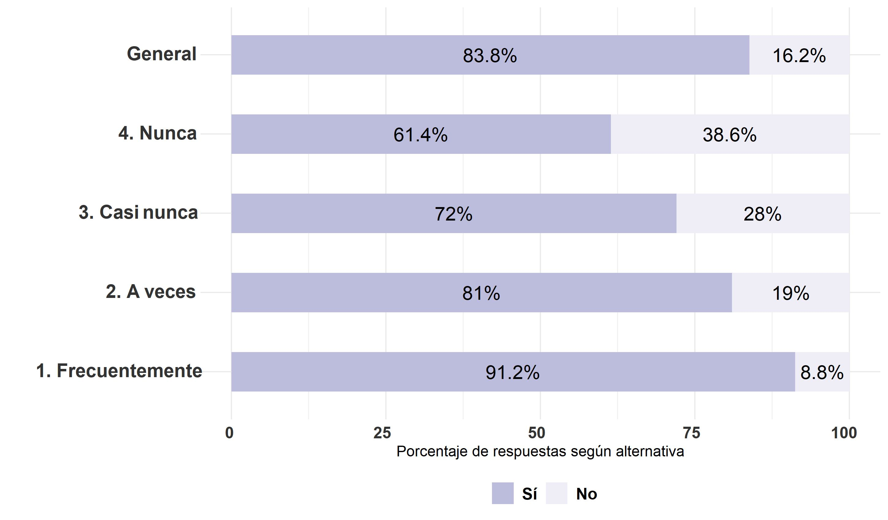

## Frecuencia de conversación con los padres sobre temas sociales y/o políticos el 2020
### Elecciones presidenciales 2017

```{r}
### variable voto_pres_17

bbdd_general0 <- data_wide %>% dplyr::select(voto_pres_17)
bbdd_general0 <- na.omit(bbdd_general0)
bbdd_general =
  bbdd_general0 %>% group_by(voto_pres_17) %>%
             summarise(n=n(), tipe="<span style='color:#FFFFFF'>e</span>General") %>%
             mutate(prop=round(n*100/sum(n),1))

bbdd_nunca0 <- data_wide %>% dplyr::select(voto_pres_17,conv_padres_20) %>% filter(conv_padres_20==1)
bbdd_nunca0 <- na.omit(bbdd_nunca0)
bbdd_nunca =
  bbdd_nunca0 %>%
              group_by(voto_pres_17) %>% #pregunta a graficar
             summarise(n=n(), tipe="<span style='color:#FFFFFF'>d</span>4. Nunca") %>%
             mutate(prop=round(n*100/sum(n),1))

bbdd_casi_nunca0 <- data_wide %>% dplyr::select(voto_pres_17,conv_padres_20) %>% filter(conv_padres_20==2)
bbdd_casi_nunca0 <- na.omit(bbdd_casi_nunca0)
bbdd_casi_nunca =
  bbdd_casi_nunca0 %>%
              group_by(voto_pres_17) %>% #pregunta a graficar
             summarise(n=n(), tipe="<span style='color:#FFFFFF'>c</span>3. Casi nunca") %>%
             mutate(prop=round(n*100/sum(n),1))

bbdd_a_veces0 <- data_wide %>% dplyr::select(voto_pres_17,conv_padres_20) %>% filter(conv_padres_20==3)
bbdd_a_veces0 <- na.omit(bbdd_a_veces0)
bbdd_a_veces =
  bbdd_a_veces0 %>%
              group_by(voto_pres_17) %>% #pregunta a graficar
             summarise(n=n(), tipe="<span style='color:#FFFFFF'>b</span>2. A veces") %>%
             mutate(prop=round(n*100/sum(n),1))

bbdd_frecuent0 <- data_wide %>% dplyr::select(voto_pres_17,conv_padres_20) %>% filter(conv_padres_20==4)
bbdd_frecuent0 <- na.omit(bbdd_frecuent0)
bbdd_frecuent =
  bbdd_frecuent0 %>% 
              group_by(voto_pres_17) %>% #pregunta a graficar
             summarise(n=n(), tipe="<span style='color:#FFFFFF'>a</span>1. Frecuentemente") %>%
             mutate(prop=round(n*100/sum(n),1))

bbdd_grafico = rbind(bbdd_general,bbdd_nunca,bbdd_casi_nunca,bbdd_a_veces,bbdd_frecuent)
bbdd_grafico<-na.omit(bbdd_grafico)

elec_17_conv_pad_3y4 <- bbdd_grafico %>% ggplot2::ggplot(aes(x=prop,y=tipe,fill=as.character(voto_pres_17))) +  geom_bar(stat="identity",width = 0.5) +
  xlab("Porcentaje de respuestas según alternativa") +
  ylab("") +
  theme_minimal() +  # Fondo blanco con lineas
   geom_text(aes(x = prop, label = paste0(prop,"%")),
                  position = position_stack(vjust = .5),color="black", size=5) +
       theme(axis.text.x = element_markdown(colour = "grey20", size = 12, hjust = 0.7, vjust = 0.5, face = "bold"),
          axis.text.y = element_markdown(colour = "grey20", size = 14, face = "bold"), 
legend.position = "bottom", # legenda abajo
         plot.title = element_markdown(face="bold"), # titulo de grafico negrita
          #legend.text= element_markdown(size = 16), #
         legend.title = element_blank(),
         #text=element_text(size=16),
          legend.text = element_text(size=12, face = "bold")) +
  guides(fill = guide_legend(reverse=TRUE)) +
     scale_fill_brewer(palette="Purples", labels = c("No", "Sí", "No tenía edad"))
  
ggsave(elec_17_conv_pad_3y4, file = "../output/graphs/elec_17_conv_pad_20.jpg",device = "jpg",width = 23,height = 13.5,dpi = "retina",units = "cm")
```


### Elecciones plebiscito constitucional 2020
```{r}
### variable voto_pleb

bbdd_general0 <- data_wide  %>% dplyr::select(voto_pleb)
bbdd_general0 <- na.omit(bbdd_general0)
bbdd_general =
  bbdd_general0 %>% group_by(voto_pleb) %>%
             summarise(n=n(), tipe="<span style='color:#FFFFFF'>e</span>General") %>%
             mutate(prop=round(n*100/sum(n),1))

bbdd_nunca0 <- data_wide  %>% dplyr::select(voto_pleb,conv_padres_20) %>% filter(conv_padres_20==1)
bbdd_nunca0 <- na.omit(bbdd_nunca0)
bbdd_nunca =
  bbdd_nunca0 %>%
              group_by(voto_pleb) %>% #pregunta a graficar
             summarise(n=n(), tipe="<span style='color:#FFFFFF'>d</span>4. Nunca") %>%
             mutate(prop=round(n*100/sum(n),1))

bbdd_casi_nunca0 <- data_wide  %>% dplyr::select(voto_pleb,conv_padres_20) %>% filter(conv_padres_20==2)
bbdd_casi_nunca0 <- na.omit(bbdd_casi_nunca0)
bbdd_casi_nunca =
  bbdd_casi_nunca0 %>% 
              group_by(voto_pleb) %>% #pregunta a graficar
             summarise(n=n(), tipe="<span style='color:#FFFFFF'>c</span>3. Casi nunca") %>%
             mutate(prop=round(n*100/sum(n),1))

bbdd_a_veces0 <- data_wide  %>% dplyr::select(voto_pleb,conv_padres_20) %>% filter(conv_padres_20==3)
bbdd_a_veces0 <- na.omit(bbdd_a_veces0)
bbdd_a_veces =
  bbdd_a_veces0 %>% 
              group_by(voto_pleb) %>% #pregunta a graficar
             summarise(n=n(), tipe="<span style='color:#FFFFFF'>b</span>2. A veces") %>%
             mutate(prop=round(n*100/sum(n),1))

bbdd_frecuent0 <- data_wide  %>% dplyr::select(voto_pleb,conv_padres_20) %>% filter(conv_padres_20==4)
bbdd_frecuent0 <- na.omit(bbdd_frecuent0)
bbdd_frecuent =
  bbdd_frecuent0 %>% 
              group_by(voto_pleb) %>% #pregunta a graficar
             summarise(n=n(), tipe="<span style='color:#FFFFFF'>a</span>1. Frecuentemente") %>%
             mutate(prop=round(n*100/sum(n),1))

bbdd_grafico = rbind(bbdd_general,bbdd_nunca,bbdd_casi_nunca,bbdd_a_veces,bbdd_frecuent)
bbdd_grafico<-na.omit(bbdd_grafico)

elec_pleb_conv_pad_3y4 <- bbdd_grafico %>% ggplot2::ggplot(aes(x=prop,y=tipe,fill=as.character(voto_pleb))) +  geom_bar(stat="identity",width = 0.5) +
  xlab("Porcentaje de respuestas según alternativa") +
  ylab("") +
  theme_minimal() +  # Fondo blanco con lineas
   geom_text(aes(x = prop, label = paste0(prop,"%")),
                  position = position_stack(vjust = .5),color="black", size=5) +
       theme(axis.text.x = element_markdown(colour = "grey20", size = 12, hjust = 0.7, vjust = 0.5, face = "bold"),
          axis.text.y = element_markdown(colour = "grey20", size = 14, face = "bold"), 
legend.position = "bottom", # legenda abajo
         plot.title = element_markdown(face="bold"), # titulo de grafico negrita
          #legend.text= element_markdown(size = 16), #
         legend.title = element_blank(),
         #text=element_text(size=16),
          legend.text = element_text(size=12, face = "bold")) +
  guides(fill = guide_legend(reverse=TRUE)) +
     scale_fill_brewer(palette="Purples", labels = c("No", "Sí", "No tenía edad"))
  
ggsave(elec_pleb_conv_pad_3y4, file = "../output/graphs/elec_pleb_conv_pad_20.jpg",device = "jpg",width = 23,height = 13.5,dpi = "retina",units = "cm")
```


### Elecciones organo constituyente 2021
```{r}
### variable voto_conv2

bbdd_general0 <- data_wide  %>% dplyr::select(voto_conv2)
bbdd_general0 <- na.omit(bbdd_general0)
bbdd_general =
  bbdd_general0 %>% group_by(voto_conv2) %>%
  summarise(n=n(), tipe="<span style='color:#FFFFFF'>e</span>General") %>%
             mutate(prop=round(n*100/sum(n),1))

bbdd_nunca0 <- data_wide  %>% dplyr::select(voto_conv2,conv_padres_20) %>% filter(conv_padres_20==1)
bbdd_nunca0 <- na.omit(bbdd_nunca0)
bbdd_nunca =
  bbdd_nunca0 %>% 
              group_by(voto_conv2) %>% #pregunta a graficar
             summarise(n=n(), tipe="<span style='color:#FFFFFF'>d</span>4. Nunca") %>%
             mutate(prop=round(n*100/sum(n),1))

bbdd_casi_nunca0 <- data_wide  %>% dplyr::select(voto_conv2,conv_padres_20) %>% filter(conv_padres_20==2)
bbdd_casi_nunca0 <- na.omit(bbdd_casi_nunca0)
bbdd_casi_nunca =
  bbdd_casi_nunca0 %>%
              group_by(voto_conv2) %>% #pregunta a graficar
             summarise(n=n(), tipe="<span style='color:#FFFFFF'>c</span>3. Casi nunca") %>%
             mutate(prop=round(n*100/sum(n),1))

bbdd_a_veces0 <- data_wide  %>% dplyr::select(voto_conv2,conv_padres_20) %>% filter(conv_padres_20==3)
bbdd_a_veces0 <- na.omit(bbdd_a_veces0)
bbdd_a_veces =
  bbdd_a_veces0 %>% 
              group_by(voto_conv2) %>% #pregunta a graficar
             summarise(n=n(), tipe="<span style='color:#FFFFFF'>b</span>2. A veces") %>%
             mutate(prop=round(n*100/sum(n),1))

bbdd_frecuent0 <- data_wide  %>% dplyr::select(voto_conv2,conv_padres_20) %>% filter(conv_padres_20==4)
bbdd_frecuent0 <- na.omit(bbdd_frecuent0)
bbdd_frecuent =
  bbdd_frecuent0 %>%
              group_by(voto_conv2) %>% #pregunta a graficar
             summarise(n=n(), tipe="<span style='color:#FFFFFF'>a</span>1. Frecuentemente") %>%
             mutate(prop=round(n*100/sum(n),1))

bbdd_grafico = rbind(bbdd_general,bbdd_nunca,bbdd_casi_nunca,bbdd_a_veces,bbdd_frecuent)
bbdd_grafico<-na.omit(bbdd_grafico)

elec_org_const_21_conv_pad_3y4 <- bbdd_grafico %>% ggplot2::ggplot(aes(x=prop,y=tipe,fill=as.character(voto_conv2))) +  geom_bar(stat="identity",width = 0.5) +
  xlab("Porcentaje de respuestas según alternativa") +
  ylab("") +
  theme_minimal() +  # Fondo blanco con lineas
   geom_text(aes(x = prop, label = paste0(prop,"%")),
                  position = position_stack(vjust = .5),color="black", size=5) +
       theme(axis.text.x = element_markdown(colour = "grey20", size = 12, hjust = 0.7, vjust = 0.5, face = "bold"),
          axis.text.y = element_markdown(colour = "grey20", size = 14, face = "bold"), 
legend.position = "bottom", # legenda abajo
         plot.title = element_markdown(face="bold"), # titulo de grafico negrita
          #legend.text= element_markdown(size = 16), #
         legend.title = element_blank(),
         #text=element_text(size=16),
          legend.text = element_text(size=12, face = "bold")) +
  guides(fill = guide_legend(reverse=TRUE)) +
     scale_fill_brewer(palette="Purples", labels = c("No", "Sí"))
  
ggsave(elec_org_const_21_conv_pad_3y4, file = "../output/graphs/elec_org_const_21_conv_pad_20.jpg",device = "jpg",width = 23,height = 13.5,dpi = "retina",units = "cm")
```

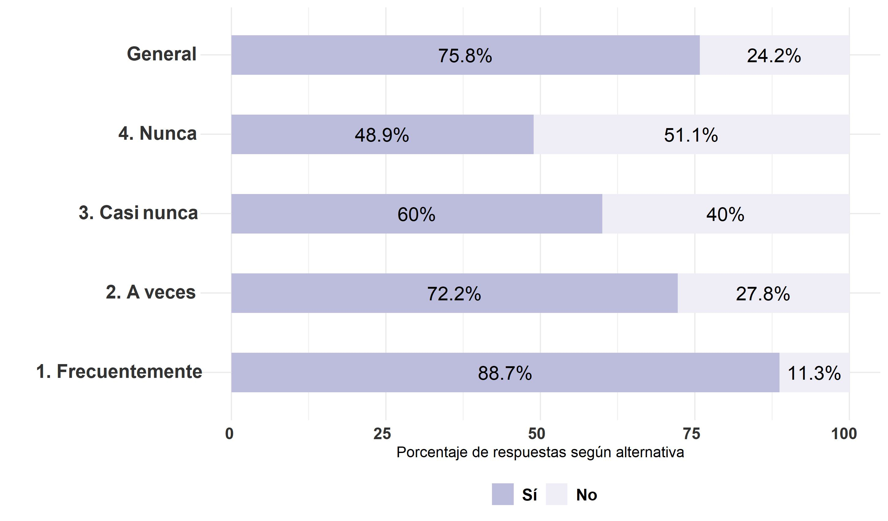

### Elecciones municipales 2021
```{r}
### variable voto_muni

bbdd_general0 <- data_wide  %>% dplyr::select(voto_muni)
bbdd_general0 <- na.omit(bbdd_general0)
bbdd_general =
  bbdd_general0 %>% group_by(voto_muni) %>%
  summarise(n=n(), tipe="<span style='color:#FFFFFF'>e</span>General") %>%
             mutate(prop=round(n*100/sum(n),1))

bbdd_nunca0 <- data_wide  %>% dplyr::select(voto_muni,conv_padres_20) %>% filter(conv_padres_20==1)
bbdd_nunca0 <- na.omit(bbdd_nunca0)
bbdd_nunca =
  bbdd_nunca0 %>% 
              group_by(voto_muni) %>% #pregunta a graficar
             summarise(n=n(), tipe="<span style='color:#FFFFFF'>d</span>4. Nunca") %>%
             mutate(prop=round(n*100/sum(n),1))

bbdd_casi_nunca0 <- data_wide  %>% dplyr::select(voto_muni,conv_padres_20) %>% filter(conv_padres_20==2)
bbdd_casi_nunca0 <- na.omit(bbdd_casi_nunca0)
bbdd_casi_nunca =
  bbdd_casi_nunca0 %>%
              group_by(voto_muni) %>% #pregunta a graficar
             summarise(n=n(), tipe="<span style='color:#FFFFFF'>c</span>3. Casi nunca") %>%
             mutate(prop=round(n*100/sum(n),1))

bbdd_a_veces0 <- data_wide  %>% dplyr::select(voto_muni,conv_padres_20) %>% filter(conv_padres_20==3)
bbdd_a_veces0 <- na.omit(bbdd_a_veces0)
bbdd_a_veces =
  bbdd_a_veces0 %>% 
              group_by(voto_muni) %>% #pregunta a graficar
             summarise(n=n(), tipe="<span style='color:#FFFFFF'>b</span>2. A veces") %>%
             mutate(prop=round(n*100/sum(n),1))

bbdd_frecuent0 <- data_wide  %>% dplyr::select(voto_muni,conv_padres_20) %>% filter(conv_padres_20==4)
bbdd_frecuent0 <- na.omit(bbdd_frecuent0)
bbdd_frecuent =
  bbdd_frecuent0 %>%
              group_by(voto_muni) %>% #pregunta a graficar
             summarise(n=n(), tipe="<span style='color:#FFFFFF'>a</span>1. Frecuentemente") %>%
             mutate(prop=round(n*100/sum(n),1))

bbdd_grafico = rbind(bbdd_general,bbdd_nunca,bbdd_casi_nunca,bbdd_a_veces,bbdd_frecuent)
bbdd_grafico<-na.omit(bbdd_grafico)

elec_muni_21_conv_pad_3y4 <- bbdd_grafico %>% ggplot2::ggplot(aes(x=prop,y=tipe,fill=as.character(voto_muni))) +  geom_bar(stat="identity",width = 0.5) +
  xlab("Porcentaje de respuestas según alternativa") +
  ylab("") +
  theme_minimal() +  # Fondo blanco con lineas
   geom_text(aes(x = prop, label = paste0(prop,"%")),
                  position = position_stack(vjust = .5),color="black", size=5) +
       theme(axis.text.x = element_markdown(colour = "grey20", size = 12, hjust = 0.7, vjust = 0.5, face = "bold"),
          axis.text.y = element_markdown(colour = "grey20", size = 14, face = "bold"), 
legend.position = "bottom", # legenda abajo
         plot.title = element_markdown(face="bold"), # titulo de grafico negrita
          #legend.text= element_markdown(size = 16), #
         legend.title = element_blank(),
         #text=element_text(size=16),
          legend.text = element_text(size=12, face = "bold")) +
  guides(fill = guide_legend(reverse=TRUE)) +
     scale_fill_brewer(palette="Purples", labels = c("No", "Sí"))
  
ggsave(elec_muni_21_conv_pad_3y4, file = "../output/graphs/elec_muni_21_conv_pad_20.jpg",device = "jpg",width = 23,height = 13.5,dpi = "retina",units = "cm")
```


### Elecciones primera vuelta 2021
```{r}
### variable voto_privuelta
### conv_padres_20

bbdd_general0 <- data_wide  %>% dplyr::select(voto_privuelta)
bbdd_general0 <- na.omit(bbdd_general0)
bbdd_general =
  bbdd_general0 %>% group_by(voto_privuelta) %>%
  summarise(n=n(), tipe="<span style='color:#FFFFFF'>e</span>General") %>%
             mutate(prop=round(n*100/sum(n),1))

bbdd_nunca0 <- data_wide  %>% dplyr::select(voto_privuelta,conv_padres_20) %>% filter(conv_padres_20==1)
bbdd_nunca0 <- na.omit(bbdd_nunca0)
bbdd_nunca =
  bbdd_nunca0 %>% 
              group_by(voto_privuelta) %>% #pregunta a graficar
             summarise(n=n(), tipe="<span style='color:#FFFFFF'>d</span>4. Nunca") %>%
             mutate(prop=round(n*100/sum(n),1))

bbdd_casi_nunca0 <- data_wide  %>% dplyr::select(voto_privuelta,conv_padres_20) %>% filter(conv_padres_20==2)
bbdd_casi_nunca0 <- na.omit(bbdd_casi_nunca0)
bbdd_casi_nunca =
  bbdd_casi_nunca0 %>%
              group_by(voto_privuelta) %>% #pregunta a graficar
             summarise(n=n(), tipe="<span style='color:#FFFFFF'>c</span>3. Casi nunca") %>%
             mutate(prop=round(n*100/sum(n),1))

bbdd_a_veces0 <- data_wide  %>% dplyr::select(voto_privuelta,conv_padres_20) %>% filter(conv_padres_20==3)
bbdd_a_veces0 <- na.omit(bbdd_a_veces0)
bbdd_a_veces =
  bbdd_a_veces0 %>% 
              group_by(voto_privuelta) %>% #pregunta a graficar
             summarise(n=n(), tipe="<span style='color:#FFFFFF'>b</span>2. A veces") %>%
             mutate(prop=round(n*100/sum(n),1))

bbdd_frecuent0 <- data_wide  %>% dplyr::select(voto_privuelta,conv_padres_20) %>% filter(conv_padres_20==4)
bbdd_frecuent0 <- na.omit(bbdd_frecuent0)
bbdd_frecuent =
  bbdd_frecuent0 %>%
              group_by(voto_privuelta) %>% #pregunta a graficar
             summarise(n=n(), tipe="<span style='color:#FFFFFF'>a</span>1. Frecuentemente") %>%
             mutate(prop=round(n*100/sum(n),1))

bbdd_grafico = rbind(bbdd_general,bbdd_nunca,bbdd_casi_nunca,bbdd_a_veces,bbdd_frecuent)
bbdd_grafico<-na.omit(bbdd_grafico)

elec_privuelta_21_conv_pad_3y4 <- bbdd_grafico %>% ggplot2::ggplot(aes(x=prop,y=tipe,fill=as.character(voto_privuelta))) +  geom_bar(stat="identity",width = 0.5) +
  xlab("Porcentaje de respuestas según alternativa") +
  ylab("") +
  theme_minimal() +  # Fondo blanco con lineas
   geom_text(aes(x = prop, label = paste0(prop,"%")),
                  position = position_stack(vjust = .5),color="black", size=5) +
       theme(axis.text.x = element_markdown(colour = "grey20", size = 12, hjust = 0.7, vjust = 0.5, face = "bold"),
          axis.text.y = element_markdown(colour = "grey20", size = 14, face = "bold"), 
legend.position = "bottom", # legenda abajo
         plot.title = element_markdown(face="bold"), # titulo de grafico negrita
          #legend.text= element_markdown(size = 16), #
         legend.title = element_blank(),
         #text=element_text(size=16),
          legend.text = element_text(size=12, face = "bold")) +
  guides(fill = guide_legend(reverse=TRUE)) +
     scale_fill_brewer(palette="Purples", labels = c("No", "Sí"))
  
ggsave(elec_privuelta_21_conv_pad_3y4, file = "../output/graphs/elec_privuelta_21_conv_pad_20.jpg",device = "jpg",width = 23,height = 13.5,dpi = "retina",units = "cm")
```

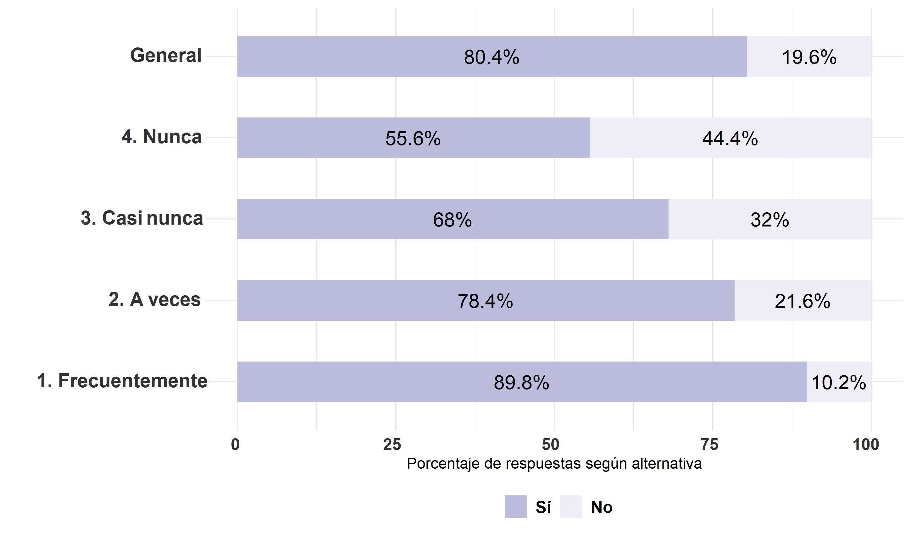

### Elecciones segunda vuelta 2021
```{r}
### variable voto_segvuelta

bbdd_general0 <- data_wide  %>% dplyr::select(voto_segvuelta)
bbdd_general0 <- na.omit(bbdd_general0)
bbdd_general =
  bbdd_general0 %>% group_by(voto_segvuelta) %>%
  summarise(n=n(), tipe="<span style='color:#FFFFFF'>e</span>General") %>%
             mutate(prop=round(n*100/sum(n),1))

bbdd_nunca0 <- data_wide  %>% dplyr::select(voto_segvuelta,conv_padres_20) %>% filter(conv_padres_20==1)
bbdd_nunca0 <- na.omit(bbdd_nunca0)
bbdd_nunca =
  bbdd_nunca0 %>% 
              group_by(voto_segvuelta) %>% #pregunta a graficar
             summarise(n=n(), tipe="<span style='color:#FFFFFF'>d</span>4. Nunca") %>%
             mutate(prop=round(n*100/sum(n),1))

bbdd_casi_nunca0 <- data_wide  %>% dplyr::select(voto_segvuelta,conv_padres_20) %>% filter(conv_padres_20==2)
bbdd_casi_nunca0 <- na.omit(bbdd_casi_nunca0)
bbdd_casi_nunca =
  bbdd_casi_nunca0 %>%
              group_by(voto_segvuelta) %>% #pregunta a graficar
             summarise(n=n(), tipe="<span style='color:#FFFFFF'>c</span>3. Casi nunca") %>%
             mutate(prop=round(n*100/sum(n),1))

bbdd_a_veces0 <- data_wide  %>% dplyr::select(voto_segvuelta,conv_padres_20) %>% filter(conv_padres_20==3)
bbdd_a_veces0 <- na.omit(bbdd_a_veces0)
bbdd_a_veces =
  bbdd_a_veces0 %>% 
              group_by(voto_segvuelta) %>% #pregunta a graficar
             summarise(n=n(), tipe="<span style='color:#FFFFFF'>b</span>2. A veces") %>%
             mutate(prop=round(n*100/sum(n),1))

bbdd_frecuent0 <- data_wide  %>% dplyr::select(voto_segvuelta,conv_padres_20) %>% filter(conv_padres_20==4)
bbdd_frecuent0 <- na.omit(bbdd_frecuent0)
bbdd_frecuent =
  bbdd_frecuent0 %>%
              group_by(voto_segvuelta) %>% #pregunta a graficar
             summarise(n=n(), tipe="<span style='color:#FFFFFF'>a</span>1. Frecuentemente") %>%
             mutate(prop=round(n*100/sum(n),1))

bbdd_grafico = rbind(bbdd_general,bbdd_nunca,bbdd_casi_nunca,bbdd_a_veces,bbdd_frecuent)
bbdd_grafico<-na.omit(bbdd_grafico)

elec_segvuelta_21_conv_pad_3y4 <- bbdd_grafico %>% ggplot2::ggplot(aes(x=prop,y=tipe,fill=as.character(voto_segvuelta))) +  geom_bar(stat="identity",width = 0.5) +
  xlab("Porcentaje de respuestas según alternativa") +
  ylab("") +
  theme_minimal() +  # Fondo blanco con lineas
   geom_text(aes(x = prop, label = paste0(prop,"%")),
                  position = position_stack(vjust = .5),color="black", size=5) +
       theme(axis.text.x = element_markdown(colour = "grey20", size = 12, hjust = 0.7, vjust = 0.5, face = "bold"),
          axis.text.y = element_markdown(colour = "grey20", size = 14, face = "bold"), 
legend.position = "bottom", # legenda abajo
         plot.title = element_markdown(face="bold"), # titulo de grafico negrita
          #legend.text= element_markdown(size = 16), #
         legend.title = element_blank(),
         #text=element_text(size=16),
          legend.text = element_text(size=12, face = "bold")) +
  guides(fill = guide_legend(reverse=TRUE)) +
     scale_fill_brewer(palette="Purples", labels = c("No", "Sí"))
  
ggsave(elec_segvuelta_21_conv_pad_3y4, file = "../output/graphs/elec_segvuelta_21_conv_pad_20.jpg",device = "jpg",width = 23,height = 13.5,dpi = "retina",units = "cm")
```

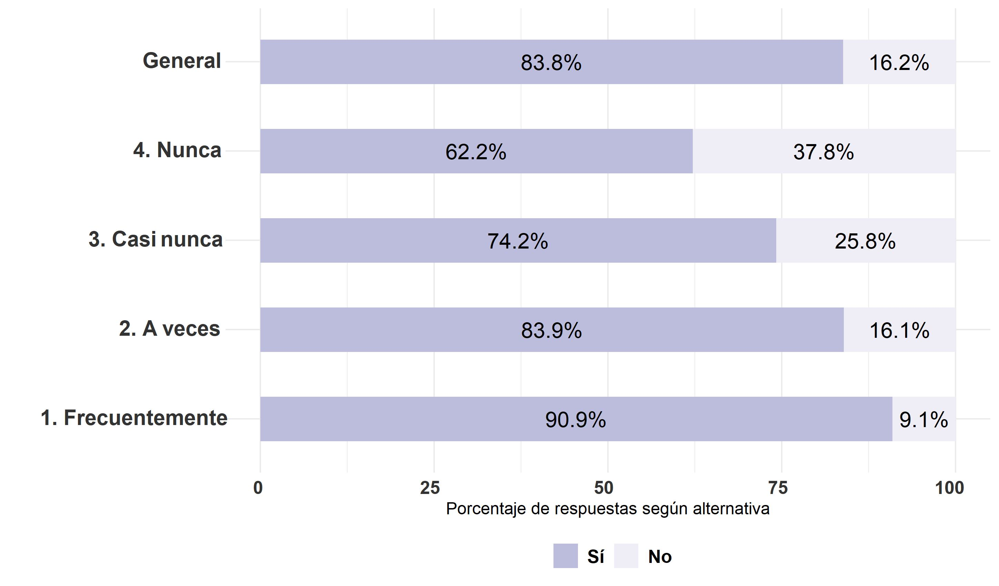

## Frecuencia de conversación con los padres sobre temas sociales y/o políticos el primer semestre del 2021
### Elecciones presidenciales 2017

```{r}
### variable voto_pres_17
bbdd_general0 <- data_wide %>% dplyr::select(voto_pres_17)
bbdd_general0 <- na.omit(bbdd_general0)
bbdd_general =
  bbdd_general0 %>% group_by(voto_pres_17) %>%
             summarise(n=n(), tipe="<span style='color:#FFFFFF'>e</span>General") %>%
             mutate(prop=round(n*100/sum(n),1))

bbdd_nunca0 <- data_wide %>% dplyr::select(voto_pres_17,conv_padres) %>% filter(conv_padres==1)
bbdd_nunca0 <- na.omit(bbdd_nunca0)
bbdd_nunca =
  bbdd_nunca0 %>%
              group_by(voto_pres_17) %>% #pregunta a graficar
             summarise(n=n(), tipe="<span style='color:#FFFFFF'>d</span>4. Nunca") %>%
             mutate(prop=round(n*100/sum(n),1))

bbdd_casi_nunca0 <- data_wide %>% dplyr::select(voto_pres_17,conv_padres) %>% filter(conv_padres==2)
bbdd_casi_nunca0 <- na.omit(bbdd_casi_nunca0)
bbdd_casi_nunca =
  bbdd_casi_nunca0 %>%
              group_by(voto_pres_17) %>% #pregunta a graficar
             summarise(n=n(), tipe="<span style='color:#FFFFFF'>c</span>3. Casi nunca") %>%
             mutate(prop=round(n*100/sum(n),1))

bbdd_a_veces0 <- data_wide %>% dplyr::select(voto_pres_17,conv_padres) %>% filter(conv_padres==3)
bbdd_a_veces0 <- na.omit(bbdd_a_veces0)
bbdd_a_veces =
  bbdd_a_veces0 %>%
              group_by(voto_pres_17) %>% #pregunta a graficar
             summarise(n=n(), tipe="<span style='color:#FFFFFF'>b</span>2. A veces") %>%
             mutate(prop=round(n*100/sum(n),1))

bbdd_frecuent0 <- data_wide %>% dplyr::select(voto_pres_17,conv_padres) %>% filter(conv_padres==4)
bbdd_frecuent0 <- na.omit(bbdd_frecuent0)
bbdd_frecuent =
  bbdd_frecuent0 %>%
              group_by(voto_pres_17) %>% #pregunta a graficar
             summarise(n=n(), tipe="<span style='color:#FFFFFF'>a</span>1. Frecuentemente") %>%
             mutate(prop=round(n*100/sum(n),1))

bbdd_grafico = rbind(bbdd_general,bbdd_nunca,bbdd_casi_nunca,bbdd_a_veces,bbdd_frecuent)
bbdd_grafico<-na.omit(bbdd_grafico)

elec_17_conv_pad_3y4 <- bbdd_grafico %>% ggplot2::ggplot(aes(x=prop,y=tipe,fill=as.character(voto_pres_17))) +  geom_bar(stat="identity",width = 0.5) +
  xlab("Porcentaje de respuestas según alternativa") +
  ylab("") +
  theme_minimal() +  # Fondo blanco con lineas
   geom_text(aes(x = prop, label = paste0(prop,"%")),
                  position = position_stack(vjust = .5),color="black", size=5) +
       theme(axis.text.x = element_markdown(colour = "grey20", size = 12, hjust = 0.7, vjust = 0.5, face = "bold"),
          axis.text.y = element_markdown(colour = "grey20", size = 14, face = "bold"), 
legend.position = "bottom", # legenda abajo
         plot.title = element_markdown(face="bold"), # titulo de grafico negrita
          #legend.text= element_markdown(size = 16), #
         legend.title = element_blank(),
         #text=element_text(size=16),
          legend.text = element_text(size=12, face = "bold")) +
  guides(fill = guide_legend(reverse=TRUE)) +
     scale_fill_brewer(palette="Purples", labels = c("No", "Sí", "No tenía edad"))
  
ggsave(elec_17_conv_pad_3y4, file = "../output/graphs/elec_17_conv_pad_21a.jpg",device = "jpg",width = 23,height = 13.5,dpi = "retina",units = "cm")
```


### Elecciones plebiscito constitucional 2020
```{r}
### variable voto_pleb

bbdd_general0 <- data_wide  %>% dplyr::select(voto_pleb)
bbdd_general0 <- na.omit(bbdd_general0)
bbdd_general =
  bbdd_general0 %>% group_by(voto_pleb) %>%
             summarise(n=n(), tipe="<span style='color:#FFFFFF'>e</span>General") %>%
             mutate(prop=round(n*100/sum(n),1))


bbdd_nunca0 <- data_wide %>% dplyr::select(voto_pleb,conv_padres) %>% filter(conv_padres==1)
bbdd_nunca0 <- na.omit(bbdd_nunca0)
bbdd_nunca =
  bbdd_nunca0 %>% 
              group_by(voto_pleb) %>% #pregunta a graficar
             summarise(n=n(), tipe="<span style='color:#FFFFFF'>d</span>4. Nunca") %>%
             mutate(prop=round(n*100/sum(n),1))

bbdd_casi_nunca0 <- data_wide %>% dplyr::select(voto_pleb,conv_padres) %>% filter(conv_padres==2)
bbdd_casi_nunca0 <- na.omit(bbdd_casi_nunca0)
bbdd_casi_nunca =
  bbdd_casi_nunca0 %>%
              group_by(voto_pleb) %>% #pregunta a graficar
             summarise(n=n(), tipe="<span style='color:#FFFFFF'>c</span>3. Casi nunca") %>%
             mutate(prop=round(n*100/sum(n),1))

bbdd_a_veces0 <- data_wide  %>% dplyr::select(voto_pleb,conv_padres) %>% filter(conv_padres==3)
bbdd_a_veces0 <- na.omit(bbdd_a_veces0)
bbdd_a_veces =
  bbdd_a_veces0 %>% 
              group_by(voto_pleb) %>% #pregunta a graficar
             summarise(n=n(), tipe="<span style='color:#FFFFFF'>b</span>2. A veces") %>%
             mutate(prop=round(n*100/sum(n),1))

bbdd_frecuent0 <- data_wide  %>% dplyr::select(voto_pleb,conv_padres) %>% filter(conv_padres==4)
bbdd_frecuent0 <- na.omit(bbdd_frecuent0)
bbdd_frecuent =
  bbdd_frecuent0 %>% 
              group_by(voto_pleb) %>% #pregunta a graficar
             summarise(n=n(), tipe="<span style='color:#FFFFFF'>a</span>1. Frecuentemente") %>%
             mutate(prop=round(n*100/sum(n),1))

bbdd_grafico = rbind(bbdd_general,bbdd_nunca,bbdd_casi_nunca,bbdd_a_veces,bbdd_frecuent)
bbdd_grafico<-na.omit(bbdd_grafico)

elec_pleb_conv_pad_3y4 <- bbdd_grafico %>% ggplot2::ggplot(aes(x=prop,y=tipe,fill=as.character(voto_pleb))) +  geom_bar(stat="identity",width = 0.5) +
  xlab("Porcentaje de respuestas según alternativa") +
  ylab("") +
  theme_minimal() +  # Fondo blanco con lineas
   geom_text(aes(x = prop, label = paste0(prop,"%")),
                  position = position_stack(vjust = .5),color="black", size=5) +
       theme(axis.text.x = element_markdown(colour = "grey20", size = 12, hjust = 0.7, vjust = 0.5, face = "bold"),
          axis.text.y = element_markdown(colour = "grey20", size = 14, face = "bold"), 
legend.position = "bottom", # legenda abajo
         plot.title = element_markdown(face="bold"), # titulo de grafico negrita
          #legend.text= element_markdown(size = 16), #
         legend.title = element_blank(),
         #text=element_text(size=16),
          legend.text = element_text(size=12, face = "bold")) +
  guides(fill = guide_legend(reverse=TRUE)) +
     scale_fill_brewer(palette="Purples", labels = c("No", "Sí", "No tenía edad"))
  
ggsave(elec_pleb_conv_pad_3y4, file = "../output/graphs/elec_pleb_conv_pad_21a.jpg",device = "jpg",width = 23,height = 13.5,dpi = "retina",units = "cm")
```

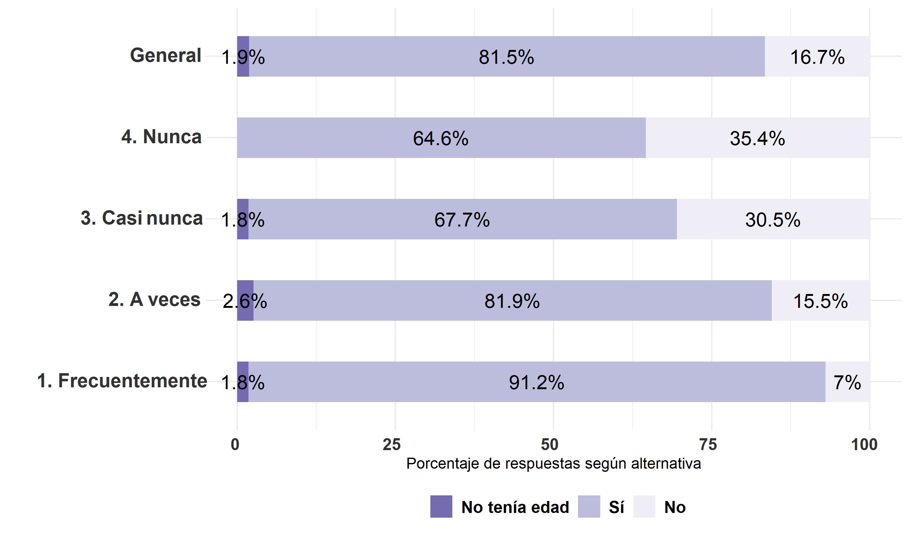

### Elecciones organo constituyente 2021
```{r}
### variable voto_conv2

bbdd_general0 <- data_wide  %>% dplyr::select(voto_conv2)
bbdd_general0 <- na.omit(bbdd_general0)
bbdd_general =
  bbdd_general0 %>% group_by(voto_conv2) %>%
  summarise(n=n(), tipe="<span style='color:#FFFFFF'>e</span>General") %>%
             mutate(prop=round(n*100/sum(n),1))

bbdd_nunca0 <- data_wide  %>% dplyr::select(voto_conv2,conv_padres) %>% filter(conv_padres==1)
bbdd_nunca0 <- na.omit(bbdd_nunca0)
bbdd_nunca =
  bbdd_nunca0 %>% 
              group_by(voto_conv2) %>% #pregunta a graficar
             summarise(n=n(), tipe="<span style='color:#FFFFFF'>d</span>4. Nunca") %>%
             mutate(prop=round(n*100/sum(n),1))

bbdd_casi_nunca0 <- data_wide  %>% dplyr::select(voto_conv2,conv_padres) %>% filter(conv_padres==2)
bbdd_casi_nunca0 <- na.omit(bbdd_casi_nunca0)
bbdd_casi_nunca =
  bbdd_casi_nunca0 %>%
              group_by(voto_conv2) %>% #pregunta a graficar
             summarise(n=n(), tipe="<span style='color:#FFFFFF'>c</span>3. Casi nunca") %>%
             mutate(prop=round(n*100/sum(n),1))

bbdd_a_veces0 <- data_wide  %>% dplyr::select(voto_conv2,conv_padres) %>% filter(conv_padres==3)
bbdd_a_veces0 <- na.omit(bbdd_a_veces0)
bbdd_a_veces =
  bbdd_a_veces0 %>% 
              group_by(voto_conv2) %>% #pregunta a graficar
             summarise(n=n(), tipe="<span style='color:#FFFFFF'>b</span>2. A veces") %>%
             mutate(prop=round(n*100/sum(n),1))

bbdd_frecuent0 <- data_wide  %>% dplyr::select(voto_conv2,conv_padres) %>% filter(conv_padres==4)
bbdd_frecuent0 <- na.omit(bbdd_frecuent0)
bbdd_frecuent =
  bbdd_frecuent0 %>%
              group_by(voto_conv2) %>% #pregunta a graficar
             summarise(n=n(), tipe="<span style='color:#FFFFFF'>a</span>1. Frecuentemente") %>%
             mutate(prop=round(n*100/sum(n),1))


bbdd_grafico = rbind(bbdd_general,bbdd_nunca,bbdd_casi_nunca,bbdd_a_veces,bbdd_frecuent)
bbdd_grafico<-na.omit(bbdd_grafico)

elec_org_const_21_conv_pad_3y4 <- bbdd_grafico %>% ggplot2::ggplot(aes(x=prop,y=tipe,fill=as.character(voto_conv2))) +  geom_bar(stat="identity",width = 0.5) +
  xlab("Porcentaje de respuestas según alternativa") +
  ylab("") +
  theme_minimal() +  # Fondo blanco con lineas
   geom_text(aes(x = prop, label = paste0(prop,"%")),
                  position = position_stack(vjust = .5),color="black", size=5) +
       theme(axis.text.x = element_markdown(colour = "grey20", size = 12, hjust = 0.7, vjust = 0.5, face = "bold"),
          axis.text.y = element_markdown(colour = "grey20", size = 14, face = "bold"), 
legend.position = "bottom", # legenda abajo
         plot.title = element_markdown(face="bold"), # titulo de grafico negrita
          #legend.text= element_markdown(size = 16), #
         legend.title = element_blank(),
         #text=element_text(size=16),
          legend.text = element_text(size=12, face = "bold")) +
  guides(fill = guide_legend(reverse=TRUE)) +
     scale_fill_brewer(palette="Purples", labels = c("No", "Sí"))
  
ggsave(elec_org_const_21_conv_pad_3y4, file = "../output/graphs/elec_org_const_21_conv_pad_21a.jpg",device = "jpg",width = 23,height = 13.5,dpi = "retina",units = "cm")
```


### Elecciones municipales 2021
```{r}
### variable voto_muni

bbdd_general0 <- data_wide  %>% dplyr::select(voto_muni)
bbdd_general0 <- na.omit(bbdd_general0)
bbdd_general =
  bbdd_general0 %>% group_by(voto_muni) %>%
  summarise(n=n(), tipe="<span style='color:#FFFFFF'>e</span>General") %>%
             mutate(prop=round(n*100/sum(n),1))

bbdd_nunca0 <- data_wide  %>% dplyr::select(voto_muni,conv_padres) %>% filter(conv_padres==1)
bbdd_nunca0 <- na.omit(bbdd_nunca0)
bbdd_nunca =
  bbdd_nunca0 %>% 
              group_by(voto_muni) %>% #pregunta a graficar
             summarise(n=n(), tipe="<span style='color:#FFFFFF'>d</span>4. Nunca") %>%
             mutate(prop=round(n*100/sum(n),1))

bbdd_casi_nunca0 <- data_wide  %>% dplyr::select(voto_muni,conv_padres) %>% filter(conv_padres==2)
bbdd_casi_nunca0 <- na.omit(bbdd_casi_nunca0)
bbdd_casi_nunca =
  bbdd_casi_nunca0 %>%
              group_by(voto_muni) %>% #pregunta a graficar
             summarise(n=n(), tipe="<span style='color:#FFFFFF'>c</span>3. Casi nunca") %>%
             mutate(prop=round(n*100/sum(n),1))

bbdd_a_veces0 <- data_wide  %>% dplyr::select(voto_muni,conv_padres) %>% filter(conv_padres==3)
bbdd_a_veces0 <- na.omit(bbdd_a_veces0)
bbdd_a_veces =
  bbdd_a_veces0 %>% 
              group_by(voto_muni) %>% #pregunta a graficar
             summarise(n=n(), tipe="<span style='color:#FFFFFF'>b</span>2. A veces") %>%
             mutate(prop=round(n*100/sum(n),1))

bbdd_frecuent0 <- data_wide  %>% dplyr::select(voto_muni,conv_padres) %>% filter(conv_padres==4)
bbdd_frecuent0 <- na.omit(bbdd_frecuent0)
bbdd_frecuent =
  bbdd_frecuent0 %>%
              group_by(voto_muni) %>% #pregunta a graficar
             summarise(n=n(), tipe="<span style='color:#FFFFFF'>a</span>1. Frecuentemente") %>%
             mutate(prop=round(n*100/sum(n),1))

bbdd_grafico = rbind(bbdd_general,bbdd_nunca,bbdd_casi_nunca,bbdd_a_veces,bbdd_frecuent)
bbdd_grafico<-na.omit(bbdd_grafico)

elec_muni_21_conv_pad_3y4 <- bbdd_grafico %>% ggplot2::ggplot(aes(x=prop,y=tipe,fill=as.character(voto_muni))) +  geom_bar(stat="identity",width = 0.5) +
  xlab("Porcentaje de respuestas según alternativa") +
  ylab("") +
  theme_minimal() +  # Fondo blanco con lineas
   geom_text(aes(x = prop, label = paste0(prop,"%")),
                  position = position_stack(vjust = .5),color="black", size=5) +
       theme(axis.text.x = element_markdown(colour = "grey20", size = 12, hjust = 0.7, vjust = 0.5, face = "bold"),
          axis.text.y = element_markdown(colour = "grey20", size = 14, face = "bold"), 
legend.position = "bottom", # legenda abajo
         plot.title = element_markdown(face="bold"), # titulo de grafico negrita
          #legend.text= element_markdown(size = 16), #
         legend.title = element_blank(),
         #text=element_text(size=16),
          legend.text = element_text(size=12, face = "bold")) +
  guides(fill = guide_legend(reverse=TRUE)) +
     scale_fill_brewer(palette="Purples", labels = c("No", "Sí"))
  
ggsave(elec_muni_21_conv_pad_3y4, file = "../output/graphs/elec_muni_21_conv_pad_21a.jpg",device = "jpg",width = 23,height = 13.5,dpi = "retina",units = "cm")
```


### Elecciones primera vuelta 2021
```{r}
### variable voto_privuelta

bbdd_general0 <- data_wide  %>% dplyr::select(voto_privuelta)
bbdd_general0 <- na.omit(bbdd_general0)
bbdd_general =
  bbdd_general0 %>% group_by(voto_privuelta) %>%
  summarise(n=n(), tipe="<span style='color:#FFFFFF'>e</span>General") %>%
             mutate(prop=round(n*100/sum(n),1))

bbdd_nunca0 <- data_wide  %>% dplyr::select(voto_privuelta,conv_padres) %>% filter(conv_padres==1)
bbdd_nunca0 <- na.omit(bbdd_nunca0)
bbdd_nunca =
  bbdd_nunca0 %>% 
              group_by(voto_privuelta) %>% #pregunta a graficar
             summarise(n=n(), tipe="<span style='color:#FFFFFF'>d</span>4. Nunca") %>%
             mutate(prop=round(n*100/sum(n),1))

bbdd_casi_nunca0 <- data_wide  %>% dplyr::select(voto_privuelta,conv_padres) %>% filter(conv_padres==2)
bbdd_casi_nunca0 <- na.omit(bbdd_casi_nunca0)
bbdd_casi_nunca =
  bbdd_casi_nunca0 %>%
              group_by(voto_privuelta) %>% #pregunta a graficar
             summarise(n=n(), tipe="<span style='color:#FFFFFF'>c</span>3. Casi nunca") %>%
             mutate(prop=round(n*100/sum(n),1))

bbdd_a_veces0 <- data_wide  %>% dplyr::select(voto_privuelta,conv_padres) %>% filter(conv_padres==3)
bbdd_a_veces0 <- na.omit(bbdd_a_veces0)
bbdd_a_veces =
  bbdd_a_veces0 %>% 
              group_by(voto_privuelta) %>% #pregunta a graficar
             summarise(n=n(), tipe="<span style='color:#FFFFFF'>b</span>2. A veces") %>%
             mutate(prop=round(n*100/sum(n),1))

bbdd_frecuent0 <- data_wide  %>% dplyr::select(voto_privuelta,conv_padres) %>% filter(conv_padres==4)
bbdd_frecuent0 <- na.omit(bbdd_frecuent0)
bbdd_frecuent =
  bbdd_frecuent0 %>%
              group_by(voto_privuelta) %>% #pregunta a graficar
             summarise(n=n(), tipe="<span style='color:#FFFFFF'>a</span>1. Frecuentemente") %>%
             mutate(prop=round(n*100/sum(n),1))

bbdd_grafico = rbind(bbdd_general,bbdd_nunca,bbdd_casi_nunca,bbdd_a_veces,bbdd_frecuent)
bbdd_grafico<-na.omit(bbdd_grafico)

elec_privuelta_21_conv_pad_3y4 <- bbdd_grafico %>% ggplot2::ggplot(aes(x=prop,y=tipe,fill=as.character(voto_privuelta))) +  geom_bar(stat="identity",width = 0.5) +
  xlab("Porcentaje de respuestas según alternativa") +
  ylab("") +
  theme_minimal() +  # Fondo blanco con lineas
   geom_text(aes(x = prop, label = paste0(prop,"%")),
                  position = position_stack(vjust = .5),color="black", size=5) +
       theme(axis.text.x = element_markdown(colour = "grey20", size = 12, hjust = 0.7, vjust = 0.5, face = "bold"),
          axis.text.y = element_markdown(colour = "grey20", size = 14, face = "bold"), 
legend.position = "bottom", # legenda abajo
         plot.title = element_markdown(face="bold"), # titulo de grafico negrita
          #legend.text= element_markdown(size = 16), #
         legend.title = element_blank(),
         #text=element_text(size=16),
          legend.text = element_text(size=12, face = "bold")) +
  guides(fill = guide_legend(reverse=TRUE)) +
     scale_fill_brewer(palette="Purples", labels = c("No", "Sí"))
  
ggsave(elec_privuelta_21_conv_pad_3y4, file = "../output/graphs/elec_privuelta_21_conv_pad_21a.jpg",device = "jpg",width = 23,height = 13.5,dpi = "retina",units = "cm")
```


### Elecciones segunda vuelta 2021
```{r}
### variable voto_segvuelta

bbdd_general0 <- data_wide  %>% dplyr::select(voto_segvuelta)
bbdd_general0 <- na.omit(bbdd_general0)
bbdd_general =
  bbdd_general0 %>% group_by(voto_segvuelta) %>%
  summarise(n=n(), tipe="<span style='color:#FFFFFF'>e</span>General") %>%
             mutate(prop=round(n*100/sum(n),1))

bbdd_nunca0 <- data_wide  %>% dplyr::select(voto_segvuelta,conv_padres) %>% filter(conv_padres==1)
bbdd_nunca0 <- na.omit(bbdd_nunca0)
bbdd_nunca =
  bbdd_nunca0 %>% 
              group_by(voto_segvuelta) %>% #pregunta a graficar
             summarise(n=n(), tipe="<span style='color:#FFFFFF'>d</span>4. Nunca") %>%
             mutate(prop=round(n*100/sum(n),1))

bbdd_casi_nunca0 <- data_wide  %>% dplyr::select(voto_segvuelta,conv_padres) %>% filter(conv_padres==2)
bbdd_casi_nunca0 <- na.omit(bbdd_casi_nunca0)
bbdd_casi_nunca =
  bbdd_casi_nunca0 %>%
              group_by(voto_segvuelta) %>% #pregunta a graficar
             summarise(n=n(), tipe="<span style='color:#FFFFFF'>c</span>3. Casi nunca") %>%
             mutate(prop=round(n*100/sum(n),1))

bbdd_a_veces0 <- data_wide  %>% dplyr::select(voto_segvuelta,conv_padres) %>% filter(conv_padres==3)
bbdd_a_veces0 <- na.omit(bbdd_a_veces0)
bbdd_a_veces =
  bbdd_a_veces0 %>% 
              group_by(voto_segvuelta) %>% #pregunta a graficar
             summarise(n=n(), tipe="<span style='color:#FFFFFF'>b</span>2. A veces") %>%
             mutate(prop=round(n*100/sum(n),1))

bbdd_frecuent0 <- data_wide  %>% dplyr::select(voto_segvuelta,conv_padres) %>% filter(conv_padres==4)
bbdd_frecuent0 <- na.omit(bbdd_frecuent0)
bbdd_frecuent =
  bbdd_frecuent0 %>%
              group_by(voto_segvuelta) %>% #pregunta a graficar
             summarise(n=n(), tipe="<span style='color:#FFFFFF'>a</span>1. Frecuentemente") %>%
             mutate(prop=round(n*100/sum(n),1))

bbdd_grafico = rbind(bbdd_general,bbdd_nunca,bbdd_casi_nunca,bbdd_a_veces,bbdd_frecuent)
bbdd_grafico<-na.omit(bbdd_grafico)

elec_segvuelta_21_conv_pad_3y4 <- bbdd_grafico %>% ggplot2::ggplot(aes(x=prop,y=tipe,fill=as.character(voto_segvuelta))) +  geom_bar(stat="identity",width = 0.5) +
  xlab("Porcentaje de respuestas según alternativa") +
  ylab("") +
  theme_minimal() +  # Fondo blanco con lineas
   geom_text(aes(x = prop, label = paste0(prop,"%")),
                  position = position_stack(vjust = .5),color="black", size=5) +
       theme(axis.text.x = element_markdown(colour = "grey20", size = 12, hjust = 0.7, vjust = 0.5, face = "bold"),
          axis.text.y = element_markdown(colour = "grey20", size = 14, face = "bold"), 
legend.position = "bottom", # legenda abajo
         plot.title = element_markdown(face="bold"), # titulo de grafico negrita
          #legend.text= element_markdown(size = 16), #
         legend.title = element_blank(),
         #text=element_text(size=16),
          legend.text = element_text(size=12, face = "bold")) +
  guides(fill = guide_legend(reverse=TRUE)) +
     scale_fill_brewer(palette="Purples", labels = c("No", "Sí"))
  
ggsave(elec_segvuelta_21_conv_pad_3y4, file = "../output/graphs/elec_segvuelta_21_conv_pad_21a.jpg",device = "jpg",width = 23,height = 13.5,dpi = "retina",units = "cm")
```


## Frecuencia de conversación con los padres sobre temas sociales y/o políticos el segundo semestre del 2021
### Elecciones presidenciales 2017
```{r}
### variable voto_pres_17

bbdd_general0 <- data_wide %>% dplyr::select(voto_pres_17)
bbdd_general0 <- na.omit(bbdd_general0)
bbdd_general =
  bbdd_general0 %>% group_by(voto_pres_17) %>%
             summarise(n=n(), tipe="<span style='color:#FFFFFF'>e</span>General") %>%
             mutate(prop=round(n*100/sum(n),1))

bbdd_nunca0 <- data_wide %>% dplyr::select(voto_pres_17,conv_padres_21b) %>% filter(conv_padres_21b==1)
bbdd_nunca0 <- na.omit(bbdd_nunca0)
bbdd_nunca =
  bbdd_nunca0 %>%
              group_by(voto_pres_17) %>% #pregunta a graficar
             summarise(n=n(), tipe="<span style='color:#FFFFFF'>d</span>4. Nunca") %>%
             mutate(prop=round(n*100/sum(n),1))

bbdd_casi_nunca0 <- data_wide %>% dplyr::select(voto_pres_17,conv_padres_21b) %>% filter(conv_padres_21b==2)
bbdd_casi_nunca0 <- na.omit(bbdd_casi_nunca0)
bbdd_casi_nunca =
  bbdd_casi_nunca0 %>% group_by(voto_pres_17) %>% #pregunta a graficar
             summarise(n=n(), tipe="<span style='color:#FFFFFF'>c</span>3. Casi nunca") %>%
             mutate(prop=round(n*100/sum(n),1))

bbdd_a_veces0 <- data_wide %>% dplyr::select(voto_pres_17,conv_padres_21b) %>% filter(conv_padres_21b==3)
bbdd_a_veces0 <- na.omit(bbdd_a_veces0)
bbdd_a_veces =
  bbdd_a_veces0 %>% group_by(voto_pres_17) %>% #pregunta a graficar
             summarise(n=n(), tipe="<span style='color:#FFFFFF'>b</span>2. A veces") %>%
             mutate(prop=round(n*100/sum(n),1))

bbdd_frecuent0 <- data_wide %>% dplyr::select(voto_pres_17,conv_padres_21b) %>% filter(conv_padres_21b==4)
bbdd_frecuent0 <- na.omit(bbdd_frecuent0)
bbdd_frecuent =
  bbdd_frecuent0 %>% group_by(voto_pres_17) %>% #pregunta a graficar
             summarise(n=n(), tipe="<span style='color:#FFFFFF'>a</span>1. Frecuentemente") %>%
             mutate(prop=round(n*100/sum(n),1))

bbdd_grafico = rbind(bbdd_general,bbdd_nunca,bbdd_casi_nunca,bbdd_a_veces,bbdd_frecuent)
bbdd_grafico<-na.omit(bbdd_grafico)

elec_17_conv_pad_3y4 <- bbdd_grafico %>% ggplot2::ggplot(aes(x=prop,y=tipe,fill=as.character(voto_pres_17))) +  geom_bar(stat="identity",width = 0.5) +
  xlab("Porcentaje de respuestas según alternativa") +
  ylab("") +
  theme_minimal() +  # Fondo blanco con lineas
   geom_text(aes(x = prop, label = paste0(prop,"%")),
                  position = position_stack(vjust = .5),color="black", size=5) +
       theme(axis.text.x = element_markdown(colour = "grey20", size = 12, hjust = 0.7, vjust = 0.5, face = "bold"),
          axis.text.y = element_markdown(colour = "grey20", size = 14, face = "bold"), 
legend.position = "bottom", # legenda abajo
         plot.title = element_markdown(face="bold"), # titulo de grafico negrita
          #legend.text= element_markdown(size = 16), #
         legend.title = element_blank(),
         #text=element_text(size=16),
          legend.text = element_text(size=12, face = "bold")) +
  guides(fill = guide_legend(reverse=TRUE)) +
     scale_fill_brewer(palette="Purples", labels = c("No", "Sí", "No tenía edad"))
  
ggsave(elec_17_conv_pad_3y4, file = "../output/graphs/elec_17_conv_pad_21b.jpg",device = "jpg",width = 23,height = 13.5,dpi = "retina",units = "cm")
```

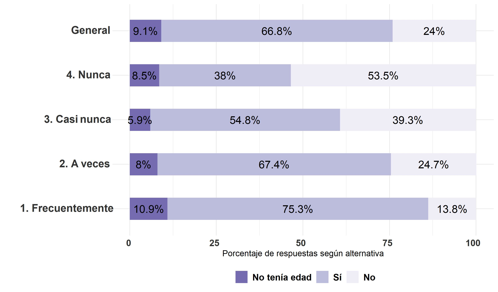

### Elecciones plebiscito constitucional 2020
```{r}
### variable voto_pleb

bbdd_general0 <- data_wide  %>% dplyr::select(voto_pleb)
bbdd_general0 <- na.omit(bbdd_general0)
bbdd_general =
  bbdd_general0 %>% group_by(voto_pleb) %>%
             summarise(n=n(), tipe="<span style='color:#FFFFFF'>e</span>General") %>%
             mutate(prop=round(n*100/sum(n),1))

bbdd_nunca0 <- data_wide  %>% dplyr::select(voto_pleb,conv_padres_21b) %>% filter(conv_padres_21b==1)
bbdd_nunca0 <- na.omit(bbdd_nunca0)
bbdd_nunca =
  bbdd_nunca0 %>%
              group_by(voto_pleb) %>% #pregunta a graficar
             summarise(n=n(), tipe="<span style='color:#FFFFFF'>d</span>4. Nunca") %>%
             mutate(prop=round(n*100/sum(n),1))

bbdd_casi_nunca0 <- data_wide  %>% dplyr::select(voto_pleb,conv_padres_21b) %>% filter(conv_padres_21b==2)
bbdd_casi_nunca0 <- na.omit(bbdd_casi_nunca0)
bbdd_casi_nunca =
  bbdd_casi_nunca0 %>% 
              group_by(voto_pleb) %>% #pregunta a graficar
             summarise(n=n(), tipe="<span style='color:#FFFFFF'>c</span>3. Casi nunca") %>%
             mutate(prop=round(n*100/sum(n),1))

bbdd_a_veces0 <- data_wide  %>% dplyr::select(voto_pleb,conv_padres_21b) %>% filter(conv_padres_21b==3)
bbdd_a_veces0 <- na.omit(bbdd_a_veces0)
bbdd_a_veces =
  bbdd_a_veces0 %>% 
              group_by(voto_pleb) %>% #pregunta a graficar
             summarise(n=n(), tipe="<span style='color:#FFFFFF'>b</span>2. A veces") %>%
             mutate(prop=round(n*100/sum(n),1))

bbdd_frecuent0 <- data_wide  %>% dplyr::select(voto_pleb,conv_padres_21b) %>% filter(conv_padres_21b==4)
bbdd_frecuent0 <- na.omit(bbdd_frecuent0)
bbdd_frecuent =
  bbdd_frecuent0 %>% 
              group_by(voto_pleb) %>% #pregunta a graficar
             summarise(n=n(), tipe="<span style='color:#FFFFFF'>a</span>1. Frecuentemente") %>%
             mutate(prop=round(n*100/sum(n),1))

bbdd_grafico = rbind(bbdd_general,bbdd_nunca,bbdd_casi_nunca,bbdd_a_veces,bbdd_frecuent)
bbdd_grafico<-na.omit(bbdd_grafico)

elec_pleb_conv_pad_3y4 <- bbdd_grafico %>% ggplot2::ggplot(aes(x=prop,y=tipe,fill=as.character(voto_pleb))) +  geom_bar(stat="identity",width = 0.5) +
  xlab("Porcentaje de respuestas según alternativa") +
  ylab("") +
  theme_minimal() +  # Fondo blanco con lineas
   geom_text(aes(x = prop, label = paste0(prop,"%")),
                  position = position_stack(vjust = .5),color="black", size=5) +
       theme(axis.text.x = element_markdown(colour = "grey20", size = 12, hjust = 0.7, vjust = 0.5, face = "bold"),
          axis.text.y = element_markdown(colour = "grey20", size = 14, face = "bold"), 
legend.position = "bottom", # legenda abajo
         plot.title = element_markdown(face="bold"), # titulo de grafico negrita
          #legend.text= element_markdown(size = 16), #
         legend.title = element_blank(),
         #text=element_text(size=16),
          legend.text = element_text(size=12, face = "bold")) +
  guides(fill = guide_legend(reverse=TRUE)) +
     scale_fill_brewer(palette="Purples", labels = c("No", "Sí", "No tenía edad"))
  
ggsave(elec_pleb_conv_pad_3y4, file = "../output/graphs/elec_pleb_conv_pad_21b.jpg",device = "jpg",width = 23,height = 13.5,dpi = "retina",units = "cm")
```


### Elecciones organo constituyente 2021
```{r}
### variable voto_conv2

bbdd_general0 <- data_wide  %>% dplyr::select(voto_conv2)
bbdd_general0 <- na.omit(bbdd_general0)
bbdd_general =
  bbdd_general0 %>% group_by(voto_conv2) %>%
  summarise(n=n(), tipe="<span style='color:#FFFFFF'>e</span>General") %>%
             mutate(prop=round(n*100/sum(n),1))

bbdd_nunca0 <- data_wide  %>% dplyr::select(voto_conv2,conv_padres_21b) %>% filter(conv_padres_21b==1)
bbdd_nunca0 <- na.omit(bbdd_nunca0)
bbdd_nunca =
  bbdd_nunca0 %>% 
              group_by(voto_conv2) %>% #pregunta a graficar
             summarise(n=n(), tipe="<span style='color:#FFFFFF'>d</span>4. Nunca") %>%
             mutate(prop=round(n*100/sum(n),1))

bbdd_casi_nunca0 <- data_wide  %>% dplyr::select(voto_conv2,conv_padres_21b) %>% filter(conv_padres_21b==2)
bbdd_casi_nunca0 <- na.omit(bbdd_casi_nunca0)
bbdd_casi_nunca =
  bbdd_casi_nunca0 %>%
              group_by(voto_conv2) %>% #pregunta a graficar
             summarise(n=n(), tipe="<span style='color:#FFFFFF'>c</span>3. Casi nunca") %>%
             mutate(prop=round(n*100/sum(n),1))

bbdd_a_veces0 <- data_wide  %>% dplyr::select(voto_conv2,conv_padres_21b) %>% filter(conv_padres_21b==3)
bbdd_a_veces0 <- na.omit(bbdd_a_veces0)
bbdd_a_veces =
  bbdd_a_veces0 %>% 
              group_by(voto_conv2) %>% #pregunta a graficar
             summarise(n=n(), tipe="<span style='color:#FFFFFF'>b</span>2. A veces") %>%
             mutate(prop=round(n*100/sum(n),1))

bbdd_frecuent0 <- data_wide  %>% dplyr::select(voto_conv2,conv_padres_21b) %>% filter(conv_padres_21b==4)
bbdd_frecuent0 <- na.omit(bbdd_frecuent0)
bbdd_frecuent =
  bbdd_frecuent0 %>%
              group_by(voto_conv2) %>% #pregunta a graficar
             summarise(n=n(), tipe="<span style='color:#FFFFFF'>a</span>1. Frecuentemente") %>%
             mutate(prop=round(n*100/sum(n),1))

bbdd_grafico = rbind(bbdd_general,bbdd_nunca,bbdd_casi_nunca,bbdd_a_veces,bbdd_frecuent)
bbdd_grafico<-na.omit(bbdd_grafico)

elec_org_const_21_conv_pad_3y4 <- bbdd_grafico %>% ggplot2::ggplot(aes(x=prop,y=tipe,fill=as.character(voto_conv2))) +  geom_bar(stat="identity",width = 0.5) +
  xlab("Porcentaje de respuestas según alternativa") +
  ylab("") +
  theme_minimal() +  # Fondo blanco con lineas
   geom_text(aes(x = prop, label = paste0(prop,"%")),
                  position = position_stack(vjust = .5),color="black", size=5) +
       theme(axis.text.x = element_markdown(colour = "grey20", size = 12, hjust = 0.7, vjust = 0.5, face = "bold"),
          axis.text.y = element_markdown(colour = "grey20", size = 14, face = "bold"), 
legend.position = "bottom", # legenda abajo
         plot.title = element_markdown(face="bold"), # titulo de grafico negrita
          #legend.text= element_markdown(size = 16), #
         legend.title = element_blank(),
         #text=element_text(size=16),
          legend.text = element_text(size=12, face = "bold")) +
  guides(fill = guide_legend(reverse=TRUE)) +
     scale_fill_brewer(palette="Purples", labels = c("No", "Sí"))
  
ggsave(elec_org_const_21_conv_pad_3y4, file = "../output/graphs/elec_org_const_21_conv_pad_21b.jpg",device = "jpg",width = 23,height = 13.5,dpi = "retina",units = "cm")
```


### Elecciones municipales 2021
```{r}
### variable voto_muni

bbdd_general0 <- data_wide  %>% dplyr::select(voto_muni)
bbdd_general0 <- na.omit(bbdd_general0)
bbdd_general =
  bbdd_general0 %>% group_by(voto_muni) %>%
  summarise(n=n(), tipe="<span style='color:#FFFFFF'>e</span>General") %>%
             mutate(prop=round(n*100/sum(n),1))

bbdd_nunca0 <- data_wide  %>% dplyr::select(voto_muni,conv_padres_21b) %>% filter(conv_padres_21b==1)
bbdd_nunca0 <- na.omit(bbdd_nunca0)
bbdd_nunca =
  bbdd_nunca0 %>% 
              group_by(voto_muni) %>% #pregunta a graficar
             summarise(n=n(), tipe="<span style='color:#FFFFFF'>d</span>4. Nunca") %>%
             mutate(prop=round(n*100/sum(n),1))

bbdd_casi_nunca0 <- data_wide  %>% dplyr::select(voto_muni,conv_padres_21b) %>% filter(conv_padres_21b==2)
bbdd_casi_nunca0 <- na.omit(bbdd_casi_nunca0)
bbdd_casi_nunca =
  bbdd_casi_nunca0 %>%
              group_by(voto_muni) %>% #pregunta a graficar
             summarise(n=n(), tipe="<span style='color:#FFFFFF'>c</span>3. Casi nunca") %>%
             mutate(prop=round(n*100/sum(n),1))

bbdd_a_veces0 <- data_wide  %>% dplyr::select(voto_muni,conv_padres_21b) %>% filter(conv_padres_21b==3)
bbdd_a_veces0 <- na.omit(bbdd_a_veces0)
bbdd_a_veces =
  bbdd_a_veces0 %>% 
              group_by(voto_muni) %>% #pregunta a graficar
             summarise(n=n(), tipe="<span style='color:#FFFFFF'>b</span>2. A veces") %>%
             mutate(prop=round(n*100/sum(n),1))

bbdd_frecuent0 <- data_wide  %>% dplyr::select(voto_muni,conv_padres_21b) %>% filter(conv_padres_21b==4)
bbdd_frecuent0 <- na.omit(bbdd_frecuent0)
bbdd_frecuent =
  bbdd_frecuent0 %>%
              group_by(voto_muni) %>% #pregunta a graficar
             summarise(n=n(), tipe="<span style='color:#FFFFFF'>a</span>1. Frecuentemente") %>%
             mutate(prop=round(n*100/sum(n),1))

bbdd_grafico = rbind(bbdd_general,bbdd_nunca,bbdd_casi_nunca,bbdd_a_veces,bbdd_frecuent)
bbdd_grafico<-na.omit(bbdd_grafico)

elec_muni_21_conv_pad_3y4 <- bbdd_grafico %>% ggplot2::ggplot(aes(x=prop,y=tipe,fill=as.character(voto_muni))) +  geom_bar(stat="identity",width = 0.5) +
  xlab("Porcentaje de respuestas según alternativa") +
  ylab("") +
  theme_minimal() +  # Fondo blanco con lineas
   geom_text(aes(x = prop, label = paste0(prop,"%")),
                  position = position_stack(vjust = .5),color="black", size=5) +
       theme(axis.text.x = element_markdown(colour = "grey20", size = 12, hjust = 0.7, vjust = 0.5, face = "bold"),
          axis.text.y = element_markdown(colour = "grey20", size = 14, face = "bold"), 
legend.position = "bottom", # legenda abajo
         plot.title = element_markdown(face="bold"), # titulo de grafico negrita
          #legend.text= element_markdown(size = 16), #
         legend.title = element_blank(),
         #text=element_text(size=16),
          legend.text = element_text(size=12, face = "bold")) +
  guides(fill = guide_legend(reverse=TRUE)) +
     scale_fill_brewer(palette="Purples", labels = c("No", "Sí"))
  
ggsave(elec_muni_21_conv_pad_3y4, file = "../output/graphs/elec_muni_21_conv_pad_21b.jpg",device = "jpg",width = 23,height = 13.5,dpi = "retina",units = "cm")
```


### Elecciones primera vuelta 2021
```{r}
### variable voto_privuelta

bbdd_general0 <- data_wide  %>% dplyr::select(voto_privuelta)
bbdd_general0 <- na.omit(bbdd_general0)
bbdd_general =
  bbdd_general0 %>% group_by(voto_privuelta) %>%
  summarise(n=n(), tipe="<span style='color:#FFFFFF'>e</span>General") %>%
             mutate(prop=round(n*100/sum(n),1))

bbdd_nunca0 <- data_wide  %>% dplyr::select(voto_privuelta,conv_padres_21b) %>% filter(conv_padres_21b==1)
bbdd_nunca0 <- na.omit(bbdd_nunca0)
bbdd_nunca =
  bbdd_nunca0 %>% 
              group_by(voto_privuelta) %>% #pregunta a graficar
             summarise(n=n(), tipe="<span style='color:#FFFFFF'>d</span>4. Nunca") %>%
             mutate(prop=round(n*100/sum(n),1))

bbdd_casi_nunca0 <- data_wide  %>% dplyr::select(voto_privuelta,conv_padres_21b) %>% filter(conv_padres_21b==2)
bbdd_casi_nunca0 <- na.omit(bbdd_casi_nunca0)
bbdd_casi_nunca =
  bbdd_casi_nunca0 %>%
              group_by(voto_privuelta) %>% #pregunta a graficar
             summarise(n=n(), tipe="<span style='color:#FFFFFF'>c</span>3. Casi nunca") %>%
             mutate(prop=round(n*100/sum(n),1))

bbdd_a_veces0 <- data_wide  %>% dplyr::select(voto_privuelta,conv_padres_21b) %>% filter(conv_padres_21b==3)
bbdd_a_veces0 <- na.omit(bbdd_a_veces0)
bbdd_a_veces =
  bbdd_a_veces0 %>% 
              group_by(voto_privuelta) %>% #pregunta a graficar
             summarise(n=n(), tipe="<span style='color:#FFFFFF'>b</span>2. A veces") %>%
             mutate(prop=round(n*100/sum(n),1))

bbdd_frecuent0 <- data_wide  %>% dplyr::select(voto_privuelta,conv_padres_21b) %>% filter(conv_padres_21b==4)
bbdd_frecuent0 <- na.omit(bbdd_frecuent0)
bbdd_frecuent =
  bbdd_frecuent0 %>%
              group_by(voto_privuelta) %>% #pregunta a graficar
             summarise(n=n(), tipe="<span style='color:#FFFFFF'>a</span>1. Frecuentemente") %>%
             mutate(prop=round(n*100/sum(n),1))

bbdd_grafico = rbind(bbdd_general,bbdd_nunca,bbdd_casi_nunca,bbdd_a_veces,bbdd_frecuent)
bbdd_grafico<-na.omit(bbdd_grafico)

elec_privuelta_21_conv_pad_3y4 <- bbdd_grafico %>% ggplot2::ggplot(aes(x=prop,y=tipe,fill=as.character(voto_privuelta))) +  geom_bar(stat="identity",width = 0.5) +
  xlab("Porcentaje de respuestas según alternativa") +
  ylab("") +
  theme_minimal() +  # Fondo blanco con lineas
   geom_text(aes(x = prop, label = paste0(prop,"%")),
                  position = position_stack(vjust = .5),color="black", size=5) +
       theme(axis.text.x = element_markdown(colour = "grey20", size = 12, hjust = 0.7, vjust = 0.5, face = "bold"),
          axis.text.y = element_markdown(colour = "grey20", size = 14, face = "bold"), 
legend.position = "bottom", # legenda abajo
         plot.title = element_markdown(face="bold"), # titulo de grafico negrita
          #legend.text= element_markdown(size = 16), #
         legend.title = element_blank(),
         #text=element_text(size=16),
          legend.text = element_text(size=12, face = "bold")) +
  guides(fill = guide_legend(reverse=TRUE)) +
     scale_fill_brewer(palette="Purples", labels = c("No", "Sí"))
  
ggsave(elec_privuelta_21_conv_pad_3y4, file = "../output/graphs/elec_privuelta_21_conv_pad_21b.jpg",device = "jpg",width = 23,height = 13.5,dpi = "retina",units = "cm")
```


### Elecciones segunda vuelta 2021
```{r}
### variable voto_segvuelta

bbdd_general0 <- data_wide  %>% dplyr::select(voto_segvuelta)
bbdd_general0 <- na.omit(bbdd_general0)
bbdd_general =
  bbdd_general0 %>% group_by(voto_segvuelta) %>%
  summarise(n=n(), tipe="<span style='color:#FFFFFF'>e</span>General") %>%
             mutate(prop=round(n*100/sum(n),1))

bbdd_nunca0 <- data_wide  %>% dplyr::select(voto_segvuelta,conv_padres_21b) %>% filter(conv_padres_21b==1)
bbdd_nunca0 <- na.omit(bbdd_nunca0)
bbdd_nunca =
  bbdd_nunca0 %>% 
              group_by(voto_segvuelta) %>% #pregunta a graficar
             summarise(n=n(), tipe="<span style='color:#FFFFFF'>d</span>4. Nunca") %>%
             mutate(prop=round(n*100/sum(n),1))

bbdd_casi_nunca0 <- data_wide  %>% dplyr::select(voto_segvuelta,conv_padres_21b) %>% filter(conv_padres_21b==2)
bbdd_casi_nunca0 <- na.omit(bbdd_casi_nunca0)
bbdd_casi_nunca =
  bbdd_casi_nunca0 %>%
              group_by(voto_segvuelta) %>% #pregunta a graficar
             summarise(n=n(), tipe="<span style='color:#FFFFFF'>c</span>3. Casi nunca") %>%
             mutate(prop=round(n*100/sum(n),1))

bbdd_a_veces0 <- data_wide  %>% dplyr::select(voto_segvuelta,conv_padres_21b) %>% filter(conv_padres_21b==3)
bbdd_a_veces0 <- na.omit(bbdd_a_veces0)
bbdd_a_veces =
  bbdd_a_veces0 %>% 
              group_by(voto_segvuelta) %>% #pregunta a graficar
             summarise(n=n(), tipe="<span style='color:#FFFFFF'>b</span>2. A veces") %>%
             mutate(prop=round(n*100/sum(n),1))

bbdd_frecuent0 <- data_wide  %>% dplyr::select(voto_segvuelta,conv_padres_21b) %>% filter(conv_padres_21b==4)
bbdd_frecuent0 <- na.omit(bbdd_frecuent0)
bbdd_frecuent =
  bbdd_frecuent0 %>%
              group_by(voto_segvuelta) %>% #pregunta a graficar
             summarise(n=n(), tipe="<span style='color:#FFFFFF'>a</span>1. Frecuentemente") %>%
             mutate(prop=round(n*100/sum(n),1))

bbdd_grafico = rbind(bbdd_general,bbdd_nunca,bbdd_casi_nunca,bbdd_a_veces,bbdd_frecuent)
bbdd_grafico<-na.omit(bbdd_grafico)

elec_segvuelta_21_conv_pad_3y4 <- bbdd_grafico %>% ggplot2::ggplot(aes(x=prop,y=tipe,fill=as.character(voto_segvuelta))) +  geom_bar(stat="identity",width = 0.5) +
  xlab("Porcentaje de respuestas según alternativa") +
  ylab("") +
  theme_minimal() +  # Fondo blanco con lineas
   geom_text(aes(x = prop, label = paste0(prop,"%")),
                  position = position_stack(vjust = .5),color="black", size=5) +
       theme(axis.text.x = element_markdown(colour = "grey20", size = 12, hjust = 0.7, vjust = 0.5, face = "bold"),
          axis.text.y = element_markdown(colour = "grey20", size = 14, face = "bold"), 
legend.position = "bottom", # legenda abajo
         plot.title = element_markdown(face="bold"), # titulo de grafico negrita
          #legend.text= element_markdown(size = 16), #
         legend.title = element_blank(),
         #text=element_text(size=16),
          legend.text = element_text(size=12, face = "bold")) +
  guides(fill = guide_legend(reverse=TRUE)) +
     scale_fill_brewer(palette="Purples", labels = c("No", "Sí"))
  
ggsave(elec_segvuelta_21_conv_pad_3y4, file = "../output/graphs/elec_segvuelta_21_conv_pad_21b.jpg",device = "jpg",width = 23,height = 13.5,dpi = "retina",units = "cm")
```

