```{r setup, include=FALSE}
knitr::opts_chunk$set(message = FALSE, warning = FALSE)
```

```{r}
pacman::p_load(sjPlot, htmltools, sjlabelled,readr, summarytools, haven, dplyr,kableExtra,readxl, ggplot2,ggtext)
```

```{r}
# BBDD
ola1<-read_dta("../input/data/proc/data_01.dta")
ola2<-read_dta("../input/data/proc/data_02.dta")
ola3<-read_dta("../input/data/proc/data_03.dta")

#data_wide <- full_join(x = ola1, #datos ola 1
#y = ola2, #datos ola 2
#by = "folio_encuestado", #identificador
#aplica sufijo a variables que se repiten entre olas
#suffix = c("_w01",
#"_w02")) %>%
#left_join(ola3,
#by = "folio_encuestado")

# n fijado a ola 3
data_wide <- left_join(x = ola3, #datos ola 3
y = ola2, #datos ola 2
by = "folio_encuestado", #identificador
#aplica sufijo a variables que se repiten entre olas
suffix = c("_w03",
"_w02")) %>%
left_join(ola1,
by = "folio_encuestado")
```

# Diversificación de los repertorios de participación
## Dependencia administrativa establecimiento
### Participación política durante 3ro y 4to medio
```{r}
# Listado de variables diversificación

#__Durante el periodo en que cursaba 3° y 4° Medio, ¿realizó algunas de las siguientes actividades (dentro o fuera del liceo)?__

#+ Participar en marchas o protestas pacíficas (part_pol_marcha_pas)

#+ Participar en marchas o protestas con disturbios (part_pol_marcha_dis)

#+ Participar en bloqueo de calles o carreteras (part_pol_bloqueo)

#+ Pintar o rayar paredes con demandas o consignas (part_pol_rayar)

#+ Participar en la toma de un edificio o institución (part_pol_toma)

#+ Trabajar como voluntario en servicios a la comunidad (part_pol_volunt)

#+ Firmar peticiones, presencialmente o por internet (part_pol_firma.y)

#+ Participar en una marcha con mis amigos (marcha_amig.y)

#+ Participar en una marcha con alguno de mis padres (marcha_pad.y)

#+ Participar en una marcha con otros miembros de mi familia (marcha_fam.y)

#__Durante el periodo en que cursaba 3° y 4° Medio, ¿con que frecuencia realizaba las siguientes actividades?__

#+ Usar internet para buscar información sobre temas sociales y/o políticos (part_pol_online)

#+ Postear imágenes o mensajes acerca de temas sociales y/o políticos en internet (part_online_post)

#+ Compartir o comentar en el posteo de otra persona acerca de temas sociales y políticos (part_online_com)

#+ Seguir a personas en redes sociales por su contenido sobre temas sociales y políticos (part_online_seg)
```

```{r}
#sjPlot::view_df(data_wide, show.frq =TRUE,show.prc =TRUE,file="codebook.html") # funciona sin encoding conectado a
```

```{r}
### Recodificar variables
#se excluye + Participar en una marcha con compañeros del colegio (s2_p_e_05_13)
data_wide$part_pol_marcha_pas_rec = ifelse(data_wide$part_pol_marcha_pas==1|data_wide$part_pol_marcha_pas==2,0,1)
data_wide$part_pol_marcha_dis_rec = ifelse(data_wide$part_pol_marcha_dis==1|data_wide$part_pol_marcha_dis==2,0,1)
data_wide$part_pol_bloqueo_rec = ifelse(data_wide$part_pol_bloqueo==1|data_wide$part_pol_bloqueo==2,0,1)
data_wide$part_pol_rayar.y_rec = ifelse(data_wide$part_pol_rayar.y==1|data_wide$part_pol_rayar.y==2,0,1)
data_wide$part_pol_toma.y_rec = ifelse(data_wide$part_pol_toma.y==1|data_wide$part_pol_toma.y==2,0,1)
data_wide$part_pol_volunt_rec = ifelse(data_wide$part_pol_volunt==1|data_wide$part_pol_volunt==2,0,1)
data_wide$part_pol_firma.y_rec = ifelse(data_wide$part_pol_firma.y==1|data_wide$part_pol_firma.y==2,0,1)
data_wide$marcha_amig.y_rec = ifelse(data_wide$marcha_amig.y==1|data_wide$marcha_amig.y==2,0,1)
data_wide$marcha_pad.y_rec = ifelse(data_wide$marcha_pad.y==1|data_wide$marcha_pad.y==2,0,1)
data_wide$marcha_fam.y_rec = ifelse(data_wide$marcha_fam.y==1|data_wide$marcha_fam.y==2,0,1)
data_wide$part_pol_online_rec = ifelse(data_wide$part_pol_online==1|data_wide$part_pol_online==2,0,1)
data_wide$part_online_post_rec = ifelse(data_wide$part_online_post==1|data_wide$part_online_post==2,0,1)
data_wide$part_online_com_rec = ifelse(data_wide$part_online_com==1|data_wide$part_online_com==2,0,1)
data_wide$part_online_seg_rec = ifelse(data_wide$part_online_seg==1|data_wide$part_online_seg==2,0,1)
```

```{r}
### Crear variable
data_wide$part_pol_3y4 = as.numeric(data_wide$part_pol_marcha_pas_rec + data_wide$part_pol_marcha_dis_rec + data_wide$part_pol_bloqueo_rec + data_wide$part_pol_rayar.y_rec + data_wide$part_pol_toma.y_rec + data_wide$part_pol_volunt_rec + data_wide$part_pol_firma.y_rec + data_wide$marcha_amig.y_rec + data_wide$marcha_pad.y_rec + data_wide$marcha_fam.y_rec + data_wide$part_pol_online_rec + data_wide$part_online_post_rec + data_wide$part_online_com_rec + data_wide$part_online_seg_rec)
#table(data_wide$part_pol_3y4)
```

```{r}
# Creación de bbdd
data_mun = data_wide %>%  filter(edm_admi==1) %>% as.data.frame() #Municipal
data_sub = data_wide %>%  filter(edm_admi==2) %>% as.data.frame() #Particular Subvencionado
data_priv = data_wide %>%  filter(edm_admi==3) %>% as.data.frame() #Particular pagado
```

```{r}
table_preposh1<- rbind(psych::describe(data_mun$part_pol_3y4, na.rm=T),
               psych::describe(data_sub$part_pol_3y4, na.rm=T),psych::describe(data_priv$part_pol_3y4, na.rm=T))
table_preposh1 <- table_preposh1 %>% select(n,mean,sd,median,trimmed,min,max)

pond1 <- stats::weighted.mean(x=data_mun$part_pol_3y4,y=data_mun$weight_w01,na.rm=TRUE)
pond2 <- stats::weighted.mean(x=data_sub$part_pol_3y4,y=data_sub$weight_w01,na.rm=TRUE)
pond3 <- stats::weighted.mean(x=data_priv$part_pol_3y4,y=data_priv$weight_w01,na.rm=TRUE)

table_preposh1[1,2]<-pond1
table_preposh1[2,2]<-pond2
table_preposh1[3,2]<-pond3

table_preposh1$dep <- c("Municipal","Particular Subvencionado","Particular Privado")

part_pol_3y4_colegio <-  ggplot(data=table_preposh1, aes(x=dep, y=mean, fill=dep)) +
     geom_bar(position = 'dodge', stat='identity')+#,width=0.8) 
     scale_fill_brewer(palette="Purples") +
     geom_text(aes(label=format(round(mean,2)), y=0), position=position_dodge(0.9), hjust=-0.25, size=6) +
     theme_bw(base_size = 14) +
     scale_y_continuous(labels = scales::comma) +
     ylab('Puntaje promedio en la diversificación de repertorios de 
participación (escala de 0 a 14)') + xlab(' ') + 
     theme(legend.position="top") +
     labs(fill = " ") +
    coord_flip()+
    theme(axis.text.x = element_text(colour = "grey20", size = 14, angle = 360, hjust = 0.5, vjust = 0.5, face = "bold"),
          axis.text.y = element_text(colour = "grey20", size = 14), 
          text = element_text(size = 14, face = "bold"),
          plot.title = element_text(hjust=0.5),
          legend.position = "none") + 
     ggtitle("Diversificación de repertorios de participación por 
tipo de dependencia administrativa de la escuela") + ylim(0,14)
#part_pol_3y4_colegio
ggsave(part_pol_3y4_colegio, file = "../output/graphs/part_pol_3y4_colegio_dep.png",device = "png",width = 23,height = 13,dpi = "retina",units = "cm")

```


### Participación política durante estallido social

```{r}
### Recodificar variables
data_wide$part_pol_firma_21_rec = ifelse(data_wide$part_pol_firma_21==1|data_wide$part_pol_firma_21==2,0,1)
data_wide$part_pol_marc_pac_21_rec = ifelse(data_wide$part_pol_marc_pac_21==1|data_wide$part_pol_marc_pac_21==2,0,1)
data_wide$part_pol_marc_dis_21_rec = ifelse(data_wide$part_pol_marc_dis_21==1|data_wide$part_pol_marc_dis_21==2,0,1)
data_wide$part_pol_bloq_21_rec = ifelse(data_wide$part_pol_bloq_21==1|data_wide$part_pol_bloq_21==2,0,1)
data_wide$part_pol_rayar_21_rec = ifelse(data_wide$part_pol_rayar_21==1|data_wide$part_pol_rayar_21==2,0,1)
data_wide$part_pol_toma_21_rec = ifelse(data_wide$part_pol_toma_21==1|data_wide$part_pol_toma_21==2,0,1)
data_wide$part_pol_com_21_rec = ifelse(data_wide$part_pol_com_21==1|data_wide$part_pol_com_21==2,0,1)
data_wide$marcha_amig_21_rec = ifelse(data_wide$marcha_amig_21==1|data_wide$marcha_amig_21==2,0,1)
data_wide$marcha_pad_21_rec = ifelse(data_wide$marcha_pad_21==1|data_wide$marcha_pad_21==2,0,1)
data_wide$marcha_fam_21_rec = ifelse(data_wide$marcha_fam_21==1|data_wide$marcha_fam_21==2,0,1)
data_wide$part_pol_online_info_21_rec = ifelse(data_wide$part_pol_online_info_21==1|data_wide$part_pol_online_info_21==2,0,1)
data_wide$part_pol_online_post_21_rec = ifelse(data_wide$part_pol_online_post_21==1|data_wide$part_pol_online_post_21==2,0,1)
data_wide$part_pol_online_com_21_rec = ifelse(data_wide$part_pol_online_com_21==1|data_wide$part_pol_online_com_21==2,0,1)
data_wide$part_pol_online_seg_21_rec = ifelse(data_wide$part_pol_online_seg_21==1|data_wide$part_pol_online_seg_21==2,0,1)
```

```{r}
### Crear variable
data_wide$part_pol_es = as.numeric(data_wide$part_pol_firma_21_rec + data_wide$part_pol_marc_pac_21_rec + data_wide$part_pol_marc_dis_21_rec + data_wide$part_pol_bloq_21_rec + data_wide$part_pol_rayar_21_rec + data_wide$part_pol_toma_21_rec + data_wide$part_pol_com_21_rec + data_wide$marcha_amig_21_rec + data_wide$marcha_pad_21_rec + data_wide$marcha_fam_21_rec + data_wide$part_pol_online_info_21_rec + data_wide$part_pol_online_post_21_rec + data_wide$part_pol_online_com_21_rec + data_wide$part_pol_online_seg_21_rec)
```

```{r}
# Creación de bbdd
data_mun = data_wide %>%  filter(edm_admi==1) %>% as.data.frame() #Municipal
data_sub = data_wide %>%  filter(edm_admi==2) %>% as.data.frame() #Particular Subvencionado
data_priv = data_wide %>%  filter(edm_admi==3) %>% as.data.frame() #Particular pagado
```

```{r}
table_preposh1<- rbind(psych::describe(data_mun$part_pol_es, na.rm=T),
               psych::describe(data_sub$part_pol_es, na.rm=T),psych::describe(data_priv$part_pol_es, na.rm=T))
table_preposh1 <- table_preposh1 %>% select(n,mean,sd,median,trimmed,min,max)

pond1 <- stats::weighted.mean(x=data_mun$part_pol_es,y=data_mun$weight_w01,na.rm=TRUE)
pond2 <- stats::weighted.mean(x=data_sub$part_pol_es,y=data_sub$weight_w01,na.rm=TRUE)
pond3 <- stats::weighted.mean(x=data_priv$part_pol_es,y=data_priv$weight_w01,na.rm=TRUE)

table_preposh1[1,2]<-pond1
table_preposh1[2,2]<-pond2
table_preposh1[3,2]<-pond3

table_preposh1$dep <- c("Municipal","Particular Subvencionado","Particular Privado")

part_pol_es_colegio <-  ggplot(data=table_preposh1, aes(x=dep, y=mean, fill=dep)) +
     geom_bar(position = 'dodge', stat='identity')+#,width=0.8) 
     scale_fill_brewer(palette="Purples") +
     geom_text(aes(label=format(round(mean,2)), y=0), position=position_dodge(0.9), hjust=-0.25, size=6) +
     theme_bw(base_size = 14) +
     scale_y_continuous(labels = scales::comma) +
     ylab('Puntaje promedio en la diversificación de repertorios de 
participación (escala de 0 a 14)') + xlab(' ') + 
     theme(legend.position="top") +
     labs(fill = " ") +
    coord_flip()+
    theme(axis.text.x = element_text(colour = "grey20", size = 14, angle = 360, hjust = 0.5, vjust = 0.5, face = "bold"),
          axis.text.y = element_text(colour = "grey20", size = 14), 
          text = element_text(size = 14, face = "bold"),
          plot.title = element_text(hjust=0.5),
          legend.position = "none") + 
     ggtitle("Diversificación de repertorios de participación por 
tipo de dependencia administrativa de la escuela") + ylim(0,14)
#part_pol_es_colegio
ggsave(part_pol_es_colegio, file = "../output/graphs/part_pol_es_colegio_dep.png",device = "png",width = 23,height = 13,dpi = "retina",units = "cm")

```


### Participación política durante el 2020

```{r}
### Recodificar variables
data_wide$part_pol_firma_20_rec = ifelse(data_wide$part_pol_firma_20==1|data_wide$part_pol_firma_20==2,0,1)
data_wide$part_pol_marc_pac_20_rec = ifelse(data_wide$part_pol_marc_pac_20==1|data_wide$part_pol_marc_pac_20==2,0,1)
data_wide$part_pol_marc_dis_20_rec = ifelse(data_wide$part_pol_marc_dis_20==1|data_wide$part_pol_marc_dis_20==2,0,1)
data_wide$part_pol_bloq_20_rec = ifelse(data_wide$part_pol_bloq_20==1|data_wide$part_pol_bloq_20==2,0,1)
data_wide$part_pol_rayar_20_rec = ifelse(data_wide$part_pol_rayar_20==1|data_wide$part_pol_rayar_20==2,0,1)
data_wide$part_pol_toma_20_rec = ifelse(data_wide$part_pol_toma_20==1|data_wide$part_pol_toma_20==2,0,1)
data_wide$part_pol_com_20_rec = ifelse(data_wide$part_pol_com_20==1|data_wide$part_pol_com_20==2,0,1)
data_wide$marcha_amig_20_rec = ifelse(data_wide$marcha_amig_20==1|data_wide$marcha_amig_20==2,0,1)
data_wide$marcha_pad_20_rec = ifelse(data_wide$marcha_pad_20==1|data_wide$marcha_pad_20==2,0,1)
data_wide$marcha_fam_20_rec = ifelse(data_wide$marcha_fam_20==1|data_wide$marcha_fam_20==2,0,1)
data_wide$part_pol_online_info_20_rec = ifelse(data_wide$part_pol_online_info_20==1|data_wide$part_pol_online_info_20==2,0,1)
data_wide$part_pol_online_post_20_rec = ifelse(data_wide$part_pol_online_post_20==1|data_wide$part_pol_online_post_20==2,0,1)
data_wide$part_pol_online_com_20_rec = ifelse(data_wide$part_pol_online_com_20==1|data_wide$part_pol_online_com_20==2,0,1)
data_wide$part_pol_online_seg_20_rec = ifelse(data_wide$part_pol_online_seg_20==1|data_wide$part_pol_online_seg_20==2,0,1)
```

```{r}
### Crear variable
data_wide$part_pol_20 = as.numeric(data_wide$part_pol_firma_20_rec + data_wide$part_pol_marc_pac_20_rec + data_wide$part_pol_marc_dis_20_rec + data_wide$part_pol_bloq_20_rec + data_wide$part_pol_rayar_20_rec + data_wide$part_pol_toma_20_rec + data_wide$part_pol_com_20_rec + data_wide$marcha_amig_20_rec + data_wide$marcha_pad_20_rec + data_wide$marcha_fam_20_rec + data_wide$part_pol_online_info_20_rec + data_wide$part_pol_online_post_20_rec + data_wide$part_pol_online_com_20_rec + data_wide$part_pol_online_seg_20_rec)
```

```{r}
# Creación de bbdd
data_mun = data_wide %>%  filter(edm_admi==1) %>% as.data.frame() #Municipal
data_sub = data_wide %>%  filter(edm_admi==2) %>% as.data.frame() #Particular Subvencionado
data_priv = data_wide %>%  filter(edm_admi==3) %>% as.data.frame() #Particular pagado
```

```{r}
table_preposh1<- rbind(psych::describe(data_mun$part_pol_20, na.rm=T),
               psych::describe(data_sub$part_pol_20, na.rm=T),psych::describe(data_priv$part_pol_20, na.rm=T))
table_preposh1 <- table_preposh1 %>% select(n,mean,sd,median,trimmed,min,max)

pond1 <- stats::weighted.mean(x=data_mun$part_pol_20,y=data_mun$weight_w01,na.rm=TRUE)
pond2 <- stats::weighted.mean(x=data_sub$part_pol_20,y=data_sub$weight_w01,na.rm=TRUE)
pond3 <- stats::weighted.mean(x=data_priv$part_pol_20,y=data_priv$weight_w01,na.rm=TRUE)

table_preposh1[1,2]<-pond1
table_preposh1[2,2]<-pond2
table_preposh1[3,2]<-pond3

table_preposh1$dep <- c("Municipal","Particular Subvencionado","Particular Privado")

part_pol_20_colegio <-  ggplot(data=table_preposh1, aes(x=dep, y=mean, fill=dep)) +
     geom_bar(position = 'dodge', stat='identity')+#,width=0.8) 
     scale_fill_brewer(palette="Purples") +
     geom_text(aes(label=format(round(mean,2)), y=0), position=position_dodge(0.9), hjust=-0.25, size=6) +
     theme_bw(base_size = 14) +
     scale_y_continuous(labels = scales::comma) +
     ylab('Puntaje promedio en la diversificación de repertorios de 
participación (escala de 0 a 14)') + xlab(' ') + 
     theme(legend.position="top") +
     labs(fill = " ") +
    coord_flip()+
    theme(axis.text.x = element_text(colour = "grey20", size = 14, angle = 360, hjust = 0.5, vjust = 0.5, face = "bold"),
          axis.text.y = element_text(colour = "grey20", size = 14), 
          text = element_text(size = 14, face = "bold"),
          plot.title = element_text(hjust=0.5),
          legend.position = "none") + 
     ggtitle("Diversificación de repertorios de participación por 
tipo de dependencia administrativa de la escuela") + ylim(0,14)
#part_pol_20_colegio
ggsave(part_pol_20_colegio, file = "../output/graphs/part_pol_20_colegio_dep.png",device = "png",width = 23,height = 13,dpi = "retina",units = "cm")
```


### Participación política durante el primer semestre de 2021

```{r,echo=FALSE}
#### Recodificar variables
data_wide$part_pol_firma.x_rec = ifelse(data_wide$part_pol_firma.x==1|data_wide$part_pol_firma.x==2,0,1)
data_wide$part_pol_marc_pac_rec = ifelse(data_wide$part_pol_marc_pac==1|data_wide$part_pol_marc_pac==2,0,1)
data_wide$part_pol_marc_dis_rec = ifelse(data_wide$part_pol_marc_dis==1|data_wide$part_pol_marc_dis==2,0,1)
data_wide$part_pol_bloq_rec = ifelse(data_wide$part_pol_bloq==1|data_wide$part_pol_bloq==2,0,1)
data_wide$part_pol_rayar.x_rec = ifelse(data_wide$part_pol_rayar.x==1|data_wide$part_pol_rayar.x==2,0,1)
data_wide$part_pol_toma.x_rec = ifelse(data_wide$part_pol_toma.x==1|data_wide$part_pol_toma.x==2,0,1)
data_wide$part_pol_com_rec = ifelse(data_wide$part_pol_com==1|data_wide$part_pol_com==2,0,1)
data_wide$marcha_amig.x_rec = ifelse(data_wide$marcha_amig.x==1|data_wide$marcha_amig.x==2,0,1)
data_wide$marcha_pad.x_rec = ifelse(data_wide$marcha_pad.x==1|data_wide$marcha_pad.x==2,0,1)
data_wide$marcha_fam.x_rec = ifelse(data_wide$marcha_fam.x==1|data_wide$marcha_fam.x==2,0,1)
data_wide$part_pol_online_info_rec = ifelse(data_wide$part_pol_online_info==1|data_wide$part_pol_online_info==2,0,1)
data_wide$part_pol_online_post_rec = ifelse(data_wide$part_pol_online_post==1|data_wide$part_pol_online_post==2,0,1)
data_wide$part_pol_online_com_rec = ifelse(data_wide$part_pol_online_com==1|data_wide$part_pol_online_com==2,0,1)
data_wide$part_pol_online_seg_rec = ifelse(data_wide$part_pol_online_seg==1|data_wide$part_pol_online_seg==2,0,1)
```

```{r}
#### Crear variable
data_wide$part_pol_21_1s = as.numeric(data_wide$part_pol_firma.x_rec + data_wide$part_pol_marc_pac_rec + data_wide$part_pol_marc_dis_rec + data_wide$part_pol_bloq_rec + data_wide$part_pol_rayar.x_rec + data_wide$part_pol_toma.x_rec + data_wide$part_pol_com_rec + data_wide$marcha_amig.x_rec + data_wide$marcha_pad.x_rec + data_wide$marcha_fam.x_rec + data_wide$part_pol_online_info_rec + data_wide$part_pol_online_post_rec + data_wide$part_pol_online_com_rec + data_wide$part_pol_online_seg_rec)
```

```{r}
# Creación de bbdd
data_mun = data_wide %>%  filter(edm_admi==1) %>% as.data.frame() #Municipal
data_sub = data_wide %>%  filter(edm_admi==2) %>% as.data.frame() #Particular Subvencionado
data_priv = data_wide %>%  filter(edm_admi==3) %>% as.data.frame() #Particular pagado
```

```{r}
table_preposh1<- rbind(psych::describe(data_mun$part_pol_21_1s, na.rm=T),
               psych::describe(data_sub$part_pol_21_1s, na.rm=T),psych::describe(data_priv$part_pol_21_1s, na.rm=T))
table_preposh1 <- table_preposh1 %>% select(n,mean,sd,median,trimmed,min,max)

pond1 <- stats::weighted.mean(x=data_mun$part_pol_21_1s,y=data_mun$weight_w02,na.rm=TRUE)
pond2 <- stats::weighted.mean(x=data_sub$part_pol_21_1s,y=data_sub$weight_w02,na.rm=TRUE)
pond3 <- stats::weighted.mean(x=data_priv$part_pol_21_1s,y=data_priv$weight_w02,na.rm=TRUE)

table_preposh1[1,2]<-pond1
table_preposh1[2,2]<-pond2
table_preposh1[3,2]<-pond3

table_preposh1$dep <- c("Municipal","Particular Subvencionado","Particular Privado")

part_pol_21_1s_colegio <-  ggplot(data=table_preposh1, aes(x=dep, y=mean, fill=dep)) +
     geom_bar(position = 'dodge', stat='identity')+#,width=0.8) 
     scale_fill_brewer(palette="Purples") +
     geom_text(aes(label=format(round(mean,2)), y=0), position=position_dodge(0.9), hjust=-0.25, size=6) +
     theme_bw(base_size = 14) +
     scale_y_continuous(labels = scales::comma) +
     ylab('Puntaje promedio en la diversificación de repertorios de 
participación (escala de 0 a 14)') + xlab(' ') + 
     theme(legend.position="top") +
     labs(fill = " ") +
    coord_flip()+
    theme(axis.text.x = element_text(colour = "grey20", size = 14, angle = 360, hjust = 0.5, vjust = 0.5, face = "bold"),
          axis.text.y = element_text(colour = "grey20", size = 14), 
          text = element_text(size = 14, face = "bold"),
          plot.title = element_text(hjust=0.5),
          legend.position = "none") + 
     ggtitle("Diversificación de repertorios de participación por 
tipo de dependencia administrativa de la escuela") + ylim(0,14)
#part_pol_21_1s_colegio
ggsave(part_pol_21_1s_colegio, file = "../output/graphs/part_pol_21_1s_colegio_dep.png",device = "png",width = 23,height = 13,dpi = "retina",units = "cm")
```


### Participación política durante el segundo semestre de 2021

```{r,echo=FALSE}
#### Recodificar variables
data_wide$part_pol_firma_21b_rec = ifelse(data_wide$part_pol_firma_21b==1|data_wide$part_pol_firma_21b==2,0,1)
data_wide$part_pol_marc_pac_21b_rec = ifelse(data_wide$part_pol_marc_pac_21b==1|data_wide$part_pol_marc_pac_21b==2,0,1)
data_wide$part_pol_marc_dis_21b_rec = ifelse(data_wide$part_pol_marc_dis_21b==1|data_wide$part_pol_marc_dis_21b==2,0,1)
data_wide$part_pol_bloq_21b_rec = ifelse(data_wide$part_pol_bloq_21b==1|data_wide$part_pol_bloq_21b==2,0,1)
data_wide$part_pol_rayar_21b_rec = ifelse(data_wide$part_pol_rayar_21b==1|data_wide$part_pol_rayar_21b==2,0,1)
data_wide$part_pol_toma_21b_rec = ifelse(data_wide$part_pol_toma_21b==1|data_wide$part_pol_toma_21b==2,0,1)
data_wide$part_pol_com_21b_rec = ifelse(data_wide$part_pol_com_21b==1|data_wide$part_pol_com_21b==2,0,1)
data_wide$marcha_amig_21b_rec = ifelse(data_wide$marcha_amig_21b==1|data_wide$marcha_amig_21b==2,0,1)
data_wide$marcha_pad_21b_rec = ifelse(data_wide$marcha_pad_21b==1|data_wide$marcha_pad_21b==2,0,1)
data_wide$marcha_fam_21b_rec = ifelse(data_wide$marcha_fam_21b==1|data_wide$marcha_fam_21b==2,0,1)
data_wide$part_pol_online_info_21b_rec = ifelse(data_wide$part_pol_online_info_21b==1|data_wide$part_pol_online_info_21b==2,0,1)
data_wide$part_pol_online_post_21b_rec = ifelse(data_wide$part_pol_online_post_21b==1|data_wide$part_pol_online_post_21b==2,0,1)
data_wide$part_pol_online_com_21b_rec = ifelse(data_wide$part_pol_online_com_21b==1|data_wide$part_pol_online_com_21b==2,0,1)
data_wide$part_pol_online_seg_21b_rec = ifelse(data_wide$part_pol_online_seg_21b==1|data_wide$part_pol_online_seg_21b==2,0,1)
```

```{r}
#### Crear variable
data_wide$part_pol_21_2s = as.numeric(data_wide$part_pol_firma_21b_rec + data_wide$part_pol_marc_pac_21b_rec + data_wide$part_pol_marc_dis_21b_rec + data_wide$part_pol_bloq_21b_rec + data_wide$part_pol_rayar_21b_rec + data_wide$part_pol_toma_21b_rec + data_wide$part_pol_com_21b_rec + data_wide$marcha_amig_21b_rec + data_wide$marcha_pad_21b_rec + data_wide$marcha_fam_21b_rec + data_wide$part_pol_online_info_21b_rec + data_wide$part_pol_online_post_21b_rec + data_wide$part_pol_online_com_21b_rec + data_wide$part_pol_online_seg_21b_rec)
```

```{r}
# Creación de bbdd
data_mun = data_wide %>%  filter(edm_admi==1) %>% as.data.frame() #Municipal
data_sub = data_wide %>%  filter(edm_admi==2) %>% as.data.frame() #Particular Subvencionado
data_priv = data_wide %>%  filter(edm_admi==3) %>% as.data.frame() #Particular pagado
```

```{r}
table_preposh1<- rbind(psych::describe(data_mun$part_pol_21_2s, na.rm=T),
               psych::describe(data_sub$part_pol_21_2s, na.rm=T),psych::describe(data_priv$part_pol_21_2s, na.rm=T))
table_preposh1 <- table_preposh1 %>% select(n,mean,sd,median,trimmed,min,max)

pond1 <- stats::weighted.mean(x=data_mun$part_pol_21_2s,y=data_mun$weight_w03,na.rm=TRUE)
pond2 <- stats::weighted.mean(x=data_sub$part_pol_21_2s,y=data_sub$weight_w03,na.rm=TRUE)
pond3 <- stats::weighted.mean(x=data_priv$part_pol_21_2s,y=data_priv$weight_w03,na.rm=TRUE)

table_preposh1[1,2]<-pond1
table_preposh1[2,2]<-pond2
table_preposh1[3,2]<-pond3

table_preposh1$dep <- c("Municipal","Particular Subvencionado","Particular Privado")

part_pol_21_2s_colegio <-  ggplot(data=table_preposh1, aes(x=dep, y=mean, fill=dep)) +
     geom_bar(position = 'dodge', stat='identity')+#,width=0.8) 
     scale_fill_brewer(palette="Purples") +
     geom_text(aes(label=format(round(mean,2)), y=0), position=position_dodge(0.9), hjust=-0.25, size=6) +
     theme_bw(base_size = 14) +
     scale_y_continuous(labels = scales::comma) +
     ylab('Puntaje promedio en la diversificación de repertorios de 
participación (escala de 0 a 14)') + xlab(' ') + 
     theme(legend.position="top") +
     labs(fill = " ") +
    coord_flip()+
    theme(axis.text.x = element_text(colour = "grey20", size = 14, angle = 360, hjust = 0.5, vjust = 0.5, face = "bold"),
          axis.text.y = element_text(colour = "grey20", size = 14), 
          text = element_text(size = 14, face = "bold"),
          plot.title = element_text(hjust=0.5),
          legend.position = "none") + 
     ggtitle("Diversificación de repertorios de participación por 
tipo de dependencia administrativa de la escuela") + ylim(0,14)
#part_pol_21_2s_colegio
ggsave(part_pol_21_2s_colegio, file = "../output/graphs/part_pol_21_2s_colegio_dep.png",device = "png",width = 23,height = 13,dpi = "retina",units = "cm")
```
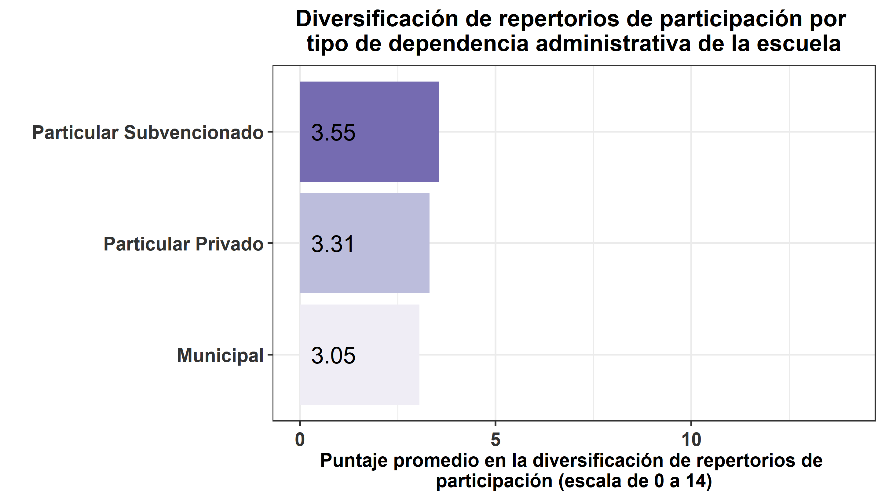


## Máximo nivel educativo de la madre
### Participación política durante 3ro y 4to medio
```{r}
### Recodificar variables
#se excluye + Participar en una marcha con compañeros del colegio (s2_p_e_05_13)
data_wide$part_pol_marcha_pas_rec = ifelse(data_wide$part_pol_marcha_pas==1|data_wide$part_pol_marcha_pas==2,0,1)
data_wide$part_pol_marcha_dis_rec = ifelse(data_wide$part_pol_marcha_dis==1|data_wide$part_pol_marcha_dis==2,0,1)
data_wide$part_pol_bloqueo_rec = ifelse(data_wide$part_pol_bloqueo==1|data_wide$part_pol_bloqueo==2,0,1)
data_wide$part_pol_rayar.y_rec = ifelse(data_wide$part_pol_rayar.y==1|data_wide$part_pol_rayar.y==2,0,1)
data_wide$part_pol_toma.y_rec = ifelse(data_wide$part_pol_toma.y==1|data_wide$part_pol_toma.y==2,0,1)
data_wide$part_pol_volunt_rec = ifelse(data_wide$part_pol_volunt==1|data_wide$part_pol_volunt==2,0,1)
data_wide$part_pol_firma.y_rec = ifelse(data_wide$part_pol_firma.y==1|data_wide$part_pol_firma.y==2,0,1)
data_wide$marcha_amig.y_rec = ifelse(data_wide$marcha_amig.y==1|data_wide$marcha_amig.y==2,0,1)
data_wide$marcha_pad.y_rec = ifelse(data_wide$marcha_pad.y==1|data_wide$marcha_pad.y==2,0,1)
data_wide$marcha_fam.y_rec = ifelse(data_wide$marcha_fam.y==1|data_wide$marcha_fam.y==2,0,1)
data_wide$part_pol_online_rec = ifelse(data_wide$part_pol_online==1|data_wide$part_pol_online==2,0,1)
data_wide$part_online_post_rec = ifelse(data_wide$part_online_post==1|data_wide$part_online_post==2,0,1)
data_wide$part_online_com_rec = ifelse(data_wide$part_online_com==1|data_wide$part_online_com==2,0,1)
data_wide$part_online_seg_rec = ifelse(data_wide$part_online_seg==1|data_wide$part_online_seg==2,0,1)
```

```{r}
### Crear variable
data_wide$part_pol_3y4 = as.numeric(data_wide$part_pol_marcha_pas_rec + data_wide$part_pol_marcha_dis_rec + data_wide$part_pol_bloqueo_rec + data_wide$part_pol_rayar.y_rec + data_wide$part_pol_toma.y_rec + data_wide$part_pol_volunt_rec + data_wide$part_pol_firma.y_rec + data_wide$marcha_amig.y_rec + data_wide$marcha_pad.y_rec + data_wide$marcha_fam.y_rec + data_wide$part_pol_online_rec + data_wide$part_online_post_rec + data_wide$part_online_com_rec + data_wide$part_online_seg_rec)
```

```{r}
# Creación de bbdd
data_ed_bas = data_wide %>%  filter(nse_madre==1 | nse_madre==2 | nse_madre==3 | nse_madre==4) %>% as.data.frame() # Sin Ed. (1), Ed. básica incompleta (2) o completa (3)
data_ed_med = data_wide %>%  filter(nse_madre==4 | nse_madre==5) %>% as.data.frame() # Ed. media incompleta (4) o completa (5)
data_ed_ter = data_wide %>%  filter(nse_madre==6 | nse_madre==7 | nse_madre==8 | nse_madre==9 | nse_madre==10) %>% as.data.frame() # técnico superior incompleto (6) o completo (7) Universitaria incompleta (8) o completa (9), Estudios de postgrado (magíster o doctorado) (10)

#data_ed_tec = data_wide %>%  filter(nse_madre==6 | nse_madre==7) %>% as.data.frame() # técnico superior incompleto (6) o completo (7)
#data_ed_uni = data_wide %>%  filter(nse_madre==8 | nse_madre==9 | nse_madre==10) %>% as.data.frame() # Universitaria incompleta (8) o completa (9), Estudios de postgrado (magíster o doctorado) (10)
```

```{r}
table_preposh1<- rbind(psych::describe(data_ed_bas$part_pol_3y4, na.rm=T),
               psych::describe(data_ed_med$part_pol_3y4, na.rm=T),
               psych::describe(data_ed_ter$part_pol_3y4, na.rm=T))#,
#               psych::describe(data_ed_uni$part_pol_3y4, na.rm=T))
table_preposh1 <- table_preposh1 %>% select(n,mean,sd,median,trimmed,min,max)

pond1 <- stats::weighted.mean(x=data_ed_bas$part_pol_3y4,y=data_mun$weight_w01,na.rm=TRUE)
pond2 <- stats::weighted.mean(x=data_ed_med$part_pol_3y4,y=data_ed_med$weight_w01,na.rm=TRUE)
pond3 <- stats::weighted.mean(x=data_ed_ter$part_pol_3y4,y=data_ed_tec$weight_w01,na.rm=TRUE)
#pond3 <- stats::weighted.mean(x=data_ed_tec$part_pol_3y4,y=data_ed_tec$weight_w01,na.rm=TRUE)
#pond4 <- stats::weighted.mean(x=data_ed_uni$part_pol_3y4,y=data_ed_uni$weight_w01,na.rm=TRUE)

table_preposh1[1,2]<-pond1
table_preposh1[2,2]<-pond2
table_preposh1[3,2]<-pond3
#table_preposh1[4,2]<-pond4

#table_preposh1$dep <- c("Ed. básica o menos","Ed. media","Técnico superior", "Universitaria o más")
table_preposh1$dep <- c("Ed. básica o menos","Ed. media","Ed. terciaria")

part_pol_3y4_colegio <-  ggplot(data=table_preposh1, aes(x=dep, y=mean, fill=dep)) +
     geom_bar(position = 'dodge', stat='identity')+#,width=0.8) 
     scale_fill_brewer(palette="Purples") +
     geom_text(aes(label=format(round(mean,2)), y=0), position=position_dodge(0.9), hjust=-0.25, size=6) +
     theme_bw(base_size = 14) +
     scale_y_continuous(labels = scales::comma) +
     ylab('Puntaje promedio en la diversificación de repertorios de 
participación (escala de 0 a 14)') + xlab(' ') + 
     theme(legend.position="top") +
     labs(fill = " ") +
    coord_flip()+
    theme(axis.text.x = element_text(colour = "grey20", size = 14, angle = 360, hjust = 0.5, vjust = 0.5, face = "bold"),
          axis.text.y = element_text(colour = "grey20", size = 14), 
          text = element_text(size = 14, face = "bold"),
          plot.title = element_text(hjust=0.5),
          legend.position = "none") + 
     ggtitle("Diversificación de repertorios de participación por 
nivel educativo de la madre") + ylim(0,14)
#part_pol_3y4_colegio
ggsave(part_pol_3y4_colegio, file = "../output/graphs/part_pol_3y4_colegio_ed_madre.png",device = "png",width = 23,height = 13,dpi = "retina",units = "cm")

```

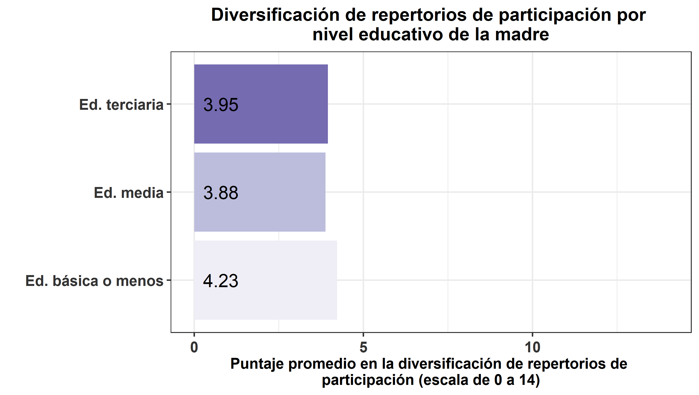

### Participación política durante estallido social

```{r}
### Recodificar variables
data_wide$part_pol_firma_21_rec = ifelse(data_wide$part_pol_firma_21==1|data_wide$part_pol_firma_21==2,0,1)
data_wide$part_pol_marc_pac_21_rec = ifelse(data_wide$part_pol_marc_pac_21==1|data_wide$part_pol_marc_pac_21==2,0,1)
data_wide$part_pol_marc_dis_21_rec = ifelse(data_wide$part_pol_marc_dis_21==1|data_wide$part_pol_marc_dis_21==2,0,1)
data_wide$part_pol_bloq_21_rec = ifelse(data_wide$part_pol_bloq_21==1|data_wide$part_pol_bloq_21==2,0,1)
data_wide$part_pol_rayar_21_rec = ifelse(data_wide$part_pol_rayar_21==1|data_wide$part_pol_rayar_21==2,0,1)
data_wide$part_pol_toma_21_rec = ifelse(data_wide$part_pol_toma_21==1|data_wide$part_pol_toma_21==2,0,1)
data_wide$part_pol_com_21_rec = ifelse(data_wide$part_pol_com_21==1|data_wide$part_pol_com_21==2,0,1)
data_wide$marcha_amig_21_rec = ifelse(data_wide$marcha_amig_21==1|data_wide$marcha_amig_21==2,0,1)
data_wide$marcha_pad_21_rec = ifelse(data_wide$marcha_pad_21==1|data_wide$marcha_pad_21==2,0,1)
data_wide$marcha_fam_21_rec = ifelse(data_wide$marcha_fam_21==1|data_wide$marcha_fam_21==2,0,1)
data_wide$part_pol_online_info_21_rec = ifelse(data_wide$part_pol_online_info_21==1|data_wide$part_pol_online_info_21==2,0,1)
data_wide$part_pol_online_post_21_rec = ifelse(data_wide$part_pol_online_post_21==1|data_wide$part_pol_online_post_21==2,0,1)
data_wide$part_pol_online_com_21_rec = ifelse(data_wide$part_pol_online_com_21==1|data_wide$part_pol_online_com_21==2,0,1)
data_wide$part_pol_online_seg_21_rec = ifelse(data_wide$part_pol_online_seg_21==1|data_wide$part_pol_online_seg_21==2,0,1)
```

```{r}
### Crear variable
data_wide$part_pol_es = as.numeric(data_wide$part_pol_firma_21_rec + data_wide$part_pol_marc_pac_21_rec + data_wide$part_pol_marc_dis_21_rec + data_wide$part_pol_bloq_21_rec + data_wide$part_pol_rayar_21_rec + data_wide$part_pol_toma_21_rec + data_wide$part_pol_com_21_rec + data_wide$marcha_amig_21_rec + data_wide$marcha_pad_21_rec + data_wide$marcha_fam_21_rec + data_wide$part_pol_online_info_21_rec + data_wide$part_pol_online_post_21_rec + data_wide$part_pol_online_com_21_rec + data_wide$part_pol_online_seg_21_rec)
```

```{r}
# Creación de bbdd
data_ed_bas = data_wide %>%  filter(nse_madre==1 | nse_madre==2 | nse_madre==3 | nse_madre==4) %>% as.data.frame() # Sin Ed. (1), Ed. básica incompleta (2) o completa (3)
data_ed_med = data_wide %>%  filter(nse_madre==4 | nse_madre==5) %>% as.data.frame() # Ed. media incompleta (4) o completa (5)
data_ed_ter = data_wide %>%  filter(nse_madre==6 | nse_madre==7 | nse_madre==8 | nse_madre==9 | nse_madre==10) %>% as.data.frame() # técnico superior incompleto (6) o completo (7) Universitaria incompleta (8) o completa (9), Estudios de postgrado (magíster o doctorado) (10)

#data_ed_tec = data_wide %>%  filter(nse_madre==6 | nse_madre==7) %>% as.data.frame() # técnico superior incompleto (6) o completo (7)
#data_ed_uni = data_wide %>%  filter(nse_madre==8 | nse_madre==9 | nse_madre==10) %>% as.data.frame() # Universitaria incompleta (8) o completa (9), Estudios de postgrado (magíster o doctorado) (10)
```

```{r}
table_preposh1<- rbind(psych::describe(data_ed_bas$part_pol_es, na.rm=T),
               psych::describe(data_ed_med$part_pol_es, na.rm=T),
               psych::describe(data_ed_ter$part_pol_es, na.rm=T))#,
#               psych::describe(data_ed_uni$part_pol_es, na.rm=T))
table_preposh1 <- table_preposh1 %>% select(n,mean,sd,median,trimmed,min,max)

pond1 <- stats::weighted.mean(x=data_ed_bas$part_pol_es,y=data_mun$weight_w01,na.rm=TRUE)
pond2 <- stats::weighted.mean(x=data_ed_med$part_pol_es,y=data_ed_med$weight_w01,na.rm=TRUE)
pond3 <- stats::weighted.mean(x=data_ed_ter$part_pol_es,y=data_ed_ter$weight_w01,na.rm=TRUE)
#pond3 <- stats::weighted.mean(x=data_ed_tec$part_pol_es,y=data_ed_tec$weight_w01,na.rm=TRUE)
#pond4 <- stats::weighted.mean(x=data_ed_uni$part_pol_es,y=data_ed_uni$weight_w01,na.rm=TRUE)

table_preposh1[1,2]<-pond1
table_preposh1[2,2]<-pond2
table_preposh1[3,2]<-pond3
#table_preposh1[4,2]<-pond4

#table_preposh1$dep <- c("Ed. básica o menos","Ed. media","Técnico superior", "Universitaria o más")
table_preposh1$dep <- c("Ed. básica o menos","Ed. media","Ed. terciaria")

part_pol_es_colegio <-  ggplot(data=table_preposh1, aes(x=dep, y=mean, fill=dep)) +
     geom_bar(position = 'dodge', stat='identity')+#,width=0.8) 
     scale_fill_brewer(palette="Purples") +
     geom_text(aes(label=format(round(mean,2)), y=0), position=position_dodge(0.9), hjust=-0.25, size=6) +
     theme_bw(base_size = 14) +
     scale_y_continuous(labels = scales::comma) +
     ylab('Puntaje promedio en la diversificación de repertorios de 
participación (escala de 0 a 14)') + xlab(' ') + 
     theme(legend.position="top") +
     labs(fill = " ") +
    coord_flip()+
    theme(axis.text.x = element_text(colour = "grey20", size = 14, angle = 360, hjust = 0.5, vjust = 0.5, face = "bold"),
          axis.text.y = element_text(colour = "grey20", size = 14), 
          text = element_text(size = 14, face = "bold"),
          plot.title = element_text(hjust=0.5),
          legend.position = "none") + 
     ggtitle("Diversificación de repertorios de participación por 
nivel educativo de la madre") + ylim(0,14)
#part_pol_es_colegio
ggsave(part_pol_es_colegio, file = "../output/graphs/part_pol_es_colegio_ed_madre.png",device = "png",width = 23,height = 13,dpi = "retina",units = "cm")

```


### Participación política durante el 2020

```{r}
### Recodificar variables
data_wide$part_pol_firma_20_rec = ifelse(data_wide$part_pol_firma_20==1|data_wide$part_pol_firma_20==2,0,1)
data_wide$part_pol_marc_pac_20_rec = ifelse(data_wide$part_pol_marc_pac_20==1|data_wide$part_pol_marc_pac_20==2,0,1)
data_wide$part_pol_marc_dis_20_rec = ifelse(data_wide$part_pol_marc_dis_20==1|data_wide$part_pol_marc_dis_20==2,0,1)
data_wide$part_pol_bloq_20_rec = ifelse(data_wide$part_pol_bloq_20==1|data_wide$part_pol_bloq_20==2,0,1)
data_wide$part_pol_rayar_20_rec = ifelse(data_wide$part_pol_rayar_20==1|data_wide$part_pol_rayar_20==2,0,1)
data_wide$part_pol_toma_20_rec = ifelse(data_wide$part_pol_toma_20==1|data_wide$part_pol_toma_20==2,0,1)
data_wide$part_pol_com_20_rec = ifelse(data_wide$part_pol_com_20==1|data_wide$part_pol_com_20==2,0,1)
data_wide$marcha_amig_20_rec = ifelse(data_wide$marcha_amig_20==1|data_wide$marcha_amig_20==2,0,1)
data_wide$marcha_pad_20_rec = ifelse(data_wide$marcha_pad_20==1|data_wide$marcha_pad_20==2,0,1)
data_wide$marcha_fam_20_rec = ifelse(data_wide$marcha_fam_20==1|data_wide$marcha_fam_20==2,0,1)
data_wide$part_pol_online_info_20_rec = ifelse(data_wide$part_pol_online_info_20==1|data_wide$part_pol_online_info_20==2,0,1)
data_wide$part_pol_online_post_20_rec = ifelse(data_wide$part_pol_online_post_20==1|data_wide$part_pol_online_post_20==2,0,1)
data_wide$part_pol_online_com_20_rec = ifelse(data_wide$part_pol_online_com_20==1|data_wide$part_pol_online_com_20==2,0,1)
data_wide$part_pol_online_seg_20_rec = ifelse(data_wide$part_pol_online_seg_20==1|data_wide$part_pol_online_seg_20==2,0,1)
```

```{r}
### Crear variable
data_wide$part_pol_20 = as.numeric(data_wide$part_pol_firma_20_rec + data_wide$part_pol_marc_pac_20_rec + data_wide$part_pol_marc_dis_20_rec + data_wide$part_pol_bloq_20_rec + data_wide$part_pol_rayar_20_rec + data_wide$part_pol_toma_20_rec + data_wide$part_pol_com_20_rec + data_wide$marcha_amig_20_rec + data_wide$marcha_pad_20_rec + data_wide$marcha_fam_20_rec + data_wide$part_pol_online_info_20_rec + data_wide$part_pol_online_post_20_rec + data_wide$part_pol_online_com_20_rec + data_wide$part_pol_online_seg_20_rec)
```

```{r}
# Creación de bbdd
data_ed_bas = data_wide %>%  filter(nse_madre==1 | nse_madre==2 | nse_madre==3 | nse_madre==4) %>% as.data.frame() # Sin Ed. (1), Ed. básica incompleta (2) o completa (3)
data_ed_med = data_wide %>%  filter(nse_madre==4 | nse_madre==5) %>% as.data.frame() # Ed. media incompleta (4) o completa (5)
data_ed_ter = data_wide %>%  filter(nse_madre==6 | nse_madre==7 | nse_madre==8 | nse_madre==9 | nse_madre==10) %>% as.data.frame() # técnico superior incompleto (6) o completo (7) Universitaria incompleta (8) o completa (9), Estudios de postgrado (magíster o doctorado) (10)

#data_ed_tec = data_wide %>%  filter(nse_madre==6 | nse_madre==7) %>% as.data.frame() # técnico superior incompleto (6) o completo (7)
#data_ed_uni = data_wide %>%  filter(nse_madre==8 | nse_madre==9 | nse_madre==10) %>% as.data.frame() # Universitaria incompleta (8) o completa (9), Estudios de postgrado (magíster o doctorado) (10)
```

```{r}
table_preposh1<- rbind(psych::describe(data_ed_bas$part_pol_20, na.rm=T),
               psych::describe(data_ed_med$part_pol_20, na.rm=T),
               psych::describe(data_ed_ter$part_pol_20, na.rm=T))#,
#               psych::describe(data_ed_uni$part_pol_20, na.rm=T))
table_preposh1 <- table_preposh1 %>% select(n,mean,sd,median,trimmed,min,max)

pond1 <- stats::weighted.mean(x=data_ed_bas$part_pol_20,y=data_mun$weight_w01,na.rm=TRUE)
pond2 <- stats::weighted.mean(x=data_ed_med$part_pol_20,y=data_ed_med$weight_w01,na.rm=TRUE)
pond3 <- stats::weighted.mean(x=data_ed_ter$part_pol_20,y=data_ed_ter$weight_w01,na.rm=TRUE)
#pond3 <- stats::weighted.mean(x=data_ed_tec$part_pol_20,y=data_ed_tec$weight_w01,na.rm=TRUE)
#pond4 <- stats::weighted.mean(x=data_ed_uni$part_pol_20,y=data_ed_uni$weight_w01,na.rm=TRUE)

table_preposh1[1,2]<-pond1
table_preposh1[2,2]<-pond2
table_preposh1[3,2]<-pond3
#table_preposh1[4,2]<-pond4

#table_preposh1$dep <- c("Ed. básica o menos","Ed. media","Técnico superior", "Universitaria o más")
table_preposh1$dep <- c("Ed. básica o menos","Ed. media","Ed. terciaria")

part_pol_20_colegio <-  ggplot(data=table_preposh1, aes(x=dep, y=mean, fill=dep)) +
     geom_bar(position = 'dodge', stat='identity')+#,width=0.8) 
     scale_fill_brewer(palette="Purples") +
     geom_text(aes(label=format(round(mean,2)), y=0), position=position_dodge(0.9), hjust=-0.25, size=6) +
     theme_bw(base_size = 14) +
     scale_y_continuous(labels = scales::comma) +
     ylab('Puntaje promedio en la diversificación de repertorios de 
participación (escala de 0 a 14)') + xlab(' ') + 
     theme(legend.position="top") +
     labs(fill = " ") +
    coord_flip()+
    theme(axis.text.x = element_text(colour = "grey20", size = 14, angle = 360, hjust = 0.5, vjust = 0.5, face = "bold"),
          axis.text.y = element_text(colour = "grey20", size = 14), 
          text = element_text(size = 14, face = "bold"),
          plot.title = element_text(hjust=0.5),
          legend.position = "none") + 
     ggtitle("Diversificación de repertorios de participación por 
nivel educativo de la madre") + ylim(0,14)
#part_pol_20_colegio
ggsave(part_pol_20_colegio, file = "../output/graphs/part_pol_20_colegio_ed_madre.png",device = "png",width = 23,height = 13,dpi = "retina",units = "cm")
```


### Participación política durante el primer semestre de 2021

```{r,echo=FALSE}
#### Recodificar variables
data_wide$part_pol_firma.x_rec = ifelse(data_wide$part_pol_firma.x==1|data_wide$part_pol_firma.x==2,0,1)
data_wide$part_pol_marc_pac_rec = ifelse(data_wide$part_pol_marc_pac==1|data_wide$part_pol_marc_pac==2,0,1)
data_wide$part_pol_marc_dis_rec = ifelse(data_wide$part_pol_marc_dis==1|data_wide$part_pol_marc_dis==2,0,1)
data_wide$part_pol_bloq_rec = ifelse(data_wide$part_pol_bloq==1|data_wide$part_pol_bloq==2,0,1)
data_wide$part_pol_rayar.x_rec = ifelse(data_wide$part_pol_rayar.x==1|data_wide$part_pol_rayar.x==2,0,1)
data_wide$part_pol_toma.x_rec = ifelse(data_wide$part_pol_toma.x==1|data_wide$part_pol_toma.x==2,0,1)
data_wide$part_pol_com_rec = ifelse(data_wide$part_pol_com==1|data_wide$part_pol_com==2,0,1)
data_wide$marcha_amig.x_rec = ifelse(data_wide$marcha_amig.x==1|data_wide$marcha_amig.x==2,0,1)
data_wide$marcha_pad.x_rec = ifelse(data_wide$marcha_pad.x==1|data_wide$marcha_pad.x==2,0,1)
data_wide$marcha_fam.x_rec = ifelse(data_wide$marcha_fam.x==1|data_wide$marcha_fam.x==2,0,1)
data_wide$part_pol_online_info_rec = ifelse(data_wide$part_pol_online_info==1|data_wide$part_pol_online_info==2,0,1)
data_wide$part_pol_online_post_rec = ifelse(data_wide$part_pol_online_post==1|data_wide$part_pol_online_post==2,0,1)
data_wide$part_pol_online_com_rec = ifelse(data_wide$part_pol_online_com==1|data_wide$part_pol_online_com==2,0,1)
data_wide$part_pol_online_seg_rec = ifelse(data_wide$part_pol_online_seg==1|data_wide$part_pol_online_seg==2,0,1)
```

```{r}
#### Crear variable
data_wide$part_pol_21_1s = as.numeric(data_wide$part_pol_firma.x_rec + data_wide$part_pol_marc_pac_rec + data_wide$part_pol_marc_dis_rec + data_wide$part_pol_bloq_rec + data_wide$part_pol_rayar.x_rec + data_wide$part_pol_toma.x_rec + data_wide$part_pol_com_rec + data_wide$marcha_amig.x_rec + data_wide$marcha_pad.x_rec + data_wide$marcha_fam.x_rec + data_wide$part_pol_online_info_rec + data_wide$part_pol_online_post_rec + data_wide$part_pol_online_com_rec + data_wide$part_pol_online_seg_rec)
```

```{r}
# Creación de bbdd
data_ed_bas = data_wide %>%  filter(nse_madre==1 | nse_madre==2 | nse_madre==3 | nse_madre==4) %>% as.data.frame() # Sin Ed. (1), Ed. básica incompleta (2) o completa (3)
data_ed_med = data_wide %>%  filter(nse_madre==4 | nse_madre==5) %>% as.data.frame() # Ed. media incompleta (4) o completa (5)
data_ed_ter = data_wide %>%  filter(nse_madre==6 | nse_madre==7 | nse_madre==8 | nse_madre==9 | nse_madre==10) %>% as.data.frame() # técnico superior incompleto (6) o completo (7) Universitaria incompleta (8) o completa (9), Estudios de postgrado (magíster o doctorado) (10)

#data_ed_tec = data_wide %>%  filter(nse_madre==6 | nse_madre==7) %>% as.data.frame() # técnico superior incompleto (6) o completo (7)
#data_ed_uni = data_wide %>%  filter(nse_madre==8 | nse_madre==9 | nse_madre==10) %>% as.data.frame() # Universitaria incompleta (8) o completa (9), Estudios de postgrado (magíster o doctorado) (10)
```

```{r}
table_preposh1<- rbind(psych::describe(data_ed_bas$part_pol_21_1s, na.rm=T),
               psych::describe(data_ed_med$part_pol_21_1s, na.rm=T),
               psych::describe(data_ed_ter$part_pol_21_1s, na.rm=T))#,
#               psych::describe(data_ed_uni$part_pol_21_1s, na.rm=T))
table_preposh1 <- table_preposh1 %>% select(n,mean,sd,median,trimmed,min,max)

pond1 <- stats::weighted.mean(x=data_ed_bas$part_pol_21_1s,y=data_mun$weight_w01,na.rm=TRUE)
pond2 <- stats::weighted.mean(x=data_ed_med$part_pol_21_1s,y=data_ed_med$weight_w01,na.rm=TRUE)
pond3 <- stats::weighted.mean(x=data_ed_ter$part_pol_21_1s,y=data_ed_ter$weight_w01,na.rm=TRUE)
#pond4 <- stats::weighted.mean(x=data_ed_uni$part_pol_21_1s,y=data_ed_uni$weight_w01,na.rm=TRUE)

table_preposh1[1,2]<-pond1
table_preposh1[2,2]<-pond2
table_preposh1[3,2]<-pond3
#table_preposh1[4,2]<-pond4

#table_preposh1$dep <- c("Ed. básica o menos","Ed. media","Técnico superior", "Universitaria o más")
table_preposh1$dep <- c("Ed. básica o menos","Ed. media","Ed. terciaria")

part_pol_21_1s_colegio <-  ggplot(data=table_preposh1, aes(x=dep, y=mean, fill=dep)) +
     geom_bar(position = 'dodge', stat='identity')+#,width=0.8) 
     scale_fill_brewer(palette="Purples") +
     geom_text(aes(label=format(round(mean,2)), y=0), position=position_dodge(0.9), hjust=-0.25, size=6) +
     theme_bw(base_size = 14) +
     scale_y_continuous(labels = scales::comma) +
     ylab('Puntaje promedio en la diversificación de repertorios de 
participación (escala de 0 a 14)') + xlab(' ') + 
     theme(legend.position="top") +
     labs(fill = " ") +
    coord_flip()+
    theme(axis.text.x = element_text(colour = "grey20", size = 14, angle = 360, hjust = 0.5, vjust = 0.5, face = "bold"),
          axis.text.y = element_text(colour = "grey20", size = 14), 
          text = element_text(size = 14, face = "bold"),
          plot.title = element_text(hjust=0.5),
          legend.position = "none") + 
     ggtitle("Diversificación de repertorios de participación por 
nivel educativo de la madre") + ylim(0,14)
#part_pol_21_1s_colegio
ggsave(part_pol_21_1s_colegio, file = "../output/graphs/part_pol_21_1s_colegio_ed_madre.png",device = "png",width = 23,height = 13,dpi = "retina",units = "cm")
```

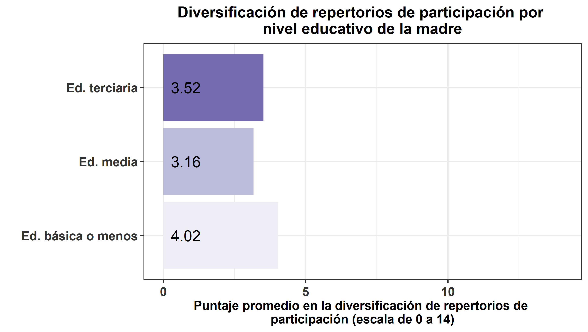

### Participación política durante el segundo semestre de 2021

```{r,echo=FALSE}
#### Recodificar variables
data_wide$part_pol_firma_21b_rec = ifelse(data_wide$part_pol_firma_21b==1|data_wide$part_pol_firma_21b==2,0,1)
data_wide$part_pol_marc_pac_21b_rec = ifelse(data_wide$part_pol_marc_pac_21b==1|data_wide$part_pol_marc_pac_21b==2,0,1)
data_wide$part_pol_marc_dis_21b_rec = ifelse(data_wide$part_pol_marc_dis_21b==1|data_wide$part_pol_marc_dis_21b==2,0,1)
data_wide$part_pol_bloq_21b_rec = ifelse(data_wide$part_pol_bloq_21b==1|data_wide$part_pol_bloq_21b==2,0,1)
data_wide$part_pol_rayar_21b_rec = ifelse(data_wide$part_pol_rayar_21b==1|data_wide$part_pol_rayar_21b==2,0,1)
data_wide$part_pol_toma_21b_rec = ifelse(data_wide$part_pol_toma_21b==1|data_wide$part_pol_toma_21b==2,0,1)
data_wide$part_pol_com_21b_rec = ifelse(data_wide$part_pol_com_21b==1|data_wide$part_pol_com_21b==2,0,1)
data_wide$marcha_amig_21b_rec = ifelse(data_wide$marcha_amig_21b==1|data_wide$marcha_amig_21b==2,0,1)
data_wide$marcha_pad_21b_rec = ifelse(data_wide$marcha_pad_21b==1|data_wide$marcha_pad_21b==2,0,1)
data_wide$marcha_fam_21b_rec = ifelse(data_wide$marcha_fam_21b==1|data_wide$marcha_fam_21b==2,0,1)
data_wide$part_pol_online_info_21b_rec = ifelse(data_wide$part_pol_online_info_21b==1|data_wide$part_pol_online_info_21b==2,0,1)
data_wide$part_pol_online_post_21b_rec = ifelse(data_wide$part_pol_online_post_21b==1|data_wide$part_pol_online_post_21b==2,0,1)
data_wide$part_pol_online_com_21b_rec = ifelse(data_wide$part_pol_online_com_21b==1|data_wide$part_pol_online_com_21b==2,0,1)
data_wide$part_pol_online_seg_21b_rec = ifelse(data_wide$part_pol_online_seg_21b==1|data_wide$part_pol_online_seg_21b==2,0,1)
```

```{r}
#### Crear variable
data_wide$part_pol_21_2s = as.numeric(data_wide$part_pol_firma_21b_rec + data_wide$part_pol_marc_pac_21b_rec + data_wide$part_pol_marc_dis_21b_rec + data_wide$part_pol_bloq_21b_rec + data_wide$part_pol_rayar_21b_rec + data_wide$part_pol_toma_21b_rec + data_wide$part_pol_com_21b_rec + data_wide$marcha_amig_21b_rec + data_wide$marcha_pad_21b_rec + data_wide$marcha_fam_21b_rec + data_wide$part_pol_online_info_21b_rec + data_wide$part_pol_online_post_21b_rec + data_wide$part_pol_online_com_21b_rec + data_wide$part_pol_online_seg_21b_rec)
```

```{r}
# Creación de bbdd
data_ed_bas = data_wide %>%  filter(nse_madre==1 | nse_madre==2 | nse_madre==3 | nse_madre==4) %>% as.data.frame() # Sin Ed. (1), Ed. básica incompleta (2) o completa (3)
data_ed_med = data_wide %>%  filter(nse_madre==4 | nse_madre==5) %>% as.data.frame() # Ed. media incompleta (4) o completa (5)
data_ed_ter = data_wide %>%  filter(nse_madre==6 | nse_madre==7 | nse_madre==8 | nse_madre==9 | nse_madre==10) %>% as.data.frame() # técnico superior incompleto (6) o completo (7) Universitaria incompleta (8) o completa (9), Estudios de postgrado (magíster o doctorado) (10)

#data_ed_tec = data_wide %>%  filter(nse_madre==6 | nse_madre==7) %>% as.data.frame() # técnico superior incompleto (6) o completo (7)
#data_ed_uni = data_wide %>%  filter(nse_madre==8 | nse_madre==9 | nse_madre==10) %>% as.data.frame() # Universitaria incompleta (8) o completa (9), Estudios de postgrado (magíster o doctorado) (10)
```

```{r}
table_preposh1<- rbind(psych::describe(data_ed_bas$part_pol_21_2s, na.rm=T),
               psych::describe(data_ed_med$part_pol_21_2s, na.rm=T),
               psych::describe(data_ed_ter$part_pol_21_2s, na.rm=T))#,
#               psych::describe(data_ed_uni$part_pol_21_2s, na.rm=T))
table_preposh1 <- table_preposh1 %>% select(n,mean,sd,median,trimmed,min,max)

pond1 <- stats::weighted.mean(x=data_ed_bas$part_pol_21_2s,y=data_ed_bas$weight_w01,na.rm=TRUE)
pond2 <- stats::weighted.mean(x=data_ed_med$part_pol_21_2s,y=data_ed_med$weight_w01,na.rm=TRUE)
pond3 <- stats::weighted.mean(x=data_ed_ter$part_pol_21_2s,y=data_ed_ter$weight_w01,na.rm=TRUE)
#pond4 <- stats::weighted.mean(x=data_ed_uni$part_pol_21_2s,y=data_ed_uni$weight_w01,na.rm=TRUE)

table_preposh1[1,2]<-pond1
table_preposh1[2,2]<-pond2
table_preposh1[3,2]<-pond3
#table_preposh1[4,2]<-pond4

#table_preposh1$dep <- c("Ed. básica o menos","Ed. media","Técnico superior", "Universitaria o más")
table_preposh1$dep <- c("Ed. básica o menos","Ed. media","Ed. terciaria")

part_pol_21_2s_colegio <-  ggplot(data=table_preposh1, aes(x=dep, y=mean, fill=dep)) +
     geom_bar(position = 'dodge', stat='identity')+#,width=0.8) 
     scale_fill_brewer(palette="Purples") +
     geom_text(aes(label=format(round(mean,2)), y=0), position=position_dodge(0.9), hjust=-0.25, size=6) +
     theme_bw(base_size = 14) +
     scale_y_continuous(labels = scales::comma) +
     ylab('Puntaje promedio en la diversificación de repertorios de 
participación (escala de 0 a 14)') + xlab(' ') + 
     theme(legend.position="top") +
     labs(fill = " ") +
    coord_flip()+
    theme(axis.text.x = element_text(colour = "grey20", size = 14, angle = 360, hjust = 0.5, vjust = 0.5, face = "bold"),
          axis.text.y = element_text(colour = "grey20", size = 14), 
          text = element_text(size = 14, face = "bold"),
          plot.title = element_text(hjust=0.5),
          legend.position = "none") + 
     ggtitle("Diversificación de repertorios de participación por 
nivel educativo de la madre") + ylim(0,14)
#part_pol_21_2s_colegio
ggsave(part_pol_21_2s_colegio, file = "../output/graphs/part_pol_21_2s_colegio_ed_madre.png",device = "png",width = 23,height = 13,dpi = "retina",units = "cm")
```


## Máximo nivel educativo del padre
### Participación política durante 3ro y 4to medio
```{r}
### Recodificar variables
#se excluye + Participar en una marcha con compañeros del colegio (s2_p_e_05_13)
data_wide$part_pol_marcha_pas_rec = ifelse(data_wide$part_pol_marcha_pas==1|data_wide$part_pol_marcha_pas==2,0,1)
data_wide$part_pol_marcha_dis_rec = ifelse(data_wide$part_pol_marcha_dis==1|data_wide$part_pol_marcha_dis==2,0,1)
data_wide$part_pol_bloqueo_rec = ifelse(data_wide$part_pol_bloqueo==1|data_wide$part_pol_bloqueo==2,0,1)
data_wide$part_pol_rayar.y_rec = ifelse(data_wide$part_pol_rayar.y==1|data_wide$part_pol_rayar.y==2,0,1)
data_wide$part_pol_toma.y_rec = ifelse(data_wide$part_pol_toma.y==1|data_wide$part_pol_toma.y==2,0,1)
data_wide$part_pol_volunt_rec = ifelse(data_wide$part_pol_volunt==1|data_wide$part_pol_volunt==2,0,1)
data_wide$part_pol_firma.y_rec = ifelse(data_wide$part_pol_firma.y==1|data_wide$part_pol_firma.y==2,0,1)
data_wide$marcha_amig.y_rec = ifelse(data_wide$marcha_amig.y==1|data_wide$marcha_amig.y==2,0,1)
data_wide$marcha_pad.y_rec = ifelse(data_wide$marcha_pad.y==1|data_wide$marcha_pad.y==2,0,1)
data_wide$marcha_fam.y_rec = ifelse(data_wide$marcha_fam.y==1|data_wide$marcha_fam.y==2,0,1)
data_wide$part_pol_online_rec = ifelse(data_wide$part_pol_online==1|data_wide$part_pol_online==2,0,1)
data_wide$part_online_post_rec = ifelse(data_wide$part_online_post==1|data_wide$part_online_post==2,0,1)
data_wide$part_online_com_rec = ifelse(data_wide$part_online_com==1|data_wide$part_online_com==2,0,1)
data_wide$part_online_seg_rec = ifelse(data_wide$part_online_seg==1|data_wide$part_online_seg==2,0,1)
```

```{r}
### Crear variable
data_wide$part_pol_3y4 = as.numeric(data_wide$part_pol_marcha_pas_rec + data_wide$part_pol_marcha_dis_rec + data_wide$part_pol_bloqueo_rec + data_wide$part_pol_rayar.y_rec + data_wide$part_pol_toma.y_rec + data_wide$part_pol_volunt_rec + data_wide$part_pol_firma.y_rec + data_wide$marcha_amig.y_rec + data_wide$marcha_pad.y_rec + data_wide$marcha_fam.y_rec + data_wide$part_pol_online_rec + data_wide$part_online_post_rec + data_wide$part_online_com_rec + data_wide$part_online_seg_rec)
```

```{r}
# Creación de bbdd
data_ed_bas = data_wide %>%  filter(nse_padre==1 | nse_padre==2 | nse_padre==3 | nse_padre==4) %>% as.data.frame() # Sin Ed. (1), Ed. básica incompleta (2) o completa (3)
data_ed_med = data_wide %>%  filter(nse_padre==4 | nse_padre==5) %>% as.data.frame() # Ed. media incompleta (4) o completa (5)
data_ed_ter = data_wide %>%  filter(nse_padre==6 | nse_padre==7 | nse_padre==8 | nse_padre==9 | nse_padre==10) %>% as.data.frame() # técnico superior incompleto (6) o completo (7) Universitaria incompleta (8) o completa (9), Estudios de postgrado (magíster o doctorado) (10)

#data_ed_tec = data_wide %>%  filter(nse_padre==6 | nse_padre==7) %>% as.data.frame() # técnico superior incompleto (6) o completo (7)
#data_ed_uni = data_wide %>%  filter(nse_padre==8 | nse_padre==9 | nse_padre==10) %>% as.data.frame() # Universitaria incompleta (8) o completa (9), Estudios de postgrado (magíster o doctorado) (10)
```

```{r}
table_preposh1<- rbind(psych::describe(data_ed_bas$part_pol_3y4, na.rm=T),
               psych::describe(data_ed_med$part_pol_3y4, na.rm=T),
               psych::describe(data_ed_ter$part_pol_3y4, na.rm=T))#,
#               psych::describe(data_ed_uni$part_pol_3y4, na.rm=T))
table_preposh1 <- table_preposh1 %>% select(n,mean,sd,median,trimmed,min,max)

pond1 <- stats::weighted.mean(x=data_ed_bas$part_pol_3y4,y=data_ed_bas$weight_w01,na.rm=TRUE)
pond2 <- stats::weighted.mean(x=data_ed_med$part_pol_3y4,y=data_ed_med$weight_w01,na.rm=TRUE)
pond3 <- stats::weighted.mean(x=data_ed_ter$part_pol_3y4,y=data_ed_ter$weight_w01,na.rm=TRUE)
#pond4 <- stats::weighted.mean(x=data_ed_uni$part_pol_3y4,y=data_ed_uni$weight_w01,na.rm=TRUE)

table_preposh1[1,2]<-pond1
table_preposh1[2,2]<-pond2
table_preposh1[3,2]<-pond3
#table_preposh1[4,2]<-pond4

#table_preposh1$dep <- c("Ed. básica o menos","Ed. media","Técnico superior", "Universitaria o más")
table_preposh1$dep <- c("Ed. básica o menos","Ed. media","Ed. terciaria")

part_pol_3y4_colegio <-  ggplot(data=table_preposh1, aes(x=dep, y=mean, fill=dep)) +
     geom_bar(position = 'dodge', stat='identity')+#,width=0.8) 
     scale_fill_brewer(palette="Purples") +
     geom_text(aes(label=format(round(mean,2)), y=0), position=position_dodge(0.9), hjust=-0.25, size=6) +
     theme_bw(base_size = 14) +
     scale_y_continuous(labels = scales::comma) +
     ylab('Puntaje promedio en la diversificación de repertorios de 
participación (escala de 0 a 14)') + xlab(' ') + 
     theme(legend.position="top") +
     labs(fill = " ") +
    coord_flip()+
    theme(axis.text.x = element_text(colour = "grey20", size = 14, angle = 360, hjust = 0.5, vjust = 0.5, face = "bold"),
          axis.text.y = element_text(colour = "grey20", size = 14), 
          text = element_text(size = 14, face = "bold"),
          plot.title = element_text(hjust=0.5),
          legend.position = "none") + 
     ggtitle("Diversificación de repertorios de participación por 
nivel educativo de la padre") + ylim(0,14)
#part_pol_3y4_colegio
ggsave(part_pol_3y4_colegio, file = "../output/graphs/part_pol_3y4_colegio_ed_padre.png",device = "png",width = 23,height = 13,dpi = "retina",units = "cm")

```

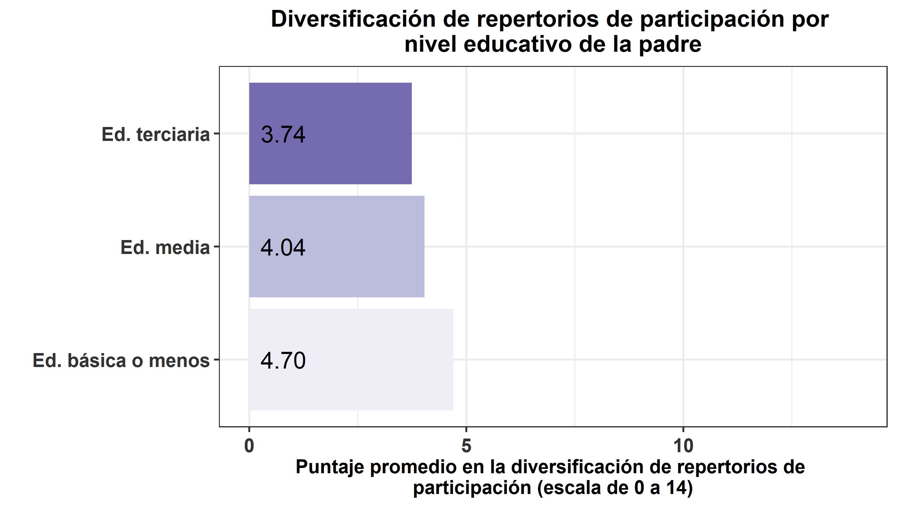

### Participación política durante estallido social

```{r}
### Recodificar variables
data_wide$part_pol_firma_21_rec = ifelse(data_wide$part_pol_firma_21==1|data_wide$part_pol_firma_21==2,0,1)
data_wide$part_pol_marc_pac_21_rec = ifelse(data_wide$part_pol_marc_pac_21==1|data_wide$part_pol_marc_pac_21==2,0,1)
data_wide$part_pol_marc_dis_21_rec = ifelse(data_wide$part_pol_marc_dis_21==1|data_wide$part_pol_marc_dis_21==2,0,1)
data_wide$part_pol_bloq_21_rec = ifelse(data_wide$part_pol_bloq_21==1|data_wide$part_pol_bloq_21==2,0,1)
data_wide$part_pol_rayar_21_rec = ifelse(data_wide$part_pol_rayar_21==1|data_wide$part_pol_rayar_21==2,0,1)
data_wide$part_pol_toma_21_rec = ifelse(data_wide$part_pol_toma_21==1|data_wide$part_pol_toma_21==2,0,1)
data_wide$part_pol_com_21_rec = ifelse(data_wide$part_pol_com_21==1|data_wide$part_pol_com_21==2,0,1)
data_wide$marcha_amig_21_rec = ifelse(data_wide$marcha_amig_21==1|data_wide$marcha_amig_21==2,0,1)
data_wide$marcha_pad_21_rec = ifelse(data_wide$marcha_pad_21==1|data_wide$marcha_pad_21==2,0,1)
data_wide$marcha_fam_21_rec = ifelse(data_wide$marcha_fam_21==1|data_wide$marcha_fam_21==2,0,1)
data_wide$part_pol_online_info_21_rec = ifelse(data_wide$part_pol_online_info_21==1|data_wide$part_pol_online_info_21==2,0,1)
data_wide$part_pol_online_post_21_rec = ifelse(data_wide$part_pol_online_post_21==1|data_wide$part_pol_online_post_21==2,0,1)
data_wide$part_pol_online_com_21_rec = ifelse(data_wide$part_pol_online_com_21==1|data_wide$part_pol_online_com_21==2,0,1)
data_wide$part_pol_online_seg_21_rec = ifelse(data_wide$part_pol_online_seg_21==1|data_wide$part_pol_online_seg_21==2,0,1)
```

```{r}
### Crear variable
data_wide$part_pol_es = as.numeric(data_wide$part_pol_firma_21_rec + data_wide$part_pol_marc_pac_21_rec + data_wide$part_pol_marc_dis_21_rec + data_wide$part_pol_bloq_21_rec + data_wide$part_pol_rayar_21_rec + data_wide$part_pol_toma_21_rec + data_wide$part_pol_com_21_rec + data_wide$marcha_amig_21_rec + data_wide$marcha_pad_21_rec + data_wide$marcha_fam_21_rec + data_wide$part_pol_online_info_21_rec + data_wide$part_pol_online_post_21_rec + data_wide$part_pol_online_com_21_rec + data_wide$part_pol_online_seg_21_rec)
```

```{r}
# Creación de bbdd
data_ed_bas = data_wide %>%  filter(nse_padre==1 | nse_padre==2 | nse_padre==3 | nse_padre==4) %>% as.data.frame() # Sin Ed. (1), Ed. básica incompleta (2) o completa (3)
data_ed_med = data_wide %>%  filter(nse_padre==4 | nse_padre==5) %>% as.data.frame() # Ed. media incompleta (4) o completa (5)
data_ed_ter = data_wide %>%  filter(nse_padre==6 | nse_padre==7 | nse_padre==8 | nse_padre==9 | nse_padre==10) %>% as.data.frame() # técnico superior incompleto (6) o completo (7) Universitaria incompleta (8) o completa (9), Estudios de postgrado (magíster o doctorado) (10)

#data_ed_tec = data_wide %>%  filter(nse_padre==6 | nse_padre==7) %>% as.data.frame() # técnico superior incompleto (6) o completo (7)
#data_ed_uni = data_wide %>%  filter(nse_padre==8 | nse_padre==9 | nse_padre==10) %>% as.data.frame() # Universitaria incompleta (8) o completa (9), Estudios de postgrado (magíster o doctorado) (10)

```

```{r}
table_preposh1<- rbind(psych::describe(data_ed_bas$part_pol_es, na.rm=T),
               psych::describe(data_ed_med$part_pol_es, na.rm=T),
               psych::describe(data_ed_ter$part_pol_es, na.rm=T))#,
#               psych::describe(data_ed_uni$part_pol_es, na.rm=T))
table_preposh1 <- table_preposh1 %>% select(n,mean,sd,median,trimmed,min,max)

pond1 <- stats::weighted.mean(x=data_ed_bas$part_pol_es,y=data_ed_bas$weight_w01,na.rm=TRUE)
pond2 <- stats::weighted.mean(x=data_ed_med$part_pol_es,y=data_ed_med$weight_w01,na.rm=TRUE)
pond3 <- stats::weighted.mean(x=data_ed_ter$part_pol_es,y=data_ed_ter$weight_w01,na.rm=TRUE)
#pond4 <- stats::weighted.mean(x=data_ed_uni$part_pol_es,y=data_ed_uni$weight_w01,na.rm=TRUE)

table_preposh1[1,2]<-pond1
table_preposh1[2,2]<-pond2
table_preposh1[3,2]<-pond3
#table_preposh1[4,2]<-pond4

#table_preposh1$dep <- c("Ed. básica o menos","Ed. media","Técnico superior", "Universitaria o más")
table_preposh1$dep <- c("Ed. básica o menos","Ed. media","Ed. terciaria")

part_pol_es_colegio <-  ggplot(data=table_preposh1, aes(x=dep, y=mean, fill=dep)) +
     geom_bar(position = 'dodge', stat='identity')+#,width=0.8) 
     scale_fill_brewer(palette="Purples") +
     geom_text(aes(label=format(round(mean,2)), y=0), position=position_dodge(0.9), hjust=-0.25, size=6) +
     theme_bw(base_size = 14) +
     scale_y_continuous(labels = scales::comma) +
     ylab('Puntaje promedio en la diversificación de repertorios de 
participación (escala de 0 a 14)') + xlab(' ') + 
     theme(legend.position="top") +
     labs(fill = " ") +
    coord_flip()+
    theme(axis.text.x = element_text(colour = "grey20", size = 14, angle = 360, hjust = 0.5, vjust = 0.5, face = "bold"),
          axis.text.y = element_text(colour = "grey20", size = 14), 
          text = element_text(size = 14, face = "bold"),
          plot.title = element_text(hjust=0.5),
          legend.position = "none") + 
     ggtitle("Diversificación de repertorios de participación por 
nivel educativo de la padre") + ylim(0,14)
#part_pol_es_colegio
ggsave(part_pol_es_colegio, file = "../output/graphs/part_pol_es_colegio_ed_padre.png",device = "png",width = 23,height = 13,dpi = "retina",units = "cm")

```
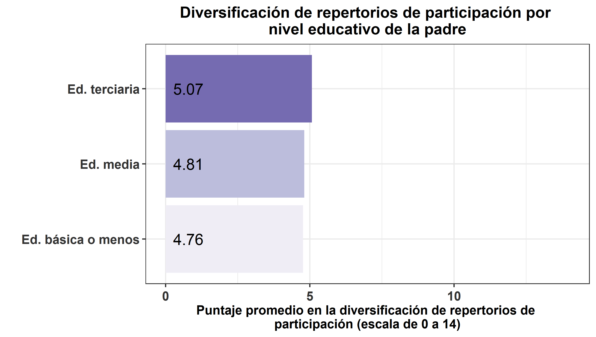

### Participación política durante el 2020

```{r}
### Recodificar variables
data_wide$part_pol_firma_20_rec = ifelse(data_wide$part_pol_firma_20==1|data_wide$part_pol_firma_20==2,0,1)
data_wide$part_pol_marc_pac_20_rec = ifelse(data_wide$part_pol_marc_pac_20==1|data_wide$part_pol_marc_pac_20==2,0,1)
data_wide$part_pol_marc_dis_20_rec = ifelse(data_wide$part_pol_marc_dis_20==1|data_wide$part_pol_marc_dis_20==2,0,1)
data_wide$part_pol_bloq_20_rec = ifelse(data_wide$part_pol_bloq_20==1|data_wide$part_pol_bloq_20==2,0,1)
data_wide$part_pol_rayar_20_rec = ifelse(data_wide$part_pol_rayar_20==1|data_wide$part_pol_rayar_20==2,0,1)
data_wide$part_pol_toma_20_rec = ifelse(data_wide$part_pol_toma_20==1|data_wide$part_pol_toma_20==2,0,1)
data_wide$part_pol_com_20_rec = ifelse(data_wide$part_pol_com_20==1|data_wide$part_pol_com_20==2,0,1)
data_wide$marcha_amig_20_rec = ifelse(data_wide$marcha_amig_20==1|data_wide$marcha_amig_20==2,0,1)
data_wide$marcha_pad_20_rec = ifelse(data_wide$marcha_pad_20==1|data_wide$marcha_pad_20==2,0,1)
data_wide$marcha_fam_20_rec = ifelse(data_wide$marcha_fam_20==1|data_wide$marcha_fam_20==2,0,1)
data_wide$part_pol_online_info_20_rec = ifelse(data_wide$part_pol_online_info_20==1|data_wide$part_pol_online_info_20==2,0,1)
data_wide$part_pol_online_post_20_rec = ifelse(data_wide$part_pol_online_post_20==1|data_wide$part_pol_online_post_20==2,0,1)
data_wide$part_pol_online_com_20_rec = ifelse(data_wide$part_pol_online_com_20==1|data_wide$part_pol_online_com_20==2,0,1)
data_wide$part_pol_online_seg_20_rec = ifelse(data_wide$part_pol_online_seg_20==1|data_wide$part_pol_online_seg_20==2,0,1)
```

```{r}
### Crear variable
data_wide$part_pol_20 = as.numeric(data_wide$part_pol_firma_20_rec + data_wide$part_pol_marc_pac_20_rec + data_wide$part_pol_marc_dis_20_rec + data_wide$part_pol_bloq_20_rec + data_wide$part_pol_rayar_20_rec + data_wide$part_pol_toma_20_rec + data_wide$part_pol_com_20_rec + data_wide$marcha_amig_20_rec + data_wide$marcha_pad_20_rec + data_wide$marcha_fam_20_rec + data_wide$part_pol_online_info_20_rec + data_wide$part_pol_online_post_20_rec + data_wide$part_pol_online_com_20_rec + data_wide$part_pol_online_seg_20_rec)
```

```{r}
# Creación de bbdd
data_ed_bas = data_wide %>%  filter(nse_padre==1 | nse_padre==2 | nse_padre==3 | nse_padre==4) %>% as.data.frame() # Sin Ed. (1), Ed. básica incompleta (2) o completa (3)
data_ed_med = data_wide %>%  filter(nse_padre==4 | nse_padre==5) %>% as.data.frame() # Ed. media incompleta (4) o completa (5)
data_ed_ter = data_wide %>%  filter(nse_padre==6 | nse_padre==7 | nse_padre==8 | nse_padre==9 | nse_padre==10) %>% as.data.frame() # técnico superior incompleto (6) o completo (7) Universitaria incompleta (8) o completa (9), Estudios de postgrado (magíster o doctorado) (10)

#data_ed_tec = data_wide %>%  filter(nse_padre==6 | nse_padre==7) %>% as.data.frame() # técnico superior incompleto (6) o completo (7)
#data_ed_uni = data_wide %>%  filter(nse_padre==8 | nse_padre==9 | nse_padre==10) %>% as.data.frame() # Universitaria incompleta (8) o completa (9), Estudios de postgrado (magíster o doctorado) (10)

```

```{r}
table_preposh1<- rbind(psych::describe(data_ed_bas$part_pol_20, na.rm=T),
               psych::describe(data_ed_med$part_pol_20, na.rm=T),
               psych::describe(data_ed_ter$part_pol_20, na.rm=T))#,
#               psych::describe(data_ed_uni$part_pol_20, na.rm=T))
table_preposh1 <- table_preposh1 %>% select(n,mean,sd,median,trimmed,min,max)

pond1 <- stats::weighted.mean(x=data_ed_bas$part_pol_20,y=data_ed_bas$weight_w01,na.rm=TRUE)
pond2 <- stats::weighted.mean(x=data_ed_med$part_pol_20,y=data_ed_med$weight_w01,na.rm=TRUE)
pond3 <- stats::weighted.mean(x=data_ed_ter$part_pol_20,y=data_ed_ter$weight_w01,na.rm=TRUE)
#pond4 <- stats::weighted.mean(x=data_ed_uni$part_pol_20,y=data_ed_uni$weight_w01,na.rm=TRUE)

table_preposh1[1,2]<-pond1
table_preposh1[2,2]<-pond2
table_preposh1[3,2]<-pond3
#table_preposh1[4,2]<-pond4

#table_preposh1$dep <- c("Ed. básica o menos","Ed. media","Técnico superior", "Universitaria o más")
table_preposh1$dep <- c("Ed. básica o menos","Ed. media","Ed. terciaria")

part_pol_20_colegio <-  ggplot(data=table_preposh1, aes(x=dep, y=mean, fill=dep)) +
     geom_bar(position = 'dodge', stat='identity')+#,width=0.8) 
     scale_fill_brewer(palette="Purples") +
     geom_text(aes(label=format(round(mean,2)), y=0), position=position_dodge(0.9), hjust=-0.25, size=6) +
     theme_bw(base_size = 14) +
     scale_y_continuous(labels = scales::comma) +
     ylab('Puntaje promedio en la diversificación de repertorios de 
participación (escala de 0 a 14)') + xlab(' ') + 
     theme(legend.position="top") +
     labs(fill = " ") +
    coord_flip()+
    theme(axis.text.x = element_text(colour = "grey20", size = 14, angle = 360, hjust = 0.5, vjust = 0.5, face = "bold"),
          axis.text.y = element_text(colour = "grey20", size = 14), 
          text = element_text(size = 14, face = "bold"),
          plot.title = element_text(hjust=0.5),
          legend.position = "none") + 
     ggtitle("Diversificación de repertorios de participación por 
nivel educativo de la padre") + ylim(0,14)
#part_pol_20_colegio
ggsave(part_pol_20_colegio, file = "../output/graphs/part_pol_20_colegio_ed_padre.png",device = "png",width = 23,height = 13,dpi = "retina",units = "cm")
```


### Participación política durante el primer semestre de 2021

```{r,echo=FALSE}
#### Recodificar variables
data_wide$part_pol_firma.x_rec = ifelse(data_wide$part_pol_firma.x==1|data_wide$part_pol_firma.x==2,0,1)
data_wide$part_pol_marc_pac_rec = ifelse(data_wide$part_pol_marc_pac==1|data_wide$part_pol_marc_pac==2,0,1)
data_wide$part_pol_marc_dis_rec = ifelse(data_wide$part_pol_marc_dis==1|data_wide$part_pol_marc_dis==2,0,1)
data_wide$part_pol_bloq_rec = ifelse(data_wide$part_pol_bloq==1|data_wide$part_pol_bloq==2,0,1)
data_wide$part_pol_rayar.x_rec = ifelse(data_wide$part_pol_rayar.x==1|data_wide$part_pol_rayar.x==2,0,1)
data_wide$part_pol_toma.x_rec = ifelse(data_wide$part_pol_toma.x==1|data_wide$part_pol_toma.x==2,0,1)
data_wide$part_pol_com_rec = ifelse(data_wide$part_pol_com==1|data_wide$part_pol_com==2,0,1)
data_wide$marcha_amig.x_rec = ifelse(data_wide$marcha_amig.x==1|data_wide$marcha_amig.x==2,0,1)
data_wide$marcha_pad.x_rec = ifelse(data_wide$marcha_pad.x==1|data_wide$marcha_pad.x==2,0,1)
data_wide$marcha_fam.x_rec = ifelse(data_wide$marcha_fam.x==1|data_wide$marcha_fam.x==2,0,1)
data_wide$part_pol_online_info_rec = ifelse(data_wide$part_pol_online_info==1|data_wide$part_pol_online_info==2,0,1)
data_wide$part_pol_online_post_rec = ifelse(data_wide$part_pol_online_post==1|data_wide$part_pol_online_post==2,0,1)
data_wide$part_pol_online_com_rec = ifelse(data_wide$part_pol_online_com==1|data_wide$part_pol_online_com==2,0,1)
data_wide$part_pol_online_seg_rec = ifelse(data_wide$part_pol_online_seg==1|data_wide$part_pol_online_seg==2,0,1)
```

```{r}
#### Crear variable
data_wide$part_pol_21_1s = as.numeric(data_wide$part_pol_firma.x_rec + data_wide$part_pol_marc_pac_rec + data_wide$part_pol_marc_dis_rec + data_wide$part_pol_bloq_rec + data_wide$part_pol_rayar.x_rec + data_wide$part_pol_toma.x_rec + data_wide$part_pol_com_rec + data_wide$marcha_amig.x_rec + data_wide$marcha_pad.x_rec + data_wide$marcha_fam.x_rec + data_wide$part_pol_online_info_rec + data_wide$part_pol_online_post_rec + data_wide$part_pol_online_com_rec + data_wide$part_pol_online_seg_rec)
```

```{r}
# Creación de bbdd
data_ed_bas = data_wide %>%  filter(nse_padre==1 | nse_padre==2 | nse_padre==3 | nse_padre==4) %>% as.data.frame() # Sin Ed. (1), Ed. básica incompleta (2) o completa (3)
data_ed_med = data_wide %>%  filter(nse_padre==4 | nse_padre==5) %>% as.data.frame() # Ed. media incompleta (4) o completa (5)
data_ed_ter = data_wide %>%  filter(nse_padre==6 | nse_padre==7 | nse_padre==8 | nse_padre==9 | nse_padre==10) %>% as.data.frame() # técnico superior incompleto (6) o completo (7) Universitaria incompleta (8) o completa (9), Estudios de postgrado (magíster o doctorado) (10)

#data_ed_tec = data_wide %>%  filter(nse_padre==6 | nse_padre==7) %>% as.data.frame() # técnico superior incompleto (6) o completo (7)
#data_ed_uni = data_wide %>%  filter(nse_padre==8 | nse_padre==9 | nse_padre==10) %>% as.data.frame() # Universitaria incompleta (8) o completa (9), Estudios de postgrado (magíster o doctorado) (10)

```

```{r}
table_preposh1<- rbind(psych::describe(data_ed_bas$part_pol_21_1s, na.rm=T),
               psych::describe(data_ed_med$part_pol_21_1s, na.rm=T),
               psych::describe(data_ed_ter$part_pol_21_1s, na.rm=T))#,
#               psych::describe(data_ed_uni$part_pol_21_1s, na.rm=T))
table_preposh1 <- table_preposh1 %>% select(n,mean,sd,median,trimmed,min,max)

pond1 <- stats::weighted.mean(x=data_ed_bas$part_pol_21_1s,y=data_ed_bas$weight_w01,na.rm=TRUE)
pond2 <- stats::weighted.mean(x=data_ed_med$part_pol_21_1s,y=data_ed_med$weight_w01,na.rm=TRUE)
pond3 <- stats::weighted.mean(x=data_ed_ter$part_pol_21_1s,y=data_ed_ter$weight_w01,na.rm=TRUE)
#pond4 <- stats::weighted.mean(x=data_ed_uni$part_pol_21_1s,y=data_ed_uni$weight_w01,na.rm=TRUE)

table_preposh1[1,2]<-pond1
table_preposh1[2,2]<-pond2
table_preposh1[3,2]<-pond3
#table_preposh1[4,2]<-pond4

#table_preposh1$dep <- c("Ed. básica o menos","Ed. media","Técnico superior", "Universitaria o más")
table_preposh1$dep <- c("Ed. básica o menos","Ed. media","Ed. terciaria")

part_pol_21_1s_colegio <-  ggplot(data=table_preposh1, aes(x=dep, y=mean, fill=dep)) +
     geom_bar(position = 'dodge', stat='identity')+#,width=0.8) 
     scale_fill_brewer(palette="Purples") +
     geom_text(aes(label=format(round(mean,2)), y=0), position=position_dodge(0.9), hjust=-0.25, size=6) +
     theme_bw(base_size = 14) +
     scale_y_continuous(labels = scales::comma) +
     ylab('Puntaje promedio en la diversificación de repertorios de 
participación (escala de 0 a 14)') + xlab(' ') + 
     theme(legend.position="top") +
     labs(fill = " ") +
    coord_flip()+
    theme(axis.text.x = element_text(colour = "grey20", size = 14, angle = 360, hjust = 0.5, vjust = 0.5, face = "bold"),
          axis.text.y = element_text(colour = "grey20", size = 14), 
          text = element_text(size = 14, face = "bold"),
          plot.title = element_text(hjust=0.5),
          legend.position = "none") + 
     ggtitle("Diversificación de repertorios de participación por 
nivel educativo de la padre") + ylim(0,14)
#part_pol_21_1s_colegio
ggsave(part_pol_21_1s_colegio, file = "../output/graphs/part_pol_21_1s_colegio_ed_padre.png",device = "png",width = 23,height = 13,dpi = "retina",units = "cm")
```


### Participación política durante el segundo semestre de 2021

```{r,echo=FALSE}
#### Recodificar variables
data_wide$part_pol_firma_21b_rec = ifelse(data_wide$part_pol_firma_21b==1|data_wide$part_pol_firma_21b==2,0,1)
data_wide$part_pol_marc_pac_21b_rec = ifelse(data_wide$part_pol_marc_pac_21b==1|data_wide$part_pol_marc_pac_21b==2,0,1)
data_wide$part_pol_marc_dis_21b_rec = ifelse(data_wide$part_pol_marc_dis_21b==1|data_wide$part_pol_marc_dis_21b==2,0,1)
data_wide$part_pol_bloq_21b_rec = ifelse(data_wide$part_pol_bloq_21b==1|data_wide$part_pol_bloq_21b==2,0,1)
data_wide$part_pol_rayar_21b_rec = ifelse(data_wide$part_pol_rayar_21b==1|data_wide$part_pol_rayar_21b==2,0,1)
data_wide$part_pol_toma_21b_rec = ifelse(data_wide$part_pol_toma_21b==1|data_wide$part_pol_toma_21b==2,0,1)
data_wide$part_pol_com_21b_rec = ifelse(data_wide$part_pol_com_21b==1|data_wide$part_pol_com_21b==2,0,1)
data_wide$marcha_amig_21b_rec = ifelse(data_wide$marcha_amig_21b==1|data_wide$marcha_amig_21b==2,0,1)
data_wide$marcha_pad_21b_rec = ifelse(data_wide$marcha_pad_21b==1|data_wide$marcha_pad_21b==2,0,1)
data_wide$marcha_fam_21b_rec = ifelse(data_wide$marcha_fam_21b==1|data_wide$marcha_fam_21b==2,0,1)
data_wide$part_pol_online_info_21b_rec = ifelse(data_wide$part_pol_online_info_21b==1|data_wide$part_pol_online_info_21b==2,0,1)
data_wide$part_pol_online_post_21b_rec = ifelse(data_wide$part_pol_online_post_21b==1|data_wide$part_pol_online_post_21b==2,0,1)
data_wide$part_pol_online_com_21b_rec = ifelse(data_wide$part_pol_online_com_21b==1|data_wide$part_pol_online_com_21b==2,0,1)
data_wide$part_pol_online_seg_21b_rec = ifelse(data_wide$part_pol_online_seg_21b==1|data_wide$part_pol_online_seg_21b==2,0,1)
```

```{r}
#### Crear variable
data_wide$part_pol_21_2s = as.numeric(data_wide$part_pol_firma_21b_rec + data_wide$part_pol_marc_pac_21b_rec + data_wide$part_pol_marc_dis_21b_rec + data_wide$part_pol_bloq_21b_rec + data_wide$part_pol_rayar_21b_rec + data_wide$part_pol_toma_21b_rec + data_wide$part_pol_com_21b_rec + data_wide$marcha_amig_21b_rec + data_wide$marcha_pad_21b_rec + data_wide$marcha_fam_21b_rec + data_wide$part_pol_online_info_21b_rec + data_wide$part_pol_online_post_21b_rec + data_wide$part_pol_online_com_21b_rec + data_wide$part_pol_online_seg_21b_rec)
```

```{r}
# Creación de bbdd
data_ed_bas = data_wide %>%  filter(nse_padre==1 | nse_padre==2 | nse_padre==3 | nse_padre==4) %>% as.data.frame() # Sin Ed. (1), Ed. básica incompleta (2) o completa (3)
data_ed_med = data_wide %>%  filter(nse_padre==4 | nse_padre==5) %>% as.data.frame() # Ed. media incompleta (4) o completa (5)
data_ed_ter = data_wide %>%  filter(nse_padre==6 | nse_padre==7 | nse_padre==8 | nse_padre==9 | nse_padre==10) %>% as.data.frame() # técnico superior incompleto (6) o completo (7) Universitaria incompleta (8) o completa (9), Estudios de postgrado (magíster o doctorado) (10)

#data_ed_tec = data_wide %>%  filter(nse_padre==6 | nse_padre==7) %>% as.data.frame() # técnico superior incompleto (6) o completo (7)
#data_ed_uni = data_wide %>%  filter(nse_padre==8 | nse_padre==9 | nse_padre==10) %>% as.data.frame() # Universitaria incompleta (8) o completa (9), Estudios de postgrado (magíster o doctorado) (10)

```

```{r}
table_preposh1<- rbind(psych::describe(data_ed_bas$part_pol_21_2s, na.rm=T),
               psych::describe(data_ed_med$part_pol_21_2s, na.rm=T),
               psych::describe(data_ed_ter$part_pol_21_2s, na.rm=T))#,
#               psych::describe(data_ed_uni$part_pol_21_2s, na.rm=T))
table_preposh1 <- table_preposh1 %>% select(n,mean,sd,median,trimmed,min,max)

pond1 <- stats::weighted.mean(x=data_ed_bas$part_pol_21_2s,y=data_ed_bas$weight_w01,na.rm=TRUE)
pond2 <- stats::weighted.mean(x=data_ed_med$part_pol_21_2s,y=data_ed_med$weight_w01,na.rm=TRUE)
pond3 <- stats::weighted.mean(x=data_ed_ter$part_pol_21_2s,y=data_ed_ter$weight_w01,na.rm=TRUE)
#pond4 <- stats::weighted.mean(x=data_ed_uni$part_pol_21_2s,y=data_ed_uni$weight_w01,na.rm=TRUE)

table_preposh1[1,2]<-pond1
table_preposh1[2,2]<-pond2
table_preposh1[3,2]<-pond3
#table_preposh1[4,2]<-pond4

#table_preposh1$dep <- c("Ed. básica o menos","Ed. media","Técnico superior", "Universitaria o más")
table_preposh1$dep <- c("Ed. básica o menos","Ed. media","Ed. terciaria")

part_pol_21_2s_colegio <-  ggplot(data=table_preposh1, aes(x=dep, y=mean, fill=dep)) +
     geom_bar(position = 'dodge', stat='identity')+#,width=0.8) 
     scale_fill_brewer(palette="Purples") +
     geom_text(aes(label=format(round(mean,2)), y=0), position=position_dodge(0.9), hjust=-0.25, size=6) +
     theme_bw(base_size = 14) +
     scale_y_continuous(labels = scales::comma) +
     ylab('Puntaje promedio en la diversificación de repertorios de 
participación (escala de 0 a 14)') + xlab(' ') + 
     theme(legend.position="top") +
     labs(fill = " ") +
    coord_flip()+
    theme(axis.text.x = element_text(colour = "grey20", size = 14, angle = 360, hjust = 0.5, vjust = 0.5, face = "bold"),
          axis.text.y = element_text(colour = "grey20", size = 14), 
          text = element_text(size = 14, face = "bold"),
          plot.title = element_text(hjust=0.5),
          legend.position = "none") + 
     ggtitle("Diversificación de repertorios de participación por 
nivel educativo de la padre") + ylim(0,14)
#part_pol_21_2s_colegio
ggsave(part_pol_21_2s_colegio, file = "../output/graphs/part_pol_21_2s_colegio_ed_padre.png",device = "png",width = 23,height = 13,dpi = "retina",units = "cm")
```


## Frecuencia de conversación con los padres sobre temas sociales y/o políticos
### Participación política durante 3ro y 4to medio
```{r}
### Recodificar variables
#se excluye + Participar en una marcha con compañeros del colegio (s2_p_e_05_13)
data_wide$part_pol_marcha_pas_rec = ifelse(data_wide$part_pol_marcha_pas==1|data_wide$part_pol_marcha_pas==2,0,1)
data_wide$part_pol_marcha_dis_rec = ifelse(data_wide$part_pol_marcha_dis==1|data_wide$part_pol_marcha_dis==2,0,1)
data_wide$part_pol_bloqueo_rec = ifelse(data_wide$part_pol_bloqueo==1|data_wide$part_pol_bloqueo==2,0,1)
data_wide$part_pol_rayar.y_rec = ifelse(data_wide$part_pol_rayar.y==1|data_wide$part_pol_rayar.y==2,0,1)
data_wide$part_pol_toma.y_rec = ifelse(data_wide$part_pol_toma.y==1|data_wide$part_pol_toma.y==2,0,1)
data_wide$part_pol_volunt_rec = ifelse(data_wide$part_pol_volunt==1|data_wide$part_pol_volunt==2,0,1)
data_wide$part_pol_firma.y_rec = ifelse(data_wide$part_pol_firma.y==1|data_wide$part_pol_firma.y==2,0,1)
data_wide$marcha_amig.y_rec = ifelse(data_wide$marcha_amig.y==1|data_wide$marcha_amig.y==2,0,1)
data_wide$marcha_pad.y_rec = ifelse(data_wide$marcha_pad.y==1|data_wide$marcha_pad.y==2,0,1)
data_wide$marcha_fam.y_rec = ifelse(data_wide$marcha_fam.y==1|data_wide$marcha_fam.y==2,0,1)
data_wide$part_pol_online_rec = ifelse(data_wide$part_pol_online==1|data_wide$part_pol_online==2,0,1)
data_wide$part_online_post_rec = ifelse(data_wide$part_online_post==1|data_wide$part_online_post==2,0,1)
data_wide$part_online_com_rec = ifelse(data_wide$part_online_com==1|data_wide$part_online_com==2,0,1)
data_wide$part_online_seg_rec = ifelse(data_wide$part_online_seg==1|data_wide$part_online_seg==2,0,1)
```

```{r}
### Crear variable
data_wide$part_pol_3y4 = as.numeric(data_wide$part_pol_marcha_pas_rec + data_wide$part_pol_marcha_dis_rec + data_wide$part_pol_bloqueo_rec + data_wide$part_pol_rayar.y_rec + data_wide$part_pol_toma.y_rec + data_wide$part_pol_volunt_rec + data_wide$part_pol_firma.y_rec + data_wide$marcha_amig.y_rec + data_wide$marcha_pad.y_rec + data_wide$marcha_fam.y_rec + data_wide$part_pol_online_rec + data_wide$part_online_post_rec + data_wide$part_online_com_rec + data_wide$part_online_seg_rec)
```

```{r}
# Creación de bbdd
data_nunca = data_wide %>%  filter(conv_padr_poli==1) %>% as.data.frame() # Nunca
data_casi_nunca = data_wide %>%  filter(conv_padr_poli==2) %>% as.data.frame() # Casi nunca
data_a_veces = data_wide %>%  filter(conv_padr_poli==3) %>% as.data.frame() # A veces
data_frecuent = data_wide %>%  filter(conv_padr_poli==4) %>% as.data.frame() # Frecuentemente
```

```{r}
table_preposh1<- rbind(psych::describe(data_nunca$part_pol_3y4, na.rm=T),
               psych::describe(data_casi_nunca$part_pol_3y4, na.rm=T),
               psych::describe(data_a_veces$part_pol_3y4, na.rm=T),
               psych::describe(data_frecuent$part_pol_3y4, na.rm=T))
table_preposh1 <- table_preposh1 %>% select(n,mean,sd,median,trimmed,min,max)

pond1 <- stats::weighted.mean(x=data_nunca$part_pol_3y4,y=data_nunca$weight_w01,na.rm=TRUE)
pond2 <- stats::weighted.mean(x=data_casi_nunca$part_pol_3y4,y=data_casi_nunca$weight_w01,na.rm=TRUE)
pond3 <- stats::weighted.mean(x=data_a_veces$part_pol_3y4,y=data_a_veces$weight_w01,na.rm=TRUE)
pond4 <- stats::weighted.mean(x=data_frecuent$part_pol_3y4,y=data_frecuent$weight_w01,na.rm=TRUE)

table_preposh1[1,2]<-pond1
table_preposh1[2,2]<-pond2
table_preposh1[3,2]<-pond3
table_preposh1[4,2]<-pond4

table_preposh1$dep <- c("1. Nunca","2. Casi nunca","3. A veces", "4. Frecuentemente")

part_pol_3y4_colegio <-  ggplot(data=table_preposh1, aes(x=dep, y=mean, fill=dep)) +
     geom_bar(position = 'dodge', stat='identity')+#,width=0.8) 
     scale_fill_brewer(palette="Purples") +
     geom_text(aes(label=format(round(mean,2)), y=0), position=position_dodge(0.9), hjust=-0.25, size=6) +
     theme_bw(base_size = 14) +
     scale_y_continuous(labels = scales::comma) +
     ylab('Puntaje promedio en la diversificación de repertorios de 
participación (escala de 0 a 14)') + xlab(' ') + 
     theme(legend.position="top") +
     labs(fill = " ") +
    coord_flip()+
    theme(axis.text.x = element_text(colour = "grey20", size = 14, angle = 360, hjust = 0.5, vjust = 0.5, face = "bold"),
          axis.text.y = element_text(colour = "grey20", size = 14), 
          text = element_text(size = 14, face = "bold"),
          plot.title = element_text(hjust=0.5),
          legend.position = "none") + 
     ggtitle("Diversificación de repertorios de participación por 
conversación con los padres sobre temas políticos y/o sociales") + ylim(0,14)
#part_pol_3y4_colegio
ggsave(part_pol_3y4_colegio, file = "../output/graphs/part_pol_3y4_colegio_conv_padres.png",device = "png",width = 23,height = 13,dpi = "retina",units = "cm")

```


### Participación política durante estallido social

```{r}
### Recodificar variables
data_wide$part_pol_firma_21_rec = ifelse(data_wide$part_pol_firma_21==1|data_wide$part_pol_firma_21==2,0,1)
data_wide$part_pol_marc_pac_21_rec = ifelse(data_wide$part_pol_marc_pac_21==1|data_wide$part_pol_marc_pac_21==2,0,1)
data_wide$part_pol_marc_dis_21_rec = ifelse(data_wide$part_pol_marc_dis_21==1|data_wide$part_pol_marc_dis_21==2,0,1)
data_wide$part_pol_bloq_21_rec = ifelse(data_wide$part_pol_bloq_21==1|data_wide$part_pol_bloq_21==2,0,1)
data_wide$part_pol_rayar_21_rec = ifelse(data_wide$part_pol_rayar_21==1|data_wide$part_pol_rayar_21==2,0,1)
data_wide$part_pol_toma_21_rec = ifelse(data_wide$part_pol_toma_21==1|data_wide$part_pol_toma_21==2,0,1)
data_wide$part_pol_com_21_rec = ifelse(data_wide$part_pol_com_21==1|data_wide$part_pol_com_21==2,0,1)
data_wide$marcha_amig_21_rec = ifelse(data_wide$marcha_amig_21==1|data_wide$marcha_amig_21==2,0,1)
data_wide$marcha_pad_21_rec = ifelse(data_wide$marcha_pad_21==1|data_wide$marcha_pad_21==2,0,1)
data_wide$marcha_fam_21_rec = ifelse(data_wide$marcha_fam_21==1|data_wide$marcha_fam_21==2,0,1)
data_wide$part_pol_online_info_21_rec = ifelse(data_wide$part_pol_online_info_21==1|data_wide$part_pol_online_info_21==2,0,1)
data_wide$part_pol_online_post_21_rec = ifelse(data_wide$part_pol_online_post_21==1|data_wide$part_pol_online_post_21==2,0,1)
data_wide$part_pol_online_com_21_rec = ifelse(data_wide$part_pol_online_com_21==1|data_wide$part_pol_online_com_21==2,0,1)
data_wide$part_pol_online_seg_21_rec = ifelse(data_wide$part_pol_online_seg_21==1|data_wide$part_pol_online_seg_21==2,0,1)
```

```{r}
### Crear variable
data_wide$part_pol_es = as.numeric(data_wide$part_pol_firma_21_rec + data_wide$part_pol_marc_pac_21_rec + data_wide$part_pol_marc_dis_21_rec + data_wide$part_pol_bloq_21_rec + data_wide$part_pol_rayar_21_rec + data_wide$part_pol_toma_21_rec + data_wide$part_pol_com_21_rec + data_wide$marcha_amig_21_rec + data_wide$marcha_pad_21_rec + data_wide$marcha_fam_21_rec + data_wide$part_pol_online_info_21_rec + data_wide$part_pol_online_post_21_rec + data_wide$part_pol_online_com_21_rec + data_wide$part_pol_online_seg_21_rec)
```

```{r}
# Creación de bbdd
data_nunca = data_wide %>%  filter(conv_padres_21==1) %>% as.data.frame() # Nunca
data_casi_nunca = data_wide %>%  filter(conv_padres_21==2) %>% as.data.frame() # Casi nunca
data_a_veces = data_wide %>%  filter(conv_padres_21==3) %>% as.data.frame() # A veces
data_frecuent = data_wide %>%  filter(conv_padres_21==4) %>% as.data.frame() # Frecuentemente
```

```{r}
table_preposh1<- rbind(psych::describe(data_nunca$part_pol_es, na.rm=T),
               psych::describe(data_casi_nunca$part_pol_es, na.rm=T),
               psych::describe(data_a_veces$part_pol_es, na.rm=T),
               psych::describe(data_frecuent$part_pol_es, na.rm=T))
table_preposh1 <- table_preposh1 %>% select(n,mean,sd,median,trimmed,min,max)

pond1 <- stats::weighted.mean(x=data_nunca$part_pol_es,y=data_nunca$weight_w01,na.rm=TRUE)
pond2 <- stats::weighted.mean(x=data_casi_nunca$part_pol_es,y=data_casi_nunca$weight_w01,na.rm=TRUE)
pond3 <- stats::weighted.mean(x=data_a_veces$part_pol_es,y=data_a_veces$weight_w01,na.rm=TRUE)
pond4 <- stats::weighted.mean(x=data_frecuent$part_pol_es,y=data_frecuent$weight_w01,na.rm=TRUE)

table_preposh1[1,2]<-pond1
table_preposh1[2,2]<-pond2
table_preposh1[3,2]<-pond3
table_preposh1[4,2]<-pond4

table_preposh1$dep <- c("1. Nunca","2. Casi nunca","3. A veces", "4. Frecuentemente")

part_pol_es_colegio <-  ggplot(data=table_preposh1, aes(x=dep, y=mean, fill=dep)) +
     geom_bar(position = 'dodge', stat='identity')+#,width=0.8) 
     scale_fill_brewer(palette="Purples") +
     geom_text(aes(label=format(round(mean,2)), y=0), position=position_dodge(0.9), hjust=-0.25, size=6) +
     theme_bw(base_size = 14) +
     scale_y_continuous(labels = scales::comma) +
     ylab('Puntaje promedio en la diversificación de repertorios de 
participación (escala de 0 a 14)') + xlab(' ') + 
     theme(legend.position="top") +
     labs(fill = " ") +
    coord_flip()+
    theme(axis.text.x = element_text(colour = "grey20", size = 14, angle = 360, hjust = 0.5, vjust = 0.5, face = "bold"),
          axis.text.y = element_text(colour = "grey20", size = 14), 
          text = element_text(size = 14, face = "bold"),
          plot.title = element_text(hjust=0.5),
          legend.position = "none") + 
     ggtitle("Diversificación de repertorios de participación por 
conversación con los padres sobre temas políticos y/o sociales") + ylim(0,14)
#part_pol_es_colegio
ggsave(part_pol_es_colegio, file = "../output/graphs/part_pol_es_colegio_conv_padres.png",device = "png",width = 23,height = 13,dpi = "retina",units = "cm")

```
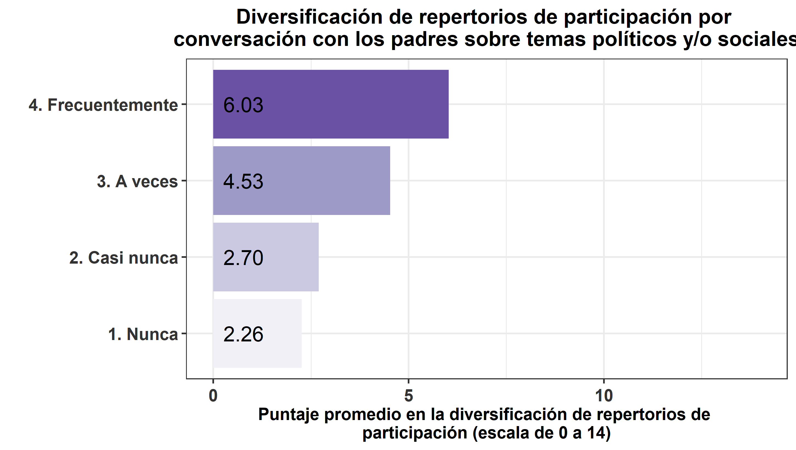

### Participación política durante el 2020

```{r}
### Recodificar variables
data_wide$part_pol_firma_20_rec = ifelse(data_wide$part_pol_firma_20==1|data_wide$part_pol_firma_20==2,0,1)
data_wide$part_pol_marc_pac_20_rec = ifelse(data_wide$part_pol_marc_pac_20==1|data_wide$part_pol_marc_pac_20==2,0,1)
data_wide$part_pol_marc_dis_20_rec = ifelse(data_wide$part_pol_marc_dis_20==1|data_wide$part_pol_marc_dis_20==2,0,1)
data_wide$part_pol_bloq_20_rec = ifelse(data_wide$part_pol_bloq_20==1|data_wide$part_pol_bloq_20==2,0,1)
data_wide$part_pol_rayar_20_rec = ifelse(data_wide$part_pol_rayar_20==1|data_wide$part_pol_rayar_20==2,0,1)
data_wide$part_pol_toma_20_rec = ifelse(data_wide$part_pol_toma_20==1|data_wide$part_pol_toma_20==2,0,1)
data_wide$part_pol_com_20_rec = ifelse(data_wide$part_pol_com_20==1|data_wide$part_pol_com_20==2,0,1)
data_wide$marcha_amig_20_rec = ifelse(data_wide$marcha_amig_20==1|data_wide$marcha_amig_20==2,0,1)
data_wide$marcha_pad_20_rec = ifelse(data_wide$marcha_pad_20==1|data_wide$marcha_pad_20==2,0,1)
data_wide$marcha_fam_20_rec = ifelse(data_wide$marcha_fam_20==1|data_wide$marcha_fam_20==2,0,1)
data_wide$part_pol_online_info_20_rec = ifelse(data_wide$part_pol_online_info_20==1|data_wide$part_pol_online_info_20==2,0,1)
data_wide$part_pol_online_post_20_rec = ifelse(data_wide$part_pol_online_post_20==1|data_wide$part_pol_online_post_20==2,0,1)
data_wide$part_pol_online_com_20_rec = ifelse(data_wide$part_pol_online_com_20==1|data_wide$part_pol_online_com_20==2,0,1)
data_wide$part_pol_online_seg_20_rec = ifelse(data_wide$part_pol_online_seg_20==1|data_wide$part_pol_online_seg_20==2,0,1)
```

```{r}
### Crear variable
data_wide$part_pol_20 = as.numeric(data_wide$part_pol_firma_20_rec + data_wide$part_pol_marc_pac_20_rec + data_wide$part_pol_marc_dis_20_rec + data_wide$part_pol_bloq_20_rec + data_wide$part_pol_rayar_20_rec + data_wide$part_pol_toma_20_rec + data_wide$part_pol_com_20_rec + data_wide$marcha_amig_20_rec + data_wide$marcha_pad_20_rec + data_wide$marcha_fam_20_rec + data_wide$part_pol_online_info_20_rec + data_wide$part_pol_online_post_20_rec + data_wide$part_pol_online_com_20_rec + data_wide$part_pol_online_seg_20_rec)
```

```{r}
# Creación de bbdd
data_nunca = data_wide %>%  filter(conv_padres_20==1) %>% as.data.frame() # Nunca
data_casi_nunca = data_wide %>%  filter(conv_padres_20==2) %>% as.data.frame() # Casi nunca
data_a_veces = data_wide %>%  filter(conv_padres_20==3) %>% as.data.frame() # A veces
data_frecuent = data_wide %>%  filter(conv_padres_20==4) %>% as.data.frame() # Frecuentemente
```

```{r}
table_preposh1<- rbind(psych::describe(data_nunca$part_pol_20, na.rm=T),
               psych::describe(data_casi_nunca$part_pol_20, na.rm=T),
               psych::describe(data_a_veces$part_pol_20, na.rm=T),
               psych::describe(data_frecuent$part_pol_20, na.rm=T))
table_preposh1 <- table_preposh1 %>% select(n,mean,sd,median,trimmed,min,max)

pond1 <- stats::weighted.mean(x=data_nunca$part_pol_20,y=data_nunca$weight_w01,na.rm=TRUE)
pond2 <- stats::weighted.mean(x=data_casi_nunca$part_pol_20,y=data_casi_nunca$weight_w01,na.rm=TRUE)
pond3 <- stats::weighted.mean(x=data_a_veces$part_pol_20,y=data_a_veces$weight_w01,na.rm=TRUE)
pond4 <- stats::weighted.mean(x=data_frecuent$part_pol_20,y=data_frecuent$weight_w01,na.rm=TRUE)

table_preposh1[1,2]<-pond1
table_preposh1[2,2]<-pond2
table_preposh1[3,2]<-pond3
table_preposh1[4,2]<-pond4

table_preposh1$dep <- c("1. Nunca","2. Casi nunca","3. A veces", "4. Frecuentemente")

part_pol_20_colegio <-  ggplot(data=table_preposh1, aes(x=dep, y=mean, fill=dep)) +
     geom_bar(position = 'dodge', stat='identity')+#,width=0.8) 
     scale_fill_brewer(palette="Purples") +
     geom_text(aes(label=format(round(mean,2)), y=0), position=position_dodge(0.9), hjust=-0.25, size=6) +
     theme_bw(base_size = 14) +
     scale_y_continuous(labels = scales::comma) +
     ylab('Puntaje promedio en la diversificación de repertorios de 
participación (escala de 0 a 14)') + xlab(' ') + 
     theme(legend.position="top") +
     labs(fill = " ") +
    coord_flip()+
    theme(axis.text.x = element_text(colour = "grey20", size = 14, angle = 360, hjust = 0.5, vjust = 0.5, face = "bold"),
          axis.text.y = element_text(colour = "grey20", size = 14), 
          text = element_text(size = 14, face = "bold"),
          plot.title = element_text(hjust=0.5),
          legend.position = "none") + 
     ggtitle("Diversificación de repertorios de participación por 
conversación con los padres sobre temas políticos y/o sociales") + ylim(0,14)
#part_pol_20_colegio
ggsave(part_pol_20_colegio, file = "../output/graphs/part_pol_20_colegio_conv_padres.png",device = "png",width = 23,height = 13,dpi = "retina",units = "cm")
```

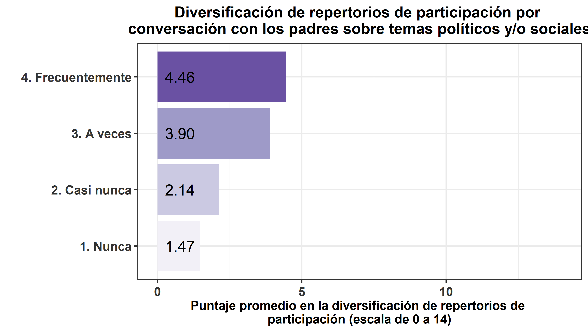

### Participación política durante el primer semestre de 2021

```{r,echo=FALSE}
#### Recodificar variables
data_wide$part_pol_firma.x_rec = ifelse(data_wide$part_pol_firma.x==1|data_wide$part_pol_firma.x==2,0,1)
data_wide$part_pol_marc_pac_rec = ifelse(data_wide$part_pol_marc_pac==1|data_wide$part_pol_marc_pac==2,0,1)
data_wide$part_pol_marc_dis_rec = ifelse(data_wide$part_pol_marc_dis==1|data_wide$part_pol_marc_dis==2,0,1)
data_wide$part_pol_bloq_rec = ifelse(data_wide$part_pol_bloq==1|data_wide$part_pol_bloq==2,0,1)
data_wide$part_pol_rayar.x_rec = ifelse(data_wide$part_pol_rayar.x==1|data_wide$part_pol_rayar.x==2,0,1)
data_wide$part_pol_toma.x_rec = ifelse(data_wide$part_pol_toma.x==1|data_wide$part_pol_toma.x==2,0,1)
data_wide$part_pol_com_rec = ifelse(data_wide$part_pol_com==1|data_wide$part_pol_com==2,0,1)
data_wide$marcha_amig.x_rec = ifelse(data_wide$marcha_amig.x==1|data_wide$marcha_amig.x==2,0,1)
data_wide$marcha_pad.x_rec = ifelse(data_wide$marcha_pad.x==1|data_wide$marcha_pad.x==2,0,1)
data_wide$marcha_fam.x_rec = ifelse(data_wide$marcha_fam.x==1|data_wide$marcha_fam.x==2,0,1)
data_wide$part_pol_online_info_rec = ifelse(data_wide$part_pol_online_info==1|data_wide$part_pol_online_info==2,0,1)
data_wide$part_pol_online_post_rec = ifelse(data_wide$part_pol_online_post==1|data_wide$part_pol_online_post==2,0,1)
data_wide$part_pol_online_com_rec = ifelse(data_wide$part_pol_online_com==1|data_wide$part_pol_online_com==2,0,1)
data_wide$part_pol_online_seg_rec = ifelse(data_wide$part_pol_online_seg==1|data_wide$part_pol_online_seg==2,0,1)
```

```{r}
#### Crear variable
data_wide$part_pol_21_1s = as.numeric(data_wide$part_pol_firma.x_rec + data_wide$part_pol_marc_pac_rec + data_wide$part_pol_marc_dis_rec + data_wide$part_pol_bloq_rec + data_wide$part_pol_rayar.x_rec + data_wide$part_pol_toma.x_rec + data_wide$part_pol_com_rec + data_wide$marcha_amig.x_rec + data_wide$marcha_pad.x_rec + data_wide$marcha_fam.x_rec + data_wide$part_pol_online_info_rec + data_wide$part_pol_online_post_rec + data_wide$part_pol_online_com_rec + data_wide$part_pol_online_seg_rec)
```

```{r}
# Creación de bbdd
data_nunca = data_wide %>%  filter(conv_padres==1) %>% as.data.frame() # Nunca
data_casi_nunca = data_wide %>%  filter(conv_padres==2) %>% as.data.frame() # Casi nunca
data_a_veces = data_wide %>%  filter(conv_padres==3) %>% as.data.frame() # A veces
data_frecuent = data_wide %>%  filter(conv_padres==4) %>% as.data.frame() # Frecuentemente
```

```{r}
table_preposh1<- rbind(psych::describe(data_nunca$part_pol_21_1s, na.rm=T),
               psych::describe(data_casi_nunca$part_pol_21_1s, na.rm=T),
               psych::describe(data_a_veces$part_pol_21_1s, na.rm=T),
               psych::describe(data_frecuent$part_pol_21_1s, na.rm=T))
table_preposh1 <- table_preposh1 %>% select(n,mean,sd,median,trimmed,min,max)

pond1 <- stats::weighted.mean(x=data_nunca$part_pol_21_1s,y=data_nunca$weight_w01,na.rm=TRUE)
pond2 <- stats::weighted.mean(x=data_casi_nunca$part_pol_21_1s,y=data_casi_nunca$weight_w01,na.rm=TRUE)
pond3 <- stats::weighted.mean(x=data_a_veces$part_pol_21_1s,y=data_a_veces$weight_w01,na.rm=TRUE)
pond4 <- stats::weighted.mean(x=data_frecuent$part_pol_21_1s,y=data_frecuent$weight_w01,na.rm=TRUE)

table_preposh1[1,2]<-pond1
table_preposh1[2,2]<-pond2
table_preposh1[3,2]<-pond3
table_preposh1[4,2]<-pond4

table_preposh1$dep <- c("1. Nunca","2. Casi nunca","3. A veces", "4. Frecuentemente")

part_pol_21_1s_colegio <-  ggplot(data=table_preposh1, aes(x=dep, y=mean, fill=dep)) +
     geom_bar(position = 'dodge', stat='identity')+#,width=0.8) 
     scale_fill_brewer(palette="Purples") +
     geom_text(aes(label=format(round(mean,2)), y=0), position=position_dodge(0.9), hjust=-0.25, size=6) +
     theme_bw(base_size = 14) +
     scale_y_continuous(labels = scales::comma) +
     ylab('Puntaje promedio en la diversificación de repertorios de 
participación (escala de 0 a 14)') + xlab(' ') + 
     theme(legend.position="top") +
     labs(fill = " ") +
    coord_flip()+
    theme(axis.text.x = element_text(colour = "grey20", size = 14, angle = 360, hjust = 0.5, vjust = 0.5, face = "bold"),
          axis.text.y = element_text(colour = "grey20", size = 14), 
          text = element_text(size = 14, face = "bold"),
          plot.title = element_text(hjust=0.5),
          legend.position = "none") + 
     ggtitle("Diversificación de repertorios de participación por 
conversación con los padres sobre temas políticos y/o sociales") + ylim(0,14)
#part_pol_21_1s_colegio
ggsave(part_pol_21_1s_colegio, file = "../output/graphs/part_pol_21_1s_colegio_conv_padres.png",device = "png",width = 23,height = 13,dpi = "retina",units = "cm")
```

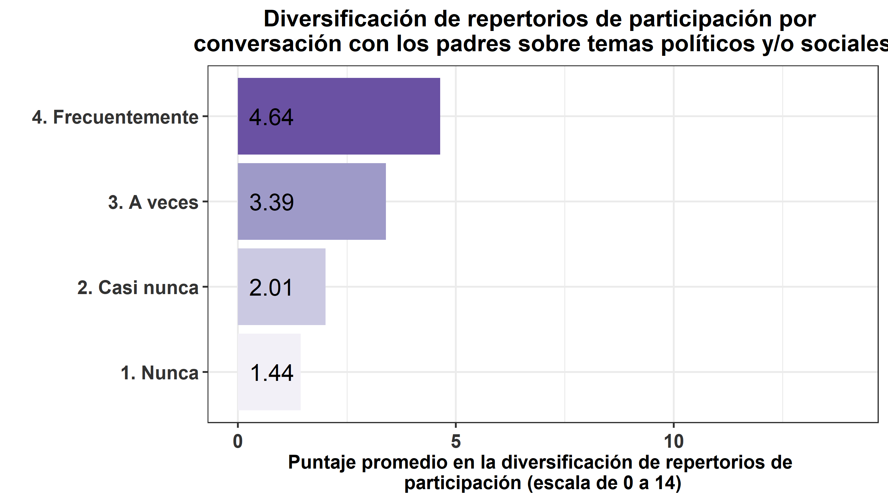

### Participación política durante el segundo semestre de 2021

```{r,echo=FALSE}
#### Recodificar variables
data_wide$part_pol_firma_21b_rec = ifelse(data_wide$part_pol_firma_21b==1|data_wide$part_pol_firma_21b==2,0,1)
data_wide$part_pol_marc_pac_21b_rec = ifelse(data_wide$part_pol_marc_pac_21b==1|data_wide$part_pol_marc_pac_21b==2,0,1)
data_wide$part_pol_marc_dis_21b_rec = ifelse(data_wide$part_pol_marc_dis_21b==1|data_wide$part_pol_marc_dis_21b==2,0,1)
data_wide$part_pol_bloq_21b_rec = ifelse(data_wide$part_pol_bloq_21b==1|data_wide$part_pol_bloq_21b==2,0,1)
data_wide$part_pol_rayar_21b_rec = ifelse(data_wide$part_pol_rayar_21b==1|data_wide$part_pol_rayar_21b==2,0,1)
data_wide$part_pol_toma_21b_rec = ifelse(data_wide$part_pol_toma_21b==1|data_wide$part_pol_toma_21b==2,0,1)
data_wide$part_pol_com_21b_rec = ifelse(data_wide$part_pol_com_21b==1|data_wide$part_pol_com_21b==2,0,1)
data_wide$marcha_amig_21b_rec = ifelse(data_wide$marcha_amig_21b==1|data_wide$marcha_amig_21b==2,0,1)
data_wide$marcha_pad_21b_rec = ifelse(data_wide$marcha_pad_21b==1|data_wide$marcha_pad_21b==2,0,1)
data_wide$marcha_fam_21b_rec = ifelse(data_wide$marcha_fam_21b==1|data_wide$marcha_fam_21b==2,0,1)
data_wide$part_pol_online_info_21b_rec = ifelse(data_wide$part_pol_online_info_21b==1|data_wide$part_pol_online_info_21b==2,0,1)
data_wide$part_pol_online_post_21b_rec = ifelse(data_wide$part_pol_online_post_21b==1|data_wide$part_pol_online_post_21b==2,0,1)
data_wide$part_pol_online_com_21b_rec = ifelse(data_wide$part_pol_online_com_21b==1|data_wide$part_pol_online_com_21b==2,0,1)
data_wide$part_pol_online_seg_21b_rec = ifelse(data_wide$part_pol_online_seg_21b==1|data_wide$part_pol_online_seg_21b==2,0,1)
```

```{r}
#### Crear variable
data_wide$part_pol_21_2s = as.numeric(data_wide$part_pol_firma_21b_rec + data_wide$part_pol_marc_pac_21b_rec + data_wide$part_pol_marc_dis_21b_rec + data_wide$part_pol_bloq_21b_rec + data_wide$part_pol_rayar_21b_rec + data_wide$part_pol_toma_21b_rec + data_wide$part_pol_com_21b_rec + data_wide$marcha_amig_21b_rec + data_wide$marcha_pad_21b_rec + data_wide$marcha_fam_21b_rec + data_wide$part_pol_online_info_21b_rec + data_wide$part_pol_online_post_21b_rec + data_wide$part_pol_online_com_21b_rec + data_wide$part_pol_online_seg_21b_rec)
```

```{r}
# Creación de bbdd
data_nunca = data_wide %>%  filter(conv_padres_21b==1) %>% as.data.frame() # Nunca
data_casi_nunca = data_wide %>%  filter(conv_padres_21b==2) %>% as.data.frame() # Casi nunca
data_a_veces = data_wide %>%  filter(conv_padres_21b==3) %>% as.data.frame() # A veces
data_frecuent = data_wide %>%  filter(conv_padres_21b==4) %>% as.data.frame() # Frecuentemente
```

```{r}
table_preposh1<- rbind(psych::describe(data_nunca$part_pol_21_2s, na.rm=T),
               psych::describe(data_casi_nunca$part_pol_21_2s, na.rm=T),
               psych::describe(data_a_veces$part_pol_21_2s, na.rm=T),
               psych::describe(data_frecuent$part_pol_21_2s, na.rm=T))
table_preposh1 <- table_preposh1 %>% select(n,mean,sd,median,trimmed,min,max)

pond1 <- stats::weighted.mean(x=data_nunca$part_pol_21_2s,y=data_nunca$weight_w01,na.rm=TRUE)
pond2 <- stats::weighted.mean(x=data_casi_nunca$part_pol_21_2s,y=data_casi_nunca$weight_w01,na.rm=TRUE)
pond3 <- stats::weighted.mean(x=data_a_veces$part_pol_21_2s,y=data_a_veces$weight_w01,na.rm=TRUE)
pond4 <- stats::weighted.mean(x=data_frecuent$part_pol_21_2s,y=data_frecuent$weight_w01,na.rm=TRUE)

table_preposh1[1,2]<-pond1
table_preposh1[2,2]<-pond2
table_preposh1[3,2]<-pond3
table_preposh1[4,2]<-pond4

table_preposh1$dep <- c("1. Nunca","2. Casi nunca","3. A veces", "4. Frecuentemente")

part_pol_21_2s_colegio <-  ggplot(data=table_preposh1, aes(x=dep, y=mean, fill=dep)) +
     geom_bar(position = 'dodge', stat='identity')+#,width=0.8) 
     scale_fill_brewer(palette="Purples") +
     geom_text(aes(label=format(round(mean,2)), y=0), position=position_dodge(0.9), hjust=-0.25, size=6) +
     theme_bw(base_size = 14) +
     scale_y_continuous(labels = scales::comma) +
     ylab('Puntaje promedio en la diversificación de repertorios de 
participación (escala de 0 a 14)') + xlab(' ') + 
     theme(legend.position="top") +
     labs(fill = " ") +
    coord_flip()+
    theme(axis.text.x = element_text(colour = "grey20", size = 14, angle = 360, hjust = 0.5, vjust = 0.5, face = "bold"),
          axis.text.y = element_text(colour = "grey20", size = 14), 
          text = element_text(size = 14, face = "bold"),
          plot.title = element_text(hjust=0.5),
          legend.position = "none") + 
     ggtitle("Diversificación de repertorios de participación por 
conversación con los padres sobre temas políticos y/o sociales") + ylim(0,14)
#part_pol_21_2s_colegio
ggsave(part_pol_21_2s_colegio, file = "../output/graphs/part_pol_21_2s_colegio_conv_padres.png",device = "png",width = 23,height = 13,dpi = "retina",units = "cm")
```
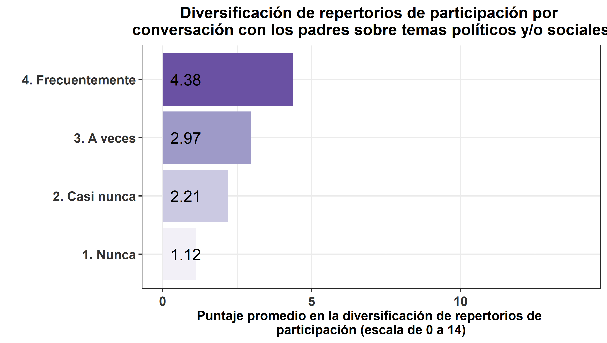

# Activismo no disruptivo
## Dependencia administrativa establecimiento
### Participación política durante 3ro y 4to medio
```{r}
### Crear variable
#data_wide$part_act_no_dis_3y4 <- as.numeric(data_wide$part_pol_firma.y + data_wide$part_pol_marcha_pas)/2
data_wide$part_act_no_dis_3y4 <- as.numeric(data_wide$part_pol_marcha_pas)
```

```{r}
# Creación de bbdd
data_mun = data_wide %>%  filter(edm_admi==1) %>% as.data.frame() #Municipal
data_sub = data_wide %>%  filter(edm_admi==2) %>% as.data.frame() #Particular Subvencionado
data_priv = data_wide %>%  filter(edm_admi==3) %>% as.data.frame() #Particular pagado
```

```{r}
table_preposh1<- rbind(psych::describe(data_mun$part_act_no_dis_3y4, na.rm=T),
               psych::describe(data_sub$part_act_no_dis_3y4, na.rm=T),psych::describe(data_priv$part_act_no_dis_3y4, na.rm=T))
table_preposh1 <- table_preposh1 %>% select(n,mean,sd,median,trimmed,min,max)
pond1 <- stats::weighted.mean(x=data_mun$part_act_no_dis_3y4,y=data_mun$weight_w01,na.rm=TRUE)
pond2 <- stats::weighted.mean(x=data_sub$part_act_no_dis_3y4,y=data_sub$weight_w01,na.rm=TRUE)
pond3 <- stats::weighted.mean(x=data_priv$part_act_no_dis_3y4,y=data_priv$weight_w01,na.rm=TRUE)

table_preposh1[1,2]<-pond1
table_preposh1[2,2]<-pond2
table_preposh1[3,2]<-pond3

table_preposh1$dep <- c("Municipal","Particular Subvencionado","Particular Privado")

part_act_no_dis_3y4_colegio <-  ggplot(data=table_preposh1, aes(x=dep, y=mean, fill=dep)) +
     geom_bar(position = 'dodge', stat='identity')+#,width=0.8) 
     scale_fill_brewer(palette="Purples") +
     geom_text(aes(label=format(round(mean,2)), y=0), position=position_dodge(0.9), hjust=-0.25, size=6) +
     theme_bw(base_size = 14) +
     scale_y_continuous(labels = scales::comma) +
     ylab('Puntaje promedio en participación activista 
no disruptiva (escala de 1 a 4)') + xlab(' ') + 
     theme(legend.position="top") +
     labs(fill = " ") +
    coord_flip()+
    theme(axis.text.x = element_text(colour = "grey20", size = 14, angle = 360, hjust = 0.5, vjust = 0.5, face = "bold"),
          axis.text.y = element_text(colour = "grey20", size = 14), 
          text = element_text(size = 14, face = "bold"),
          plot.title = element_text(hjust=0.5),
          legend.position = "none") + 
     ggtitle("Participación activista no disruptiva por 
tipo de dependencia administrativa de la escuela") + ylim(0,4)
#part_act_no_dis_3y4_colegio
ggsave(part_act_no_dis_3y4_colegio, file = "../output/graphs/part_act_no_dis_3y4_colegio_dep.png",device = "png",width = 23,height = 13,dpi = "retina",units = "cm")

```


### Participación política durante estallido social

```{r}
### Crear variable
#data_wide$part_act_no_dis_es <- as.numeric(data_wide$part_pol_firma_21 + data_wide$part_pol_marc_pac_21)/2
data_wide$part_act_no_dis_es <- as.numeric(data_wide$part_pol_marc_pac_21)
```

```{r}
# Creación de bbdd
data_mun = data_wide %>%  filter(edm_admi==1) %>% as.data.frame() #Municipal
data_sub = data_wide %>%  filter(edm_admi==2) %>% as.data.frame() #Particular Subvencionado
data_priv = data_wide %>%  filter(edm_admi==3) %>% as.data.frame() #Particular pagado
```

```{r}
table_preposh1<- rbind(psych::describe(data_mun$part_act_no_dis_es, na.rm=T),
               psych::describe(data_sub$part_act_no_dis_es, na.rm=T),psych::describe(data_priv$part_act_no_dis_es, na.rm=T))
table_preposh1 <- table_preposh1 %>% select(n,mean,sd,median,trimmed,min,max)

pond1 <- stats::weighted.mean(x=data_mun$part_act_no_dis_es,y=data_mun$weight_w01,na.rm=TRUE)
pond2 <- stats::weighted.mean(x=data_sub$part_act_no_dis_es,y=data_sub$weight_w01,na.rm=TRUE)
pond3 <- stats::weighted.mean(x=data_priv$part_act_no_dis_es,y=data_priv$weight_w01,na.rm=TRUE)

table_preposh1[1,2]<-pond1
table_preposh1[2,2]<-pond2
table_preposh1[3,2]<-pond3

table_preposh1$dep <- c("Municipal","Particular Subvencionado","Particular Privado")

part_act_no_dis_es_colegio <-  ggplot(data=table_preposh1, aes(x=dep, y=mean, fill=dep)) +
     geom_bar(position = 'dodge', stat='identity')+#,width=0.8) 
     scale_fill_brewer(palette="Purples") +
     geom_text(aes(label=format(round(mean,2)), y=0), position=position_dodge(0.9), hjust=-0.25, size=6) +
     theme_bw(base_size = 14) +
     scale_y_continuous(labels = scales::comma) +
     ylab('Puntaje promedio en participación activista 
no disruptiva (escala de 1 a 4)') + xlab(' ') + 
  theme(legend.position="top") +
     labs(fill = " ") +
    coord_flip()+
    theme(axis.text.x = element_text(colour = "grey20", size = 14, angle = 360, hjust = 0.5, vjust = 0.5, face = "bold"),
          axis.text.y = element_text(colour = "grey20", size = 14), 
          text = element_text(size = 14, face = "bold"),
          plot.title = element_text(hjust=0.5),
          legend.position = "none") + 
     ggtitle("Participación activista no disruptiva por 
tipo de dependencia administrativa de la escuela") + ylim(0,4)
#part_act_no_dis_es_colegio
ggsave(part_act_no_dis_es_colegio, file = "../output/graphs/part_act_no_dis_es_colegio_dep.png",device = "png",width = 23,height = 13,dpi = "retina",units = "cm")

```


### Participación política durante el 2020

```{r}
### Crear variable
#data_wide$part_act_no_dis_20 = as.numeric(data_wide$part_pol_firma_20 + data_wide$part_pol_marc_pac_20)/2
data_wide$part_act_no_dis_20 = as.numeric(data_wide$part_pol_marc_pac_20)
```

```{r}
# Creación de bbdd
data_mun = data_wide %>%  filter(edm_admi==1) %>% as.data.frame() #Municipal
data_sub = data_wide %>%  filter(edm_admi==2) %>% as.data.frame() #Particular Subvencionado
data_priv = data_wide %>%  filter(edm_admi==3) %>% as.data.frame() #Particular pagado
```

```{r}
table_preposh1<- rbind(psych::describe(data_mun$part_act_no_dis_20, na.rm=T),
               psych::describe(data_sub$part_act_no_dis_20, na.rm=T),psych::describe(data_priv$part_act_no_dis_20, na.rm=T))
table_preposh1 <- table_preposh1 %>% select(n,mean,sd,median,trimmed,min,max)

pond1 <- stats::weighted.mean(x=data_mun$part_act_no_dis_20,y=data_mun$weight_w01,na.rm=TRUE)
pond2 <- stats::weighted.mean(x=data_sub$part_act_no_dis_20,y=data_sub$weight_w01,na.rm=TRUE)
pond3 <- stats::weighted.mean(x=data_priv$part_act_no_dis_20,y=data_priv$weight_w01,na.rm=TRUE)

table_preposh1[1,2]<-pond1
table_preposh1[2,2]<-pond2
table_preposh1[3,2]<-pond3

table_preposh1$dep <- c("Municipal","Particular Subvencionado","Particular Privado")

part_act_no_dis_20_colegio <-  ggplot(data=table_preposh1, aes(x=dep, y=mean, fill=dep)) +
     geom_bar(position = 'dodge', stat='identity')+#,width=0.8) 
     scale_fill_brewer(palette="Purples") +
     geom_text(aes(label=format(round(mean,2)), y=0), position=position_dodge(0.9), hjust=-0.25, size=6) +
     theme_bw(base_size = 14) +
     scale_y_continuous(labels = scales::comma) +
          ylab('Puntaje promedio en participación activista 
no disruptiva (escala de 1 a 4)') + xlab(' ') +  
     theme(legend.position="top") +
     labs(fill = " ") +
    coord_flip()+
    theme(axis.text.x = element_text(colour = "grey20", size = 14, angle = 360, hjust = 0.5, vjust = 0.5, face = "bold"),
          axis.text.y = element_text(colour = "grey20", size = 14), 
          text = element_text(size = 14, face = "bold"),
          plot.title = element_text(hjust=0.5),
          legend.position = "none") + 
     ggtitle("Participación activista no disruptiva por 
tipo de dependencia administrativa de la escuela") + ylim(0,4)
#part_act_no_dis_20_colegio
ggsave(part_act_no_dis_20_colegio, file = "../output/graphs/part_act_no_dis_20_colegio_dep.png",device = "png",width = 23,height = 13,dpi = "retina",units = "cm")
```


### Participación política durante el primer semestre de 2021

```{r}
#### Crear variable
#data_wide$part_act_no_dis_21_1s = as.numeric(data_wide$part_pol_firma.x + data_wide$part_pol_marc_pac)/2
data_wide$part_act_no_dis_21_1s = as.numeric(data_wide$part_pol_marc_pac)
```

```{r}
# Creación de bbdd
data_mun = data_wide %>%  filter(edm_admi==1) %>% as.data.frame() #Municipal
data_sub = data_wide %>%  filter(edm_admi==2) %>% as.data.frame() #Particular Subvencionado
data_priv = data_wide %>%  filter(edm_admi==3) %>% as.data.frame() #Particular pagado
```

```{r}
table_preposh1<- rbind(psych::describe(data_mun$part_act_no_dis_21_1s, na.rm=T),
               psych::describe(data_sub$part_act_no_dis_21_1s, na.rm=T),psych::describe(data_priv$part_act_no_dis_21_1s, na.rm=T))
table_preposh1 <- table_preposh1 %>% select(n,mean,sd,median,trimmed,min,max)

pond1 <- stats::weighted.mean(x=data_mun$part_act_no_dis_21_1s,y=data_mun$weight_w02,na.rm=TRUE)
pond2 <- stats::weighted.mean(x=data_sub$part_act_no_dis_21_1s,y=data_sub$weight_w02,na.rm=TRUE)
pond3 <- stats::weighted.mean(x=data_priv$part_act_no_dis_21_1s,y=data_priv$weight_w02,na.rm=TRUE)

table_preposh1[1,2]<-pond1
table_preposh1[2,2]<-pond2
table_preposh1[3,2]<-pond3

table_preposh1$dep <- c("Municipal","Particular Subvencionado","Particular Privado")

part_act_no_dis_21_1s_colegio <-  ggplot(data=table_preposh1, aes(x=dep, y=mean, fill=dep)) +
     geom_bar(position = 'dodge', stat='identity')+#,width=0.8) 
     scale_fill_brewer(palette="Purples") +
     geom_text(aes(label=format(round(mean,2)), y=0), position=position_dodge(0.9), hjust=-0.25, size=6) +
     theme_bw(base_size = 14) +
     scale_y_continuous(labels = scales::comma) +
     ylab('Puntaje promedio en participación activista 
no disruptiva (escala de 1 a 4)') + xlab(' ') + 
     theme(legend.position="top") +
     labs(fill = " ") +
    coord_flip()+
    theme(axis.text.x = element_text(colour = "grey20", size = 14, angle = 360, hjust = 0.5, vjust = 0.5, face = "bold"),
          axis.text.y = element_text(colour = "grey20", size = 14), 
          text = element_text(size = 14, face = "bold"),
          plot.title = element_text(hjust=0.5),
          legend.position = "none") + 
     ggtitle("Participación activista no disruptiva por 
tipo de dependencia administrativa de la escuela") + ylim(0,4)
#part_act_no_dis_21_1s_colegio
ggsave(part_act_no_dis_21_1s_colegio, file = "../output/graphs/part_act_no_dis_21_1s_colegio_dep.png",device = "png",width = 23,height = 13,dpi = "retina",units = "cm")
```


### Participación política durante el segundo semestre de 2021

```{r}
#### Crear variable
#data_wide$part_act_no_dis_21_2s = as.numeric(data_wide$part_pol_firma_21b + data_wide$part_pol_marc_pac_21b)/2
data_wide$part_act_no_dis_21_2s = as.numeric(data_wide$part_pol_marc_pac_21b)
```

```{r}
# Creación de bbdd
data_mun = data_wide %>%  filter(edm_admi==1) %>% as.data.frame() #Municipal
data_sub = data_wide %>%  filter(edm_admi==2) %>% as.data.frame() #Particular Subvencionado
data_priv = data_wide %>%  filter(edm_admi==3) %>% as.data.frame() #Particular pagado
```

```{r}
table_preposh1<- rbind(psych::describe(data_mun$part_act_no_dis_21_2s, na.rm=T),
               psych::describe(data_sub$part_act_no_dis_21_2s, na.rm=T),psych::describe(data_priv$part_act_no_dis_21_2s, na.rm=T))
table_preposh1 <- table_preposh1 %>% select(n,mean,sd,median,trimmed,min,max)

pond1 <- stats::weighted.mean(x=data_mun$part_act_no_dis_21_2s,y=data_mun$weight_w03,na.rm=TRUE)
pond2 <- stats::weighted.mean(x=data_sub$part_act_no_dis_21_2s,y=data_sub$weight_w03,na.rm=TRUE)
pond3 <- stats::weighted.mean(x=data_priv$part_act_no_dis_21_2s,y=data_priv$weight_w03,na.rm=TRUE)

table_preposh1[1,2]<-pond1
table_preposh1[2,2]<-pond2
table_preposh1[3,2]<-pond3

table_preposh1$dep <- c("Municipal","Particular Subvencionado","Particular Privado")

part_act_no_dis_21_2s_colegio <-  ggplot(data=table_preposh1, aes(x=dep, y=mean, fill=dep)) +
     geom_bar(position = 'dodge', stat='identity')+#,width=0.8) 
     scale_fill_brewer(palette="Purples") +
     geom_text(aes(label=format(round(mean,2)), y=0), position=position_dodge(0.9), hjust=-0.25, size=6) +
     theme_bw(base_size = 14) +
     scale_y_continuous(labels = scales::comma) +
     ylab('Puntaje promedio en participación activista 
no disruptiva (escala de 1 a 4)') + xlab(' ') + 
     theme(legend.position="top") +
     labs(fill = " ") +
    coord_flip()+
    theme(axis.text.x = element_text(colour = "grey20", size = 14, angle = 360, hjust = 0.5, vjust = 0.5, face = "bold"),
          axis.text.y = element_text(colour = "grey20", size = 14), 
          text = element_text(size = 14, face = "bold"),
          plot.title = element_text(hjust=0.5),
          legend.position = "none") + 
     ggtitle("Participación activista no disruptiva por 
tipo de dependencia administrativa de la escuela") + ylim(0,4)
#part_act_no_dis_21_2s_colegio
ggsave(part_act_no_dis_21_2s_colegio, file = "../output/graphs/part_act_no_dis_21_2s_colegio_dep.png",device = "png",width = 23,height = 13,dpi = "retina",units = "cm")
```
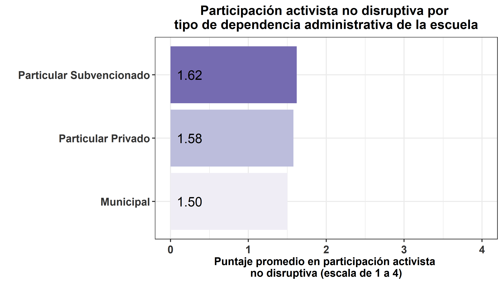


## Máximo nivel educativo de la madre
### Participación política durante 3ro y 4to medio

```{r}
### Crear variable
data_wide$part_act_no_dis_3y4 <- as.numeric(data_wide$part_pol_firma.y + data_wide$part_pol_marcha_pas)/2
```

```{r}
# Creación de bbdd
data_ed_bas = data_wide %>%  filter(nse_madre==1 | nse_madre==2 | nse_madre==3 | nse_madre==4) %>% as.data.frame() # Sin Ed. (1), Ed. básica incompleta (2) o completa (3)
data_ed_med = data_wide %>%  filter(nse_madre==4 | nse_madre==5) %>% as.data.frame() # Ed. media incompleta (4) o completa (5)
data_ed_ter = data_wide %>%  filter(nse_madre==6 | nse_madre==7 | nse_madre==8 | nse_madre==9 | nse_madre==10) %>% as.data.frame() # técnico superior incompleto (6) o completo (7) Universitaria incompleta (8) o completa (9), Estudios de postgrado (magíster o doctorado) (10)

#data_ed_tec = data_wide %>%  filter(nse_madre==6 | nse_madre==7) %>% as.data.frame() # técnico superior incompleto (6) o completo (7)
#data_ed_uni = data_wide %>%  filter(nse_madre==8 | nse_madre==9 | nse_madre==10) %>% as.data.frame() # Universitaria incompleta (8) o completa (9), Estudios de postgrado (magíster o doctorado) (10)
```

```{r}
table_preposh1<- rbind(psych::describe(data_ed_bas$part_act_no_dis_3y4, na.rm=T),
               psych::describe(data_ed_med$part_act_no_dis_3y4, na.rm=T),
               psych::describe(data_ed_ter$part_act_no_dis_3y4, na.rm=T))#,
#               psych::describe(data_ed_uni$part_act_no_dis_3y4, na.rm=T))
table_preposh1 <- table_preposh1 %>% select(n,mean,sd,median,trimmed,min,max)

pond1 <- stats::weighted.mean(x=data_ed_bas$part_act_no_dis_3y4,y=data_ed_bas$weight_w01,na.rm=TRUE)
pond2 <- stats::weighted.mean(x=data_ed_med$part_act_no_dis_3y4,y=data_ed_med$weight_w01,na.rm=TRUE)
pond3 <- stats::weighted.mean(x=data_ed_ter$part_act_no_dis_3y4,y=data_ed_ter$weight_w01,na.rm=TRUE)
#pond4 <- stats::weighted.mean(x=data_ed_uni$part_act_no_dis_3y4,y=data_ed_uni$weight_w01,na.rm=TRUE)

table_preposh1[1,2]<-pond1
table_preposh1[2,2]<-pond2
table_preposh1[3,2]<-pond3
#table_preposh1[4,2]<-pond4

#table_preposh1$dep <- c("Ed. básica o menos","Ed. media","Técnico superior", "Universitaria o más")
table_preposh1$dep <- c("Ed. básica o menos","Ed. media","Ed. terciaria")

part_act_no_dis_3y4_colegio <-  ggplot(data=table_preposh1, aes(x=dep, y=mean, fill=dep)) +
     geom_bar(position = 'dodge', stat='identity')+#,width=0.8) 
     scale_fill_brewer(palette="Purples") +
     geom_text(aes(label=format(round(mean,2)), y=0), position=position_dodge(0.9), hjust=-0.25, size=6) +
     theme_bw(base_size = 14) +
     scale_y_continuous(labels = scales::comma) +
     ylab('Puntaje promedio en participación activista 
no disruptiva (escala de 1 a 4)') + xlab(' ') + 
  theme(legend.position="top") +
     labs(fill = " ") +
    coord_flip()+
    theme(axis.text.x = element_text(colour = "grey20", size = 14, angle = 360, hjust = 0.5, vjust = 0.5, face = "bold"),
          axis.text.y = element_text(colour = "grey20", size = 14), 
          text = element_text(size = 14, face = "bold"),
          plot.title = element_text(hjust=0.5),
          legend.position = "none") + 
     ggtitle("Participación activista no disruptiva por 
nivel educativo de la madre") + ylim(0,4)
#part_act_no_dis_3y4_colegio
ggsave(part_act_no_dis_3y4_colegio, file = "../output/graphs/part_act_no_dis_3y4_colegio_ed_madre.png",device = "png",width = 23,height = 13,dpi = "retina",units = "cm")

```


### Participación política durante estallido social

```{r}
### Crear variable
data_wide$part_act_no_dis_es <- as.numeric(data_wide$part_pol_firma_21 + data_wide$part_pol_marc_pac_21)/2
```

```{r}
# Creación de bbdd
data_ed_bas = data_wide %>%  filter(nse_madre==1 | nse_madre==2 | nse_madre==3 | nse_madre==4) %>% as.data.frame() # Sin Ed. (1), Ed. básica incompleta (2) o completa (3)
data_ed_med = data_wide %>%  filter(nse_madre==4 | nse_madre==5) %>% as.data.frame() # Ed. media incompleta (4) o completa (5)
data_ed_ter = data_wide %>%  filter(nse_madre==6 | nse_madre==7 | nse_madre==8 | nse_madre==9 | nse_madre==10) %>% as.data.frame() # técnico superior incompleto (6) o completo (7) Universitaria incompleta (8) o completa (9), Estudios de postgrado (magíster o doctorado) (10)

#data_ed_tec = data_wide %>%  filter(nse_madre==6 | nse_madre==7) %>% as.data.frame() # técnico superior incompleto (6) o completo (7)
#data_ed_uni = data_wide %>%  filter(nse_madre==8 | nse_madre==9 | nse_madre==10) %>% as.data.frame() # Universitaria incompleta (8) o completa (9), Estudios de postgrado (magíster o doctorado) (10)
```

```{r}
table_preposh1<- rbind(psych::describe(data_ed_bas$part_act_no_dis_es, na.rm=T),
               psych::describe(data_ed_med$part_act_no_dis_es, na.rm=T),
               psych::describe(data_ed_ter$part_act_no_dis_es, na.rm=T))#,
#               psych::describe(data_ed_uni$part_act_no_dis_es, na.rm=T))
table_preposh1 <- table_preposh1 %>% select(n,mean,sd,median,trimmed,min,max)

pond1 <- stats::weighted.mean(x=data_ed_bas$part_act_no_dis_es,y=data_ed_bas$weight_w01,na.rm=TRUE)
pond2 <- stats::weighted.mean(x=data_ed_med$part_act_no_dis_es,y=data_ed_med$weight_w01,na.rm=TRUE)
pond3 <- stats::weighted.mean(x=data_ed_ter$part_act_no_dis_es,y=data_ed_ter$weight_w01,na.rm=TRUE)
#pond4 <- stats::weighted.mean(x=data_ed_uni$part_act_no_dis_es,y=data_ed_uni$weight_w01,na.rm=TRUE)

table_preposh1[1,2]<-pond1
table_preposh1[2,2]<-pond2
table_preposh1[3,2]<-pond3
#table_preposh1[4,2]<-pond4

#table_preposh1$dep <- c("Ed. básica o menos","Ed. media","Técnico superior", "Universitaria o más")
table_preposh1$dep <- c("Ed. básica o menos","Ed. media","Ed. terciaria")

part_act_no_dis_es_colegio <-  ggplot(data=table_preposh1, aes(x=dep, y=mean, fill=dep)) +
     geom_bar(position = 'dodge', stat='identity')+#,width=0.8) 
     scale_fill_brewer(palette="Purples") +
     geom_text(aes(label=format(round(mean,2)), y=0), position=position_dodge(0.9), hjust=-0.25, size=6) +
     theme_bw(base_size = 14) +
     scale_y_continuous(labels = scales::comma) +
     ylab('Puntaje promedio en participación activista 
no disruptiva (escala de 1 a 4)') + xlab(' ') + 
  theme(legend.position="top") +
     labs(fill = " ") +
    coord_flip()+
    theme(axis.text.x = element_text(colour = "grey20", size = 14, angle = 360, hjust = 0.5, vjust = 0.5, face = "bold"),
          axis.text.y = element_text(colour = "grey20", size = 14), 
          text = element_text(size = 14, face = "bold"),
          plot.title = element_text(hjust=0.5),
          legend.position = "none") + 
     ggtitle("Participación activista no disruptiva por 
nivel educativo de la madre") + ylim(0,4)
#part_act_no_dis_es_colegio
ggsave(part_act_no_dis_es_colegio, file = "../output/graphs/part_act_no_dis_es_colegio_ed_madre.png",device = "png",width = 23,height = 13,dpi = "retina",units = "cm")

```
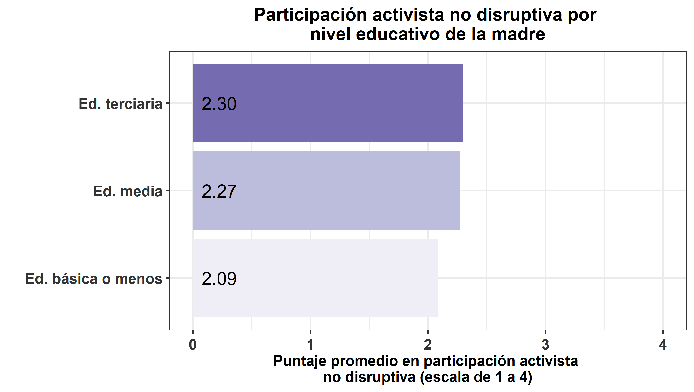

### Participación política durante el 2020

```{r}
### Crear variable
data_wide$part_act_no_dis_20 = as.numeric(data_wide$part_pol_firma_20 + data_wide$part_pol_marc_pac_20)/2
```

```{r}
# Creación de bbdd
data_ed_bas = data_wide %>%  filter(nse_madre==1 | nse_madre==2 | nse_madre==3 | nse_madre==4) %>% as.data.frame() # Sin Ed. (1), Ed. básica incompleta (2) o completa (3)
data_ed_med = data_wide %>%  filter(nse_madre==4 | nse_madre==5) %>% as.data.frame() # Ed. media incompleta (4) o completa (5)
data_ed_ter = data_wide %>%  filter(nse_madre==6 | nse_madre==7 | nse_madre==8 | nse_madre==9 | nse_madre==10) %>% as.data.frame() # técnico superior incompleto (6) o completo (7) Universitaria incompleta (8) o completa (9), Estudios de postgrado (magíster o doctorado) (10)

#data_ed_tec = data_wide %>%  filter(nse_madre==6 | nse_madre==7) %>% as.data.frame() # técnico superior incompleto (6) o completo (7)
#data_ed_uni = data_wide %>%  filter(nse_madre==8 | nse_madre==9 | nse_madre==10) %>% as.data.frame() # Universitaria incompleta (8) o completa (9), Estudios de postgrado (magíster o doctorado) (10)
```

```{r}
table_preposh1<- rbind(psych::describe(data_ed_bas$part_act_no_dis_20, na.rm=T),
               psych::describe(data_ed_med$part_act_no_dis_20, na.rm=T),
               psych::describe(data_ed_ter$part_act_no_dis_20, na.rm=T))#,
#               psych::describe(data_ed_uni$part_act_no_dis_20, na.rm=T))
table_preposh1 <- table_preposh1 %>% select(n,mean,sd,median,trimmed,min,max)

pond1 <- stats::weighted.mean(x=data_ed_bas$part_act_no_dis_20,y=data_ed_bas$weight_w01,na.rm=TRUE)
pond2 <- stats::weighted.mean(x=data_ed_med$part_act_no_dis_20,y=data_ed_med$weight_w01,na.rm=TRUE)
pond3 <- stats::weighted.mean(x=data_ed_ter$part_act_no_dis_20,y=data_ed_ter$weight_w01,na.rm=TRUE)
#pond4 <- stats::weighted.mean(x=data_ed_uni$part_act_no_dis_20,y=data_ed_uni$weight_w01,na.rm=TRUE)

table_preposh1[1,2]<-pond1
table_preposh1[2,2]<-pond2
table_preposh1[3,2]<-pond3
#table_preposh1[4,2]<-pond4

#table_preposh1$dep <- c("Ed. básica o menos","Ed. media","Técnico superior", "Universitaria o más")
table_preposh1$dep <- c("Ed. básica o menos","Ed. media","Ed. terciaria")

part_act_no_dis_20_colegio <-  ggplot(data=table_preposh1, aes(x=dep, y=mean, fill=dep)) +
     geom_bar(position = 'dodge', stat='identity')+#,width=0.8) 
     scale_fill_brewer(palette="Purples") +
     geom_text(aes(label=format(round(mean,2)), y=0), position=position_dodge(0.9), hjust=-0.25, size=6) +
     theme_bw(base_size = 14) +
     scale_y_continuous(labels = scales::comma) +
     ylab('Puntaje promedio en participación activista 
no disruptiva (escala de 1 a 4)') + xlab(' ') + 
  theme(legend.position="top") +
     labs(fill = " ") +
    coord_flip()+
    theme(axis.text.x = element_text(colour = "grey20", size = 14, angle = 360, hjust = 0.5, vjust = 0.5, face = "bold"),
          axis.text.y = element_text(colour = "grey20", size = 14), 
          text = element_text(size = 14, face = "bold"),
          plot.title = element_text(hjust=0.5),
          legend.position = "none") + 
     ggtitle("Participación activista no disruptiva por 
nivel educativo de la madre") + ylim(0,4)
#part_act_no_dis_20_colegio
ggsave(part_act_no_dis_20_colegio, file = "../output/graphs/part_act_no_dis_20_colegio_ed_madre.png",device = "png",width = 23,height = 13,dpi = "retina",units = "cm")
```

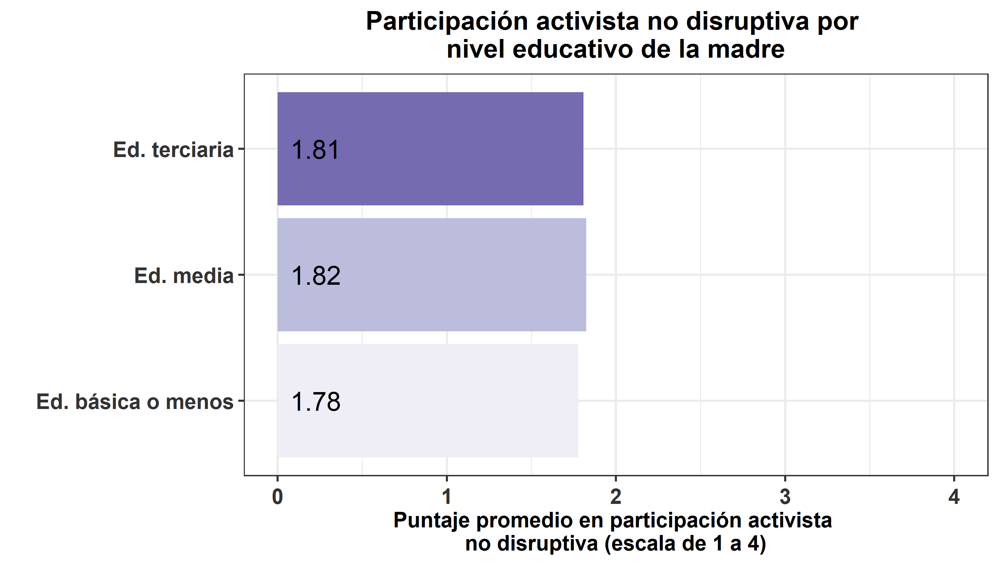

### Participación política durante el primer semestre de 2021

```{r}
#### Crear variable
data_wide$part_act_no_dis_21_1s = as.numeric(data_wide$part_pol_firma.x + data_wide$part_pol_marc_pac)/2
```

```{r}
# Creación de bbdd
data_ed_bas = data_wide %>%  filter(nse_madre==1 | nse_madre==2 | nse_madre==3 | nse_madre==4) %>% as.data.frame() # Sin Ed. (1), Ed. básica incompleta (2) o completa (3)
data_ed_med = data_wide %>%  filter(nse_madre==4 | nse_madre==5) %>% as.data.frame() # Ed. media incompleta (4) o completa (5)
data_ed_ter = data_wide %>%  filter(nse_madre==6 | nse_madre==7 | nse_madre==8 | nse_madre==9 | nse_madre==10) %>% as.data.frame() # técnico superior incompleto (6) o completo (7) Universitaria incompleta (8) o completa (9), Estudios de postgrado (magíster o doctorado) (10)

#data_ed_tec = data_wide %>%  filter(nse_madre==6 | nse_madre==7) %>% as.data.frame() # técnico superior incompleto (6) o completo (7)
#data_ed_uni = data_wide %>%  filter(nse_madre==8 | nse_madre==9 | nse_madre==10) %>% as.data.frame() # Universitaria incompleta (8) o completa (9), Estudios de postgrado (magíster o doctorado) (10)
```

```{r}
table_preposh1<- rbind(psych::describe(data_ed_bas$part_act_no_dis_21_1s, na.rm=T),
               psych::describe(data_ed_med$part_act_no_dis_21_1s, na.rm=T),
               psych::describe(data_ed_ter$part_act_no_dis_21_1s, na.rm=T))#,
#               psych::describe(data_ed_uni$part_act_no_dis_21_1s, na.rm=T))
table_preposh1 <- table_preposh1 %>% select(n,mean,sd,median,trimmed,min,max)

pond1 <- stats::weighted.mean(x=data_ed_bas$part_act_no_dis_21_1s,y=data_ed_bas$weight_w01,na.rm=TRUE)
pond2 <- stats::weighted.mean(x=data_ed_med$part_act_no_dis_21_1s,y=data_ed_med$weight_w01,na.rm=TRUE)
pond3 <- stats::weighted.mean(x=data_ed_ter$part_act_no_dis_21_1s,y=data_ed_ter$weight_w01,na.rm=TRUE)
#pond4 <- stats::weighted.mean(x=data_ed_uni$part_act_no_dis_21_1s,y=data_ed_uni$weight_w01,na.rm=TRUE)

table_preposh1[1,2]<-pond1
table_preposh1[2,2]<-pond2
table_preposh1[3,2]<-pond3
#table_preposh1[4,2]<-pond4

#table_preposh1$dep <- c("Ed. básica o menos","Ed. media","Técnico superior", "Universitaria o más")
table_preposh1$dep <- c("Ed. básica o menos","Ed. media","Ed. terciaria")

part_act_no_dis_21_1s_colegio <-  ggplot(data=table_preposh1, aes(x=dep, y=mean, fill=dep)) +
     geom_bar(position = 'dodge', stat='identity')+#,width=0.8) 
     scale_fill_brewer(palette="Purples") +
     geom_text(aes(label=format(round(mean,2)), y=0), position=position_dodge(0.9), hjust=-0.25, size=6) +
     theme_bw(base_size = 14) +
     scale_y_continuous(labels = scales::comma) +
     ylab('Puntaje promedio en participación activista 
no disruptiva (escala de 1 a 4)') + xlab(' ') + 
  theme(legend.position="top") +
     labs(fill = " ") +
    coord_flip()+
    theme(axis.text.x = element_text(colour = "grey20", size = 14, angle = 360, hjust = 0.5, vjust = 0.5, face = "bold"),
          axis.text.y = element_text(colour = "grey20", size = 14), 
          text = element_text(size = 14, face = "bold"),
          plot.title = element_text(hjust=0.5),
          legend.position = "none") + 
     ggtitle("Participación activista no disruptiva por 
nivel educativo de la madre") + ylim(0,4)
#part_act_no_dis_21_1s_colegio
ggsave(part_act_no_dis_21_1s_colegio, file = "../output/graphs/part_act_no_dis_21_1s_colegio_ed_madre.png",device = "png",width = 23,height = 13,dpi = "retina",units = "cm")
```


### Participación política durante el segundo semestre de 2021

```{r}
#### Crear variable
data_wide$part_act_no_dis_21_2s = as.numeric(data_wide$part_pol_firma_21b + data_wide$part_pol_marc_pac_21b)/2
```

```{r}
# Creación de bbdd
data_ed_bas = data_wide %>%  filter(nse_madre==1 | nse_madre==2 | nse_madre==3 | nse_madre==4) %>% as.data.frame() # Sin Ed. (1), Ed. básica incompleta (2) o completa (3)
data_ed_med = data_wide %>%  filter(nse_madre==4 | nse_madre==5) %>% as.data.frame() # Ed. media incompleta (4) o completa (5)
data_ed_ter = data_wide %>%  filter(nse_madre==6 | nse_madre==7 | nse_madre==8 | nse_madre==9 | nse_madre==10) %>% as.data.frame() # técnico superior incompleto (6) o completo (7) Universitaria incompleta (8) o completa (9), Estudios de postgrado (magíster o doctorado) (10)

#data_ed_tec = data_wide %>%  filter(nse_madre==6 | nse_madre==7) %>% as.data.frame() # técnico superior incompleto (6) o completo (7)
#data_ed_uni = data_wide %>%  filter(nse_madre==8 | nse_madre==9 | nse_madre==10) %>% as.data.frame() # Universitaria incompleta (8) o completa (9), Estudios de postgrado (magíster o doctorado) (10)
```

```{r}
table_preposh1<- rbind(psych::describe(data_ed_bas$part_act_no_dis_21_2s, na.rm=T),
               psych::describe(data_ed_med$part_act_no_dis_21_2s, na.rm=T),
               psych::describe(data_ed_ter$part_act_no_dis_21_2s, na.rm=T))#,
#               psych::describe(data_ed_uni$part_act_no_dis_21_2s, na.rm=T))
table_preposh1 <- table_preposh1 %>% select(n,mean,sd,median,trimmed,min,max)

pond1 <- stats::weighted.mean(x=data_ed_bas$part_act_no_dis_21_2s,y=data_ed_bas$weight_w01,na.rm=TRUE)
pond2 <- stats::weighted.mean(x=data_ed_med$part_act_no_dis_21_2s,y=data_ed_med$weight_w01,na.rm=TRUE)
pond3 <- stats::weighted.mean(x=data_ed_ter$part_act_no_dis_21_2s,y=data_ed_ter$weight_w01,na.rm=TRUE)
#pond4 <- stats::weighted.mean(x=data_ed_uni$part_act_no_dis_21_2s,y=data_ed_uni$weight_w01,na.rm=TRUE)

table_preposh1[1,2]<-pond1
table_preposh1[2,2]<-pond2
table_preposh1[3,2]<-pond3
#table_preposh1[4,2]<-pond4

#table_preposh1$dep <- c("Ed. básica o menos","Ed. media","Técnico superior", "Universitaria o más")
table_preposh1$dep <- c("Ed. básica o menos","Ed. media","Ed. terciaria")

part_act_no_dis_21_2s_colegio <-  ggplot(data=table_preposh1, aes(x=dep, y=mean, fill=dep)) +
     geom_bar(position = 'dodge', stat='identity')+#,width=0.8) 
     scale_fill_brewer(palette="Purples") +
     geom_text(aes(label=format(round(mean,2)), y=0), position=position_dodge(0.9), hjust=-0.25, size=6) +
     theme_bw(base_size = 14) +
     scale_y_continuous(labels = scales::comma) +
     ylab('Puntaje promedio en participación activista 
no disruptiva (escala de 1 a 4)') + xlab(' ') + 
  theme(legend.position="top") +
     labs(fill = " ") +
    coord_flip()+
    theme(axis.text.x = element_text(colour = "grey20", size = 14, angle = 360, hjust = 0.5, vjust = 0.5, face = "bold"),
          axis.text.y = element_text(colour = "grey20", size = 14), 
          text = element_text(size = 14, face = "bold"),
          plot.title = element_text(hjust=0.5),
          legend.position = "none") + 
     ggtitle("Participación activista no disruptiva por 
nivel educativo de la madre") + ylim(0,4)
#part_act_no_dis_21_2s_colegio
ggsave(part_act_no_dis_21_2s_colegio, file = "../output/graphs/part_act_no_dis_21_2s_colegio_ed_madre.png",device = "png",width = 23,height = 13,dpi = "retina",units = "cm")
```
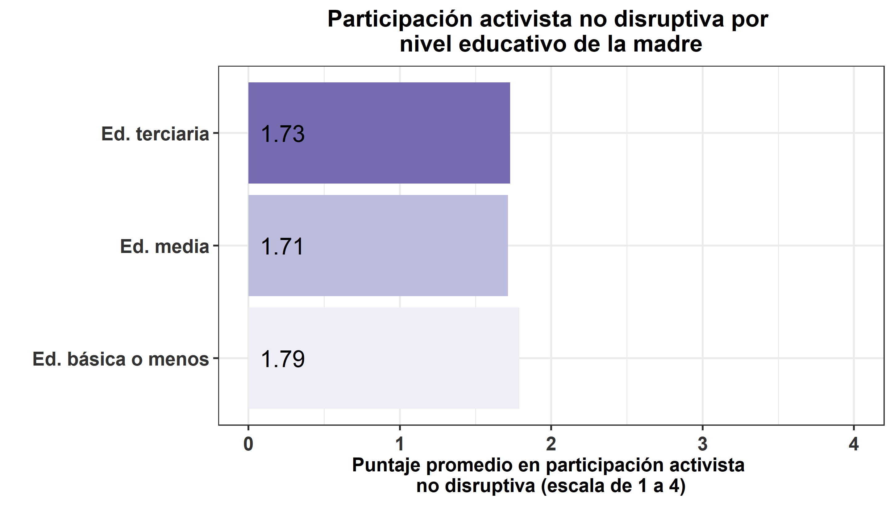


## Máximo nivel educativo del padre
### Participación política durante 3ro y 4to medio

```{r}
### Crear variable
data_wide$part_act_no_dis_3y4 <- as.numeric(data_wide$part_pol_firma.y + data_wide$part_pol_marcha_pas)/2
```

```{r}
# Creación de bbdd
data_ed_bas = data_wide %>%  filter(nse_padre==1 | nse_padre==2 | nse_padre==3 | nse_padre==4) %>% as.data.frame() # Sin Ed. (1), Ed. básica incompleta (2) o completa (3)
data_ed_med = data_wide %>%  filter(nse_padre==4 | nse_padre==5) %>% as.data.frame() # Ed. media incompleta (4) o completa (5)
data_ed_ter = data_wide %>%  filter(nse_padre==6 | nse_padre==7 | nse_padre==8 | nse_padre==9 | nse_padre==10) %>% as.data.frame() # técnico superior incompleto (6) o completo (7) Universitaria incompleta (8) o completa (9), Estudios de postgrado (magíster o doctorado) (10)

#data_ed_tec = data_wide %>%  filter(nse_padre==6 | nse_padre==7) %>% as.data.frame() # técnico superior incompleto (6) o completo (7)
#data_ed_uni = data_wide %>%  filter(nse_padre==8 | nse_padre==9 | nse_padre==10) %>% as.data.frame() # Universitaria incompleta (8) o completa (9), Estudios de postgrado (magíster o doctorado) (10)

```

```{r}
table_preposh1<- rbind(psych::describe(data_ed_bas$part_act_no_dis_3y4, na.rm=T),
               psych::describe(data_ed_med$part_act_no_dis_3y4, na.rm=T),
               psych::describe(data_ed_ter$part_act_no_dis_3y4, na.rm=T))#,
#               psych::describe(data_ed_uni$part_act_no_dis_3y4, na.rm=T))
table_preposh1 <- table_preposh1 %>% select(n,mean,sd,median,trimmed,min,max)

pond1 <- stats::weighted.mean(x=data_ed_bas$part_act_no_dis_3y4,y=data_ed_bas$weight_w01,na.rm=TRUE)
pond2 <- stats::weighted.mean(x=data_ed_med$part_act_no_dis_3y4,y=data_ed_med$weight_w01,na.rm=TRUE)
pond3 <- stats::weighted.mean(x=data_ed_ter$part_act_no_dis_3y4,y=data_ed_ter$weight_w01,na.rm=TRUE)
#pond4 <- stats::weighted.mean(x=data_ed_uni$part_act_no_dis_3y4,y=data_ed_uni$weight_w01,na.rm=TRUE)

table_preposh1[1,2]<-pond1
table_preposh1[2,2]<-pond2
table_preposh1[3,2]<-pond3
#table_preposh1[4,2]<-pond4

#table_preposh1$dep <- c("Ed. básica o menos","Ed. media","Técnico superior", "Universitaria o más")
table_preposh1$dep <- c("Ed. básica o menos","Ed. media","Ed. terciaria")

part_act_no_dis_3y4_colegio <-  ggplot(data=table_preposh1, aes(x=dep, y=mean, fill=dep)) +
     geom_bar(position = 'dodge', stat='identity')+#,width=0.8) 
     scale_fill_brewer(palette="Purples") +
     geom_text(aes(label=format(round(mean,2)), y=0), position=position_dodge(0.9), hjust=-0.25, size=6) +
     theme_bw(base_size = 14) +
     scale_y_continuous(labels = scales::comma) +
     ylab('Puntaje promedio en participación activista 
no disruptiva (escala de 1 a 4)') + xlab(' ') + 
  theme(legend.position="top") +
     labs(fill = " ") +
    coord_flip()+
    theme(axis.text.x = element_text(colour = "grey20", size = 14, angle = 360, hjust = 0.5, vjust = 0.5, face = "bold"),
          axis.text.y = element_text(colour = "grey20", size = 14), 
          text = element_text(size = 14, face = "bold"),
          plot.title = element_text(hjust=0.5),
          legend.position = "none") + 
     ggtitle("Participación activista no disruptiva por 
nivel educativo de la padre") + ylim(0,4)
#part_act_no_dis_3y4_colegio
ggsave(part_act_no_dis_3y4_colegio, file = "../output/graphs/part_act_no_dis_3y4_colegio_ed_padre.png",device = "png",width = 23,height = 13,dpi = "retina",units = "cm")

```

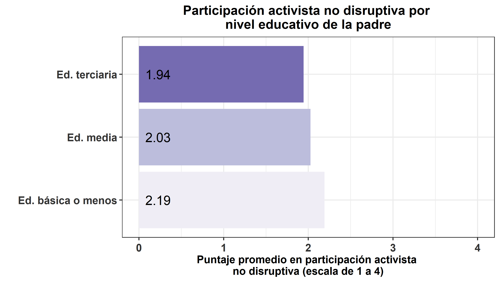

### Participación política durante estallido social

```{r}
### Crear variable
data_wide$part_act_no_dis_es <- as.numeric(data_wide$part_pol_firma_21 + data_wide$part_pol_marc_pac_21)/2
```

```{r}
# Creación de bbdd
data_ed_bas = data_wide %>%  filter(nse_padre==1 | nse_padre==2 | nse_padre==3 | nse_padre==4) %>% as.data.frame() # Sin Ed. (1), Ed. básica incompleta (2) o completa (3)
data_ed_med = data_wide %>%  filter(nse_padre==4 | nse_padre==5) %>% as.data.frame() # Ed. media incompleta (4) o completa (5)
data_ed_ter = data_wide %>%  filter(nse_padre==6 | nse_padre==7 | nse_padre==8 | nse_padre==9 | nse_padre==10) %>% as.data.frame() # técnico superior incompleto (6) o completo (7) Universitaria incompleta (8) o completa (9), Estudios de postgrado (magíster o doctorado) (10)

#data_ed_tec = data_wide %>%  filter(nse_padre==6 | nse_padre==7) %>% as.data.frame() # técnico superior incompleto (6) o completo (7)
#data_ed_uni = data_wide %>%  filter(nse_padre==8 | nse_padre==9 | nse_padre==10) %>% as.data.frame() # Universitaria incompleta (8) o completa (9), Estudios de postgrado (magíster o doctorado) (10)

```

```{r}
table_preposh1<- rbind(psych::describe(data_ed_bas$part_act_no_dis_es, na.rm=T),
               psych::describe(data_ed_med$part_act_no_dis_es, na.rm=T),
               psych::describe(data_ed_ter$part_act_no_dis_es, na.rm=T))#,
#               psych::describe(data_ed_uni$part_act_no_dis_es, na.rm=T))
table_preposh1 <- table_preposh1 %>% select(n,mean,sd,median,trimmed,min,max)

pond1 <- stats::weighted.mean(x=data_ed_bas$part_act_no_dis_es,y=data_ed_bas$weight_w01,na.rm=TRUE)
pond2 <- stats::weighted.mean(x=data_ed_med$part_act_no_dis_es,y=data_ed_med$weight_w01,na.rm=TRUE)
pond3 <- stats::weighted.mean(x=data_ed_ter$part_act_no_dis_es,y=data_ed_ter$weight_w01,na.rm=TRUE)
#pond4 <- stats::weighted.mean(x=data_ed_uni$part_act_no_dis_es,y=data_ed_uni$weight_w01,na.rm=TRUE)

table_preposh1[1,2]<-pond1
table_preposh1[2,2]<-pond2
table_preposh1[3,2]<-pond3
#table_preposh1[4,2]<-pond4

#table_preposh1$dep <- c("Ed. básica o menos","Ed. media","Técnico superior", "Universitaria o más")
table_preposh1$dep <- c("Ed. básica o menos","Ed. media","Ed. terciaria")

part_act_no_dis_es_colegio <-  ggplot(data=table_preposh1, aes(x=dep, y=mean, fill=dep)) +
     geom_bar(position = 'dodge', stat='identity')+#,width=0.8) 
     scale_fill_brewer(palette="Purples") +
     geom_text(aes(label=format(round(mean,2)), y=0), position=position_dodge(0.9), hjust=-0.25, size=6) +
     theme_bw(base_size = 14) +
     scale_y_continuous(labels = scales::comma) +
     ylab('Puntaje promedio en participación activista 
no disruptiva (escala de 1 a 4)') + xlab(' ') + 
  theme(legend.position="top") +
     labs(fill = " ") +
    coord_flip()+
    theme(axis.text.x = element_text(colour = "grey20", size = 14, angle = 360, hjust = 0.5, vjust = 0.5, face = "bold"),
          axis.text.y = element_text(colour = "grey20", size = 14), 
          text = element_text(size = 14, face = "bold"),
          plot.title = element_text(hjust=0.5),
          legend.position = "none") + 
     ggtitle("Participación activista no disruptiva por 
nivel educativo de la padre") + ylim(0,4)
#part_act_no_dis_es_colegio
ggsave(part_act_no_dis_es_colegio, file = "../output/graphs/part_act_no_dis_es_colegio_ed_padre.png",device = "png",width = 23,height = 13,dpi = "retina",units = "cm")

```


### Participación política durante el 2020

```{r}
### Crear variable
data_wide$part_act_no_dis_20 = as.numeric(data_wide$part_pol_firma_20 + data_wide$part_pol_marc_pac_20)/2
```

```{r}
# Creación de bbdd
data_ed_bas = data_wide %>%  filter(nse_padre==1 | nse_padre==2 | nse_padre==3 | nse_padre==4) %>% as.data.frame() # Sin Ed. (1), Ed. básica incompleta (2) o completa (3)
data_ed_med = data_wide %>%  filter(nse_padre==4 | nse_padre==5) %>% as.data.frame() # Ed. media incompleta (4) o completa (5)
data_ed_ter = data_wide %>%  filter(nse_padre==6 | nse_padre==7 | nse_padre==8 | nse_padre==9 | nse_padre==10) %>% as.data.frame() # técnico superior incompleto (6) o completo (7) Universitaria incompleta (8) o completa (9), Estudios de postgrado (magíster o doctorado) (10)

#data_ed_tec = data_wide %>%  filter(nse_padre==6 | nse_padre==7) %>% as.data.frame() # técnico superior incompleto (6) o completo (7)
#data_ed_uni = data_wide %>%  filter(nse_padre==8 | nse_padre==9 | nse_padre==10) %>% as.data.frame() # Universitaria incompleta (8) o completa (9), Estudios de postgrado (magíster o doctorado) (10)

```

```{r}
table_preposh1<- rbind(psych::describe(data_ed_bas$part_act_no_dis_20, na.rm=T),
               psych::describe(data_ed_med$part_act_no_dis_20, na.rm=T),
               psych::describe(data_ed_ter$part_act_no_dis_20, na.rm=T))#,
#               psych::describe(data_ed_uni$part_act_no_dis_20, na.rm=T))
table_preposh1 <- table_preposh1 %>% select(n,mean,sd,median,trimmed,min,max)

pond1 <- stats::weighted.mean(x=data_ed_bas$part_act_no_dis_20,y=data_ed_bas$weight_w01,na.rm=TRUE)
pond2 <- stats::weighted.mean(x=data_ed_med$part_act_no_dis_20,y=data_ed_med$weight_w01,na.rm=TRUE)
pond3 <- stats::weighted.mean(x=data_ed_ter$part_act_no_dis_20,y=data_ed_ter$weight_w01,na.rm=TRUE)
#pond4 <- stats::weighted.mean(x=data_ed_uni$part_act_no_dis_20,y=data_ed_uni$weight_w01,na.rm=TRUE)

table_preposh1[1,2]<-pond1
table_preposh1[2,2]<-pond2
table_preposh1[3,2]<-pond3
#table_preposh1[4,2]<-pond4

#table_preposh1$dep <- c("Ed. básica o menos","Ed. media","Técnico superior", "Universitaria o más")
table_preposh1$dep <- c("Ed. básica o menos","Ed. media","Ed. terciaria")

part_act_no_dis_20_colegio <-  ggplot(data=table_preposh1, aes(x=dep, y=mean, fill=dep)) +
     geom_bar(position = 'dodge', stat='identity')+#,width=0.8) 
     scale_fill_brewer(palette="Purples") +
     geom_text(aes(label=format(round(mean,2)), y=0), position=position_dodge(0.9), hjust=-0.25, size=6) +
     theme_bw(base_size = 14) +
     scale_y_continuous(labels = scales::comma) +
     ylab('Puntaje promedio en participación activista 
no disruptiva (escala de 1 a 4)') + xlab(' ') + 
  theme(legend.position="top") +
     labs(fill = " ") +
    coord_flip()+
    theme(axis.text.x = element_text(colour = "grey20", size = 14, angle = 360, hjust = 0.5, vjust = 0.5, face = "bold"),
          axis.text.y = element_text(colour = "grey20", size = 14), 
          text = element_text(size = 14, face = "bold"),
          plot.title = element_text(hjust=0.5),
          legend.position = "none") + 
     ggtitle("Participación activista no disruptiva por 
nivel educativo de la padre") + ylim(0,4)
#part_act_no_dis_20_colegio
ggsave(part_act_no_dis_20_colegio, file = "../output/graphs/part_act_no_dis_20_colegio_ed_padre.png",device = "png",width = 23,height = 13,dpi = "retina",units = "cm")
```


### Participación política durante el primer semestre de 2021

```{r}
#### Crear variable
data_wide$part_act_no_dis_21_1s = as.numeric(data_wide$part_pol_firma.x + data_wide$part_pol_marc_pac)/2
```

```{r}
# Creación de bbdd
data_ed_bas = data_wide %>%  filter(nse_padre==1 | nse_padre==2 | nse_padre==3 | nse_padre==4) %>% as.data.frame() # Sin Ed. (1), Ed. básica incompleta (2) o completa (3)
data_ed_med = data_wide %>%  filter(nse_padre==4 | nse_padre==5) %>% as.data.frame() # Ed. media incompleta (4) o completa (5)
data_ed_ter = data_wide %>%  filter(nse_padre==6 | nse_padre==7 | nse_padre==8 | nse_padre==9 | nse_padre==10) %>% as.data.frame() # técnico superior incompleto (6) o completo (7) Universitaria incompleta (8) o completa (9), Estudios de postgrado (magíster o doctorado) (10)

#data_ed_tec = data_wide %>%  filter(nse_padre==6 | nse_padre==7) %>% as.data.frame() # técnico superior incompleto (6) o completo (7)
#data_ed_uni = data_wide %>%  filter(nse_padre==8 | nse_padre==9 | nse_padre==10) %>% as.data.frame() # Universitaria incompleta (8) o completa (9), Estudios de postgrado (magíster o doctorado) (10)

```

```{r}
table_preposh1<- rbind(psych::describe(data_ed_bas$part_act_no_dis_21_1s, na.rm=T),
               psych::describe(data_ed_med$part_act_no_dis_21_1s, na.rm=T),
               psych::describe(data_ed_ter$part_act_no_dis_21_1s, na.rm=T))#,
#               psych::describe(data_ed_uni$part_act_no_dis_21_1s, na.rm=T))
table_preposh1 <- table_preposh1 %>% select(n,mean,sd,median,trimmed,min,max)

pond1 <- stats::weighted.mean(x=data_ed_bas$part_act_no_dis_21_1s,y=data_ed_bas$weight_w01,na.rm=TRUE)
pond2 <- stats::weighted.mean(x=data_ed_med$part_act_no_dis_21_1s,y=data_ed_med$weight_w01,na.rm=TRUE)
pond3 <- stats::weighted.mean(x=data_ed_ter$part_act_no_dis_21_1s,y=data_ed_ter$weight_w01,na.rm=TRUE)
#pond4 <- stats::weighted.mean(x=data_ed_uni$part_act_no_dis_21_1s,y=data_ed_uni$weight_w01,na.rm=TRUE)

table_preposh1[1,2]<-pond1
table_preposh1[2,2]<-pond2
table_preposh1[3,2]<-pond3
#table_preposh1[4,2]<-pond4

#table_preposh1$dep <- c("Ed. básica o menos","Ed. media","Técnico superior", "Universitaria o más")
table_preposh1$dep <- c("Ed. básica o menos","Ed. media","Ed. terciaria")

part_act_no_dis_21_1s_colegio <-  ggplot(data=table_preposh1, aes(x=dep, y=mean, fill=dep)) +
     geom_bar(position = 'dodge', stat='identity')+#,width=0.8) 
     scale_fill_brewer(palette="Purples") +
     geom_text(aes(label=format(round(mean,2)), y=0), position=position_dodge(0.9), hjust=-0.25, size=6) +
     theme_bw(base_size = 14) +
     scale_y_continuous(labels = scales::comma) +
     ylab('Puntaje promedio en participación activista 
no disruptiva (escala de 1 a 4)') + xlab(' ') + 
  theme(legend.position="top") +
     labs(fill = " ") +
    coord_flip()+
    theme(axis.text.x = element_text(colour = "grey20", size = 14, angle = 360, hjust = 0.5, vjust = 0.5, face = "bold"),
          axis.text.y = element_text(colour = "grey20", size = 14), 
          text = element_text(size = 14, face = "bold"),
          plot.title = element_text(hjust=0.5),
          legend.position = "none") + 
     ggtitle("Participación activista no disruptiva por 
nivel educativo de la padre") + ylim(0,4)
#part_act_no_dis_21_1s_colegio
ggsave(part_act_no_dis_21_1s_colegio, file = "../output/graphs/part_act_no_dis_21_1s_colegio_ed_padre.png",device = "png",width = 23,height = 13,dpi = "retina",units = "cm")
```


### Participación política durante el segundo semestre de 2021

```{r}
#### Crear variable
data_wide$part_act_no_dis_21_2s = as.numeric(data_wide$part_pol_firma_21b + data_wide$part_pol_marc_pac_21b)/2
```

```{r}
# Creación de bbdd
data_ed_bas = data_wide %>%  filter(nse_padre==1 | nse_padre==2 | nse_padre==3 | nse_padre==4) %>% as.data.frame() # Sin Ed. (1), Ed. básica incompleta (2) o completa (3)
data_ed_med = data_wide %>%  filter(nse_padre==4 | nse_padre==5) %>% as.data.frame() # Ed. media incompleta (4) o completa (5)
data_ed_ter = data_wide %>%  filter(nse_padre==6 | nse_padre==7 | nse_padre==8 | nse_padre==9 | nse_padre==10) %>% as.data.frame() # técnico superior incompleto (6) o completo (7) Universitaria incompleta (8) o completa (9), Estudios de postgrado (magíster o doctorado) (10)

#data_ed_tec = data_wide %>%  filter(nse_padre==6 | nse_padre==7) %>% as.data.frame() # técnico superior incompleto (6) o completo (7)
#data_ed_uni = data_wide %>%  filter(nse_padre==8 | nse_padre==9 | nse_padre==10) %>% as.data.frame() # Universitaria incompleta (8) o completa (9), Estudios de postgrado (magíster o doctorado) (10)

```

```{r}
table_preposh1<- rbind(psych::describe(data_ed_bas$part_act_no_dis_21_2s, na.rm=T),
               psych::describe(data_ed_med$part_act_no_dis_21_2s, na.rm=T),
               psych::describe(data_ed_ter$part_act_no_dis_21_2s, na.rm=T))#,
#               psych::describe(data_ed_uni$part_act_no_dis_21_2s, na.rm=T))
table_preposh1 <- table_preposh1 %>% select(n,mean,sd,median,trimmed,min,max)

pond1 <- stats::weighted.mean(x=data_ed_bas$part_act_no_dis_21_2s,y=data_ed_bas$weight_w01,na.rm=TRUE)
pond2 <- stats::weighted.mean(x=data_ed_med$part_act_no_dis_21_2s,y=data_ed_med$weight_w01,na.rm=TRUE)
pond3 <- stats::weighted.mean(x=data_ed_ter$part_act_no_dis_21_2s,y=data_ed_ter$weight_w01,na.rm=TRUE)
#pond4 <- stats::weighted.mean(x=data_ed_uni$part_act_no_dis_21_2s,y=data_ed_uni$weight_w01,na.rm=TRUE)

table_preposh1[1,2]<-pond1
table_preposh1[2,2]<-pond2
table_preposh1[3,2]<-pond3
#table_preposh1[4,2]<-pond4

#table_preposh1$dep <- c("Ed. básica o menos","Ed. media","Técnico superior", "Universitaria o más")
table_preposh1$dep <- c("Ed. básica o menos","Ed. media","Ed. terciaria")

part_act_no_dis_21_2s_colegio <-  ggplot(data=table_preposh1, aes(x=dep, y=mean, fill=dep)) +
     geom_bar(position = 'dodge', stat='identity')+#,width=0.8) 
     scale_fill_brewer(palette="Purples") +
     geom_text(aes(label=format(round(mean,2)), y=0), position=position_dodge(0.9), hjust=-0.25, size=6) +
     theme_bw(base_size = 14) +
     scale_y_continuous(labels = scales::comma) +
     ylab('Puntaje promedio en participación activista 
no disruptiva (escala de 1 a 4)') + xlab(' ') + 
  theme(legend.position="top") +
     labs(fill = " ") +
    coord_flip()+
    theme(axis.text.x = element_text(colour = "grey20", size = 14, angle = 360, hjust = 0.5, vjust = 0.5, face = "bold"),
          axis.text.y = element_text(colour = "grey20", size = 14), 
          text = element_text(size = 14, face = "bold"),
          plot.title = element_text(hjust=0.5),
          legend.position = "none") + 
     ggtitle("Participación activista no disruptiva por 
nivel educativo de la padre") + ylim(0,4)
#part_act_no_dis_21_2s_colegio
ggsave(part_act_no_dis_21_2s_colegio, file = "../output/graphs/part_act_no_dis_21_2s_colegio_ed_padre.png",device = "png",width = 23,height = 13,dpi = "retina",units = "cm")
```
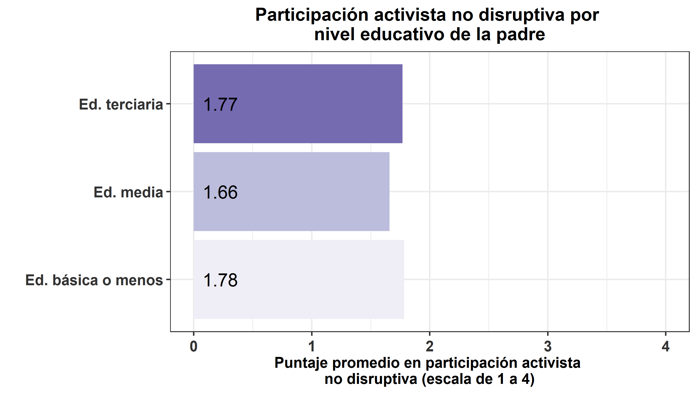

## Frecuencia de conversación con los padres sobre temas sociales y/o políticos
### Participación política durante 3ro y 4to medio

```{r}
### Crear variable
data_wide$part_act_no_dis_3y4 <- as.numeric(data_wide$part_pol_firma.y + data_wide$part_pol_marcha_pas)/2
```

```{r}
# Creación de bbdd
data_nunca = data_wide %>%  filter(conv_padr_poli==1) %>% as.data.frame() # Nunca
data_casi_nunca = data_wide %>%  filter(conv_padr_poli==2) %>% as.data.frame() # Casi nunca
data_a_veces = data_wide %>%  filter(conv_padr_poli==3) %>% as.data.frame() # A veces
data_frecuent = data_wide %>%  filter(conv_padr_poli==4) %>% as.data.frame() # Frecuentemente
```

```{r}
table_preposh1<- rbind(psych::describe(data_nunca$part_act_no_dis_3y4, na.rm=T),
               psych::describe(data_casi_nunca$part_act_no_dis_3y4, na.rm=T),
               psych::describe(data_a_veces$part_act_no_dis_3y4, na.rm=T),
               psych::describe(data_frecuent$part_act_no_dis_3y4, na.rm=T))
table_preposh1 <- table_preposh1 %>% select(n,mean,sd,median,trimmed,min,max)

pond1 <- stats::weighted.mean(x=data_nunca$part_act_no_dis_3y4,y=data_nunca$weight_w01,na.rm=TRUE)
pond2 <- stats::weighted.mean(x=data_casi_nunca$part_act_no_dis_3y4,y=data_casi_nunca$weight_w01,na.rm=TRUE)
pond3 <- stats::weighted.mean(x=data_a_veces$part_act_no_dis_3y4,y=data_a_veces$weight_w01,na.rm=TRUE)
pond4 <- stats::weighted.mean(x=data_frecuent$part_act_no_dis_3y4,y=data_frecuent$weight_w01,na.rm=TRUE)

table_preposh1[1,2]<-pond1
table_preposh1[2,2]<-pond2
table_preposh1[3,2]<-pond3
table_preposh1[4,2]<-pond4

table_preposh1$dep <- c("1. Nunca","2. Casi nunca","3. A veces", "4. Frecuentemente")

part_act_no_dis_3y4_colegio <-  ggplot(data=table_preposh1, aes(x=dep, y=mean, fill=dep)) +
     geom_bar(position = 'dodge', stat='identity')+#,width=0.8) 
     scale_fill_brewer(palette="Purples") +
     geom_text(aes(label=format(round(mean,2)), y=0), position=position_dodge(0.9), hjust=-0.25, size=6) +
     theme_bw(base_size = 14) +
     scale_y_continuous(labels = scales::comma) +
     ylab('Puntaje promedio en participación activista 
no disruptiva (escala de 1 a 4)') + xlab(' ') + 
  theme(legend.position="top") +
     labs(fill = " ") +
    coord_flip()+
    theme(axis.text.x = element_text(colour = "grey20", size = 14, angle = 360, hjust = 0.5, vjust = 0.5, face = "bold"),
          axis.text.y = element_text(colour = "grey20", size = 14), 
          text = element_text(size = 14, face = "bold"),
          plot.title = element_text(hjust=0.5),
          legend.position = "none") + 
     ggtitle("Participación activista no disruptiva por 
conversación con los padres sobre temas políticos y/o sociales") + ylim(0,4)
#part_act_no_dis_3y4_colegio
ggsave(part_act_no_dis_3y4_colegio, file = "../output/graphs/part_act_no_dis_3y4_colegio_conv_padres.png",device = "png",width = 23,height = 13,dpi = "retina",units = "cm")

```

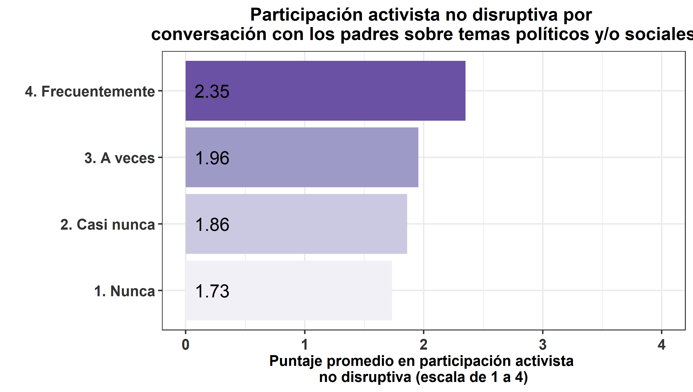

### Participación política durante estallido social

```{r}
### Crear variable
data_wide$part_act_no_dis_es <- as.numeric(data_wide$part_pol_firma_21 + data_wide$part_pol_marc_pac_21)/2
```

```{r}
# Creación de bbdd
data_nunca = data_wide %>%  filter(conv_padres_21==1) %>% as.data.frame() # Nunca
data_casi_nunca = data_wide %>%  filter(conv_padres_21==2) %>% as.data.frame() # Casi nunca
data_a_veces = data_wide %>%  filter(conv_padres_21==3) %>% as.data.frame() # A veces
data_frecuent = data_wide %>%  filter(conv_padres_21==4) %>% as.data.frame() # Frecuentemente
```

```{r}
table_preposh1<- rbind(psych::describe(data_nunca$part_act_no_dis_es, na.rm=T),
               psych::describe(data_casi_nunca$part_act_no_dis_es, na.rm=T),
               psych::describe(data_a_veces$part_act_no_dis_es, na.rm=T),
               psych::describe(data_frecuent$part_act_no_dis_es, na.rm=T))
table_preposh1 <- table_preposh1 %>% select(n,mean,sd,median,trimmed,min,max)

pond1 <- stats::weighted.mean(x=data_nunca$part_act_no_dis_es,y=data_nunca$weight_w01,na.rm=TRUE)
pond2 <- stats::weighted.mean(x=data_casi_nunca$part_act_no_dis_es,y=data_casi_nunca$weight_w01,na.rm=TRUE)
pond3 <- stats::weighted.mean(x=data_a_veces$part_act_no_dis_es,y=data_a_veces$weight_w01,na.rm=TRUE)
pond4 <- stats::weighted.mean(x=data_frecuent$part_act_no_dis_es,y=data_frecuent$weight_w01,na.rm=TRUE)

table_preposh1[1,2]<-pond1
table_preposh1[2,2]<-pond2
table_preposh1[3,2]<-pond3
table_preposh1[4,2]<-pond4

table_preposh1$dep <- c("1. Nunca","2. Casi nunca","3. A veces", "4. Frecuentemente")

part_act_no_dis_es_colegio <-  ggplot(data=table_preposh1, aes(x=dep, y=mean, fill=dep)) +
     geom_bar(position = 'dodge', stat='identity')+#,width=0.8) 
     scale_fill_brewer(palette="Purples") +
     geom_text(aes(label=format(round(mean,2)), y=0), position=position_dodge(0.9), hjust=-0.25, size=6) +
     theme_bw(base_size = 14) +
     scale_y_continuous(labels = scales::comma) +
     ylab('Puntaje promedio en participación activista 
no disruptiva (escala de 1 a 4)') + xlab(' ') + 
  theme(legend.position="top") +
     labs(fill = " ") +
    coord_flip()+
    theme(axis.text.x = element_text(colour = "grey20", size = 14, angle = 360, hjust = 0.5, vjust = 0.5, face = "bold"),
          axis.text.y = element_text(colour = "grey20", size = 14), 
          text = element_text(size = 14, face = "bold"),
          plot.title = element_text(hjust=0.5),
          legend.position = "none") + 
     ggtitle("Participación activista no disruptiva por 
conversación con los padres sobre temas políticos y/o sociales") + ylim(0,4)
#part_act_no_dis_es_colegio
ggsave(part_act_no_dis_es_colegio, file = "../output/graphs/part_act_no_dis_es_colegio_conv_padres.png",device = "png",width = 23,height = 13,dpi = "retina",units = "cm")

```
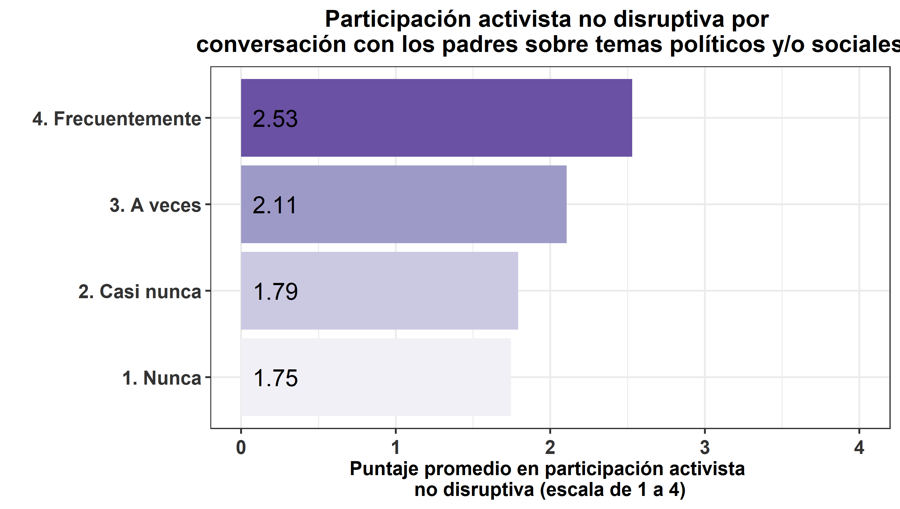

### Participación política durante el 2020

```{r}
### Crear variable
data_wide$part_act_no_dis_20 = as.numeric(data_wide$part_pol_firma_20 + data_wide$part_pol_marc_pac_20)/2
```

```{r}
# Creación de bbdd
data_nunca = data_wide %>%  filter(conv_padres_20==1) %>% as.data.frame() # Nunca
data_casi_nunca = data_wide %>%  filter(conv_padres_20==2) %>% as.data.frame() # Casi nunca
data_a_veces = data_wide %>%  filter(conv_padres_20==3) %>% as.data.frame() # A veces
data_frecuent = data_wide %>%  filter(conv_padres_20==4) %>% as.data.frame() # Frecuentemente
```

```{r}
table_preposh1<- rbind(psych::describe(data_nunca$part_act_no_dis_20, na.rm=T),
               psych::describe(data_casi_nunca$part_act_no_dis_20, na.rm=T),
               psych::describe(data_a_veces$part_act_no_dis_20, na.rm=T),
               psych::describe(data_frecuent$part_act_no_dis_20, na.rm=T))
table_preposh1 <- table_preposh1 %>% select(n,mean,sd,median,trimmed,min,max)

pond1 <- stats::weighted.mean(x=data_nunca$part_act_no_dis_20,y=data_nunca$weight_w01,na.rm=TRUE)
pond2 <- stats::weighted.mean(x=data_casi_nunca$part_act_no_dis_20,y=data_casi_nunca$weight_w01,na.rm=TRUE)
pond3 <- stats::weighted.mean(x=data_a_veces$part_act_no_dis_20,y=data_a_veces$weight_w01,na.rm=TRUE)
pond4 <- stats::weighted.mean(x=data_frecuent$part_act_no_dis_20,y=data_frecuent$weight_w01,na.rm=TRUE)

table_preposh1[1,2]<-pond1
table_preposh1[2,2]<-pond2
table_preposh1[3,2]<-pond3
table_preposh1[4,2]<-pond4

table_preposh1$dep <- c("1. Nunca","2. Casi nunca","3. A veces", "4. Frecuentemente")

part_act_no_dis_20_colegio <-  ggplot(data=table_preposh1, aes(x=dep, y=mean, fill=dep)) +
     geom_bar(position = 'dodge', stat='identity')+#,width=0.8) 
     scale_fill_brewer(palette="Purples") +
     geom_text(aes(label=format(round(mean,2)), y=0), position=position_dodge(0.9), hjust=-0.25, size=6) +
     theme_bw(base_size = 14) +
     scale_y_continuous(labels = scales::comma) +
     ylab('Puntaje promedio en participación activista 
no disruptiva (escala de 1 a 4)') + xlab(' ') + 
  theme(legend.position="top") +
     labs(fill = " ") +
    coord_flip()+
    theme(axis.text.x = element_text(colour = "grey20", size = 14, angle = 360, hjust = 0.5, vjust = 0.5, face = "bold"),
          axis.text.y = element_text(colour = "grey20", size = 14), 
          text = element_text(size = 14, face = "bold"),
          plot.title = element_text(hjust=0.5),
          legend.position = "none") + 
     ggtitle("Participación activista no disruptiva por 
conversación con los padres sobre temas políticos y/o sociales") + ylim(0,4)
#part_act_no_dis_20_colegio
ggsave(part_act_no_dis_20_colegio, file = "../output/graphs/part_act_no_dis_20_colegio_conv_padres.png",device = "png",width = 23,height = 13,dpi = "retina",units = "cm")
```


### Participación política durante el primer semestre de 2021

```{r}
#### Crear variable
data_wide$part_act_no_dis_21_1s = as.numeric(data_wide$part_pol_firma.x + data_wide$part_pol_marc_pac)/2
```

```{r}
# Creación de bbdd
data_nunca = data_wide %>%  filter(conv_padres==1) %>% as.data.frame() # Nunca
data_casi_nunca = data_wide %>%  filter(conv_padres==2) %>% as.data.frame() # Casi nunca
data_a_veces = data_wide %>%  filter(conv_padres==3) %>% as.data.frame() # A veces
data_frecuent = data_wide %>%  filter(conv_padres==4) %>% as.data.frame() # Frecuentemente
```

```{r}
table_preposh1<- rbind(psych::describe(data_nunca$part_act_no_dis_21_1s, na.rm=T),
               psych::describe(data_casi_nunca$part_act_no_dis_21_1s, na.rm=T),
               psych::describe(data_a_veces$part_act_no_dis_21_1s, na.rm=T),
               psych::describe(data_frecuent$part_act_no_dis_21_1s, na.rm=T))
table_preposh1 <- table_preposh1 %>% select(n,mean,sd,median,trimmed,min,max)

pond1 <- stats::weighted.mean(x=data_nunca$part_act_no_dis_21_1s,y=data_nunca$weight_w01,na.rm=TRUE)
pond2 <- stats::weighted.mean(x=data_casi_nunca$part_act_no_dis_21_1s,y=data_casi_nunca$weight_w01,na.rm=TRUE)
pond3 <- stats::weighted.mean(x=data_a_veces$part_act_no_dis_21_1s,y=data_a_veces$weight_w01,na.rm=TRUE)
pond4 <- stats::weighted.mean(x=data_frecuent$part_act_no_dis_21_1s,y=data_frecuent$weight_w01,na.rm=TRUE)

table_preposh1[1,2]<-pond1
table_preposh1[2,2]<-pond2
table_preposh1[3,2]<-pond3
table_preposh1[4,2]<-pond4

table_preposh1$dep <- c("1. Nunca","2. Casi nunca","3. A veces", "4. Frecuentemente")

part_act_no_dis_21_1s_colegio <-  ggplot(data=table_preposh1, aes(x=dep, y=mean, fill=dep)) +
     geom_bar(position = 'dodge', stat='identity')+#,width=0.8) 
     scale_fill_brewer(palette="Purples") +
     geom_text(aes(label=format(round(mean,2)), y=0), position=position_dodge(0.9), hjust=-0.25, size=6) +
     theme_bw(base_size = 14) +
     scale_y_continuous(labels = scales::comma) +
     ylab('Puntaje promedio en participación activista 
no disruptiva (escala de 1 a 4)') + xlab(' ') + 
  theme(legend.position="top") +
     labs(fill = " ") +
    coord_flip()+
    theme(axis.text.x = element_text(colour = "grey20", size = 14, angle = 360, hjust = 0.5, vjust = 0.5, face = "bold"),
          axis.text.y = element_text(colour = "grey20", size = 14), 
          text = element_text(size = 14, face = "bold"),
          plot.title = element_text(hjust=0.5),
          legend.position = "none") + 
     ggtitle("Participación activista no disruptiva por 
conversación con los padres sobre temas políticos y/o sociales") + ylim(0,4)
#part_act_no_dis_21_1s_colegio
ggsave(part_act_no_dis_21_1s_colegio, file = "../output/graphs/part_act_no_dis_21_1s_colegio_conv_padres.png",device = "png",width = 23,height = 13,dpi = "retina",units = "cm")
```

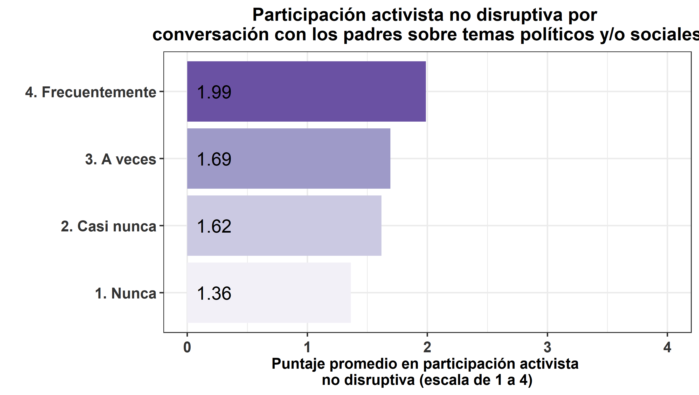

### Participación política durante el segundo semestre de 2021

```{r}
#### Crear variable
data_wide$part_act_no_dis_21_2s = as.numeric(data_wide$part_pol_firma_21b + data_wide$part_pol_marc_pac_21b)/2
```

```{r}
# Creación de bbdd
data_nunca = data_wide %>%  filter(conv_padres_21b==1) %>% as.data.frame() # Nunca
data_casi_nunca = data_wide %>%  filter(conv_padres_21b==2) %>% as.data.frame() # Casi nunca
data_a_veces = data_wide %>%  filter(conv_padres_21b==3) %>% as.data.frame() # A veces
data_frecuent = data_wide %>%  filter(conv_padres_21b==4) %>% as.data.frame() # Frecuentemente
```

```{r}
table_preposh1<- rbind(psych::describe(data_nunca$part_act_no_dis_21_2s, na.rm=T),
               psych::describe(data_casi_nunca$part_act_no_dis_21_2s, na.rm=T),
               psych::describe(data_a_veces$part_act_no_dis_21_2s, na.rm=T),
               psych::describe(data_frecuent$part_act_no_dis_21_2s, na.rm=T))
table_preposh1 <- table_preposh1 %>% select(n,mean,sd,median,trimmed,min,max)

pond1 <- stats::weighted.mean(x=data_nunca$part_act_no_dis_21_2s,y=data_nunca$weight_w01,na.rm=TRUE)
pond2 <- stats::weighted.mean(x=data_casi_nunca$part_act_no_dis_21_2s,y=data_casi_nunca$weight_w01,na.rm=TRUE)
pond3 <- stats::weighted.mean(x=data_a_veces$part_act_no_dis_21_2s,y=data_a_veces$weight_w01,na.rm=TRUE)
pond4 <- stats::weighted.mean(x=data_frecuent$part_act_no_dis_21_2s,y=data_frecuent$weight_w01,na.rm=TRUE)

table_preposh1[1,2]<-pond1
table_preposh1[2,2]<-pond2
table_preposh1[3,2]<-pond3
table_preposh1[4,2]<-pond4

table_preposh1$dep <- c("1. Nunca","2. Casi nunca","3. A veces", "4. Frecuentemente")

part_act_no_dis_21_2s_colegio <-  ggplot(data=table_preposh1, aes(x=dep, y=mean, fill=dep)) +
     geom_bar(position = 'dodge', stat='identity')+#,width=0.8) 
     scale_fill_brewer(palette="Purples") +
     geom_text(aes(label=format(round(mean,2)), y=0), position=position_dodge(0.9), hjust=-0.25, size=6) +
     theme_bw(base_size = 14) +
     scale_y_continuous(labels = scales::comma) +
     ylab('Puntaje promedio en participación activista 
no disruptiva (escala de 1 a 4)') + xlab(' ') + 
  theme(legend.position="top") +
     labs(fill = " ") +
    coord_flip()+
    theme(axis.text.x = element_text(colour = "grey20", size = 14, angle = 360, hjust = 0.5, vjust = 0.5, face = "bold"),
          axis.text.y = element_text(colour = "grey20", size = 14), 
          text = element_text(size = 14, face = "bold"),
          plot.title = element_text(hjust=0.5),
          legend.position = "none") + 
     ggtitle("Participación activista no disruptiva por 
conversación con los padres sobre temas políticos y/o sociales") + ylim(0,4)
#part_act_no_dis_21_2s_colegio
ggsave(part_act_no_dis_21_2s_colegio, file = "../output/graphs/part_act_no_dis_21_2s_colegio_conv_padres.png",device = "png",width = 23,height = 13,dpi = "retina",units = "cm")
```


# Activismo disruptivo
## Dependencia administrativa establecimiento
### Participación política durante 3ro y 4to medio
```{r}
### Crear variable
data_wide$part_act_dis_3y4 <- as.numeric(data_wide$part_pol_marcha_dis + data_wide$part_pol_bloqueo + data_wide$part_pol_rayar.y + data_wide$part_pol_toma.y)/4
```

```{r}
# Creación de bbdd
data_mun = data_wide %>%  filter(edm_admi==1) %>% as.data.frame() #Municipal
data_sub = data_wide %>%  filter(edm_admi==2) %>% as.data.frame() #Particular Subvencionado
data_priv = data_wide %>%  filter(edm_admi==3) %>% as.data.frame() #Particular pagado
```

```{r}
table_preposh1<- rbind(psych::describe(data_mun$part_act_dis_3y4, na.rm=T),
               psych::describe(data_sub$part_act_dis_3y4, na.rm=T),psych::describe(data_priv$part_act_dis_3y4, na.rm=T))
table_preposh1 <- table_preposh1 %>% select(n,mean,sd,median,trimmed,min,max)
pond1 <- stats::weighted.mean(x=data_mun$part_act_dis_3y4,y=data_mun$weight_w01,na.rm=TRUE)
pond2 <- stats::weighted.mean(x=data_sub$part_act_dis_3y4,y=data_sub$weight_w01,na.rm=TRUE)
pond3 <- stats::weighted.mean(x=data_priv$part_act_dis_3y4,y=data_priv$weight_w01,na.rm=TRUE)

table_preposh1[1,2]<-pond1
table_preposh1[2,2]<-pond2
table_preposh1[3,2]<-pond3

table_preposh1$dep <- c("Municipal","Particular Subvencionado","Particular Privado")

part_act_dis_3y4_colegio <-  ggplot(data=table_preposh1, aes(x=dep, y=mean, fill=dep)) +
     geom_bar(position = 'dodge', stat='identity')+#,width=0.8) 
     scale_fill_brewer(palette="Purples") +
     geom_text(aes(label=format(round(mean,2)), y=0), position=position_dodge(0.9), hjust=-0.25, size=6) +
     theme_bw(base_size = 14) +
     scale_y_continuous(labels = scales::comma) +
     ylab('Puntaje promedio en participación activista 
disruptiva (escala de 1 a 4)') + xlab(' ') + 
     theme(legend.position="top") +
     labs(fill = " ") +
    coord_flip()+
    theme(axis.text.x = element_text(colour = "grey20", size = 14, angle = 360, hjust = 0.5, vjust = 0.5, face = "bold"),
          axis.text.y = element_text(colour = "grey20", size = 14), 
          text = element_text(size = 14, face = "bold"),
          plot.title = element_text(hjust=0.5),
          legend.position = "none") + 
     ggtitle("Participación activista disruptiva por 
tipo de dependencia administrativa de la escuela") + ylim(0,4)
#part_act_dis_3y4_colegio
ggsave(part_act_dis_3y4_colegio, file = "../output/graphs/part_act_dis_3y4_colegio_dep.png",device = "png",width = 23,height = 13,dpi = "retina",units = "cm")

```


### Participación política durante estallido social

```{r}
### Crear variable
data_wide$part_act_dis_es <- as.numeric(data_wide$part_pol_marc_dis_21 + data_wide$part_pol_bloq_21 + data_wide$part_pol_rayar_21 + data_wide$part_pol_toma_21)/4
```

```{r}
# Creación de bbdd
data_mun = data_wide %>%  filter(edm_admi==1) %>% as.data.frame() #Municipal
data_sub = data_wide %>%  filter(edm_admi==2) %>% as.data.frame() #Particular Subvencionado
data_priv = data_wide %>%  filter(edm_admi==3) %>% as.data.frame() #Particular pagado
```

```{r}
table_preposh1<- rbind(psych::describe(data_mun$part_act_dis_es, na.rm=T),
               psych::describe(data_sub$part_act_dis_es, na.rm=T),psych::describe(data_priv$part_act_dis_es, na.rm=T))
table_preposh1 <- table_preposh1 %>% select(n,mean,sd,median,trimmed,min,max)

pond1 <- stats::weighted.mean(x=data_mun$part_act_dis_es,y=data_mun$weight_w01,na.rm=TRUE)
pond2 <- stats::weighted.mean(x=data_sub$part_act_dis_es,y=data_sub$weight_w01,na.rm=TRUE)
pond3 <- stats::weighted.mean(x=data_priv$part_act_dis_es,y=data_priv$weight_w01,na.rm=TRUE)

table_preposh1[1,2]<-pond1
table_preposh1[2,2]<-pond2
table_preposh1[3,2]<-pond3

table_preposh1$dep <- c("Municipal","Particular Subvencionado","Particular Privado")

part_act_dis_es_colegio <-  ggplot(data=table_preposh1, aes(x=dep, y=mean, fill=dep)) +
     geom_bar(position = 'dodge', stat='identity')+#,width=0.8) 
     scale_fill_brewer(palette="Purples") +
     geom_text(aes(label=format(round(mean,2)), y=0), position=position_dodge(0.9), hjust=-0.25, size=6) +
     theme_bw(base_size = 14) +
     scale_y_continuous(labels = scales::comma) +
     ylab('Puntaje promedio en participación activista 
disruptiva (escala de 1 a 4)') + xlab(' ') + 
     theme(legend.position="top") +
     labs(fill = " ") +
    coord_flip()+
    theme(axis.text.x = element_text(colour = "grey20", size = 14, angle = 360, hjust = 0.5, vjust = 0.5, face = "bold"),
          axis.text.y = element_text(colour = "grey20", size = 14), 
          text = element_text(size = 14, face = "bold"),
          plot.title = element_text(hjust=0.5),
          legend.position = "none") + 
     ggtitle("Participación activista disruptiva por 
tipo de dependencia administrativa de la escuela") + ylim(0,4)
#part_act_dis_es_colegio
ggsave(part_act_dis_es_colegio, file = "../output/graphs/part_act_dis_es_colegio_dep.png",device = "png",width = 23,height = 13,dpi = "retina",units = "cm")

```
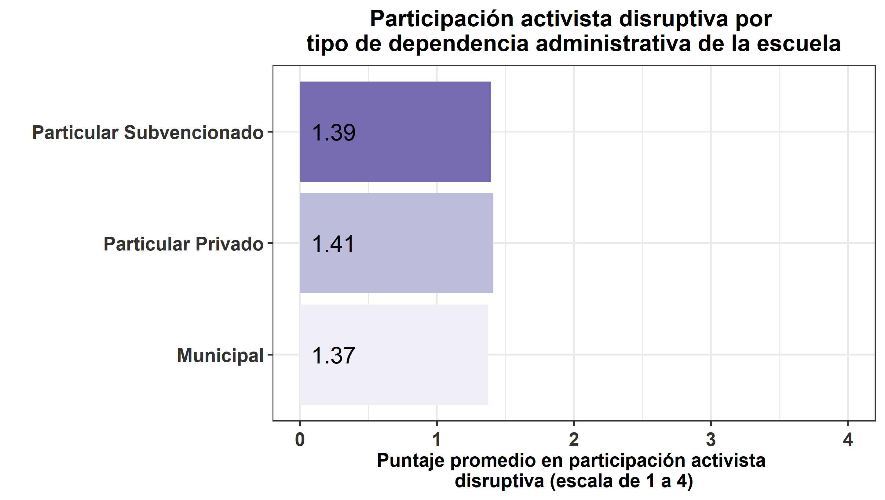

### Participación política durante el 2020

```{r}
### Crear variable
data_wide$part_act_dis_20 = as.numeric(data_wide$part_pol_marc_dis_20 + data_wide$part_pol_bloq_20 + data_wide$part_pol_rayar_20 + data_wide$part_pol_toma_20)/4
```

```{r}
# Creación de bbdd
data_mun = data_wide %>%  filter(edm_admi==1) %>% as.data.frame() #Municipal
data_sub = data_wide %>%  filter(edm_admi==2) %>% as.data.frame() #Particular Subvencionado
data_priv = data_wide %>%  filter(edm_admi==3) %>% as.data.frame() #Particular pagado
```

```{r}
table_preposh1<- rbind(psych::describe(data_mun$part_act_dis_20, na.rm=T),
               psych::describe(data_sub$part_act_dis_20, na.rm=T),psych::describe(data_priv$part_act_dis_20, na.rm=T))
table_preposh1 <- table_preposh1 %>% select(n,mean,sd,median,trimmed,min,max)

pond1 <- stats::weighted.mean(x=data_mun$part_act_dis_20,y=data_mun$weight_w01,na.rm=TRUE)
pond2 <- stats::weighted.mean(x=data_sub$part_act_dis_20,y=data_sub$weight_w01,na.rm=TRUE)
pond3 <- stats::weighted.mean(x=data_priv$part_act_dis_20,y=data_priv$weight_w01,na.rm=TRUE)

table_preposh1[1,2]<-pond1
table_preposh1[2,2]<-pond2
table_preposh1[3,2]<-pond3

table_preposh1$dep <- c("Municipal","Particular Subvencionado","Particular Privado")

part_act_dis_20_colegio <-  ggplot(data=table_preposh1, aes(x=dep, y=mean, fill=dep)) +
     geom_bar(position = 'dodge', stat='identity')+#,width=0.8) 
     scale_fill_brewer(palette="Purples") +
     geom_text(aes(label=format(round(mean,2)), y=0), position=position_dodge(0.9), hjust=-0.25, size=6) +
     theme_bw(base_size = 14) +
     scale_y_continuous(labels = scales::comma) +
     ylab('Puntaje promedio en participación activista 
disruptiva (escala de 1 a 4)') + xlab(' ') + 
     theme(legend.position="top") +
     labs(fill = " ") +
    coord_flip()+
    theme(axis.text.x = element_text(colour = "grey20", size = 14, angle = 360, hjust = 0.5, vjust = 0.5, face = "bold"),
          axis.text.y = element_text(colour = "grey20", size = 14), 
          text = element_text(size = 14, face = "bold"),
          plot.title = element_text(hjust=0.5),
          legend.position = "none") + 
     ggtitle("Participación activista disruptiva por 
tipo de dependencia administrativa de la escuela") + ylim(0,4)
#part_act_dis_20_colegio
ggsave(part_act_dis_20_colegio, file = "../output/graphs/part_act_dis_20_colegio_dep.png",device = "png",width = 23,height = 13,dpi = "retina",units = "cm")
```

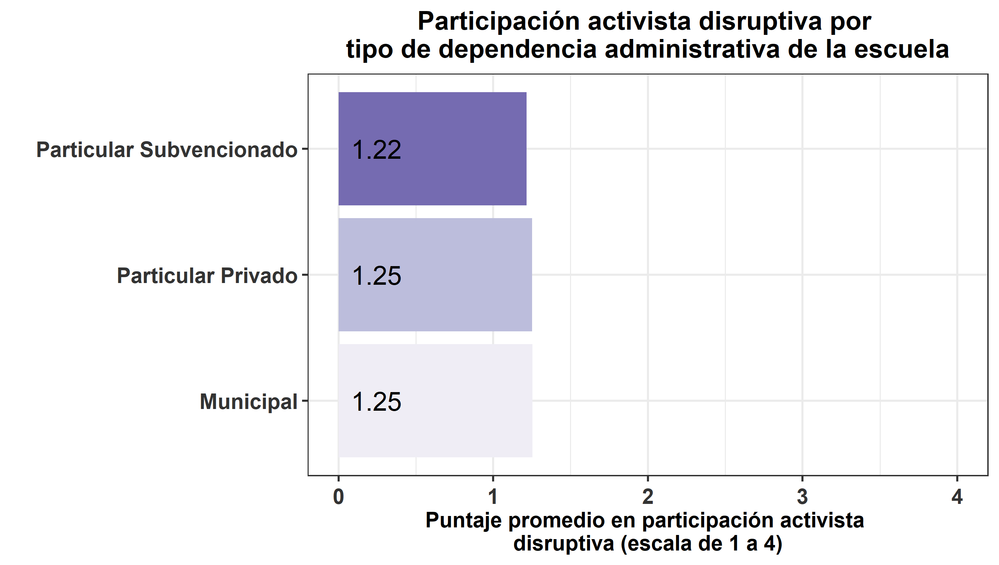

### Participación política durante el primer semestre de 2021

```{r}
#### Crear variable
data_wide$part_act_dis_21_1s = as.numeric(data_wide$part_pol_marcha_dis + data_wide$part_pol_bloq + data_wide$part_pol_rayar.x + data_wide$part_pol_toma.x)/4
```

```{r}
# Creación de bbdd
data_mun = data_wide %>%  filter(edm_admi==1) %>% as.data.frame() #Municipal
data_sub = data_wide %>%  filter(edm_admi==2) %>% as.data.frame() #Particular Subvencionado
data_priv = data_wide %>%  filter(edm_admi==3) %>% as.data.frame() #Particular pagado
```

```{r}
table_preposh1<- rbind(psych::describe(data_mun$part_act_dis_21_1s, na.rm=T),
               psych::describe(data_sub$part_act_dis_21_1s, na.rm=T),psych::describe(data_priv$part_act_dis_21_1s, na.rm=T))
table_preposh1 <- table_preposh1 %>% select(n,mean,sd,median,trimmed,min,max)

pond1 <- stats::weighted.mean(x=data_mun$part_act_dis_21_1s,y=data_mun$weight_w02,na.rm=TRUE)
pond2 <- stats::weighted.mean(x=data_sub$part_act_dis_21_1s,y=data_sub$weight_w02,na.rm=TRUE)
pond3 <- stats::weighted.mean(x=data_priv$part_act_dis_21_1s,y=data_priv$weight_w02,na.rm=TRUE)

table_preposh1[1,2]<-pond1
table_preposh1[2,2]<-pond2
table_preposh1[3,2]<-pond3

table_preposh1$dep <- c("Municipal","Particular Subvencionado","Particular Privado")

part_act_dis_21_1s_colegio <-  ggplot(data=table_preposh1, aes(x=dep, y=mean, fill=dep)) +
     geom_bar(position = 'dodge', stat='identity')+#,width=0.8) 
     scale_fill_brewer(palette="Purples") +
     geom_text(aes(label=format(round(mean,2)), y=0), position=position_dodge(0.9), hjust=-0.25, size=6) +
     theme_bw(base_size = 14) +
     scale_y_continuous(labels = scales::comma) +
     ylab('Puntaje promedio en participación activista 
disruptiva (escala de 1 a 4)') + xlab(' ') + 
     theme(legend.position="top") +
     labs(fill = " ") +
    coord_flip()+
    theme(axis.text.x = element_text(colour = "grey20", size = 14, angle = 360, hjust = 0.5, vjust = 0.5, face = "bold"),
          axis.text.y = element_text(colour = "grey20", size = 14), 
          text = element_text(size = 14, face = "bold"),
          plot.title = element_text(hjust=0.5),
          legend.position = "none") + 
     ggtitle("Participación activista disruptiva por 
tipo de dependencia administrativa de la escuela") + ylim(0,4)
#part_act_dis_21_1s_colegio
ggsave(part_act_dis_21_1s_colegio, file = "../output/graphs/part_act_dis_21_1s_colegio_dep.png",device = "png",width = 23,height = 13,dpi = "retina",units = "cm")
```

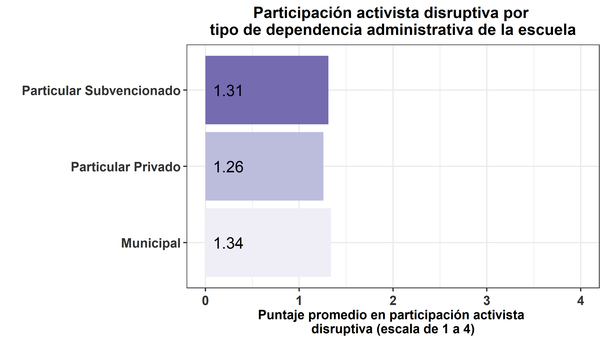

### Participación política durante el segundo semestre de 2021

```{r}
#### Crear variable
data_wide$part_act_dis_21_2s = as.numeric(data_wide$part_pol_marc_dis_21b + data_wide$part_pol_bloq_21b + data_wide$part_pol_rayar_21b + data_wide$part_pol_toma_21b)/4
```

```{r}
# Creación de bbdd
data_mun = data_wide %>%  filter(edm_admi==1) %>% as.data.frame() #Municipal
data_sub = data_wide %>%  filter(edm_admi==2) %>% as.data.frame() #Particular Subvencionado
data_priv = data_wide %>%  filter(edm_admi==3) %>% as.data.frame() #Particular pagado
```

```{r}
table_preposh1<- rbind(psych::describe(data_mun$part_act_dis_21_2s, na.rm=T),
               psych::describe(data_sub$part_act_dis_21_2s, na.rm=T),psych::describe(data_priv$part_act_dis_21_2s, na.rm=T))
table_preposh1 <- table_preposh1 %>% select(n,mean,sd,median,trimmed,min,max)

pond1 <- stats::weighted.mean(x=data_mun$part_act_dis_21_2s,y=data_mun$weight_w03,na.rm=TRUE)
pond2 <- stats::weighted.mean(x=data_sub$part_act_dis_21_2s,y=data_sub$weight_w03,na.rm=TRUE)
pond3 <- stats::weighted.mean(x=data_priv$part_act_dis_21_2s,y=data_priv$weight_w03,na.rm=TRUE)

table_preposh1[1,2]<-pond1
table_preposh1[2,2]<-pond2
table_preposh1[3,2]<-pond3

table_preposh1$dep <- c("Municipal","Particular Subvencionado","Particular Privado")

part_act_dis_21_2s_colegio <-  ggplot(data=table_preposh1, aes(x=dep, y=mean, fill=dep)) +
     geom_bar(position = 'dodge', stat='identity')+#,width=0.8) 
     scale_fill_brewer(palette="Purples") +
     geom_text(aes(label=format(round(mean,2)), y=0), position=position_dodge(0.9), hjust=-0.25, size=6) +
     theme_bw(base_size = 14) +
     scale_y_continuous(labels = scales::comma) +
     ylab('Puntaje promedio en participación activista 
disruptiva (escala de 1 a 4)') + xlab(' ') + 
     theme(legend.position="top") +
     labs(fill = " ") +
    coord_flip()+
    theme(axis.text.x = element_text(colour = "grey20", size = 14, angle = 360, hjust = 0.5, vjust = 0.5, face = "bold"),
          axis.text.y = element_text(colour = "grey20", size = 14), 
          text = element_text(size = 14, face = "bold"),
          plot.title = element_text(hjust=0.5),
          legend.position = "none") + 
     ggtitle("Participación activista disruptiva por 
tipo de dependencia administrativa de la escuela") + ylim(0,4)
#part_act_dis_21_2s_colegio
ggsave(part_act_dis_21_2s_colegio, file = "../output/graphs/part_act_dis_21_2s_colegio_dep.png",device = "png",width = 23,height = 13,dpi = "retina",units = "cm")
```
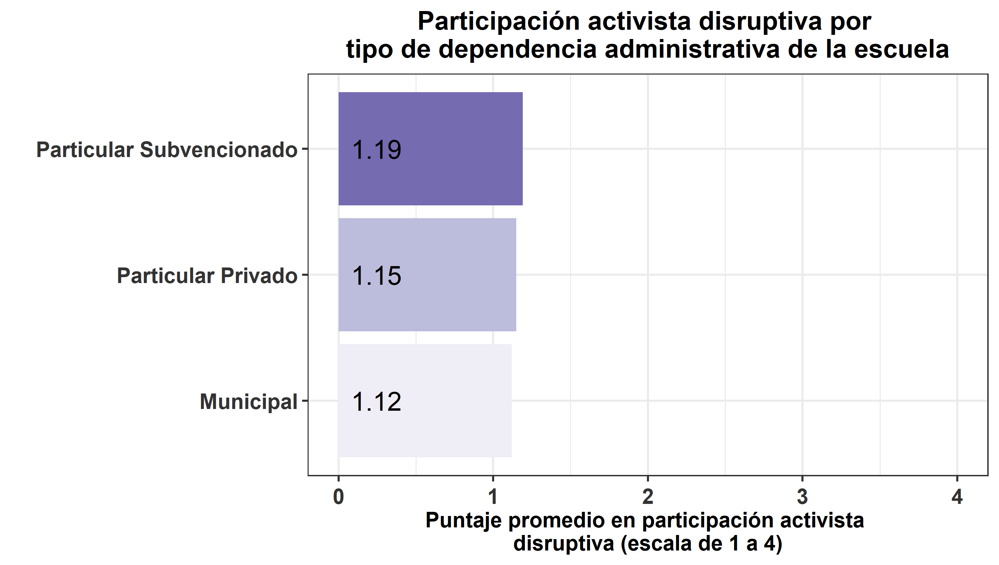


## Máximo nivel educativo de la madre
### Participación política durante 3ro y 4to medio
```{r}
### Crear variable
data_wide$part_act_dis_3y4 <- as.numeric(data_wide$part_pol_marcha_dis + data_wide$part_pol_bloqueo + data_wide$part_pol_rayar.y + data_wide$part_pol_toma.y)/4
```


```{r}
# Creación de bbdd
data_ed_bas = data_wide %>%  filter(nse_madre==1 | nse_madre==2 | nse_madre==3 | nse_madre==4) %>% as.data.frame() # Sin Ed. (1), Ed. básica incompleta (2) o completa (3)
data_ed_med = data_wide %>%  filter(nse_madre==4 | nse_madre==5) %>% as.data.frame() # Ed. media incompleta (4) o completa (5)
data_ed_ter = data_wide %>%  filter(nse_madre==6 | nse_madre==7 | nse_madre==8 | nse_madre==9 | nse_madre==10) %>% as.data.frame() # técnico superior incompleto (6) o completo (7) Universitaria incompleta (8) o completa (9), Estudios de postgrado (magíster o doctorado) (10)

#data_ed_tec = data_wide %>%  filter(nse_madre==6 | nse_madre==7) %>% as.data.frame() # técnico superior incompleto (6) o completo (7)
#data_ed_uni = data_wide %>%  filter(nse_madre==8 | nse_madre==9 | nse_madre==10) %>% as.data.frame() # Universitaria incompleta (8) o completa (9), Estudios de postgrado (magíster o doctorado) (10)
```

```{r}
table_preposh1<- rbind(psych::describe(data_ed_bas$part_act_dis_3y4, na.rm=T),
               psych::describe(data_ed_med$part_act_dis_3y4, na.rm=T),
               psych::describe(data_ed_ter$part_act_dis_3y4, na.rm=T))#,
#               psych::describe(data_ed_uni$part_act_dis_3y4, na.rm=T))
table_preposh1 <- table_preposh1 %>% select(n,mean,sd,median,trimmed,min,max)

pond1 <- stats::weighted.mean(x=data_ed_bas$part_act_dis_3y4,y=data_ed_bas$weight_w01,na.rm=TRUE)
pond2 <- stats::weighted.mean(x=data_ed_med$part_act_dis_3y4,y=data_ed_med$weight_w01,na.rm=TRUE)
pond3 <- stats::weighted.mean(x=data_ed_ter$part_act_dis_3y4,y=data_ed_ter$weight_w01,na.rm=TRUE)
#pond4 <- stats::weighted.mean(x=data_ed_uni$part_act_dis_3y4,y=data_ed_uni$weight_w01,na.rm=TRUE)

table_preposh1[1,2]<-pond1
table_preposh1[2,2]<-pond2
table_preposh1[3,2]<-pond3
#table_preposh1[4,2]<-pond4

#table_preposh1$dep <- c("Ed. básica o menos","Ed. media","Técnico superior", "Universitaria o más")
table_preposh1$dep <- c("Ed. básica o menos","Ed. media","Ed. terciaria")

part_act_dis_3y4_colegio <-  ggplot(data=table_preposh1, aes(x=dep, y=mean, fill=dep)) +
     geom_bar(position = 'dodge', stat='identity')+#,width=0.8) 
     scale_fill_brewer(palette="Purples") +
     geom_text(aes(label=format(round(mean,2)), y=0), position=position_dodge(0.9), hjust=-0.25, size=6) +
     theme_bw(base_size = 14) +
     scale_y_continuous(labels = scales::comma) +
     ylab('Puntaje promedio en participación activista 
disruptiva (escala de 1 a 4)') + xlab(' ') + 
     theme(legend.position="top") +
     labs(fill = " ") +
    coord_flip()+
    theme(axis.text.x = element_text(colour = "grey20", size = 14, angle = 360, hjust = 0.5, vjust = 0.5, face = "bold"),
          axis.text.y = element_text(colour = "grey20", size = 14), 
          text = element_text(size = 14, face = "bold"),
          plot.title = element_text(hjust=0.5),
          legend.position = "none") + 
     ggtitle("Participación activista disruptiva por 
nivel educativo de la madre") + ylim(0,4)
#part_act_dis_3y4_colegio
ggsave(part_act_dis_3y4_colegio, file = "../output/graphs/part_act_dis_3y4_colegio_ed_madre.png",device = "png",width = 23,height = 13,dpi = "retina",units = "cm")

```


### Participación política durante estallido social

```{r}
### Crear variable
data_wide$part_act_dis_es <- as.numeric(data_wide$part_pol_marc_dis_21 + data_wide$part_pol_bloq_21 + data_wide$part_pol_rayar_21 + data_wide$part_pol_toma_21)/4
```

```{r}
# Creación de bbdd
data_ed_bas = data_wide %>%  filter(nse_madre==1 | nse_madre==2 | nse_madre==3 | nse_madre==4) %>% as.data.frame() # Sin Ed. (1), Ed. básica incompleta (2) o completa (3)
data_ed_med = data_wide %>%  filter(nse_madre==4 | nse_madre==5) %>% as.data.frame() # Ed. media incompleta (4) o completa (5)
data_ed_ter = data_wide %>%  filter(nse_madre==6 | nse_madre==7 | nse_madre==8 | nse_madre==9 | nse_madre==10) %>% as.data.frame() # técnico superior incompleto (6) o completo (7) Universitaria incompleta (8) o completa (9), Estudios de postgrado (magíster o doctorado) (10)

#data_ed_tec = data_wide %>%  filter(nse_madre==6 | nse_madre==7) %>% as.data.frame() # técnico superior incompleto (6) o completo (7)
#data_ed_uni = data_wide %>%  filter(nse_madre==8 | nse_madre==9 | nse_madre==10) %>% as.data.frame() # Universitaria incompleta (8) o completa (9), Estudios de postgrado (magíster o doctorado) (10)
```

```{r}
table_preposh1<- rbind(psych::describe(data_ed_bas$part_act_dis_es, na.rm=T),
               psych::describe(data_ed_med$part_act_dis_es, na.rm=T),
               psych::describe(data_ed_ter$part_act_dis_es, na.rm=T))#,
#               psych::describe(data_ed_uni$part_act_dis_es, na.rm=T))
table_preposh1 <- table_preposh1 %>% select(n,mean,sd,median,trimmed,min,max)

pond1 <- stats::weighted.mean(x=data_ed_bas$part_act_dis_es,y=data_ed_bas$weight_w01,na.rm=TRUE)
pond2 <- stats::weighted.mean(x=data_ed_med$part_act_dis_es,y=data_ed_med$weight_w01,na.rm=TRUE)
pond3 <- stats::weighted.mean(x=data_ed_ter$part_act_dis_es,y=data_ed_ter$weight_w01,na.rm=TRUE)
#pond4 <- stats::weighted.mean(x=data_ed_uni$part_act_dis_es,y=data_ed_uni$weight_w01,na.rm=TRUE)

table_preposh1[1,2]<-pond1
table_preposh1[2,2]<-pond2
table_preposh1[3,2]<-pond3
#table_preposh1[4,2]<-pond4

#table_preposh1$dep <- c("Ed. básica o menos","Ed. media","Técnico superior", "Universitaria o más")
table_preposh1$dep <- c("Ed. básica o menos","Ed. media","Ed. terciaria")

part_act_dis_es_colegio <-  ggplot(data=table_preposh1, aes(x=dep, y=mean, fill=dep)) +
     geom_bar(position = 'dodge', stat='identity')+#,width=0.8) 
     scale_fill_brewer(palette="Purples") +
     geom_text(aes(label=format(round(mean,2)), y=0), position=position_dodge(0.9), hjust=-0.25, size=6) +
     theme_bw(base_size = 14) +
     scale_y_continuous(labels = scales::comma) +
     ylab('Puntaje promedio en participación activista 
disruptiva (escala de 1 a 4)') + xlab(' ') + 
     theme(legend.position="top") +
     labs(fill = " ") +
    coord_flip()+
    theme(axis.text.x = element_text(colour = "grey20", size = 14, angle = 360, hjust = 0.5, vjust = 0.5, face = "bold"),
          axis.text.y = element_text(colour = "grey20", size = 14), 
          text = element_text(size = 14, face = "bold"),
          plot.title = element_text(hjust=0.5),
          legend.position = "none") + 
     ggtitle("Participación activista disruptiva por 
nivel educativo de la madre") + ylim(0,4)
#part_act_dis_es_colegio
ggsave(part_act_dis_es_colegio, file = "../output/graphs/part_act_dis_es_colegio_ed_madre.png",device = "png",width = 23,height = 13,dpi = "retina",units = "cm")

```


### Participación política durante el 2020

```{r}
### Crear variable
data_wide$part_act_dis_20 = as.numeric(data_wide$part_pol_marc_dis_20 + data_wide$part_pol_bloq_20 + data_wide$part_pol_rayar_20 + data_wide$part_pol_toma_20)/4
```

```{r}
# Creación de bbdd
data_ed_bas = data_wide %>%  filter(nse_madre==1 | nse_madre==2 | nse_madre==3 | nse_madre==4) %>% as.data.frame() # Sin Ed. (1), Ed. básica incompleta (2) o completa (3)
data_ed_med = data_wide %>%  filter(nse_madre==4 | nse_madre==5) %>% as.data.frame() # Ed. media incompleta (4) o completa (5)
data_ed_ter = data_wide %>%  filter(nse_madre==6 | nse_madre==7 | nse_madre==8 | nse_madre==9 | nse_madre==10) %>% as.data.frame() # técnico superior incompleto (6) o completo (7) Universitaria incompleta (8) o completa (9), Estudios de postgrado (magíster o doctorado) (10)

#data_ed_tec = data_wide %>%  filter(nse_madre==6 | nse_madre==7) %>% as.data.frame() # técnico superior incompleto (6) o completo (7)
#data_ed_uni = data_wide %>%  filter(nse_madre==8 | nse_madre==9 | nse_madre==10) %>% as.data.frame() # Universitaria incompleta (8) o completa (9), Estudios de postgrado (magíster o doctorado) (10)
```

```{r}
table_preposh1<- rbind(psych::describe(data_ed_bas$part_act_dis_20, na.rm=T),
               psych::describe(data_ed_med$part_act_dis_20, na.rm=T),
               psych::describe(data_ed_ter$part_act_dis_20, na.rm=T))#,
#               psych::describe(data_ed_uni$part_act_dis_20, na.rm=T))
table_preposh1 <- table_preposh1 %>% select(n,mean,sd,median,trimmed,min,max)

pond1 <- stats::weighted.mean(x=data_ed_bas$part_act_dis_20,y=data_ed_bas$weight_w01,na.rm=TRUE)
pond2 <- stats::weighted.mean(x=data_ed_med$part_act_dis_20,y=data_ed_med$weight_w01,na.rm=TRUE)
pond3 <- stats::weighted.mean(x=data_ed_ter$part_act_dis_20,y=data_ed_ter$weight_w01,na.rm=TRUE)
#pond4 <- stats::weighted.mean(x=data_ed_uni$part_act_dis_20,y=data_ed_uni$weight_w01,na.rm=TRUE)

table_preposh1[1,2]<-pond1
table_preposh1[2,2]<-pond2
table_preposh1[3,2]<-pond3
#table_preposh1[4,2]<-pond4

#table_preposh1$dep <- c("Ed. básica o menos","Ed. media","Técnico superior", "Universitaria o más")
table_preposh1$dep <- c("Ed. básica o menos","Ed. media","Ed. terciaria")

part_act_dis_20_colegio <-  ggplot(data=table_preposh1, aes(x=dep, y=mean, fill=dep)) +
     geom_bar(position = 'dodge', stat='identity')+#,width=0.8) 
     scale_fill_brewer(palette="Purples") +
     geom_text(aes(label=format(round(mean,2)), y=0), position=position_dodge(0.9), hjust=-0.25, size=6) +
     theme_bw(base_size = 14) +
     scale_y_continuous(labels = scales::comma) +
     ylab('Puntaje promedio en participación activista 
disruptiva (escala de 1 a 4)') + xlab(' ') + 
     theme(legend.position="top") +
     labs(fill = " ") +
    coord_flip()+
    theme(axis.text.x = element_text(colour = "grey20", size = 14, angle = 360, hjust = 0.5, vjust = 0.5, face = "bold"),
          axis.text.y = element_text(colour = "grey20", size = 14), 
          text = element_text(size = 14, face = "bold"),
          plot.title = element_text(hjust=0.5),
          legend.position = "none") + 
     ggtitle("Participación activista disruptiva por 
nivel educativo de la madre") + ylim(0,4)
#part_act_dis_20_colegio
ggsave(part_act_dis_20_colegio, file = "../output/graphs/part_act_dis_20_colegio_ed_madre.png",device = "png",width = 23,height = 13,dpi = "retina",units = "cm")
```


### Participación política durante el primer semestre de 2021

```{r}
#### Crear variable
data_wide$part_act_dis_21_1s = as.numeric(data_wide$part_pol_marcha_dis + data_wide$part_pol_bloq + data_wide$part_pol_rayar.x + data_wide$part_pol_toma.x)/4
```

```{r}
# Creación de bbdd
data_ed_bas = data_wide %>%  filter(nse_madre==1 | nse_madre==2 | nse_madre==3 | nse_madre==4) %>% as.data.frame() # Sin Ed. (1), Ed. básica incompleta (2) o completa (3)
data_ed_med = data_wide %>%  filter(nse_madre==4 | nse_madre==5) %>% as.data.frame() # Ed. media incompleta (4) o completa (5)
data_ed_ter = data_wide %>%  filter(nse_madre==6 | nse_madre==7 | nse_madre==8 | nse_madre==9 | nse_madre==10) %>% as.data.frame() # técnico superior incompleto (6) o completo (7) Universitaria incompleta (8) o completa (9), Estudios de postgrado (magíster o doctorado) (10)

#data_ed_tec = data_wide %>%  filter(nse_madre==6 | nse_madre==7) %>% as.data.frame() # técnico superior incompleto (6) o completo (7)
#data_ed_uni = data_wide %>%  filter(nse_madre==8 | nse_madre==9 | nse_madre==10) %>% as.data.frame() # Universitaria incompleta (8) o completa (9), Estudios de postgrado (magíster o doctorado) (10)
```

```{r}
table_preposh1<- rbind(psych::describe(data_ed_bas$part_act_dis_21_1s, na.rm=T),
               psych::describe(data_ed_med$part_act_dis_21_1s, na.rm=T),
               psych::describe(data_ed_ter$part_act_dis_21_1s, na.rm=T))#,
#               psych::describe(data_ed_uni$part_act_dis_21_1s, na.rm=T))
table_preposh1 <- table_preposh1 %>% select(n,mean,sd,median,trimmed,min,max)

pond1 <- stats::weighted.mean(x=data_ed_bas$part_act_dis_21_1s,y=data_ed_bas$weight_w01,na.rm=TRUE)
pond2 <- stats::weighted.mean(x=data_ed_med$part_act_dis_21_1s,y=data_ed_med$weight_w01,na.rm=TRUE)
pond3 <- stats::weighted.mean(x=data_ed_ter$part_act_dis_21_1s,y=data_ed_ter$weight_w01,na.rm=TRUE)
#pond4 <- stats::weighted.mean(x=data_ed_uni$part_act_dis_21_1s,y=data_ed_uni$weight_w01,na.rm=TRUE)

table_preposh1[1,2]<-pond1
table_preposh1[2,2]<-pond2
table_preposh1[3,2]<-pond3
#table_preposh1[4,2]<-pond4

#table_preposh1$dep <- c("Ed. básica o menos","Ed. media","Técnico superior", "Universitaria o más")
table_preposh1$dep <- c("Ed. básica o menos","Ed. media","Ed. terciaria")

part_act_dis_21_1s_colegio <-  ggplot(data=table_preposh1, aes(x=dep, y=mean, fill=dep)) +
     geom_bar(position = 'dodge', stat='identity')+#,width=0.8) 
     scale_fill_brewer(palette="Purples") +
     geom_text(aes(label=format(round(mean,2)), y=0), position=position_dodge(0.9), hjust=-0.25, size=6) +
     theme_bw(base_size = 14) +
     scale_y_continuous(labels = scales::comma) +
     ylab('Puntaje promedio en participación activista 
disruptiva (escala de 1 a 4)') + xlab(' ') + 
     theme(legend.position="top") +
     labs(fill = " ") +
    coord_flip()+
    theme(axis.text.x = element_text(colour = "grey20", size = 14, angle = 360, hjust = 0.5, vjust = 0.5, face = "bold"),
          axis.text.y = element_text(colour = "grey20", size = 14), 
          text = element_text(size = 14, face = "bold"),
          plot.title = element_text(hjust=0.5),
          legend.position = "none") + 
     ggtitle("Participación activista disruptiva por 
nivel educativo de la madre") + ylim(0,4)
#part_act_dis_21_1s_colegio
ggsave(part_act_dis_21_1s_colegio, file = "../output/graphs/part_act_dis_21_1s_colegio_ed_madre.png",device = "png",width = 23,height = 13,dpi = "retina",units = "cm")
```


### Participación política durante el segundo semestre de 2021

```{r}
#### Crear variable
data_wide$part_act_dis_21_2s = as.numeric(data_wide$part_pol_marc_dis_21b + data_wide$part_pol_bloq_21b + data_wide$part_pol_rayar_21b + data_wide$part_pol_toma_21b)/4
```

```{r}
# Creación de bbdd
data_ed_bas = data_wide %>%  filter(nse_madre==1 | nse_madre==2 | nse_madre==3 | nse_madre==4) %>% as.data.frame() # Sin Ed. (1), Ed. básica incompleta (2) o completa (3)
data_ed_med = data_wide %>%  filter(nse_madre==4 | nse_madre==5) %>% as.data.frame() # Ed. media incompleta (4) o completa (5)
data_ed_ter = data_wide %>%  filter(nse_madre==6 | nse_madre==7 | nse_madre==8 | nse_madre==9 | nse_madre==10) %>% as.data.frame() # técnico superior incompleto (6) o completo (7) Universitaria incompleta (8) o completa (9), Estudios de postgrado (magíster o doctorado) (10)

#data_ed_tec = data_wide %>%  filter(nse_madre==6 | nse_madre==7) %>% as.data.frame() # técnico superior incompleto (6) o completo (7)
#data_ed_uni = data_wide %>%  filter(nse_madre==8 | nse_madre==9 | nse_madre==10) %>% as.data.frame() # Universitaria incompleta (8) o completa (9), Estudios de postgrado (magíster o doctorado) (10)
```

```{r}
table_preposh1<- rbind(psych::describe(data_ed_bas$part_act_dis_21_2s, na.rm=T),
               psych::describe(data_ed_med$part_act_dis_21_2s, na.rm=T),
               psych::describe(data_ed_ter$part_act_dis_21_2s, na.rm=T))#,
#               psych::describe(data_ed_uni$part_act_dis_21_2s, na.rm=T))
table_preposh1 <- table_preposh1 %>% select(n,mean,sd,median,trimmed,min,max)

pond1 <- stats::weighted.mean(x=data_ed_bas$part_act_dis_21_2s,y=data_ed_bas$weight_w01,na.rm=TRUE)
pond2 <- stats::weighted.mean(x=data_ed_med$part_act_dis_21_2s,y=data_ed_med$weight_w01,na.rm=TRUE)
pond3 <- stats::weighted.mean(x=data_ed_ter$part_act_dis_21_2s,y=data_ed_ter$weight_w01,na.rm=TRUE)
#pond4 <- stats::weighted.mean(x=data_ed_uni$part_act_dis_21_2s,y=data_ed_uni$weight_w01,na.rm=TRUE)

table_preposh1[1,2]<-pond1
table_preposh1[2,2]<-pond2
table_preposh1[3,2]<-pond3
#table_preposh1[4,2]<-pond4

#table_preposh1$dep <- c("Ed. básica o menos","Ed. media","Técnico superior", "Universitaria o más")
table_preposh1$dep <- c("Ed. básica o menos","Ed. media","Ed. terciaria")

part_act_dis_21_2s_colegio <-  ggplot(data=table_preposh1, aes(x=dep, y=mean, fill=dep)) +
     geom_bar(position = 'dodge', stat='identity')+#,width=0.8) 
     scale_fill_brewer(palette="Purples") +
     geom_text(aes(label=format(round(mean,2)), y=0), position=position_dodge(0.9), hjust=-0.25, size=6) +
     theme_bw(base_size = 14) +
     scale_y_continuous(labels = scales::comma) +
     ylab('Puntaje promedio en participación activista 
disruptiva (escala de 1 a 4)') + xlab(' ') + 
     theme(legend.position="top") +
     labs(fill = " ") +
    coord_flip()+
    theme(axis.text.x = element_text(colour = "grey20", size = 14, angle = 360, hjust = 0.5, vjust = 0.5, face = "bold"),
          axis.text.y = element_text(colour = "grey20", size = 14), 
          text = element_text(size = 14, face = "bold"),
          plot.title = element_text(hjust=0.5),
          legend.position = "none") + 
     ggtitle("Participación activista disruptiva por 
nivel educativo de la madre") + ylim(0,4)
#part_act_dis_21_2s_colegio
ggsave(part_act_dis_21_2s_colegio, file = "../output/graphs/part_act_dis_21_2s_colegio_ed_madre.png",device = "png",width = 23,height = 13,dpi = "retina",units = "cm")
```


## Máximo nivel educativo del padre
### Participación política durante 3ro y 4to medio

```{r}
### Crear variable
data_wide$part_act_dis_3y4 <- as.numeric(data_wide$part_pol_marcha_dis + data_wide$part_pol_bloqueo + data_wide$part_pol_rayar.y + data_wide$part_pol_toma.y)/4
```

```{r}
# Creación de bbdd
data_ed_bas = data_wide %>%  filter(nse_padre==1 | nse_padre==2 | nse_padre==3 | nse_padre==4) %>% as.data.frame() # Sin Ed. (1), Ed. básica incompleta (2) o completa (3)
data_ed_med = data_wide %>%  filter(nse_padre==4 | nse_padre==5) %>% as.data.frame() # Ed. media incompleta (4) o completa (5)
data_ed_ter = data_wide %>%  filter(nse_padre==6 | nse_padre==7 | nse_padre==8 | nse_padre==9 | nse_padre==10) %>% as.data.frame() # técnico superior incompleto (6) o completo (7) Universitaria incompleta (8) o completa (9), Estudios de postgrado (magíster o doctorado) (10)

#data_ed_tec = data_wide %>%  filter(nse_padre==6 | nse_padre==7) %>% as.data.frame() # técnico superior incompleto (6) o completo (7)
#data_ed_uni = data_wide %>%  filter(nse_padre==8 | nse_padre==9 | nse_padre==10) %>% as.data.frame() # Universitaria incompleta (8) o completa (9), Estudios de postgrado (magíster o doctorado) (10)

```

```{r}
table_preposh1<- rbind(psych::describe(data_ed_bas$part_act_dis_3y4, na.rm=T),
               psych::describe(data_ed_med$part_act_dis_3y4, na.rm=T),
               psych::describe(data_ed_ter$part_act_dis_3y4, na.rm=T))#,
#               psych::describe(data_ed_uni$part_act_dis_3y4, na.rm=T))
table_preposh1 <- table_preposh1 %>% select(n,mean,sd,median,trimmed,min,max)

pond1 <- stats::weighted.mean(x=data_ed_bas$part_act_dis_3y4,y=data_ed_bas$weight_w01,na.rm=TRUE)
pond2 <- stats::weighted.mean(x=data_ed_med$part_act_dis_3y4,y=data_ed_med$weight_w01,na.rm=TRUE)
pond3 <- stats::weighted.mean(x=data_ed_ter$part_act_dis_3y4,y=data_ed_ter$weight_w01,na.rm=TRUE)
#pond4 <- stats::weighted.mean(x=data_ed_uni$part_act_dis_3y4,y=data_ed_uni$weight_w01,na.rm=TRUE)

table_preposh1[1,2]<-pond1
table_preposh1[2,2]<-pond2
table_preposh1[3,2]<-pond3
#table_preposh1[4,2]<-pond4

#table_preposh1$dep <- c("Ed. básica o menos","Ed. media","Técnico superior", "Universitaria o más")
table_preposh1$dep <- c("Ed. básica o menos","Ed. media","Ed. terciaria")

part_act_dis_3y4_colegio <-  ggplot(data=table_preposh1, aes(x=dep, y=mean, fill=dep)) +
     geom_bar(position = 'dodge', stat='identity')+#,width=0.8) 
     scale_fill_brewer(palette="Purples") +
     geom_text(aes(label=format(round(mean,2)), y=0), position=position_dodge(0.9), hjust=-0.25, size=6) +
     theme_bw(base_size = 14) +
     scale_y_continuous(labels = scales::comma) +
     ylab('Puntaje promedio en participación activista 
disruptiva (escala de 1 a 4)') + xlab(' ') + 
     theme(legend.position="top") +
     labs(fill = " ") +
    coord_flip()+
    theme(axis.text.x = element_text(colour = "grey20", size = 14, angle = 360, hjust = 0.5, vjust = 0.5, face = "bold"),
          axis.text.y = element_text(colour = "grey20", size = 14), 
          text = element_text(size = 14, face = "bold"),
          plot.title = element_text(hjust=0.5),
          legend.position = "none") + 
     ggtitle("Participación activista disruptiva por 
nivel educativo de la padre") + ylim(0,4)
#part_act_dis_3y4_colegio
ggsave(part_act_dis_3y4_colegio, file = "../output/graphs/part_act_dis_3y4_colegio_ed_padre.png",device = "png",width = 23,height = 13,dpi = "retina",units = "cm")

```


### Participación política durante estallido social

```{r}
### Crear variable
data_wide$part_act_dis_es <- as.numeric(data_wide$part_pol_marc_dis_21 + data_wide$part_pol_bloq_21 + data_wide$part_pol_rayar_21 + data_wide$part_pol_toma_21)/4
```

```{r}
# Creación de bbdd
data_ed_bas = data_wide %>%  filter(nse_padre==1 | nse_padre==2 | nse_padre==3 | nse_padre==4) %>% as.data.frame() # Sin Ed. (1), Ed. básica incompleta (2) o completa (3)
data_ed_med = data_wide %>%  filter(nse_padre==4 | nse_padre==5) %>% as.data.frame() # Ed. media incompleta (4) o completa (5)
data_ed_ter = data_wide %>%  filter(nse_padre==6 | nse_padre==7 | nse_padre==8 | nse_padre==9 | nse_padre==10) %>% as.data.frame() # técnico superior incompleto (6) o completo (7) Universitaria incompleta (8) o completa (9), Estudios de postgrado (magíster o doctorado) (10)

#data_ed_tec = data_wide %>%  filter(nse_padre==6 | nse_padre==7) %>% as.data.frame() # técnico superior incompleto (6) o completo (7)
#data_ed_uni = data_wide %>%  filter(nse_padre==8 | nse_padre==9 | nse_padre==10) %>% as.data.frame() # Universitaria incompleta (8) o completa (9), Estudios de postgrado (magíster o doctorado) (10)

```

```{r}
table_preposh1<- rbind(psych::describe(data_ed_bas$part_act_dis_es, na.rm=T),
               psych::describe(data_ed_med$part_act_dis_es, na.rm=T),
               psych::describe(data_ed_ter$part_act_dis_es, na.rm=T))#,
#               psych::describe(data_ed_uni$part_act_dis_es, na.rm=T))
table_preposh1 <- table_preposh1 %>% select(n,mean,sd,median,trimmed,min,max)

pond1 <- stats::weighted.mean(x=data_ed_bas$part_act_dis_es,y=data_ed_bas$weight_w01,na.rm=TRUE)
pond2 <- stats::weighted.mean(x=data_ed_med$part_act_dis_es,y=data_ed_med$weight_w01,na.rm=TRUE)
pond3 <- stats::weighted.mean(x=data_ed_ter$part_act_dis_es,y=data_ed_ter$weight_w01,na.rm=TRUE)
#pond4 <- stats::weighted.mean(x=data_ed_uni$part_act_dis_es,y=data_ed_uni$weight_w01,na.rm=TRUE)

table_preposh1[1,2]<-pond1
table_preposh1[2,2]<-pond2
table_preposh1[3,2]<-pond3
#table_preposh1[4,2]<-pond4

#table_preposh1$dep <- c("Ed. básica o menos","Ed. media","Técnico superior", "Universitaria o más")
table_preposh1$dep <- c("Ed. básica o menos","Ed. media","Ed. terciaria")

part_act_dis_es_colegio <-  ggplot(data=table_preposh1, aes(x=dep, y=mean, fill=dep)) +
     geom_bar(position = 'dodge', stat='identity')+#,width=0.8) 
     scale_fill_brewer(palette="Purples") +
     geom_text(aes(label=format(round(mean,2)), y=0), position=position_dodge(0.9), hjust=-0.25, size=6) +
     theme_bw(base_size = 14) +
     scale_y_continuous(labels = scales::comma) +
     ylab('Puntaje promedio en participación activista 
disruptiva (escala de 1 a 4)') + xlab(' ') + 
     theme(legend.position="top") +
     labs(fill = " ") +
    coord_flip()+
    theme(axis.text.x = element_text(colour = "grey20", size = 14, angle = 360, hjust = 0.5, vjust = 0.5, face = "bold"),
          axis.text.y = element_text(colour = "grey20", size = 14), 
          text = element_text(size = 14, face = "bold"),
          plot.title = element_text(hjust=0.5),
          legend.position = "none") + 
     ggtitle("Participación activista disruptiva por 
nivel educativo de la padre") + ylim(0,4)
#part_act_dis_es_colegio
ggsave(part_act_dis_es_colegio, file = "../output/graphs/part_act_dis_es_colegio_ed_padre.png",device = "png",width = 23,height = 13,dpi = "retina",units = "cm")

```


### Participación política durante el 2020

```{r}
### Crear variable
data_wide$part_act_dis_20 = as.numeric(data_wide$part_pol_marc_dis_20 + data_wide$part_pol_bloq_20 + data_wide$part_pol_rayar_20 + data_wide$part_pol_toma_20)/4
```

```{r}
# Creación de bbdd
data_ed_bas = data_wide %>%  filter(nse_padre==1 | nse_padre==2 | nse_padre==3 | nse_padre==4) %>% as.data.frame() # Sin Ed. (1), Ed. básica incompleta (2) o completa (3)
data_ed_med = data_wide %>%  filter(nse_padre==4 | nse_padre==5) %>% as.data.frame() # Ed. media incompleta (4) o completa (5)
data_ed_ter = data_wide %>%  filter(nse_padre==6 | nse_padre==7 | nse_padre==8 | nse_padre==9 | nse_padre==10) %>% as.data.frame() # técnico superior incompleto (6) o completo (7) Universitaria incompleta (8) o completa (9), Estudios de postgrado (magíster o doctorado) (10)

#data_ed_tec = data_wide %>%  filter(nse_padre==6 | nse_padre==7) %>% as.data.frame() # técnico superior incompleto (6) o completo (7)
#data_ed_uni = data_wide %>%  filter(nse_padre==8 | nse_padre==9 | nse_padre==10) %>% as.data.frame() # Universitaria incompleta (8) o completa (9), Estudios de postgrado (magíster o doctorado) (10)

```

```{r}
table_preposh1<- rbind(psych::describe(data_ed_bas$part_act_dis_20, na.rm=T),
               psych::describe(data_ed_med$part_act_dis_20, na.rm=T),
               psych::describe(data_ed_ter$part_act_dis_20, na.rm=T))#,
#               psych::describe(data_ed_uni$part_act_dis_20, na.rm=T))
table_preposh1 <- table_preposh1 %>% select(n,mean,sd,median,trimmed,min,max)

pond1 <- stats::weighted.mean(x=data_ed_bas$part_act_dis_20,y=data_ed_bas$weight_w01,na.rm=TRUE)
pond2 <- stats::weighted.mean(x=data_ed_med$part_act_dis_20,y=data_ed_med$weight_w01,na.rm=TRUE)
pond3 <- stats::weighted.mean(x=data_ed_ter$part_act_dis_20,y=data_ed_ter$weight_w01,na.rm=TRUE)
#pond4 <- stats::weighted.mean(x=data_ed_uni$part_act_dis_20,y=data_ed_uni$weight_w01,na.rm=TRUE)

table_preposh1[1,2]<-pond1
table_preposh1[2,2]<-pond2
table_preposh1[3,2]<-pond3
#table_preposh1[4,2]<-pond4

#table_preposh1$dep <- c("Ed. básica o menos","Ed. media","Técnico superior", "Universitaria o más")
table_preposh1$dep <- c("Ed. básica o menos","Ed. media","Ed. terciaria")

part_act_dis_20_colegio <-  ggplot(data=table_preposh1, aes(x=dep, y=mean, fill=dep)) +
     geom_bar(position = 'dodge', stat='identity')+#,width=0.8) 
     scale_fill_brewer(palette="Purples") +
     geom_text(aes(label=format(round(mean,2)), y=0), position=position_dodge(0.9), hjust=-0.25, size=6) +
     theme_bw(base_size = 14) +
     scale_y_continuous(labels = scales::comma) +
     ylab('Puntaje promedio en participación activista 
disruptiva (escala de 1 a 4)') + xlab(' ') + 
     theme(legend.position="top") +
     labs(fill = " ") +
    coord_flip()+
    theme(axis.text.x = element_text(colour = "grey20", size = 14, angle = 360, hjust = 0.5, vjust = 0.5, face = "bold"),
          axis.text.y = element_text(colour = "grey20", size = 14), 
          text = element_text(size = 14, face = "bold"),
          plot.title = element_text(hjust=0.5),
          legend.position = "none") + 
     ggtitle("Participación activista disruptiva por 
nivel educativo de la padre") + ylim(0,4)
#part_act_dis_20_colegio
ggsave(part_act_dis_20_colegio, file = "../output/graphs/part_act_dis_20_colegio_ed_padre.png",device = "png",width = 23,height = 13,dpi = "retina",units = "cm")
```


### Participación política durante el primer semestre de 2021

```{r}
#### Crear variable
data_wide$part_act_dis_21_1s = as.numeric(data_wide$part_pol_marcha_dis + data_wide$part_pol_bloq + data_wide$part_pol_rayar.x + data_wide$part_pol_toma.x)/4
```

```{r}
# Creación de bbdd
data_ed_bas = data_wide %>%  filter(nse_padre==1 | nse_padre==2 | nse_padre==3 | nse_padre==4) %>% as.data.frame() # Sin Ed. (1), Ed. básica incompleta (2) o completa (3)
data_ed_med = data_wide %>%  filter(nse_padre==4 | nse_padre==5) %>% as.data.frame() # Ed. media incompleta (4) o completa (5)
data_ed_ter = data_wide %>%  filter(nse_padre==6 | nse_padre==7 | nse_padre==8 | nse_padre==9 | nse_padre==10) %>% as.data.frame() # técnico superior incompleto (6) o completo (7) Universitaria incompleta (8) o completa (9), Estudios de postgrado (magíster o doctorado) (10)

#data_ed_tec = data_wide %>%  filter(nse_padre==6 | nse_padre==7) %>% as.data.frame() # técnico superior incompleto (6) o completo (7)
#data_ed_uni = data_wide %>%  filter(nse_padre==8 | nse_padre==9 | nse_padre==10) %>% as.data.frame() # Universitaria incompleta (8) o completa (9), Estudios de postgrado (magíster o doctorado) (10)

```

```{r}
table_preposh1<- rbind(psych::describe(data_ed_bas$part_act_dis_21_1s, na.rm=T),
               psych::describe(data_ed_med$part_act_dis_21_1s, na.rm=T),
               psych::describe(data_ed_ter$part_act_dis_21_1s, na.rm=T))#,
#               psych::describe(data_ed_uni$part_act_dis_21_1s, na.rm=T))
table_preposh1 <- table_preposh1 %>% select(n,mean,sd,median,trimmed,min,max)

pond1 <- stats::weighted.mean(x=data_ed_bas$part_act_dis_21_1s,y=data_ed_bas$weight_w01,na.rm=TRUE)
pond2 <- stats::weighted.mean(x=data_ed_med$part_act_dis_21_1s,y=data_ed_med$weight_w01,na.rm=TRUE)
pond3 <- stats::weighted.mean(x=data_ed_ter$part_act_dis_21_1s,y=data_ed_ter$weight_w01,na.rm=TRUE)
#pond4 <- stats::weighted.mean(x=data_ed_uni$part_act_dis_21_1s,y=data_ed_uni$weight_w01,na.rm=TRUE)

table_preposh1[1,2]<-pond1
table_preposh1[2,2]<-pond2
table_preposh1[3,2]<-pond3
#table_preposh1[4,2]<-pond4

#table_preposh1$dep <- c("Ed. básica o menos","Ed. media","Técnico superior", "Universitaria o más")
table_preposh1$dep <- c("Ed. básica o menos","Ed. media","Ed. terciaria")

part_act_dis_21_1s_colegio <-  ggplot(data=table_preposh1, aes(x=dep, y=mean, fill=dep)) +
     geom_bar(position = 'dodge', stat='identity')+#,width=0.8) 
     scale_fill_brewer(palette="Purples") +
     geom_text(aes(label=format(round(mean,2)), y=0), position=position_dodge(0.9), hjust=-0.25, size=6) +
     theme_bw(base_size = 14) +
     scale_y_continuous(labels = scales::comma) +
     ylab('Puntaje promedio en participación activista 
disruptiva (escala de 1 a 4)') + xlab(' ') + 
     theme(legend.position="top") +
     labs(fill = " ") +
    coord_flip()+
    theme(axis.text.x = element_text(colour = "grey20", size = 14, angle = 360, hjust = 0.5, vjust = 0.5, face = "bold"),
          axis.text.y = element_text(colour = "grey20", size = 14), 
          text = element_text(size = 14, face = "bold"),
          plot.title = element_text(hjust=0.5),
          legend.position = "none") + 
     ggtitle("Participación activista disruptiva por 
nivel educativo de la padre") + ylim(0,4)
#part_act_dis_21_1s_colegio
ggsave(part_act_dis_21_1s_colegio, file = "../output/graphs/part_act_dis_21_1s_colegio_ed_padre.png",device = "png",width = 23,height = 13,dpi = "retina",units = "cm")
```


### Participación política durante el segundo semestre de 2021

```{r}
#### Crear variable
data_wide$part_act_dis_21_2s = as.numeric(data_wide$part_pol_marc_dis_21b + data_wide$part_pol_bloq_21b + data_wide$part_pol_rayar_21b + data_wide$part_pol_toma_21b)/4
```

```{r}
# Creación de bbdd
data_ed_bas = data_wide %>%  filter(nse_padre==1 | nse_padre==2 | nse_padre==3 | nse_padre==4) %>% as.data.frame() # Sin Ed. (1), Ed. básica incompleta (2) o completa (3)
data_ed_med = data_wide %>%  filter(nse_padre==4 | nse_padre==5) %>% as.data.frame() # Ed. media incompleta (4) o completa (5)
data_ed_ter = data_wide %>%  filter(nse_padre==6 | nse_padre==7 | nse_padre==8 | nse_padre==9 | nse_padre==10) %>% as.data.frame() # técnico superior incompleto (6) o completo (7) Universitaria incompleta (8) o completa (9), Estudios de postgrado (magíster o doctorado) (10)

#data_ed_tec = data_wide %>%  filter(nse_padre==6 | nse_padre==7) %>% as.data.frame() # técnico superior incompleto (6) o completo (7)
#data_ed_uni = data_wide %>%  filter(nse_padre==8 | nse_padre==9 | nse_padre==10) %>% as.data.frame() # Universitaria incompleta (8) o completa (9), Estudios de postgrado (magíster o doctorado) (10)

```

```{r}
table_preposh1<- rbind(psych::describe(data_ed_bas$part_act_dis_21_2s, na.rm=T),
               psych::describe(data_ed_med$part_act_dis_21_2s, na.rm=T),
               psych::describe(data_ed_ter$part_act_dis_21_2s, na.rm=T))#,
#               psych::describe(data_ed_uni$part_act_dis_21_2s, na.rm=T))
table_preposh1 <- table_preposh1 %>% select(n,mean,sd,median,trimmed,min,max)

pond1 <- stats::weighted.mean(x=data_ed_bas$part_act_dis_21_2s,y=data_ed_bas$weight_w01,na.rm=TRUE)
pond2 <- stats::weighted.mean(x=data_ed_med$part_act_dis_21_2s,y=data_ed_med$weight_w01,na.rm=TRUE)
pond3 <- stats::weighted.mean(x=data_ed_ter$part_act_dis_21_2s,y=data_ed_ter$weight_w01,na.rm=TRUE)
#pond4 <- stats::weighted.mean(x=data_ed_uni$part_act_dis_21_2s,y=data_ed_uni$weight_w01,na.rm=TRUE)

table_preposh1[1,2]<-pond1
table_preposh1[2,2]<-pond2
table_preposh1[3,2]<-pond3
#table_preposh1[4,2]<-pond4

#table_preposh1$dep <- c("Ed. básica o menos","Ed. media","Técnico superior", "Universitaria o más")
table_preposh1$dep <- c("Ed. básica o menos","Ed. media","Ed. terciaria")

part_act_dis_21_2s_colegio <-  ggplot(data=table_preposh1, aes(x=dep, y=mean, fill=dep)) +
     geom_bar(position = 'dodge', stat='identity')+#,width=0.8) 
     scale_fill_brewer(palette="Purples") +
     geom_text(aes(label=format(round(mean,2)), y=0), position=position_dodge(0.9), hjust=-0.25, size=6) +
     theme_bw(base_size = 14) +
     scale_y_continuous(labels = scales::comma) +
     ylab('Puntaje promedio en participación activista 
disruptiva (escala de 1 a 4)') + xlab(' ') + 
     theme(legend.position="top") +
     labs(fill = " ") +
    coord_flip()+
    theme(axis.text.x = element_text(colour = "grey20", size = 14, angle = 360, hjust = 0.5, vjust = 0.5, face = "bold"),
          axis.text.y = element_text(colour = "grey20", size = 14), 
          text = element_text(size = 14, face = "bold"),
          plot.title = element_text(hjust=0.5),
          legend.position = "none") + 
     ggtitle("Participación activista disruptiva por 
nivel educativo de la padre") + ylim(0,4)
#part_act_dis_21_2s_colegio
ggsave(part_act_dis_21_2s_colegio, file = "../output/graphs/part_act_dis_21_2s_colegio_ed_padre.png",device = "png",width = 23,height = 13,dpi = "retina",units = "cm")
```
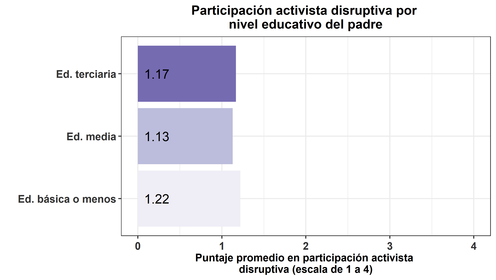

## Frecuencia de conversación con los padres sobre temas sociales y/o políticos
### Participación política durante 3ro y 4to medio

```{r}
### Crear variable
data_wide$part_act_dis_3y4 <- as.numeric(data_wide$part_pol_marcha_dis + data_wide$part_pol_bloqueo + data_wide$part_pol_rayar.y + data_wide$part_pol_toma.y)/4
```

```{r}
# Creación de bbdd
data_nunca = data_wide %>%  filter(conv_padr_poli==1) %>% as.data.frame() # Nunca
data_casi_nunca = data_wide %>%  filter(conv_padr_poli==2) %>% as.data.frame() # Casi nunca
data_a_veces = data_wide %>%  filter(conv_padr_poli==3) %>% as.data.frame() # A veces
data_frecuent = data_wide %>%  filter(conv_padr_poli==4) %>% as.data.frame() # Frecuentemente
```

```{r}
table_preposh1<- rbind(psych::describe(data_nunca$part_act_dis_3y4, na.rm=T),
               psych::describe(data_casi_nunca$part_act_dis_3y4, na.rm=T),
               psych::describe(data_a_veces$part_act_dis_3y4, na.rm=T),
               psych::describe(data_frecuent$part_act_dis_3y4, na.rm=T))
table_preposh1 <- table_preposh1 %>% select(n,mean,sd,median,trimmed,min,max)

pond1 <- stats::weighted.mean(x=data_nunca$part_act_dis_3y4,y=data_nunca$weight_w01,na.rm=TRUE)
pond2 <- stats::weighted.mean(x=data_casi_nunca$part_act_dis_3y4,y=data_casi_nunca$weight_w01,na.rm=TRUE)
pond3 <- stats::weighted.mean(x=data_a_veces$part_act_dis_3y4,y=data_a_veces$weight_w01,na.rm=TRUE)
pond4 <- stats::weighted.mean(x=data_frecuent$part_act_dis_3y4,y=data_frecuent$weight_w01,na.rm=TRUE)

table_preposh1[1,2]<-pond1
table_preposh1[2,2]<-pond2
table_preposh1[3,2]<-pond3
table_preposh1[4,2]<-pond4

table_preposh1$dep <- c("1. Nunca","2. Casi nunca","3. A veces", "4. Frecuentemente")

part_act_dis_3y4_colegio <-  ggplot(data=table_preposh1, aes(x=dep, y=mean, fill=dep)) +
     geom_bar(position = 'dodge', stat='identity')+#,width=0.8) 
     scale_fill_brewer(palette="Purples") +
     geom_text(aes(label=format(round(mean,2)), y=0), position=position_dodge(0.9), hjust=-0.25, size=6) +
     theme_bw(base_size = 14) +
     scale_y_continuous(labels = scales::comma) +
     ylab('Puntaje promedio en participación activista 
disruptiva (escala de 1 a 4)') + xlab(' ') + 
     theme(legend.position="top") +
     labs(fill = " ") +
    coord_flip()+
    theme(axis.text.x = element_text(colour = "grey20", size = 14, angle = 360, hjust = 0.5, vjust = 0.5, face = "bold"),
          axis.text.y = element_text(colour = "grey20", size = 14), 
          text = element_text(size = 14, face = "bold"),
          plot.title = element_text(hjust=0.5),
          legend.position = "none") + 
     ggtitle("Participación activista disruptiva por 
conversación con los padres sobre temas políticos y/o sociales") + ylim(0,4)
#part_act_dis_3y4_colegio
ggsave(part_act_dis_3y4_colegio, file = "../output/graphs/part_act_dis_3y4_colegio_conv_padres.png",device = "png",width = 23,height = 13,dpi = "retina",units = "cm")

```


### Participación política durante estallido social

```{r}
### Crear variable
data_wide$part_act_dis_es <- as.numeric(data_wide$part_pol_marc_dis_21 + data_wide$part_pol_bloq_21 + data_wide$part_pol_rayar_21 + data_wide$part_pol_toma_21)/4
```

```{r}
# Creación de bbdd
data_nunca = data_wide %>%  filter(conv_padres_21==1) %>% as.data.frame() # Nunca
data_casi_nunca = data_wide %>%  filter(conv_padres_21==2) %>% as.data.frame() # Casi nunca
data_a_veces = data_wide %>%  filter(conv_padres_21==3) %>% as.data.frame() # A veces
data_frecuent = data_wide %>%  filter(conv_padres_21==4) %>% as.data.frame() # Frecuentemente
```

```{r}
table_preposh1<- rbind(psych::describe(data_nunca$part_act_dis_es, na.rm=T),
               psych::describe(data_casi_nunca$part_act_dis_es, na.rm=T),
               psych::describe(data_a_veces$part_act_dis_es, na.rm=T),
               psych::describe(data_frecuent$part_act_dis_es, na.rm=T))
table_preposh1 <- table_preposh1 %>% select(n,mean,sd,median,trimmed,min,max)

pond1 <- stats::weighted.mean(x=data_nunca$part_act_dis_es,y=data_nunca$weight_w01,na.rm=TRUE)
pond2 <- stats::weighted.mean(x=data_casi_nunca$part_act_dis_es,y=data_casi_nunca$weight_w01,na.rm=TRUE)
pond3 <- stats::weighted.mean(x=data_a_veces$part_act_dis_es,y=data_a_veces$weight_w01,na.rm=TRUE)
pond4 <- stats::weighted.mean(x=data_frecuent$part_act_dis_es,y=data_frecuent$weight_w01,na.rm=TRUE)

table_preposh1[1,2]<-pond1
table_preposh1[2,2]<-pond2
table_preposh1[3,2]<-pond3
table_preposh1[4,2]<-pond4

table_preposh1$dep <- c("1. Nunca","2. Casi nunca","3. A veces", "4. Frecuentemente")

part_act_dis_es_colegio <-  ggplot(data=table_preposh1, aes(x=dep, y=mean, fill=dep)) +
     geom_bar(position = 'dodge', stat='identity')+#,width=0.8) 
     scale_fill_brewer(palette="Purples") +
     geom_text(aes(label=format(round(mean,2)), y=0), position=position_dodge(0.9), hjust=-0.25, size=6) +
     theme_bw(base_size = 14) +
     scale_y_continuous(labels = scales::comma) +
     ylab('Puntaje promedio en participación activista 
disruptiva (escala de 1 a 4)') + xlab(' ') + 
     theme(legend.position="top") +
     labs(fill = " ") +
    coord_flip()+
    theme(axis.text.x = element_text(colour = "grey20", size = 14, angle = 360, hjust = 0.5, vjust = 0.5, face = "bold"),
          axis.text.y = element_text(colour = "grey20", size = 14), 
          text = element_text(size = 14, face = "bold"),
          plot.title = element_text(hjust=0.5),
          legend.position = "none") + 
     ggtitle("Participación activista disruptiva por 
conversación con los padres sobre temas políticos y/o sociales") + ylim(0,4)
#part_act_dis_es_colegio
ggsave(part_act_dis_es_colegio, file = "../output/graphs/part_act_dis_es_colegio_conv_padres.png",device = "png",width = 23,height = 13,dpi = "retina",units = "cm")

```


### Participación política durante el 2020

```{r}
### Crear variable
data_wide$part_act_dis_20 = as.numeric(data_wide$part_pol_marc_dis_20 + data_wide$part_pol_bloq_20 + data_wide$part_pol_rayar_20 + data_wide$part_pol_toma_20)/4
```

```{r}
# Creación de bbdd
data_nunca = data_wide %>%  filter(conv_padres_20==1) %>% as.data.frame() # Nunca
data_casi_nunca = data_wide %>%  filter(conv_padres_20==2) %>% as.data.frame() # Casi nunca
data_a_veces = data_wide %>%  filter(conv_padres_20==3) %>% as.data.frame() # A veces
data_frecuent = data_wide %>%  filter(conv_padres_20==4) %>% as.data.frame() # Frecuentemente
```

```{r}
table_preposh1<- rbind(psych::describe(data_nunca$part_act_dis_20, na.rm=T),
               psych::describe(data_casi_nunca$part_act_dis_20, na.rm=T),
               psych::describe(data_a_veces$part_act_dis_20, na.rm=T),
               psych::describe(data_frecuent$part_act_dis_20, na.rm=T))
table_preposh1 <- table_preposh1 %>% select(n,mean,sd,median,trimmed,min,max)

pond1 <- stats::weighted.mean(x=data_nunca$part_act_dis_20,y=data_nunca$weight_w01,na.rm=TRUE)
pond2 <- stats::weighted.mean(x=data_casi_nunca$part_act_dis_20,y=data_casi_nunca$weight_w01,na.rm=TRUE)
pond3 <- stats::weighted.mean(x=data_a_veces$part_act_dis_20,y=data_a_veces$weight_w01,na.rm=TRUE)
pond4 <- stats::weighted.mean(x=data_frecuent$part_act_dis_20,y=data_frecuent$weight_w01,na.rm=TRUE)

table_preposh1[1,2]<-pond1
table_preposh1[2,2]<-pond2
table_preposh1[3,2]<-pond3
table_preposh1[4,2]<-pond4

table_preposh1$dep <- c("1. Nunca","2. Casi nunca","3. A veces", "4. Frecuentemente")

part_act_dis_20_colegio <-  ggplot(data=table_preposh1, aes(x=dep, y=mean, fill=dep)) +
     geom_bar(position = 'dodge', stat='identity')+#,width=0.8) 
     scale_fill_brewer(palette="Purples") +
     geom_text(aes(label=format(round(mean,2)), y=0), position=position_dodge(0.9), hjust=-0.25, size=6) +
     theme_bw(base_size = 14) +
     scale_y_continuous(labels = scales::comma) +
     ylab('Puntaje promedio en participación activista 
disruptiva (escala de 1 a 4)') + xlab(' ') + 
     theme(legend.position="top") +
     labs(fill = " ") +
    coord_flip()+
    theme(axis.text.x = element_text(colour = "grey20", size = 14, angle = 360, hjust = 0.5, vjust = 0.5, face = "bold"),
          axis.text.y = element_text(colour = "grey20", size = 14), 
          text = element_text(size = 14, face = "bold"),
          plot.title = element_text(hjust=0.5),
          legend.position = "none") + 
     ggtitle("Participación activista disruptiva por 
conversación con los padres sobre temas políticos y/o sociales") + ylim(0,4)
#part_act_dis_20_colegio
ggsave(part_act_dis_20_colegio, file = "../output/graphs/part_act_dis_20_colegio_conv_padres.png",device = "png",width = 23,height = 13,dpi = "retina",units = "cm")
```


### Participación política durante el primer semestre de 2021

```{r}
#### Crear variable
data_wide$part_act_dis_21_1s = as.numeric(data_wide$part_pol_marcha_dis + data_wide$part_pol_bloq + data_wide$part_pol_rayar.x + data_wide$part_pol_toma.x)/4
```

```{r}
# Creación de bbdd
data_nunca = data_wide %>%  filter(conv_padres==1) %>% as.data.frame() # Nunca
data_casi_nunca = data_wide %>%  filter(conv_padres==2) %>% as.data.frame() # Casi nunca
data_a_veces = data_wide %>%  filter(conv_padres==3) %>% as.data.frame() # A veces
data_frecuent = data_wide %>%  filter(conv_padres==4) %>% as.data.frame() # Frecuentemente
```

```{r}
table_preposh1<- rbind(psych::describe(data_nunca$part_act_dis_21_1s, na.rm=T),
               psych::describe(data_casi_nunca$part_act_dis_21_1s, na.rm=T),
               psych::describe(data_a_veces$part_act_dis_21_1s, na.rm=T),
               psych::describe(data_frecuent$part_act_dis_21_1s, na.rm=T))
table_preposh1 <- table_preposh1 %>% select(n,mean,sd,median,trimmed,min,max)

pond1 <- stats::weighted.mean(x=data_nunca$part_act_dis_21_1s,y=data_nunca$weight_w01,na.rm=TRUE)
pond2 <- stats::weighted.mean(x=data_casi_nunca$part_act_dis_21_1s,y=data_casi_nunca$weight_w01,na.rm=TRUE)
pond3 <- stats::weighted.mean(x=data_a_veces$part_act_dis_21_1s,y=data_a_veces$weight_w01,na.rm=TRUE)
pond4 <- stats::weighted.mean(x=data_frecuent$part_act_dis_21_1s,y=data_frecuent$weight_w01,na.rm=TRUE)

table_preposh1[1,2]<-pond1
table_preposh1[2,2]<-pond2
table_preposh1[3,2]<-pond3
table_preposh1[4,2]<-pond4

table_preposh1$dep <- c("1. Nunca","2. Casi nunca","3. A veces", "4. Frecuentemente")

part_act_dis_21_1s_colegio <-  ggplot(data=table_preposh1, aes(x=dep, y=mean, fill=dep)) +
     geom_bar(position = 'dodge', stat='identity')+#,width=0.8) 
     scale_fill_brewer(palette="Purples") +
     geom_text(aes(label=format(round(mean,2)), y=0), position=position_dodge(0.9), hjust=-0.25, size=6) +
     theme_bw(base_size = 14) +
     scale_y_continuous(labels = scales::comma) +
     ylab('Puntaje promedio en participación activista 
disruptiva (escala de 1 a 4)') + xlab(' ') + 
     theme(legend.position="top") +
     labs(fill = " ") +
    coord_flip()+
    theme(axis.text.x = element_text(colour = "grey20", size = 14, angle = 360, hjust = 0.5, vjust = 0.5, face = "bold"),
          axis.text.y = element_text(colour = "grey20", size = 14), 
          text = element_text(size = 14, face = "bold"),
          plot.title = element_text(hjust=0.5),
          legend.position = "none") + 
     ggtitle("Participación activista disruptiva por 
conversación con los padres sobre temas políticos y/o sociales") + ylim(0,4)
#part_act_dis_21_1s_colegio
ggsave(part_act_dis_21_1s_colegio, file = "../output/graphs/part_act_dis_21_1s_colegio_conv_padres.png",device = "png",width = 23,height = 13,dpi = "retina",units = "cm")
```


### Participación política durante el segundo semestre de 2021

```{r}
#### Crear variable
data_wide$part_act_dis_21_2s = as.numeric(data_wide$part_pol_marc_dis_21b + data_wide$part_pol_bloq_21b + data_wide$part_pol_rayar_21b + data_wide$part_pol_toma_21b)/4
```

```{r}
# Creación de bbdd
data_nunca = data_wide %>%  filter(conv_padres_21b==1) %>% as.data.frame() # Nunca
data_casi_nunca = data_wide %>%  filter(conv_padres_21b==2) %>% as.data.frame() # Casi nunca
data_a_veces = data_wide %>%  filter(conv_padres_21b==3) %>% as.data.frame() # A veces
data_frecuent = data_wide %>%  filter(conv_padres_21b==4) %>% as.data.frame() # Frecuentemente
```

```{r}
table_preposh1<- rbind(psych::describe(data_nunca$part_act_dis_21_2s, na.rm=T),
               psych::describe(data_casi_nunca$part_act_dis_21_2s, na.rm=T),
               psych::describe(data_a_veces$part_act_dis_21_2s, na.rm=T),
               psych::describe(data_frecuent$part_act_dis_21_2s, na.rm=T))
table_preposh1 <- table_preposh1 %>% select(n,mean,sd,median,trimmed,min,max)

pond1 <- stats::weighted.mean(x=data_nunca$part_act_dis_21_2s,y=data_nunca$weight_w01,na.rm=TRUE)
pond2 <- stats::weighted.mean(x=data_casi_nunca$part_act_dis_21_2s,y=data_casi_nunca$weight_w01,na.rm=TRUE)
pond3 <- stats::weighted.mean(x=data_a_veces$part_act_dis_21_2s,y=data_a_veces$weight_w01,na.rm=TRUE)
pond4 <- stats::weighted.mean(x=data_frecuent$part_act_dis_21_2s,y=data_frecuent$weight_w01,na.rm=TRUE)

table_preposh1[1,2]<-pond1
table_preposh1[2,2]<-pond2
table_preposh1[3,2]<-pond3
table_preposh1[4,2]<-pond4

table_preposh1$dep <- c("1. Nunca","2. Casi nunca","3. A veces", "4. Frecuentemente")

part_act_dis_21_2s_colegio <-  ggplot(data=table_preposh1, aes(x=dep, y=mean, fill=dep)) +
     geom_bar(position = 'dodge', stat='identity')+#,width=0.8) 
     scale_fill_brewer(palette="Purples") +
     geom_text(aes(label=format(round(mean,2)), y=0), position=position_dodge(0.9), hjust=-0.25, size=6) +
     theme_bw(base_size = 14) +
     scale_y_continuous(labels = scales::comma) +
     ylab('Puntaje promedio en participación activista 
disruptiva (escala de 1 a 4)') + xlab(' ') + 
     theme(legend.position="top") +
     labs(fill = " ") +
    coord_flip()+
    theme(axis.text.x = element_text(colour = "grey20", size = 14, angle = 360, hjust = 0.5, vjust = 0.5, face = "bold"),
          axis.text.y = element_text(colour = "grey20", size = 14), 
          text = element_text(size = 14, face = "bold"),
          plot.title = element_text(hjust=0.5),
          legend.position = "none") + 
     ggtitle("Participación activista disruptiva por 
conversación con los padres sobre temas políticos y/o sociales") + ylim(0,4)
#part_act_dis_21_2s_colegio
ggsave(part_act_dis_21_2s_colegio, file = "../output/graphs/part_act_dis_21_2s_colegio_conv_padres.png",device = "png",width = 23,height = 13,dpi = "retina",units = "cm")
```

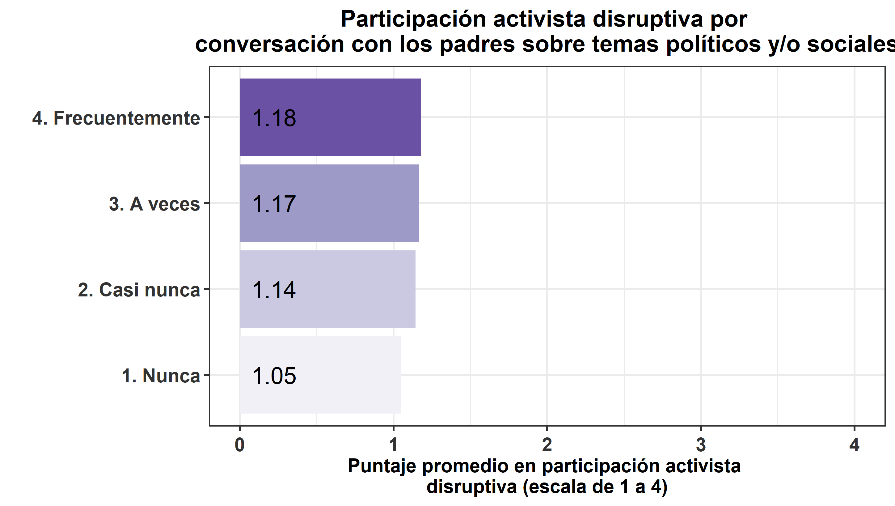


# Activismo online
## Dependencia administrativa establecimiento
### Participación política durante 3ro y 4to medio
```{r}
### Crear variable
data_wide$part_act_online_3y4 <- as.numeric(data_wide$part_pol_online + data_wide$part_online_post + data_wide$part_online_com + data_wide$part_online_seg)/4
```

```{r}
# Creación de bbdd
data_mun = data_wide %>%  filter(edm_admi==1) %>% as.data.frame() #Municipal
data_sub = data_wide %>%  filter(edm_admi==2) %>% as.data.frame() #Particular Subvencionado
data_priv = data_wide %>%  filter(edm_admi==3) %>% as.data.frame() #Particular pagado
```

```{r}
table_preposh1<- rbind(psych::describe(data_mun$part_act_online_3y4, na.rm=T),
               psych::describe(data_sub$part_act_online_3y4, na.rm=T),psych::describe(data_priv$part_act_online_3y4, na.rm=T))
table_preposh1 <- table_preposh1 %>% select(n,mean,sd,median,trimmed,min,max)
pond1 <- stats::weighted.mean(x=data_mun$part_act_online_3y4,y=data_mun$weight_w01,na.rm=TRUE)
pond2 <- stats::weighted.mean(x=data_sub$part_act_online_3y4,y=data_sub$weight_w01,na.rm=TRUE)
pond3 <- stats::weighted.mean(x=data_priv$part_act_online_3y4,y=data_priv$weight_w01,na.rm=TRUE)

table_preposh1[1,2]<-pond1
table_preposh1[2,2]<-pond2
table_preposh1[3,2]<-pond3

table_preposh1$dep <- c("Municipal","Particular Subvencionado","Particular Privado")

part_act_online_3y4_colegio <-  ggplot(data=table_preposh1, aes(x=dep, y=mean, fill=dep)) +
     geom_bar(position = 'dodge', stat='identity')+#,width=0.8) 
     scale_fill_brewer(palette="Purples") +
     geom_text(aes(label=format(round(mean,2)), y=0), position=position_dodge(0.9), hjust=-0.25, size=6) +
     theme_bw(base_size = 14) +
     scale_y_continuous(labels = scales::comma) +
     ylab('Puntaje promedio en participación activista 
online (escala de 1 a 4)') + xlab(' ') + 
     theme(legend.position="top") +
     labs(fill = " ") +
    coord_flip()+
    theme(axis.text.x = element_text(colour = "grey20", size = 14, angle = 360, hjust = 0.5, vjust = 0.5, face = "bold"),
          axis.text.y = element_text(colour = "grey20", size = 14), 
          text = element_text(size = 14, face = "bold"),
          plot.title = element_text(hjust=0.5),
          legend.position = "none") + 
     ggtitle("Participación activista online por 
tipo de dependencia administrativa de la escuela") + ylim(0,4)
#part_act_online_3y4_colegio
ggsave(part_act_online_3y4_colegio, file = "../output/graphs/part_act_online_3y4_colegio_dep.png",device = "png",width = 23,height = 13,dpi = "retina",units = "cm")

```


### Participación política durante estallido social

```{r}
### Crear variable
data_wide$part_act_online_es <- as.numeric(data_wide$part_pol_online_info_21 + data_wide$part_pol_online_post_21 + data_wide$part_pol_online_com_21 + data_wide$part_pol_online_seg_21)/4
```

```{r}
# Creación de bbdd
data_mun = data_wide %>%  filter(edm_admi==1) %>% as.data.frame() #Municipal
data_sub = data_wide %>%  filter(edm_admi==2) %>% as.data.frame() #Particular Subvencionado
data_priv = data_wide %>%  filter(edm_admi==3) %>% as.data.frame() #Particular pagado
```

```{r}
table_preposh1<- rbind(psych::describe(data_mun$part_act_online_es, na.rm=T),
               psych::describe(data_sub$part_act_online_es, na.rm=T),psych::describe(data_priv$part_act_online_es, na.rm=T))
table_preposh1 <- table_preposh1 %>% select(n,mean,sd,median,trimmed,min,max)

pond1 <- stats::weighted.mean(x=data_mun$part_act_online_es,y=data_mun$weight_w01,na.rm=TRUE)
pond2 <- stats::weighted.mean(x=data_sub$part_act_online_es,y=data_sub$weight_w01,na.rm=TRUE)
pond3 <- stats::weighted.mean(x=data_priv$part_act_online_es,y=data_priv$weight_w01,na.rm=TRUE)

table_preposh1[1,2]<-pond1
table_preposh1[2,2]<-pond2
table_preposh1[3,2]<-pond3

table_preposh1$dep <- c("Municipal","Particular Subvencionado","Particular Privado")

part_act_online_es_colegio <-  ggplot(data=table_preposh1, aes(x=dep, y=mean, fill=dep)) +
     geom_bar(position = 'dodge', stat='identity')+#,width=0.8) 
     scale_fill_brewer(palette="Purples") +
     geom_text(aes(label=format(round(mean,2)), y=0), position=position_dodge(0.9), hjust=-0.25, size=6) +
     theme_bw(base_size = 14) +
     scale_y_continuous(labels = scales::comma) +
     ylab('Puntaje promedio en participación activista 
online (escala de 1 a 4)') + xlab(' ') + 
     theme(legend.position="top") +
     labs(fill = " ") +
    coord_flip()+
    theme(axis.text.x = element_text(colour = "grey20", size = 14, angle = 360, hjust = 0.5, vjust = 0.5, face = "bold"),
          axis.text.y = element_text(colour = "grey20", size = 14), 
          text = element_text(size = 14, face = "bold"),
          plot.title = element_text(hjust=0.5),
          legend.position = "none") + 
     ggtitle("Participación activista online por 
tipo de dependencia administrativa de la escuela") + ylim(0,4)
#part_act_online_es_colegio
ggsave(part_act_online_es_colegio, file = "../output/graphs/part_act_online_es_colegio_dep.png",device = "png",width = 23,height = 13,dpi = "retina",units = "cm")

```


### Participación política durante el 2020

```{r}
### Crear variable
data_wide$part_act_online_20 = as.numeric(data_wide$part_pol_online_info_20 + data_wide$part_pol_online_post_20 + data_wide$part_pol_online_com_20 + data_wide$part_pol_online_seg_20	)/4
```

```{r}
# Creación de bbdd
data_mun = data_wide %>%  filter(edm_admi==1) %>% as.data.frame() #Municipal
data_sub = data_wide %>%  filter(edm_admi==2) %>% as.data.frame() #Particular Subvencionado
data_priv = data_wide %>%  filter(edm_admi==3) %>% as.data.frame() #Particular pagado
```

```{r}
table_preposh1<- rbind(psych::describe(data_mun$part_act_online_20, na.rm=T),
               psych::describe(data_sub$part_act_online_20, na.rm=T),psych::describe(data_priv$part_act_online_20, na.rm=T))
table_preposh1 <- table_preposh1 %>% select(n,mean,sd,median,trimmed,min,max)

pond1 <- stats::weighted.mean(x=data_mun$part_act_online_20,y=data_mun$weight_w01,na.rm=TRUE)
pond2 <- stats::weighted.mean(x=data_sub$part_act_online_20,y=data_sub$weight_w01,na.rm=TRUE)
pond3 <- stats::weighted.mean(x=data_priv$part_act_online_20,y=data_priv$weight_w01,na.rm=TRUE)

table_preposh1[1,2]<-pond1
table_preposh1[2,2]<-pond2
table_preposh1[3,2]<-pond3

table_preposh1$dep <- c("Municipal","Particular Subvencionado","Particular Privado")

part_act_online_20_colegio <-  ggplot(data=table_preposh1, aes(x=dep, y=mean, fill=dep)) +
     geom_bar(position = 'dodge', stat='identity')+#,width=0.8) 
     scale_fill_brewer(palette="Purples") +
     geom_text(aes(label=format(round(mean,2)), y=0), position=position_dodge(0.9), hjust=-0.25, size=6) +
     theme_bw(base_size = 14) +
     scale_y_continuous(labels = scales::comma) +
     ylab('Puntaje promedio en participación activista 
online (escala de 1 a 4)') + xlab(' ') + 
     theme(legend.position="top") +
     labs(fill = " ") +
    coord_flip()+
    theme(axis.text.x = element_text(colour = "grey20", size = 14, angle = 360, hjust = 0.5, vjust = 0.5, face = "bold"),
          axis.text.y = element_text(colour = "grey20", size = 14), 
          text = element_text(size = 14, face = "bold"),
          plot.title = element_text(hjust=0.5),
          legend.position = "none") + 
     ggtitle("Participación activista online por 
tipo de dependencia administrativa de la escuela") + ylim(0,4)
#part_act_online_20_colegio
ggsave(part_act_online_20_colegio, file = "../output/graphs/part_act_online_20_colegio_dep.png",device = "png",width = 23,height = 13,dpi = "retina",units = "cm")
```

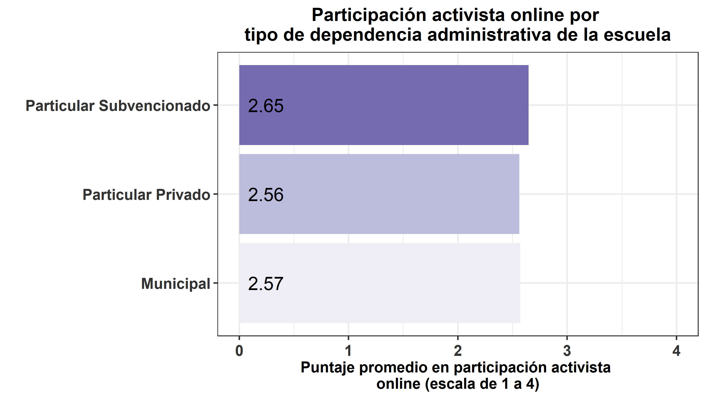

### Participación política durante el primer semestre de 2021

```{r}
#### Crear variable
data_wide$part_act_online_21_1s = as.numeric(data_wide$part_pol_online_info + data_wide$part_pol_online_post + data_wide$part_pol_online_com + data_wide$part_pol_online_seg)/4
```

```{r}
# Creación de bbdd
data_mun = data_wide %>%  filter(edm_admi==1) %>% as.data.frame() #Municipal
data_sub = data_wide %>%  filter(edm_admi==2) %>% as.data.frame() #Particular Subvencionado
data_priv = data_wide %>%  filter(edm_admi==3) %>% as.data.frame() #Particular pagado
```

```{r}
table_preposh1<- rbind(psych::describe(data_mun$part_act_online_21_1s, na.rm=T),
               psych::describe(data_sub$part_act_online_21_1s, na.rm=T),psych::describe(data_priv$part_act_online_21_1s, na.rm=T))
table_preposh1 <- table_preposh1 %>% select(n,mean,sd,median,trimmed,min,max)

pond1 <- stats::weighted.mean(x=data_mun$part_act_online_21_1s,y=data_mun$weight_w02,na.rm=TRUE)
pond2 <- stats::weighted.mean(x=data_sub$part_act_online_21_1s,y=data_sub$weight_w02,na.rm=TRUE)
pond3 <- stats::weighted.mean(x=data_priv$part_act_online_21_1s,y=data_priv$weight_w02,na.rm=TRUE)

table_preposh1[1,2]<-pond1
table_preposh1[2,2]<-pond2
table_preposh1[3,2]<-pond3

table_preposh1$dep <- c("Municipal","Particular Subvencionado","Particular Privado")

part_act_online_21_1s_colegio <-  ggplot(data=table_preposh1, aes(x=dep, y=mean, fill=dep)) +
     geom_bar(position = 'dodge', stat='identity')+#,width=0.8) 
     scale_fill_brewer(palette="Purples") +
     geom_text(aes(label=format(round(mean,2)), y=0), position=position_dodge(0.9), hjust=-0.25, size=6) +
     theme_bw(base_size = 14) +
     scale_y_continuous(labels = scales::comma) +
     ylab('Puntaje promedio en participación activista 
online (escala de 1 a 4)') + xlab(' ') + 
     theme(legend.position="top") +
     labs(fill = " ") +
    coord_flip()+
    theme(axis.text.x = element_text(colour = "grey20", size = 14, angle = 360, hjust = 0.5, vjust = 0.5, face = "bold"),
          axis.text.y = element_text(colour = "grey20", size = 14), 
          text = element_text(size = 14, face = "bold"),
          plot.title = element_text(hjust=0.5),
          legend.position = "none") + 
     ggtitle("Participación activista online por 
tipo de dependencia administrativa de la escuela") + ylim(0,4)
#part_act_online_21_1s_colegio
ggsave(part_act_online_21_1s_colegio, file = "../output/graphs/part_act_online_21_1s_colegio_dep.png",device = "png",width = 23,height = 13,dpi = "retina",units = "cm")
```

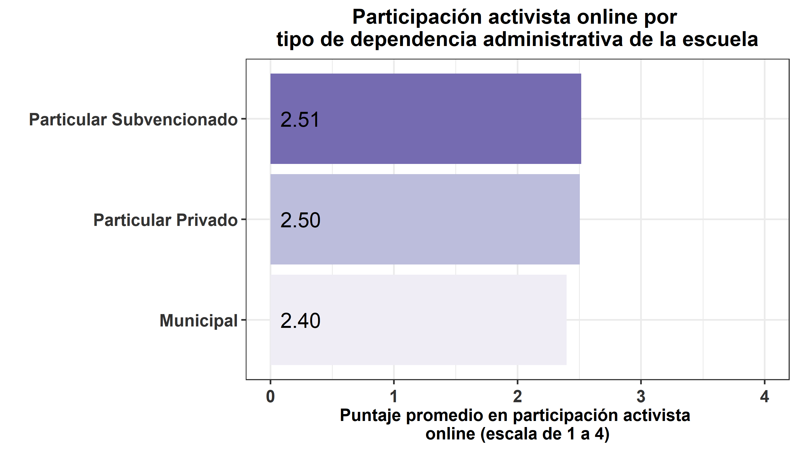

### Participación política durante el segundo semestre de 2021

```{r}
#### Crear variable 
data_wide$part_act_online_21_2s = as.numeric(data_wide$part_pol_online_info_21b + data_wide$part_pol_online_post_21b + data_wide$part_pol_online_com_21b + data_wide$part_pol_online_seg_21b)/4
```

```{r}
# Creación de bbdd
data_mun = data_wide %>%  filter(edm_admi==1) %>% as.data.frame() #Municipal
data_sub = data_wide %>%  filter(edm_admi==2) %>% as.data.frame() #Particular Subvencionado
data_priv = data_wide %>%  filter(edm_admi==3) %>% as.data.frame() #Particular pagado
```

```{r}
table_preposh1<- rbind(psych::describe(data_mun$part_act_online_21_2s, na.rm=T),
               psych::describe(data_sub$part_act_online_21_2s, na.rm=T),psych::describe(data_priv$part_act_online_21_2s, na.rm=T))
table_preposh1 <- table_preposh1 %>% select(n,mean,sd,median,trimmed,min,max)

pond1 <- stats::weighted.mean(x=data_mun$part_act_online_21_2s,y=data_mun$weight_w03,na.rm=TRUE)
pond2 <- stats::weighted.mean(x=data_sub$part_act_online_21_2s,y=data_sub$weight_w03,na.rm=TRUE)
pond3 <- stats::weighted.mean(x=data_priv$part_act_online_21_2s,y=data_priv$weight_w03,na.rm=TRUE)

table_preposh1[1,2]<-pond1
table_preposh1[2,2]<-pond2
table_preposh1[3,2]<-pond3

table_preposh1$dep <- c("Municipal","Particular Subvencionado","Particular Privado")

part_act_online_21_2s_colegio <-  ggplot(data=table_preposh1, aes(x=dep, y=mean, fill=dep)) +
     geom_bar(position = 'dodge', stat='identity')+#,width=0.8) 
     scale_fill_brewer(palette="Purples") +
     geom_text(aes(label=format(round(mean,2)), y=0), position=position_dodge(0.9), hjust=-0.25, size=6) +
     theme_bw(base_size = 14) +
     scale_y_continuous(labels = scales::comma) +
     ylab('Puntaje promedio en participación activista 
online (escala de 1 a 4)') + xlab(' ') + 
     theme(legend.position="top") +
     labs(fill = " ") +
    coord_flip()+
    theme(axis.text.x = element_text(colour = "grey20", size = 14, angle = 360, hjust = 0.5, vjust = 0.5, face = "bold"),
          axis.text.y = element_text(colour = "grey20", size = 14), 
          text = element_text(size = 14, face = "bold"),
          plot.title = element_text(hjust=0.5),
          legend.position = "none") + 
     ggtitle("Participación activista online por 
tipo de dependencia administrativa de la escuela") + ylim(0,4)
#part_act_online_21_2s_colegio
ggsave(part_act_online_21_2s_colegio, file = "../output/graphs/part_act_online_21_2s_colegio_dep.png",device = "png",width = 23,height = 13,dpi = "retina",units = "cm")
```


## Máximo nivel educativo de la madre
### Participación política durante 3ro y 4to medio
```{r}
### Crear variable
data_wide$part_act_online_3y4 <- as.numeric(data_wide$part_pol_online + data_wide$part_online_post + data_wide$part_online_com + data_wide$part_online_seg)/4
```


```{r}
# Creación de bbdd
data_ed_bas = data_wide %>%  filter(nse_madre==1 | nse_madre==2 | nse_madre==3 | nse_madre==4) %>% as.data.frame() # Sin Ed. (1), Ed. básica incompleta (2) o completa (3)
data_ed_med = data_wide %>%  filter(nse_madre==4 | nse_madre==5) %>% as.data.frame() # Ed. media incompleta (4) o completa (5)
data_ed_ter = data_wide %>%  filter(nse_madre==6 | nse_madre==7 | nse_madre==8 | nse_madre==9 | nse_madre==10) %>% as.data.frame() # técnico superior incompleto (6) o completo (7) Universitaria incompleta (8) o completa (9), Estudios de postgrado (magíster o doctorado) (10)

#data_ed_tec = data_wide %>%  filter(nse_madre==6 | nse_madre==7) %>% as.data.frame() # técnico superior incompleto (6) o completo (7)
#data_ed_uni = data_wide %>%  filter(nse_madre==8 | nse_madre==9 | nse_madre==10) %>% as.data.frame() # Universitaria incompleta (8) o completa (9), Estudios de postgrado (magíster o doctorado) (10)
```

```{r}
table_preposh1<- rbind(psych::describe(data_ed_bas$part_act_online_3y4, na.rm=T),
               psych::describe(data_ed_med$part_act_online_3y4, na.rm=T),
               psych::describe(data_ed_ter$part_act_online_3y4, na.rm=T))#,
#               psych::describe(data_ed_uni$part_act_online_3y4, na.rm=T))
table_preposh1 <- table_preposh1 %>% select(n,mean,sd,median,trimmed,min,max)

pond1 <- stats::weighted.mean(x=data_ed_bas$part_act_online_3y4,y=data_ed_bas$weight_w01,na.rm=TRUE)
pond2 <- stats::weighted.mean(x=data_ed_med$part_act_online_3y4,y=data_ed_med$weight_w01,na.rm=TRUE)
pond3 <- stats::weighted.mean(x=data_ed_ter$part_act_online_3y4,y=data_ed_ter$weight_w01,na.rm=TRUE)
#pond4 <- stats::weighted.mean(x=data_ed_uni$part_act_online_3y4,y=data_ed_uni$weight_w01,na.rm=TRUE)

table_preposh1[1,2]<-pond1
table_preposh1[2,2]<-pond2
table_preposh1[3,2]<-pond3
#table_preposh1[4,2]<-pond4

#table_preposh1$dep <- c("Ed. básica o menos","Ed. media","Técnico superior", "Universitaria o más")
table_preposh1$dep <- c("Ed. básica o menos","Ed. media","Ed. terciaria")

part_act_online_3y4_colegio <-  ggplot(data=table_preposh1, aes(x=dep, y=mean, fill=dep)) +
     geom_bar(position = 'dodge', stat='identity')+#,width=0.8) 
     scale_fill_brewer(palette="Purples") +
     geom_text(aes(label=format(round(mean,2)), y=0), position=position_dodge(0.9), hjust=-0.25, size=6) +
     theme_bw(base_size = 14) +
     scale_y_continuous(labels = scales::comma) +
     ylab('Puntaje promedio en participación activista 
online (escala de 1 a 4)') + xlab(' ') + 
     theme(legend.position="top") +
     labs(fill = " ") +
    coord_flip()+
    theme(axis.text.x = element_text(colour = "grey20", size = 14, angle = 360, hjust = 0.5, vjust = 0.5, face = "bold"),
          axis.text.y = element_text(colour = "grey20", size = 14), 
          text = element_text(size = 14, face = "bold"),
          plot.title = element_text(hjust=0.5),
          legend.position = "none") + 
     ggtitle("Participación activista online por 
nivel educativo de la madre") + ylim(0,4)
#part_act_online_3y4_colegio
ggsave(part_act_online_3y4_colegio, file = "../output/graphs/part_act_online_3y4_colegio_ed_madre.png",device = "png",width = 23,height = 13,dpi = "retina",units = "cm")

```


### Participación política durante estallido social

```{r}
### Crear variable
data_wide$part_act_online_es <- as.numeric(data_wide$part_pol_online_info_21 + data_wide$part_pol_online_post_21 + data_wide$part_pol_online_com_21 + data_wide$part_pol_online_seg_21)/4
```

```{r}
# Creación de bbdd
data_ed_bas = data_wide %>%  filter(nse_madre==1 | nse_madre==2 | nse_madre==3 | nse_madre==4) %>% as.data.frame() # Sin Ed. (1), Ed. básica incompleta (2) o completa (3)
data_ed_med = data_wide %>%  filter(nse_madre==4 | nse_madre==5) %>% as.data.frame() # Ed. media incompleta (4) o completa (5)
data_ed_ter = data_wide %>%  filter(nse_madre==6 | nse_madre==7 | nse_madre==8 | nse_madre==9 | nse_madre==10) %>% as.data.frame() # técnico superior incompleto (6) o completo (7) Universitaria incompleta (8) o completa (9), Estudios de postgrado (magíster o doctorado) (10)

#data_ed_tec = data_wide %>%  filter(nse_madre==6 | nse_madre==7) %>% as.data.frame() # técnico superior incompleto (6) o completo (7)
#data_ed_uni = data_wide %>%  filter(nse_madre==8 | nse_madre==9 | nse_madre==10) %>% as.data.frame() # Universitaria incompleta (8) o completa (9), Estudios de postgrado (magíster o doctorado) (10)
```

```{r}
table_preposh1<- rbind(psych::describe(data_ed_bas$part_act_online_es, na.rm=T),
               psych::describe(data_ed_med$part_act_online_es, na.rm=T),
               psych::describe(data_ed_ter$part_act_online_es, na.rm=T))#,
#               psych::describe(data_ed_uni$part_act_online_es, na.rm=T))
table_preposh1 <- table_preposh1 %>% select(n,mean,sd,median,trimmed,min,max)

pond1 <- stats::weighted.mean(x=data_ed_bas$part_act_online_es,y=data_ed_bas$weight_w01,na.rm=TRUE)
pond2 <- stats::weighted.mean(x=data_ed_med$part_act_online_es,y=data_ed_med$weight_w01,na.rm=TRUE)
pond3 <- stats::weighted.mean(x=data_ed_ter$part_act_online_es,y=data_ed_ter$weight_w01,na.rm=TRUE)
#pond4 <- stats::weighted.mean(x=data_ed_uni$part_act_online_es,y=data_ed_uni$weight_w01,na.rm=TRUE)

table_preposh1[1,2]<-pond1
table_preposh1[2,2]<-pond2
table_preposh1[3,2]<-pond3
#table_preposh1[4,2]<-pond4

#table_preposh1$dep <- c("Ed. básica o menos","Ed. media","Técnico superior", "Universitaria o más")
table_preposh1$dep <- c("Ed. básica o menos","Ed. media","Ed. terciaria")

part_act_online_es_colegio <-  ggplot(data=table_preposh1, aes(x=dep, y=mean, fill=dep)) +
     geom_bar(position = 'dodge', stat='identity')+#,width=0.8) 
     scale_fill_brewer(palette="Purples") +
     geom_text(aes(label=format(round(mean,2)), y=0), position=position_dodge(0.9), hjust=-0.25, size=6) +
     theme_bw(base_size = 14) +
     scale_y_continuous(labels = scales::comma) +
     ylab('Puntaje promedio en participación activista 
online (escala de 1 a 4)') + xlab(' ') + 
     theme(legend.position="top") +
     labs(fill = " ") +
    coord_flip()+
    theme(axis.text.x = element_text(colour = "grey20", size = 14, angle = 360, hjust = 0.5, vjust = 0.5, face = "bold"),
          axis.text.y = element_text(colour = "grey20", size = 14), 
          text = element_text(size = 14, face = "bold"),
          plot.title = element_text(hjust=0.5),
          legend.position = "none") + 
     ggtitle("Participación activista online por 
nivel educativo de la madre") + ylim(0,4)
#part_act_online_es_colegio
ggsave(part_act_online_es_colegio, file = "../output/graphs/part_act_online_es_colegio_ed_madre.png",device = "png",width = 23,height = 13,dpi = "retina",units = "cm")

```


### Participación política durante el 2020

```{r}
### Crear variable
data_wide$part_act_online_20 = as.numeric(data_wide$part_pol_online_info_20 + data_wide$part_pol_online_post_20 + data_wide$part_pol_online_com_20 + data_wide$part_pol_online_seg_20	)/4
```

```{r}
# Creación de bbdd
data_ed_bas = data_wide %>%  filter(nse_madre==1 | nse_madre==2 | nse_madre==3 | nse_madre==4) %>% as.data.frame() # Sin Ed. (1), Ed. básica incompleta (2) o completa (3)
data_ed_med = data_wide %>%  filter(nse_madre==4 | nse_madre==5) %>% as.data.frame() # Ed. media incompleta (4) o completa (5)
data_ed_ter = data_wide %>%  filter(nse_madre==6 | nse_madre==7 | nse_madre==8 | nse_madre==9 | nse_madre==10) %>% as.data.frame() # técnico superior incompleto (6) o completo (7) Universitaria incompleta (8) o completa (9), Estudios de postgrado (magíster o doctorado) (10)

#data_ed_tec = data_wide %>%  filter(nse_madre==6 | nse_madre==7) %>% as.data.frame() # técnico superior incompleto (6) o completo (7)
#data_ed_uni = data_wide %>%  filter(nse_madre==8 | nse_madre==9 | nse_madre==10) %>% as.data.frame() # Universitaria incompleta (8) o completa (9), Estudios de postgrado (magíster o doctorado) (10)```

```

```{r}
table_preposh1<- rbind(psych::describe(data_ed_bas$part_act_online_20, na.rm=T),
               psych::describe(data_ed_med$part_act_online_20, na.rm=T),
               psych::describe(data_ed_ter$part_act_online_20, na.rm=T))#,
#               psych::describe(data_ed_uni$part_act_online_20, na.rm=T))
table_preposh1 <- table_preposh1 %>% select(n,mean,sd,median,trimmed,min,max)

pond1 <- stats::weighted.mean(x=data_ed_bas$part_act_online_20,y=data_ed_bas$weight_w01,na.rm=TRUE)
pond2 <- stats::weighted.mean(x=data_ed_med$part_act_online_20,y=data_ed_med$weight_w01,na.rm=TRUE)
pond3 <- stats::weighted.mean(x=data_ed_ter$part_act_online_20,y=data_ed_ter$weight_w01,na.rm=TRUE)
#pond4 <- stats::weighted.mean(x=data_ed_uni$part_act_online_20,y=data_ed_uni$weight_w01,na.rm=TRUE)

table_preposh1[1,2]<-pond1
table_preposh1[2,2]<-pond2
table_preposh1[3,2]<-pond3
#table_preposh1[4,2]<-pond4

#table_preposh1$dep <- c("Ed. básica o menos","Ed. media","Técnico superior", "Universitaria o más")
table_preposh1$dep <- c("Ed. básica o menos","Ed. media","Ed. terciaria")

part_act_online_20_colegio <-  ggplot(data=table_preposh1, aes(x=dep, y=mean, fill=dep)) +
     geom_bar(position = 'dodge', stat='identity')+#,width=0.8) 
     scale_fill_brewer(palette="Purples") +
     geom_text(aes(label=format(round(mean,2)), y=0), position=position_dodge(0.9), hjust=-0.25, size=6) +
     theme_bw(base_size = 14) +
     scale_y_continuous(labels = scales::comma) +
     ylab('Puntaje promedio en participación activista 
online (escala de 1 a 4)') + xlab(' ') + 
     theme(legend.position="top") +
     labs(fill = " ") +
    coord_flip()+
    theme(axis.text.x = element_text(colour = "grey20", size = 14, angle = 360, hjust = 0.5, vjust = 0.5, face = "bold"),
          axis.text.y = element_text(colour = "grey20", size = 14), 
          text = element_text(size = 14, face = "bold"),
          plot.title = element_text(hjust=0.5),
          legend.position = "none") + 
     ggtitle("Participación activista online por 
nivel educativo de la madre") + ylim(0,4)
#part_act_online_20_colegio
ggsave(part_act_online_20_colegio, file = "../output/graphs/part_act_online_20_colegio_ed_madre.png",device = "png",width = 23,height = 13,dpi = "retina",units = "cm")
```


### Participación política durante el primer semestre de 2021

```{r}
#### Crear variable
data_wide$part_act_online_21_1s = as.numeric(data_wide$part_pol_online_info + data_wide$part_pol_online_post + data_wide$part_pol_online_com + data_wide$part_pol_online_seg)/4
```

```{r}
# Creación de bbdd
data_ed_bas = data_wide %>%  filter(nse_madre==1 | nse_madre==2 | nse_madre==3 | nse_madre==4) %>% as.data.frame() # Sin Ed. (1), Ed. básica incompleta (2) o completa (3)
data_ed_med = data_wide %>%  filter(nse_madre==4 | nse_madre==5) %>% as.data.frame() # Ed. media incompleta (4) o completa (5)
data_ed_ter = data_wide %>%  filter(nse_madre==6 | nse_madre==7 | nse_madre==8 | nse_madre==9 | nse_madre==10) %>% as.data.frame() # técnico superior incompleto (6) o completo (7) Universitaria incompleta (8) o completa (9), Estudios de postgrado (magíster o doctorado) (10)

#data_ed_tec = data_wide %>%  filter(nse_madre==6 | nse_madre==7) %>% as.data.frame() # técnico superior incompleto (6) o completo (7)
#data_ed_uni = data_wide %>%  filter(nse_madre==8 | nse_madre==9 | nse_madre==10) %>% as.data.frame() # Universitaria incompleta (8) o completa (9), Estudios de postgrado (magíster o doctorado) (10)
```

```{r}
table_preposh1<- rbind(psych::describe(data_ed_bas$part_act_online_21_1s, na.rm=T),
               psych::describe(data_ed_med$part_act_online_21_1s, na.rm=T),
               psych::describe(data_ed_ter$part_act_online_21_1s, na.rm=T))#,
#               psych::describe(data_ed_uni$part_act_online_21_1s, na.rm=T))
table_preposh1 <- table_preposh1 %>% select(n,mean,sd,median,trimmed,min,max)

pond1 <- stats::weighted.mean(x=data_ed_bas$part_act_online_21_1s,y=data_ed_bas$weight_w01,na.rm=TRUE)
pond2 <- stats::weighted.mean(x=data_ed_med$part_act_online_21_1s,y=data_ed_med$weight_w01,na.rm=TRUE)
pond3 <- stats::weighted.mean(x=data_ed_ter$part_act_online_21_1s,y=data_ed_ter$weight_w01,na.rm=TRUE)
#pond4 <- stats::weighted.mean(x=data_ed_uni$part_act_online_21_1s,y=data_ed_uni$weight_w01,na.rm=TRUE)

table_preposh1[1,2]<-pond1
table_preposh1[2,2]<-pond2
table_preposh1[3,2]<-pond3
#table_preposh1[4,2]<-pond4

#table_preposh1$dep <- c("Ed. básica o menos","Ed. media","Técnico superior", "Universitaria o más")
table_preposh1$dep <- c("Ed. básica o menos","Ed. media","Ed. terciaria")

part_act_online_21_1s_colegio <-  ggplot(data=table_preposh1, aes(x=dep, y=mean, fill=dep)) +
     geom_bar(position = 'dodge', stat='identity')+#,width=0.8) 
     scale_fill_brewer(palette="Purples") +
     geom_text(aes(label=format(round(mean,2)), y=0), position=position_dodge(0.9), hjust=-0.25, size=6) +
     theme_bw(base_size = 14) +
     scale_y_continuous(labels = scales::comma) +
     ylab('Puntaje promedio en participación activista 
online (escala de 1 a 4)') + xlab(' ') + 
     theme(legend.position="top") +
     labs(fill = " ") +
    coord_flip()+
    theme(axis.text.x = element_text(colour = "grey20", size = 14, angle = 360, hjust = 0.5, vjust = 0.5, face = "bold"),
          axis.text.y = element_text(colour = "grey20", size = 14), 
          text = element_text(size = 14, face = "bold"),
          plot.title = element_text(hjust=0.5),
          legend.position = "none") + 
     ggtitle("Participación activista online por 
nivel educativo de la madre") + ylim(0,4)
#part_act_online_21_1s_colegio
ggsave(part_act_online_21_1s_colegio, file = "../output/graphs/part_act_online_21_1s_colegio_ed_madre.png",device = "png",width = 23,height = 13,dpi = "retina",units = "cm")
```


### Participación política durante el segundo semestre de 2021

```{r}
#### Crear variable
data_wide$part_act_online_21_2s = as.numeric(data_wide$part_pol_online_info_21b + data_wide$part_pol_online_post_21b + data_wide$part_pol_online_com_21b + data_wide$part_pol_online_seg_21b)/4
```

```{r}
# Creación de bbdd
data_ed_bas = data_wide %>%  filter(nse_madre==1 | nse_madre==2 | nse_madre==3 | nse_madre==4) %>% as.data.frame() # Sin Ed. (1), Ed. básica incompleta (2) o completa (3)
data_ed_med = data_wide %>%  filter(nse_madre==4 | nse_madre==5) %>% as.data.frame() # Ed. media incompleta (4) o completa (5)
data_ed_ter = data_wide %>%  filter(nse_madre==6 | nse_madre==7 | nse_madre==8 | nse_madre==9 | nse_madre==10) %>% as.data.frame() # técnico superior incompleto (6) o completo (7) Universitaria incompleta (8) o completa (9), Estudios de postgrado (magíster o doctorado) (10)

#data_ed_tec = data_wide %>%  filter(nse_madre==6 | nse_madre==7) %>% as.data.frame() # técnico superior incompleto (6) o completo (7)
#data_ed_uni = data_wide %>%  filter(nse_madre==8 | nse_madre==9 | nse_madre==10) %>% as.data.frame() # Universitaria incompleta (8) o completa (9), Estudios de postgrado (magíster o doctorado) (10)
```

```{r}
table_preposh1<- rbind(psych::describe(data_ed_bas$part_act_online_21_2s, na.rm=T),
               psych::describe(data_ed_med$part_act_online_21_2s, na.rm=T),
               psych::describe(data_ed_ter$part_act_online_21_2s, na.rm=T))#,
#               psych::describe(data_ed_uni$part_act_online_21_2s, na.rm=T))
table_preposh1 <- table_preposh1 %>% select(n,mean,sd,median,trimmed,min,max)

pond1 <- stats::weighted.mean(x=data_ed_bas$part_act_online_21_2s,y=data_ed_bas$weight_w01,na.rm=TRUE)
pond2 <- stats::weighted.mean(x=data_ed_med$part_act_online_21_2s,y=data_ed_med$weight_w01,na.rm=TRUE)
pond3 <- stats::weighted.mean(x=data_ed_ter$part_act_online_21_2s,y=data_ed_ter$weight_w01,na.rm=TRUE)
#pond4 <- stats::weighted.mean(x=data_ed_uni$part_act_online_21_2s,y=data_ed_uni$weight_w01,na.rm=TRUE)

table_preposh1[1,2]<-pond1
table_preposh1[2,2]<-pond2
table_preposh1[3,2]<-pond3
#table_preposh1[4,2]<-pond4

#table_preposh1$dep <- c("Ed. básica o menos","Ed. media","Técnico superior", "Universitaria o más")
table_preposh1$dep <- c("Ed. básica o menos","Ed. media","Ed. terciaria")

part_act_online_21_2s_colegio <-  ggplot(data=table_preposh1, aes(x=dep, y=mean, fill=dep)) +
     geom_bar(position = 'dodge', stat='identity')+#,width=0.8) 
     scale_fill_brewer(palette="Purples") +
     geom_text(aes(label=format(round(mean,2)), y=0), position=position_dodge(0.9), hjust=-0.25, size=6) +
     theme_bw(base_size = 14) +
     scale_y_continuous(labels = scales::comma) +
     ylab('Puntaje promedio en participación activista 
online (escala de 1 a 4)') + xlab(' ') + 
     theme(legend.position="top") +
     labs(fill = " ") +
    coord_flip()+
    theme(axis.text.x = element_text(colour = "grey20", size = 14, angle = 360, hjust = 0.5, vjust = 0.5, face = "bold"),
          axis.text.y = element_text(colour = "grey20", size = 14), 
          text = element_text(size = 14, face = "bold"),
          plot.title = element_text(hjust=0.5),
          legend.position = "none") + 
     ggtitle("Participación activista online por 
nivel educativo de la madre") + ylim(0,4)
#part_act_online_21_2s_colegio
ggsave(part_act_online_21_2s_colegio, file = "../output/graphs/part_act_online_21_2s_colegio_ed_madre.png",device = "png",width = 23,height = 13,dpi = "retina",units = "cm")
```


## Máximo nivel educativo del padre
### Participación política durante 3ro y 4to medio

```{r}
### Crear variable
data_wide$part_act_online_3y4 <- as.numeric(data_wide$part_pol_online + data_wide$part_online_post + data_wide$part_online_com + data_wide$part_online_seg)/4
```

```{r}
# Creación de bbdd
data_ed_bas = data_wide %>%  filter(nse_padre==1 | nse_padre==2 | nse_padre==3 | nse_padre==4) %>% as.data.frame() # Sin Ed. (1), Ed. básica incompleta (2) o completa (3)
data_ed_med = data_wide %>%  filter(nse_padre==4 | nse_padre==5) %>% as.data.frame() # Ed. media incompleta (4) o completa (5)
data_ed_ter = data_wide %>%  filter(nse_padre==6 | nse_padre==7 | nse_padre==8 | nse_padre==9 | nse_padre==10) %>% as.data.frame() # técnico superior incompleto (6) o completo (7) Universitaria incompleta (8) o completa (9), Estudios de postgrado (magíster o doctorado) (10)

#data_ed_tec = data_wide %>%  filter(nse_padre==6 | nse_padre==7) %>% as.data.frame() # técnico superior incompleto (6) o completo (7)
#data_ed_uni = data_wide %>%  filter(nse_padre==8 | nse_padre==9 | nse_padre==10) %>% as.data.frame() # Universitaria incompleta (8) o completa (9), Estudios de postgrado (magíster o doctorado) (10)

```

```{r}
table_preposh1<- rbind(psych::describe(data_ed_bas$part_act_online_3y4, na.rm=T),
               psych::describe(data_ed_med$part_act_online_3y4, na.rm=T),
               psych::describe(data_ed_ter$part_act_online_3y4, na.rm=T))#,
#               psych::describe(data_ed_uni$part_act_online_3y4, na.rm=T))
table_preposh1 <- table_preposh1 %>% select(n,mean,sd,median,trimmed,min,max)

pond1 <- stats::weighted.mean(x=data_ed_bas$part_act_online_3y4,y=data_ed_bas$weight_w01,na.rm=TRUE)
pond2 <- stats::weighted.mean(x=data_ed_med$part_act_online_3y4,y=data_ed_med$weight_w01,na.rm=TRUE)
pond3 <- stats::weighted.mean(x=data_ed_ter$part_act_online_3y4,y=data_ed_ter$weight_w01,na.rm=TRUE)
#pond4 <- stats::weighted.mean(x=data_ed_uni$part_act_online_3y4,y=data_ed_uni$weight_w01,na.rm=TRUE)

table_preposh1[1,2]<-pond1
table_preposh1[2,2]<-pond2
table_preposh1[3,2]<-pond3
#table_preposh1[4,2]<-pond4

#table_preposh1$dep <- c("Ed. básica o menos","Ed. media","Técnico superior", "Universitaria o más")
table_preposh1$dep <- c("Ed. básica o menos","Ed. media","Ed. terciaria")

part_act_online_3y4_colegio <-  ggplot(data=table_preposh1, aes(x=dep, y=mean, fill=dep)) +
     geom_bar(position = 'dodge', stat='identity')+#,width=0.8) 
     scale_fill_brewer(palette="Purples") +
     geom_text(aes(label=format(round(mean,2)), y=0), position=position_dodge(0.9), hjust=-0.25, size=6) +
     theme_bw(base_size = 14) +
     scale_y_continuous(labels = scales::comma) +
     ylab('Puntaje promedio en participación activista 
online (escala de 1 a 4)') + xlab(' ') + 
     theme(legend.position="top") +
     labs(fill = " ") +
    coord_flip()+
    theme(axis.text.x = element_text(colour = "grey20", size = 14, angle = 360, hjust = 0.5, vjust = 0.5, face = "bold"),
          axis.text.y = element_text(colour = "grey20", size = 14), 
          text = element_text(size = 14, face = "bold"),
          plot.title = element_text(hjust=0.5),
          legend.position = "none") + 
     ggtitle("Participación activista online por 
nivel educativo de la padre") + ylim(0,4)
#part_act_online_3y4_colegio
ggsave(part_act_online_3y4_colegio, file = "../output/graphs/part_act_online_3y4_colegio_ed_padre.png",device = "png",width = 23,height = 13,dpi = "retina",units = "cm")

```


### Participación política durante estallido social

```{r}
### Crear variable
data_wide$part_act_online_es <- as.numeric(data_wide$part_pol_online_info_21 + data_wide$part_pol_online_post_21 + data_wide$part_pol_online_com_21 + data_wide$part_pol_online_seg_21)/4
```

```{r}
# Creación de bbdd
data_ed_bas = data_wide %>%  filter(nse_padre==1 | nse_padre==2 | nse_padre==3 | nse_padre==4) %>% as.data.frame() # Sin Ed. (1), Ed. básica incompleta (2) o completa (3)
data_ed_med = data_wide %>%  filter(nse_padre==4 | nse_padre==5) %>% as.data.frame() # Ed. media incompleta (4) o completa (5)
data_ed_ter = data_wide %>%  filter(nse_padre==6 | nse_padre==7 | nse_padre==8 | nse_padre==9 | nse_padre==10) %>% as.data.frame() # técnico superior incompleto (6) o completo (7) Universitaria incompleta (8) o completa (9), Estudios de postgrado (magíster o doctorado) (10)

#data_ed_tec = data_wide %>%  filter(nse_padre==6 | nse_padre==7) %>% as.data.frame() # técnico superior incompleto (6) o completo (7)
#data_ed_uni = data_wide %>%  filter(nse_padre==8 | nse_padre==9 | nse_padre==10) %>% as.data.frame() # Universitaria incompleta (8) o completa (9), Estudios de postgrado (magíster o doctorado) (10)

```

```{r}
table_preposh1<- rbind(psych::describe(data_ed_bas$part_act_online_es, na.rm=T),
               psych::describe(data_ed_med$part_act_online_es, na.rm=T),
               psych::describe(data_ed_ter$part_act_online_es, na.rm=T))#,
#               psych::describe(data_ed_uni$part_act_online_es, na.rm=T))
table_preposh1 <- table_preposh1 %>% select(n,mean,sd,median,trimmed,min,max)

pond1 <- stats::weighted.mean(x=data_ed_bas$part_act_online_es,y=data_ed_bas$weight_w01,na.rm=TRUE)
pond2 <- stats::weighted.mean(x=data_ed_med$part_act_online_es,y=data_ed_med$weight_w01,na.rm=TRUE)
pond3 <- stats::weighted.mean(x=data_ed_ter$part_act_online_es,y=data_ed_ter$weight_w01,na.rm=TRUE)
#pond4 <- stats::weighted.mean(x=data_ed_uni$part_act_online_es,y=data_ed_uni$weight_w01,na.rm=TRUE)

table_preposh1[1,2]<-pond1
table_preposh1[2,2]<-pond2
table_preposh1[3,2]<-pond3
#table_preposh1[4,2]<-pond4

#table_preposh1$dep <- c("Ed. básica o menos","Ed. media","Técnico superior", "Universitaria o más")
table_preposh1$dep <- c("Ed. básica o menos","Ed. media","Ed. terciaria")

part_act_online_es_colegio <-  ggplot(data=table_preposh1, aes(x=dep, y=mean, fill=dep)) +
     geom_bar(position = 'dodge', stat='identity')+#,width=0.8) 
     scale_fill_brewer(palette="Purples") +
     geom_text(aes(label=format(round(mean,2)), y=0), position=position_dodge(0.9), hjust=-0.25, size=6) +
     theme_bw(base_size = 14) +
     scale_y_continuous(labels = scales::comma) +
     ylab('Puntaje promedio en participación activista 
online (escala de 1 a 4)') + xlab(' ') + 
     theme(legend.position="top") +
     labs(fill = " ") +
    coord_flip()+
    theme(axis.text.x = element_text(colour = "grey20", size = 14, angle = 360, hjust = 0.5, vjust = 0.5, face = "bold"),
          axis.text.y = element_text(colour = "grey20", size = 14), 
          text = element_text(size = 14, face = "bold"),
          plot.title = element_text(hjust=0.5),
          legend.position = "none") + 
     ggtitle("Participación activista online por 
nivel educativo de la padre") + ylim(0,4)
#part_act_online_es_colegio
ggsave(part_act_online_es_colegio, file = "../output/graphs/part_act_online_es_colegio_ed_padre.png",device = "png",width = 23,height = 13,dpi = "retina",units = "cm")

```


### Participación política durante el 2020

```{r}
### Crear variable
data_wide$part_act_online_20 = as.numeric(data_wide$part_pol_online_info_20 + data_wide$part_pol_online_post_20 + data_wide$part_pol_online_com_20 + data_wide$part_pol_online_seg_20	)/4
```

```{r}
# Creación de bbdd
data_ed_bas = data_wide %>%  filter(nse_padre==1 | nse_padre==2 | nse_padre==3 | nse_padre==4) %>% as.data.frame() # Sin Ed. (1), Ed. básica incompleta (2) o completa (3)
data_ed_med = data_wide %>%  filter(nse_padre==4 | nse_padre==5) %>% as.data.frame() # Ed. media incompleta (4) o completa (5)
data_ed_ter = data_wide %>%  filter(nse_padre==6 | nse_padre==7 | nse_padre==8 | nse_padre==9 | nse_padre==10) %>% as.data.frame() # técnico superior incompleto (6) o completo (7) Universitaria incompleta (8) o completa (9), Estudios de postgrado (magíster o doctorado) (10)

#data_ed_tec = data_wide %>%  filter(nse_padre==6 | nse_padre==7) %>% as.data.frame() # técnico superior incompleto (6) o completo (7)
#data_ed_uni = data_wide %>%  filter(nse_padre==8 | nse_padre==9 | nse_padre==10) %>% as.data.frame() # Universitaria incompleta (8) o completa (9), Estudios de postgrado (magíster o doctorado) (10)

```

```{r}
table_preposh1<- rbind(psych::describe(data_ed_bas$part_act_online_20, na.rm=T),
               psych::describe(data_ed_med$part_act_online_20, na.rm=T),
               psych::describe(data_ed_ter$part_act_online_20, na.rm=T))#,
#               psych::describe(data_ed_uni$part_act_online_20, na.rm=T))
table_preposh1 <- table_preposh1 %>% select(n,mean,sd,median,trimmed,min,max)

pond1 <- stats::weighted.mean(x=data_ed_bas$part_act_online_20,y=data_ed_bas$weight_w01,na.rm=TRUE)
pond2 <- stats::weighted.mean(x=data_ed_med$part_act_online_20,y=data_ed_med$weight_w01,na.rm=TRUE)
pond3 <- stats::weighted.mean(x=data_ed_ter$part_act_online_20,y=data_ed_ter$weight_w01,na.rm=TRUE)
#pond4 <- stats::weighted.mean(x=data_ed_uni$part_act_online_20,y=data_ed_uni$weight_w01,na.rm=TRUE)

table_preposh1[1,2]<-pond1
table_preposh1[2,2]<-pond2
table_preposh1[3,2]<-pond3
#table_preposh1[4,2]<-pond4

#table_preposh1$dep <- c("Ed. básica o menos","Ed. media","Técnico superior", "Universitaria o más")
table_preposh1$dep <- c("Ed. básica o menos","Ed. media","Ed. terciaria")

part_act_online_20_colegio <-  ggplot(data=table_preposh1, aes(x=dep, y=mean, fill=dep)) +
     geom_bar(position = 'dodge', stat='identity')+#,width=0.8) 
     scale_fill_brewer(palette="Purples") +
     geom_text(aes(label=format(round(mean,2)), y=0), position=position_dodge(0.9), hjust=-0.25, size=6) +
     theme_bw(base_size = 14) +
     scale_y_continuous(labels = scales::comma) +
     ylab('Puntaje promedio en participación activista 
online (escala de 1 a 4)') + xlab(' ') + 
     theme(legend.position="top") +
     labs(fill = " ") +
    coord_flip()+
    theme(axis.text.x = element_text(colour = "grey20", size = 14, angle = 360, hjust = 0.5, vjust = 0.5, face = "bold"),
          axis.text.y = element_text(colour = "grey20", size = 14), 
          text = element_text(size = 14, face = "bold"),
          plot.title = element_text(hjust=0.5),
          legend.position = "none") + 
     ggtitle("Participación activista online por 
nivel educativo de la padre") + ylim(0,4)
#part_act_online_20_colegio
ggsave(part_act_online_20_colegio, file = "../output/graphs/part_act_online_20_colegio_ed_padre.png",device = "png",width = 23,height = 13,dpi = "retina",units = "cm")
```


### Participación política durante el primer semestre de 2021

```{r}
#### Crear variable
data_wide$part_act_online_21_1s = as.numeric(data_wide$part_pol_online_info + data_wide$part_pol_online_post + data_wide$part_pol_online_com + data_wide$part_pol_online_seg)/4
```

```{r}
# Creación de bbdd
data_ed_bas = data_wide %>%  filter(nse_padre==1 | nse_padre==2 | nse_padre==3 | nse_padre==4) %>% as.data.frame() # Sin Ed. (1), Ed. básica incompleta (2) o completa (3)
data_ed_med = data_wide %>%  filter(nse_padre==4 | nse_padre==5) %>% as.data.frame() # Ed. media incompleta (4) o completa (5)
data_ed_ter = data_wide %>%  filter(nse_padre==6 | nse_padre==7 | nse_padre==8 | nse_padre==9 | nse_padre==10) %>% as.data.frame() # técnico superior incompleto (6) o completo (7) Universitaria incompleta (8) o completa (9), Estudios de postgrado (magíster o doctorado) (10)

#data_ed_tec = data_wide %>%  filter(nse_padre==6 | nse_padre==7) %>% as.data.frame() # técnico superior incompleto (6) o completo (7)
#data_ed_uni = data_wide %>%  filter(nse_padre==8 | nse_padre==9 | nse_padre==10) %>% as.data.frame() # Universitaria incompleta (8) o completa (9), Estudios de postgrado (magíster o doctorado) (10)

```

```{r}
table_preposh1<- rbind(psych::describe(data_ed_bas$part_act_online_21_1s, na.rm=T),
               psych::describe(data_ed_med$part_act_online_21_1s, na.rm=T),
               psych::describe(data_ed_ter$part_act_online_21_1s, na.rm=T))#,
#               psych::describe(data_ed_uni$part_act_online_21_1s, na.rm=T))
table_preposh1 <- table_preposh1 %>% select(n,mean,sd,median,trimmed,min,max)

pond1 <- stats::weighted.mean(x=data_ed_bas$part_act_online_21_1s,y=data_ed_bas$weight_w01,na.rm=TRUE)
pond2 <- stats::weighted.mean(x=data_ed_med$part_act_online_21_1s,y=data_ed_med$weight_w01,na.rm=TRUE)
pond3 <- stats::weighted.mean(x=data_ed_ter$part_act_online_21_1s,y=data_ed_ter$weight_w01,na.rm=TRUE)
#pond4 <- stats::weighted.mean(x=data_ed_uni$part_act_online_21_1s,y=data_ed_uni$weight_w01,na.rm=TRUE)

table_preposh1[1,2]<-pond1
table_preposh1[2,2]<-pond2
table_preposh1[3,2]<-pond3
#table_preposh1[4,2]<-pond4

#table_preposh1$dep <- c("Ed. básica o menos","Ed. media","Técnico superior", "Universitaria o más")
table_preposh1$dep <- c("Ed. básica o menos","Ed. media","Ed. terciaria")

part_act_online_21_1s_colegio <-  ggplot(data=table_preposh1, aes(x=dep, y=mean, fill=dep)) +
     geom_bar(position = 'dodge', stat='identity')+#,width=0.8) 
     scale_fill_brewer(palette="Purples") +
     geom_text(aes(label=format(round(mean,2)), y=0), position=position_dodge(0.9), hjust=-0.25, size=6) +
     theme_bw(base_size = 14) +
     scale_y_continuous(labels = scales::comma) +
     ylab('Puntaje promedio en participación activista 
online (escala de 1 a 4)') + xlab(' ') + 
     theme(legend.position="top") +
     labs(fill = " ") +
    coord_flip()+
    theme(axis.text.x = element_text(colour = "grey20", size = 14, angle = 360, hjust = 0.5, vjust = 0.5, face = "bold"),
          axis.text.y = element_text(colour = "grey20", size = 14), 
          text = element_text(size = 14, face = "bold"),
          plot.title = element_text(hjust=0.5),
          legend.position = "none") + 
     ggtitle("Participación activista online por 
nivel educativo de la padre") + ylim(0,4)
#part_act_online_21_1s_colegio
ggsave(part_act_online_21_1s_colegio, file = "../output/graphs/part_act_online_21_1s_colegio_ed_padre.png",device = "png",width = 23,height = 13,dpi = "retina",units = "cm")
```

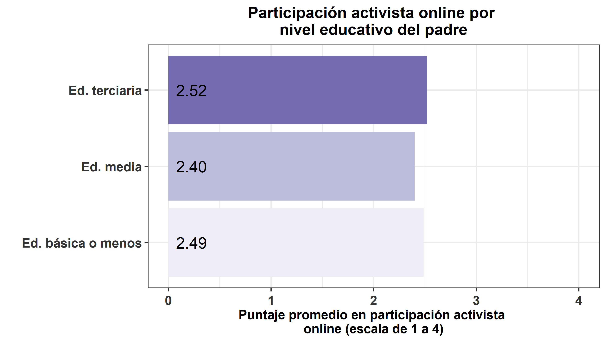

### Participación política durante el segundo semestre de 2021

```{r}
#### Crear variable
data_wide$part_act_online_21_2s = as.numeric(data_wide$part_pol_online_info_21b + data_wide$part_pol_online_post_21b + data_wide$part_pol_online_com_21b + data_wide$part_pol_online_seg_21b)/4
```

```{r}
# Creación de bbdd
data_ed_bas = data_wide %>%  filter(nse_padre==1 | nse_padre==2 | nse_padre==3 | nse_padre==4) %>% as.data.frame() # Sin Ed. (1), Ed. básica incompleta (2) o completa (3)
data_ed_med = data_wide %>%  filter(nse_padre==4 | nse_padre==5) %>% as.data.frame() # Ed. media incompleta (4) o completa (5)
data_ed_ter = data_wide %>%  filter(nse_padre==6 | nse_padre==7 | nse_padre==8 | nse_padre==9 | nse_padre==10) %>% as.data.frame() # técnico superior incompleto (6) o completo (7) Universitaria incompleta (8) o completa (9), Estudios de postgrado (magíster o doctorado) (10)

#data_ed_tec = data_wide %>%  filter(nse_padre==6 | nse_padre==7) %>% as.data.frame() # técnico superior incompleto (6) o completo (7)
#data_ed_uni = data_wide %>%  filter(nse_padre==8 | nse_padre==9 | nse_padre==10) %>% as.data.frame() # Universitaria incompleta (8) o completa (9), Estudios de postgrado (magíster o doctorado) (10)

```

```{r}
table_preposh1<- rbind(psych::describe(data_ed_bas$part_act_online_21_2s, na.rm=T),
               psych::describe(data_ed_med$part_act_online_21_2s, na.rm=T),
               psych::describe(data_ed_ter$part_act_online_21_2s, na.rm=T))#,
#               psych::describe(data_ed_uni$part_act_online_21_2s, na.rm=T))
table_preposh1 <- table_preposh1 %>% select(n,mean,sd,median,trimmed,min,max)

pond1 <- stats::weighted.mean(x=data_ed_bas$part_act_online_21_2s,y=data_ed_bas$weight_w01,na.rm=TRUE)
pond2 <- stats::weighted.mean(x=data_ed_med$part_act_online_21_2s,y=data_ed_med$weight_w01,na.rm=TRUE)
pond3 <- stats::weighted.mean(x=data_ed_ter$part_act_online_21_2s,y=data_ed_ter$weight_w01,na.rm=TRUE)
#pond4 <- stats::weighted.mean(x=data_ed_uni$part_act_online_21_2s,y=data_ed_uni$weight_w01,na.rm=TRUE)

table_preposh1[1,2]<-pond1
table_preposh1[2,2]<-pond2
table_preposh1[3,2]<-pond3
#table_preposh1[4,2]<-pond4

#table_preposh1$dep <- c("Ed. básica o menos","Ed. media","Técnico superior", "Universitaria o más")
table_preposh1$dep <- c("Ed. básica o menos","Ed. media","Ed. terciaria")

part_act_online_21_2s_colegio <-  ggplot(data=table_preposh1, aes(x=dep, y=mean, fill=dep)) +
     geom_bar(position = 'dodge', stat='identity')+#,width=0.8) 
     scale_fill_brewer(palette="Purples") +
     geom_text(aes(label=format(round(mean,2)), y=0), position=position_dodge(0.9), hjust=-0.25, size=6) +
     theme_bw(base_size = 14) +
     scale_y_continuous(labels = scales::comma) +
     ylab('Puntaje promedio en participación activista 
online (escala de 1 a 4)') + xlab(' ') + 
     theme(legend.position="top") +
     labs(fill = " ") +
    coord_flip()+
    theme(axis.text.x = element_text(colour = "grey20", size = 14, angle = 360, hjust = 0.5, vjust = 0.5, face = "bold"),
          axis.text.y = element_text(colour = "grey20", size = 14), 
          text = element_text(size = 14, face = "bold"),
          plot.title = element_text(hjust=0.5),
          legend.position = "none") + 
     ggtitle("Participación activista online por 
nivel educativo de la padre") + ylim(0,4)
#part_act_online_21_2s_colegio
ggsave(part_act_online_21_2s_colegio, file = "../output/graphs/part_act_online_21_2s_colegio_ed_padre.png",device = "png",width = 23,height = 13,dpi = "retina",units = "cm")
```


## Frecuencia de conversación con los padres sobre temas sociales y/o políticos
### Participación política durante 3ro y 4to medio

```{r}
### Crear variable
data_wide$part_act_online_3y4 <- as.numeric(data_wide$part_pol_online + data_wide$part_online_post + data_wide$part_online_com + data_wide$part_online_seg)/4
```

```{r}
# Creación de bbdd
data_nunca = data_wide %>%  filter(conv_padr_poli==1) %>% as.data.frame() # Nunca
data_casi_nunca = data_wide %>%  filter(conv_padr_poli==2) %>% as.data.frame() # Casi nunca
data_a_veces = data_wide %>%  filter(conv_padr_poli==3) %>% as.data.frame() # A veces
data_frecuent = data_wide %>%  filter(conv_padr_poli==4) %>% as.data.frame() # Frecuentemente
```

```{r}
table_preposh1<- rbind(psych::describe(data_nunca$part_act_online_3y4, na.rm=T),
               psych::describe(data_casi_nunca$part_act_online_3y4, na.rm=T),
               psych::describe(data_a_veces$part_act_online_3y4, na.rm=T),
               psych::describe(data_frecuent$part_act_online_3y4, na.rm=T))
table_preposh1 <- table_preposh1 %>% select(n,mean,sd,median,trimmed,min,max)

pond1 <- stats::weighted.mean(x=data_nunca$part_act_online_3y4,y=data_nunca$weight_w01,na.rm=TRUE)
pond2 <- stats::weighted.mean(x=data_casi_nunca$part_act_online_3y4,y=data_casi_nunca$weight_w01,na.rm=TRUE)
pond3 <- stats::weighted.mean(x=data_a_veces$part_act_online_3y4,y=data_a_veces$weight_w01,na.rm=TRUE)
pond4 <- stats::weighted.mean(x=data_frecuent$part_act_online_3y4,y=data_frecuent$weight_w01,na.rm=TRUE)

table_preposh1[1,2]<-pond1
table_preposh1[2,2]<-pond2
table_preposh1[3,2]<-pond3
table_preposh1[4,2]<-pond4

table_preposh1$dep <- c("1. Nunca","2. Casi nunca","3. A veces", "4. Frecuentemente")

part_act_online_3y4_colegio <-  ggplot(data=table_preposh1, aes(x=dep, y=mean, fill=dep)) +
     geom_bar(position = 'dodge', stat='identity')+#,width=0.8) 
     scale_fill_brewer(palette="Purples") +
     geom_text(aes(label=format(round(mean,2)), y=0), position=position_dodge(0.9), hjust=-0.25, size=6) +
     theme_bw(base_size = 14) +
     scale_y_continuous(labels = scales::comma) +
     ylab('Puntaje promedio en participación activista 
online (escala de 1 a 4)') + xlab(' ') + 
     theme(legend.position="top") +
     labs(fill = " ") +
    coord_flip()+
    theme(axis.text.x = element_text(colour = "grey20", size = 14, angle = 360, hjust = 0.5, vjust = 0.5, face = "bold"),
          axis.text.y = element_text(colour = "grey20", size = 14), 
          text = element_text(size = 14, face = "bold"),
          plot.title = element_text(hjust=0.5),
          legend.position = "none") + 
     ggtitle("Participación activista online por 
conversación con los padres sobre temas políticos y/o sociales") + ylim(0,4)
#part_act_online_3y4_colegio
ggsave(part_act_online_3y4_colegio, file = "../output/graphs/part_act_online_3y4_colegio_conv_padres.png",device = "png",width = 23,height = 13,dpi = "retina",units = "cm")

```


### Participación política durante estallido social

```{r}
### Crear variable
data_wide$part_act_online_es <- as.numeric(data_wide$part_pol_online_info_21 + data_wide$part_pol_online_post_21 + data_wide$part_pol_online_com_21 + data_wide$part_pol_online_seg_21)/4
```

```{r}
# Creación de bbdd
data_nunca = data_wide %>%  filter(conv_padres_21==1) %>% as.data.frame() # Nunca
data_casi_nunca = data_wide %>%  filter(conv_padres_21==2) %>% as.data.frame() # Casi nunca
data_a_veces = data_wide %>%  filter(conv_padres_21==3) %>% as.data.frame() # A veces
data_frecuent = data_wide %>%  filter(conv_padres_21==4) %>% as.data.frame() # Frecuentemente
```

```{r}
table_preposh1<- rbind(psych::describe(data_nunca$part_act_online_es, na.rm=T),
               psych::describe(data_casi_nunca$part_act_online_es, na.rm=T),
               psych::describe(data_a_veces$part_act_online_es, na.rm=T),
               psych::describe(data_frecuent$part_act_online_es, na.rm=T))
table_preposh1 <- table_preposh1 %>% select(n,mean,sd,median,trimmed,min,max)

pond1 <- stats::weighted.mean(x=data_nunca$part_act_online_es,y=data_nunca$weight_w01,na.rm=TRUE)
pond2 <- stats::weighted.mean(x=data_casi_nunca$part_act_online_es,y=data_casi_nunca$weight_w01,na.rm=TRUE)
pond3 <- stats::weighted.mean(x=data_a_veces$part_act_online_es,y=data_a_veces$weight_w01,na.rm=TRUE)
pond4 <- stats::weighted.mean(x=data_frecuent$part_act_online_es,y=data_frecuent$weight_w01,na.rm=TRUE)

table_preposh1[1,2]<-pond1
table_preposh1[2,2]<-pond2
table_preposh1[3,2]<-pond3
table_preposh1[4,2]<-pond4

table_preposh1$dep <- c("1. Nunca","2. Casi nunca","3. A veces", "4. Frecuentemente")

part_act_online_es_colegio <-  ggplot(data=table_preposh1, aes(x=dep, y=mean, fill=dep)) +
     geom_bar(position = 'dodge', stat='identity')+#,width=0.8) 
     scale_fill_brewer(palette="Purples") +
     geom_text(aes(label=format(round(mean,2)), y=0), position=position_dodge(0.9), hjust=-0.25, size=6) +
     theme_bw(base_size = 14) +
     scale_y_continuous(labels = scales::comma) +
     ylab('Puntaje promedio en participación activista 
online (escala de 1 a 4)') + xlab(' ') + 
     theme(legend.position="top") +
     labs(fill = " ") +
    coord_flip()+
    theme(axis.text.x = element_text(colour = "grey20", size = 14, angle = 360, hjust = 0.5, vjust = 0.5, face = "bold"),
          axis.text.y = element_text(colour = "grey20", size = 14), 
          text = element_text(size = 14, face = "bold"),
          plot.title = element_text(hjust=0.5),
          legend.position = "none") + 
     ggtitle("Participación activista online por 
conversación con los padres sobre temas políticos y/o sociales") + ylim(0,4)
#part_act_online_es_colegio
ggsave(part_act_online_es_colegio, file = "../output/graphs/part_act_online_es_colegio_conv_padres.png",device = "png",width = 23,height = 13,dpi = "retina",units = "cm")

```


### Participación política durante el 2020

```{r}
### Crear variable
data_wide$part_act_online_20 = as.numeric(data_wide$part_pol_online_info_20 + data_wide$part_pol_online_post_20 + data_wide$part_pol_online_com_20 + data_wide$part_pol_online_seg_20	)/4
```

```{r}
# Creación de bbdd
data_nunca = data_wide %>%  filter(conv_padres_20==1) %>% as.data.frame() # Nunca
data_casi_nunca = data_wide %>%  filter(conv_padres_20==2) %>% as.data.frame() # Casi nunca
data_a_veces = data_wide %>%  filter(conv_padres_20==3) %>% as.data.frame() # A veces
data_frecuent = data_wide %>%  filter(conv_padres_20==4) %>% as.data.frame() # Frecuentemente
```

```{r}
table_preposh1<- rbind(psych::describe(data_nunca$part_act_online_20, na.rm=T),
               psych::describe(data_casi_nunca$part_act_online_20, na.rm=T),
               psych::describe(data_a_veces$part_act_online_20, na.rm=T),
               psych::describe(data_frecuent$part_act_online_20, na.rm=T))
table_preposh1 <- table_preposh1 %>% select(n,mean,sd,median,trimmed,min,max)

pond1 <- stats::weighted.mean(x=data_nunca$part_act_online_20,y=data_nunca$weight_w01,na.rm=TRUE)
pond2 <- stats::weighted.mean(x=data_casi_nunca$part_act_online_20,y=data_casi_nunca$weight_w01,na.rm=TRUE)
pond3 <- stats::weighted.mean(x=data_a_veces$part_act_online_20,y=data_a_veces$weight_w01,na.rm=TRUE)
pond4 <- stats::weighted.mean(x=data_frecuent$part_act_online_20,y=data_frecuent$weight_w01,na.rm=TRUE)

table_preposh1[1,2]<-pond1
table_preposh1[2,2]<-pond2
table_preposh1[3,2]<-pond3
table_preposh1[4,2]<-pond4

table_preposh1$dep <- c("1. Nunca","2. Casi nunca","3. A veces", "4. Frecuentemente")

part_act_online_20_colegio <-  ggplot(data=table_preposh1, aes(x=dep, y=mean, fill=dep)) +
     geom_bar(position = 'dodge', stat='identity')+#,width=0.8) 
     scale_fill_brewer(palette="Purples") +
     geom_text(aes(label=format(round(mean,2)), y=0), position=position_dodge(0.9), hjust=-0.25, size=6) +
     theme_bw(base_size = 14) +
     scale_y_continuous(labels = scales::comma) +
     ylab('Puntaje promedio en participación activista 
online (escala de 1 a 4)') + xlab(' ') + 
     theme(legend.position="top") +
     labs(fill = " ") +
    coord_flip()+
    theme(axis.text.x = element_text(colour = "grey20", size = 14, angle = 360, hjust = 0.5, vjust = 0.5, face = "bold"),
          axis.text.y = element_text(colour = "grey20", size = 14), 
          text = element_text(size = 14, face = "bold"),
          plot.title = element_text(hjust=0.5),
          legend.position = "none") + 
     ggtitle("Participación activista online por 
conversación con los padres sobre temas políticos y/o sociales") + ylim(0,4)
#part_act_online_20_colegio
ggsave(part_act_online_20_colegio, file = "../output/graphs/part_act_online_20_colegio_conv_padres.png",device = "png",width = 23,height = 13,dpi = "retina",units = "cm")
```


### Participación política durante el primer semestre de 2021

```{r}
#### Crear variable
data_wide$part_act_online_21_1s = as.numeric(data_wide$part_pol_online_info + data_wide$part_pol_online_post + data_wide$part_pol_online_com + data_wide$part_pol_online_seg)/4
```

```{r}
# Creación de bbdd
data_nunca = data_wide %>%  filter(conv_padres==1) %>% as.data.frame() # Nunca
data_casi_nunca = data_wide %>%  filter(conv_padres==2) %>% as.data.frame() # Casi nunca
data_a_veces = data_wide %>%  filter(conv_padres==3) %>% as.data.frame() # A veces
data_frecuent = data_wide %>%  filter(conv_padres==4) %>% as.data.frame() # Frecuentemente
```

```{r}
table_preposh1<- rbind(psych::describe(data_nunca$part_act_online_21_1s, na.rm=T),
               psych::describe(data_casi_nunca$part_act_online_21_1s, na.rm=T),
               psych::describe(data_a_veces$part_act_online_21_1s, na.rm=T),
               psych::describe(data_frecuent$part_act_online_21_1s, na.rm=T))
table_preposh1 <- table_preposh1 %>% select(n,mean,sd,median,trimmed,min,max)

pond1 <- stats::weighted.mean(x=data_nunca$part_act_online_21_1s,y=data_nunca$weight_w01,na.rm=TRUE)
pond2 <- stats::weighted.mean(x=data_casi_nunca$part_act_online_21_1s,y=data_casi_nunca$weight_w01,na.rm=TRUE)
pond3 <- stats::weighted.mean(x=data_a_veces$part_act_online_21_1s,y=data_a_veces$weight_w01,na.rm=TRUE)
pond4 <- stats::weighted.mean(x=data_frecuent$part_act_online_21_1s,y=data_frecuent$weight_w01,na.rm=TRUE)

table_preposh1[1,2]<-pond1
table_preposh1[2,2]<-pond2
table_preposh1[3,2]<-pond3
table_preposh1[4,2]<-pond4

table_preposh1$dep <- c("1. Nunca","2. Casi nunca","3. A veces", "4. Frecuentemente")

part_act_online_21_1s_colegio <-  ggplot(data=table_preposh1, aes(x=dep, y=mean, fill=dep)) +
     geom_bar(position = 'dodge', stat='identity')+#,width=0.8) 
     scale_fill_brewer(palette="Purples") +
     geom_text(aes(label=format(round(mean,2)), y=0), position=position_dodge(0.9), hjust=-0.25, size=6) +
     theme_bw(base_size = 14) +
     scale_y_continuous(labels = scales::comma) +
     ylab('Puntaje promedio en participación activista 
online (escala de 1 a 4)') + xlab(' ') + 
     theme(legend.position="top") +
     labs(fill = " ") +
    coord_flip()+
    theme(axis.text.x = element_text(colour = "grey20", size = 14, angle = 360, hjust = 0.5, vjust = 0.5, face = "bold"),
          axis.text.y = element_text(colour = "grey20", size = 14), 
          text = element_text(size = 14, face = "bold"),
          plot.title = element_text(hjust=0.5),
          legend.position = "none") + 
     ggtitle("Participación activista online por 
conversación con los padres sobre temas políticos y/o sociales") + ylim(0,4)
#part_act_online_21_1s_colegio
ggsave(part_act_online_21_1s_colegio, file = "../output/graphs/part_act_online_21_1s_colegio_conv_padres.png",device = "png",width = 23,height = 13,dpi = "retina",units = "cm")
```


### Participación política durante el segundo semestre de 2021

```{r}
#### Crear variable
data_wide$part_act_online_21_2s = as.numeric(data_wide$part_pol_online_info_21b + data_wide$part_pol_online_post_21b + data_wide$part_pol_online_com_21b + data_wide$part_pol_online_seg_21b)/4
```

```{r}
# Creación de bbdd
data_nunca = data_wide %>%  filter(conv_padres_21b==1) %>% as.data.frame() # Nunca
data_casi_nunca = data_wide %>%  filter(conv_padres_21b==2) %>% as.data.frame() # Casi nunca
data_a_veces = data_wide %>%  filter(conv_padres_21b==3) %>% as.data.frame() # A veces
data_frecuent = data_wide %>%  filter(conv_padres_21b==4) %>% as.data.frame() # Frecuentemente
```

```{r}
table_preposh1<- rbind(psych::describe(data_nunca$part_act_online_21_2s, na.rm=T),
               psych::describe(data_casi_nunca$part_act_online_21_2s, na.rm=T),
               psych::describe(data_a_veces$part_act_online_21_2s, na.rm=T),
               psych::describe(data_frecuent$part_act_online_21_2s, na.rm=T))
table_preposh1 <- table_preposh1 %>% select(n,mean,sd,median,trimmed,min,max)

pond1 <- stats::weighted.mean(x=data_nunca$part_act_online_21_2s,y=data_nunca$weight_w01,na.rm=TRUE)
pond2 <- stats::weighted.mean(x=data_casi_nunca$part_act_online_21_2s,y=data_casi_nunca$weight_w01,na.rm=TRUE)
pond3 <- stats::weighted.mean(x=data_a_veces$part_act_online_21_2s,y=data_a_veces$weight_w01,na.rm=TRUE)
pond4 <- stats::weighted.mean(x=data_frecuent$part_act_online_21_2s,y=data_frecuent$weight_w01,na.rm=TRUE)

table_preposh1[1,2]<-pond1
table_preposh1[2,2]<-pond2
table_preposh1[3,2]<-pond3
table_preposh1[4,2]<-pond4

table_preposh1$dep <- c("1. Nunca","2. Casi nunca","3. A veces", "4. Frecuentemente")

part_act_online_21_2s_colegio <-  ggplot(data=table_preposh1, aes(x=dep, y=mean, fill=dep)) +
     geom_bar(position = 'dodge', stat='identity')+#,width=0.8) 
     scale_fill_brewer(palette="Purples") +
     geom_text(aes(label=format(round(mean,2)), y=0), position=position_dodge(0.9), hjust=-0.25, size=6) +
     theme_bw(base_size = 14) +
     scale_y_continuous(labels = scales::comma) +
     ylab('Puntaje promedio en participación activista 
online (escala de 1 a 4)') + xlab(' ') + 
     theme(legend.position="top") +
     labs(fill = " ") +
    coord_flip()+
    theme(axis.text.x = element_text(colour = "grey20", size = 14, angle = 360, hjust = 0.5, vjust = 0.5, face = "bold"),
          axis.text.y = element_text(colour = "grey20", size = 14), 
          text = element_text(size = 14, face = "bold"),
          plot.title = element_text(hjust=0.5),
          legend.position = "none") + 
     ggtitle("Participación activista online por 
conversación con los padres sobre temas políticos y/o sociales") + ylim(0,4)
#part_act_online_21_2s_colegio
ggsave(part_act_online_21_2s_colegio, file = "../output/graphs/part_act_online_21_2s_colegio_conv_padres.png",device = "png",width = 23,height = 13,dpi = "retina",units = "cm")
```

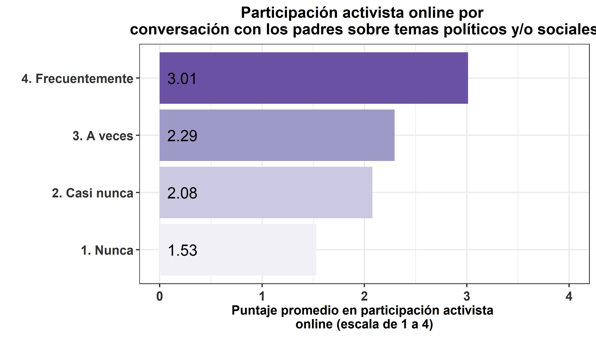


# Activismo social o comunitario
## Dependencia administrativa establecimiento
### Participación política durante 3ro y 4to medio
```{r}
### Variable: part_pol_volunt
```

```{r}
# Creación de bbdd
data_mun = data_wide %>%  filter(edm_admi==1) %>% as.data.frame() #Municipal
data_sub = data_wide %>%  filter(edm_admi==2) %>% as.data.frame() #Particular Subvencionado
data_priv = data_wide %>%  filter(edm_admi==3) %>% as.data.frame() #Particular pagado
```

```{r}
table_preposh1<- rbind(psych::describe(data_mun$part_pol_volunt, na.rm=T),
               psych::describe(data_sub$part_pol_volunt, na.rm=T),psych::describe(data_priv$part_pol_volunt, na.rm=T))
table_preposh1 <- table_preposh1 %>% select(n,mean,sd,median,trimmed,min,max)
pond1 <- stats::weighted.mean(x=data_mun$part_pol_volunt,y=data_mun$weight_w01,na.rm=TRUE)
pond2 <- stats::weighted.mean(x=data_sub$part_pol_volunt,y=data_sub$weight_w01,na.rm=TRUE)
pond3 <- stats::weighted.mean(x=data_priv$part_pol_volunt,y=data_priv$weight_w01,na.rm=TRUE)

table_preposh1[1,2]<-pond1
table_preposh1[2,2]<-pond2
table_preposh1[3,2]<-pond3

table_preposh1$dep <- c("Municipal","Particular Subvencionado","Particular Privado")

part_pol_volunt_colegio <-  ggplot(data=table_preposh1, aes(x=dep, y=mean, fill=dep)) +
     geom_bar(position = 'dodge', stat='identity')+#,width=0.8) 
     scale_fill_brewer(palette="Purples") +
     geom_text(aes(label=format(round(mean,2)), y=0), position=position_dodge(0.9), hjust=-0.25, size=6) +
     theme_bw(base_size = 14) +
     scale_y_continuous(labels = scales::comma) +
     ylab('Puntaje promedio en participación activista 
social o comunitaria (escala de 1 a 4)') + xlab(' ') + 
     theme(legend.position="top") +
     labs(fill = " ") +
    coord_flip()+
    theme(axis.text.x = element_text(colour = "grey20", size = 14, angle = 360, hjust = 0.5, vjust = 0.5, face = "bold"),
          axis.text.y = element_text(colour = "grey20", size = 14), 
          text = element_text(size = 14, face = "bold"),
          plot.title = element_text(hjust=0.5),
          legend.position = "none") + 
     ggtitle("Participación activista social o comunitaria por 
tipo de dependencia administrativa de la escuela") + ylim(0,4)
#part_pol_volunt_colegio
ggsave(part_pol_volunt_colegio, file = "../output/graphs/part_pol_volunt_colegio_dep.png",device = "png",width = 23,height = 13,dpi = "retina",units = "cm")

```


### Participación política durante estallido social

```{r}
###  variable part_pol_com_21
```

```{r}
# Creación de bbdd
data_mun = data_wide %>%  filter(edm_admi==1) %>% as.data.frame() #Municipal
data_sub = data_wide %>%  filter(edm_admi==2) %>% as.data.frame() #Particular Subvencionado
data_priv = data_wide %>%  filter(edm_admi==3) %>% as.data.frame() #Particular pagado
```

```{r}
table_preposh1<- rbind(psych::describe(data_mun$part_pol_com_21, na.rm=T),
               psych::describe(data_sub$part_pol_com_21, na.rm=T),psych::describe(data_priv$part_pol_com_21, na.rm=T))
table_preposh1 <- table_preposh1 %>% select(n,mean,sd,median,trimmed,min,max)

pond1 <- stats::weighted.mean(x=data_mun$part_pol_com_21,y=data_mun$weight_w01,na.rm=TRUE)
pond2 <- stats::weighted.mean(x=data_sub$part_pol_com_21,y=data_sub$weight_w01,na.rm=TRUE)
pond3 <- stats::weighted.mean(x=data_priv$part_pol_com_21,y=data_priv$weight_w01,na.rm=TRUE)

table_preposh1[1,2]<-pond1
table_preposh1[2,2]<-pond2
table_preposh1[3,2]<-pond3

table_preposh1$dep <- c("Municipal","Particular Subvencionado","Particular Privado")

part_pol_com_21_colegio <-  ggplot(data=table_preposh1, aes(x=dep, y=mean, fill=dep)) +
     geom_bar(position = 'dodge', stat='identity')+#,width=0.8) 
     scale_fill_brewer(palette="Purples") +
     geom_text(aes(label=format(round(mean,2)), y=0), position=position_dodge(0.9), hjust=-0.25, size=6) +
     theme_bw(base_size = 14) +
     scale_y_continuous(labels = scales::comma) +
     ylab('Puntaje promedio en participación activista 
social o comunitaria (escala de 1 a 4)') + xlab(' ') + 
  theme(legend.position="top") +
     labs(fill = " ") +
    coord_flip()+
    theme(axis.text.x = element_text(colour = "grey20", size = 14, angle = 360, hjust = 0.5, vjust = 0.5, face = "bold"),
          axis.text.y = element_text(colour = "grey20", size = 14), 
          text = element_text(size = 14, face = "bold"),
          plot.title = element_text(hjust=0.5),
          legend.position = "none") + 
     ggtitle("Participación activista social o comunitaria por 
tipo de dependencia administrativa de la escuela") + ylim(0,4)
#part_pol_com_21_colegio
ggsave(part_pol_com_21_colegio, file = "../output/graphs/part_pol_com_21_colegio_dep.png",device = "png",width = 23,height = 13,dpi = "retina",units = "cm")

```


### Participación política durante el 2020

```{r}
### variable part_pol_com_20
```

```{r}
# Creación de bbdd
data_mun = data_wide %>%  filter(edm_admi==1) %>% as.data.frame() #Municipal
data_sub = data_wide %>%  filter(edm_admi==2) %>% as.data.frame() #Particular Subvencionado
data_priv = data_wide %>%  filter(edm_admi==3) %>% as.data.frame() #Particular pagado
```

```{r}
table_preposh1<- rbind(psych::describe(data_mun$part_pol_com_20, na.rm=T),
               psych::describe(data_sub$part_pol_com_20, na.rm=T),psych::describe(data_priv$part_pol_com_20, na.rm=T))
table_preposh1 <- table_preposh1 %>% select(n,mean,sd,median,trimmed,min,max)

pond1 <- stats::weighted.mean(x=data_mun$part_pol_com_20,y=data_mun$weight_w01,na.rm=TRUE)
pond2 <- stats::weighted.mean(x=data_sub$part_pol_com_20,y=data_sub$weight_w01,na.rm=TRUE)
pond3 <- stats::weighted.mean(x=data_priv$part_pol_com_20,y=data_priv$weight_w01,na.rm=TRUE)

table_preposh1[1,2]<-pond1
table_preposh1[2,2]<-pond2
table_preposh1[3,2]<-pond3

table_preposh1$dep <- c("Municipal","Particular Subvencionado","Particular Privado")

part_pol_com_20_colegio <-  ggplot(data=table_preposh1, aes(x=dep, y=mean, fill=dep)) +
     geom_bar(position = 'dodge', stat='identity')+#,width=0.8) 
     scale_fill_brewer(palette="Purples") +
     geom_text(aes(label=format(round(mean,2)), y=0), position=position_dodge(0.9), hjust=-0.25, size=6) +
     theme_bw(base_size = 14) +
     scale_y_continuous(labels = scales::comma) +
          ylab('Puntaje promedio en participación activista 
social o comunitaria (escala de 1 a 4)') + xlab(' ') +  
     theme(legend.position="top") +
     labs(fill = " ") +
    coord_flip()+
    theme(axis.text.x = element_text(colour = "grey20", size = 14, angle = 360, hjust = 0.5, vjust = 0.5, face = "bold"),
          axis.text.y = element_text(colour = "grey20", size = 14), 
          text = element_text(size = 14, face = "bold"),
          plot.title = element_text(hjust=0.5),
          legend.position = "none") + 
     ggtitle("Participación activista social o comunitaria por 
tipo de dependencia administrativa de la escuela") + ylim(0,4)
#part_pol_com_20_colegio
ggsave(part_pol_com_20_colegio, file = "../output/graphs/part_pol_com_20_colegio_dep.png",device = "png",width = 23,height = 13,dpi = "retina",units = "cm")
```


### Participación política durante el primer semestre de 2021

```{r}
#### variable part_pol_com
```

```{r}
# Creación de bbdd
data_mun = data_wide %>%  filter(edm_admi==1) %>% as.data.frame() #Municipal
data_sub = data_wide %>%  filter(edm_admi==2) %>% as.data.frame() #Particular Subvencionado
data_priv = data_wide %>%  filter(edm_admi==3) %>% as.data.frame() #Particular pagado
```

```{r}
table_preposh1<- rbind(psych::describe(data_mun$part_pol_com, na.rm=T),
               psych::describe(data_sub$part_pol_com, na.rm=T),psych::describe(data_priv$part_pol_com, na.rm=T))
table_preposh1 <- table_preposh1 %>% select(n,mean,sd,median,trimmed,min,max)

pond1 <- stats::weighted.mean(x=data_mun$part_pol_com,y=data_mun$weight_w02,na.rm=TRUE)
pond2 <- stats::weighted.mean(x=data_sub$part_pol_com,y=data_sub$weight_w02,na.rm=TRUE)
pond3 <- stats::weighted.mean(x=data_priv$part_pol_com,y=data_priv$weight_w02,na.rm=TRUE)

table_preposh1[1,2]<-pond1
table_preposh1[2,2]<-pond2
table_preposh1[3,2]<-pond3

table_preposh1$dep <- c("Municipal","Particular Subvencionado","Particular Privado")

part_pol_com_colegio <-  ggplot(data=table_preposh1, aes(x=dep, y=mean, fill=dep)) +
     geom_bar(position = 'dodge', stat='identity')+#,width=0.8) 
     scale_fill_brewer(palette="Purples") +
     geom_text(aes(label=format(round(mean,2)), y=0), position=position_dodge(0.9), hjust=-0.25, size=6) +
     theme_bw(base_size = 14) +
     scale_y_continuous(labels = scales::comma) +
     ylab('Puntaje promedio en participación activista 
social o comunitaria (escala de 1 a 4)') + xlab(' ') + 
     theme(legend.position="top") +
     labs(fill = " ") +
    coord_flip()+
    theme(axis.text.x = element_text(colour = "grey20", size = 14, angle = 360, hjust = 0.5, vjust = 0.5, face = "bold"),
          axis.text.y = element_text(colour = "grey20", size = 14), 
          text = element_text(size = 14, face = "bold"),
          plot.title = element_text(hjust=0.5),
          legend.position = "none") + 
     ggtitle("Participación activista social o comunitaria por 
tipo de dependencia administrativa de la escuela") + ylim(0,4)
#part_pol_com_colegio
ggsave(part_pol_com_colegio, file = "../output/graphs/part_pol_com_colegio_dep.png",device = "png",width = 23,height = 13,dpi = "retina",units = "cm")
```

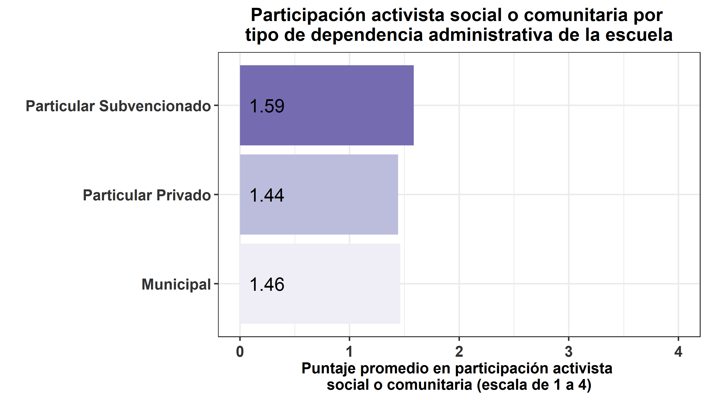

### Participación política durante el segundo semestre de 2021

```{r}
#### variable part_pol_com_21b
```

```{r}
# Creación de bbdd
data_mun = data_wide %>%  filter(edm_admi==1) %>% as.data.frame() #Municipal
data_sub = data_wide %>%  filter(edm_admi==2) %>% as.data.frame() #Particular Subvencionado
data_priv = data_wide %>%  filter(edm_admi==3) %>% as.data.frame() #Particular pagado
```

```{r}
table_preposh1<- rbind(psych::describe(data_mun$part_pol_com_21b, na.rm=T),
               psych::describe(data_sub$part_pol_com_21b, na.rm=T),psych::describe(data_priv$part_pol_com_21b, na.rm=T))
table_preposh1 <- table_preposh1 %>% select(n,mean,sd,median,trimmed,min,max)

pond1 <- stats::weighted.mean(x=data_mun$part_pol_com_21b,y=data_mun$weight_w03,na.rm=TRUE)
pond2 <- stats::weighted.mean(x=data_sub$part_pol_com_21b,y=data_sub$weight_w03,na.rm=TRUE)
pond3 <- stats::weighted.mean(x=data_priv$part_pol_com_21b,y=data_priv$weight_w03,na.rm=TRUE)

table_preposh1[1,2]<-pond1
table_preposh1[2,2]<-pond2
table_preposh1[3,2]<-pond3

table_preposh1$dep <- c("Municipal","Particular Subvencionado","Particular Privado")

part_pol_com_21b_colegio <-  ggplot(data=table_preposh1, aes(x=dep, y=mean, fill=dep)) +
     geom_bar(position = 'dodge', stat='identity')+#,width=0.8) 
     scale_fill_brewer(palette="Purples") +
     geom_text(aes(label=format(round(mean,2)), y=0), position=position_dodge(0.9), hjust=-0.25, size=6) +
     theme_bw(base_size = 14) +
     scale_y_continuous(labels = scales::comma) +
     ylab('Puntaje promedio en participación activista 
social o comunitaria (escala de 1 a 4)') + xlab(' ') + 
     theme(legend.position="top") +
     labs(fill = " ") +
    coord_flip()+
    theme(axis.text.x = element_text(colour = "grey20", size = 14, angle = 360, hjust = 0.5, vjust = 0.5, face = "bold"),
          axis.text.y = element_text(colour = "grey20", size = 14), 
          text = element_text(size = 14, face = "bold"),
          plot.title = element_text(hjust=0.5),
          legend.position = "none") + 
     ggtitle("Participación activista social o comunitaria por 
tipo de dependencia administrativa de la escuela") + ylim(0,4)
#part_pol_com_21b_colegio
ggsave(part_pol_com_21b_colegio, file = "../output/graphs/part_pol_com_21b_colegio_dep.png",device = "png",width = 23,height = 13,dpi = "retina",units = "cm")
```


## Máximo nivel educativo de la madre
### Participación política durante 3ro y 4to medio

```{r}
### Variable: part_pol_volunt
```

```{r}
# Creación de bbdd
data_ed_bas = data_wide %>%  filter(nse_madre==1 | nse_madre==2 | nse_madre==3 | nse_madre==4) %>% as.data.frame() # Sin Ed. (1), Ed. básica incompleta (2) o completa (3)
data_ed_med = data_wide %>%  filter(nse_madre==4 | nse_madre==5) %>% as.data.frame() # Ed. media incompleta (4) o completa (5)
data_ed_ter = data_wide %>%  filter(nse_madre==6 | nse_madre==7 | nse_madre==8 | nse_madre==9 | nse_madre==10) %>% as.data.frame() # técnico superior incompleto (6) o completo (7) Universitaria incompleta (8) o completa (9), Estudios de postgrado (magíster o doctorado) (10)

#data_ed_tec = data_wide %>%  filter(nse_madre==6 | nse_madre==7) %>% as.data.frame() # técnico superior incompleto (6) o completo (7)
#data_ed_uni = data_wide %>%  filter(nse_madre==8 | nse_madre==9 | nse_madre==10) %>% as.data.frame() # Universitaria incompleta (8) o completa (9), Estudios de postgrado (magíster o doctorado) (10)
```

```{r}
table_preposh1<- rbind(psych::describe(data_ed_bas$part_pol_volunt, na.rm=T),
               psych::describe(data_ed_med$part_pol_volunt, na.rm=T),
               psych::describe(data_ed_ter$part_pol_volunt, na.rm=T))#,
#               psych::describe(data_ed_uni$part_pol_volunt, na.rm=T))
table_preposh1 <- table_preposh1 %>% select(n,mean,sd,median,trimmed,min,max)

pond1 <- stats::weighted.mean(x=data_ed_bas$part_pol_volunt,y=data_ed_bas$weight_w01,na.rm=TRUE)
pond2 <- stats::weighted.mean(x=data_ed_med$part_pol_volunt,y=data_ed_med$weight_w01,na.rm=TRUE)
pond3 <- stats::weighted.mean(x=data_ed_ter$part_pol_volunt,y=data_ed_ter$weight_w01,na.rm=TRUE)
#pond4 <- stats::weighted.mean(x=data_ed_uni$part_pol_volunt,y=data_ed_uni$weight_w01,na.rm=TRUE)

table_preposh1[1,2]<-pond1
table_preposh1[2,2]<-pond2
table_preposh1[3,2]<-pond3
#table_preposh1[4,2]<-pond4

#table_preposh1$dep <- c("Ed. básica o menos","Ed. media","Técnico superior", "Universitaria o más")
table_preposh1$dep <- c("Ed. básica o menos","Ed. media","Ed. terciaria")

part_pol_volunt_colegio <-  ggplot(data=table_preposh1, aes(x=dep, y=mean, fill=dep)) +
     geom_bar(position = 'dodge', stat='identity')+#,width=0.8) 
     scale_fill_brewer(palette="Purples") +
     geom_text(aes(label=format(round(mean,2)), y=0), position=position_dodge(0.9), hjust=-0.25, size=6) +
     theme_bw(base_size = 14) +
     scale_y_continuous(labels = scales::comma) +
     ylab('Puntaje promedio en participación activista 
social o comunitaria (escala de 1 a 4)') + xlab(' ') + 
  theme(legend.position="top") +
     labs(fill = " ") +
    coord_flip()+
    theme(axis.text.x = element_text(colour = "grey20", size = 14, angle = 360, hjust = 0.5, vjust = 0.5, face = "bold"),
          axis.text.y = element_text(colour = "grey20", size = 14), 
          text = element_text(size = 14, face = "bold"),
          plot.title = element_text(hjust=0.5),
          legend.position = "none") + 
     ggtitle("Participación activista social o comunitaria por 
nivel educativo de la madre") + ylim(0,4)
#part_pol_volunt_colegio
ggsave(part_pol_volunt_colegio, file = "../output/graphs/part_pol_volunt_colegio_ed_madre.png",device = "png",width = 23,height = 13,dpi = "retina",units = "cm")

```


### Participación política durante estallido social

```{r}
### variable part_pol_com_21
```

```{r}
# Creación de bbdd
data_ed_bas = data_wide %>%  filter(nse_madre==1 | nse_madre==2 | nse_madre==3 | nse_madre==4) %>% as.data.frame() # Sin Ed. (1), Ed. básica incompleta (2) o completa (3)
data_ed_med = data_wide %>%  filter(nse_madre==4 | nse_madre==5) %>% as.data.frame() # Ed. media incompleta (4) o completa (5)
data_ed_ter = data_wide %>%  filter(nse_madre==6 | nse_madre==7 | nse_madre==8 | nse_madre==9 | nse_madre==10) %>% as.data.frame() # técnico superior incompleto (6) o completo (7) Universitaria incompleta (8) o completa (9), Estudios de postgrado (magíster o doctorado) (10)

#data_ed_tec = data_wide %>%  filter(nse_madre==6 | nse_madre==7) %>% as.data.frame() # técnico superior incompleto (6) o completo (7)
#data_ed_uni = data_wide %>%  filter(nse_madre==8 | nse_madre==9 | nse_madre==10) %>% as.data.frame() # Universitaria incompleta (8) o completa (9), Estudios de postgrado (magíster o doctorado) (10)
```

```{r}
table_preposh1<- rbind(psych::describe(data_ed_bas$part_pol_com_21, na.rm=T),
               psych::describe(data_ed_med$part_pol_com_21, na.rm=T),
               psych::describe(data_ed_ter$part_pol_com_21, na.rm=T))#,
#               psych::describe(data_ed_uni$part_pol_com_21, na.rm=T))
table_preposh1 <- table_preposh1 %>% select(n,mean,sd,median,trimmed,min,max)

pond1 <- stats::weighted.mean(x=data_ed_bas$part_pol_com_21,y=data_ed_bas$weight_w01,na.rm=TRUE)
pond2 <- stats::weighted.mean(x=data_ed_med$part_pol_com_21,y=data_ed_med$weight_w01,na.rm=TRUE)
pond3 <- stats::weighted.mean(x=data_ed_ter$part_pol_com_21,y=data_ed_ter$weight_w01,na.rm=TRUE)
#pond4 <- stats::weighted.mean(x=data_ed_uni$part_pol_com_21,y=data_ed_uni$weight_w01,na.rm=TRUE)

table_preposh1[1,2]<-pond1
table_preposh1[2,2]<-pond2
table_preposh1[3,2]<-pond3
#table_preposh1[4,2]<-pond4

#table_preposh1$dep <- c("Ed. básica o menos","Ed. media","Técnico superior", "Universitaria o más")
table_preposh1$dep <- c("Ed. básica o menos","Ed. media","Ed. terciaria")

part_pol_com_21_colegio <-  ggplot(data=table_preposh1, aes(x=dep, y=mean, fill=dep)) +
     geom_bar(position = 'dodge', stat='identity')+#,width=0.8) 
     scale_fill_brewer(palette="Purples") +
     geom_text(aes(label=format(round(mean,2)), y=0), position=position_dodge(0.9), hjust=-0.25, size=6) +
     theme_bw(base_size = 14) +
     scale_y_continuous(labels = scales::comma) +
     ylab('Puntaje promedio en participación activista 
social o comunitaria (escala de 1 a 4)') + xlab(' ') + 
  theme(legend.position="top") +
     labs(fill = " ") +
    coord_flip()+
    theme(axis.text.x = element_text(colour = "grey20", size = 14, angle = 360, hjust = 0.5, vjust = 0.5, face = "bold"),
          axis.text.y = element_text(colour = "grey20", size = 14), 
          text = element_text(size = 14, face = "bold"),
          plot.title = element_text(hjust=0.5),
          legend.position = "none") + 
     ggtitle("Participación activista social o comunitaria por 
nivel educativo de la madre") + ylim(0,4)
#part_pol_com_21_colegio
ggsave(part_pol_com_21_colegio, file = "../output/graphs/part_pol_com_21_colegio_ed_madre.png",device = "png",width = 23,height = 13,dpi = "retina",units = "cm")

```


### Participación política durante el 2020

```{r}
### variable part_pol_com_20
```

```{r}
# Creación de bbdd
data_ed_bas = data_wide %>%  filter(nse_madre==1 | nse_madre==2 | nse_madre==3 | nse_madre==4) %>% as.data.frame() # Sin Ed. (1), Ed. básica incompleta (2) o completa (3)
data_ed_med = data_wide %>%  filter(nse_madre==4 | nse_madre==5) %>% as.data.frame() # Ed. media incompleta (4) o completa (5)
data_ed_ter = data_wide %>%  filter(nse_madre==6 | nse_madre==7 | nse_madre==8 | nse_madre==9 | nse_madre==10) %>% as.data.frame() # técnico superior incompleto (6) o completo (7) Universitaria incompleta (8) o completa (9), Estudios de postgrado (magíster o doctorado) (10)

#data_ed_tec = data_wide %>%  filter(nse_madre==6 | nse_madre==7) %>% as.data.frame() # técnico superior incompleto (6) o completo (7)
#data_ed_uni = data_wide %>%  filter(nse_madre==8 | nse_madre==9 | nse_madre==10) %>% as.data.frame() # Universitaria incompleta (8) o completa (9), Estudios de postgrado (magíster o doctorado) (10)
```

```{r}
table_preposh1<- rbind(psych::describe(data_ed_bas$part_pol_com_20, na.rm=T),
               psych::describe(data_ed_med$part_pol_com_20, na.rm=T),
               psych::describe(data_ed_ter$part_pol_com_20, na.rm=T))#,
#               psych::describe(data_ed_uni$part_pol_com_20, na.rm=T))
table_preposh1 <- table_preposh1 %>% select(n,mean,sd,median,trimmed,min,max)

pond1 <- stats::weighted.mean(x=data_ed_bas$part_pol_com_20,y=data_ed_bas$weight_w01,na.rm=TRUE)
pond2 <- stats::weighted.mean(x=data_ed_med$part_pol_com_20,y=data_ed_med$weight_w01,na.rm=TRUE)
pond3 <- stats::weighted.mean(x=data_ed_ter$part_pol_com_20,y=data_ed_ter$weight_w01,na.rm=TRUE)
#pond4 <- stats::weighted.mean(x=data_ed_uni$part_pol_com_20,y=data_ed_uni$weight_w01,na.rm=TRUE)

table_preposh1[1,2]<-pond1
table_preposh1[2,2]<-pond2
table_preposh1[3,2]<-pond3
#table_preposh1[4,2]<-pond4

#table_preposh1$dep <- c("Ed. básica o menos","Ed. media","Técnico superior", "Universitaria o más")
table_preposh1$dep <- c("Ed. básica o menos","Ed. media","Ed. terciaria")

part_pol_com_20_colegio <-  ggplot(data=table_preposh1, aes(x=dep, y=mean, fill=dep)) +
     geom_bar(position = 'dodge', stat='identity')+#,width=0.8) 
     scale_fill_brewer(palette="Purples") +
     geom_text(aes(label=format(round(mean,2)), y=0), position=position_dodge(0.9), hjust=-0.25, size=6) +
     theme_bw(base_size = 14) +
     scale_y_continuous(labels = scales::comma) +
     ylab('Puntaje promedio en participación activista 
social o comunitaria (escala de 1 a 4)') + xlab(' ') + 
  theme(legend.position="top") +
     labs(fill = " ") +
    coord_flip()+
    theme(axis.text.x = element_text(colour = "grey20", size = 14, angle = 360, hjust = 0.5, vjust = 0.5, face = "bold"),
          axis.text.y = element_text(colour = "grey20", size = 14), 
          text = element_text(size = 14, face = "bold"),
          plot.title = element_text(hjust=0.5),
          legend.position = "none") + 
     ggtitle("Participación activista social o comunitaria por 
nivel educativo de la madre") + ylim(0,4)
#part_pol_com_20_colegio
ggsave(part_pol_com_20_colegio, file = "../output/graphs/part_pol_com_20_colegio_ed_madre.png",device = "png",width = 23,height = 13,dpi = "retina",units = "cm")
```


### Participación política durante el primer semestre de 2021

```{r}
#### Crear variable
data_wide$part_pol_com_21_1s = as.numeric(data_wide$part_pol_firma.x + data_wide$part_pol_marc_pac)/2
```

```{r}
# Creación de bbdd
data_ed_bas = data_wide %>%  filter(nse_madre==1 | nse_madre==2 | nse_madre==3 | nse_madre==4) %>% as.data.frame() # Sin Ed. (1), Ed. básica incompleta (2) o completa (3)
data_ed_med = data_wide %>%  filter(nse_madre==4 | nse_madre==5) %>% as.data.frame() # Ed. media incompleta (4) o completa (5)
data_ed_ter = data_wide %>%  filter(nse_madre==6 | nse_madre==7 | nse_madre==8 | nse_madre==9 | nse_madre==10) %>% as.data.frame() # técnico superior incompleto (6) o completo (7) Universitaria incompleta (8) o completa (9), Estudios de postgrado (magíster o doctorado) (10)

#data_ed_tec = data_wide %>%  filter(nse_madre==6 | nse_madre==7) %>% as.data.frame() # técnico superior incompleto (6) o completo (7)
#data_ed_uni = data_wide %>%  filter(nse_madre==8 | nse_madre==9 | nse_madre==10) %>% as.data.frame() # Universitaria incompleta (8) o completa (9), Estudios de postgrado (magíster o doctorado) (10)
```

```{r}
table_preposh1<- rbind(psych::describe(data_ed_bas$part_pol_com_21_1s, na.rm=T),
               psych::describe(data_ed_med$part_pol_com_21_1s, na.rm=T),
               psych::describe(data_ed_ter$part_pol_com_21_1s, na.rm=T))#,
#               psych::describe(data_ed_uni$part_pol_com_21_1s, na.rm=T))
table_preposh1 <- table_preposh1 %>% select(n,mean,sd,median,trimmed,min,max)

pond1 <- stats::weighted.mean(x=data_ed_bas$part_pol_com_21_1s,y=data_ed_bas$weight_w01,na.rm=TRUE)
pond2 <- stats::weighted.mean(x=data_ed_med$part_pol_com_21_1s,y=data_ed_med$weight_w01,na.rm=TRUE)
pond3 <- stats::weighted.mean(x=data_ed_ter$part_pol_com_21_1s,y=data_ed_ter$weight_w01,na.rm=TRUE)
#pond4 <- stats::weighted.mean(x=data_ed_uni$part_pol_com_21_1s,y=data_ed_uni$weight_w01,na.rm=TRUE)

table_preposh1[1,2]<-pond1
table_preposh1[2,2]<-pond2
table_preposh1[3,2]<-pond3
#table_preposh1[4,2]<-pond4

#table_preposh1$dep <- c("Ed. básica o menos","Ed. media","Técnico superior", "Universitaria o más")
table_preposh1$dep <- c("Ed. básica o menos","Ed. media","Ed. terciaria")

part_pol_com_21_1s_colegio <-  ggplot(data=table_preposh1, aes(x=dep, y=mean, fill=dep)) +
     geom_bar(position = 'dodge', stat='identity')+#,width=0.8) 
     scale_fill_brewer(palette="Purples") +
     geom_text(aes(label=format(round(mean,2)), y=0), position=position_dodge(0.9), hjust=-0.25, size=6) +
     theme_bw(base_size = 14) +
     scale_y_continuous(labels = scales::comma) +
     ylab('Puntaje promedio en participación activista 
social o comunitaria (escala de 1 a 4)') + xlab(' ') + 
  theme(legend.position="top") +
     labs(fill = " ") +
    coord_flip()+
    theme(axis.text.x = element_text(colour = "grey20", size = 14, angle = 360, hjust = 0.5, vjust = 0.5, face = "bold"),
          axis.text.y = element_text(colour = "grey20", size = 14), 
          text = element_text(size = 14, face = "bold"),
          plot.title = element_text(hjust=0.5),
          legend.position = "none") + 
     ggtitle("Participación activista social o comunitaria por 
nivel educativo de la madre") + ylim(0,4)
#part_pol_com_21_1s_colegio
ggsave(part_pol_com_21_1s_colegio, file = "../output/graphs/part_pol_com_21_1s_colegio_ed_madre.png",device = "png",width = 23,height = 13,dpi = "retina",units = "cm")
```

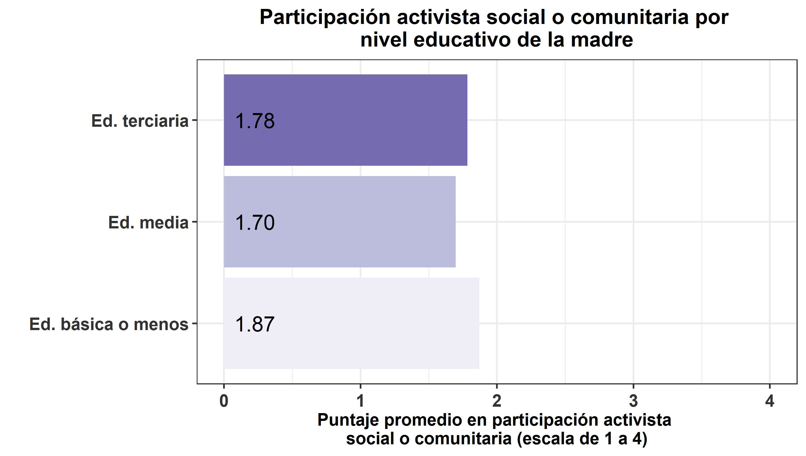

### Participación política durante el segundo semestre de 2021

```{r}
#### variable part_pol_com_21b
```

```{r}
# Creación de bbdd
data_ed_bas = data_wide %>%  filter(nse_madre==1 | nse_madre==2 | nse_madre==3 | nse_madre==4) %>% as.data.frame() # Sin Ed. (1), Ed. básica incompleta (2) o completa (3)
data_ed_med = data_wide %>%  filter(nse_madre==4 | nse_madre==5) %>% as.data.frame() # Ed. media incompleta (4) o completa (5)
data_ed_ter = data_wide %>%  filter(nse_madre==6 | nse_madre==7 | nse_madre==8 | nse_madre==9 | nse_madre==10) %>% as.data.frame() # técnico superior incompleto (6) o completo (7) Universitaria incompleta (8) o completa (9), Estudios de postgrado (magíster o doctorado) (10)

#data_ed_tec = data_wide %>%  filter(nse_madre==6 | nse_madre==7) %>% as.data.frame() # técnico superior incompleto (6) o completo (7)
#data_ed_uni = data_wide %>%  filter(nse_madre==8 | nse_madre==9 | nse_madre==10) %>% as.data.frame() # Universitaria incompleta (8) o completa (9), Estudios de postgrado (magíster o doctorado) (10)
```

```{r}
table_preposh1<- rbind(psych::describe(data_ed_bas$part_pol_com_21b, na.rm=T),
               psych::describe(data_ed_med$part_pol_com_21b, na.rm=T),
               psych::describe(data_ed_ter$part_pol_com_21b, na.rm=T))#,
#               psych::describe(data_ed_uni$part_pol_com_21b, na.rm=T))
table_preposh1 <- table_preposh1 %>% select(n,mean,sd,median,trimmed,min,max)

pond1 <- stats::weighted.mean(x=data_ed_bas$part_pol_com_21b,y=data_ed_bas$weight_w01,na.rm=TRUE)
pond2 <- stats::weighted.mean(x=data_ed_med$part_pol_com_21b,y=data_ed_med$weight_w01,na.rm=TRUE)
pond3 <- stats::weighted.mean(x=data_ed_ter$part_pol_com_21b,y=data_ed_ter$weight_w01,na.rm=TRUE)
#pond4 <- stats::weighted.mean(x=data_ed_uni$part_pol_com_21b,y=data_ed_uni$weight_w01,na.rm=TRUE)

table_preposh1[1,2]<-pond1
table_preposh1[2,2]<-pond2
table_preposh1[3,2]<-pond3
#table_preposh1[4,2]<-pond4

#table_preposh1$dep <- c("Ed. básica o menos","Ed. media","Técnico superior", "Universitaria o más")
table_preposh1$dep <- c("Ed. básica o menos","Ed. media","Ed. terciaria")

part_pol_com_21b_colegio <-  ggplot(data=table_preposh1, aes(x=dep, y=mean, fill=dep)) +
     geom_bar(position = 'dodge', stat='identity')+#,width=0.8) 
     scale_fill_brewer(palette="Purples") +
     geom_text(aes(label=format(round(mean,2)), y=0), position=position_dodge(0.9), hjust=-0.25, size=6) +
     theme_bw(base_size = 14) +
     scale_y_continuous(labels = scales::comma) +
     ylab('Puntaje promedio en participación activista 
social o comunitaria (escala de 1 a 4)') + xlab(' ') + 
  theme(legend.position="top") +
     labs(fill = " ") +
    coord_flip()+
    theme(axis.text.x = element_text(colour = "grey20", size = 14, angle = 360, hjust = 0.5, vjust = 0.5, face = "bold"),
          axis.text.y = element_text(colour = "grey20", size = 14), 
          text = element_text(size = 14, face = "bold"),
          plot.title = element_text(hjust=0.5),
          legend.position = "none") + 
     ggtitle("Participación activista social o comunitaria por 
nivel educativo de la madre") + ylim(0,4)
#part_pol_com_21b_colegio
ggsave(part_pol_com_21b_colegio, file = "../output/graphs/part_pol_com_21b_colegio_ed_madre.png",device = "png",width = 23,height = 13,dpi = "retina",units = "cm")
```


## Máximo nivel educativo del padre
### Participación política durante 3ro y 4to medio

```{r}
### Variable: part_pol_volunt
```

```{r}
# Creación de bbdd
data_ed_bas = data_wide %>%  filter(nse_padre==1 | nse_padre==2 | nse_padre==3 | nse_padre==4) %>% as.data.frame() # Sin Ed. (1), Ed. básica incompleta (2) o completa (3)
data_ed_med = data_wide %>%  filter(nse_padre==4 | nse_padre==5) %>% as.data.frame() # Ed. media incompleta (4) o completa (5)
data_ed_ter = data_wide %>%  filter(nse_padre==6 | nse_padre==7 | nse_padre==8 | nse_padre==9 | nse_padre==10) %>% as.data.frame() # técnico superior incompleto (6) o completo (7) Universitaria incompleta (8) o completa (9), Estudios de postgrado (magíster o doctorado) (10)

#data_ed_tec = data_wide %>%  filter(nse_padre==6 | nse_padre==7) %>% as.data.frame() # técnico superior incompleto (6) o completo (7)
#data_ed_uni = data_wide %>%  filter(nse_padre==8 | nse_padre==9 | nse_padre==10) %>% as.data.frame() # Universitaria incompleta (8) o completa (9), Estudios de postgrado (magíster o doctorado) (10)

```

```{r}
table_preposh1<- rbind(psych::describe(data_ed_bas$part_pol_volunt, na.rm=T),
               psych::describe(data_ed_med$part_pol_volunt, na.rm=T),
               psych::describe(data_ed_ter$part_pol_volunt, na.rm=T))#,
#               psych::describe(data_ed_uni$part_pol_volunt, na.rm=T))
table_preposh1 <- table_preposh1 %>% select(n,mean,sd,median,trimmed,min,max)

pond1 <- stats::weighted.mean(x=data_ed_bas$part_pol_volunt,y=data_ed_bas$weight_w01,na.rm=TRUE)
pond2 <- stats::weighted.mean(x=data_ed_med$part_pol_volunt,y=data_ed_med$weight_w01,na.rm=TRUE)
pond3 <- stats::weighted.mean(x=data_ed_ter$part_pol_volunt,y=data_ed_ter$weight_w01,na.rm=TRUE)
#pond4 <- stats::weighted.mean(x=data_ed_uni$part_pol_volunt,y=data_ed_uni$weight_w01,na.rm=TRUE)

table_preposh1[1,2]<-pond1
table_preposh1[2,2]<-pond2
table_preposh1[3,2]<-pond3
#table_preposh1[4,2]<-pond4

#table_preposh1$dep <- c("Ed. básica o menos","Ed. media","Técnico superior", "Universitaria o más")
table_preposh1$dep <- c("Ed. básica o menos","Ed. media","Ed. terciaria")

part_pol_volunt_colegio <-  ggplot(data=table_preposh1, aes(x=dep, y=mean, fill=dep)) +
     geom_bar(position = 'dodge', stat='identity')+#,width=0.8) 
     scale_fill_brewer(palette="Purples") +
     geom_text(aes(label=format(round(mean,2)), y=0), position=position_dodge(0.9), hjust=-0.25, size=6) +
     theme_bw(base_size = 14) +
     scale_y_continuous(labels = scales::comma) +
     ylab('Puntaje promedio en participación activista 
social o comunitaria (escala de 1 a 4)') + xlab(' ') + 
  theme(legend.position="top") +
     labs(fill = " ") +
    coord_flip()+
    theme(axis.text.x = element_text(colour = "grey20", size = 14, angle = 360, hjust = 0.5, vjust = 0.5, face = "bold"),
          axis.text.y = element_text(colour = "grey20", size = 14), 
          text = element_text(size = 14, face = "bold"),
          plot.title = element_text(hjust=0.5),
          legend.position = "none") + 
     ggtitle("Participación activista social o comunitaria por 
nivel educativo de la padre") + ylim(0,4)
#part_pol_volunt_colegio
ggsave(part_pol_volunt_colegio, file = "../output/graphs/part_pol_volunt_colegio_ed_padre.png",device = "png",width = 23,height = 13,dpi = "retina",units = "cm")

```


### Participación política durante estallido social

```{r}
### variable part_pol_com_21
```

```{r}
# Creación de bbdd
data_ed_bas = data_wide %>%  filter(nse_padre==1 | nse_padre==2 | nse_padre==3 | nse_padre==4) %>% as.data.frame() # Sin Ed. (1), Ed. básica incompleta (2) o completa (3)
data_ed_med = data_wide %>%  filter(nse_padre==4 | nse_padre==5) %>% as.data.frame() # Ed. media incompleta (4) o completa (5)
data_ed_ter = data_wide %>%  filter(nse_padre==6 | nse_padre==7 | nse_padre==8 | nse_padre==9 | nse_padre==10) %>% as.data.frame() # técnico superior incompleto (6) o completo (7) Universitaria incompleta (8) o completa (9), Estudios de postgrado (magíster o doctorado) (10)

#data_ed_tec = data_wide %>%  filter(nse_padre==6 | nse_padre==7) %>% as.data.frame() # técnico superior incompleto (6) o completo (7)
#data_ed_uni = data_wide %>%  filter(nse_padre==8 | nse_padre==9 | nse_padre==10) %>% as.data.frame() # Universitaria incompleta (8) o completa (9), Estudios de postgrado (magíster o doctorado) (10)

```

```{r}
table_preposh1<- rbind(psych::describe(data_ed_bas$part_pol_com_21, na.rm=T),
               psych::describe(data_ed_med$part_pol_com_21, na.rm=T),
               psych::describe(data_ed_ter$part_pol_com_21, na.rm=T))#,
#               psych::describe(data_ed_uni$part_pol_com_21, na.rm=T))
table_preposh1 <- table_preposh1 %>% select(n,mean,sd,median,trimmed,min,max)

pond1 <- stats::weighted.mean(x=data_ed_bas$part_pol_com_21,y=data_ed_bas$weight_w01,na.rm=TRUE)
pond2 <- stats::weighted.mean(x=data_ed_med$part_pol_com_21,y=data_ed_med$weight_w01,na.rm=TRUE)
pond3 <- stats::weighted.mean(x=data_ed_ter$part_pol_com_21,y=data_ed_ter$weight_w01,na.rm=TRUE)
#pond4 <- stats::weighted.mean(x=data_ed_uni$part_pol_com_21,y=data_ed_uni$weight_w01,na.rm=TRUE)

table_preposh1[1,2]<-pond1
table_preposh1[2,2]<-pond2
table_preposh1[3,2]<-pond3
#table_preposh1[4,2]<-pond4

#table_preposh1$dep <- c("Ed. básica o menos","Ed. media","Técnico superior", "Universitaria o más")
table_preposh1$dep <- c("Ed. básica o menos","Ed. media","Ed. terciaria")

part_pol_com_21_colegio <-  ggplot(data=table_preposh1, aes(x=dep, y=mean, fill=dep)) +
     geom_bar(position = 'dodge', stat='identity')+#,width=0.8) 
     scale_fill_brewer(palette="Purples") +
     geom_text(aes(label=format(round(mean,2)), y=0), position=position_dodge(0.9), hjust=-0.25, size=6) +
     theme_bw(base_size = 14) +
     scale_y_continuous(labels = scales::comma) +
     ylab('Puntaje promedio en participación activista 
social o comunitaria (escala de 1 a 4)') + xlab(' ') + 
  theme(legend.position="top") +
     labs(fill = " ") +
    coord_flip()+
    theme(axis.text.x = element_text(colour = "grey20", size = 14, angle = 360, hjust = 0.5, vjust = 0.5, face = "bold"),
          axis.text.y = element_text(colour = "grey20", size = 14), 
          text = element_text(size = 14, face = "bold"),
          plot.title = element_text(hjust=0.5),
          legend.position = "none") + 
     ggtitle("Participación activista social o comunitaria por 
nivel educativo de la padre") + ylim(0,4)
#part_pol_com_21_colegio
ggsave(part_pol_com_21_colegio, file = "../output/graphs/part_pol_com_21_colegio_ed_padre.png",device = "png",width = 23,height = 13,dpi = "retina",units = "cm")

```
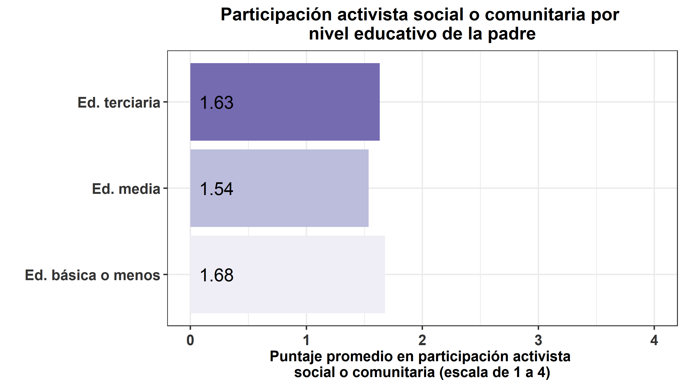

### Participación política durante el 2020

```{r}
### variable part_pol_com_20
```

```{r}
# Creación de bbdd
data_ed_bas = data_wide %>%  filter(nse_padre==1 | nse_padre==2 | nse_padre==3 | nse_padre==4) %>% as.data.frame() # Sin Ed. (1), Ed. básica incompleta (2) o completa (3)
data_ed_med = data_wide %>%  filter(nse_padre==4 | nse_padre==5) %>% as.data.frame() # Ed. media incompleta (4) o completa (5)
data_ed_ter = data_wide %>%  filter(nse_padre==6 | nse_padre==7 | nse_padre==8 | nse_padre==9 | nse_padre==10) %>% as.data.frame() # técnico superior incompleto (6) o completo (7) Universitaria incompleta (8) o completa (9), Estudios de postgrado (magíster o doctorado) (10)

#data_ed_tec = data_wide %>%  filter(nse_padre==6 | nse_padre==7) %>% as.data.frame() # técnico superior incompleto (6) o completo (7)
#data_ed_uni = data_wide %>%  filter(nse_padre==8 | nse_padre==9 | nse_padre==10) %>% as.data.frame() # Universitaria incompleta (8) o completa (9), Estudios de postgrado (magíster o doctorado) (10)

```

```{r}
table_preposh1<- rbind(psych::describe(data_ed_bas$part_pol_com_20, na.rm=T),
               psych::describe(data_ed_med$part_pol_com_20, na.rm=T),
               psych::describe(data_ed_ter$part_pol_com_20, na.rm=T))#,
#               psych::describe(data_ed_uni$part_pol_com_20, na.rm=T))
table_preposh1 <- table_preposh1 %>% select(n,mean,sd,median,trimmed,min,max)

pond1 <- stats::weighted.mean(x=data_ed_bas$part_pol_com_20,y=data_ed_bas$weight_w01,na.rm=TRUE)
pond2 <- stats::weighted.mean(x=data_ed_med$part_pol_com_20,y=data_ed_med$weight_w01,na.rm=TRUE)
pond3 <- stats::weighted.mean(x=data_ed_ter$part_pol_com_20,y=data_ed_ter$weight_w01,na.rm=TRUE)
#pond4 <- stats::weighted.mean(x=data_ed_uni$part_pol_com_20,y=data_ed_uni$weight_w01,na.rm=TRUE)

table_preposh1[1,2]<-pond1
table_preposh1[2,2]<-pond2
table_preposh1[3,2]<-pond3
#table_preposh1[4,2]<-pond4

#table_preposh1$dep <- c("Ed. básica o menos","Ed. media","Técnico superior", "Universitaria o más")
table_preposh1$dep <- c("Ed. básica o menos","Ed. media","Ed. terciaria")

part_pol_com_20_colegio <-  ggplot(data=table_preposh1, aes(x=dep, y=mean, fill=dep)) +
     geom_bar(position = 'dodge', stat='identity')+#,width=0.8) 
     scale_fill_brewer(palette="Purples") +
     geom_text(aes(label=format(round(mean,2)), y=0), position=position_dodge(0.9), hjust=-0.25, size=6) +
     theme_bw(base_size = 14) +
     scale_y_continuous(labels = scales::comma) +
     ylab('Puntaje promedio en participación activista 
social o comunitaria (escala de 1 a 4)') + xlab(' ') + 
  theme(legend.position="top") +
     labs(fill = " ") +
    coord_flip()+
    theme(axis.text.x = element_text(colour = "grey20", size = 14, angle = 360, hjust = 0.5, vjust = 0.5, face = "bold"),
          axis.text.y = element_text(colour = "grey20", size = 14), 
          text = element_text(size = 14, face = "bold"),
          plot.title = element_text(hjust=0.5),
          legend.position = "none") + 
     ggtitle("Participación activista social o comunitaria por 
nivel educativo de la padre") + ylim(0,4)
#part_pol_com_20_colegio
ggsave(part_pol_com_20_colegio, file = "../output/graphs/part_pol_com_20_colegio_ed_padre.png",device = "png",width = 23,height = 13,dpi = "retina",units = "cm")
```


### Participación política durante el primer semestre de 2021

```{r}
#### variable part_pol_com
```

```{r}
# Creación de bbdd
data_ed_bas = data_wide %>%  filter(nse_padre==1 | nse_padre==2 | nse_padre==3 | nse_padre==4) %>% as.data.frame() # Sin Ed. (1), Ed. básica incompleta (2) o completa (3)
data_ed_med = data_wide %>%  filter(nse_padre==4 | nse_padre==5) %>% as.data.frame() # Ed. media incompleta (4) o completa (5)
data_ed_ter = data_wide %>%  filter(nse_padre==6 | nse_padre==7 | nse_padre==8 | nse_padre==9 | nse_padre==10) %>% as.data.frame() # técnico superior incompleto (6) o completo (7) Universitaria incompleta (8) o completa (9), Estudios de postgrado (magíster o doctorado) (10)

#data_ed_tec = data_wide %>%  filter(nse_padre==6 | nse_padre==7) %>% as.data.frame() # técnico superior incompleto (6) o completo (7)
#data_ed_uni = data_wide %>%  filter(nse_padre==8 | nse_padre==9 | nse_padre==10) %>% as.data.frame() # Universitaria incompleta (8) o completa (9), Estudios de postgrado (magíster o doctorado) (10)

```

```{r}
table_preposh1<- rbind(psych::describe(data_ed_bas$part_pol_com, na.rm=T),
               psych::describe(data_ed_med$part_pol_com, na.rm=T),
               psych::describe(data_ed_ter$part_pol_com, na.rm=T))#,
#               psych::describe(data_ed_uni$part_pol_com, na.rm=T))
table_preposh1 <- table_preposh1 %>% select(n,mean,sd,median,trimmed,min,max)

pond1 <- stats::weighted.mean(x=data_ed_bas$part_pol_com,y=data_ed_bas$weight_w01,na.rm=TRUE)
pond2 <- stats::weighted.mean(x=data_ed_med$part_pol_com,y=data_ed_med$weight_w01,na.rm=TRUE)
pond3 <- stats::weighted.mean(x=data_ed_ter$part_pol_com,y=data_ed_ter$weight_w01,na.rm=TRUE)
#pond4 <- stats::weighted.mean(x=data_ed_uni$part_pol_com,y=data_ed_uni$weight_w01,na.rm=TRUE)

table_preposh1[1,2]<-pond1
table_preposh1[2,2]<-pond2
table_preposh1[3,2]<-pond3
#table_preposh1[4,2]<-pond4

#table_preposh1$dep <- c("Ed. básica o menos","Ed. media","Técnico superior", "Universitaria o más")
table_preposh1$dep <- c("Ed. básica o menos","Ed. media","Ed. terciaria")

part_pol_com_colegio <-  ggplot(data=table_preposh1, aes(x=dep, y=mean, fill=dep)) +
     geom_bar(position = 'dodge', stat='identity')+#,width=0.8) 
     scale_fill_brewer(palette="Purples") +
     geom_text(aes(label=format(round(mean,2)), y=0), position=position_dodge(0.9), hjust=-0.25, size=6) +
     theme_bw(base_size = 14) +
     scale_y_continuous(labels = scales::comma) +
     ylab('Puntaje promedio en participación activista 
social o comunitaria (escala de 1 a 4)') + xlab(' ') + 
  theme(legend.position="top") +
     labs(fill = " ") +
    coord_flip()+
    theme(axis.text.x = element_text(colour = "grey20", size = 14, angle = 360, hjust = 0.5, vjust = 0.5, face = "bold"),
          axis.text.y = element_text(colour = "grey20", size = 14), 
          text = element_text(size = 14, face = "bold"),
          plot.title = element_text(hjust=0.5),
          legend.position = "none") + 
     ggtitle("Participación activista social o comunitaria por 
nivel educativo de la padre") + ylim(0,4)
#part_pol_com_colegio
ggsave(part_pol_com_colegio, file = "../output/graphs/part_pol_com_colegio_ed_padre.png",device = "png",width = 23,height = 13,dpi = "retina",units = "cm")
```


### Participación política durante el segundo semestre de 2021

```{r}
#### variable part_pol_com_21b
```

```{r}
# Creación de bbdd
data_ed_bas = data_wide %>%  filter(nse_padre==1 | nse_padre==2 | nse_padre==3 | nse_padre==4) %>% as.data.frame() # Sin Ed. (1), Ed. básica incompleta (2) o completa (3)
data_ed_med = data_wide %>%  filter(nse_padre==4 | nse_padre==5) %>% as.data.frame() # Ed. media incompleta (4) o completa (5)
data_ed_ter = data_wide %>%  filter(nse_padre==6 | nse_padre==7 | nse_padre==8 | nse_padre==9 | nse_padre==10) %>% as.data.frame() # técnico superior incompleto (6) o completo (7) Universitaria incompleta (8) o completa (9), Estudios de postgrado (magíster o doctorado) (10)

#data_ed_tec = data_wide %>%  filter(nse_padre==6 | nse_padre==7) %>% as.data.frame() # técnico superior incompleto (6) o completo (7)
#data_ed_uni = data_wide %>%  filter(nse_padre==8 | nse_padre==9 | nse_padre==10) %>% as.data.frame() # Universitaria incompleta (8) o completa (9), Estudios de postgrado (magíster o doctorado) (10)

```

```{r}
table_preposh1<- rbind(psych::describe(data_ed_bas$part_pol_com_21b, na.rm=T),
               psych::describe(data_ed_med$part_pol_com_21b, na.rm=T),
               psych::describe(data_ed_ter$part_pol_com_21b, na.rm=T))#,
#               psych::describe(data_ed_uni$part_pol_com_21b, na.rm=T))
table_preposh1 <- table_preposh1 %>% select(n,mean,sd,median,trimmed,min,max)

pond1 <- stats::weighted.mean(x=data_ed_bas$part_pol_com_21b,y=data_ed_bas$weight_w01,na.rm=TRUE)
pond2 <- stats::weighted.mean(x=data_ed_med$part_pol_com_21b,y=data_ed_med$weight_w01,na.rm=TRUE)
pond3 <- stats::weighted.mean(x=data_ed_ter$part_pol_com_21b,y=data_ed_ter$weight_w01,na.rm=TRUE)
#pond4 <- stats::weighted.mean(x=data_ed_uni$part_pol_com_21b,y=data_ed_uni$weight_w01,na.rm=TRUE)

table_preposh1[1,2]<-pond1
table_preposh1[2,2]<-pond2
table_preposh1[3,2]<-pond3
#table_preposh1[4,2]<-pond4

#table_preposh1$dep <- c("Ed. básica o menos","Ed. media","Técnico superior", "Universitaria o más")
table_preposh1$dep <- c("Ed. básica o menos","Ed. media","Ed. terciaria")

part_pol_com_21b_colegio <-  ggplot(data=table_preposh1, aes(x=dep, y=mean, fill=dep)) +
     geom_bar(position = 'dodge', stat='identity')+#,width=0.8) 
     scale_fill_brewer(palette="Purples") +
     geom_text(aes(label=format(round(mean,2)), y=0), position=position_dodge(0.9), hjust=-0.25, size=6) +
     theme_bw(base_size = 14) +
     scale_y_continuous(labels = scales::comma) +
     ylab('Puntaje promedio en participación activista 
social o comunitaria (escala de 1 a 4)') + xlab(' ') + 
  theme(legend.position="top") +
     labs(fill = " ") +
    coord_flip()+
    theme(axis.text.x = element_text(colour = "grey20", size = 14, angle = 360, hjust = 0.5, vjust = 0.5, face = "bold"),
          axis.text.y = element_text(colour = "grey20", size = 14), 
          text = element_text(size = 14, face = "bold"),
          plot.title = element_text(hjust=0.5),
          legend.position = "none") + 
     ggtitle("Participación activista social o comunitaria por 
nivel educativo de la padre") + ylim(0,4)
#part_pol_com_21b_colegio
ggsave(part_pol_com_21b_colegio, file = "../output/graphs/part_pol_com_21b_colegio_ed_padre.png",device = "png",width = 23,height = 13,dpi = "retina",units = "cm")
```


## Frecuencia de conversación con los padres sobre temas sociales y/o políticos
### Participación política durante 3ro y 4to medio

```{r}
### Variable: part_pol_volunt
```

```{r}
# Creación de bbdd
data_nunca = data_wide %>%  filter(conv_padr_poli==1) %>% as.data.frame() # Nunca
data_casi_nunca = data_wide %>%  filter(conv_padr_poli==2) %>% as.data.frame() # Casi nunca
data_a_veces = data_wide %>%  filter(conv_padr_poli==3) %>% as.data.frame() # A veces
data_frecuent = data_wide %>%  filter(conv_padr_poli==4) %>% as.data.frame() # Frecuentemente
```

```{r}
table_preposh1<- rbind(psych::describe(data_nunca$part_pol_volunt, na.rm=T),
               psych::describe(data_casi_nunca$part_pol_volunt, na.rm=T),
               psych::describe(data_a_veces$part_pol_volunt, na.rm=T),
               psych::describe(data_frecuent$part_pol_volunt, na.rm=T))
table_preposh1 <- table_preposh1 %>% select(n,mean,sd,median,trimmed,min,max)

pond1 <- stats::weighted.mean(x=data_nunca$part_pol_volunt,y=data_nunca$weight_w01,na.rm=TRUE)
pond2 <- stats::weighted.mean(x=data_casi_nunca$part_pol_volunt,y=data_casi_nunca$weight_w01,na.rm=TRUE)
pond3 <- stats::weighted.mean(x=data_a_veces$part_pol_volunt,y=data_a_veces$weight_w01,na.rm=TRUE)
pond4 <- stats::weighted.mean(x=data_frecuent$part_pol_volunt,y=data_frecuent$weight_w01,na.rm=TRUE)

table_preposh1[1,2]<-pond1
table_preposh1[2,2]<-pond2
table_preposh1[3,2]<-pond3
table_preposh1[4,2]<-pond4

table_preposh1$dep <- c("1. Nunca","2. Casi nunca","3. A veces", "4. Frecuentemente")

part_pol_volunt_colegio <-  ggplot(data=table_preposh1, aes(x=dep, y=mean, fill=dep)) +
     geom_bar(position = 'dodge', stat='identity')+#,width=0.8) 
     scale_fill_brewer(palette="Purples") +
     geom_text(aes(label=format(round(mean,2)), y=0), position=position_dodge(0.9), hjust=-0.25, size=6) +
     theme_bw(base_size = 14) +
     scale_y_continuous(labels = scales::comma) +
     ylab('Puntaje promedio en participación activista 
social o comunitaria (escala de 1 a 4)') + xlab(' ') + 
  theme(legend.position="top") +
     labs(fill = " ") +
    coord_flip()+
    theme(axis.text.x = element_text(colour = "grey20", size = 14, angle = 360, hjust = 0.5, vjust = 0.5, face = "bold"),
          axis.text.y = element_text(colour = "grey20", size = 14), 
          text = element_text(size = 14, face = "bold"),
          plot.title = element_text(hjust=0.5),
          legend.position = "none") + 
     ggtitle("Participación activista social o comunitaria por 
conversación con los padres sobre temas políticos y/o sociales") + ylim(0,4)
#part_pol_volunt_colegio
ggsave(part_pol_volunt_colegio, file = "../output/graphs/part_pol_volunt_colegio_conv_padres.png",device = "png",width = 23,height = 13,dpi = "retina",units = "cm")

```


### Participación política durante estallido social

```{r}
### variable part_pol_com_21
```

```{r}
# Creación de bbdd
data_nunca = data_wide %>%  filter(conv_padres_21==1) %>% as.data.frame() # Nunca
data_casi_nunca = data_wide %>%  filter(conv_padres_21==2) %>% as.data.frame() # Casi nunca
data_a_veces = data_wide %>%  filter(conv_padres_21==3) %>% as.data.frame() # A veces
data_frecuent = data_wide %>%  filter(conv_padres_21==4) %>% as.data.frame() # Frecuentemente
```

```{r}
table_preposh1<- rbind(psych::describe(data_nunca$part_pol_com_21, na.rm=T),
               psych::describe(data_casi_nunca$part_pol_com_21, na.rm=T),
               psych::describe(data_a_veces$part_pol_com_21, na.rm=T),
               psych::describe(data_frecuent$part_pol_com_21, na.rm=T))
table_preposh1 <- table_preposh1 %>% select(n,mean,sd,median,trimmed,min,max)

pond1 <- stats::weighted.mean(x=data_nunca$part_pol_com_21,y=data_nunca$weight_w01,na.rm=TRUE)
pond2 <- stats::weighted.mean(x=data_casi_nunca$part_pol_com_21,y=data_casi_nunca$weight_w01,na.rm=TRUE)
pond3 <- stats::weighted.mean(x=data_a_veces$part_pol_com_21,y=data_a_veces$weight_w01,na.rm=TRUE)
pond4 <- stats::weighted.mean(x=data_frecuent$part_pol_com_21,y=data_frecuent$weight_w01,na.rm=TRUE)

table_preposh1[1,2]<-pond1
table_preposh1[2,2]<-pond2
table_preposh1[3,2]<-pond3
table_preposh1[4,2]<-pond4

table_preposh1$dep <- c("1. Nunca","2. Casi nunca","3. A veces", "4. Frecuentemente")

part_pol_com_21_colegio <-  ggplot(data=table_preposh1, aes(x=dep, y=mean, fill=dep)) +
     geom_bar(position = 'dodge', stat='identity')+#,width=0.8) 
     scale_fill_brewer(palette="Purples") +
     geom_text(aes(label=format(round(mean,2)), y=0), position=position_dodge(0.9), hjust=-0.25, size=6) +
     theme_bw(base_size = 14) +
     scale_y_continuous(labels = scales::comma) +
     ylab('Puntaje promedio en participación activista 
social o comunitaria (escala de 1 a 4)') + xlab(' ') + 
  theme(legend.position="top") +
     labs(fill = " ") +
    coord_flip()+
    theme(axis.text.x = element_text(colour = "grey20", size = 14, angle = 360, hjust = 0.5, vjust = 0.5, face = "bold"),
          axis.text.y = element_text(colour = "grey20", size = 14), 
          text = element_text(size = 14, face = "bold"),
          plot.title = element_text(hjust=0.5),
          legend.position = "none") + 
     ggtitle("Participación activista social o comunitaria por 
conversación con los padres sobre temas políticos y/o sociales") + ylim(0,4)
#part_pol_com_21_colegio
ggsave(part_pol_com_21_colegio, file = "../output/graphs/part_pol_com_21_colegio_conv_padres.png",device = "png",width = 23,height = 13,dpi = "retina",units = "cm")

```


### Participación política durante el 2020

```{r}
### variable part_pol_com_20
```

```{r}
# Creación de bbdd
data_nunca = data_wide %>%  filter(conv_padres_20==1) %>% as.data.frame() # Nunca
data_casi_nunca = data_wide %>%  filter(conv_padres_20==2) %>% as.data.frame() # Casi nunca
data_a_veces = data_wide %>%  filter(conv_padres_20==3) %>% as.data.frame() # A veces
data_frecuent = data_wide %>%  filter(conv_padres_20==4) %>% as.data.frame() # Frecuentemente
```

```{r}
table_preposh1<- rbind(psych::describe(data_nunca$part_pol_com_20, na.rm=T),
               psych::describe(data_casi_nunca$part_pol_com_20, na.rm=T),
               psych::describe(data_a_veces$part_pol_com_20, na.rm=T),
               psych::describe(data_frecuent$part_pol_com_20, na.rm=T))
table_preposh1 <- table_preposh1 %>% select(n,mean,sd,median,trimmed,min,max)

pond1 <- stats::weighted.mean(x=data_nunca$part_pol_com_20,y=data_nunca$weight_w01,na.rm=TRUE)
pond2 <- stats::weighted.mean(x=data_casi_nunca$part_pol_com_20,y=data_casi_nunca$weight_w01,na.rm=TRUE)
pond3 <- stats::weighted.mean(x=data_a_veces$part_pol_com_20,y=data_a_veces$weight_w01,na.rm=TRUE)
pond4 <- stats::weighted.mean(x=data_frecuent$part_pol_com_20,y=data_frecuent$weight_w01,na.rm=TRUE)

table_preposh1[1,2]<-pond1
table_preposh1[2,2]<-pond2
table_preposh1[3,2]<-pond3
table_preposh1[4,2]<-pond4

table_preposh1$dep <- c("1. Nunca","2. Casi nunca","3. A veces", "4. Frecuentemente")

part_pol_com_20_colegio <-  ggplot(data=table_preposh1, aes(x=dep, y=mean, fill=dep)) +
     geom_bar(position = 'dodge', stat='identity')+#,width=0.8) 
     scale_fill_brewer(palette="Purples") +
     geom_text(aes(label=format(round(mean,2)), y=0), position=position_dodge(0.9), hjust=-0.25, size=6) +
     theme_bw(base_size = 14) +
     scale_y_continuous(labels = scales::comma) +
     ylab('Puntaje promedio en participación activista 
social o comunitaria (escala de 1 a 4)') + xlab(' ') + 
  theme(legend.position="top") +
     labs(fill = " ") +
    coord_flip()+
    theme(axis.text.x = element_text(colour = "grey20", size = 14, angle = 360, hjust = 0.5, vjust = 0.5, face = "bold"),
          axis.text.y = element_text(colour = "grey20", size = 14), 
          text = element_text(size = 14, face = "bold"),
          plot.title = element_text(hjust=0.5),
          legend.position = "none") + 
     ggtitle("Participación activista social o comunitaria por 
conversación con los padres sobre temas políticos y/o sociales") + ylim(0,4)
#part_pol_com_20_colegio
ggsave(part_pol_com_20_colegio, file = "../output/graphs/part_pol_com_20_colegio_conv_padres.png",device = "png",width = 23,height = 13,dpi = "retina",units = "cm")
```

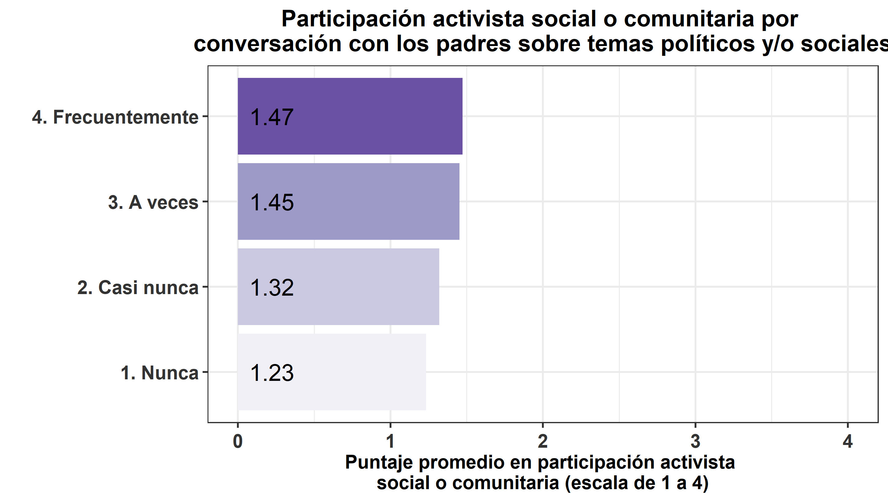

### Participación política durante el primer semestre de 2021

```{r}
#### variable part_pol_com
```

```{r}
# Creación de bbdd
data_nunca = data_wide %>%  filter(conv_padres==1) %>% as.data.frame() # Nunca
data_casi_nunca = data_wide %>%  filter(conv_padres==2) %>% as.data.frame() # Casi nunca
data_a_veces = data_wide %>%  filter(conv_padres==3) %>% as.data.frame() # A veces
data_frecuent = data_wide %>%  filter(conv_padres==4) %>% as.data.frame() # Frecuentemente
```

```{r}
table_preposh1<- rbind(psych::describe(data_nunca$part_pol_com, na.rm=T),
               psych::describe(data_casi_nunca$part_pol_com, na.rm=T),
               psych::describe(data_a_veces$part_pol_com, na.rm=T),
               psych::describe(data_frecuent$part_pol_com, na.rm=T))
table_preposh1 <- table_preposh1 %>% select(n,mean,sd,median,trimmed,min,max)

pond1 <- stats::weighted.mean(x=data_nunca$part_pol_com,y=data_nunca$weight_w01,na.rm=TRUE)
pond2 <- stats::weighted.mean(x=data_casi_nunca$part_pol_com,y=data_casi_nunca$weight_w01,na.rm=TRUE)
pond3 <- stats::weighted.mean(x=data_a_veces$part_pol_com,y=data_a_veces$weight_w01,na.rm=TRUE)
pond4 <- stats::weighted.mean(x=data_frecuent$part_pol_com,y=data_frecuent$weight_w01,na.rm=TRUE)

table_preposh1[1,2]<-pond1
table_preposh1[2,2]<-pond2
table_preposh1[3,2]<-pond3
table_preposh1[4,2]<-pond4

table_preposh1$dep <- c("1. Nunca","2. Casi nunca","3. A veces", "4. Frecuentemente")

part_pol_com_colegio <-  ggplot(data=table_preposh1, aes(x=dep, y=mean, fill=dep)) +
     geom_bar(position = 'dodge', stat='identity')+#,width=0.8) 
     scale_fill_brewer(palette="Purples") +
     geom_text(aes(label=format(round(mean,2)), y=0), position=position_dodge(0.9), hjust=-0.25, size=6) +
     theme_bw(base_size = 14) +
     scale_y_continuous(labels = scales::comma) +
     ylab('Puntaje promedio en participación activista 
social o comunitaria (escala de 1 a 4)') + xlab(' ') + 
  theme(legend.position="top") +
     labs(fill = " ") +
    coord_flip()+
    theme(axis.text.x = element_text(colour = "grey20", size = 14, angle = 360, hjust = 0.5, vjust = 0.5, face = "bold"),
          axis.text.y = element_text(colour = "grey20", size = 14), 
          text = element_text(size = 14, face = "bold"),
          plot.title = element_text(hjust=0.5),
          legend.position = "none") + 
     ggtitle("Participación activista social o comunitaria por 
conversación con los padres sobre temas políticos y/o sociales") + ylim(0,4)
#part_pol_com_colegio
ggsave(part_pol_com_colegio, file = "../output/graphs/part_pol_com_colegio_conv_padres.png",device = "png",width = 23,height = 13,dpi = "retina",units = "cm")
```

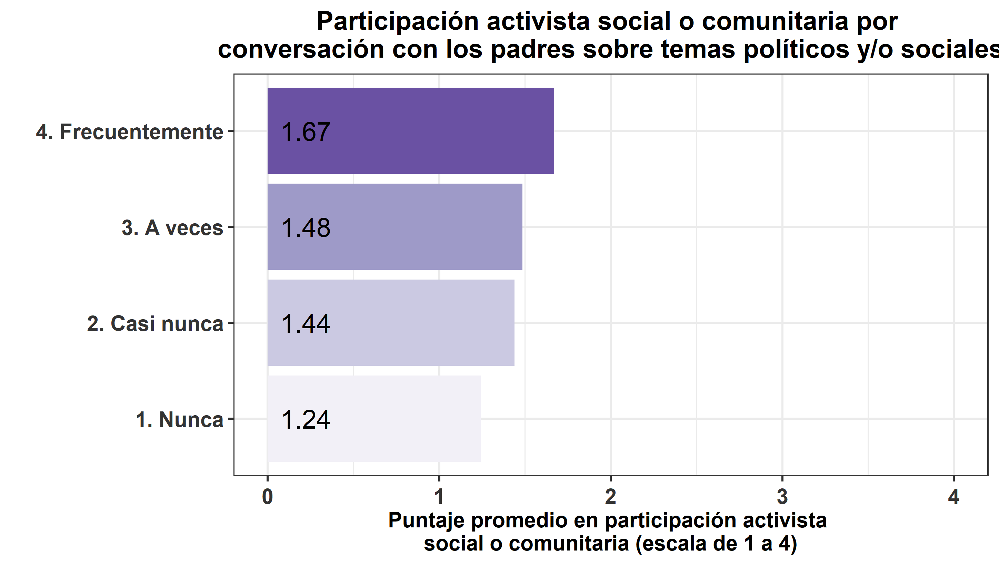

### Participación política durante el segundo semestre de 2021

```{r}
#### variable part_pol_com_21b
```

```{r}
# Creación de bbdd
data_nunca = data_wide %>%  filter(conv_padres_21b==1) %>% as.data.frame() # Nunca
data_casi_nunca = data_wide %>%  filter(conv_padres_21b==2) %>% as.data.frame() # Casi nunca
data_a_veces = data_wide %>%  filter(conv_padres_21b==3) %>% as.data.frame() # A veces
data_frecuent = data_wide %>%  filter(conv_padres_21b==4) %>% as.data.frame() # Frecuentemente
```

```{r}
table_preposh1<- rbind(psych::describe(data_nunca$part_pol_com_21b, na.rm=T),
               psych::describe(data_casi_nunca$part_pol_com_21b, na.rm=T),
               psych::describe(data_a_veces$part_pol_com_21b, na.rm=T),
               psych::describe(data_frecuent$part_pol_com_21b, na.rm=T))
table_preposh1 <- table_preposh1 %>% select(n,mean,sd,median,trimmed,min,max)

pond1 <- stats::weighted.mean(x=data_nunca$part_pol_com_21b,y=data_nunca$weight_w01,na.rm=TRUE)
pond2 <- stats::weighted.mean(x=data_casi_nunca$part_pol_com_21b,y=data_casi_nunca$weight_w01,na.rm=TRUE)
pond3 <- stats::weighted.mean(x=data_a_veces$part_pol_com_21b,y=data_a_veces$weight_w01,na.rm=TRUE)
pond4 <- stats::weighted.mean(x=data_frecuent$part_pol_com_21b,y=data_frecuent$weight_w01,na.rm=TRUE)

table_preposh1[1,2]<-pond1
table_preposh1[2,2]<-pond2
table_preposh1[3,2]<-pond3
table_preposh1[4,2]<-pond4

table_preposh1$dep <- c("1. Nunca","2. Casi nunca","3. A veces", "4. Frecuentemente")

part_pol_com_21b_colegio <-  ggplot(data=table_preposh1, aes(x=dep, y=mean, fill=dep)) +
     geom_bar(position = 'dodge', stat='identity')+#,width=0.8) 
     scale_fill_brewer(palette="Purples") +
     geom_text(aes(label=format(round(mean,2)), y=0), position=position_dodge(0.9), hjust=-0.25, size=6) +
     theme_bw(base_size = 14) +
     scale_y_continuous(labels = scales::comma) +
     ylab('Puntaje promedio en participación activista 
social o comunitaria (escala de 1 a 4)') + xlab(' ') + 
  theme(legend.position="top") +
     labs(fill = " ") +
    coord_flip()+
    theme(axis.text.x = element_text(colour = "grey20", size = 14, angle = 360, hjust = 0.5, vjust = 0.5, face = "bold"),
          axis.text.y = element_text(colour = "grey20", size = 14), 
          text = element_text(size = 14, face = "bold"),
          plot.title = element_text(hjust=0.5),
          legend.position = "none") + 
     ggtitle("Participación activista social o comunitaria por 
conversación con los padres sobre temas políticos y/o sociales") + ylim(0,4)
#part_pol_com_21b_colegio
ggsave(part_pol_com_21b_colegio, file = "../output/graphs/part_pol_com_21b_colegio_conv_padres.png",device = "png",width = 23,height = 13,dpi = "retina",units = "cm")
```


